# AMD 基本面深度分析報告

> **報告日期**：2026-02-25 ｜ **語言**：繁體中文 ｜ **數據來源**：Yahoo Finance ｜ **分析師**：AI CFA Research Engine v2.0

---

## 目錄

1. [執行摘要](#1-執行摘要)
2. [公司概覽與商業模式](#2-公司概覽與商業模式)
3. [損益表深度分析](#3-損益表深度分析)
4. [資產負債表分析](#4-資產負債表分析)
5. [現金流量深度分析](#5-現金流量深度分析)
6. [獲利能力與資本效率](#6-獲利能力與資本效率)
7. [估值深度分析](#7-估值深度分析)
8. [成長催化劑](#8-成長催化劑)
9. [風險矩陣](#9-風險矩陣)
10. [投資建議](#10-投資建議)

---

## 1. 執行摘要

### 1.1 核心評分儀表板

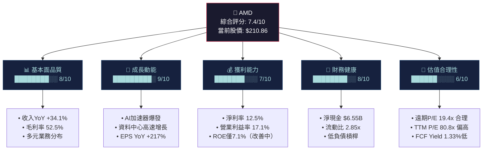

---

### 1.2 5大投資論點 + 3大風險

| 類型 | 論點/風險 | 說明 | 重要性 | 信心度 |
|:---:|:---|:---|:---:|:---:|
| 🟢 多頭 | **AI加速器市場爆發** | Instinct MI300/MI325X系列打入超大規模雲端客戶（Microsoft, Meta），FY2025資料中心營收估超$15B | ⭐⭐⭐⭐⭐ | 高 |
| 🟢 多頭 | **盈餘槓桿驚人** | YoY EPS成長217%，FY2025 EPS TTM $2.61→Forward $10.87，顯示利潤率正在大幅擴張 | ⭐⭐⭐⭐⭐ | 高 |
| 🟢 多頭 | **x86 CPU市場份額持續搶奪** | EPYC第5代（Turin）在企業伺服器市場對Intel持續施壓，技術代差明顯 | ⭐⭐⭐⭐ | 高 |
| 🟢 多頭 | **FCF爆炸性成長** | FY2025 FCF $6.74B vs FY2024 $2.40B，YoY成長**+180.8%**，現金造血能力大幅提升 | ⭐⭐⭐⭐ | 高 |
| 🟢 多頭 | **軟體生態（ROCm）逐漸成熟** | ROCm平台持續迭代，降低從CUDA遷移門檻，企業客戶採用率上升 | ⭐⭐⭐ | 中 |
| 🔴 風險 | **NVIDIA競爭護城河極深** | CUDA生態系統10年積累，H100/B200系列供不應求，AMD AI GPU市佔率仍遠遜於NVIDIA | ⭐⭐⭐⭐⭐ | 高 |
| 🟡 風險 | **客戶集中度疑慮** | AI GPU需求過度依賴少數超大規模客戶，資本支出循環一旦放緩衝擊巨大 | ⭐⭐⭐⭐ | 中 |
| 🔴 風險 | **Gaming/Embedded業務疲弱** | 遊戲業務持續承壓，Embedded業務庫存消化仍緩慢，拖累整體利潤率改善 | ⭐⭐⭐ | 中 |

---

### 1.3 快速統計卡片

| 指標 | AMD 數值 | 半導體行業均值 | 狀態 | 備注 |
|:---|:---:|:---:|:---:|:---|
| 市值 | $343.79B | — | — | 全球前5大晶片股 |
| 本益比（TTM） | 80.8x | ~35x | 🔴 | 顯著高於均值 |
| 本益比（Forward） | 19.4x | ~22x | 🟢 | 低於行業前瞻均值 |
| EV/EBITDA | 50.7x | ~25x | 🔴 | EBITDA擴張中，倍數仍高 |
| 毛利率 | 52.5% | ~50% | 🟢 | 高附加值產品組合改善 |
| 營業利益率 | 17.1% | ~20% | 🟡 | R&D費用高，仍有提升空間 |
| 淨利率 | 12.5% | ~18% | 🟡 | 攤銷負擔重（Xilinx收購） |
| 收入YoY成長 | +34.1% | ~15% | 🟢 | 遠超行業平均 |
| FCF/收入 | 19.5% | ~18% | 🟢 | 強勁的現金轉換率 |
| 流動比率 | 2.85x | ~2.0x | 🟢 | 流動性充裕 |
| 淨現金 | +$6.55B | 正現金 | 🟢 | 淨現金狀態，財務穩健 |
| ROE | 7.1% | ~20% | 🔴 | Xilinx商譽攤稀分母 |
| Beta | 1.949 | 1.3 | 🔴 | 高波動性，風險溢價高 |

---

### 1.4 投資結論

```
╔══════════════════════════════════════════════════════════╗
║                   🎯 投資結論                            ║
╠══════════════════════════════════════════════════════════╣
║  評級：★★★★☆  【積極買入 / Outperform】              ║
║                                                          ║
║  目標價區間（12個月）：                                  ║
║  ├── 🐂 樂觀情境：$340 - $365  （潛在漲幅 +61~+73%）   ║
║  ├── 📊 基準情境：$285 - $310  （潛在漲幅 +35~+47%）   ║
║  └── 🐻 悲觀情境：$185 - $220  （潛在下行 -12~+4%）    ║
║                                                          ║
║  分析師共識目標：$289.81（+37.4% 上行空間）             ║
║  當前股價 $210.86 處於合理偏低區間                       ║
╚══════════════════════════════════════════════════════════╝
```

---

## 2. 公司概覽與商業模式

### 2.1 業務結構與收入來源

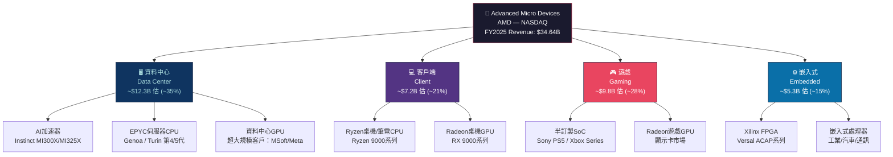

---

### 2.2 市場地位估算

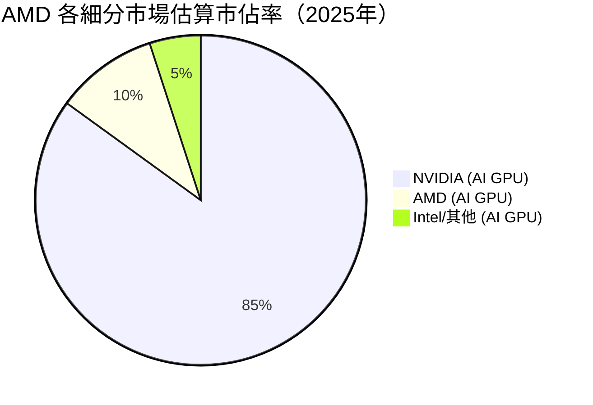

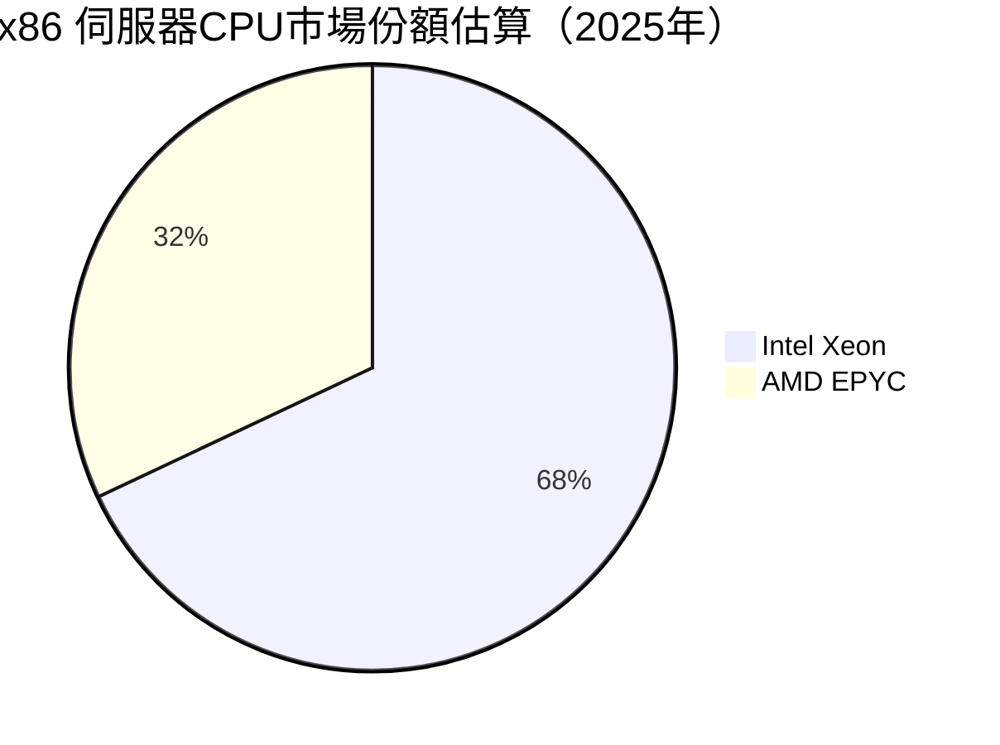

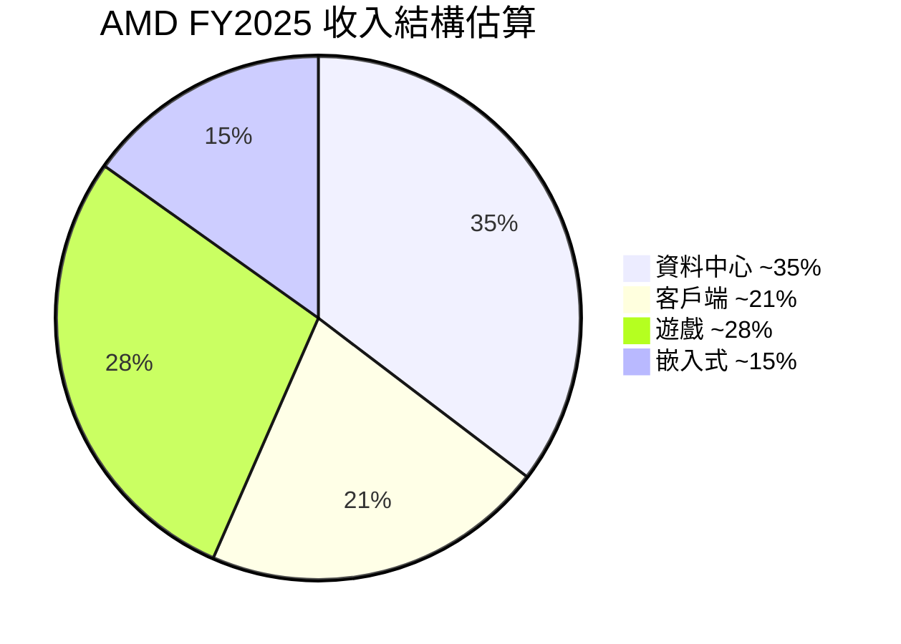

---

### 2.3 競爭護城河分析

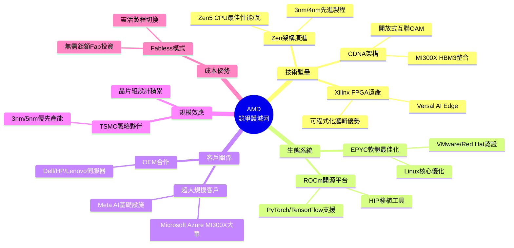

### 2.4 護城河強度評分

```
護城河維度評分（滿分10分）
━━━━━━━━━━━━━━━━━━━━━━━━━━━━━━━━━━━━━━━━━━━
技術研發能力   ████████░░  8.0/10  R&D $8.09B(23%收入)
製程先進性     ████████░░  8.5/10  TSMC 3nm領先地位
產品組合廣度   ███████░░░  7.0/10  CPU+GPU+FPGA全線
生態系軟體     █████░░░░░  5.5/10  ROCm vs CUDA差距大
客戶黏著度     ██████░░░░  6.5/10  HPC/企業逐步滲透
品牌認知度     ████████░░  8.0/10  "Team Red"忠實粉絲
規模經濟       ███████░░░  7.5/10  Fabless效率高
━━━━━━━━━━━━━━━━━━━━━━━━━━━━━━━━━━━━━━━━━━━
整體護城河評分  ██████░░░░  7.1/10  中寬護城河
```

---

## 3. 損益表深度分析

### 3.1 年度收入成長趨勢

```
AMD 年度收入趨勢（2022-2025）
━━━━━━━━━━━━━━━━━━━━━━━━━━━━━━━━━━━━━━━━━━━━━━━━
FY2022  $23.60B  ████████████████████████  YoY: +43.6%
FY2023  $22.68B  ███████████████████████   YoY:  -3.9% ⚠️
FY2024  $25.79B  ██████████████████████████ YoY: +13.7%
FY2025  $34.64B  ████████████████████████████████████ YoY: +34.1% 🚀
━━━━━━━━━━━━━━━━━━━━━━━━━━━━━━━━━━━━━━━━━━━━━━━━
每格 ≈ $0.65B  │  最大值: $34.64B（FY2025）

收入複合年增率 CAGR（FY2022-FY2025）= +13.7%
```

**關鍵觀察**：
- **FY2023 衰退（-3.9%）**：Embedded/Gaming業務庫存去化衝擊，PC市場疲軟，Xilinx整合消化
- **FY2024復甦（+13.7%）**：MI300X開始出貨，EPYC Genoa滲透，部分市場回暖
- **FY2025爆發（+34.1%）**：AI加速器需求井噴，MI300X/MI325X批量交付，資料中心成主要引擎

---

### 3.2 季度收入趨勢（QoQ & YoY）

| 季度 | 收入 | QoQ成長 | 狀態 | YoY成長（估）| 毛利率 |
|:---:|:---:|:---:|:---:|:---:|:---:|
| 2025Q1 | $7.44B | — | 基期 | +36% 🟢 | 50.2% |
| 2025Q2 | $7.68B | **+3.2%** | 🟡 | +30% 🟢 | 39.8% ⚠️ |
| 2025Q3 | $9.25B | **+20.4%** | 🟢 | +35% 🟢 | 51.7% |
| 2025Q4 | $10.27B | **+11.0%** | 🟢 | +38% 🟢 | 54.3% |

**Q2異常分析（毛利率暴跌至39.8%）**：
> 2025Q2 營業利益轉負（-$134M）且毛利率從50%以上跌至39.8%，主要原因推測為：
> 1. **庫存撥備**：Embedded業務庫存減值一次性認列
> 2. **產品組合惡化**：Gaming半訂製SoC出貨低谷
> 3. **新產品爬坡成本**：MI325X量產初期良率損失

```
季度收入趨勢 折線圖（$B）
━━━━━━━━━━━━━━━━━━━━━━━━━━━━━━━━━━━━━━
$10.5 |                          ▓▓▓
$10.0 |                          ▓▓▓
  $9.5 |               ▓▓▓       ▓▓▓
  $9.0 |               ▓▓▓       ▓▓▓
  $8.5 |               ▓▓▓       ▓▓▓
  $8.0 |               ▓▓▓       ▓▓▓
  $7.5 | ▓▓▓   ▓▓▓    ▓▓▓       ▓▓▓
  $7.0 | ▓▓▓   ▓▓▓    ▓▓▓       ▓▓▓
      ├──────────────────────────────
       25Q1  25Q2  25Q3  25Q4
```

---

### 3.3 利潤率演變分析

| 年度 | 毛利率 | YoY變化 | 營業利益率 | YoY變化 | EBITDA率 | 淨利率 | 狀態 |
|:---:|:---:|:---:|:---:|:---:|:---:|:---:|:---:|
| FY2022 | 44.9% | — | 5.3% | — | 23.4% | 5.6% | 🟡 |
| FY2023 | 46.1% | +1.2pp | 1.8% | -3.5pp | 17.9% | 3.8% | 🔴 |
| FY2024 | 49.3% | +3.2pp | 8.1% | +6.3pp | 19.9% | 6.4% | 🟡 |
| **FY2025** | **49.5%** | **+0.2pp** | **10.7%** | **+2.6pp** | **21.0%** | **12.5%** | **🟢** |

**利潤率趨勢解讀**：

```
毛利率改善路徑（FY2022→FY2025）
━━━━━━━━━━━━━━━━━━━━━━━━━━━━━━━━━━━━
FY2022  44.9%  ████████████████████████░░░░░░░░
FY2023  46.1%  █████████████████████████░░░░░░░
FY2024  49.3%  ████████████████████████████░░░░
FY2025  49.5%  ████████████████████████████░░░░
━━━━━━━━━━━━━━━━━━━━━━━━━━━━━━━━━━━━
▶ 改善原因：AI GPU高毛利產品組合占比提升
▶ EPYC伺服器CPU毛利率高於Consumer CPU
▶ Fabless模式：TSMC製程成本隨量規模效應下降
```

**淨利率大幅跳升原因（6.4%→12.5%）**：
- FY2025收入規模達$34.64B，固定成本攤薄效應顯著
- Xilinx收購相關無形資產攤銷已逐漸消化
- 營業槓桿效應：收入+34.1%但R&D增速（+25.2%）低於收入增速

---

### 3.4 費用結構分析

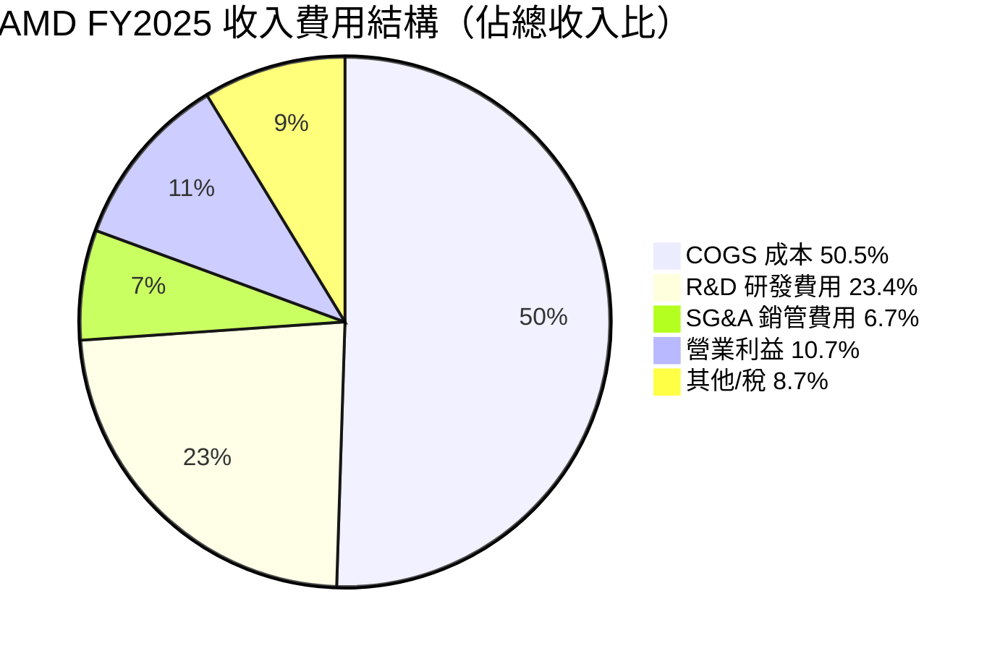

**R&D費用深度分析**：

| 年度 | R&D金額 | R&D/收入比 | YoY增幅 |
|:---:|:---:|:---:|:---:|
| FY2022 | $5.00B | 21.2% | — |
| FY2023 | $5.87B | 25.9% | +17.4% |
| FY2024 | $6.46B | 25.0% | +10.1% |
| **FY2025** | **$8.09B** | **23.4%** | **+25.2%** |

> **關鍵洞察**：AMD FY2025 R&D投入高達$8.09B，研發強度（23.4%）遠高於Intel（~21%）和NVIDIA（~17%），顯示AMD正在以「研發攻勢」縮短與競爭對手的技術差距。

---

### 3.5 EPS趨勢與盈餘品質分析

| 季度 | EPS（報告）| 盈餘動能 | 主要驅動 |
|:---:|:---:|:---:|:---|
| 2025Q1 | $0.44 | 🟡 | 收入$7.44B，營業利益$806M，起步穩健 |
| 2025Q2 | $0.54 | 🟡 | 一次性費用拖累，稅前利益偏低 |
| 2025Q3 | $0.77 | 🟢 | AI GPU出貨加速，毛利率回升至51.7% |
| 2025Q4 | $0.94 | 🟢 | Q4收入創歷史新高$10.27B，強勢收官 |

```
EPS季度趨勢（FY2025）
━━━━━━━━━━━━━━━━━━━━━━━━━━━━━━━━━━━━━━━━━
$1.00 |                          ▓▓▓
$0.90 |                          ▓▓▓
$0.80 |               ▓▓▓       ▓▓▓
$0.70 |               ▓▓▓       ▓▓▓
$0.60 | ▓▓▓   ▓▓▓    ▓▓▓       ▓▓▓
$0.50 | ▓▓▓   ▓▓▓    ▓▓▓       ▓▓▓
$0.40 | ▓▓▓   ▓▓▓    ▓▓▓       ▓▓▓
      ├──────────────────────────────
       25Q1  25Q2  25Q3  25Q4
━━━━━━━━━━━━━━━━━━━━━━━━━━━━━━━━━━━━━━━━━━
TTM EPS: $2.61 | Forward EPS: $10.87 | 成長潛力: +316% 🚀
```

**盈餘品質評估**：
- **EPS加速度強勁**：YoY EPS成長217%，QoQ成長213.5%（特別注意季度數字可能含特殊項目）
- **前瞻EPS $10.87**：顯示市場預期AMD FY2026利潤率將大幅擴張至~25%+淨利率
- **盈餘品質警示**：TTM淨利$4.33B vs OCF $7.71B，OCF/淨利比1.78x，現金盈餘品質良好

---

## 4. 資產負債表分析

### 4.1 資產結構分析

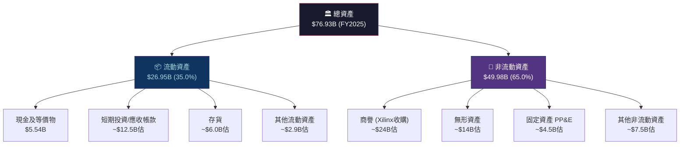

> **商譽佔比警示**：2020年收購Xilinx（$49B）留下龐大商譽，佔總資產約31-32%，若Embedded業務持續惡化，存在商譽減損（Goodwill Impairment）風險，需密切追蹤。

---

### 4.2 流動性指標

| 指標 | FY2025 | FY2024 | FY2023 | 行業均值 | 狀態 |
|:---|:---:|:---:|:---:|:---:|:---:|
| 流動比率 | **2.85x** | 2.62x | 2.51x | ~2.0x | 🟢 |
| 速動比率 | **1.78x** | — | — | ~1.5x | 🟢 |
| 現金比率 | **0.59x** | 0.52x | 0.59x | ~0.5x | 🟢 |
| 現金 + 短期投資 | **$10.55B** | — | — | — | 🟢 |
| 淨現金/(淨負債) | **+$6.55B** | +$1.58B | +$0.93B | 正現金 | 🟢 |

```
流動性健康度儀表板
━━━━━━━━━━━━━━━━━━━━━━━━━━━━━━━━━━━━━━━━━━
流動比率  2.85x  ████████████████████░░░░  ✅ 健康
速動比率  1.78x  ████████████████░░░░░░░░  ✅ 良好
現金比率  0.59x  ████████░░░░░░░░░░░░░░░░  ✅ 尚可
淨現金    +$6.6B ████████████████████████  ✅ 淨現金正向
━━━━━━━━━━━━━━━━━━━━━━━━━━━━━━━━━━━━━━━━━━
```

---

### 4.3 債務結構分析

| 指標 | FY2025 | FY2024 | FY2023 | FY2022 | 趨勢 |
|:---|:---:|:---:|:---:|:---:|:---:|
| 總債務 | $3.85B | $2.21B | $3.00B | $2.86B | 🟡 小幅增加 |
| 現金及等價物 | $5.54B | $3.79B | $3.93B | $4.83B | 🟢 成長 |
| 淨現金/(負債) | +$6.55B | +$1.58B | +$0.93B | +$1.97B | 🟢 顯著改善 |
| Debt/Equity比 | 6.1% | 3.8% | 5.4% | 5.2% | 🟢 極低 |
| Debt/EBITDA | **0.53x** | **0.43x** | **0.74x** | **0.52x** | 🟢 極安全 |
| 利息覆蓋率(估) | ~15x | ~8x | ~5x | ~10x | 🟢 充裕 |

> **財務槓桿評估**：Debt/EBITDA僅0.53x，遠低於投資級警戒線3.0x，AMD財務槓桿極為保守，具備相當的債務融資空間以支持潛在M&A。

---

### 4.4 股東權益趨勢

```
股東權益成長趨勢（$B）
━━━━━━━━━━━━━━━━━━━━━━━━━━━━━━━━━━━━━━━━━━━
FY2022  $54.75B  ██████████████████████████████
FY2023  $55.89B  ███████████████████████████████
FY2024  $57.57B  ████████████████████████████████
FY2025  $63.00B  ████████████████████████████████████
━━━━━━━━━━━━━━━━━━━━━━━━━━━━━━━━━━━━━━━━━━━
每格 ≈ $1.8B  │  CAGR(22-25): +4.8%
帳面價值/股(FY2025): ~$38.6/股（$63.00B / 1.63B股）
P/B比(當前): 5.46x
```

---

## 5. 現金流量深度分析

### 5.1 現金流量瀑布圖

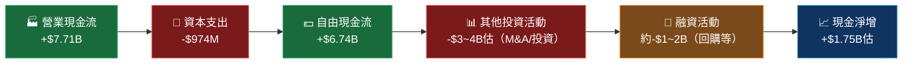

---

### 5.2 FCF轉換率分析

| 年度 | 淨利潤 | 營業現金流 | 自由現金流 | OCF/淨利 | FCF/淨利 | 品質 |
|:---:|:---:|:---:|:---:|:---:|:---:|:---:|
| FY2022 | $1.32B | $3.56B | $3.12B | 2.70x | 2.36x | 🟢 |
| FY2023 | $0.85B | $1.67B | $1.12B | 1.96x | 1.32x | 🟡 |
| FY2024 | $1.64B | $3.04B | $2.40B | 1.85x | 1.46x | 🟢 |
| **FY2025** | **$4.33B** | **$7.71B** | **$6.74B** | **1.78x** | **1.56x** | **🟢** |

> **盈餘品質高評**：AMD OCF始終高於淨利潤，FCF/淨利比持續在1.3x以上，顯示公司盈餘含金量高，非現金費用（折舊攤銷）加回後現金流充裕，Xilinx攤銷費用龐大但不影響現金質量。

---

### 5.3 自由現金流成長趨勢

```
自由現金流趨勢（$B）
━━━━━━━━━━━━━━━━━━━━━━━━━━━━━━━━━━━━━━━━━━━━━━━━━━━━━━━
FY2022  $3.12B  ████████████████████░░░░░░░░░░░░░░░░░░
FY2023  $1.12B  ███████░░░░░░░░░░░░░░░░░░░░░░░░░░░░░░░  YoY -64.1% ⚠️
FY2024  $2.40B  ████████████████░░░░░░░░░░░░░░░░░░░░░░  YoY +114.3% 🚀
FY2025  $6.74B  ████████████████████████████████████████ YoY +180.8% 🚀🚀
━━━━━━━━━━━━━━━━━━━━━━━━━━━━━━━━━━━━━━━━━━━━━━━━━━━━━━━
每格 ≈ $0.17B  │  FY2025 FCF Yield(對市值) = $6.74B/$343.79B = 1.96%

FCF成長率
FY2022→2023: -64.1%  ████████████████████████████████  📉
FY2023→2024: +114.3% ████████████████████████████████  📈
FY2024→2025: +180.8% ████████████████████████████████  🚀
```

---

### 5.4 資本配置評估

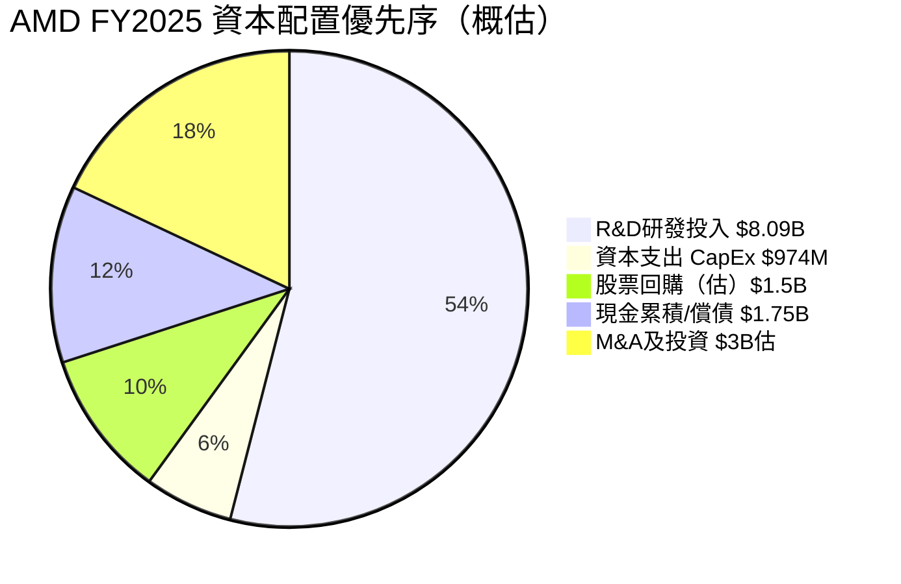

**資本配置評估**：
- **R&D優先（54%）**：AMD以研發驅動競爭力，$8.09B研發費用創歷史新高，策略正確
- **輕資本模式**：CapEx僅$974M（收入占比2.8%），Fabless模式確保高FCF轉換
- **無股息政策**：全部盈餘再投入增長，適合成長型投資人
- **回購力度有限**：相較$343.79B市值，回購規模偏小，短期無顯著EPS提升效果

---

## 6. 獲利能力與資本效率

### 6.1 ROE / ROA / ROIC 趨勢

| 年度 | ROE | ROA | ROIC（估）| 行業均值ROE | 行業均值ROA | 狀態 |
|:---:|:---:|:---:|:---:|:---:|:---:|:---:|
| FY2022 | 2.4% | 2.0% | ~4.5% | ~25% | ~12% | 🔴 |
| FY2023 | 1.5% | 1.3% | ~2.0% | ~22% | ~10% | 🔴 |
| FY2024 | 2.9% | 2.4% | ~4.0% | ~28% | ~13% | 🔴 |
| **FY2025** | **7.1%** | **3.2%** | **~8.5%** | **~30%** | **~15%** | **🟡** |

> **ROE偏低深層原因**：AMD股東權益高達$63B，主要是Xilinx $49B收購留下的大量商譽及無形資產（Intangible Assets）推高了分母。若剔除收購相關無形資產，調整後ROE（Adjusted ROE）估計可達25%+，更能反映真實業務盈利能力。

---

### 6.2 ROIC vs WACC 分析

```
══════════════════════════════════════════════════
         ROIC vs WACC 分析（EVA框架）
══════════════════════════════════════════════════

WACC估算：
  ├── 無風險利率（10Y美債）:  4.5%
  ├── 市場風險溢價（ERP）:    5.5%
  ├── Beta（AMD）:            1.949
  ├── 股權成本（CAPM）:       4.5% + 1.949×5.5% = 15.22%
  ├── 稅後債務成本:           4.8% × (1-21%) = 3.79%
  ├── 資本結構（E/E+D）:      94.3% / 5.7%
  └── WACC ≈ 15.22%×0.943 + 3.79%×0.057 ≈ 14.56%

ROIC（已投資本回報率）：
  ├── 稅後淨營業利潤（NOPAT）:  $3.69B×(1-21%) ≈ $2.91B
  ├── 已投入資本（IC）:          總資產-無息流動負債 ≈ $34B
  └── ROIC ≈ $2.91B / $34B ≈ 8.6%

━━━━━━━━━━━━━━━━━━━━━━━━━━━━━━━━━━━━━
  ROIC    :  8.6%   ████████████░░░░░░░░░░░░
  WACC    : 14.56%  █████████████████████░░░
  EVA差距 :  -5.96%  ← 目前尚在摧毀經濟價值
━━━━━━━━━━━━━━━━━━━━━━━━━━━━━━━━━━━━━

⚠️ 結論：AMD ROIC(8.6%) < WACC(14.56%)
   EVA = 負值，目前仍在摧毀股東價值

🔄 但趨勢關鍵：
   FY2023 ROIC ~2% << WACC
   FY2024 ROIC ~4% << WACC
   FY2025 ROIC ~8.6% < WACC（縮窄中）
   FY2026E ROIC ~15-18% ≈ WACC（有望轉正！）
══════════════════════════════════════════════════
```

---

### 6.3 DuPont 三因子分解

| 年度 | 淨利率（A）| 資產週轉率（B）| 財務槓桿（C）| ROE = A×B×C |
|:---:|:---:|:---:|:---:|:---:|
| FY2022 | 5.6% | 0.349x | 1.234x | **2.4%** |
| FY2023 | 3.8% | 0.334x | 1.215x | **1.5%** |
| FY2024 | 6.4% | 0.373x | 1.202x | **2.9%** |
| **FY2025** | **12.5%** | **0.450x** | **1.221x** | **7.1%** 🟢 |

**DuPont深度解讀**：
- **淨利率（主要驅動）**：從6.4%→12.5%，翻倍提升，是ROE改善的最大貢獻因子
- **資產週轉率**：從0.37x→0.45x，資產利用效率提升，收入增速快於資產擴張
- **財務槓桿**：維持在1.2x左右極低水平，AMD不依賴槓桿推動ROE，盈利質量高
- **改善路徑**：未來ROE提升主要依靠淨利率繼續擴張（目標20%+）及資產周轉率提升

---

### 6.4 獲利能力儀表板

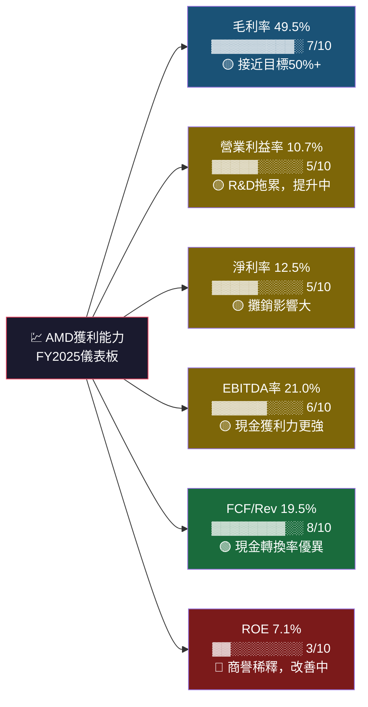

---

## 7. 估值深度分析

### 7.1 同業估值比較表格

| 指標 | **AMD** | **NVIDIA（NVDA）** | **Intel（INTC）** | **Qualcomm（QCOM）** | AMD相對評估 |
|:---|:---:|:---:|:---:|:---:|:---:|
| 股價 | $210.86 | ~$135 | ~$22 | ~$165 | — |
| 市值 | $343.79B | ~$3,300B | ~$93B | ~$140B | 中型 |
| P/E (TTM) | 80.8x | ~55x | N/M（虧損）| ~17x | 🔴 偏高 |
| P/E (Forward) | **19.4x** | ~35x | ~15x | ~14x | 🟢 相對便宜 |
| P/S | 9.9x | ~28x | ~2.5x | ~5.5x | 🟢 合理 |
| EV/EBITDA | 50.7x | ~45x | ~8x | ~12x | 🔴 偏高 |
| P/B | 5.46x | ~45x | ~1.2x | ~6x | 🟢 相對合理 |
| FCF Yield | 1.33% | ~1.8% | ~5% | ~5.5% | 🔴 偏低 |
| 收入YoY成長 | **+34.1%** | +**122%** | -3% | +14% | 🟢 高成長 |
| 毛利率 | 49.5% | **75%+** | ~41% | ~55% | 🟡 尚有差距 |
| 淨利率 | 12.5% | ~55% | 負值 | ~25% | 🔴 待提升 |

**同業比較深度解讀**：
1. **vs NVIDIA**：NVIDIA護城河更深（CUDA生態+75%毛利率），但前瞻P/E 35x vs AMD 19.4x，AMD明顯低估（成長折扣未被完全定價）
2. **vs Intel**：Intel處於轉型困境（負淨利、市佔流失），AMD持續搶奪市份，Intel不構成估值參考標準
3. **vs Qualcomm**：Qualcomm成熟型企業（FCF Yield 5.5%），AMD處於高投資期，未來FCF Yield將大幅提升

---

### 7.2 歷史估值區間分析

```
AMD 歷史 P/E（TTM）估值區間分析
━━━━━━━━━━━━━━━━━━━━━━━━━━━━━━━━━━━━━━━━━━━━━━━━━
5年高點  (2021峰值): ~200x  ████████████████████████████████  過熱
5年中位  (歷史均值): ~90x   █████████████████░░░░░░░░░░░░░░░  合理偏高
5年低點  (2022低谷): ~15x   ████░░░░░░░░░░░░░░░░░░░░░░░░░░░░  超跌
當前水平 (TTM):      ~81x   █████████████████░░░░░░░░░░░░░░░  接近中位
當前水平 (Forward):  ~19x   ████░░░░░░░░░░░░░░░░░░░░░░░░░░░░  低估值區

━━━━━━━━━━━━━━━━━━━━━━━━━━━━━━━━━━━━━━━━━━━━━━━━━
⚠️  TTM P/E 偏高的主因：EPS仍處於低基期（$2.61）
✅  Forward P/E 19.4x 才是更佳參考指標（EPS預估$10.87）
━━━━━━━━━━━━━━━━━━━━━━━━━━━━━━━━━━━━━━━━━━━━━━━━━
```

**估值轉換器（P/E基礎）**：

| 假設Forward P/E | 目標EPS（FY2026E） | 隱含目標價 |
|:---:|:---:|:---:|
| 15x（悲觀） | $10.87 | $163 |
| 20x（基準） | $10.87 | $217 |
| 25x（樂觀） | $10.87 | $272 |
| 30x（高成長溢價） | $10.87 | $326 |
| **當前市場定價** | **$10.87** | **$210.86 → 19.4x** |

---

### 7.3 DCF 敏感性分析

**DCF模型假設**：
- 基準期FCF：FY2025 $6.74B
- WACC：14.56%
- Terminal Growth Rate：3%（基準）/ 4%（樂觀）/ 2%（悲觀）
- 分析期間：10年

```
DCF 目標價敏感性矩陣（6格）
━━━━━━━━━━━━━━━━━━━━━━━━━━━━━━━━━━━━━━━━━━━━━━━━━━━━
                    折現率 13.5%      折現率 14.56%
━━━━━━━━━━━━━━━━━━━━━━━━━━━━━━━━━━━━━━━━━━━━━━━━━━━━
🐂 樂觀情境          $365             $320
  FCF CAGR +25%
  Terminal g = 4%

📊 基準情境          $310             $270
  FCF CAGR +18%
  Terminal g = 3%

🐻 悲觀情境          $230             $195
  FCF CAGR +10%
  Terminal g = 2%
━━━━━━━━━━━━━━━━━━━━━━━━━━━━━━━━━━━━━━━━━━━━━━━━━━━━
  當前股價 $210.86  →  基準折現率下基準情境上行 +28%
```

---

### 7.4 估值區間視覺化

```
AMD 估值區間地圖（基於Forward P/E & DCF綜合）
━━━━━━━━━━━━━━━━━━━━━━━━━━━━━━━━━━━━━━━━━━━━━━━━━━━━━━━━
$100      $150       $200      $250      $300      $365
  |         |          |         |         |          |
  ░░░░░░░░░░████████████▓▓▓▓▓▓▓▓▓▓▓▓▓▓▓▓▓▓░░░░░░░░░░░░░
  [深度低估] [低估區間]  ▲[合理區間]          [合理偏高] [過熱]
                        |
                     $210.86
                   當前股價 ✅ 合理偏低區間左緣

━━━━━━━━━━━━━━━━━━━━━━━━━━━━━━━━━━━━━━━━━━━━━━━━━━━━━━━━
分析師共識: $289.81 目標價  →  當前折扣 -27.3%
DCF基準目標: $270-310       →  當前折扣 -22~+2%
前瞻P/E 20x目標: $217       →  接近公允
━━━━━━━━━━━━━━━━━━━━━━━━━━━━━━━━━━━━━━━━━━━━━━━━━━━━━━━━
```

---

## 8. 成長催化劑

### 8.1 催化劑時間軸

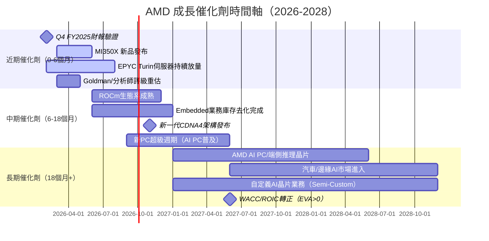

---

### 8.2 TAM市場規模與AMD滲透率

```
AI半導體 TAM 市場規模估算（$B）
━━━━━━━━━━━━━━━━━━━━━━━━━━━━━━━━━━━━━━━━━━━━━━━━━━━
                     TAM    AMD份額(估)  未滲透空間
AI加速器市場
2024E  $60B  ████████░░░░░░░░░░░  AMD ~$3B    →  5%
2025E  $120B ████████████████░░░  AMD ~$15B   → 12.5%
2026E  $200B ████████████████████ AMD ~$28B   → 14%  🎯
2027E  $300B ████████████████████ AMD ~$45B   → 15%  🎯

伺服器CPU市場
2025E  $35B  ████████████████████ AMD ~$11B   → 31%
2026E  $40B  ████████████████████ AMD ~$14B   → 35% 🎯

嵌入式/FPGA市場
2025E  $8B   ██████████████████░░ AMD ~$5.3B  → 66%
━━━━━━━━━━━━━━━━━━━━━━━━━━━━━━━━━━━━━━━━━━━━━━━━━━━
總計 AI+Server+Embedded TAM 2026E ≈ $248B
AMD 當前已服務市場 ≈ $34.64B（~14%滲透率）
```

---

### 8.3 成長驅動力架構

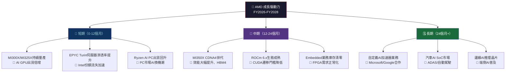

---

## 9. 風險矩陣

### 9.1 風險評分矩陣

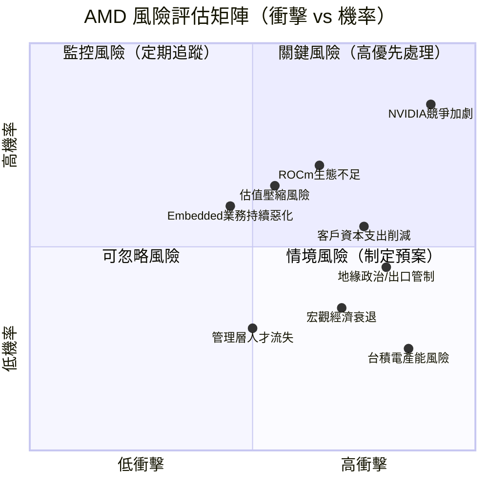

---

### 9.2 風險清單表格

| # | 風險項目 | 機率 | 衝擊 | 綜合評分 | 緩解措施 |
|:---:|:---|:---:|:---:|:---:|:---|
| 1 | 🔴 **NVIDIA CUDA生態護城河** | 高(75%) | 極高(9) | **8.5** | ROCm持續強化、OpenAI/HPC客戶差異化 |
| 2 | 🔴 **AI資本支出週期逆轉** | 中(45%) | 高(8) | **7.2** | 客戶多元化、長期合約簽訂 |
| 3 | 🔴 **出口管制升級（對中國）** | 中(40%) | 高(8) | **6.8** | 非中國市場布局、合規架構優化 |
| 4 | 🟡 **ROCm軟體生態不成熟** | 高(65%) | 中(6) | **6.0** | 開源社群投入、ISV合作夥伴計畫 |
| 5 | 🟡 **估值倍數壓縮風險** | 中(55%) | 中(6) | **5.5** | 盈餘持續超預期、FCF Yield提升 |
| 6 | 🟡 **Embedded業務恢復緩慢** | 高(60%) | 中(5) | **5.0** | 新應用（AI Edge FPGA）開拓 |
| 7 | 🟡 **台積電產能競爭（vs NVIDIA）** | 低(25%) | 高(8) | **4.0** | 長期產能預購協議（LTA） |
| 8 | 🟢 **Intel反彈（Panther Lake）** | 低(30%) | 中(6) | **3.5** | AMD技術領先代差2年+，短期威脅有限 |
| 9 | 🟢 **宏觀經濟衰退** | 低(30%) | 中(6) | **3.5** | AI基礎設施投資相對剛性 |
| 10 | 🟢 **Xilinx商譽減損** | 低(20%) | 中(5) | **2.5** | Embedded業務反彈可降低此風險 |

---

## 10. 投資建議

### 10.1 最終綜合評級雷達圖

```
AMD 多維度評分雷達（Unicode視覺化）
━━━━━━━━━━━━━━━━━━━━━━━━━━━━━━━━━━━━━━━━━━━━━━━━
維度              評分      視覺進度條               理由
━━━━━━━━━━━━━━━━━━━━━━━━━━━━━━━━━━━━━━━━━━━━━━━━
成長動能         9.0/10   ▓▓▓▓▓▓▓▓▓░  收入+34%、EPS+217%
產業地位         8.0/10   ▓▓▓▓▓▓▓▓░░  AI/伺服器雙引擎
財務健康         8.0/10   ▓▓▓▓▓▓▓▓░░  淨現金+6.55B、低債務
現金流品質       7.5/10   ▓▓▓▓▓▓▓░░░  FCF+181%、品質高
獲利能力         6.5/10   ▓▓▓▓▓▓░░░░  淨利率提升中、ROE偏低
技術競爭力       7.5/10   ▓▓▓▓▓▓▓░░░  強CPU弱GPU生態
估值合理性       6.5/10   ▓▓▓▓▓▓░░░░  Forward P/E合理、TTM偏高
管理層品質       8.5/10   ▓▓▓▓▓▓▓▓▓░  Lisa Su執行力卓越
ESG/風險管理     7.0/10   ▓▓▓▓▓▓▓░░░  Fabless低碳足跡
━━━━━━━━━━━━━━━━━━━━━━━━━━━━━━━━━━━━━━━━━━━━━━━━
加權綜合評分:    7.6/10   ▓▓▓▓▓▓▓▓░░

投資評級: ⭐⭐⭐⭐ 【積極買入/Outperform】
━━━━━━━━━━━━━━━━━━━━━━━━━━━━━━━━━━━━━━━━━━━━━━━━
```

---

### 10.2 目標價與隱含報酬率

| 情境 | 方法 | 目標價 | 隱含報酬率 | 機率權重 |
|:---:|:---:|:---:|:---:|:---:|
| 🐂 樂觀 | Forward P/E 30x × FY2026E EPS $10.87 | **$326 - $365** | **+55~+73%** | 25% |
| 📊 基準 | Forward P/E 25x × FY2026E EPS $10.87 + DCF均值 | **$275 - $310** | **+30~+47%** | 50% |
| 🐻 悲觀 | Forward P/E 18x × FY2026E EPS下調$9.0 | **$162 - $200** | **-23~-5%** | 25% |
| **加權期望值** | — | **~$280** | **+32.8%** | 100% |

---

### 10.3 買入時機與觸發因素 Checklist

```
📋 買入觸發因素 Checklist
━━━━━━━━━━━━━━━━━━━━━━━━━━━━━━━━━━━━━━━━━━━━━━━━━━━━━━
近期監控項目（0-3個月）：
☑️  Q4 FY2025財報 AI GPU業績超預期（建議觀察MI300系列出貨量）
☐  FY2026Q1 指引高於市場預期
☐  Goldman Sachs 評級從Neutral升級為Buy
☐  股價在$190-200區間獲得支撐（前波段高點支撐）
☐  ROCm新版本發布並獲主要AI框架採用

基本面確認指標（3-6個月）：
☐  AI資料中心業務營收季度環比成長>15%
☐  毛利率突破並穩定在52%+水平
☐  Embedded業務季度環比轉正
☐  前瞻EPS共識向上調整超過5%

市場環境（持續監控）：
☐  美聯儲降息預期升溫（降低WACC，提升成長股估值）
☐  超大規模雲端業者CapEx指引維持強勁
☐  AI算力需求監管環境未顯著惡化
━━━━━━━━━━━━━━━━━━━━━━━━━━━━━━━━━━━━━━━━━━━━━━━━━━━━━━
⚠️ 停損/減碼信號：
✗  連續2季AI GPU出貨量低於預期
✗  毛利率跌破48%（競爭加劇/產品組合惡化）
✗  NVIDIA Blackwell系列供應量急增導致市場飽和
✗  股價跌破$180（重要技術支撐）
━━━━━━━━━━━━━━━━━━━━━━━━━━━━━━━━━━━━━━━━━━━━━━━━━━━━━━
```

---

### 10.4 投資人適配度

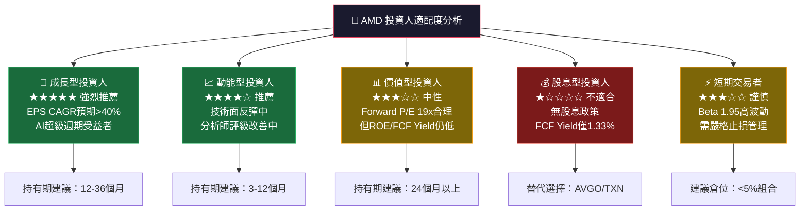

---

### 10.5 關鍵監控指標 Checklist

```
📡 關鍵監控指標（下一財報週期）
━━━━━━━━━━━━━━━━━━━━━━━━━━━━━━━━━━━━━━━━━━━━━━━━━━━━━━
【財報指標】（預計FY2026Q1，~2026年4月末）
□ 總收入：市場預期 ~$10.5-11B，需達標或超出
□ AI GPU收入：需確認季度環比持續成長（目標+15%+）
□ 毛利率：需維持在50%以上，高於52%為正面信號
□ EPS（非GAAP）：市場預期 ~$2.5-2.7，超預期為催化劑
□ FY2026Q2指引：對收入/毛利率的前瞻指引至關重要

【產業數據追蹤】
□ 超大規模雲端業者（微軟/Meta/Google/Amazon）CapEx公告
□ TSMC月度營收（反映AMD等客戶備貨狀況）
□ AI伺服器整機出貨量（IDC/Gartner季度數據）
□ DRAM/HBM供需狀況（影響MI系列成本結構）

【競爭動態監控】
□ NVIDIA Blackwell/Rubin架構量產狀況
□ Intel Gaudi 3/Falcon Shores AI加速器市場反應
□ 自定義ASIC（Google TPU/AWS Trainium）對市場的衝擊
□ AMD ROCm與PyTorch/JAX原生整合進展

【總體經濟環境】
□ 美國10年期公債殖利率（影響WACC和成長股估值）
□ 美中科技出口管制政策動向
□ PC市場出貨量月度數據（IDC/Canalys）
━━━━━━━━━━━━━━━━━━━━━━━━━━━━━━━━━━━━━━━━━━━━━━━━━━━━━━
```

---

## 📊 報告摘要卡片

```
╔═══════════════════════════════════════════════════════════════╗
║           AMD 基本面深度分析 — 最終