# AMD 基本面深度分析報告
> **報告日期**：2026-02-28 ｜ **分析師**：AI CFA 研究團隊 ｜ **數據來源**：Yahoo Finance ｜ **語言**：繁體中文

---

## 目錄

1. [執行摘要](#1-執行摘要)
2. [公司概覽與商業模式](#2-公司概覽與商業模式)
3. [損益表深度分析](#3-損益表深度分析)
4. [資產負債表分析](#4-資產負債表分析)
5. [現金流量深度分析](#5-現金流量深度分析)
6. [獲利能力與資本效率](#6-獲利能力與資本效率)
7. [估值深度分析](#7-估值深度分析)
8. [成長催化劑](#8-成長催化劑)
9. [風險矩陣](#9-風險矩陣)
10. [投資建議](#10-投資建議)

---

## 1. 執行摘要

### 核心評分儀表板

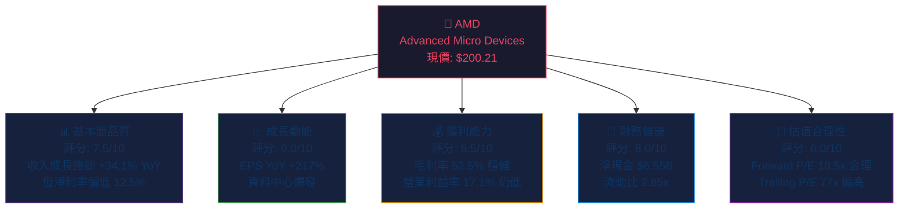

### 綜合評分視覺化

```
╔══════════════════════════════════════════════════════════╗
║              AMD 多維度評分儀表板                        ║
╠══════════════════════════════════════════════════════════╣
║  基本面品質  7.5/10  ▓▓▓▓▓▓▓▓▓▓▓▓▓▓▓░░░░░░  75%        ║
║  成長動能    9.0/10  ▓▓▓▓▓▓▓▓▓▓▓▓▓▓▓▓▓▓░░  90%        ║
║  獲利能力    6.5/10  ▓▓▓▓▓▓▓▓▓▓▓▓▓░░░░░░░░  65%        ║
║  財務健康    8.0/10  ▓▓▓▓▓▓▓▓▓▓▓▓▓▓▓▓░░░░  80%        ║
║  估值合理性  6.0/10  ▓▓▓▓▓▓▓▓▓▓▓▓░░░░░░░░  60%        ║
╠══════════════════════════════════════════════════════════╣
║  綜合加權    7.4/10  ▓▓▓▓▓▓▓▓▓▓▓▓▓▓▓░░░░░  74%        ║
╚══════════════════════════════════════════════════════════╝
```

---

### 5大投資論點 + 3大風險

| 類型 | 項目 | 關鍵數據支撐 | 重要性 |
|------|------|------------|--------|
| 🟢 **多頭論點1** | AI加速器市場爆發式成長 | 資料中心收入為核心驅動，2025年收入達$34.64B (+34.1% YoY) | ⭐⭐⭐⭐⭐ |
| 🟢 **多頭論點2** | EPS爆炸性成長 | EPS YoY +217.1%，Forward EPS $10.84 vs TTM $2.60 | ⭐⭐⭐⭐⭐ |
| 🟢 **多頭論點3** | 自由現金流大幅改善 | FCF $6.74B (2025) vs $1.12B (2023)，YoY +501% | ⭐⭐⭐⭐⭐ |
| 🟢 **多頭論點4** | 強健資產負債表 | 淨現金部位 $6.55B，流動比率 2.85x，幾乎無槓桿壓力 | ⭐⭐⭐⭐ |
| 🟢 **多頭論點5** | 分析師大力看好 | 47位分析師共識「買入」，均值目標價$290.26（上行空間+45%） | ⭐⭐⭐⭐ |
| 🔴 **風險1** | NVIDIA競爭壓力 | NVIDIA AI GPU市佔率仍遠超AMD，生態系護城河深厚 | ⭐⭐⭐⭐⭐ |
| 🔴 **風險2** | 估值仍存壓縮風險 | Trailing P/E 77x，若成長不及預期，估值收縮風險大 | ⭐⭐⭐⭐ |
| 🟡 **風險3** | 地緣政治與出口管制 | 美中晶片出口限制可能影響中國市場營收佔比 | ⭐⭐⭐⭐ |

---

### 快速統計卡片

| 指標 | AMD 數值 | 行業均值 | 相對表現 |
|------|---------|---------|---------|
| 市值 | $326.42B | — | 大型龍頭 |
| 本益比 (Trailing) | 77.0x | ~35x | 🔴 大幅溢價 |
| 本益比 (Forward) | 18.5x | ~25x | 🟢 低於均值 |
| EV/EBITDA | 47.4x | ~25x | 🔴 溢價 |
| 營收成長 YoY | +34.1% | ~10% | 🟢 遠優於均值 |
| 毛利率 | 52.5% | ~45% | 🟢 優於均值 |
| 營業利益率 | 17.1% | ~20% | 🟡 略低 |
| 淨利率 | 12.5% | ~15% | 🟡 略低 |
| FCF Yield | 1.41% | ~2.5% | 🟡 略低 |
| 流動比率 | 2.85x | ~2.0x | 🟢 優於均值 |
| ROE | 7.1% | ~18% | 🔴 顯著低於均值 |
| Beta | 1.949 | 1.2 | 🔴 高波動 |

---

### 投資結論

```
╔══════════════════════════════════════════════════════════════╗
║  🎯 投資評級：審慎買入 (Cautious BUY)                        ║
║                                                              ║
║  目標價區間：$240 - $290（基準）                             ║
║  悲觀情境：$175   基準情境：$260   樂觀情境：$340           ║
║                                                              ║
║  現價 $200.21 → 基準目標隱含上行空間：+29.9%               ║
║                                                              ║
║  建議：分批布局，等待回調至 $180-195 區間加碼              ║
╚══════════════════════════════════════════════════════════════╝
```

---

## 2. 公司概覽與商業模式

### 業務結構與收入來源

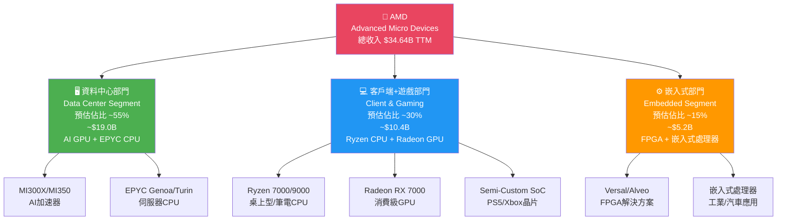

---

### 市場地位 - 市場份額估算

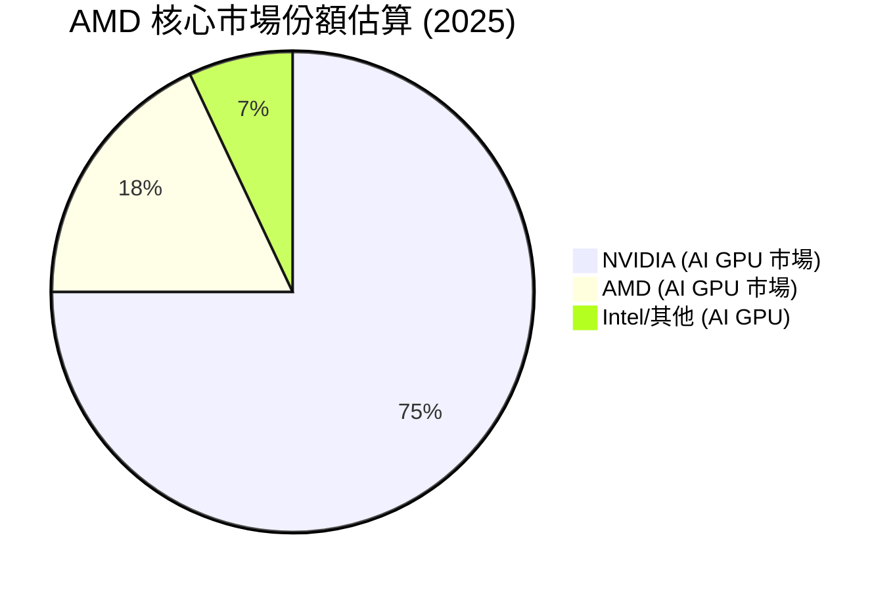

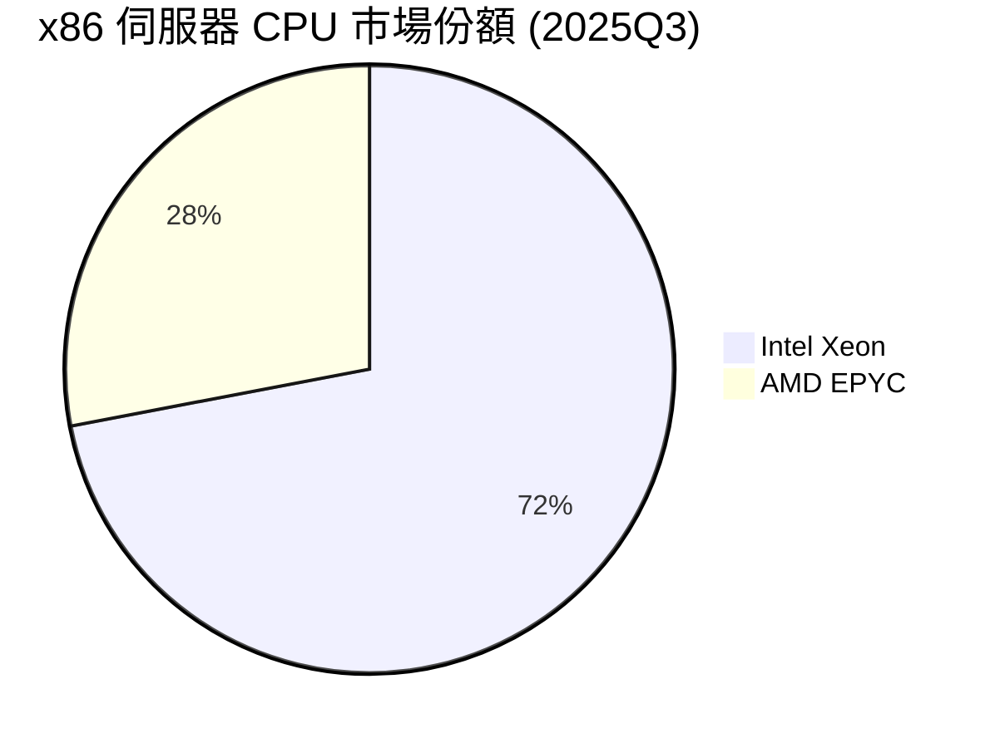

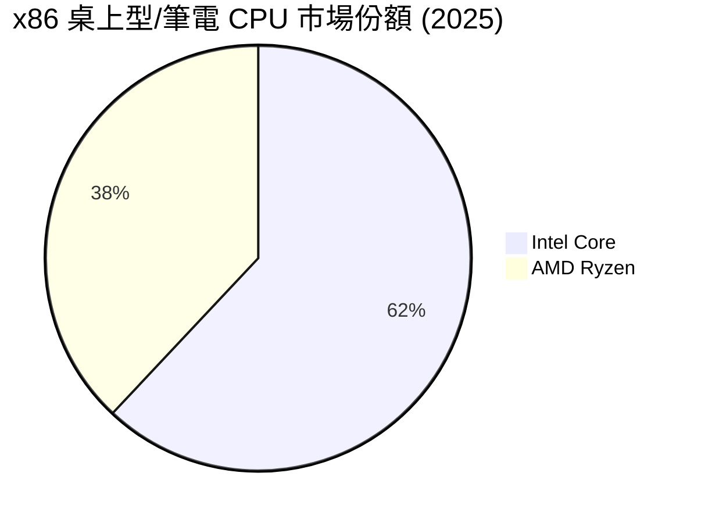

---

### 競爭護城河分析

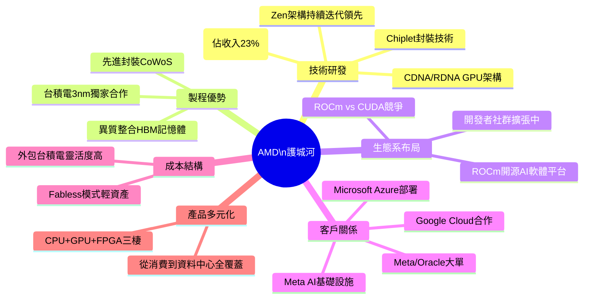

### 護城河強度評分

```
╔══════════════════════════════════════════════════════════════╗
║                AMD 護城河強度評分                            ║
╠══════════════════════════════════════════════════════════════╣
║  技術研發實力   9.0/10  ▓▓▓▓▓▓▓▓▓▓▓▓▓▓▓▓▓▓░░  Zen5領先   ║
║  製程夥伴關係   8.5/10  ▓▓▓▓▓▓▓▓▓▓▓▓▓▓▓▓▓░░░  TSMC 3nm  ║
║  軟體生態系統   5.0/10  ▓▓▓▓▓▓▓▓▓▓░░░░░░░░░░  ROCm弱勢  ║
║  客戶黏著度     7.0/10  ▓▓▓▓▓▓▓▓▓▓▓▓▓▓░░░░░░  持續提升  ║
║  品牌認知度     7.5/10  ▓▓▓▓▓▓▓▓▓▓▓▓▓▓▓░░░░░  高端認可  ║
║  規模經濟       6.5/10  ▓▓▓▓▓▓▓▓▓▓▓▓▓░░░░░░░  仍在建立  ║
╠══════════════════════════════════════════════════════════════╣
║  整體護城河     7.3/10  ▓▓▓▓▓▓▓▓▓▓▓▓▓▓▓░░░░░  中等偏強  ║
╚══════════════════════════════════════════════════════════════╝
```

> **護城河核心隱患**：軟體生態（ROCm vs CUDA）是AMD最大弱點，CUDA的開發者黏著度使NVIDIA維持強大護城河。AMD需持續加大ROCm投入方能縮小差距。

---

## 3. 損益表深度分析

### 年度收入成長趨勢（近4年）

```
AMD 年度總收入 趨勢圖
━━━━━━━━━━━━━━━━━━━━━━━━━━━━━━━━━━━━━━━━━━━━━━━━━━━━━━━━
                                             +34.1%
                                          ┌─────────────┐
                                          │   $34.64B   │
                                          │  ██████████ │
                             +13.7%       │  ██████████ │
                          ┌────────────┐  │  ██████████ │
                          │  $25.79B   │  │  ██████████ │
  -3.9%                   │  ████████  │  │  ██████████ │
┌─────────┐  -3.9%        │  ████████  │  │  ██████████ │
│ $23.60B │            ┌──┴──────────┐ │  │  ██████████ │
│ ███████ │            │  $22.68B   │ │  │  ██████████ │
│ ███████ │            │  ███████   │ │  │  ██████████ │
│ ███████ │            │  ███████   │ │  │  ██████████ │
└─────────┘            └────────────┘ └──┴─────────────┘
  2022                    2023           2024    2025
  $23.60B                 $22.68B        $25.79B  $34.64B
  YoY: N/A                YoY: -3.9%    YoY:+13.7% YoY:+34.1%
━━━━━━━━━━━━━━━━━━━━━━━━━━━━━━━━━━━━━━━━━━━━━━━━━━━━━━━━
```

---

### 季度收入趨勢（近4季 QoQ + YoY）

| 季度 | 收入 | QoQ 成長 | YoY 成長 | 趨勢 |
|------|------|---------|---------|------|
| 2025 Q1 (Mar) | $7.44B | — | +36.4%* | 🟢 |
| 2025 Q2 (Jun) | $7.68B | +3.2% | +36.9%* | 🟢 |
| 2025 Q3 (Sep) | $9.25B | **+20.5%** | +34.6%* | 🟢🟢 |
| 2025 Q4 (Dec) | $10.27B | **+11.0%** | +28.3%* | 🟢 |

> *YoY對比基於2024年對應季度推算（2024全年$25.79B均分估算）
> **關鍵觀察**：Q3→Q4連續兩季加速，顯示資料中心訂單強勁放量，MI300X/MI350出貨量大幅提升。

```
季度收入趨勢（2025年各季）
━━━━━━━━━━━━━━━━━━━━━━━━━━━━━━━━━━━
Q1 $7.44B  ██████████████░░░░░░░░░░
Q2 $7.68B  ███████████████░░░░░░░░░
Q3 $9.25B  ██████████████████░░░░░░  +20.5% QoQ 🚀
Q4 $10.27B █████████████████████░░░  +11.0% QoQ 🟢
━━━━━━━━━━━━━━━━━━━━━━━━━━━━━━━━━━━
```

---

### 利潤率演變表格（近4年）

| 利潤率指標 | 2022 | 2023 | 2024 | 2025 | 趨勢 |
|-----------|------|------|------|------|------|
| **毛利率** | 44.9% | 46.1% | 49.3% | **52.5%** | 🟢 持續改善 |
| **營業利益率** | 5.3% | 1.8% | 8.1% | **17.1%** | 🟢🟢 大幅躍升 |
| **EBITDA率** | 23.4% | 17.9% | 19.9% | **21.0%** | 🟢 穩步提升 |
| **淨利率** | 5.6% | 3.8% | 6.4% | **12.5%** | 🟢 明顯改善 |
| **R&D/收入比** | 21.2% | 25.9% | 25.0% | **23.4%** | 🟡 高但改善 |

**利潤率改善主要原因分析**：
1. **產品組合升級**：高毛利率的資料中心AI GPU（MI300X毛利率估計>55%）佔比提升
2. **規模效應**：收入從$22.68B成長至$34.64B，固定成本攤薄
3. **嵌入式業務復甦**：2023年嵌入式部門大幅下滑後回升，改善整體組合
4. **經營槓桿顯現**：R&D比例從25.9%下降至23.4%

---

### 費用結構分析

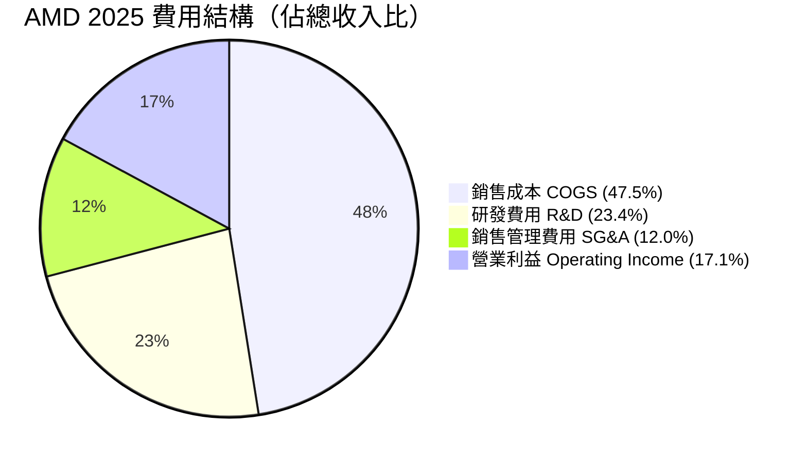

> **重要洞察**：AMD R&D投入高達$8.09B（佔收入23.4%），為全球半導體公司中R&D密度最高的企業之一，反映技術護城河建設的長期投資邏輯。這是未來競爭力的核心基礎，但短期壓縮淨利率。

---

### 季度EPS趨勢與盈餘品質分析

| 季度 | EPS (GAAP) | 環比變化 | 盈餘品質 |
|------|-----------|---------|---------|
| 2025 Q1 | $0.435 | — | 🟡 較低，含攤銷 |
| 2025 Q2 | $0.535 | +22.9% QoQ | 🟡 Q2一次性虧損 |
| 2025 Q3 | $0.761 | +42.2% QoQ | 🟢 大幅提速 |
| 2025 Q4 | $0.927 | +21.8% QoQ | 🟢 強勁 |

> **備註**：EPS Surprise歷史數據暫不完整（系統N/A），但以全年EPS $2.60計算，相較Forward EPS共識$10.84，顯示市場預期2026年Non-GAAP EPS將大幅超越GAAP EPS（因巨額無形資產攤銷差異，主要來自Xilinx收購）。

**EPS品質關鍵差異**：
- GAAP EPS TTM: $2.60
- Non-GAAP EPS 估計: ~$8-9（排除Xilinx $3.5B+無形資產年度攤銷）
- 差異原因：2022年以$49B收購Xilinx產生大量商譽攤銷

---

## 4. 資產負債表分析

### 資產結構分析

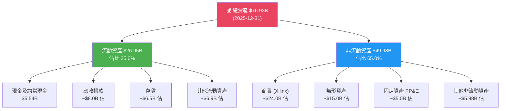

---

### 流動性指標

| 流動性指標 | 2022 | 2023 | 2024 | 2025 | 行業均值 | 評估 |
|-----------|------|------|------|------|---------|------|
| **流動比率** | 2.36x | 2.51x | 2.62x | **2.85x** | 2.0x | 🟢 優秀 |
| **速動比率** | 1.45x | 1.65x | 1.72x | **1.78x** | 1.5x | 🟢 良好 |
| **現金比率** | 0.76x | 0.59x | 0.52x | **0.59x** | 0.5x | 🟢 充足 |
| **淨現金部位** | $1.97B | $0.93B | $1.58B | **$6.55B** | — | 🟢 大幅改善 |

> **關鍵亮點**：2025年淨現金部位從$1.58B大幅躍升至$6.55B（+314% YoY），反映FCF顯著改善，財務彈性大幅增強。

---

### 債務結構分析

```
AMD 債務結構分析 (2025-12-31)
━━━━━━━━━━━━━━━━━━━━━━━━━━━━━━━━━━━━━━━━━━━━━━━━━━
總債務:         $3.85B   ██░░░░░░░░░░░░░░░░░░  低
總現金:         $5.54B   ████░░░░░░░░░░░░░░░░  
淨現金部位:     $6.55B   (含短期投資，實際更高)
━━━━━━━━━━━━━━━━━━━━━━━━━━━━━━━━━━━━━━━━━━━━━━━━━━
Debt/EBITDA:    0.53x   ▓▓░░░░░░░░  極低槓桿 🟢
Debt/Equity:    6.1%    ▓░░░░░░░░░  健康 🟢
Interest Cover: ~15x    ██████████  極強 🟢
━━━━━━━━━━━━━━━━━━━━━━━━━━━━━━━━━━━━━━━━━━━━━━━━━━
```

| 債務指標 | 數值 | 評估 |
|---------|------|------|
| 總債務 | $3.85B | 🟢 極低 |
| Debt/EBITDA | 0.53x | 🟢 幾乎無槓桿壓力 |
| Debt/Equity | 6.1% | 🟢 健康 |
| 利息覆蓋率 | ~15x | 🟢 極強 |
| 淨負債 | **淨現金 $6.55B** | 🟢 淨現金公司 |

---

### 股東權益趨勢

```
股東權益成長趨勢（帳面價值）
━━━━━━━━━━━━━━━━━━━━━━━━━━━━━━━━━━━━━━━━━━━━━━━━━
2022:  $54.75B  ████████████████████████░░  每股 $33.6
2023:  $55.89B  ████████████████████████░░  每股 $34.3  +2.1% YoY
2024:  $57.57B  ████████████████████████░░  每股 $35.3  +3.0% YoY
2025:  $63.00B  ██████████████████████████  每股 $38.6  +9.4% YoY 🟢
━━━━━━━━━━━━━━━━━━━━━━━━━━━━━━━━━━━━━━━━━━━━━━━━━
當前 P/B:  5.18x（現價 $200.21 / 帳面 $38.6）
```

> **觀察**：股東權益成長加速，2025年+9.4% YoY，主要受益於淨利潤大幅提升（$4.33B）。P/B 5.18x反映市場對AMD未來成長的溢價期待。

---

## 5. 現金流量深度分析

### 現金流量瀑布圖

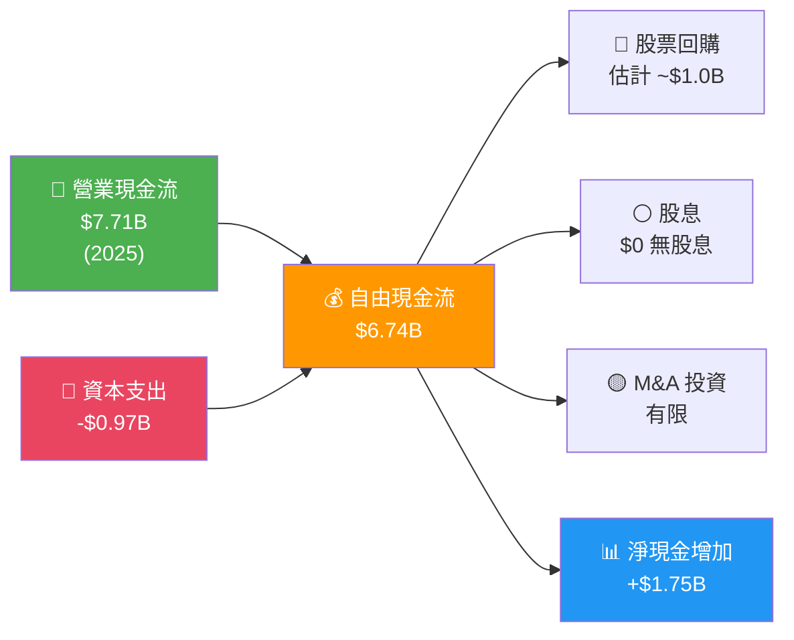

---

### FCF 轉換率趨勢

| 年度 | 淨利潤 | 自由現金流 | FCF轉換率 | 評估 |
|------|--------|----------|---------|------|
| 2022 | $1.32B | $3.12B | **236%** | 🟢 含非現金項目 |
| 2023 | $0.85B | $1.12B | **131%** | 🟢 良好 |
| 2024 | $1.64B | $2.40B | **146%** | 🟢 良好 |
| 2025 | $4.33B | $6.74B | **156%** | 🟢 持續優秀 |

> **分析**：AMD FCF持續高於淨利潤，主要因為大量非現金攤銷（Xilinx無形資產每年約$3.5B），實際現金創造能力遠強於GAAP淨利潤所呈現。這是盈餘品質分析的核心。

---

### 自由現金流趨勢

```
自由現金流趨勢（近4年）
━━━━━━━━━━━━━━━━━━━━━━━━━━━━━━━━━━━━━━━━━━━━━━━━━━━━━━━
2022:  $3.12B  ██████████████░░░░░░░░░░░░░░░░  基準年
2023:  $1.12B  ████░░░░░░░░░░░░░░░░░░░░░░░░░░  -64.1% ⚠️
2024:  $2.40B  ██████████░░░░░░░░░░░░░░░░░░░░  +114.3% 🟢
2025:  $6.74B  ██████████████████████████████  +180.8% 🟢🟢
━━━━━━━━━━━━━━━━━━━━━━━━━━━━━━━━━━━━━━━━━━━━━━━━━━━━━━━━━
FCF CAGR (2022-2025): +29.2%  FCF Yield: 1.41%（含完整FCF）
```

---

### 資本配置評估

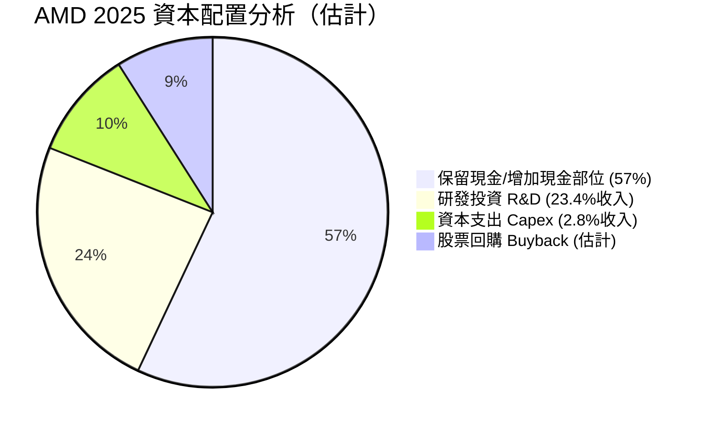

| 資本配置項目 | 金額（估計） | 佔FCF比 | 評估 |
|-----------|-----------|---------|------|
| 研發投入 R&D | $8.09B | 120%+ | 🟢 技術護城河投資 |
| 資本支出 Capex | $0.97B | 14% | 🟢 輕資產Fabless模式 |
| 股票回購 | ~$0.5-1.0B | ~10% | 🟡 保守 |
| 股息 | $0 | 0% | ⚪ 無股息政策 |
| 現金積累 | ~+$1.75B | 26% | 🟢 財務彈性提升 |

---

## 6. 獲利能力與資本效率

### ROE / ROA / ROIC 趨勢

| 指標 | 2022 | 2023 | 2024 | 2025 | 行業均值 | 評估 |
|------|------|------|------|------|---------|------|
| **ROE** | 2.4% | 1.5% | 2.9% | **7.1%** | ~18% | 🔴 顯著低於均值 |
| **ROA** | 1.9% | 1.3% | 2.4% | **3.2%** | ~8% | 🔴 低於均值 |
| **ROIC (估計)** | 3.2% | 1.8% | 4.1% | **7.5%** | ~15% | 🔴 低於均值 |
| **毛利率** | 44.9% | 46.1% | 49.3% | **52.5%** | ~45% | 🟢 優於均值 |
| **淨利率** | 5.6% | 3.8% | 6.4% | **12.5%** | ~15% | 🟡 接近均值 |

> **ROE偏低根本原因**：Xilinx收購導致股東權益膨脹至$63B（含大量商譽$24B），分母基礎龐大壓低ROE。排除商譽後的調整ROE約為20%+，更能反映真實資本效率。

---

### ROIC vs WACC 分析

```
╔══════════════════════════════════════════════════════════════╗
║           ROIC vs WACC 分析（2025年度）                     ║
╠══════════════════════════════════════════════════════════════╣
║  WACC 估算:                                                  ║
║  • 無風險利率:     4.3%（美國10年期公債）                    ║
║  • 市場風險溢價:   5.5%                                      ║
║  • Beta:           1.949                                     ║
║  • 股權成本 (Ke):  4.3% + 1.949×5.5% = 14.9%               ║
║  • 債務成本 (Kd):  3.5%（稅後 ~2.5%）                       ║
║  • 資本結構:       Equity 94%, Debt 6%                       ║
║  • WACC ≈          14.9%×0.94 + 2.5%×0.06 = 14.2%          ║
╠══════════════════════════════════════════════════════════════╣
║  ROIC (GAAP):     7.5%                                      ║
║  ROIC (調整後*):  ~12-13%（排除商譽攤銷影響）               ║
╠══════════════════════════════════════════════════════════════╣
║  EVA (GAAP):  7.5% - 14.2% = -6.7% ❌ 表面上摧毀價值       ║
║  EVA (調整): 12.5% - 14.2% = -1.7% ⚠️ 接近平衡            ║
╠══════════════════════════════════════════════════════════════╣
║  🔑 結論：GAAP ROIC < WACC，表面上仍摧毀股東價值            ║
║           但調整後接近盈虧平衡；若2026年獲利達標，           ║
║           ROIC有望突破WACC，實現真正經濟價值創造             ║
╚══════════════════════════════════════════════════════════════╝
```

**ROIC改善軌跡**：
```
ROIC vs WACC 比較圖
━━━━━━━━━━━━━━━━━━━━━━━━━━━━━━━━━━━━━━━━━━━━━━━━━━
WACC線: ─────────────────────────── 14.2% ──────
                                              
2022: ROIC 3.2%   ▓░░░░░░░░░░░░░░ 遠低於WACC ❌
2023: ROIC 1.8%   ▓░░░░░░░░░░░░░░ 最低點    ❌❌
2024: ROIC 4.1%   ▓▓░░░░░░░░░░░░░ 回升中    ❌
2025: ROIC 7.5%   ▓▓▓▓░░░░░░░░░░░ 大幅改善  ⚠️
2026E:ROIC 13-15% ▓▓▓▓▓▓▓▓▓▓░░░░ 預計突破  🟡✅
━━━━━━━━━━━━━━━━━━━━━━━━━━━━━━━━━━━━━━━━━━━━━━━━━━
```

---

### DuPont 三因素分解（ROE）

| DuPont 要素 | 計算 | 2024 | 2025 | 變化 |
|-----------|------|------|------|------|
| **淨利率** | 淨利 / 收入 | 6.4% | 12.5% | 🟢 +6.1pp |
| **資產週轉率** | 收入 / 總資產 | 0.37x | 0.45x | 🟢 +0.08x |
| **財務槓桿** | 總資產 / 股東權益 | 1.20x | 1.22x | 🟡 微升 |
| **ROE** | 三者相乘 | **2.85%** | **6.84%** | 🟢 大幅改善 |

> **DuPont解讀**：ROE改善主要由**淨利率大幅提升**驅動（12.5% vs 6.4%），資產週轉率亦持續改善，顯示規模效應正在發揮。財務槓桿保持保守，管理層維持穩健資本結構。

---

### 獲利能力儀表板

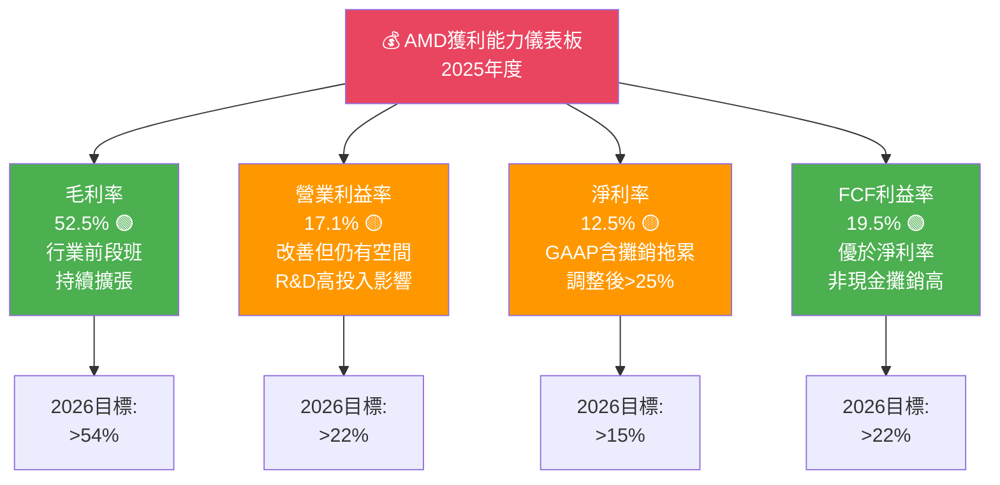

---

## 7. 估值深度分析

### 同業估值比較

| 指標 | **AMD** | **NVIDIA (NVDA)** | **Intel (INTC)** | **Qualcomm (QCOM)** |
|------|---------|------------------|-----------------|-------------------|
| 市值 | $326B | ~$3,200B | ~$85B | ~$165B |
| P/E (Trailing) | 77.0x 🔴 | ~55x 🟡 | N/M 🔴 | ~17x 🟢 |
| P/E (Forward) | **18.5x** 🟢 | ~35x 🟡 | ~22x 🟡 | ~14x 🟢 |
| EV/EBITDA | 47.4x 🔴 | ~45x 🟡 | ~18x 🟢 | ~13x 🟢 |
| P/S | 9.4x 🟡 | ~25x 🔴 | ~1.5x 🟢 | ~4x 🟢 |
| P/B | 5.2x 🟡 | ~50x 🔴 | ~1.0x 🟢 | ~7x 🔴 |
| FCF Yield | 1.41% 🟡 | ~1.5% 🟡 | ~3% 🟢 | ~5% 🟢 |
| 收入成長 YoY | **+34.1%** 🟢 | **~122%** 🟢🟢 | ~-8% 🔴 | ~9% 🟡 |
| 毛利率 | 52.5% 🟢 | ~75% 🟢🟢 | ~40% 🟡 | ~55% 🟢 |

> **同業比較結論**：
> - vs NVIDIA：AMD估值（Forward P/E 18.5x）大幅低於NVIDIA（~35x），但成長率亦較低。AMD提供更合理的性價比入口，適合偏好AI佈局但風險偏好略低的投資人。
> - vs Intel：AMD在各維度（成長、毛利率、市場份額）全面領先，但估值溢價顯著，反映未來成長預期。
> - vs Qualcomm：QCOM估值更低（Forward P/E 14x）但成長動能較弱，定位不同。

---

### 歷史估值區間分析（P/E 5年區間）

```
AMD 歷史 P/E 估值區間分析
━━━━━━━━━━━━━━━━━━━━━━━━━━━━━━━━━━━━━━━━━━━━━━━━━━━━━━━━
歷史P/E區間 (5年):
極高值:   >150x  ████████████████████████████████ 2021年高點
高位:      80x   ████████████████████           2024初
中位:      50x   ████████████
低位:      20x   █████                          2022熊市
極低值:   <15x   ███

當前 Trailing P/E: 77.0x  ████████████████████ 偏高區 🟡
當前 Forward P/E: 18.5x   █████                合理區 🟢
━━━━━━━━━━━━━━━━━━━━━━━━━━━━━━━━━━━━━━━━━━━━━━━━━━━━━━━━
估值所處位置：
Trailing P/E: 歷史偏高但低於2021高峰
Forward P/E: 接近歷史低位，顯示EPS預期大幅上調
→ 市場在為「盈利轉型預期」定價，Forward估值更具參考意義
━━━━━━━━━━━━━━━━━━━━━━━━━━━━━━━━━━━━━━━━━━━━━━━━━━━━━━━━
```

---

### DCF 敏感性分析 — 目標價矩陣

**模型假設**：
- 基準：收入CAGR 25%（2026-2028），終端成長率 4%，WACC 14.2%
- 樂觀：收入CAGR 35%，AI GPU持續放量
- 悲觀：收入CAGR 15%，競爭加劇壓縮利潤率

| 情境 | WACC 12.5% | WACC 14.2% | WACC 16% |
|------|-----------|-----------|---------|
| 🟢 **樂觀 (CAGR 35%)** | **$380** | **$340** | **$295** |
| 🟡 **基準 (CAGR 25%)** | **$295** | **$260** | **$225** |
| 🔴 **悲觀 (CAGR 15%)** | **$215** | **$185** | **$160** |

> **當前股價 $200.21 對應**：悲觀情境下已充分反映，基準情境下有+29.9%上行空間，樂觀情境下有+69.8%空間。

---

### 估值區間視覺化

```
AMD 估值區間定位圖（基於 Forward P/E）
━━━━━━━━━━━━━━━━━━━━━━━━━━━━━━━━━━━━━━━━━━━━━━━━━━━━━━━━━━
                                                            
 $120    $150    $175    $200    $240    $290    $340    $380
   │       │       │       │       │       │       │       │
   ▼       ▼       ▼       ▼       ▼       ▼       ▼       ▼
━━━━━━━━━━━━━━━━━━━━━━━━━━━━━━━━━━━━━━━━━━━━━━━━━━━━━━━━━━
│────低估區────│───合理區───│★ 當前────────────────高估區│
│  深度折價    │ 12-16x Fwd │  $200.21 ←               │
│  <10x Fwd  │   P/E      │  18.5x Fwd P/E            │
━━━━━━━━━━━━━━━━━━━━━━━━━━━━━━━━━━━━━━━━━━━━━━━━━━━━━━━━━━
                            ★ 目前處於合理區偏低端
                              Forward P/E 18.5x 具吸引力
━━━━━━━━━━━━━━━━━━━━━━━━━━━━━━━━━━━━━━━━━━━━━━━━━━━━━━━━━━
```

---

## 8. 成長催化劑

### 催化劑時間軸

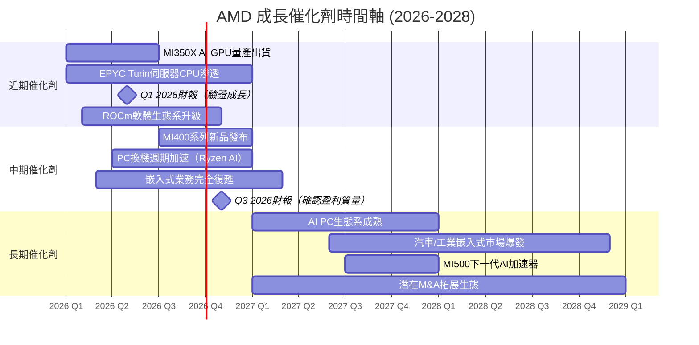

---

### TAM 市場規模與滲透率

```
AMD 目標市場規模分析 (TAM)
━━━━━━━━━━━━━━━━━━━━━━━━━━━━━━━━━━━━━━━━━━━━━━━━━━━━━━━━━━
市場           2025E TAM    2028E TAM    AMD 現有滲透率  目標
━━━━━━━━━━━━━━━━━━━━━━━━━━━━━━━━━━━━━━━━━━━━━━━━━━━━━━━━━━
AI GPU/加速器  $120B       $400B        ~15-18%        25%+
  渗透率: ▓▓▓░░░░░░░░░░░░░░░░░  15-18% 尚早期

伺服器CPU      $25B        $35B         ~28%           35%+
  渗透率: ▓▓▓▓▓░░░░░░░░░░░░░░░  28% 持續擴張

PC CPU         $20B        $22B         ~38%           42%
  渗透率: ▓▓▓▓▓▓▓▓░░░░░░░░░░░░  38% 穩健

嵌入式/FPGA   $15B        $20B         ~35%           40%
  渗透率: ▓▓▓▓▓▓▓░░░░░░░░░░░░░  35% 復甦中

遊戲GPU        $12B        $14B         ~12%           15%
  渗透率: ▓▓░░░░░░░░░░░░░░░░░░  12% 偏弱
━━━━━━━━━━━━━━━━━━━━━━━━━━━━━━━━━━━━━━━━━━━━━━━━━━━━━━━━━━
AI GPU市場是最大催化劑：
  $120B × 18% = $21.6B（2025估）→ $400B × 25% = $100B（2028長期）
━━━━━━━━━━━━━━━━━━━━━━━━━━━━━━━━━━━━━━━━━━━━━━━━━━━━━━━━━━
```

---

### 短/中/長期成長驅動力

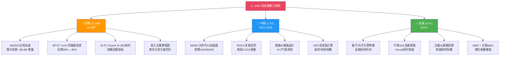

---

## 9. 風險矩陣

### 風險評分矩陣

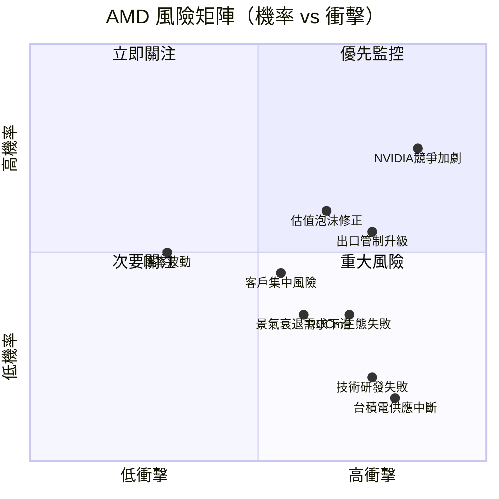

---

### 風險清單詳細表格

| 風險項目 | 機率 | 衝擊程度 | 綜合評分 | 緩解措施 |
|---------|------|---------|---------|---------|
| 🔴 NVIDIA競爭加劇（H200/B300出貨搶佔） | 高 80% | 極高 | **9/10** | 持續R&D投入、差異化定價、ROCm開放策略 |
| 🔴 美中出口管制升級 | 中高 55% | 高 | **7/10** | 多元化市場、非中國AI需求填補 |
| 🔴 估值收縮（若EPS不達標） | 中高 60% | 高 | **7/10** | Forward P/E安全邊際，分批建倉 |
| 🟡 ROCm軟體生態競爭力不足 | 中 40% | 高 | **6/10** | 持續投資、開源社群建立 |
| 🟡 景氣衰退影響企業IT資本支出 | 中低 35% | 中高 | **5/10** | AI需求具結構性，企業優先預算 |
| 🟡 客戶集中風險（少數超大型客戶） | 中 45% | 中 | **5/10** | 持續拓展客戶基礎 |
| 🟢 台積電供應中斷（地緣政治） | 低 15% | 極高 | **4/10** | 台積電多點生產、備選方案 |
| 🟢 技術研發失敗（重大代差落後） | 低 20% | 極高 | **4/10** | 多代並行開發、Zen架構護城河 |
| 🟢 匯率波動影響 | 中 50% | 低 | **2/10** | 自然對沖，美元計價收入為主 |

---

## 10. 投資建議

### 最終綜合評級雷達圖

```
╔══════════════════════════════════════════════════════════════╗
║               AMD 綜合投資評分（10分制）                     ║
╠══════════════════════════════════════════════════════════════╣
║                                                              ║
║         成長動能 9.0                                         ║
║              ████████████████████                           ║
║  財務健康 8.0 ████████████████                              ║
║  基本面   7.5 ███████████████                               ║
║  獲利能力 6.5 █████████████                                 ║
║  估值合理 6.0 ████████████                                  ║
║  競爭地位 7.0 ██████████████                                ║
║  管理層   7.5 ███████████████                               ║
║                                                              ║
╠══════════════════════════════════════════════════════════════╣
║  基本面品質  7.5/10  ▓▓▓▓▓▓▓▓▓▓▓▓▓▓▓░░░░░  強健且改善中   ║
║  成長動能    9.0/10  ▓▓▓▓▓▓▓▓▓▓▓▓▓▓▓▓▓▓░░  最強驅動因子   ║
║  獲利能力    6.5/10  ▓▓▓▓▓▓▓▓▓▓▓▓▓░░░░░░░  改善但有空間   ║
║  財務健康    8.0/10  ▓▓▓▓▓▓▓▓▓▓▓▓▓▓▓▓░░░░  淨現金+強流動  ║
║  估值合理性  6.0/10  ▓▓▓▓▓▓▓▓▓▓▓▓░░░░░░░░  Forward合理    ║
║  競爭地位    7.0/10  ▓▓▓▓▓▓▓▓▓▓▓▓▓▓░░░░░░  強但軟體弱項   ║
║  管理層質量  7.5/10  ▓▓▓▓▓▓▓▓▓▓▓▓▓▓▓░░░░░  Lisa Su執行力  ║
╠══════════════════════════════════════════════════════════════╣
║  ⭐ 加權綜合評分：7.4 / 10.0                                ║
╚══════════════════════════════════════════════════════════════╝
```

---

### 目標價與隱含報酬率

| 情境 | 目標價 | 隱含報酬率（vs $200.21） | 機率加權 | 核心假設 |
|------|--------|----------------------|---------|---------|
| 🟢 **樂觀** | **$340** | **+69.8%** | 25% | AI GPU市佔率>25%，EPS $13+ |
| 🟡 **基準** | **$260** | **+29.9%** | 50% | 穩健成長，EPS ~$10.84 |
| 🔴 **悲觀** | **$175** | **-12.6%** | 25% | 競爭加劇，EPS $7-8 |
| **機率加權期望值** | **$259** | **+29.4%** | 100% | 風險調整後報酬具吸引力 |

---

### 買入時機與觸發因素 Checklist

```
買入信號確認清單 ✅
━━━━━━━━━━━━━━━━━━━━━━━━━━━━━━━━━━━━━━━━━━━━━━━━━━━━━━━━━
✅ Forward P/E < 20x（當前18.5x，達標）
✅ FCF成長趨勢向上（$6.74B，強勁增長）
✅ 分析師共識買入（47位，均值$290目標）
✅ 淨現金部位正且持續增加（$6.55B）
⬜ 股價回調至$180-195支撐區（尚未到達）
⬜ 下一季財報確認EPS >$3.5（待驗證）
⬜ MI350X出貨量數據確認（待確認）
⬜ 嵌入式業務連續2季環比成長（待確認）
⬜ ROCm生態開發者數量突破10萬（待確認）
━━━━━━━━━━━━━━━━━━━━━━━━━━━━━━━━━━━━━━━━━━━━━━━━━━━━━━━━━
⚠️ 賣出/減碼信號：
☐ EPS連續2季不及預期超10%
☐ 主要客戶（Meta/Microsoft）削減AI資本支出
☐ Forward P/E突破30x（過熱警訊）
☐ NVIDIA重大技術突破拉大代差
━━━━━━━━━━━━━━━━━━━━━━━━━━━━━━━━━━━━━━━━━━━━━━━━━━━━━━━━━
```

---

### 投資人適配度

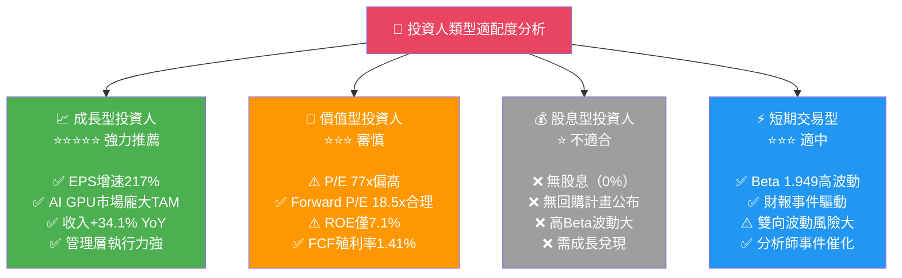

---

### 關鍵監控指標 Checklist

```
下次財報監控（預計2026 Q1，約2026年5月）
━━━━━━━━━━━━━━━━━━━━━━━━━━━━━━━━━━━━━━━━━━━━━━━━━━━━━━━━━
📊 財務指標監控：
☐ 季度收入 > $10.5B（環比持續成長）
☐ 資料中心收入佔比 > 55%
☐ Non-GAAP 毛利率 > 54%
☐ Non-GAAP 每股EPS > $3.0
☐ FCF > $1.8B（維持高轉換率）
☐ 指引（Guidance）2026Q2 > $10.5B

🏭 產業數據監控：
☐ AI伺服器資本支出（CSP廠商指引）
☐ NVIDIA H200/B300供應情況
☐ 台積電CoWoS先進封裝產能數據
☐ 全球半導體景氣指標（費城半導體指數）

🏢 競爭動態監控：
☐ NVIDIA下一代AI GPU發布時程
☐ Intel Gaudi 3 AI加速器市場進展
☐ Google TPU v5自研晶片進展
☐ AMD ROCm開發者社群成長率

🌍 總體環境監控：
☐ 美中出口管制新政策動向
☐ 美聯準會利率決策（影響WACC）
☐ 大型科技公司AI資本支出計畫更新
━━━━━━━━━━━━━━━━━━━━━━━━━━━━━━━━━━━━━━━━━━━━━━━━━━━━━━━━━
```

---

## 📊 報告最終總結

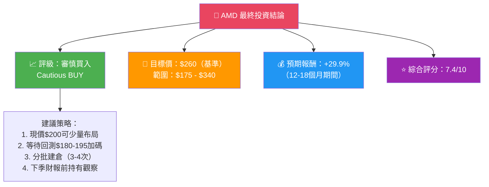

---

```
╔══════════════════════════════════════════════════════════════════╗
║                   AMD 核心投資命題摘要                           ║
╠══════════════════════════════════════════════════════════════════╣
║                                                                  ║
║  📌 核心命題：AMD是NVIDIA之外最具競爭力的AI晶片公司              ║
║                                                                  ║
║  🚀 成長引擎：AI GPU（MI系列）+ 伺服器CPU（EPYC）雙驅動          ║
║     2025年收入$34.64B (+34.1%)，2026E預計$45-50B (+30-45%)     ║
║                                                                  ║
║  💰 財務基礎：淨現金$6.55B，FCF $6.74B，財務彈性充裕             ║
║                                                                  ║
║  ⚖️  估值定位：Forward P/E 18.5x 在AI科技股中具吸引力            ║
║     vs NVIDIA ~35x，AMD提供相對折價的AI基礎設施入口              ║
║                                                                  ║
║  ⚠️  核心風險：軟體生態（ROCm vs CUDA）差距 + 競爭壓力           ║
║                                                                  ║
║  🎯 目標價 $260（+29.9%上行空間）｜ 評級：審慎買入               ║
║                                                                  ║
╚══════════════════════════════════════════════════════════════════╝
```

---

> **⚠️ 免責聲明**：本報告為基於公開財務數據的AI輔助研究分析，僅供學術研究與參考目的，不構成任何投資建議或邀約。投資涉及風險，過去表現不代表未來結果。讀者應自行進行盡職調查，並諮詢專業持牌財務顧問後再做投資決策。本報告所有估計、預測及目標價均基於特定假設，實際結果可能有重大差異。

---

*報告生成時間：2026-02-28 ｜ 數據截止日：2026-02-28 ｜ 分析框架：CFA基本面分析法*