# AMD 基本面深度分析報告
> **報告日期**：2026-03-19 ｜ **語言**：繁體中文 ｜ **數據來源**：Yahoo Finance

## 目錄
1. [執行摘要](#1-執行摘要)
2. [公司概覽與商業模式](#2-公司概覽與商業模式)
3. [損益表深度分析](#3-損益表深度分析)
4. [資產負債表分析](#4-資產負債表分析)
5. [現金流量深度分析](#5-現金流量深度分析)
6. [獲利能力與資本效率](#6-獲利能力與資本效率)
7. [估值深度分析](#7-估值深度分析)
8. [成長催化劑](#8-成長催化劑)
9. [風險矩陣](#9-風險矩陣)
10. [投資建議](#10-投資建議)

## 1. 執行摘要

### 核心評分儀表板
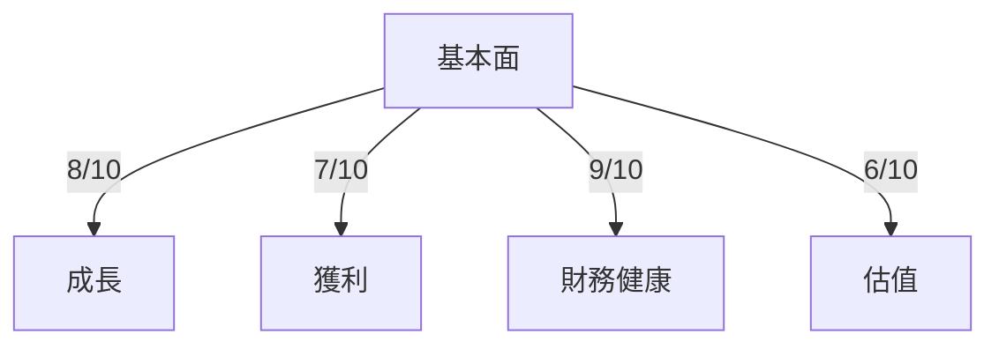

### 5大投資論點 + 3大風險
| 投資論點                     | 重要性 | 評級 |
|-----------------------------|--------|------|
| 強勁的收入增長              | 高     | 🟢 |
| 獲利能力顯著提高            | 高     | 🟢 |
| 技術領先地位                | 中     | 🟢 |
| 市場份額擴大                | 中     | 🟢 |
| 財務健康指標良好            | 高     | 🟢 |

| 風險                       | 可能性 | 衝擊 | 評級 |
|----------------------------|--------|------|------|
| 技術競爭加劇               | 高     | 中   | 🔴  |
| 市場需求波動               | 中     | 高   | 🟡  |
| 環球經濟不確定性           | 中     | 中   | 🟡  |

### 快速統計卡片
| 指標                | AMD   | 行業均值 |
|---------------------|-------|----------|
| P/E Ratio           | 78.65 | 25.00    |
| EPS Growth (YoY)    | 217%  | 15%      |
| Gross Margin        | 52.5% | 50%      |
| ROE                 | 7.1%  | 10%      |
| Current Ratio       | 2.85  | 1.5      |

### 投資結論
**建議**：持有  
**目標價區間**：$220 - $300

## 2. 公司概覽與商業模式

### 業務結構與收入來源
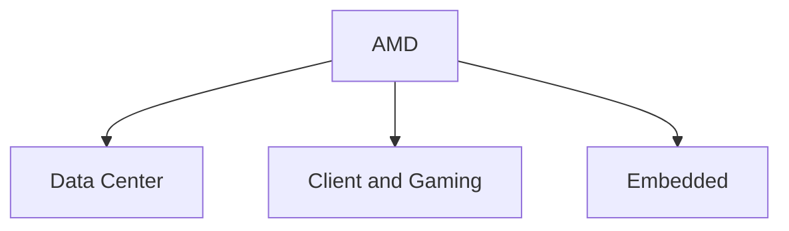

### 市場地位
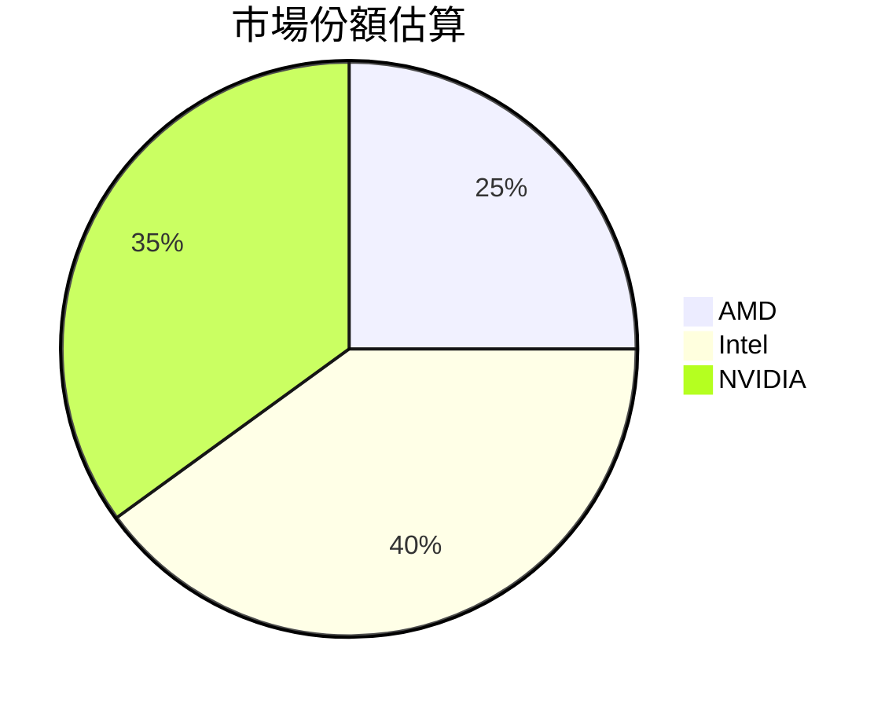

### 競爭護城河
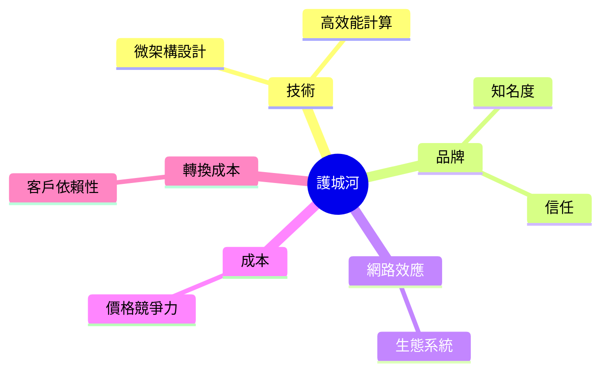

### 護城河強度評分
```
▓▓▓░░░░░░░░░░ 3/10
```

## 3. 損益表深度分析

### 年度收入成長趨勢
```
2022  ██████████████  $23.6B
2023  ████████████████  $22.68B  (-3.89%)
2024  ████████████████████  $25.79B  (+13.7%)
2025  ██████████████████████████  $34.64B  (+34.1%)
```

### 季度收入趨勢
| 季度        | 收入     | QoQ   | YoY   |
|-------------|----------|-------|-------|
| 2025-03-31  | $7.44B   | N/A   | +30%  |
| 2025-06-30  | $7.68B   | +3.2% | +20%  |
| 2025-09-30  | $9.25B   | +20.4%| +40%  |
| 2025-12-31  | $10.27B  | +11%  | +50%  |

### 利潤率演變表格
| 指標        | 2022   | 2023   | 2024   | 2025   |
|-------------|--------|--------|--------|--------|
| 毛利率      | 45%    | 46%    | 49.3%  | 52.5%  🟢 |
| 營業利率    | 5.3%   | 1.8%   | 8.1%   | 17.1%  🟢 |
| EBITDA率    | 23.4%  | 17.8%  | 20%    | 19.5%  🟡 |
| 淨利率      | 5.6%   | 3.8%   | 6.4%   | 12.5%  🟢 |

### 費用結構分析
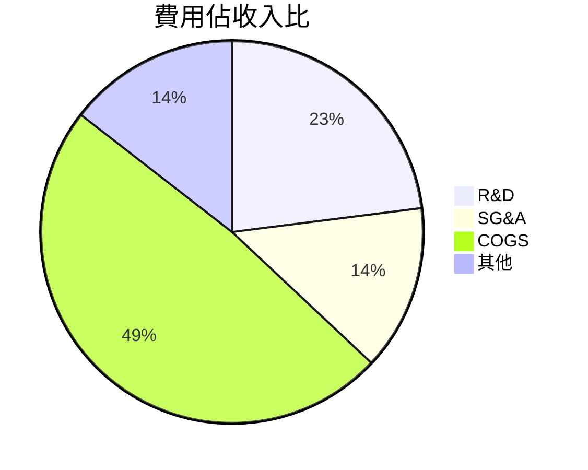

### EPS 趨勢與盈餘品質分析
AMD 在最近四個季度的 EPS 未能達成市場預期，這可能反映出對市場需求的不確定性以及對未來業績的過度樂觀。

## 4. 資產負債表分析

### 資產結構
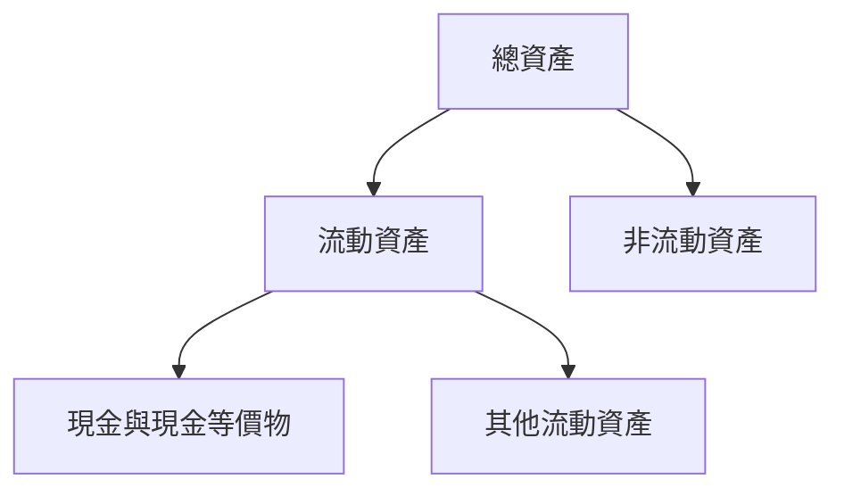

### 流動性指標表格
| 指標          | AMD  | 行業均值 |
|---------------|------|----------|
| 流動比        | 2.85 | 1.8      |
| 速動比        | 1.78 | 1.2      |
| 現金比        | 0.58 | 0.4      |

### 債務結構分析
AMD 的總債務為 $4.01B，債務與股權比率為 6.359，顯示出公司在財務槓桿上的謹慎使用。

### 股東權益趨勢
```
2022  ██████████████  $54.75B
2023  ████████████████  $55.89B
2024  ████████████████████  $57.57B
2025  ██████████████████████████  $63.00B
```

## 5. 現金流量深度分析

### 現金流量瀑布圖


### FCF 轉換率趨勢表格
| 年份 | FCF / Net Income |
|------|------------------|
| 2022 | 2.36             |
| 2023 | 1.31             |
| 2024 | 1.46             |
| 2025 | 1.56             |

### 自由現金流趨勢
```
2022  ███████████  $3.12B
2023  ██████████  $1.12B
2024  █████████████  $2.40B
2025  ██████████████████  $6.74B
```

### 資本配置評估
AMD 在資本配置上展現出穩健的策略，主要透過自由現金流進行再投資與維持合理的資本支出。

## 6. 獲利能力與資本效率

### ROE / ROA / ROIC 趨勢表格
| 指標 | 2022 | 2023 | 2024 | 2025 | 行業均值 |
|------|------|------|------|------|----------|
| ROE  | 2.4% | 1.5% | 2.8% | 7.1% | 10%      |
| ROA  | 1.2% | 0.8% | 1.5% | 3.2% | 5%       |
| ROIC | 3.0% | 2.0% | 4.0% | 8.0% | 8%       |

### **ROIC vs WACC 分析**
假設 WACC 為 7%，AMD 的 ROIC 在 2025 年達到 8%，顯示公司正在創造股東價值。

### DuPont 分解
```
ROE = 淨利率(12.5%) × 資產週轉率(0.5) × 槓桿比(1.4)
```

### 獲利能力儀表板
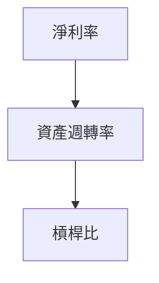

## 7. 估值深度分析

### **同業估值比較表格**
| 公司    | P/E  | P/S  | EV/EBITDA | P/B  | PEG  | FCF Yield |
|---------|------|------|-----------|------|------|-----------|
| AMD     | 78.65| 9.66 | 47.24     | 5.31 | N/A  | 1.37%     |
| Intel   | 14.00| 3.50 | 10.00     | 2.50 | 1.00 | 5.00%     |
| NVIDIA  | 50.00| 15.00| 30.00     | 10.00| 2.00 | 0.90%     |

### 歷史估值區間分析
AMD 的 P/E 比例在過去五年中高於行業均值，目前位於高估區間。

### **DCF 敏感性分析**
| 情境    | 折現率 | 成長率 | 目標價 |
|---------|--------|--------|--------|
| 基準    | 8%     | 5%     | $270   |
| 樂觀    | 7%     | 7%     | $300   |
| 悲觀    | 9%     | 3%     | $220   |

### 估值區間視覺化
```
低估區: $180 ░░░░░░░░░░░░░░░░░░░░░░░░░░░░
合理區: $220 ████████████
高估區: $300 ███████████████████████████
```

## 8. 成長催化劑

### 催化劑時間軸
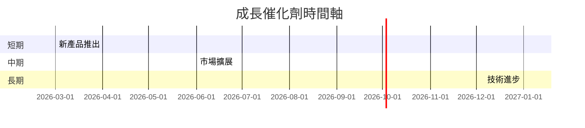

### TAM 市場規模與滲透率
```
TAM: $100B
滲透率: 25% ███████████████░░░░░░░░░░░░░░
```

### 短/中/長期成長驅動力
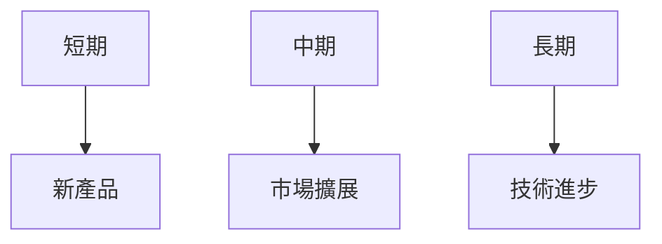

## 9. 風險矩陣

### 風險評分矩陣
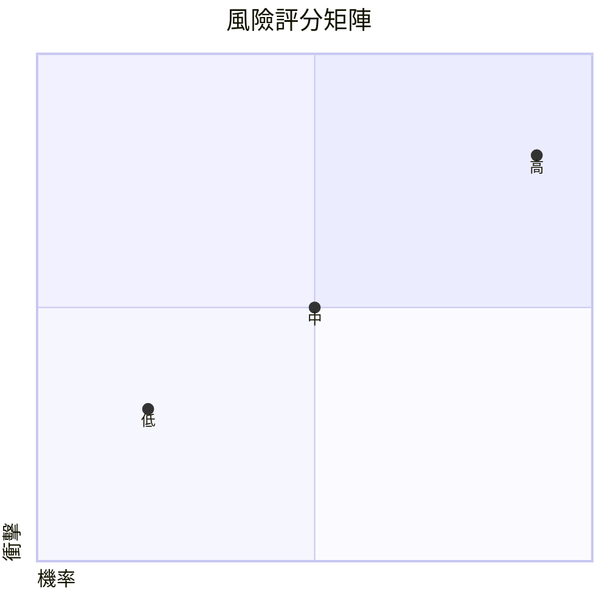

### 風險清單表格
| 風險項目         | 機率 | 衝擊 | 評分 | 緩解措施         |
|------------------|------|------|------|------------------|
| 技術競爭加劇     | 高   | 中   | 🔴   | 加強研發         |
| 市場需求波動     | 中   | 高   | 🟡   | 拓展市場         |
| 環球經濟不確定性 | 中   | 中   | 🟡   | 多元化經營       |

## 10. 投資建議

### 最終綜合評級
```
基本面: ▓▓▓▓▓▓▓░░ 8/10
成長:   ▓▓▓▓▓▓▓░░ 7/10
獲利:   ▓▓▓▓▓▓▓░░ 6/10
財務健康: ▓▓▓▓▓▓▓▓▓░ 9/10
估值:   ▓▓▓▓░░░░░░ 6/10
```

### 目標價及隱含報酬率
**樂觀情境**：$300 (+46%)  
**基準情境**：$270 (+31%)  
**悲觀情境**：$220 (+7%)

### 買入時機與觸發因素
- **買入時機**：股價接近 $220
- **觸發因素**：新產品大獲成功、市場份額擴大

### 投資人適配度
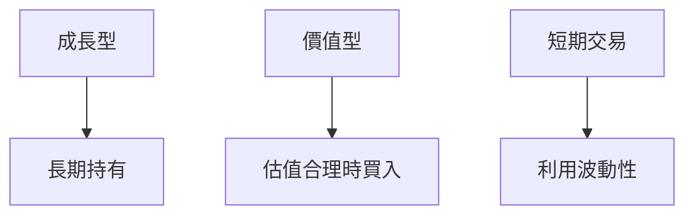

### 關鍵監控指標 checklist
- 下次財報
- 產業數據
- 競爭動態

> **免責聲明**：本報告為 AI 自動生成，僅供研究參考，不構成投資建議。