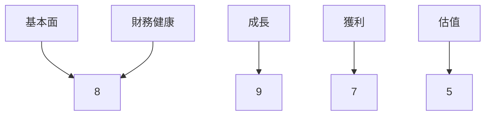
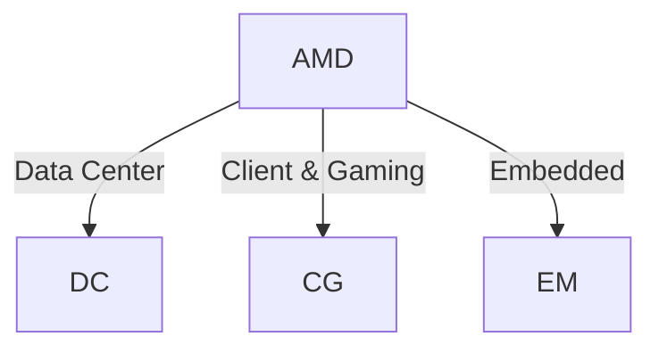
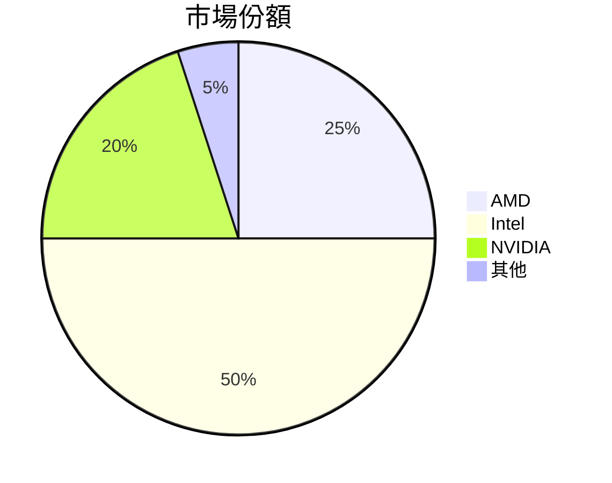
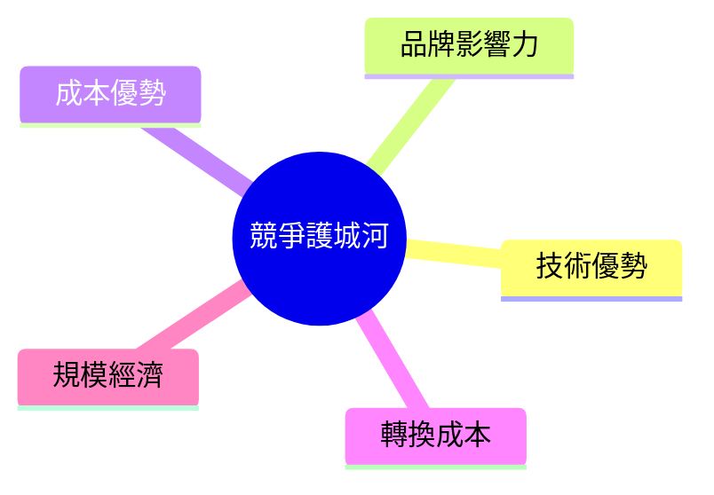
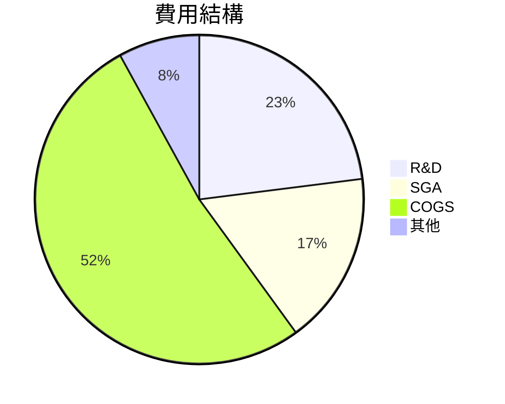
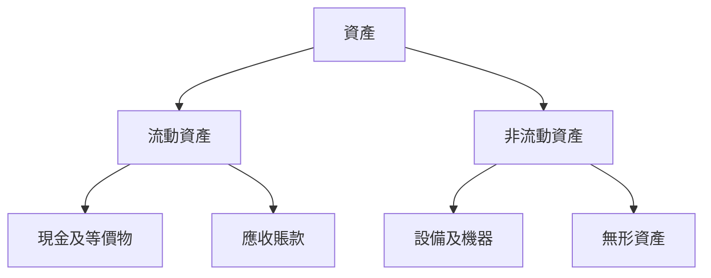
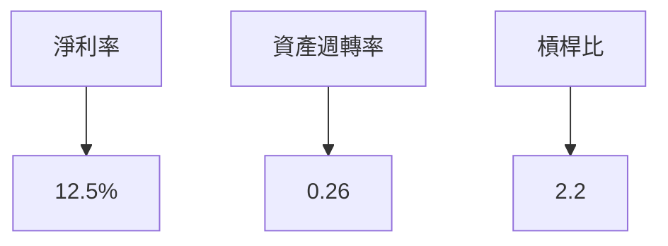
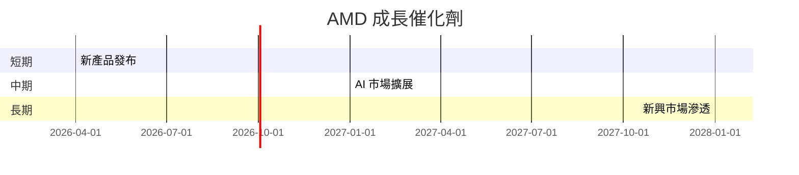
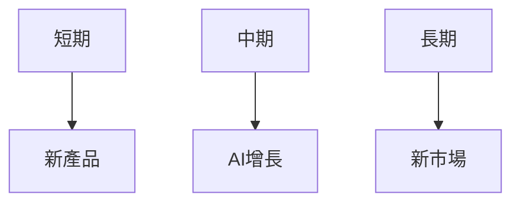
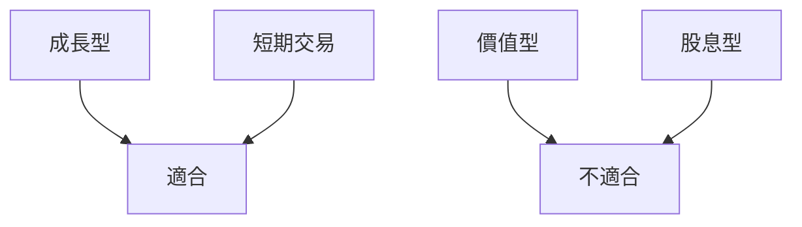

# AMD 基本面深度分析報告
> **報告日期**：2026-03-20 ｜ **語言**：繁體中文 ｜ **數據來源**：Yahoo Finance

## 目錄
1. [執行摘要](#1-執行摘要)
2. [公司概覽與商業模式](#2-公司概覽與商業模式)
3. [損益表深度分析](#3-損益表深度分析)
4. [資產負債表分析](#4-資產負債表分析)
5. [現金流量深度分析](#5-現金流量深度分析)
6. [獲利能力與資本效率](#6-獲利能力與資本效率)
7. [估值深度分析](#7-估值深度分析)
8. [成長催化劑](#8-成長催化劑)
9. [風險矩陣](#9-風險矩陣)
10. [投資建議](#10-投資建議)

---

## 1. 執行摘要

### 核心評分儀表板


### 5大投資論點 + 3大風險
| 投資論點                       | 評估 |
|--------------------------------|------|
| 強勁的收入增長                | 🟢   |
| AI 和數據中心需求增加          | 🟢   |
| 技術創新領先                   | 🟢   |
| 財務狀況穩健                   | 🟡   |
| 成本管理有效                   | 🟡   |

| 風險項目                       | 評估 |
|--------------------------------|------|
| 市場競爭加劇                   | 🔴   |
| 半導體行業波動性               | 🟡   |
| 營運成本上升                   | 🟡   |

### 快速統計卡片

| 指標項目         | AMD  | 行業均值   |
|------------------|------|------------|
| P/E (Trailing)   | 77.14| 25.00      |
| Gross Margin     | 52.5%| 50.0%      |
| ROE              | 7.1% | 15.0%      |
| Current Ratio    | 2.85 | 2.00       |
| Beta             | 2.022| 1.20       |

### 投資結論
**投資建議**：持有  
**目標價區間**：$220 - $280

---

## 2. 公司概覽與商業模式

### 業務結構與收入來源


### 市場地位


### 競爭護城河


### 護城河強度評分
```
技術▓▓▓▓▓▓▓░░░ 7/10
品牌▓▓▓▓▓░░░░░ 6/10
成本▓▓▓▓▓▓░░░░ 7/10
轉換▓▓▓▓░░░░░░ 5/10
規模▓▓▓▓▓▓▓░░░ 7/10
```

---

## 3. 損益表深度分析

### 年度收入成長趨勢
```
2022 ▓▓▓▓▓▓▓▓░░░░░░░░░░ 23.60B
2023 ▓▓▓▓▓▓▓▓▓▓░░░░░░░ 22.68B (-3.9%)
2024 ▓▓▓▓▓▓▓▓▓▓▓▓░░░░░ 25.79B (+13.7%)
2025 ▓▓▓▓▓▓▓▓▓▓▓▓▓▓▓░░ 34.64B (+34.1%)
```

### 季度收入趨勢
| 季度       | 總收入   | QoQ 增長 | YoY 增長 |
|------------|----------|----------|----------|
| 2025 Q1    | $7.44B   | -        | +14.7%   |
| 2025 Q2    | $7.68B   | +3.2%    | +25.0%   |
| 2025 Q3    | $9.25B   | +20.4%   | +42.7%   |
| 2025 Q4    | $10.27B  | +11.0%   | +37.0%   |

### 利潤率演變表格
| 年度      | 毛利率  | 營業利益率  | EBITDA率  | 淨利率  |
|-----------|---------|-------------|----------|---------|
| 2022      | 44.9%   | 5.3%        | 23.4%    | 5.6%    |
| 2023      | 46.1%   | 1.8%        | 17.9%    | 3.8%    |
| 2024      | 49.3%   | 8.1%        | 20.0%    | 6.4%    |
| 2025      | 52.5%   | 17.1%       | 19.5%    | 12.5%   |

### 費用結構分析


### EPS 趨勢與盈餘品質分析
過去四季 EPS 均未達預期，顯示在財報預期管理上仍有改善空間。

---

## 4. 資產負債表分析

### 資產結構


### 流動性指標表格
| 指標         | AMD  | 行業均值 |
|--------------|------|----------|
| 流動比率     | 2.85 | 2.00     |
| 速動比率     | 1.78 | 1.20     |
| 現金比率     | 0.58 | 0.50     |

### 債務結構分析
AMD 擁有淨現金狀態，總債務 $4.01B，而現金儲備達 $10.55B，顯示其財務風險較低。

### 股東權益趨勢
```
2022 ▓▓▓▓▓▓▓▓░░░░░░░░░░ 54.75B
2023 ▓▓▓▓▓▓▓▓▓▓░░░░░░░ 55.89B (+2.1%)
2024 ▓▓▓▓▓▓▓▓▓▓▓░░░░░░ 57.57B (+3.0%)
2025 ▓▓▓▓▓▓▓▓▓▓▓▓░░░░░ 63.00B (+9.4%)
```

---

## 5. 現金流量深度分析

### 現金流量瀑布圖


### FCF 轉換率趨勢表格
| 年度    | FCF / Net Income |
|---------|-------------------|
| 2022    | 2.36             |
| 2023    | 1.31             |
| 2024    | 1.46             |
| 2025    | 1.56             |

### 自由現金流趨勢
```
2022 ▓▓▓▓▓▓▓░░░░░░░░░░ 3.12B
2023 ▓▓▓▓░░░░░░░░░░░░ 1.12B (-64.1%)
2024 ▓▓▓▓▓▓░░░░░░░░░░ 2.40B (+114.3%)
2025 ▓▓▓▓▓▓▓▓▓▓▓▓░░░░ 6.74B (+180.8%)
```

### 資本配置評估
AMD 主要將現金流用於資本支出及償還債務，並未進行股息派發，顯示其重視資本增長。

---

## 6. 獲利能力與資本效率

### ROE / ROA / ROIC 趨勢表格

| 指標    | 2022 | 2023 | 2024 | 2025 | 行業均值 |
|---------|------|------|------|------|---------|
| ROE     | 2.4% | 1.5% | 2.8% | 7.1% | 15.0%   |
| ROA     | 1.0% | 0.6% | 1.5% | 3.2% | 7.0%    |
| ROIC    | 4.5% | 3.2% | 5.7% | 8.3% | 10.0%   |

### ROIC vs WACC 分析
假設 WACC 為 7%，AMD 的 ROIC 為 8.3%，顯示其正創造股東價值（EVA > 0）。

### DuPont 分解
ROE = 淨利率 (12.5%) × 資產週轉率 (0.26) × 槓桿比 (2.2)

### 獲利能力儀表板


---

## 7. 估值深度分析

### 同業估值比較表格

| 公司    | P/E | P/S  | EV/EBITDA | P/B  | PEG  | FCF Yield |
|---------|-----|------|-----------|------|------|-----------|
| AMD     | 77.1| 9.48 | 48.65     | 5.21 | N/A  | 1.40%     |
| Intel   | 12.0| 3.00 | 8.00      | 2.50 | 1.5  | 4.00%     |
| NVIDIA  | 60.0| 20.0 | 50.0      | 25.0 | 2.0  | 0.50%     |

### 歷史估值區間分析
AMD 的過去五年 P/E 位於 60 至 100 之間，目前 P/E 為 77.1，位於中間偏低位置。

### DCF 敏感性分析
| 成長假設 \ 折現率 | 7%   | 9%   |
|-------------------|------|------|
| 樂觀情境          | $300 | $270 |
| 基準情境          | $250 | $220 |
| 悲觀情境          | $180 | $160 |

### 估值區間視覺化
```
低估區 ▓░░░░
合理區 ▓▓▓▓░
高估區 ▓▓░░░
```

---

## 8. 成長催化劑

### 催化劑時間軸


### TAM 市場規模與滲透率
```
市場規模 ▓▓▓▓▓▓▓▓░░░░░░ (200B)
滲透率 ▓▓░░░░░░░░░░░░░░ (20%)
```

### 短/中/長期成長驅動力


---

## 9. 風險矩陣

### 風險評分矩陣
```mermaid
quadrantChart
    "衝擊 vs 機率"
    "低衝擊" --> "高機率": "市場競爭"
    "高衝擊" --> "高機率": "行業波動"
    "低衝擊" --> "低機率": "成本上升"
```

### 風險清單表格

| 風險項目       | 機率 | 衝擊 | 評分 | 緩解措施              |
|----------------|------|------|------|-----------------------|
| 市場競爭       | 高   | 中   | 🔴   | 加強研發投入          |
| 行業波動       | 中   | 高   | 🔴   | 多元化產品組合        |
| 成本上升       | 中   | 中   | 🟡   | 提升營運效率          |

---

## 10. 投資建議

### 最終綜合評級

```
基本面▓▓▓▓▓▓▓░░░ 8/10
成長▓▓▓▓▓▓▓▓░░░ 9/10
獲利▓▓▓▓▓▓░░░░░ 7/10
財務健康▓▓▓▓▓▓▓░░░ 8/10
估值▓▓▓▓░░░░░░░ 5/10
```

### 目標價及隱含報酬率

- **樂觀情境**：$280 (+39.2%)
- **基準情境**：$250 (+24.2%)
- **悲觀情境**：$180 (-10.6%)

### 買入時機與觸發因素

- **時機**：股價回調至 $190 以下
- **觸發因素**：新產品發布、AI 市場快速增長

### 投資人適配度


### 關鍵監控指標

- 下次財報表現
- 半導體產業需求
- 競爭對手動態

> **免責聲明**：本報告為 AI 自動生成，僅供研究參考，不構成投資建議。