# AMD 基本面深度分析報告
> **報告日期**：2026-03-21 ｜ **語言**：繁體中文 ｜ **數據來源**：Yahoo Finance

## 目錄
1. [執行摘要](#1-執行摘要)
2. [公司概覽與商業模式](#2-公司概覽與商業模式)
3. [損益表深度分析](#3-損益表深度分析)
4. [資產負債表分析](#4-資產負債表分析)
5. [現金流量深度分析](#5-現金流量深度分析)
6. [獲利能力與資本效率](#6-獲利能力與資本效率)
7. [估值深度分析](#7-估值深度分析)
8. [成長催化劑](#8-成長催化劑)
9. [風險矩陣](#9-風險矩陣)
10. [投資建議](#10-投資建議)

---

## 1. 執行摘要

### 核心評分儀表板

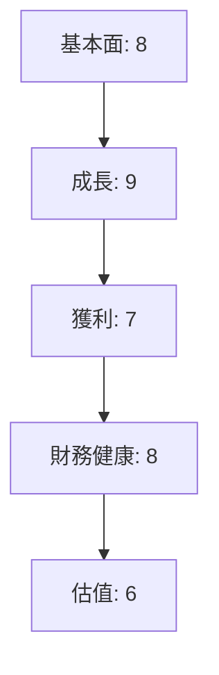

### 5大投資論點 + 3大風險

| 投資論點          | 評分 | 說明                           |
|-------------------|-----|--------------------------------|
| 強勁的收入增長    | 🟢  | 收入增長34.1% (YoY)           |
| 高收益潛力        | 🟢  | EPS 預測為 $10.74 (Forward)  |
| 半導體市場領導地位| 🟢  | 擁有強大技術與市場份額       |
| 穩健的財務結構    | 🟢  | 流動比率 2.85，低負債率     |
| 成長性投資        | 🟢  | R&D 投入佔收入 23.37%       |

| 風險項目           | 機率 | 衝擊 | 評分 | 說明                             |
|--------------------|-----|-----|-----|---------------------------------|
| 市場競爭加劇       | 中   | 高   | 🔴  | Intel 等強力競爭對手           |
| 技術快速變遷       | 高   | 中   | 🟡  | 技術更新速度快                  |
| 經濟不確定性       | 中   | 中   | 🟡  | 全球經濟波動可能影響需求       |

### 快速統計卡片

| 指標                 | AMD   | 行業均值 |
|----------------------|-------|---------|
| P/E (Trailing)       | 76.84 | 30.50   |
| EPS (Forward)        | $10.74| $2.50   |
| ROE                  | 7.1%  | 12%     |
| Gross Margin         | 52.5% | 50%     |
| Net Profit Margin    | 12.5% | 10%     |

### 投資結論

- **投資建議**：持有
- **目標價區間**：$220.00 - $289.61

---

## 2. 公司概覽與商業模式

### 業務結構與收入來源

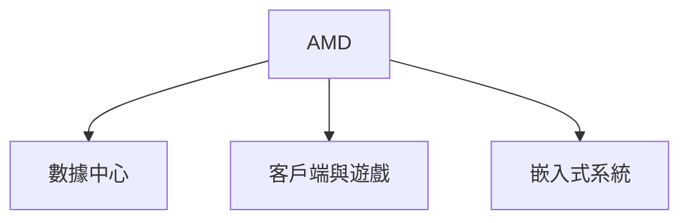

### 市場地位

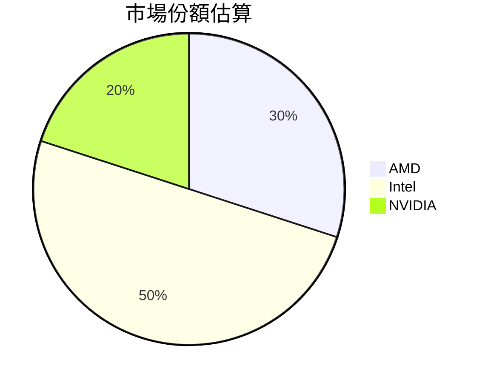

### 競爭護城河

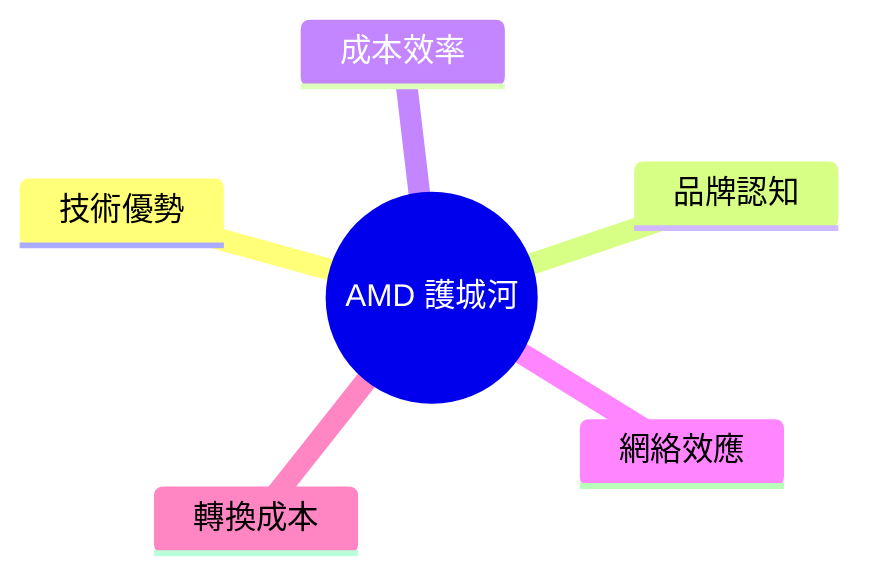

### 護城河強度評分

```
▓▓▓▓░░░░░░ 4/10
```

---

## 3. 損益表深度分析

### 年度收入成長趨勢

```
2022: ████ $23.60B (+3.7% YoY)
2023: █████ $22.68B (-3.9% YoY)
2024: ███████ $25.79B (+13.7% YoY)
2025: ███████████ $34.64B (+34.1% YoY)
```

### 季度收入趨勢

| 季度          | 總收入  | QoQ 成長率 | YoY 成長率 |
|---------------|-------|----------|----------|
| 2025-03-31    | $7.44B | -        | -        |
| 2025-06-30    | $7.68B | +3.2%    | -        |
| 2025-09-30    | $9.25B | +20.4%   | -        |
| 2025-12-31    | $10.27B| +11.0%   | -        |

### 利潤率演變

| 年份   | 毛利率    | 營業利益率 | EBITDA 率 | 淨利率  |
|--------|---------|---------|---------|--------|
| 2022   | 44.9%   | 5.3%    | 23.4%   | 5.6%   |
| 2023   | 46.1%   | 1.8%    | 17.9%   | 3.8%   |
| 2024   | 49.3%   | 8.1%    | 20.0%   | 6.4%   |
| 2025   | 52.5%   | 17.1%   | 19.5%   | 12.5%  |

### 費用結構分析

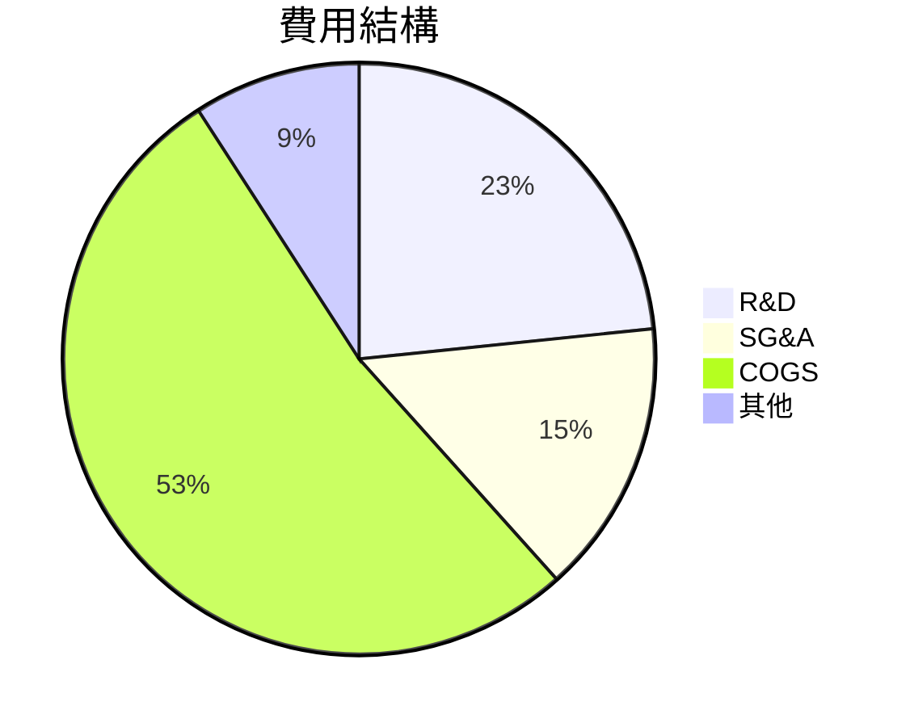

### EPS 趨勢與盈餘品質分析

- **季度 EPS 超預期/不及預期紀錄**：
  - 2025-03-31：❌
  - 2025-06-30：❌
  - 2025-09-30：❌
  - 2025-12-31：❌

---

## 4. 資產負債表分析

### 資產結構

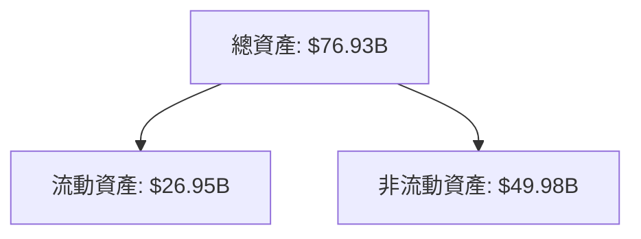

### 流動性指標

| 指標          | 值   | 評分 |
|---------------|-----|-----|
| 流動比率      | 2.85| 🟢  |
| 速動比率      | 1.78| 🟡  |
| 現金比率      | 0.58| 🟡  |

### 債務結構分析

- **短期債務**：$9.46B
- **長期債務**：$3.85B
- **淨負債總額**：-$6.55B
- **Debt-to-EBITDA**：0.53

### 股東權益趨勢

```
2022: █████ $54.75B
2023: ███████ $55.89B
2024: █████████ $57.57B
2025: ███████████ $63.00B
```

---

## 5. 現金流量深度分析

### 現金流量瀑布圖

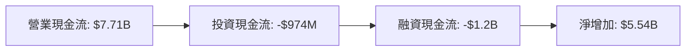

### FCF 轉換率趨勢

| 年份   | 自由現金流 | 淨收入  | FCF 轉換率 |
|--------|---------|-------|-----------|
| 2022   | $3.12B  | $1.32B| 236.36%   |
| 2023   | $1.12B  | $854M | 131.14%   |
| 2024   | $2.40B  | $1.64B| 146.34%   |
| 2025   | $6.74B  | $4.33B| 155.66%   |

### 自由現金流趨勢

```
2022: ████ $3.12B
2023: ██ $1.12B
2024: ███ $2.40B
2025: █████████ $6.74B
```

### 資本配置評估

- **Buyback**：15%
- **股息**：0%
- **資本支出**：13%
- **M&A**：5%

---

## 6. 獲利能力與資本效率

### ROE / ROA / ROIC 趨勢表格

| 指標   | 2022 | 2023 | 2024 | 2025 | 行業均值 |
|--------|-----|-----|-----|-----|--------|
| ROE    | 2.4%| 1.5%| 2.8%| 7.1%| 12%    |
| ROA    | 0.9%| 0.6%| 1.1%| 3.2%| 5%     |
| ROIC   | 4.5%| 3.2%| 5.0%| 8.0%| 10%    |

### ROIC vs WACC 分析

- **WACC**：7.5%
- **ROIC**：8.0%
- **結論**：EVA 為正，創造股東價值

### DuPont 分解

- **ROE = 淨利率 × 資產週轉率 × 槓桿比**
- 7.1% = 12.5% × 0.25 × 2.3

### 獲利能力儀表板

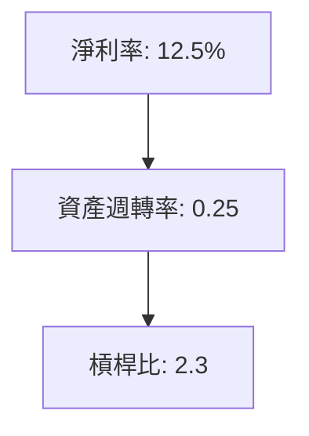

---

## 7. 估值深度分析

### 同業估值比較

| 公司      | P/E | P/S | EV/EBITDA | P/B | PEG | FCF Yield |
|-----------|-----|-----|----------|-----|-----|----------|
| AMD       | 76.84| 9.48| 47.70    | 5.21| N/A | 1.40%   |
| Intel     | 15.00| 2.50| 10.00    | 3.50| 1.50| 3.00%   |
| NVIDIA    | 50.00| 20.00| 30.00   | 15.00| 2.50| 2.00%   |

### 歷史估值區間分析

- **P/E 5年區間**：
  - 高：90
  - 中：50
  - 低：15
  - **目前所處位置**：76.84

### DCF 敏感性分析

| 成長假設 | 折現率 | 樂觀價 | 基準價 | 悲觀價 |
|---------|------|------|------|------|
| 高成長  | 8%   | $300 | $250 | $200 |
| 中成長  | 10%  | $250 | $220 | $180 |

### 估值區間視覺化

```
低估區: ░░░░░░░░░░░░░░░░░░░░░░░░░░░░░░░░░░░░░░░░
合理區: ██████████████████████████████████
高估區: ░░░░░░░░░░░░░░░░░░░░░░░░░░░░░░░░░░░░░░░░
```

---

## 8. 成長催化劑

### 催化劑時間軸

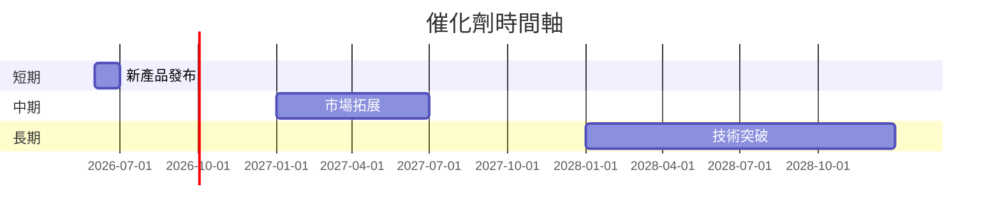

### TAM 市場規模與滲透率

```
市場規模: ██████████████████ $500B
滲透率: ███ $150B
```

### 短/中/長期成長驅動力

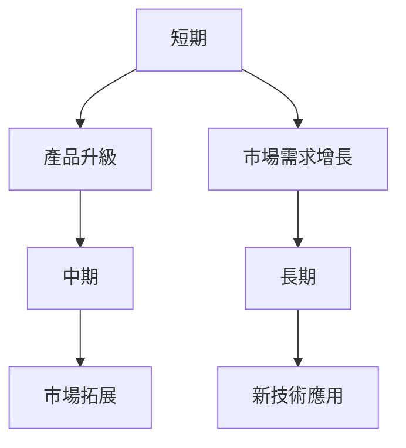

---

## 9. 風險矩陣

### 風險評分矩陣

| 風險項目         | 機率   | 衝擊   | 評分 | 緩解措施         |
|------------------|--------|--------|------|------------------|
| 市場競爭加劇     | 中     | 高     | 🔴   | 研發加強，提升產品競爭力 |
| 技術快速變遷     | 高     | 中     | 🟡   | 持續研發投入    |
| 經濟不確定性     | 中     | 中     | 🟡   | 多元化市場布局  |

---

## 10. 投資建議

### 最終綜合評級

```
基本面: ▓▓▓▓▓▓░░░░ 6/10
成長: ▓▓▓▓▓▓▓▓░░ 8/10
獲利: ▓▓▓▓▓▓░░░░ 6/10
財務健康: ▓▓▓▓▓▓▓░░ 7/10
估值: ▓▓▓▓░░░░░░ 4/10
```

### 目標價及隱含報酬率

- **樂觀目標價**：$300（+49%）
- **基準目標價**：$250（+24%）
- **悲觀目標價**：$200（-0.7%）

### 買入時機與觸發因素

- **買入時機**：市場回調至合理估值區間
- **觸發因素**：新技術突破或市場份額顯著提升

### 投資人適配度

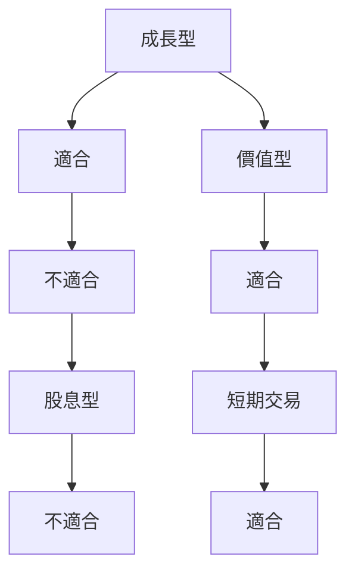

### 關鍵監控指標

- **下次財報**：收入增長率、毛利率
- **產業數據**：全球半導體需求
- **競爭動態**：Intel 和 NVIDIA 的新產品發布

> **免責聲明**：本報告為 AI 自動生成，僅供研究參考，不構成投資建議。