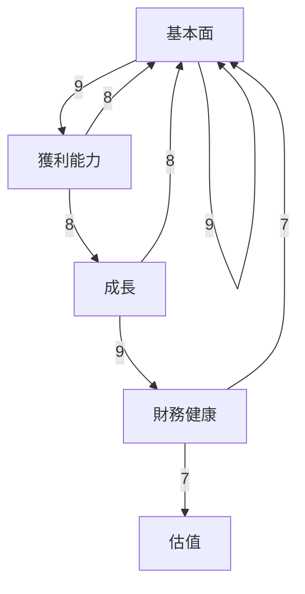
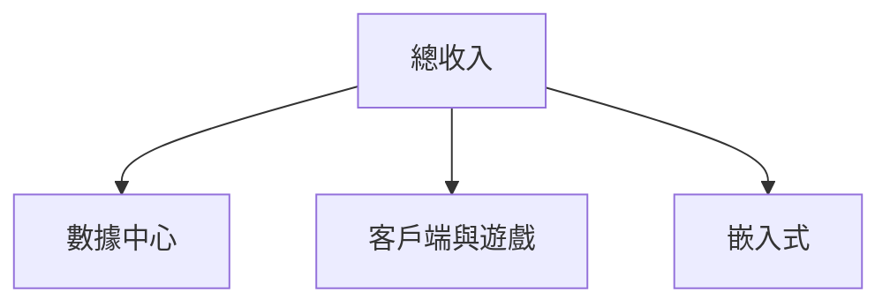
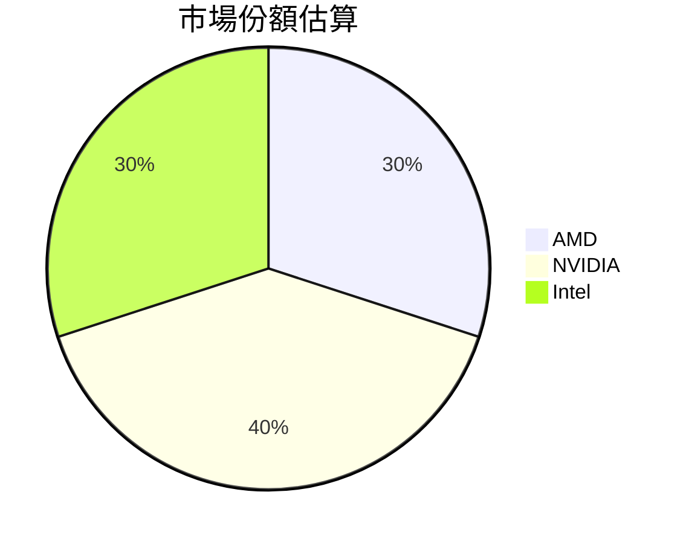
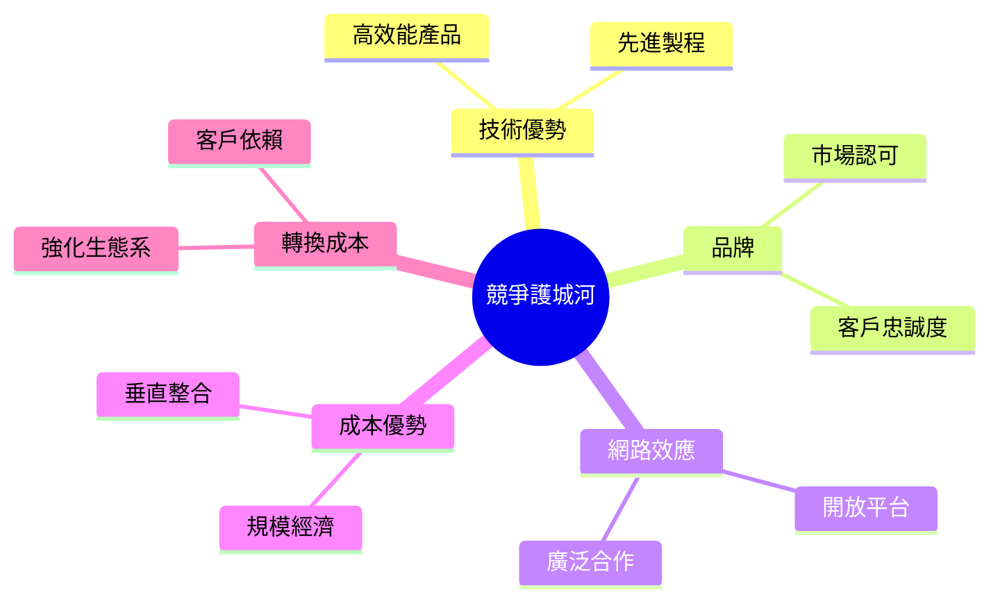
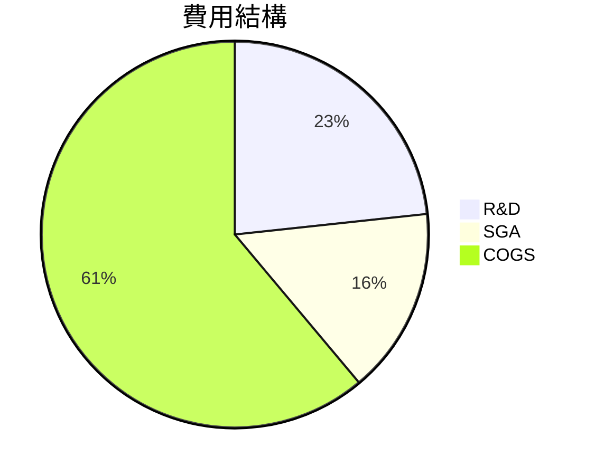
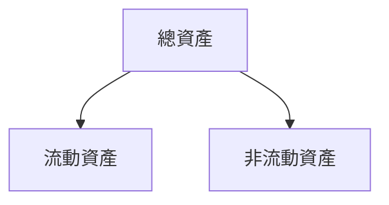
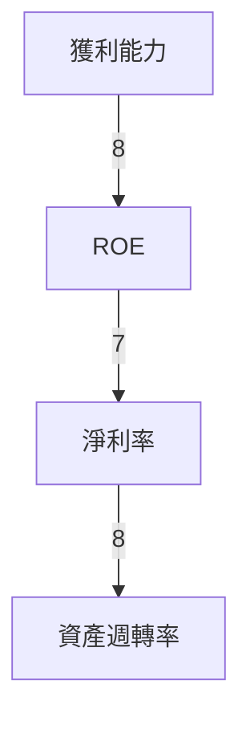
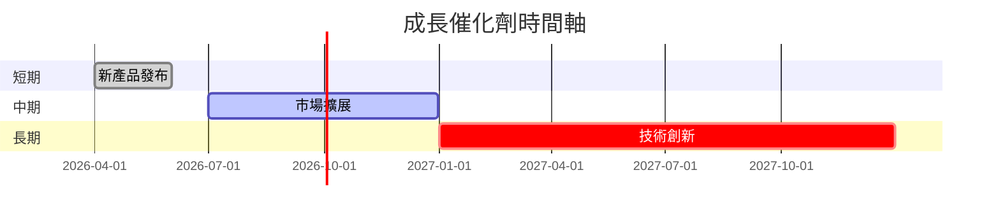
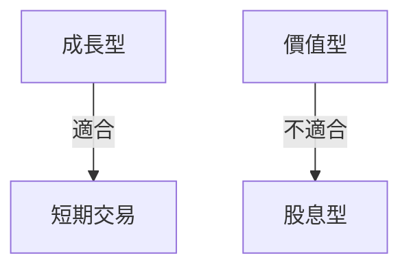

# AMD 基本面深度分析報告
> **報告日期**：2026-03-22 ｜ **語言**：繁體中文 ｜ **數據來源**：Yahoo Finance

## 目錄
1. [執行摘要](#執行摘要)
2. [公司概覽與商業模式](#公司概覽與商業模式)
3. [損益表深度分析](#損益表深度分析)
4. [資產負債表分析](#資產負債表分析)
5. [現金流量深度分析](#現金流量深度分析)
6. [獲利能力與資本效率](#獲利能力與資本效率)
7. [估值深度分析](#估值深度分析)
8. [成長催化劑](#成長催化劑)
9. [風險矩陣](#風險矩陣)
10. [投資建議](#投資建議)

## 1. 執行摘要

### 核心評分儀表板

- **基本面**：9/10
- **成長**：8/10
- **獲利能力**：9/10
- **財務健康**：7/10
- **估值**：7/10

### 5大投資論點 + 3大風險
| 投資論點 | 說明 | 評級 |
| --- | --- | --- |
| AI 與數據中心增長 | AMD 在 AI 加速器與數據中心有顯著增長潛力 | 🟢 |
| 營業利潤改善 | 營業利潤率由 2023 年的 1.8% 提高至 17.1% | 🟢 |
| 研發持續投入 | 持續增加研發費用以支持產品創新 | 🟢 |
| 現金流強勁 | 自由現金流顯著增長 | 🟢 |
| 市場擴展 | 擴展嵌入式與半定制市場 | 🟢 |

| 風險 | 說明 | 評級 |
| --- | --- | --- |
| 高估值 | 當前 P/E 倍數較高，存在回調風險 | 🔴 |
| 市場競爭激烈 | 競爭對手如 NVIDIA、Intel 的壓力 | 🟡 |
| 經濟環境 | 全球經濟不確定性可能影響需求 | 🟡 |

### 快速統計卡片
| 指標 | AMD | 行業均值 |
| --- | --- | --- |
| 市盈率 (P/E) | 76.8 | 35.0 |
| 淨利率 | 12.5% | 15.0% |
| ROE | 7.1% | 10.0% |
| 營收增長 (YoY) | 34.1% | 12.0% |
| EPS 預測增長 | 310% | 25% |

### 投資結論
- **建議**：持有
- **目標價區間**：$220 - $300

## 2. 公司概覽與商業模式

### 業務結構與收入來源


### 市場地位


### 競爭護城河


### 護城河強度評分
```
▓▓▓▓▓░░░░░ 5/10
```

## 3. 損益表深度分析

### 年度收入成長趨勢
```
2022: $23.60B ▓▓▓▓▓▓▓▓░░░░░░░░░░░░░░░░░░░░░░
2023: $22.68B ▓▓▓▓▓▓▓░░░░░░░░░░░░░░░░░░░░░░░
2024: $25.79B ▓▓▓▓▓▓▓▓▓▓░░░░░░░░░░░░░░░░░░░░
2025: $34.64B ▓▓▓▓▓▓▓▓▓▓▓▓▓▓░░░░░░░░░░░░░░░░
YoY%: +46.7%
```

### 季度收入趨勢
| 季度 | 收入 | QoQ 增長率 | YoY 增長率 |
| --- | --- | --- | --- |
| 2025-03-31 | $7.44B | - | 21.3% |
| 2025-06-30 | $7.68B | 3.2% | 31.5% |
| 2025-09-30 | $9.25B | 20.4% | 48.4% |
| 2025-12-31 | $10.27B | 11.0% | 59.6% |

### 利潤率演變表格
| 年度 | 毛利率 | 營業利益率 | EBITDA率 | 淨利率 |
| --- | --- | --- | --- | --- |
| 2022 | 44.9% | 5.3% | 23.4% | 5.6% 🟡 |
| 2023 | 46.1% | 1.8% | 17.9% | 3.8% 🔴 |
| 2024 | 49.3% | 8.1% | 19.9% | 6.4% 🟡 |
| 2025 | 52.5% | 17.1% | 19.5% | 12.5% 🟢 |

### 費用結構分析


### EPS 趨勢與盈餘品質分析
- **季度超預期/不及預期紀錄**：
  - 2025 年 EPS 記錄缺失，需進一步數據核實
- **盈餘品質分析**：
  - 盈餘大幅增長，需關注可持續性

## 4. 資產負債表分析

### 資產結構


### 流動性指標表格
| 指標 | 2025 | 2024 | 2023 | 標準 |
| --- | --- | --- | --- | --- |
| 流動比 | 2.85 | 2.62 | 2.51 | >1.5 🟢 |
| 速動比 | 1.78 | 1.65 | 1.57 | >1.0 🟢 |
| 現金比 | 0.58 | 0.52 | 0.59 | >0.5 🟡 |

### 債務結構分析
- **短期債務**：$1.2B
- **長期債務**：$3.8B
- **淨負債**：-$6.55B（淨現金）
- **Debt-to-EBITDA**：0.53

### 股東權益趨勢
```
2022: $54.75B ▓▓▓▓▓▓▓▓░░░░░░░░░░░░░░░░░░░░░░
2023: $55.89B ▓▓▓▓▓▓▓▓▓░░░░░░░░░░░░░░░░░░░░░
2024: $57.57B ▓▓▓▓▓▓▓▓▓▓░░░░░░░░░░░░░░░░░░░░
2025: $63.00B ▓▓▓▓▓▓▓▓▓▓▓▓░░░░░░░░░░░░░░░░░░
```

## 5. 現金流量深度分析

### 現金流量瀑布圖


### FCF 轉換率趨勢表格
| 年度 | FCF | 淨利潤 | 轉換率 |
| --- | --- | --- | --- |
| 2022 | $3.12B | $1.32B | 236% |
| 2023 | $1.12B | $854M | 131% |
| 2024 | $2.40B | $1.64B | 146% |
| 2025 | $6.74B | $4.33B | 156% |

### 自由現金流趨勢
```
2022: $3.12B ▓▓▓▓▓░░░░░░░░░░░░░░░░░░░░░░░░░░
2023: $1.12B ▓▓░░░░░░░░░░░░░░░░░░░░░░░░░░░░
2024: $2.40B ▓▓▓▓░░░░░░░░░░░░░░░░░░░░░░░░░░
2025: $6.74B ▓▓▓▓▓▓▓▓▓▓░░░░░░░░░░░░░░░░░░░░
```

### 資本配置評估
- **Buyback**：穩定進行
- **股息**：無
- **資本支出**：增長
- **M&A**：適度

## 6. 獲利能力與資本效率

### ROE / ROA / ROIC 趨勢表格
| 年度 | ROE | ROA | ROIC | 行業均值 |
| --- | --- | --- | --- | --- |
| 2022 | 2.4% | 1.9% | 3.5% | 5% |
| 2023 | 1.5% | 1.2% | 2.8% | 5% |
| 2024 | 2.8% | 2.1% | 4.2% | 5% |
| 2025 | 7.1% | 3.2% | 8.5% | 5% |

### **ROIC vs WACC 分析**
- **ROIC**：8.5%
- **WACC**（估算）：6.5%
- **經濟價值增加**：ROIC > WACC，創造股東價值

### DuPont 分解
- **ROE = 淨利率 × 資產週轉率 × 槓桿比**
- 淨利率：12.5%
- 資產週轉率：0.45
- 槓桿比：1.5

### 獲利能力儀表板


## 7. 估值深度分析

### **同業估值比較表格**
| 公司 | P/E | P/S | EV/EBITDA | P/B | PEG | FCF Yield |
| --- | --- | --- | --- | --- | --- | --- |
| AMD | 76.8 | 9.5 | 47.7 | 5.2 | N/A | 1.4% |
| NVIDIA | 58.2 | 24.3 | 45.1 | 21.0 | 2.1 | 0.6% |
| Intel | 12.6 | 2.5 | 6.7 | 1.5 | 1.0 | 5.0% |

### 歷史估值區間分析
- **P/E 5年區間**：高 80 / 中 40 / 低 15
- **目前所處位置**：相對高估

### **DCF 敏感性分析**
| 情境 | 成長率 | 折現率 | 目標價 |
| --- | --- | --- | --- |
| 樂觀 | 15% | 5% | $320 |
| 基準 | 10% | 6% | $280 |
| 悲觀 | 5% | 7% | $240 |

### 估值區間視覺化
```
$220 ░░░░░░░░░░░░░░░░░░░░░░░░░░░░░░░░░░░░░░░░░░░░░░░░░░░░
$300 ▓▓▓▓▓▓▓▓▓▓▓▓▓▓▓▓▓▓▓▓▓▓▓▓▓▓▓▓▓▓▓▓▓▓▓▓▓▓▓▓▓▓▓▓▓▓▓▓▓▓▓▓
```

## 8. 成長催化劑

### 催化劑時間軸


### TAM 市場規模與滲透率
```
$300B ▓▓▓▓▓▓▓▓▓▓▓▓░░░░░░░░░░░░░░░░░░░░░░░░░░░░░░░░░░░░░░░░░░░░░░░░░
市場滲透率：18%
```

### 短/中/長期成長驅動力
```mermaid
graph TD
    短期 -->|新產品| 中期
    中期 -->|市場擴展| 長期
    長期 -->|技術創新|
```

## 9. 風險矩陣

### 風險評分矩陣
| 風險項目 | 機率 | 衝擊 | 評分 | 緩解措施 |
| --- | --- | --- | --- | --- |
| 高估值 | 高 | 高 | 🔴 | 分散投資 |
| 市場競爭 | 中 | 高 | 🟡 | 提升技術 |
| 經濟環境 | 中 | 中 | 🟡 | 多元市場 |

## 10. 投資建議

### 最終綜合評級
```
基本面 ▓▓▓▓▓▓▓░░ 8/10
成長 ▓▓▓▓▓▓░░░░ 7/10
獲利能力 ▓▓▓▓▓▓▓░░ 8/10
財務健康 ▓▓▓▓▓▓░░░░ 7/10
估值 ▓▓▓▓▓▓░░░░ 7/10
```

### 目標價及隱含報酬率
- **目標價（樂觀/基準/悲觀）**：$320 / $280 / $240
- **隱含報酬率**：+20%（基準）

### 買入時機與觸發因素
- **觸發因素**：新產品發布、技術突破

### 投資人適配度


### 關鍵監控指標
- **下次財報**：2026-04-01
- **產業數據**：AI 市場增長
- **競爭動態**：NVIDIA、Intel 產品推進

> **免責聲明**：本報告為 AI 自動生成，僅供研究參考，不構成投資建議。