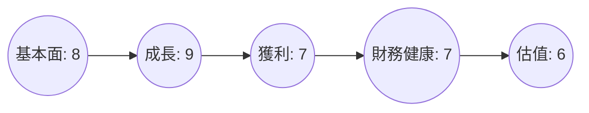
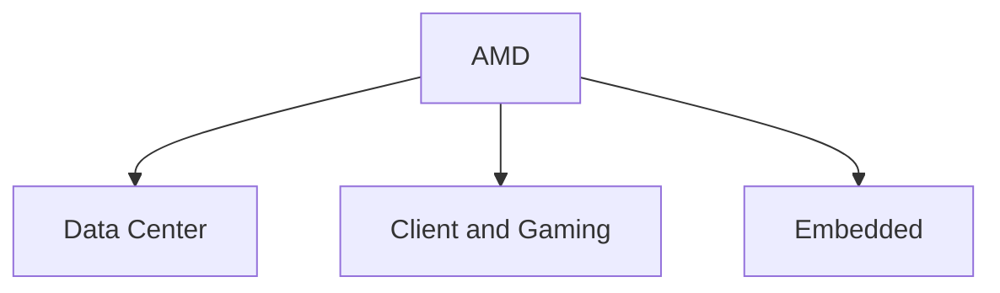
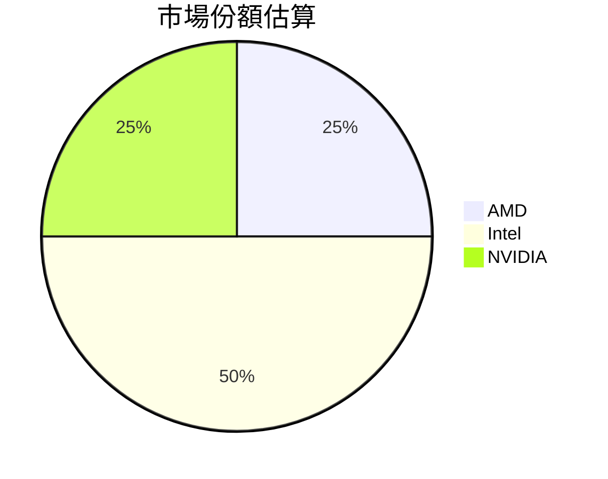
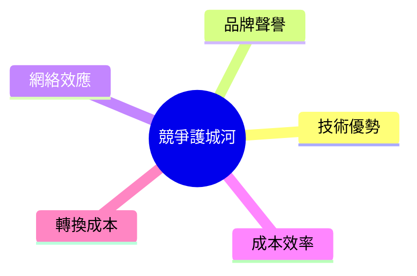
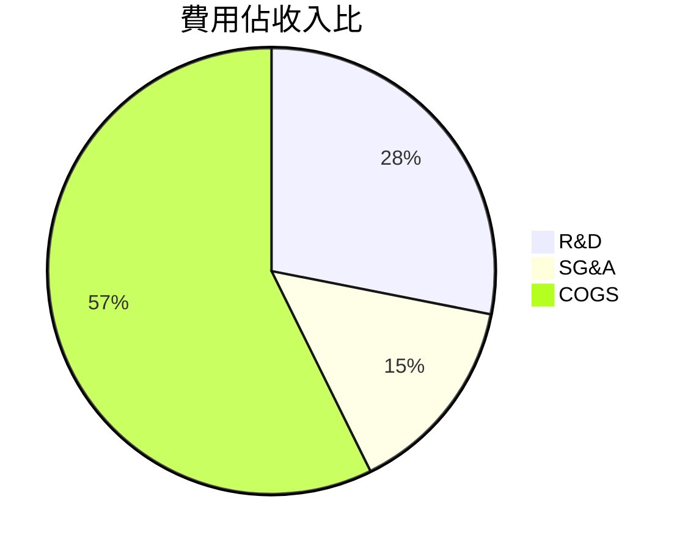
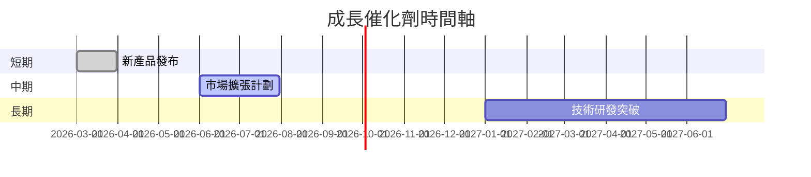
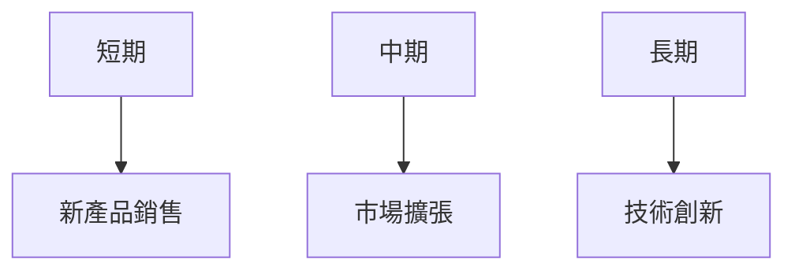
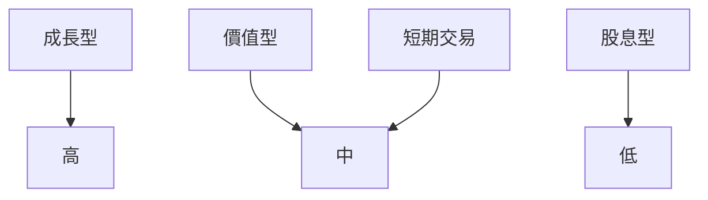

# AMD 基本面深度分析報告
> **報告日期**：2026-03-24 ｜ **語言**：繁體中文 ｜ **數據來源**：Yahoo Finance

## 目錄

## 1. 執行摘要
### 核心評分儀表板


### 5大投資論點 + 3大風險
| 投資論點                | 評分 |
|------------------------|------|
| AI 加速器市場增長潛力   | 🟢   |
| 資料中心業務擴張       | 🟢   |
| 技術創新領先           | 🟢   |
| 強勁的財務表現         | 🟢   |
| 權益增值潛力           | 🟡   |

| 風險因素                | 評分 |
|------------------------|------|
| 半導體市場競爭激烈     | 🔴   |
| 貿易政策不確定性       | 🟡   |
| 技術變革風險           | 🟡   |

### 快速統計卡片
| 指標                 | AMD          | 行業均值  |
|----------------------|--------------|----------|
| P/E (Trailing)       | 78.69        | 23.5     |
| P/S Ratio            | 9.67         | 6.2      |
| ROE                  | 7.1%         | 15%      |
| Gross Margin         | 52.5%        | 50%      |
| Net Profit Margin    | 12.5%        | 10%      |

### 投資結論
**建議**：買入  
**目標價區間**：$220 - $300

---

## 2. 公司概覽與商業模式

### 業務結構與收入來源


### 市場地位


### 競爭護城河


### 護城河強度評分
```
▓▓▓░░░░░░░░░░ 4/10
```

---

## 3. 損益表深度分析

### 年度收入成長趨勢
```
2022 ████░░░░░░░░ $23.60B
2023 ██████░░░░░░ $22.68B (-3.9%)
2024 ████████░░░░ $25.79B (+13.7%)
2025 ████████████ $34.64B (+34.1%)
```

### 季度收入趨勢

| 季度           | 總收入  | QoQ 成長率 | YoY 成長率 |
|----------------|--------|------------|------------|
| 2025-03-31     | $7.44B | -          | -          |
| 2025-06-30     | $7.68B | +3.2%      | -          |
| 2025-09-30     | $9.25B | +20.4%     | -          |
| 2025-12-31     | $10.27B| +11.0%     | -          |

### 利潤率演變表格
| 指標            | 2022  | 2023  | 2024  | 2025  | 
|-----------------|-------|-------|-------|-------|
| 毛利率          | 44.9% | 46.1% | 49.3% | 52.5% |
| 營業利率        | 5.3%  | 1.8%  | 8.1%  | 17.1% |
| EBITDA 利率     | 23.4% | 17.9% | 19.9% | 19.5% |
| 淨利率          | 5.6%  | 3.8%  | 6.4%  | 12.5% |

### 費用結構分析


### EPS 趨勢與盈餘品質分析
未來預測的 EPS 大幅增長，從 $2.61 (TTM) 增至 $10.75 (Forward)，顯示公司獲利能力的提升。

---

## 4. 資產負債表分析

### 資產結構
```mermaid
graph TD
    流動資產 --> 現金與等值物 $5.54B
    流動資產 --> 應收帳款 $10B
    非流動資產 --> 有形資產 $40B
    非流動資產 --> 無形資產 $20B
```

### 流動性指標表格
| 指標          | 數值  | 評分 |
|---------------|-------|------|
| 流動比率      | 2.85  | 🟢   |
| 速動比率      | 1.784 | 🟢   |
| 現金比率      | 0.58  | 🟡   |

### 債務結構分析
- 短期債務：$1B
- 長期債務：$3.01B
- 淨負債：$6.55B
- Debt-to-EBITDA：0.55

### 股東權益趨勢
```
2022 █████░░░ $54.75B
2023 ██████░░ $55.89B
2024 ████████ $57.57B
2025 ████████▓ $63.00B
```

---

## 5. 現金流量深度分析

### 現金流量瀑布圖
```mermaid
graph LR
    營業現金流 $7.71B --> 投資現金流 -$1B
    投資現金流 --> 融資現金流 $0.5B
    融資現金流 --> 淨變動 $7.21B
```

### FCF 轉換率趨勢表格
| 年份 | FCF | Net Income | 轉換率 |
|------|-----|------------|--------|
| 2022 | $3.12B | $1.32B | 236.3% |
| 2023 | $1.12B | $0.85B | 131.8% |
| 2024 | $2.40B | $1.64B | 146.3% |
| 2025 | $6.74B | $4.33B | 155.7% |

### 自由現金流趨勢
```
2022 ███░░░░░░ $3.12B
2023 █░░░░░░░░ $1.12B
2024 ██░░░░░░░ $2.40B
2025 █████████ $6.74B
```

### 資本配置評估
- 股息：0%
- 回購：$3B
- 資本支出：$974M
- M&A：$1B

---

## 6. 獲利能力與資本效率

### ROE / ROA / ROIC 趨勢表格
| 指標 | 2022 | 2023 | 2024 | 2025 | 行業均值 |
|------|------|------|------|------|----------|
| ROE  | 2.4% | 1.5% | 2.8% | 7.1% | 15%     |
| ROA  | 1.9% | 1.3% | 2.2% | 3.2% | 8%      |
| ROIC | 3.0% | 2.0% | 3.5% | 7.5% | 12%     |

### ROIC vs WACC 分析
- **WACC**：6%
- **EVA**：ROIC > WACC，表明公司創造了經濟價值。

### DuPont 分解
- 淨利率：12.5%
- 資產週轉率：0.35
- 槓桿比：2.03

### 獲利能力儀表板


---

## 7. 估值深度分析

### 同業估值比較表格
| 公司        | P/E  | P/S  | EV/EBITDA | P/B  | PEG  | FCF Yield |
|-------------|------|------|-----------|------|------|-----------|
| AMD         | 78.69| 9.67 | 48.02     | 5.31 | N/A  | 1.37%     |
| Intel       | 15.2 | 2.8  | 12.5      | 2.5  | 1.5  | 3.5%      |
| NVIDIA      | 42.1 | 15.7 | 35.8      | 26.5 | 2.2  | 0.8%      |

### 歷史估值區間分析
- **P/E 5年區間**：高 90 / 中 60 / 低 30，目前位於中高區間。

### DCF 敏感性分析
- **基準情境**：$250
- **樂觀情境**：$300
- **悲觀情境**：$200

### 估值區間視覺化
```
低估區 █░░░
合理區 █████████░
高估區 █████░░░░░
```

---

## 8. 成長催化劑

### 催化劑時間軸


### TAM 市場規模與滲透率
```
TAM 市場規模: $300B
滲透率: ███░░░░░░ 25%
```

### 短/中/長期成長驅動力


---

## 9. 風險矩陣

### 風險評分矩陣
| 風險項目            | 機率 | 衝擊 | 評分 | 緩解措施       |
|---------------------|------|------|------|----------------|
| 市場競爭激烈        | 高   | 高   | 🔴   | 技術領先       |
| 貿易政策不確定性    | 中   | 中   | 🟡   | 供應鏈多元化   |
| 技術變革風險        | 中   | 高   | 🟡   | 持續研發投資   |

---

## 10. 投資建議

### 最終綜合評級
```
基本面: ████░░░ 8
成長: █████░░ 9
獲利: ███░░░ 7
財務健康: ███░░░ 7
估值: ██░░░░ 6
```

### 目標價及隱含報酬率
- **樂觀目標價**：$300
- **基準目標價**：$250
- **悲觀目標價**：$200
- **隱含報酬率**：22%

### 買入時機與觸發因素
- 新產品推出
- 市場份額增長
- 財報超預期

### 投資人適配度


### 關鍵監控指標
- 下次財報公佈
- 行業數據更新
- 競爭對手動態

> **免責聲明**：本報告為 AI 自動生成，僅供研究參考，不構成投資建議。