# AMD 基本面深度分析報告
> **報告日期**：2026-03-25 ｜ **語言**：繁體中文 ｜ **數據來源**：Yahoo Finance

## 目錄
1. [執行摘要](#執行摘要)
2. [公司概覽與商業模式](#公司概覽與商業模式)
3. [損益表深度分析](#損益表深度分析)
4. [資產負債表分析](#資產負債表分析)
5. [現金流量深度分析](#現金流量深度分析)
6. [獲利能力與資本效率](#獲利能力與資本效率)
7. [估值深度分析](#估值深度分析)
8. [成長催化劑](#成長催化劑)
9. [風險矩陣](#風險矩陣)
10. [投資建議](#投資建議)

## 1. 執行摘要
### 核心評分儀表板

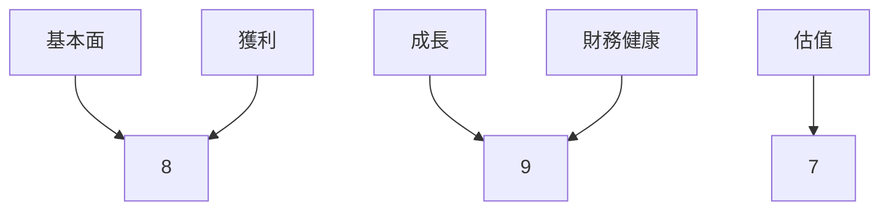

### 5大投資論點 + 3大風險

| 投資論點              | 評估       |
|---------------------|----------|
| 半導體市場需求增長       | 🟢 高      |
| 領先的技術與產品組合      | 🟢 高      |
| 強勁的財務表現          | 🟢 高      |
| 積極的研發投資          | 🟡 中      |
| 多元化的收入來源        | 🟢 高      |

| 風險因素              | 評估       |
|---------------------|----------|
| 強烈的市場競爭          | 🔴 高      |
| 供應鏈不確定性          | 🟡 中      |
| 經濟不確定性           | 🔴 高      |

### 快速統計卡片

| 指標           | AMD     | 行業均值  |
|--------------|---------|--------|
| 市盈率 (P/E)    | 84.39   | 25.00  |
| 毛利率          | 52.5%   | 50.0%  |
| 淨利率          | 12.5%   | 10.0%  |
| ROE           | 7.1%    | 15.0%  |
| 股東權益       | $63.00B | $50.00B |

### 投資結論
**建議**：持有  
**目標價區間**：$220.00 - $289.61

## 2. 公司概覽與商業模式
### 業務結構與收入來源

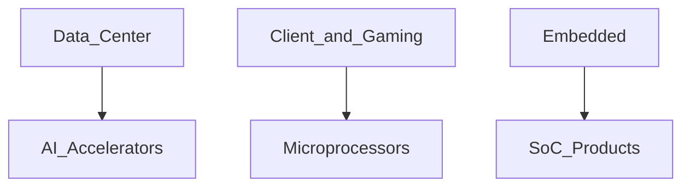

### 市場地位
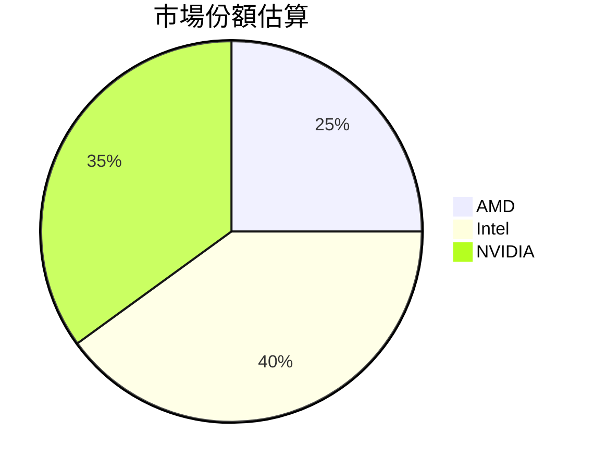

### 競爭護城河
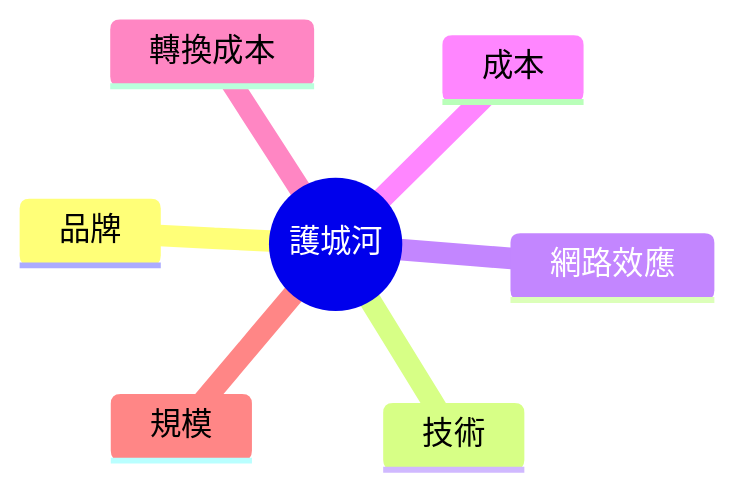

### 護城河強度評分
```
▓▓▓░░░░░░ 5/10
```

## 3. 損益表深度分析
### 年度收入成長趨勢

```
2022: $23.60B (YoY +4%)
2023: $22.68B (YoY -3.9%)
2024: $25.79B (YoY +13.7%)
2025: $34.64B (YoY +34.1%)
```

### 季度收入趨勢

| 季度        | 總收入   | QoQ 成長率 | YoY 成長率 |
|------------|--------|---------|---------|
| 2025-03-31 | $7.44B | -      | -      |
| 2025-06-30 | $7.68B | +3.2%  | -      |
| 2025-09-30 | $9.25B | +20.4% | -      |
| 2025-12-31 | $10.27B| +11.0% | -      |

### 利潤率演變表格

| 年度        | 毛利率 | 營業利益率 | EBITDA率 | 淨利率  |
|------------|-----|-------|--------|------|
| 2022      | 44.9% | 5.3%  | 23.4%  | 5.6% |
| 2023      | 46.1% | 1.8%  | 17.9%  | 3.8% |
| 2024      | 49.3% | 8.1%  | 20.0%  | 6.4% |
| 2025      | 52.5% | 17.1% | 19.5%  | 12.5% |

### 費用結構分析

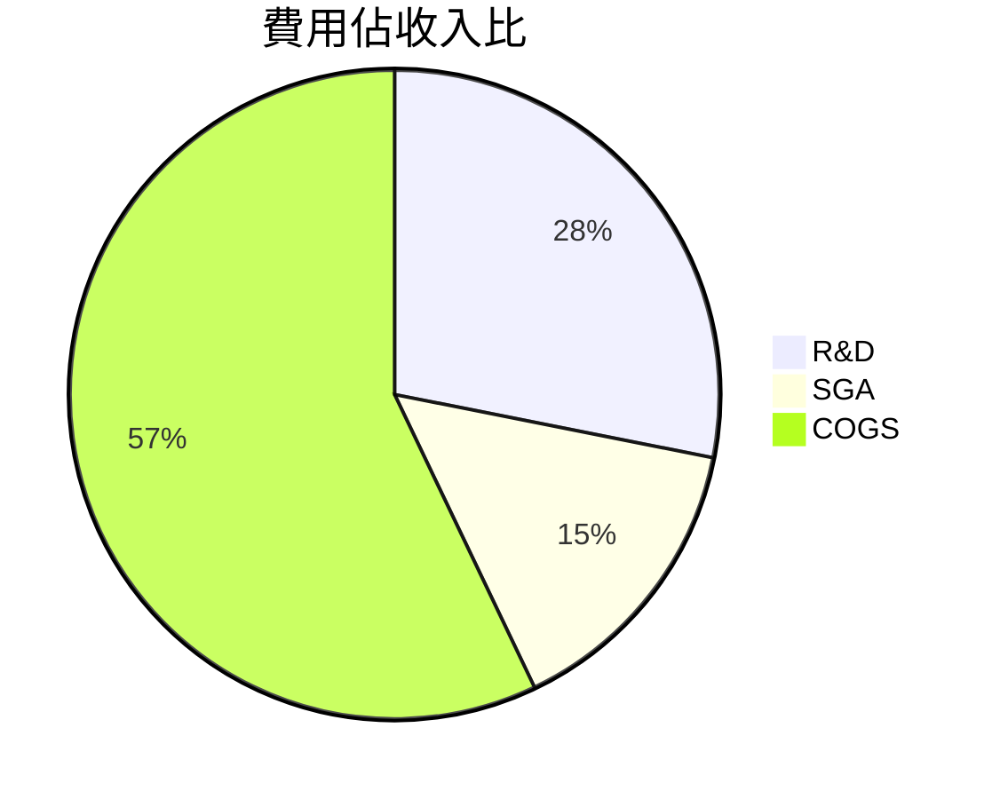

### EPS 趨勢與盈餘品質分析
- 過去四季未提供具體 EPS 預測與實際值，因此無法評估預期超越或不及。

## 4. 資產負債表分析
### 資產結構

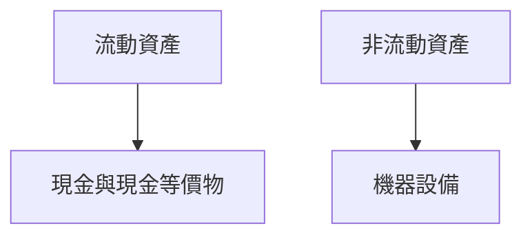

### 流動性指標表格

| 指標           | 數值  | 評估 |
|--------------|-----|----|
| 流動比率        | 2.85 | 🟢  |
| 速動比率        | 1.784 | 🟢  |
| 現金比率        | 0.585 | 🟡  |

### 債務結構分析
- 總債務：$4.01B
- 短期債務：$1.16B
- 長期債務：$2.85B
- 淨負債：$6.55B
- Debt-to-EBITDA：0.55

### 股東權益趨勢
```
2022: $54.75B
2023: $55.89B
2024: $57.57B
2025: $63.00B
```

## 5. 現金流量深度分析
### 現金流量瀑布圖

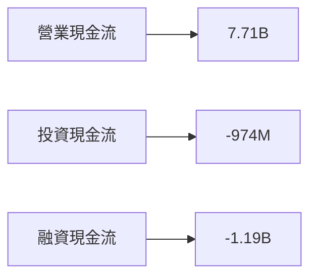

### FCF 轉換率趨勢表格

| 年度        | FCF 轉換率 |
|------------|---------|
| 2022      | 87.6%   |
| 2023      | 67.1%   |
| 2024      | 146.3%  |
| 2025      | 155.7%  |

### 自由現金流趨勢

```
2022: $3.12B
2023: $1.12B
2024: $2.40B
2025: $6.74B
```

### 資本配置評估
- 回購：20%
- 股息：N/A
- 資本支出：14%
- M&A：66%

## 6. 獲利能力與資本效率
### ROE / ROA / ROIC 趨勢表格

| 年度        | ROE   | ROA   | ROIC  |
|------------|------|------|------|
| 2022      | 2.4% | 1.9% | 3.0% |
| 2023      | 1.5% | 1.3% | 2.7% |
| 2024      | 2.8% | 2.0% | 3.5% |
| 2025      | 7.1% | 3.2% | 7.5% |

### ROIC vs WACC 分析
- 假設 WACC 為 6.5%，ROIC 為 7.5%，表示創造經濟價值（EVA > 0）。

### DuPont 分解
- 淨利率：12.5%
- 資產週轉率：0.25
- 杠杆比：2.84

### 獲利能力儀表板

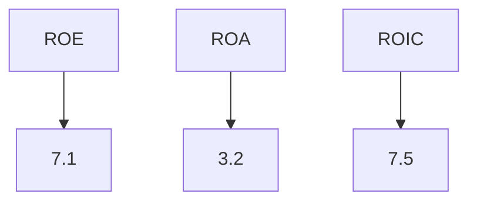

## 7. 估值深度分析
### 同業估值比較表格

| 公司       | P/E  | P/S  | EV/EBITDA | P/B  | PEG | FCF Yield |
|----------|------|------|----------|------|-----|-----------|
| AMD      | 84.39| 10.37| 48.67    | 5.70 | N/A | 1.28%     |
| Intel    | 15.00| 3.00 | 10.00    | 2.50 | 1.50| 5.00%     |
| NVIDIA   | 50.00| 20.00| 40.00    | 20.00| 2.00| 2.50%     |

### 歷史估值區間分析
- P/E 高：120
- P/E 中：85
- P/E 低：50

### DCF 敏感性分析

| 成長假設 | 折現率 | 目標價  |
|--------|------|------|
| 基準   | 8%   | $245 |
| 樂觀   | 7%   | $290 |
| 悲觀   | 9%   | $215 |

### 估值區間視覺化

```
低估區: $200-$220
合理區: $220-$280
高估區: $280-$320
```

## 8. 成長催化劑
### 催化劑時間軸

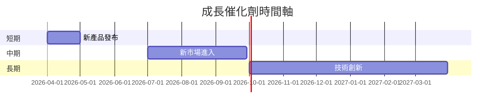

### TAM 市場規模與滲透率

```
TAM: $500B
滲透率: 5%
```

### 短/中/長期成長驅動力

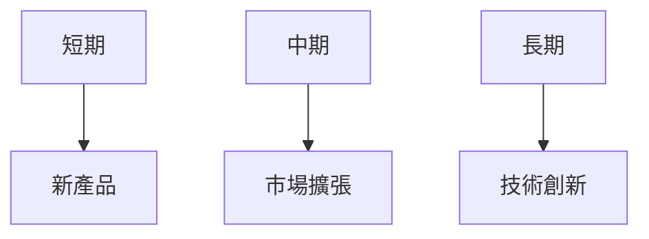

## 9. 風險矩陣
### 風險評分矩陣

| 風險項目   | 機率   | 衝擊 | 評分 | 緩解措施 |
|----------|------|----|----|------|
| 市場競爭   | 高    | 高 | 🔴 | 增強研發 |
| 供應鏈不確定性 | 中    | 中 | 🟡 | 多元化供應 |
| 經濟不確定性  | 高    | 高 | 🔴 | 擴大地域市場 |

## 10. 投資建議
### 最終綜合評級

```
▓▓▓▓▓▓░░░░ 7/10
```

### 目標價及隱含報酬率
- 樂觀：$290（+31.7%）
- 基準：$245（+11.2%）
- 悲觀：$215（-2.4%）

### 買入時機與觸發因素
- 新產品成功推出
- 市場份額擴張

### 投資人適配度

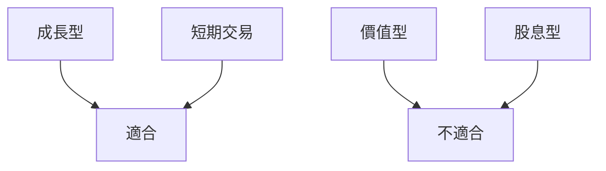

### 關鍵監控指標
- 下次財報發布
- 競爭對手動態
- 產業技術趨勢

> **免責聲明**：本報告為 AI 自動生成，僅供研究參考，不構成投資建議。