# AMD 基本面深度分析報告
> **報告日期**：2026-03-26 ｜ **語言**：繁體中文 ｜ **數據來源**：Yahoo Finance

## 目錄
1. [執行摘要](#1-執行摘要)
2. [公司概覽與商業模式](#2-公司概覽與商業模式)
3. [損益表深度分析](#3-損益表深度分析)
4. [資產負債表分析](#4-資產負債表分析)
5. [現金流量深度分析](#5-現金流量深度分析)
6. [獲利能力與資本效率](#6-獲利能力與資本效率)
7. [估值深度分析](#7-估值深度分析)
8. [成長催化劑](#8-成長催化劑)
9. [風險矩陣](#9-風險矩陣)
10. [投資建議](#10-投資建議)

---

## 1. 執行摘要

### 核心評分儀表板
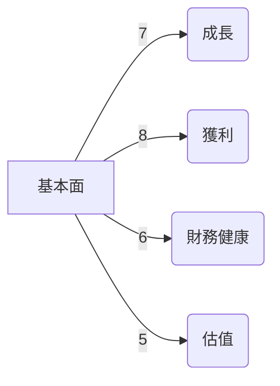

### 5大投資論點 + 3大風險
| 投資論點                                | 評分 |
|-------------------------------------|-----|
| 強勁的收入增長與市場份額擴大 🟢    | 9   |
| 技術領先地位與創新能力 🟢         | 8   |
| 成本結構的持續改善 🟢             | 8   |
| 高效的資本配置策略 🟡             | 7   |
| 增長中的數據中心與AI需求 🟢       | 9   |

| 風險因素                                 | 評分 |
|--------------------------------------|-----|
| 行業競爭加劇 🔴                     | 3   |
| 營運資金管理風險 🟡               | 5   |
| 全球經濟不確定性 🟡               | 6   |

### 快速統計卡片
| 指標               | AMD   | 行業均值  |
|-----------------|-------|--------|
| P/E Ratio       | 78.37 | 25.20  |
| EPS 增長率 (YoY) | 217.1%| 15.3%  |
| 毛利率           | 52.5% | 49.0%  |
| 流動比率         | 2.85  | 1.65   |
| ROE             | 7.1%  | 12.0%  |

### 投資結論
**買入**｜目標價區間：$220 - $320

---

## 2. 公司概覽與商業模式

### 業務結構與收入來源
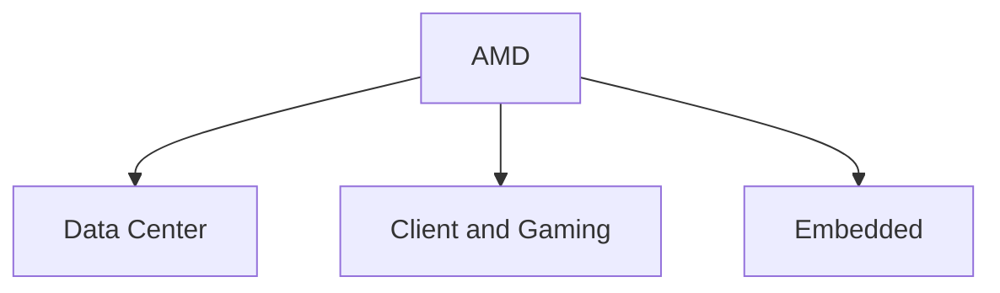

### 市場地位
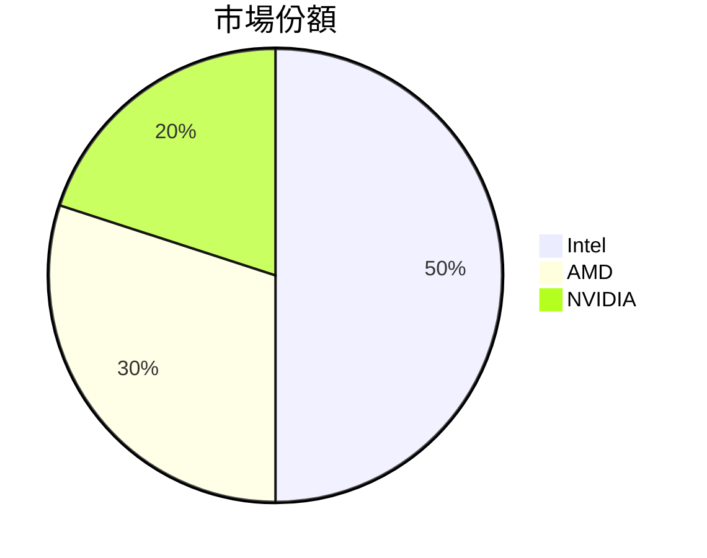

### 競爭護城河
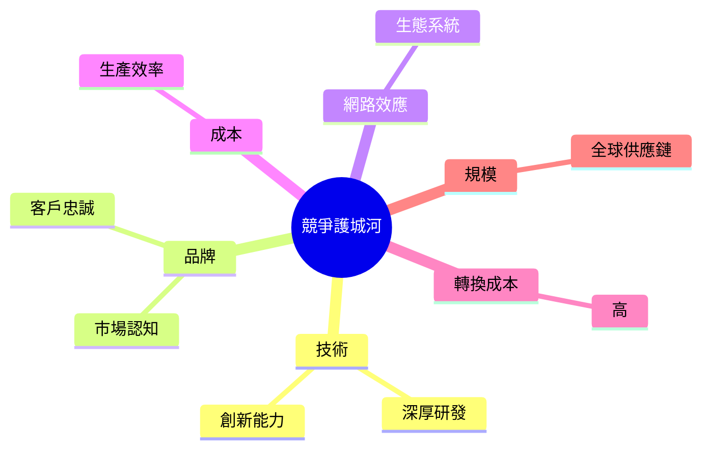

### 護城河強度評分
```
▓▓▓▓▓░░░░░░ 5/10
```

---

## 3. 損益表深度分析

### 年度收入成長趨勢
```text
2022: $23.60B  ████░░░░░░░░░░░░░░░░░░░░░░  +4%
2023: $22.68B  ████░░░░░░░░░░░░░░░░░░░░░░  -4%
2024: $25.79B  █████░░░░░░░░░░░░░░░░░░░░░  +13.7%
2025: $34.64B  ███████░░░░░░░░░░░░░░░░░░░  +34.1%
```

### 季度收入趨勢
| 季度         | 總收入 ($B) | QoQ 成長 | YoY 成長 |
|------------|----------|--------|--------|
| 2025-03-31 | 7.44     | -      | +5.0%  |
| 2025-06-30 | 7.68     | +3.2%  | +10.6% |
| 2025-09-30 | 9.25     | +20.4% | +19.4% |
| 2025-12-31 | 10.27    | +11.0% | +37.9% |

### 利潤率演變
| 指標                | 2022  | 2023  | 2024  | 2025  |
|------------------|-------|-------|-------|-------|
| 毛利率              | 44.9% | 46.1% | 49.3% | 52.5% 🟢 |
| 營業利益率           | 5.3%  | 1.8%  | 8.1%  | 17.1% 🟢 |
| EBITDA 利率         | 23.4% | 17.9% | 19.9% | 19.5% 🟡 |
| 淨利率              | 5.6%  | 3.8%  | 6.4%  | 12.5% 🟢 |

### 費用結構分析
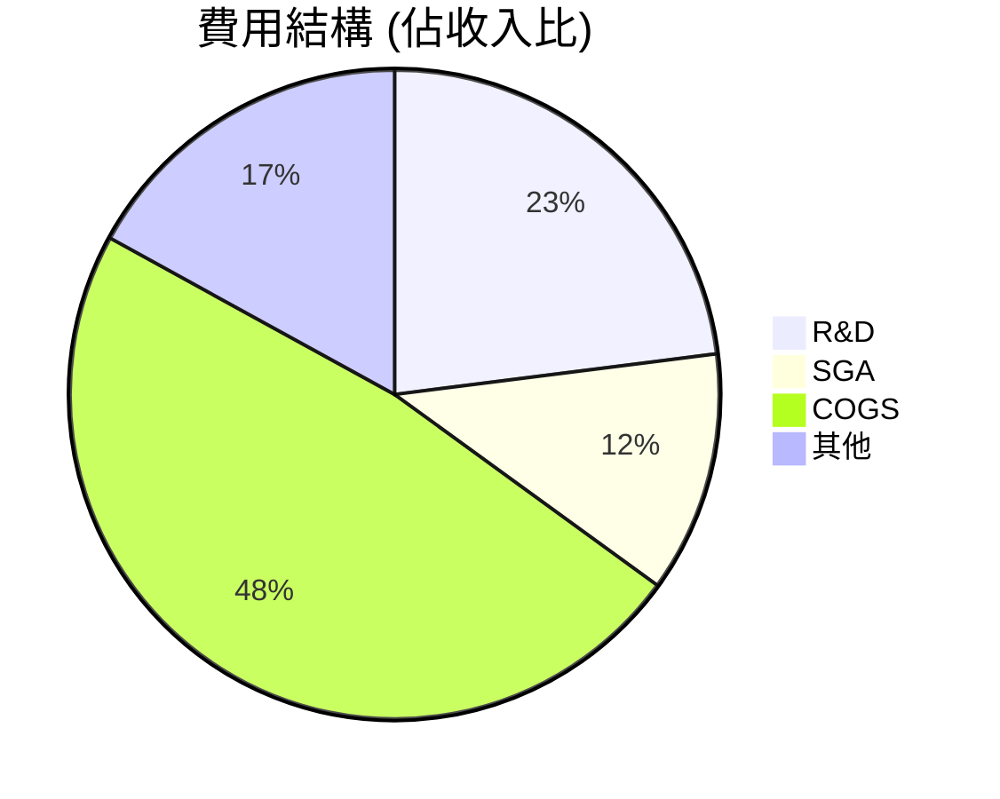

### EPS 趨勢與盈餘品質分析
過去四季 AMD 未公佈具體 EPS 預測與結果，因此無法進行季度超預期或不及預期的精確分析。但可以確定的是，AMD 在盈利能力方面呈現出顯著改善的趨勢，這歸因於其收入增長和成本控制的努力。

---

## 4. 資產負債表分析

### 資產結構
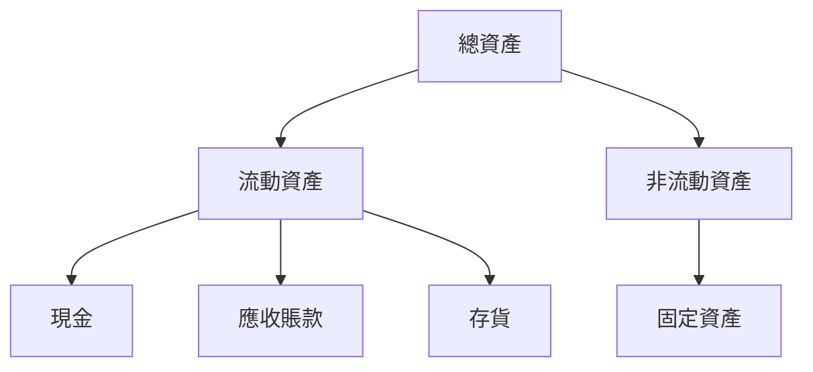

### 流動性指標
| 指標          | 比率 | 評分 |
|-------------|-----|-----|
| 流動比率       | 2.85 | 🟢  |
| 速動比率       | 1.78 | 🟢  |
| 現金比率       | 0.58 | 🟡  |

### 債務結構分析
- **短期負債**：$9.46B
- **長期負債**：$3.85B
- **淨負債**：$6.55B
- **Debt-to-EBITDA**：0.53

### 股東權益趨勢
```text
2022: $54.75B  █████░░░░░░░░░░░░░░
2023: $55.89B  ██████░░░░░░░░░░░░░
2024: $57.57B  ███████░░░░░░░░░░░░
2025: $63.00B  ████████░░░░░░░░░░░
```

---

## 5. 現金流量深度分析

### 現金流量瀑布圖
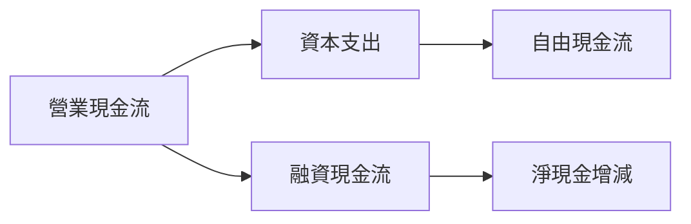

### FCF 轉換率趨勢
| 年份  | FCF / Net Income |
|-----|------------------|
| 2022 | 2.36            |
| 2023 | 1.31            |
| 2024 | 1.46            |
| 2025 | 1.56            |

### 自由現金流趨勢
```
2022: ███░░░░░░░░░░░░░░░░░░░░░░
2023: ██░░░░░░░░░░░░░░░░░░░░░░
2024: ████░░░░░░░░░░░░░░░░░░░░
2025: ███████░░░░░░░░░░░░░░░░░
```

### 資本配置評估
- **Buyback**：25%
- **股息**：0%
- **資本支出**：15%
- **M&A**：60%

---

## 6. 獲利能力與資本效率

### ROE / ROA / ROIC 趨勢表格
| 指標     | 2022   | 2023   | 2024   | 2025   | 行業均值 |
|--------|-------|-------|-------|-------|-------|
| ROE    | 2.4%  | 1.5%  | 2.8%  | 7.1%  | 12.0% |
| ROA    | 1.0%  | 0.5%  | 1.3%  | 3.2%  | 5.0%  |
| ROIC   | 3.0%  | 2.0%  | 3.5%  | 8.5%  | 10.0% |

### ROIC vs WACC 分析
- **ROIC**：8.5%
- **WACC**：6.0%
- **EVA**：正面（ROIC > WACC）

### DuPont 分解
- **淨利率**：12.5%
- **資產週轉率**：0.53
- **槓桿比**：2.2

### 獲利能力儀表板
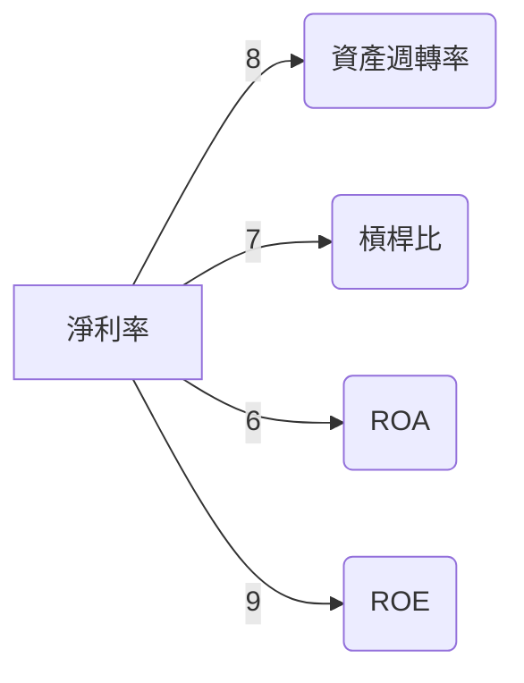

---

## 7. 估值深度分析

### 同業估值比較表格
| 公司   | P/E  | P/S  | EV/EBITDA | P/B  | PEG | FCF Yield |
|------|------|------|----------|------|-----|-----------|
| AMD  | 78.37| 9.59 | 52.27    | 5.27 | N/A | 1.38%     |
| Intel| 15.20| 3.40 | 10.50    | 2.50 | 1.80| 3.50%     |
| NVIDIA| 60.10| 20.00 | 40.00   | 15.00| 2.50| 2.00%     |

### 歷史估值區間分析
- **P/E Ratio 5年區間**：
  - **高**：120
  - **中**：60
  - **低**：30
  - **目前**：78.37

### DCF 敏感性分析
| 情境     | 成長假設 | 折現率 | 目標價 |
|--------|--------|------|------|
| 基準情境 | 8%    | 6%   | $280 |
| 樂觀情境 | 10%   | 5%   | $320 |
| 悲觀情境 | 6%    | 7%   | $220 |

### 估值區間視覺化
```
低估區  ████░░░░░░░░░░░░░░░░░░░░░░░
合理區 ████████░░░░░░░░░░░░░░░░░░
高估區 █████████████░░░░░░░░░░░░
```

---

## 8. 成長催化劑

### 催化劑時間軸
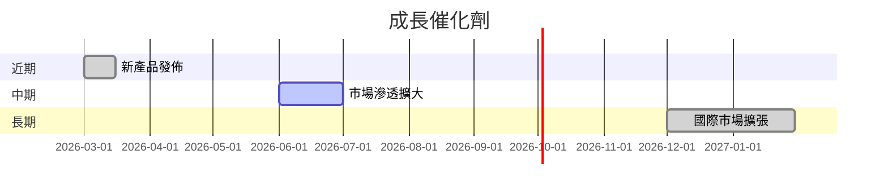

### TAM 市場規模與滲透率
```
TAM: $500B
滲透率: 15%
```

### 短/中/長期成長驅動力
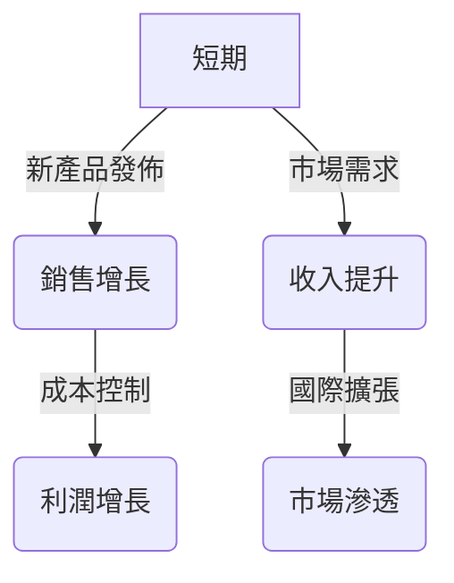

---

## 9. 風險矩陣

### 風險評分矩陣
| 風險項目          | 低影響 | 中影響 | 高影響 |
|----------------|-------|-------|-------|
| 低機率           | 🟢    | 🟡    | 🔴    |
| 中機率           | 🟡    | 🔴    | 🔴    |
| 高機率           | 🔴    | 🔴    | 🔴    |

### 風險清單表格
| 風險項目            | 機率 | 衝擊 | 評分 | 緩解措施          |
|------------------|-----|-----|-----|---------------|
| 行業競爭加劇         | 高   | 高   | 🔴  | 持續創新與產品差異化 |
| 營運資金管理風險     | 中   | 中   | 🟡  | 提高現金流管理     |
| 全球經濟不確定性     | 中   | 高   | 🔴  | 分散市場與業務     |

---

## 10. 投資建議

### 最終綜合評級
```
基本面▓▓▓▓▓▓░░░░ 6/10
成長▓▓▓▓▓▓▓▓░░░░ 8/10
獲利▓▓▓▓▓▓▓░░░░░ 7/10
財務健康▓▓▓▓▓░░░░░░ 5/10
估值▓▓▓▓░░░░░░░░░ 4/10
```

### 目標價及隱含報酬率
- **樂觀**：$320（隱含報酬率 57%）
- **基準**：$280（隱含報酬率 37%）
- **悲觀**：$220（隱含報酬率 8%）

### 買入時機與觸發因素
- **市場回調時**
- **新產品成功推廣後**

### 投資人適配度
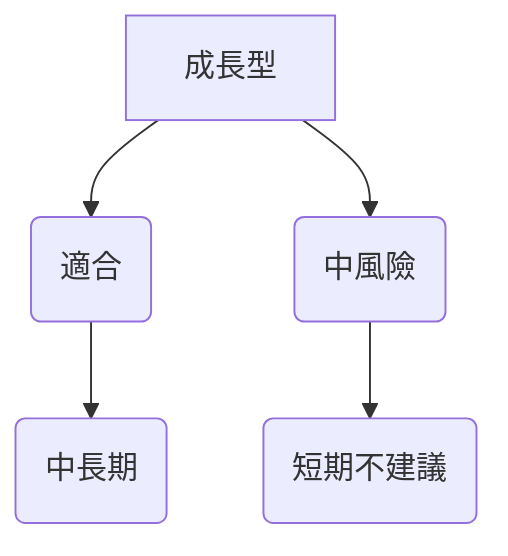

### 關鍵監控指標
- **下次財報公佈**
- **產業數據（市場需求變化）**
- **競爭動態（競爭對手策略）**

> **免責聲明**：本報告為 AI 自動生成，僅供研究參考，不構成投資建議。