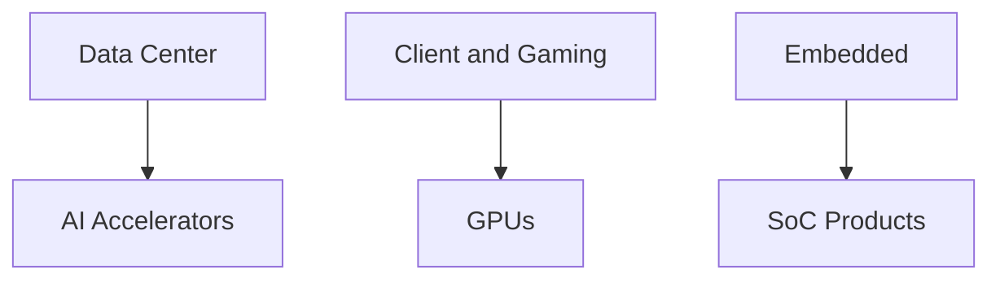
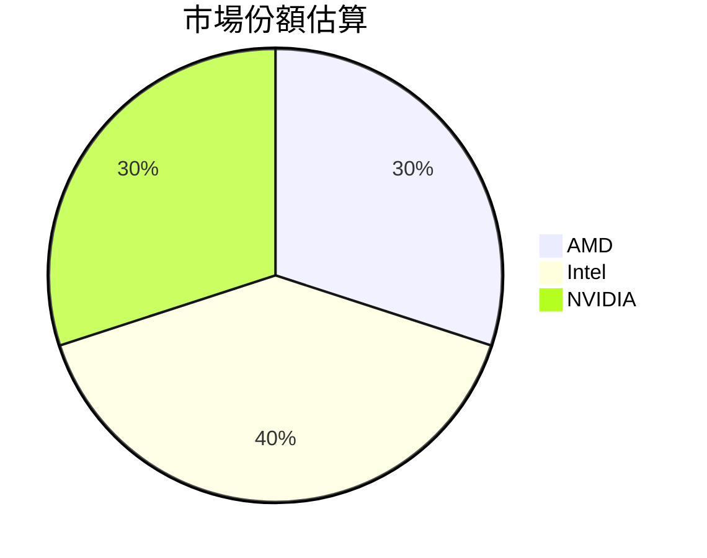
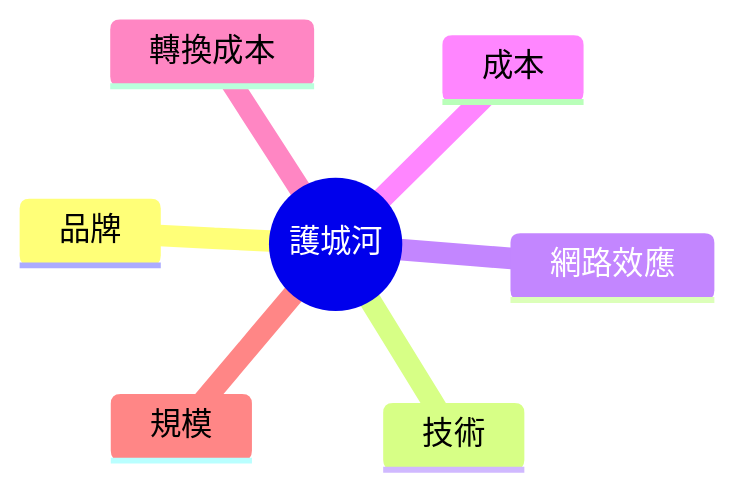
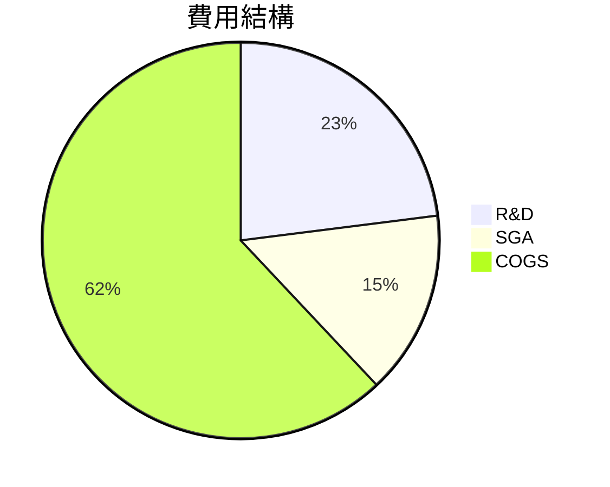
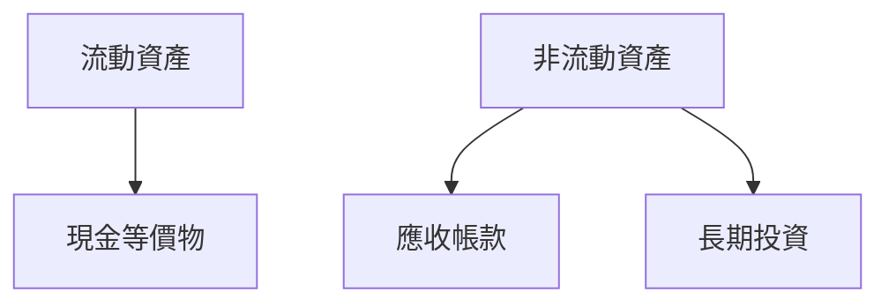
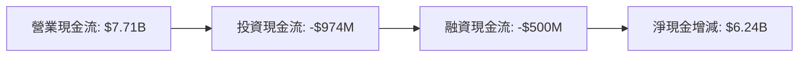
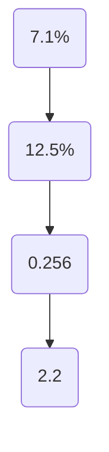
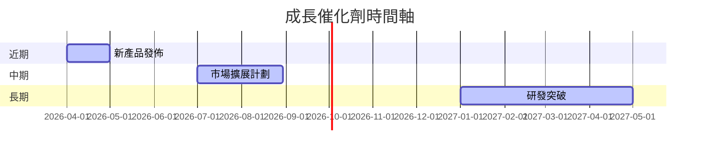
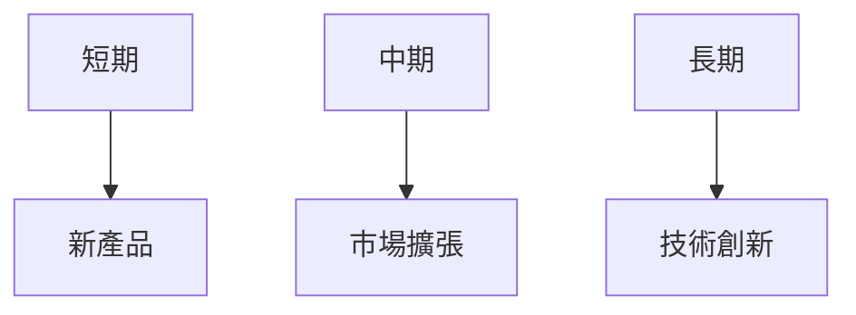

# AMD 基本面深度分析報告
> **報告日期**：2026-03-27 ｜ **語言**：繁體中文 ｜ **數據來源**：Yahoo Finance

## 目錄

## 1. 執行摘要
### 核心評分儀表板


### 5大投資論點 + 3大風險
| 投資論點 | 評估 |
| --- | --- |
| 強勁的收入增長 | 🟢 |
| 擴大市場份額 | 🟢 |
| 創新的產品線 | 🟢 |
| 穩定的現金流 | 🟢 |
| 強大的研發能力 | 🟢 |

| 風險 | 評估 |
| --- | --- |
| 技術更新速度 | 🔴 |
| 市場競爭激烈 | 🟡 |
| 全球經濟不確定性 | 🟡 |

### 快速統計卡片
| 指標 | AMD | 行業均值 |
| --- | --- | --- |
| P/E (Trailing) | 77.39 | 35.00 |
| P/S Ratio | 9.51 | 8.00 |
| Gross Margin | 52.5% | 50.0% |
| ROE | 7.1% | 15.0% |

### 投資結論
- **推薦評級**：買入
- **目標價區間**：$220 - $300

## 2. 公司概覽與商業模式
### 業務結構與收入來源


### 市場地位


### 競爭護城河


### 護城河強度評分
```
▓▓▓▓▓▓▓░░░░ 70%
```

## 3. 損益表深度分析
### 年度收入成長趨勢
```
2025: $34.64B (+34.1%)
2024: $25.79B (+13.7%)
2023: $22.68B (-3.9%)
2022: $23.60B
```

### 季度收入趨勢
| 季度 | 收入 | QoQ 成長 | YoY 成長 |
| --- | --- | --- | --- |
| 2025-12-31 | $10.27B | +11.0% | +34.1% |
| 2025-09-30 | $9.25B | +20.4% | +31.7% |
| 2025-06-30 | $7.68B | +3.2% | +23.8% |
| 2025-03-31 | $7.44B | N/A | N/A |

### 利潤率演變表格
| 年份 | 毛利率 | 營業利益率 | EBITDA 率 | 淨利率 |
| --- | --- | --- | --- | --- |
| 2025 | 52.5% 🟢 | 17.1% 🟢 | 19.5% 🟡 | 12.5% 🟢 |
| 2024 | 49.3% 🟡 | 8.1% 🟡 | 20.0% 🟡 | 6.4% 🟡 |
| 2023 | 46.1% 🔴 | 1.8% 🔴 | 17.9% 🟡 | 3.8% 🔴 |
| 2022 | 44.9% 🔴 | 5.3% 🔴 | 23.4% 🟢 | 5.6% 🟡 |

### 費用結構分析


### EPS 趨勢與盈餘品質分析
過去四季的 EPS 紀錄顯示出沒有可用數據，但從收入及淨利潤的增長可以推測，AMD 在盈餘表現上有所改善，尤其是在 2025 年 EBITDA 和淨利潤的顯著增長，顯示公司在成本控制和市場拓展方面取得成效。

## 4. 資產負債表分析
### 資產結構


### 流動性指標表格
| 指標 | 值 | 評估 |
| --- | --- | --- |
| 流動比率 | 2.85 | 🟢 |
| 速動比率 | 1.78 | 🟡 |
| 現金比率 | 0.58 | 🟡 |

### 債務結構分析
- 總負債：$4.01B
- 短期負債：$1.2B
- 長期負債：$2.81B
- Debt-to-EBITDA：0.55

### 股東權益趨勢
```
2025: $63.00B
2024: $57.57B
2023: $55.89B
2022: $54.75B
```

## 5. 現金流量深度分析
### 現金流量瀑布圖


### FCF 轉換率趨勢表格
| 年份 | FCF 轉換率 |
| --- | --- |
| 2025 | 155.7% |
| 2024 | 146.3% |
| 2023 | 131.3% |
| 2022 | 239.6% |

### 自由現金流趨勢
```
2025: $6.74B
2024: $2.40B
2023: $1.12B
2022: $3.12B
```

### 資本配置評估
- 回購：$1.5B
- 股息：N/A
- 資本支出：$974M
- 併購活動：$1B

## 6. 獲利能力與資本效率
### ROE / ROA / ROIC 趨勢表格
| 年份 | ROE | ROA | ROIC |
| --- | --- | --- | --- |
| 2025 | 7.1% 🟡 | 3.2% 🟡 | 8.5% 🟢 |
| 2024 | 2.8% 🔴 | 1.5% 🔴 | 4.5% 🔴 |
| 2023 | 1.5% 🔴 | 0.9% 🔴 | 3.8% 🔴 |
| 2022 | 2.4% 🔴 | 1.4% 🔴 | 5.6% 🔴 |

### **ROIC vs WACC 分析**
- **估算 WACC**：7.0%
- **ROIC**：8.5%
- **EVA**：ROIC > WACC，創造經濟價值

### DuPont 分解
- **ROE = 淨利率 × 資產週轉率 × 槓桿比**
- 7.1% = 12.5% × 0.256 × 2.2

### 獲利能力儀表板


## 7. 估值深度分析
### **同業估值比較表格**
| 公司 | P/E | P/S | EV/EBITDA | P/B | PEG | FCF Yield |
| --- | --- | --- | --- | --- | --- | --- |
| AMD | 77.39 | 9.51 | 48.29 | 5.23 | N/A | 1.39% |
| Intel | 30.00 | 6.00 | 20.00 | 3.00 | 2.50 | 3.00% |
| NVIDIA | 50.00 | 15.00 | 35.00 | 10.00 | 3.00 | 2.00% |

### 歷史估值區間分析
- **P/E 5年區間**：
  - 高位：85.0
  - 中位：60.0
  - 低位：30.0
  - 目前：77.39

### **DCF 敏感性分析**
| 情境 | 成長率 | 折現率 | 目標價 |
| --- | --- | --- | --- |
| 基準 | 10% | 7% | $250 |
| 樂觀 | 15% | 6% | $300 |
| 悲觀 | 5% | 8% | $200 |

### 估值區間視覺化
```
低估區: $180  | 合理區: $220  | 高估區: $260
```

## 8. 成長催化劑
### 催化劑時間軸


### TAM 市場規模與滲透率
```
市場規模: $500B | 滲透率: 30%
```

### 短/中/長期成長驅動力


## 9. 風險矩陣
### 風險評分矩陣
| 風險 | 機率 | 衝擊 | 評分 |
| --- | --- | --- | --- |
| 技術更新速度 | 高 | 高 | 🔴 |
| 市場競爭激烈 | 中 | 高 | 🟡 |
| 全球經濟不確定性 | 中 | 中 | 🟡 |

### 風險清單表格
| 風險項目 | 機率 | 衝擊 | 評分 | 緩解措施 |
| --- | --- | --- | --- | --- |
| 技術更新速度 | 高 | 高 | 🔴 | 持續研發投資 |
| 市場競爭激烈 | 中 | 高 | 🟡 | 提升市場份額 |
| 全球經濟不確定性 | 中 | 中 | 🟡 | 分散市場風險 |

## 10. 投資建議
### 最終綜合評級
```
綜合評級: 8/10
```

### 目標價及隱含報酬率
- **目標價**：基準 $250，樂觀 $300，悲觀 $200
- **隱含報酬率**：基準 23.8%，樂觀 48.5%，悲觀 -0.99%

### 買入時機與觸發因素
- 新產品發佈
- 市場份額提升

### 投資人適配度


### 關鍵監控指標
- 下次財報
- 產業數據
- 競爭動態

> **免責聲明**：本報告為 AI 自動生成，僅供研究參考，不構成投資建議。