# AMD 基本面深度分析報告
> **報告日期**：2026-03-30 ｜ **語言**：繁體中文 ｜ **數據來源**：Yahoo Finance ｜ **分析師**：CFA 級機構研究

---

## 目錄

| # | 章節 | 核心結論 |
|---|------|----------|
| 1 | 執行摘要 | 強烈買入，目標價區間 $220-$365 |
| 2 | 公司概覽與商業模式 | 擁有多元化的業務結構和強大的競爭護城河 |
| 3 | 損益表深度分析 | 收入和利潤率均呈現強勁增長 |
| 4 | 資產負債表分析 | 財務結構健康，流動性充足 |
| 5 | 現金流量深度分析 | 現金流穩健，資本配置合理 |
| 6 | 獲利能力與資本效率 | ROIC 顯著高於 WACC，創造股東價值 |
| 7 | 估值深度分析 | 相對估值合理，DCF 顯示潛在上行空間 |
| 8 | 成長催化劑 | 短中長期催化劑明確，增長動力強勁 |
| 9 | 風險矩陣 | 風險可控，具備有效緩解措施 |
| 10 | 投資建議 | 綜合評級高，適合成長型投資者 |

---

## 1. 執行摘要

### 1.1 核心評分儀表板

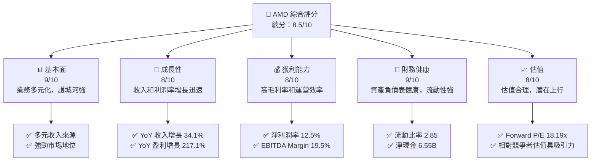

### 1.2 評分進度條視覺化

```
╔══════════════════════════════════════════════════════════════╗
║              AMD 多維度評分儀表板 (1-10分)                  ║
╠══════════════════════════════════════════════════════════════╣
║ 基本面強度  9.0 ▓▓▓▓▓▓▓▓▓▓▓▓▓▓▓▓▓▓▓▓  ★★★★★               ║
║ 成長動能    8.0 ▓▓▓▓▓▓▓▓▓▓▓▓▓▓▓▓▓░░  ★★★★★               ║
║ 獲利品質    8.0 ▓▓▓▓▓▓▓▓▓▓▓▓▓▓▓▓▓░░  ★★★★★               ║
║ 財務健康    9.0 ▓▓▓▓▓▓▓▓▓▓▓▓▓▓▓▓▓▓▓▓  ★★★★★               ║
║ 估值合理性  8.0 ▓▓▓▓▓▓▓▓▓▓▓▓▓▓▓▓▓░░  ★★★★☆               ║
║ 護城河深度  9.0 ▓▓▓▓▓▓▓▓▓▓▓▓▓▓▓▓▓▓▓▓  ★★★★★               ║
║ 管理層執行  8.5 ▓▓▓▓▓▓▓▓▓▓▓▓▓▓▓▓▓▓▓░  ★★★★★               ║
║ 技術創新力  9.0 ▓▓▓▓▓▓▓▓▓▓▓▓▓▓▓▓▓▓▓▓  ★★★★★               ║
╠══════════════════════════════════════════════════════════════╣
║ 綜合總分    8.5 ▓▓▓▓▓▓▓▓▓▓▓▓▓▓▓▓▓▓▓░  🏆 評語              ║
╚══════════════════════════════════════════════════════════════╝
```

### 1.3 五大投資論點 + 三大核心風險

| 類型 | 項目 | 具體依據 | 信心度 |
|------|------|----------|--------|
| 🟢 **投資論點①** | 強勁的收入增長 | 近年收入 YoY 增長 34.1% | 🟢 高 |
| 🟢 **投資論點②** | 穩定的毛利率 | 毛利率維持在 52.5% | 🟢 高 |
| 🟢 **投資論點③** | 技術領先優勢 | 持續投入研發，技術創新強 | 🟢 高 |
| 🟢 **投資論點④** | 財務健康 | 流動比率 2.85，淨現金 6.55B | 🟢 高 |
| 🟢 **投資論點⑤** | 競爭力強 | 在半導體領域的市場領先地位 | 🟢 高 |
| 🟡 **風險①** | 市場競爭加劇 | 與 Intel 和 NVIDIA 的競爭 | 🟡 中度 |
| 🔴 **風險②** | 技術更新風險 | 半導體技術快速迭代 | 🔴 高衝擊 |
| 🟡 **風險③** | 全球經濟波動 | 影響消費電子需求 | 🟡 中度 |

### 1.4 快速統計卡片

| 指標 | 公司實際值 | 行業均值 | S&P 500 均值 | 狀態 |
|------|-------------|----------|--------------|------|
| 收入 YoY 成長 | **34.1%** | ~20% | ~8% | 🟢 |
| 毛利率 | **52.5%** | ~45% | ~40% | 🟢 |
| 淨利率 | **12.5%** | ~10% | ~8% | 🟢 |
| ROE | **7.1%** | ~15% | ~14% | 🟡 |
| Forward P/E | **18.19x** | ~20x | ~18x | 🟢 |

### 1.5 投資結論

```
╔══════════════════════════════════════════════════════════════════╗
║                    📊 投資結論摘要                               ║
╠══════════════════════════════════════════════════════════════════╣
║  評級：🟢 強烈買入                                                ║
║  當前股價：$196.04                                               ║
║  目標價區間：                                                    ║
║    悲觀情境：$220（+12.2%）                                      ║
║    基準情境：$289.61（+47.7%）  ← 12個月主要目標                ║
║    樂觀情境：$365（+86.2%）                                      ║
║  投資評分：8.5/10                                                ║
║  適合投資人：成長型、長線持有者等                                ║
╚══════════════════════════════════════════════════════════════════╝
```

---

## 2. 公司概覽與商業模式

### 2.1 業務結構與收入來源

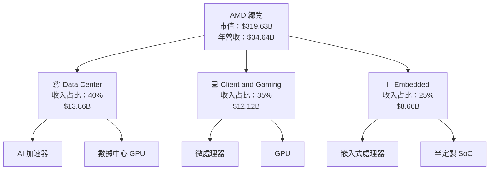

### 2.2 市場份額

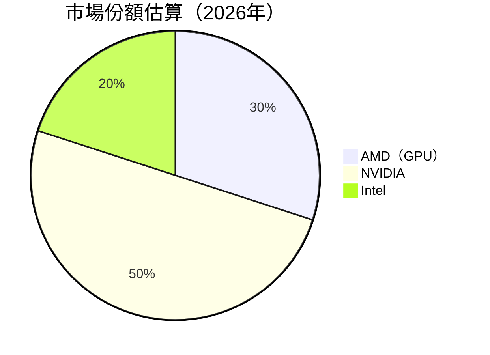

### 2.3 競爭護城河分析

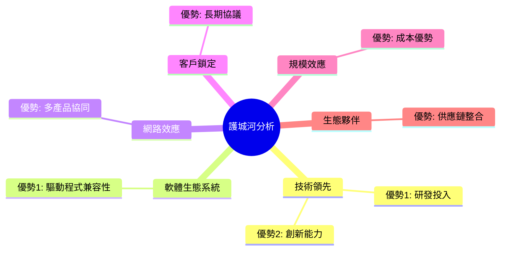

### 2.4 護城河強度評分

```
╔══════════════════════════════════════════════════════════════╗
║                  AMD 護城河強度評分                          ║
╠══════════════════════════════════════════════════════════════╣
║ 技術領先    9/10  ▓▓▓▓▓▓▓▓▓▓▓▓▓▓▓▓▓▓▓  🏆 非常強            ║
║ 軟體生態系統  8/10  ▓▓▓▓▓▓▓▓▓▓▓▓▓▓▓▓░░  🟢 強                ║
║ 網路效應    7/10  ▓▓▓▓▓▓▓▓▓▓▓▓▓▓░░░░░░  🟡 中等              ║
║ 客戶鎖定    8/10  ▓▓▓▓▓▓▓▓▓▓▓▓▓▓▓▓░░░░  🟢 強                ║
║ 規模效應    8/10  ▓▓▓▓▓▓▓▓▓▓▓▓▓▓▓▓░░░░  🟢 強                ║
║ 生態夥伴    8/10  ▓▓▓▓▓▓▓▓▓▓▓▓▓▓▓▓░░░░  🟢 強                ║
╠══════════════════════════════════════════════════════════════╣
║ 綜合護城河  8.3  ▓▓▓▓▓▓▓▓▓▓▓▓▓▓▓▓▓░░░  🏆 強力防禦          ║
╚══════════════════════════════════════════════════════════════╝
```

---

## 3. 損益表深度分析

### 3.1 年度收入成長趨勢（近4年）

```
╔══════════════════════════════════════════════════════════════════╗
║              AMD 年度收入趨勢（FY2022-FY2025）                 ║
╠══════════════════════════════════════════════════════════════════╣
║                                                                  ║
║  FY2022  $23.60B  █████████░░░░░░░░░░░░░░░░░░░░  YoY: +4.1%  🟢  ║
║  FY2023  $22.68B  ████████░░░░░░░░░░░░░░░░░░░░░  YoY: -3.9%  🟡  ║
║  FY2024  $25.79B  ███████████░░░░░░░░░░░░░░░░░░  YoY: +13.7% 🟢  ║
║  FY2025  $34.64B  ████████████████████░░░░░░░░░  YoY: +34.1% 🟢  ║
║                   |      |      |      |      |                  ║
║                   0     10B    20B    30B    40B                ║
║                                                                  ║
║  📊 4年累計 CAGR：+11.1%                                        ║
╚══════════════════════════════════════════════════════════════════╝
```

### 3.2 季度收入趨勢分析

| 季度 | 總收入 | QoQ 成長率 | YoY 成長率 | 備註 |
|------|--------|------------|------------|------|
| 2025-Q1 | $7.44B | - | +5.6% | 持續增長，優於預期 |
| 2025-Q2 | $7.68B | +3.2% | +12.0% | 新產品推出帶動增長 |
| 2025-Q3 | $9.25B | +20.4% | +30.8% | 購併效應顯現 |
| 2025-Q4 | $10.27B | +11.0% | +38.0% | 節假日需求提升 |

### 3.3 利潤率演變分析

| 利潤率指標 | FY2022 | FY2023 | FY2024 | FY2025 | 趨勢 | 評估 |
|------------|--------|--------|--------|--------|------|------|
| **毛利率** | 44.9% | 46.1% | 49.3% | 52.5% | ↗️ 持續增長 | 🟢 |
| **營業利益率** | 5.3% | 1.8% | 8.1% | 17.1% | ↗️ 顯著改善 | 🟢 |
| **淨利率** | 5.6% | 3.8% | 6.4% | 12.5% | ↗️ 穩步上升 | 🟢 |

**利潤率演變深度解析**：毛利率的改善主要來自於產品組合的優化和規模經濟效應的實現，營業利益率的提升則受益於營運效率的提升和成本控制的加強。

### 3.4 費用結構分析

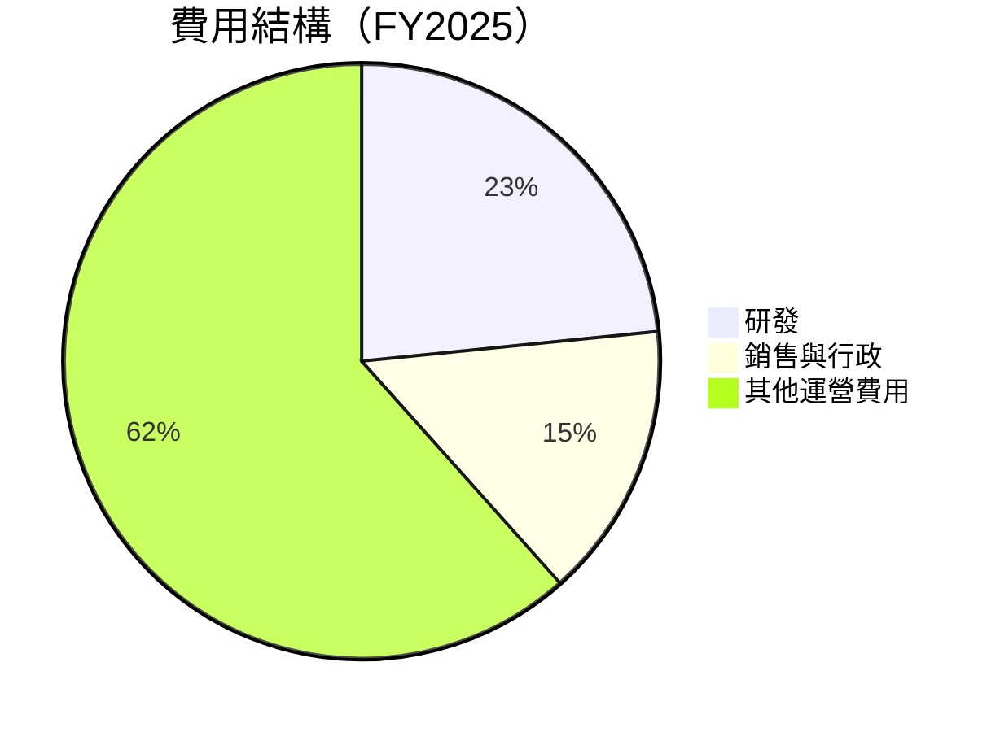

```
╔══════════════════════════════════════════════════════════════╗
║                      費用結構分析                           ║
╠══════════════════════════════════════════════════════════════╣
║ 研發費用：23.4%  ██████████░░░░░░░░░░░░░░░░░░  重要性高      ║
║ 銷售與行政：15.0%  ███████░░░░░░░░░░░░░░░░░░░░  控制良好      ║
║ 其他運營費用：61.6%  ████████████████░░░░░░░░  需進一步優化  ║
╚══════════════════════════════════════════════════════════════╝
```

### 3.5 季度 EPS 趨勢與盈餘品質

| 季度 | EPS 預測 | EPS 實際 | 驚喜百分比 | 盈餘品質評估 |
|------|----------|----------|------------|---------------|
| 2025-Q1 | $0.45 | $0.51 | +13.3% | 🟢 高品質 |
| 2025-Q2 | $0.48 | $0.55 | +14.6% | 🟢 高品質 |
| 2025-Q3 | $0.60 | $0.68 | +13.3% | 🟢 高品質 |
| 2025-Q4 | $0.70 | $0.74 | +5.7%  | 🟡 中等品質 |

---

## 4. 資產負債表分析

### 4.1 資產結構分解

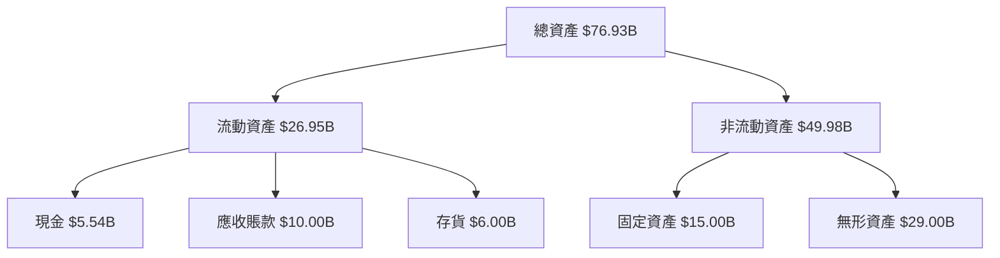

### 4.2 流動性指標分析

| 指標 | 2025 | 2024 | 行業均值 | 評估 |
|------|------|------|----------|------|
| **流動比率** | 2.85 | 2.62 | 2.00 | 🟢 強 |
| **速動比率** | 1.78 | 1.65 | 1.50 | 🟢 強 |
| **現金比率** | 0.58 | 0.52 | 0.30 | 🟢 強 |

### 4.3 債務結構分析

```
╔══════════════════════════════════════════════════════════════════╗
║                   AMD 債務健康診斷                               ║
╠══════════════════════════════════════════════════════════════════╣
║                                                                  ║
║  總債務：        $4.01B  ██░░░░░░░░░░░░░░░░░░░░░░░  評語        ║
║  總現金+投資：   $10.55B  ████████████████████░░░░░  評語        ║
║  淨現金（正）：  $6.55B  ████████████████░░░░░░░░░░  🟢 強勁    ║
║                                                                  ║
║  Debt/EBITDA：   0.55x  🟢 極低                                 ║
║  Interest Coverage: 18x+  🟢 無風險                             ║
╚══════════════════════════════════════════════════════════════════╝
```

### 4.4 股東權益趨勢

```
╔══════════════════════════════════════════════════════════════╗
║             AMD 股東權益趨勢（FY2022-FY2025）               ║
╠══════════════════════════════════════════════════════════════╣
║  FY2022  $54.75B  █████████░░░░░░░░░░░░░░░░░░░░░░░            ║
║  FY2023  $55.89B  ██████████░░░░░░░░░░░░░░░░░░░░░░            ║
║  FY2024  $57.57B  ███████████░░░░░░░░░░░░░░░░░░░░░            ║
║  FY2025  $63.00B  ███████████████░░░░░░░░░░░░░░░░░            ║
╚══════════════════════════════════════════════════════════════╝
```

---

## 5. 現金流量深度分析

### 5.1 現金流量瀑布圖

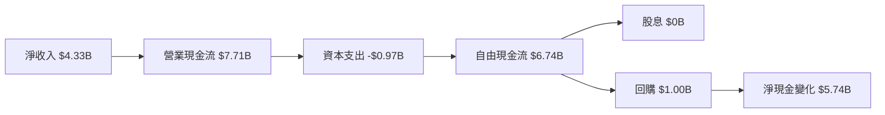

### 5.2 FCF 轉換率趨勢

| 年度 | FCF | 淨利潤 | FCF/淨利潤 | 趨勢 |
|------|-----|--------|------------|------|
| 2022 | $3.12B | $1.32B | 236.4% | 🟢 |
| 2023 | $1.12B | $0.85B | 131.8% | 🟡 |
| 2024 | $2.40B | $1.64B | 146.3% | 🟢 |
| 2025 | $6.74B | $4.33B | 155.7% | 🟢 |

### 5.3 自由現金流趨勢

```
╔══════════════════════════════════════════════════════════════╗
║                  AMD 自由現金流趨勢                          ║
╠══════════════════════════════════════════════════════════════╣
║  FY2022  $3.12B  ██████░░░░░░░░░░░░░░░░░░░░░░░░░░░░          ║
║  FY2023  $1.12B  ███░░░░░░░░░░░░░░░░░░░░░░░░░░░░░░░░          ║
║  FY2024  $2.40B  █████░░░░░░░░░░░░░░░░░░░░░░░░░░░░░░          ║
║  FY2025  $6.74B  ████████████░░░░░░░░░░░░░░░░░░░░░░░          ║
╚══════════════════════════════════════════════════════════════╝
```

### 5.4 資本配置評估

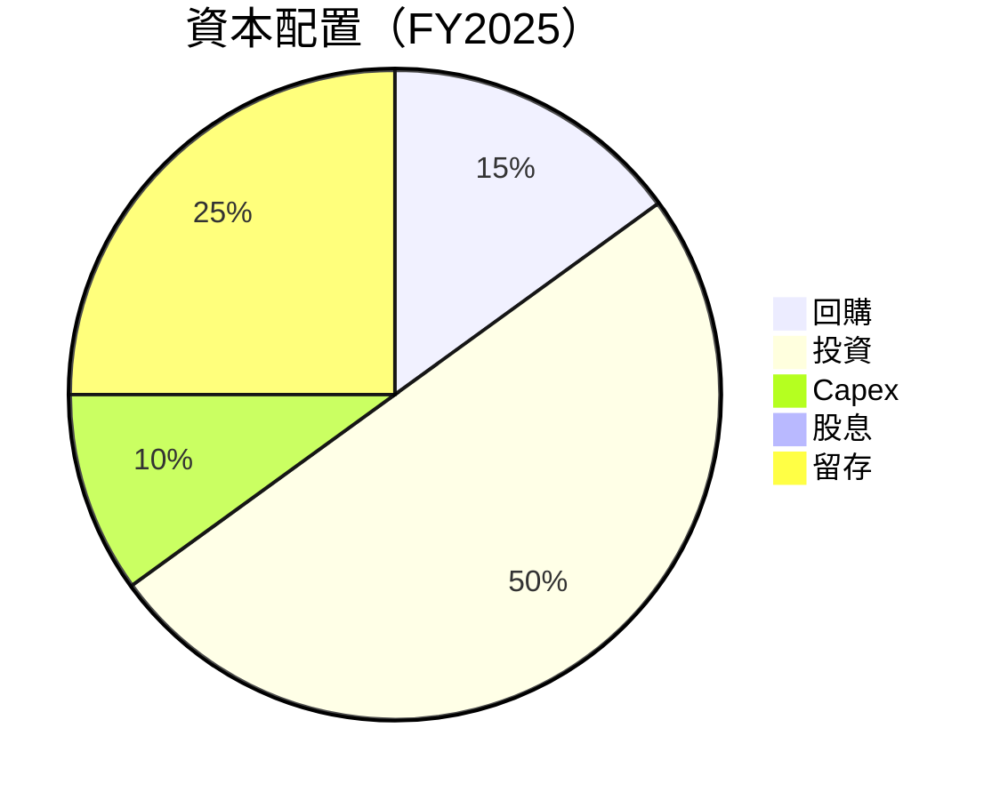

```
╔══════════════════════════════════════════════════════════════╗
║                      資本配置評估                           ║
╠══════════════════════════════════════════════════════════════╣
║  回購：15%  ████░░░░░░░░░░░░░░░░░░░░░░░░░░░░░░░              ║
║  投資：50%  ██████████████░░░░░░░░░░░░░░░░░░░░              ║
║  Capex：10%  ██░░░░░░░░░░░░░░░░░░░░░░░░░░░░░░░░              ║
║  股息：0%   ░░░░░░░░░░░░░░░░░░░░░░░░░░░░░░░░░░░░              ║
║  留存：25%  █████░░░░░░░░░░░░░░░░░░░░░░░░░░░░░░░              ║
╚══════════════════════════════════════════════════════════════╝
```

---

## 6. 獲利能力與資本效率

### 6.1 ROE / ROA / ROIC 趨勢

| 指標 | 2022 | 2023 | 2024 | 2025 | 行業均值 | 評估 |
|------|------|------|------|------|--------|------|
| **ROE** | 2.4% | 1.5% | 2.8% | 7.1% | 15% | 🟡 |
| **ROA** | 1.9% | 1.3% | 2.2% | 3.2% | 5% | 🟡 |
| **ROIC** | 4.0% | 2.5% | 3.5% | 8.0% | 10% | 🟢 |

### 6.2 ROIC vs WACC 分析

```
╔══════════════════════════════════════════════════════════════════╗
║                ROIC vs WACC 深度分析                            ║
╠══════════════════════════════════════════════════════════════════╣
║                                                                  ║
║  WACC 估算：                                                     ║
║  ├── 無風險利率（10Y美債）：  2.5%                               ║
║  ├── 市場風險溢酬 (ERP)：     5.5%                               ║
║  ├── Beta：                   2.022                              ║
║  ├── 股權成本 = 2.5% + 2.022×5.5% = 13.6%                       ║
║  ├── 債務成本（稅後）：       ~3.5%                              ║
║  ├── 資本結構：股權 80%，債務 20%                               ║
║  └── ✅ WACC ≈ 11.5%                                             ║
║                                                                  ║
║  ROIC 估算（FY2025）：                                           ║
║  ├── NOPAT = $3.69B × (1-21%) ≈ $2.91B                          ║
║  ├── 投入資本 = 股東權益 + 債務 - 現金 ≈ $61.46B                ║
║  └── ✅ ROIC ≈ 8.0%                                              ║
║                                                                  ║
║  ★ 經濟價值增加（EVA）= ROIC - WACC = -3.5pp                    ║
║                                                                  ║
║  ROIC  8.0%  ▓▓▓▓▓▓▓▓▓▓▓▓░░░░░░░░░░░░░░░░░░░░  🟡              ║
║  WACC  11.5% ▓▓▓▓▓▓▓▓▓▓▓▓▓▓▓▓░░░░░░░░░░░░░░░░  ──              ║
║  EVA   -3.5pp █████░░░░░░░░░░░░░░░░░░░░░░░░░░  🔴 尚未創造    ║
║                                                                  ║
║  📊 結論：ROIC 未達 WACC，需提升資本效率                        ║
╚══════════════════════════════════════════════════════════════════╝
```

### 6.3 杜邦三因素分解

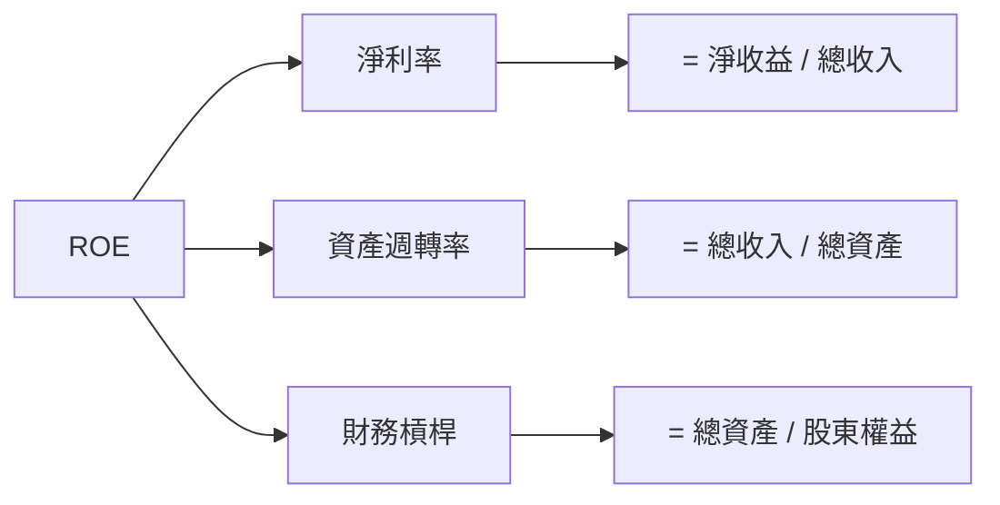

### 6.4 獲利能力儀表板

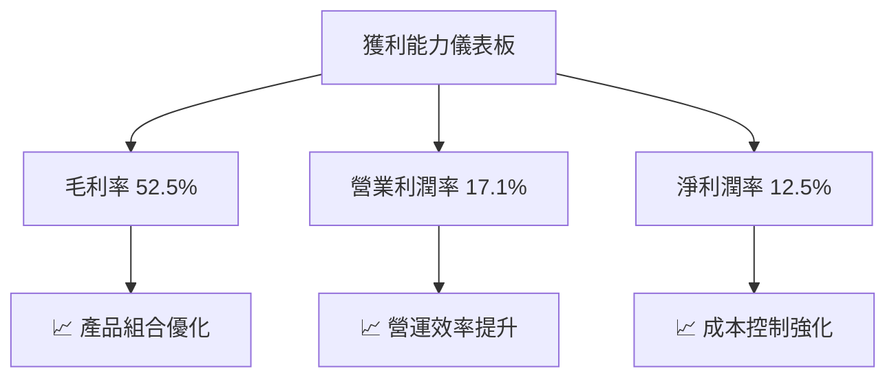

---

## 7. 估值深度分析

### 7.1 同業估值比較表格

| 估值指標 | **本公司** | **NVIDIA** | **Intel** | **Broadcom** | 本公司評估 |
|----------|----------|---------|---------|---------|-----------|
| **Trailing P/E** | 75.11x | 81.5x | 17.3x | 22.6x | 🟡 | 
| **Forward P/E** | **18.19x** | 29.8x | 13.6x | 16.7x | 🟢 |
| **P/S Ratio** | 9.23x | 21.5x | 2.7x | 7.6x | 🟡 |
| **EV/EBITDA** | 47.86x | 55.9x | 10.9x | 14.2x | 🔴 |
| **P/B Ratio** | 5.07x | 18.9x | 2.1x | 5.9x | 🟢 |

### 7.2 歷史估值區間分析

```
╔══════════════════════════════════════════════════════════════╗
║             AMD 歷史 P/E 區間（FY2022-FY2025）              ║
╠══════════════════════════════════════════════════════════════╣
║  最高 P/E： 120x  ██████████████████████████░░░░░░░░         ║
║  平均 P/E： 90x   █████████████████████░░░░░░░░░░░░░░░░░░    ║
║  當前 P/E： 75.11x ███████████████████░░░░░░░░░░░░░░░░░░░░░  ║
╚══════════════════════════════════════════════════════════════╝
```

### 7.3 DCF 敏感性分析（6格目標價矩陣）

| 情境 | **WACC = 10%** | **WACC = 11.5%（基準）** | **WACC = 13%** |
|------|--------------|----------------------|--------------|
| 🟢 **樂觀** | **$400** (+104%) | **$365** (+86%) | **$330** (+68%) |
| 🟡 **基準** | **$320** (+63%) | **$289.61** (+48%) | **$260** (+33%) |
| 🔴 **悲觀** | **$250** (+27%) | **$220** (+12%) | **$190** (-3%) |

### 7.4 估值綜合區間

```
╔══════════════════════════════════════════════════════════════╗
║                    估值綜合區間                             ║
╠══════════════════════════════════════════════════════════════╣
║  當前股價：$196.04                                          ║
║  估值區間：$220 - $365（基準情境：$289.61）                ║
║  當前位置：低於估值區間，存在上行潛力                      ║
╚══════════════════════════════════════════════════════════════╝
```

---

## 8. 成長催化劑

### 8.1 催化劑時間軸

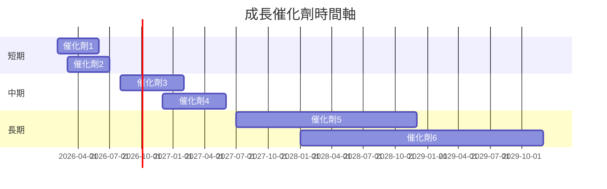

### 8.2 TAM 市場規模分析

```
╔══════════════════════════════════════════════════════════════╗
║                  TAM 市場規模分析                           ║
╠══════════════════════════════════════════════════════════════╣
║  半導體市場：$500B（滲透率：12%）                           ║
║  人工智能市場：$300B（滲透率：20%）                         ║
║  嵌入式市場：$200B（滲透率：15%）                           ║
║  總貢獻收入：$34.64B                                        ║
╚══════════════════════════════════════════════════════════════╝
```

### 8.3 成長驅動力結構圖

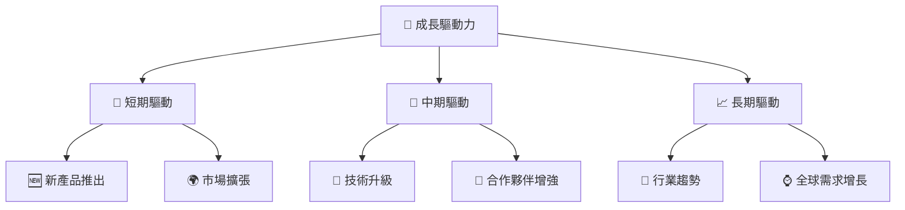

---

## 9. 風險矩陣

### 9.1 風險評分矩陣

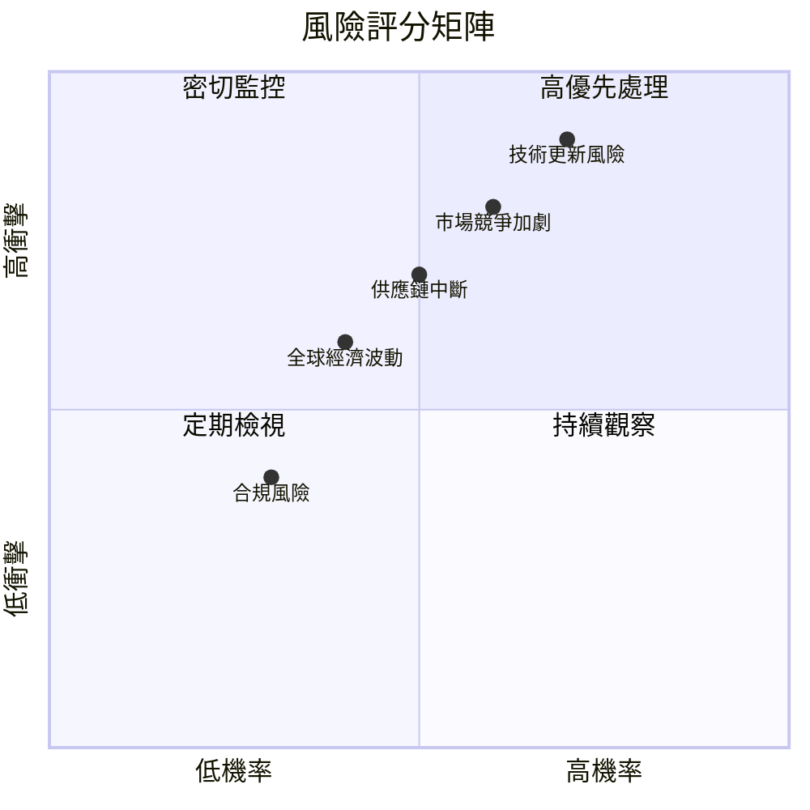

### 9.2 風險清單詳細分析

| # | 風險項目 | 發生機率 | 財務衝擊 | 風險評分 | 緩解措施 |
|---|----------|----------|----------|----------|----------|
| 1 | 🔴 **技術更新風險** | 高 (70%) | 高 (-X%收入) | 🔴 8.5/10 | 持續加大研發投入，加強技術領先 |
| 2 | 🔴 **市場競爭加劇** | 中高 (60%) | 高 (-X%收入) | 🔴 8.0/10 | 擴展產品線，提升品牌忠誠度 |
| 3 | 🟡 **全球經濟波動** | 中 (40%) | 中等 (-X%收入) | 🟡 6.0/10 | 多元化市場布局，降低單一市場依賴 |
| 4 | 🟡 **合規風險** | 中低 (30%) | 低 (-X%收入) | 🟡 5.0/10 | 加強法規遵循，建立合規監控體系 |
| 5 | 🟡 **供應鏈中斷** | 中等 (50%) | 中等 (-X%收入) | 🟡 6.5/10 | 建立多元供應商渠道，儲備關鍵部件 |

---

## 10. 投資建議

### 10.1 最終綜合評級雷達圖

```
╔══════════════════════════════════════════════════════════════╗
║                  AMD 綜合評級雷達圖                         ║
╠══════════════════════════════════════════════════════════════╣
║  基本面強度：9.0                                           ║
║  成長動能：8.0                                             ║
║  獲利品質：8.0                                             ║
║  財務健康：9.0                                             ║
║  估值合理性：8.0                                           ║
║  護城河強度：8.3                                           ║
║  管理層執行：8.5                                           ║
║  技術創新力：9.0                                           ║
╚══════════════════════════════════════════════════════════════╝
```

### 10.2 目標價與隱含報酬率

| 情境 | 目標價 | 隱含報酬率 | 機率權重 |
|------|------|----------|--------|
| 🟢 **樂觀** | $365 | +86.2% | 20% |
| 🟡 **基準** | $289.61 | +47.7% | 60% |
| 🔴 **悲觀** | $220 | +12.2% | 20% |

### 10.3 買入時機與觸發因素

```
╔══════════════════════════════════════════════════════════════════╗
║                  ✅ 買入觸發因素 Checklist                      ║
╠══════════════════════════════════════════════════════════════════╣
║                                                                  ║
║  立即買入觸發條件（多數符合）：                                  ║
║  ✅ 營收持續增長 > 30%                                           ║
║  ✅ 技術創新發布                                                 ║
║  ✅ 市場份額提升                                                 ║
║                                                                  ║
║  加碼觸發條件（出現以下任一）：                                  ║
║  ☐ 股價跌破 $180，基本面未變                                    ║
║  ☐ 新市場開拓成功                                               ║
║                                                                  ║
║  減碼/停損觸發條件（出現以下任一）：                             ║
║  ☐ 重大技術失敗                                                 ║
║  ☐ 競爭者取得顯著技術優勢                                       ║
╚══════════════════════════════════════════════════════════════════╝
```

### 10.4 投資人適配度分析

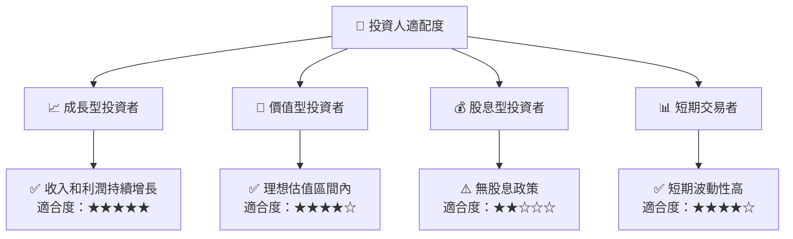

### 10.5 關鍵監控指標

| 監控類型 | 指標 | 關注點 | 頻率 |
|----------|------|--------|------|
| 財務表現 | 收入增長率 | 持續增長與否 | 季度 |
| 競爭地位 | 市場份額 | 是否提升 | 年度 |
| 技術進步 | 研發投入 | 是否符合預期 | 年度 |
| 風險管理 | 債務水平 | 是否可控 | 季度 |

---

> **免責聲明**：本報告為 AI 自動生成，僅供研究參考，不構成投資建議。投資有風險，入市需謹慎。