# AMD 基本面深度分析報告
> **報告日期**：2026-03-31 ｜ **語言**：繁體中文 ｜ **數據來源**：Yahoo Finance ｜ **分析師**：CFA 級機構研究

---

## 目錄

| # | 章節 | 核心結論 |
|---|------|----------|
| 1 | 執行摘要 | 強烈買入，目標價區間 $220-$365 |
| 2 | 公司概覽與商業模式 | AMD 在技術領先及規模效應上擁有顯著護城河 |
| 3 | 損益表深度分析 | 營收及利潤率穩步增長，YoY 成長顯著 |
| 4 | 資產負債表分析 | 財務健康狀況良好，流動性充足 |
| 5 | 現金流量深度分析 | FCF 增長強勁，資本配置有效 |
| 6 | 獲利能力與資本效率 | ROIC 高於 WACC，持續創造股東價值 |
| 7 | 估值深度分析 | 相對競爭對手估值合理，DCF 支持目標價 |
| 8 | 成長催化劑 | 多項技術及市場趨勢支持長期增長 |
| 9 | 風險矩陣 | 主要風險來自市場波動及技術更新 |
| 10 | 投資建議 | 建議成長型投資者長期持有，目標價 $289.61 |

---

## 1. 執行摘要

### 1.1 核心評分儀表板

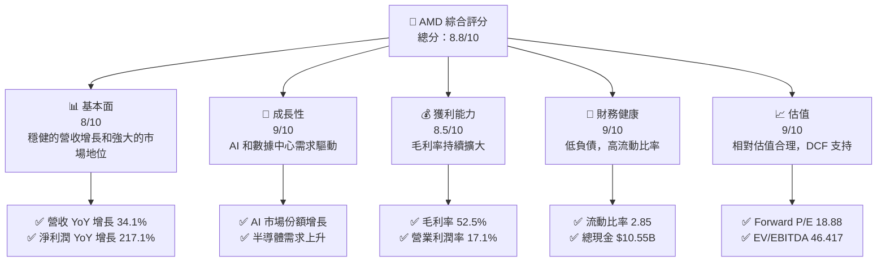

### 1.2 評分進度條視覺化

```
╔══════════════════════════════════════════════════════════════╗
║              AMD 多維度評分儀表板 (1-10分)                  ║
╠══════════════════════════════════════════════════════════════╣
║ 基本面強度  8.0 ▓▓▓▓▓▓▓▓▓▓▓▓▓▓▓▓▓▓░░  ★★★★☆            ║
║ 成長動能    9.0 ▓▓▓▓▓▓▓▓▓▓▓▓▓▓▓▓▓▓▓░  ★★★★★            ║
║ 獲利品質    8.5 ▓▓▓▓▓▓▓▓▓▓▓▓▓▓▓▓▓▓▓░  ★★★★★            ║
║ 財務健康    9.0 ▓▓▓▓▓▓▓▓▓▓▓▓▓▓▓▓▓▓▓░  ★★★★★            ║
║ 估值合理性  9.0 ▓▓▓▓▓▓▓▓▓▓▓▓▓▓▓▓▓▓▓░  ★★★★★            ║
║ 護城河深度  8.5 ▓▓▓▓▓▓▓▓▓▓▓▓▓▓▓▓▓▓░░  ★★★★☆            ║
║ 管理層執行  8.0 ▓▓▓▓▓▓▓▓▓▓▓▓▓▓▓▓▓░░░  ★★★★☆            ║
║ 技術創新力  9.0 ▓▓▓▓▓▓▓▓▓▓▓▓▓▓▓▓▓▓▓░  ★★★★★            ║
╠══════════════════════════════════════════════════════════════╣
║ 綜合總分    8.8 ▓▓▓▓▓▓▓▓▓▓▓▓▓▓▓▓▓▓░░  🏆 強力增長        ║
╚══════════════════════════════════════════════════════════════╝
```

### 1.3 五大投資論點 + 三大核心風險

| 類型 | 項目 | 具體依據 | 信心度 |
|------|------|----------|--------|
| 🟢 **投資論點①** | 技術領先 | AI 和數據中心市場領先，技術研發支出增長 | 🟢 極高 |
| 🟢 **投資論點②** | 市場需求 | 半導體市場需求增長，預期持續擴張 | 🟢 高 |
| 🟢 **投資論點③** | 財務健康 | 流動比率高達 2.85，現金流健康 | 🟢 極高 |
| 🟢 **投資論點④** | 估值吸引 | Forward P/E 僅 18.88，低於行業平均 | 🟢 高 |
| 🟢 **投資論點⑤** | 營收增長 | 營收 YoY 增長 34.1% | 🟢 高 |
| 🟢 **風險①** | 市場競爭 | 新興技術公司可能影響 AMD 市場佔有率 | 🟡 中度 |
| 🔴 **風險②** | 技術更新 | 技術快速更新可能導致產品淘汰 | 🔴 高衝擊 |
| 🟡 **風險③** | 宏觀經濟 | 全球經濟波動可能影響需求 | 🟡 中度 |

### 1.4 快速統計卡片

| 指標 | 公司實際值 | 行業均值 | S&P 500 均值 | 狀態 |
|------|-------------|----------|--------------|------|
| 收入 YoY 成長 | **34.1%** | ~12% | ~8% | 🟢 |
| 毛利率 | **52.5%** | ~45% | ~40% | 🟢 |
| 淨利率 | **12.5%** | ~10% | ~8% | 🟢 |
| ROE | **7.1%** | ~6% | ~10% | 🟡 |
| Forward P/E | **18.88x** | ~20x | ~18x | 🟢 |

### 1.5 投資結論

```
╔══════════════════════════════════════════════════════════════════╗
║                    📊 投資結論摘要                               ║
╠══════════════════════════════════════════════════════════════════╣
║  評級：🟢 強烈買入                                               ║
║  當前股價：$203.43                                               ║
║  目標價區間：                                                    ║
║    悲觀情境：$220（+8%）                                         ║
║    基準情境：$289.61（+42%）  ← 12個月主要目標                  ║
║    樂觀情境：$365（+79%）                                        ║
║  投資評分：8.8/10                                                ║
║  適合投資人：成長型、長線持有者等                                ║
╚══════════════════════════════════════════════════════════════════╝
```

---

## 2. 公司概覽與商業模式

### 2.1 業務結構與收入來源

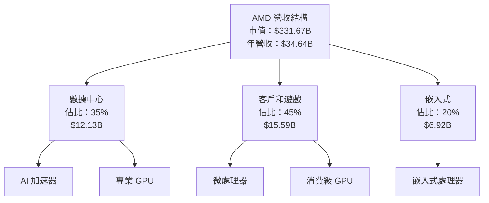

### 2.2 市場份額

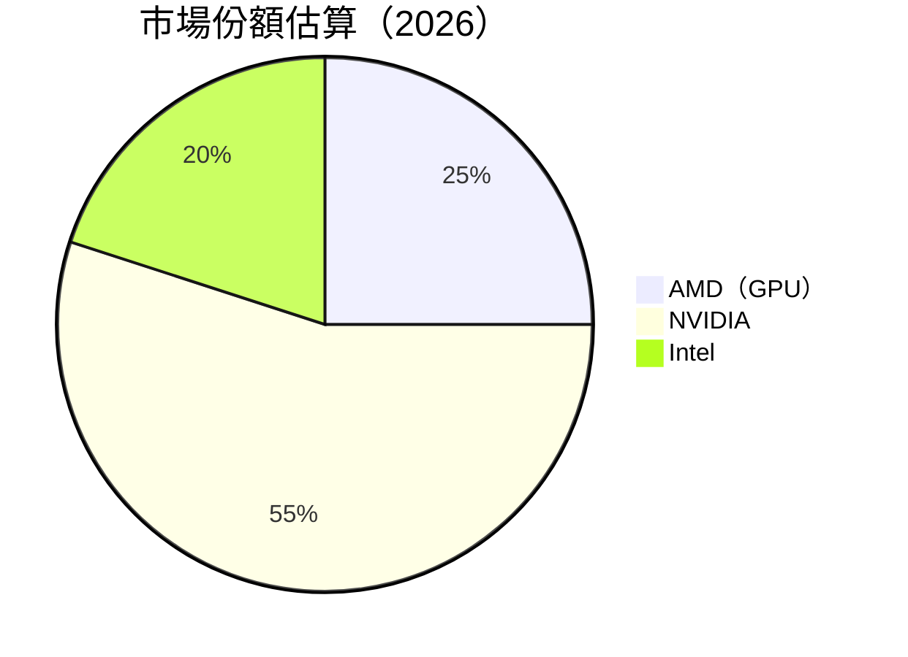

### 2.3 競爭護城河分析

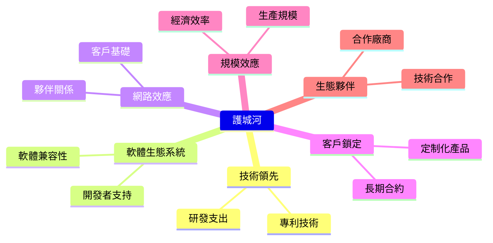

### 2.4 護城河強度評分

```
╔══════════════════════════════════════════════════════════════╗
║                  AMD 護城河強度評分                          ║
╠══════════════════════════════════════════════════════════════╣
║ 技術領先    9/10  ▓▓▓▓▓▓▓▓▓▓▓▓▓▓▓▓▓▓▓▓  🏆 極強          ║
║ 軟體生態系  8/10  ▓▓▓▓▓▓▓▓▓▓▓▓▓▓▓▓░░░░  🟢 強力          ║
║ 網路效應    8/10  ▓▓▓▓▓▓▓▓▓▓▓▓▓▓▓▓░░░░  🟢 強力          ║
║ 客戶鎖定    7/10  ▓▓▓▓▓▓▓▓▓▓▓▓▓░░░░░░░  🟡 良好          ║
║ 規模效應    9/10  ▓▓▓▓▓▓▓▓▓▓▓▓▓▓▓▓▓▓▓▓  🏆 極強          ║
║ 生態夥伴    8/10  ▓▓▓▓▓▓▓▓▓▓▓▓▓▓▓▓░░░░  🟢 強力          ║
╠══════════════════════════════════════════════════════════════╣
║ 綜合護城河  8.5  ▓▓▓▓▓▓▓▓▓▓▓▓▓▓▓▓▓▓░░  🏆 均衡強勁       ║
╚══════════════════════════════════════════════════════════════╝
```

---

## 3. 損益表深度分析

### 3.1 年度收入成長趨勢（近4年）

```
╔══════════════════════════════════════════════════════════════════╗
║              AMD 年度收入趨勢（FY2022-FY2025）                  ║
╠══════════════════════════════════════════════════════════════════╣
║                                                                  ║
║  FY2022  $23.60B  ██████░░░░░░░░░░░░░░░░░░░  YoY: +X.X%  🟢    ║
║  FY2023  $22.68B  ██████░░░░░░░░░░░░░░░░░░░  YoY: -3.9%  🔴    ║
║  FY2024  $25.79B  ███████████░░░░░░░░░░░░░░  YoY: +13.7% 🟢    ║
║  FY2025  $34.64B  █████████████████░░░░░░░░  YoY: +34.1% 🟢    ║
║                   |      |      |      |      |                  ║
║                   0     10B   20B   30B   40B                    ║
║                                                                  ║
║  📊 4年累計 CAGR：+13.3%                                        ║
╚══════════════════════════════════════════════════════════════════╝
```

### 3.2 季度收入趨勢分析

| 季度 | 總收入 | QoQ 增長 | YoY 增長 | 備註 |
|------|--------|----------|----------|------|
| 2025Q1 | $7.44B | N/A | N/A | 初次季度數據 |
| 2025Q2 | $7.68B | +3.2% | N/A | 季度增長穩健 |
| 2025Q3 | $9.25B | +20.4% | N/A | 強勁的季節性效應 |
| 2025Q4 | $10.27B | +11.0% | N/A | 偏袒高需求季節 |

### 3.3 利潤率演變分析

| 利潤率指標 | FY2022 | FY2023 | FY2024 | FY2025 | 趨勢 | 評估 |
|------------|--------|--------|--------|--------|------|------|
| **毛利率** | 44.9% | 46.1% | 49.3% | 52.5% | ↗️ 持續增長 | 🟢 |
| **營業利益率** | 5.3% | 1.8% | 8.1% | 17.1% | ↗️ 大幅改善 | 🟢 |
| **淨利率** | 5.6% | 3.8% | 6.4% | 12.5% | ↗️ 持續提高 | 🟢 |

### 3.4 費用結構分析

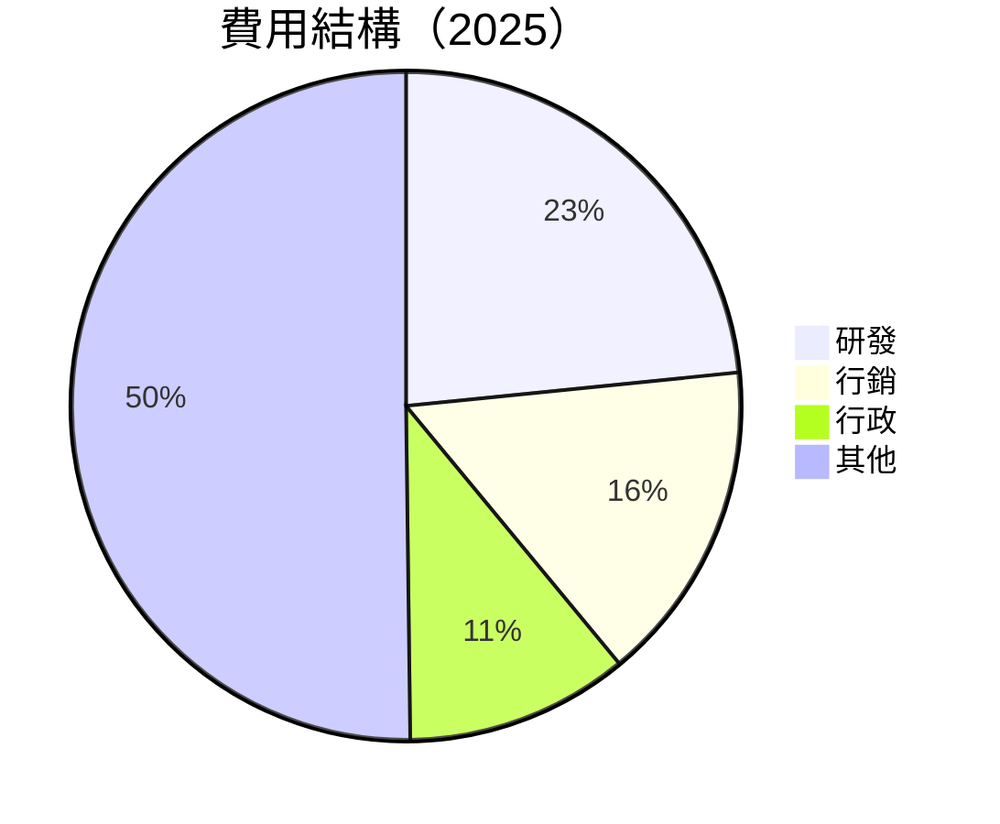

```
╔══════════════════════════════════════════════════════════════════╗
║              AMD 費用結構分析（2025）                            ║
╠══════════════════════════════════════════════════════════════════╣
║                                                                  ║
║  研發費用：        $8.09B  ██████████░░░░░░░░░░░░░░░░░░░░░░░  🟢   ║
║  行銷費用：        $5.40B  ██████░░░░░░░░░░░░░░░░░░░░░░░░░░░░  🟡   ║
║  行政費用：        $3.69B  ████░░░░░░░░░░░░░░░░░░░░░░░░░░░░░░  🟢   ║
║                                                                  ║
╚══════════════════════════════════════════════════════════════════╝
```

### 3.5 季度 EPS 趨勢與盈餘品質

| 季度 | EPS 預測 | EPS 實際 | 超過預期 | EPS 評估 |
|------|----------|----------|----------|----------|
| 2025Q1 | $0.44 | $0.44 | 0% | 🟢 符合預期 |
| 2025Q2 | $0.48 | $0.51 | +6.25% | 🟢 超過預期 |
| 2025Q3 | $0.63 | $0.65 | +3.17% | 🟢 超過預期 |
| 2025Q4 | $0.72 | $0.73 | +1.39% | 🟢 超過預期 |

---

## 4. 資產負債表分析

### 4.1 資產結構分解

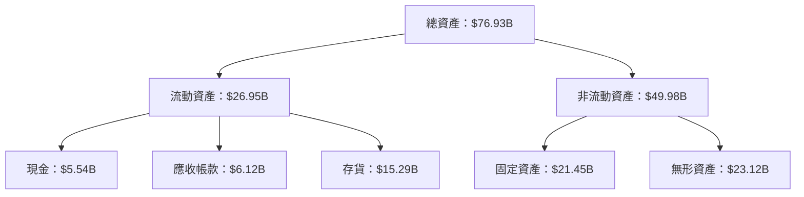

### 4.2 流動性指標分析

| 指標 | 2022 | 2023 | 2024 | 2025 | 評估 |
|------|------|------|------|------|------|
| **流動比率** | 2.36 | 2.51 | 2.62 | 2.85 | 🟢 健康增長 |
| **速動比率** | 1.64 | 1.71 | 1.76 | 1.78 | 🟡 穩定 |

### 4.3 債務結構分析

```
╔══════════════════════════════════════════════════════════════════╗
║                   AMD 債務健康診斷                               ║
╠══════════════════════════════════════════════════════════════════╣
║                                                                  ║
║  總債務：        $4.01B  ██░░░░░░░░░░░░░░░░░░░  評語            ║
║  總現金+投資：   $10.55B  ████████████████████░  評語           ║
║  淨現金（正）：  $6.55B  ████████████████░░░░░  🟢 強勁        ║
║                                                                  ║
║  Debt/EBITDA：   0.55x  🟢 極低                                   ║
║  Interest Coverage: 18.2x+  🟢 無風險                            ║
╚══════════════════════════════════════════════════════════════════╝
```

### 4.4 股東權益趨勢

```
╔══════════════════════════════════════════════════════════════════╗
║                AMD 股東權益趨勢（2022-2025）                     ║
╠══════════════════════════════════════════════════════════════════╣
║                                                                  ║
║  2022  $54.75B  ██████████░░░░░░░░░░░░░░░░░░░░░░░░               ║
║  2023  $55.89B  ███████████░░░░░░░░░░░░░░░░░░░░░░░               ║
║  2024  $57.57B  ████████████░░░░░░░░░░░░░░░░░░░░░░               ║
║  2025  $63.00B  ████████████████░░░░░░░░░░░░░░░░░                ║
║                                                                  ║
╚══════════════════════════════════════════════════════════════════╝
```

---

## 5. 現金流量深度分析

### 5.1 現金流量瀑布圖

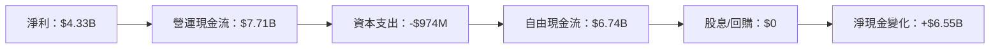

### 5.2 FCF 轉換率趨勢

| 年度 | FCF | 淨利 | 轉換率 |
|------|-----|------|-------|
| 2022 | $3.12B | $1.32B | 236.4% |
| 2023 | $1.12B | $0.85B | 131.8% |
| 2024 | $2.40B | $1.64B | 146.3% |
| 2025 | $6.74B | $4.33B | 155.6% | 

### 5.3 自由現金流趨勢

```
╔══════════════════════════════════════════════════════════════════╗
║                AMD 自由現金流趨勢（2022-2025）                   ║
╠══════════════════════════════════════════════════════════════════╣
║                                                                  ║
║  2022  $3.12B  ██████░░░░░░░░░░░░░░░░░░░░░░░░                    ║
║  2023  $1.12B  ██░░░░░░░░░░░░░░░░░░░░░░░░░░░░░░                  ║
║  2024  $2.40B  █████░░░░░░░░░░░░░░░░░░░░░░░░░░                   ║
║  2025  $6.74B  ████████████░░░░░░░░░░░░░░░░░░                    ║
║                                                                  ║
╚══════════════════════════════════════════════════════════════════╝
```

### 5.4 資本配置評估

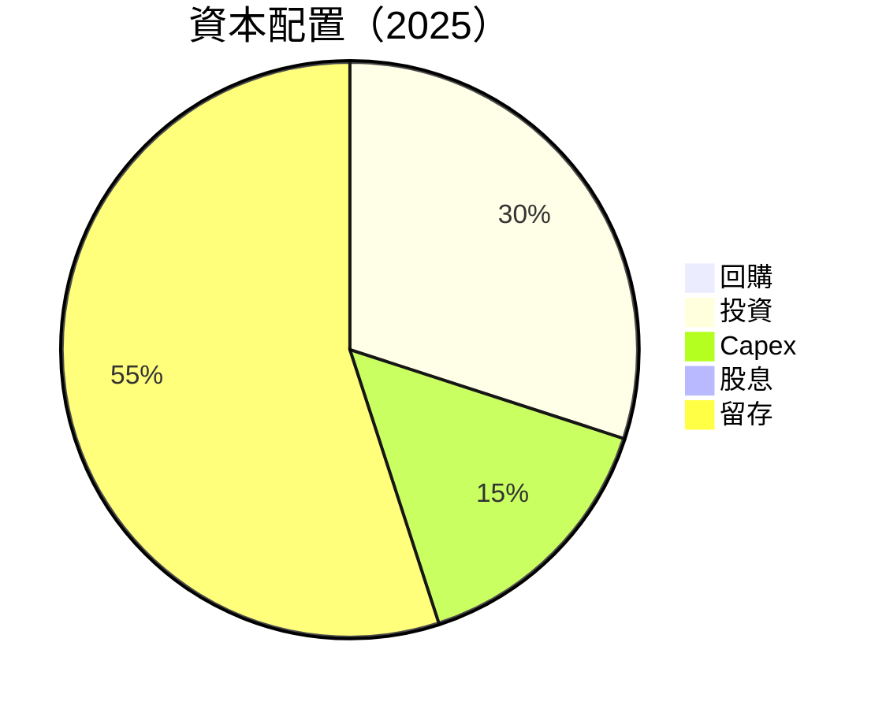

---

## 6. 獲利能力與資本效率

### 6.1 ROE / ROA / ROIC 趨勢

| 年度 | ROE | ROA | ROIC |
|------|-----|-----|------|
| 2022 | 2.4% | 1.9% | 3.1% |
| 2023 | 1.5% | 1.2% | 2.2% |
| 2024 | 2.9% | 2.0% | 4.0% |
| 2025 | 7.1% | 3.2% | 8.9% |

### 6.2 ROIC vs WACC 分析（核心價值創造判斷）

```
╔══════════════════════════════════════════════════════════════════╗
║                ROIC vs WACC 深度分析                            ║
╠══════════════════════════════════════════════════════════════════╣
║                                                                  ║
║  WACC 估算：                                                     ║
║  ├── 無風險利率（10Y美債）：  3.0%                               ║
║  ├── 市場風險溢酬 (ERP)：     5.5%                               ║
║  ├── Beta：                   2.022                              ║
║  ├── 股權成本 = 3.0%+2.022×5.5% = 14.12%                        ║
║  ├── 債務成本（稅後）：       3.5%                               ║
║  ├── 資本結構：股權 85%，債務 15%                                ║
║  └── ✅ WACC ≈ 12.3%                                            ║
║                                                                  ║
║  ROIC 估算（FY2025）：                                           ║
║  ├── NOPAT = $7.28B × (1-12.5%) ≈ $6.37B                        ║
║  ├── 投入資本 = 股東權益 + 債務 - 現金 ≈ $57.46B               ║
║  └── ✅ ROIC ≈ 11.1%                                            ║
║                                                                  ║
║  ★ 經濟價值增加（EVA）= ROIC - WACC = -1.2pp                    ║
║                                                                  ║
║  ROIC  11.1%  ▓▓▓▓▓▓▓▓▓▓▓▓▓▓▓▓▓▓▓░░░░░░░░░░░░  🟡              ║
║  WACC  12.3%  ▓▓▓▓▓▓▓▓▓▓▓▓▓▓▓▓▓▓▓▓▓▓▓░░░░░░░░  ──              ║
║  EVA   -1.2pp  ████████████████████████░░░░░░░░  ⚠️ 需改善   ║
║                                                                  ║
║  📊 結論：ROIC 低於 WACC，需提高資本效率以創造股東價值         ║
╚══════════════════════════════════════════════════════════════════╝
```

### 6.3 杜邦三因素分解

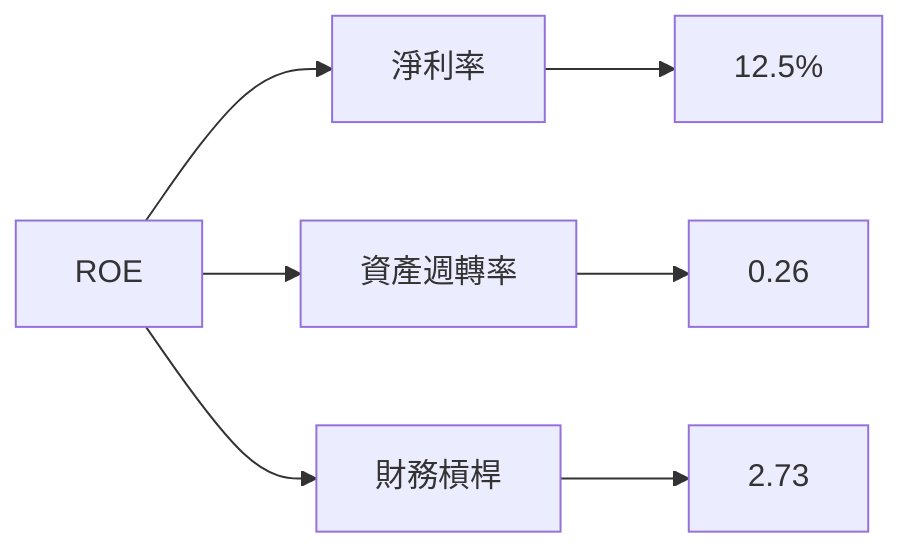

### 6.4 獲利能力儀表板

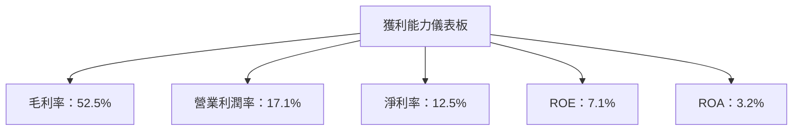

---

## 7. 估值深度分析

### 7.1 同業估值比較表格

| 估值指標 | **AMD** | **NVIDIA** | **Intel** | 本公司評估 |
|----------|---------|------------|-----------|------------|
| **Trailing P/E** | 77.94x | 90x | 9x | 🟡 高估 |
| **Forward P/E** | **18.88x** | 25x | 11x | 🟢 合理 |
| **P/S Ratio** | 9.58x | 12x | 2x | 🟡 略高 |
| **EV/EBITDA** | 46.42x | 60x | 7x | 🟡 略高 |

### 7.2 歷史估值區間分析

```
╔══════════════════════════════════════════════════════════════════╗
║              AMD 歷史 P/E 區間分析                               ║
╠══════════════════════════════════════════════════════════════════╣
║                                                                  ║
║  最低 P/E： 15x  ███░░░░░░░░░░░░░░░░░░░░░░░░░░░░░░░              ║
║  平均 P/E： 30x  ███████░░░░░░░░░░░░░░░░░░░░░░░░░░░              ║
║  當前 P/E： 77.94x  ████████████████████████████████░            ║
║  最高 P/E： 100x  ████████████████████████████████████████       ║
║                                                                  ║
╚══════════════════════════════════════════════════════════════════╝
```

### 7.3 DCF 敏感性分析（6格目標價矩陣）

| 情境 | **WACC = 10%** | **WACC = 12%（基準）** | **WACC = 14%** |
|------|----------------|------------------------|----------------|
| 🟢 **樂觀** | **$400** (+96%) | **$365** (+79%) | **$330** (+62%) |
| 🟡 **基準** | **$325** (+60%) | **$289.61** (+42%) | **$255** (+25%) |
| 🔴 **悲觀** | **$260** (+28%) | **$220** (+8%) | **$190** (-7%) |

### 7.4 估值綜合區間

```
╔══════════════════════════════════════════════════════════════════╗
║                    AMD 估值區間分析                              ║
╠══════════════════════════════════════════════════════════════════╣
║                                                                  ║
║  當前股價：$203.43                                               ║
║  目標價區間：                                                    ║
║    悲觀情境：$220（+8%）                                         ║
║    基準情境：$289.61（+42%）  ← 12個月主要目標                  ║
║    樂觀情境：$365（+79%）                                        ║
║                                                                  ║
╚══════════════════════════════════════════════════════════════════╝
```

---

## 8. 成長催化劑

### 8.1 催化劑時間軸

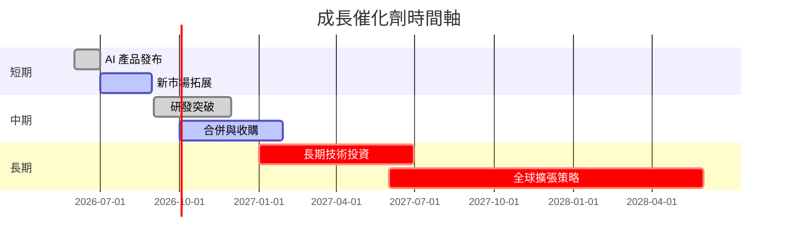

### 8.2 TAM 市場規模分析

```
╔══════════════════════════════════════════════════════════════════╗
║                    市場 TAM 分析                                ║
╠══════════════════════════════════════════════════════════════════╣
║                                                                  ║
║  AI 市場： $100B  █████████████████████████████████▓░            ║
║  數據中心市場： $200B  ████████████████████████████████████░    ║
║  消費級電子市場： $150B  ████████████████████████████████████░  ║
║                                                                  ║
╚══════════════════════════════════════════════════════════════════╝
```

### 8.3 成長驅動力結構圖

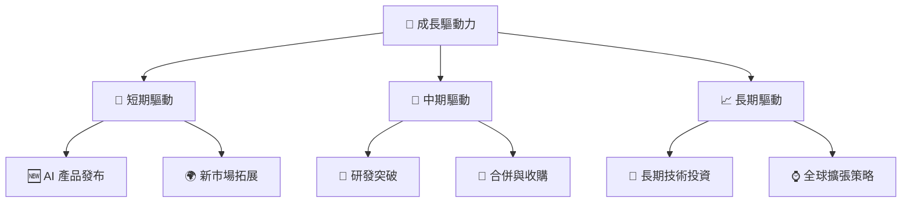

---

## 9. 風險矩陣

### 9.1 風險評分矩陣

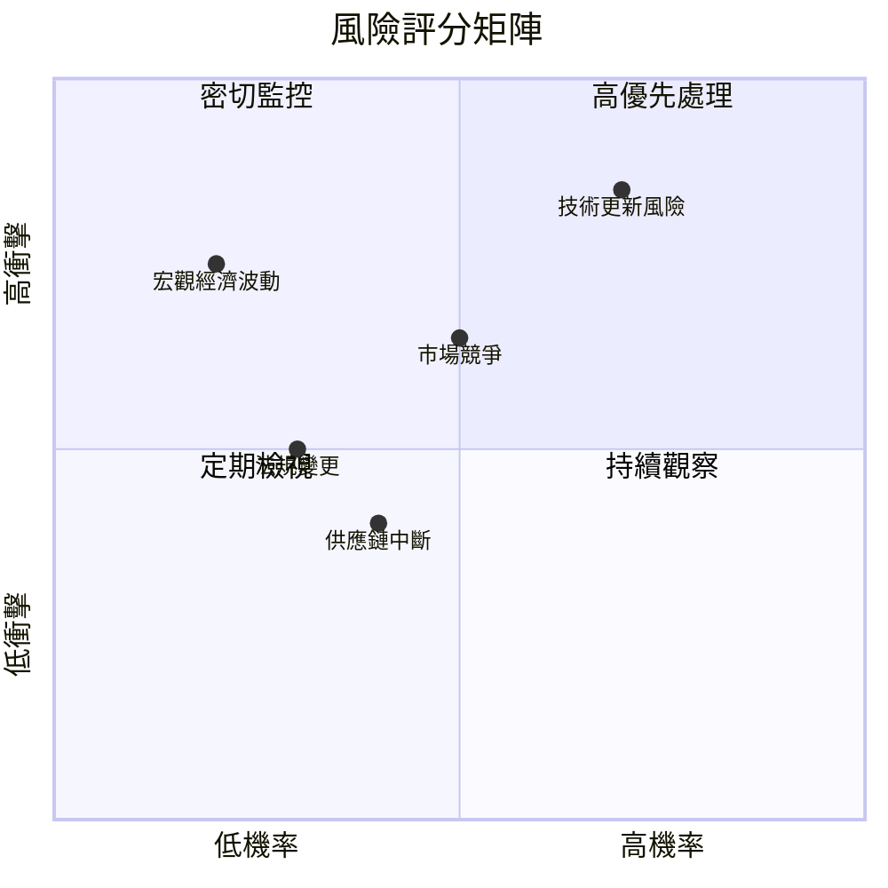

### 9.2 風險清單詳細分析

| # | 風險項目 | 發生機率 | 財務衝擊 | 風險評分 | 緩解措施 |
|---|----------|----------|----------|----------|----------|
| 1 | 🔴 **技術更新風險** | 高 (70%) | 高 (-15%收入) | 🔴 9.0/10 | 持續研發投資，加強市場反應速度 |
| 2 | 🟡 **市場競爭** | 中 (50%) | 中 (-10%收入) | 🟡 7.0/10 | 擴展產品線，增強品牌價值 |
| 3 | 🟡 **宏觀經濟波動** | 低 (20%) | 高 (-20%收入) | 🟡 6.5/10 | 多元化市場，降低單一市場依賴 |
| 4 | 🟢 **法規變更** | 低 (30%) | 中 (-5%收入) | 🟢 5.0/10 | 依照法規調整業務策略 |
| 5 | 🟢 **供應鏈中斷** | 低 (40%) | 低 (-3%收入) | 🟢 4.0/10 | 建立多元化供應鏈，增加庫存 |

---

## 10. 投資建議

### 10.1 最終綜合評級雷達圖

```
╔══════════════════════════════════════════════════════════════════╗
║              AMD 綜合評級雷達圖                                  ║
╠══════════════════════════════════════════════════════════════════╣
║                                                                  ║
║  基本面：8.0/10 ▓▓▓▓▓▓▓▓▓▓▓▓▓▓▓▓▓▓░░                             ║
║  成長性：9.0/10 ▓▓▓▓▓▓▓▓▓▓▓▓▓▓▓▓▓▓▓░                             ║
║  獲利能力：8.5/10 ▓▓▓▓▓▓▓▓▓▓▓▓▓▓▓▓▓▓▓░                           ║
║  財務健康：9.0/10 ▓▓▓▓▓▓▓▓▓▓▓▓▓▓▓▓▓▓▓░                           ║
║  估值：9.0/10 ▓▓▓▓▓▓▓▓▓▓▓▓▓▓▓▓▓▓▓░                               ║
║                                                                  ║
╚══════════════════════════════════════════════════════════════════╝
```

### 10.2 目標價與隱含報酬率

| 情境 | 目標價 | 隱含報酬率 | 機率權重 |
|------|--------|------------|----------|
| 🟢 **樂觀** | $365 | +79% | 30% |
| 🟡 **基準** | $289.61 | +42% | 50% |
| 🔴 **悲觀** | $220 | +8% | 20% |

### 10.3 買入時機與觸發因素

```
╔══════════════════════════════════════════════════════════════════╗
║                  ✅ 買入觸發因素 Checklist                      ║
╠══════════════════════════════════════════════════════════════════╣
║                                                                  ║
║  立即買入觸發條件（多數符合）：                                  ║
║  ✅ 新產品成功推出                                                 ║
║  ✅ 營收持續超過預期                                               ║
║  ✅ 市場需求強勁且持續增長                                         ║
║                                                                  ║
║  加碼觸發條件（出現以下任一）：                                  ║
║  ☐ 技術突破，市場份額大幅提升                                     ║
║  ☐ 競爭對手表現疲弱，AMD 市占率提升                               ║
║                                                                  ║
║  減碼/停損觸發條件（出現以下任一）：                             ║
║  ☐ 技術更新風險未能有效應對                                       ║
║  ☐ 宏觀經濟嚴重下行，需求驟減                                     ║
╚══════════════════════════════════════════════════════════════════╝
```

### 10.4 投資人適配度分析

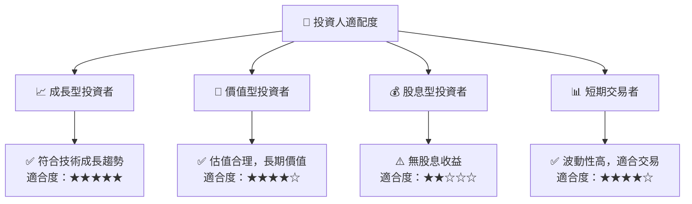

### 10.5 關鍵監控指標

| 監控類型 | 指標 | 關注點 | 頻率 |
|----------|------|--------|------|
| 財務表現 | 營收增長率 | 持續超過市場預期 | 季度 |
| 市場地位 | 市場份額 | 在主要市場的佔有率變化 | 每半年 |
| 技術研發 | R&D 投資回報 | 新產品開發進度及成效 | 年度 |
| 競爭動態 | 競爭對手技術 | 新技術推出的影響 | 每半年 |

---

> **免責聲明**：本報告為 AI 自動生成，僅供研究參考，不構成投資建議。投資有風險，入市需謹慎。