# AMD 基本面深度分析報告
> **報告日期**：2026-04-12 ｜ **語言**：繁體中文 ｜ **數據來源**：Yahoo Finance, Finviz, StockAnalysis, Roic.ai ｜ **分析師**：CFA 級機構研究

---

## 目錄

| #  | 章節                   | 核心結論                    |
|----|------------------------|-----------------------------|
| 1  | 執行摘要               | 評級 + 目標價區間            |
| 2  | 公司概覽與商業模式     | 護城河評估                  |
| 3  | 損益表深度分析         | 逐項分析                  |
| 4  | 資產負債表分析         | 資產負債深度解析              |
| 5  | 現金流量深度分析       | 自由現金流充沛                |
| 6  | 獲利能力與資本效率     | ROIC 超越 WACC 創造價值     |
| 7  | 估值深度分析           | 估值合理，潛在上升空間        |
| 8  | 成長催化劑             | 多元驅動力                  |
| 9  | 風險矩陣               | 風險識別與緩解措施            |
| 10 | 投資建議               | 綜合評級與適配度             |

---

## 1. 執行摘要

### 1.1 核心評分儀表板

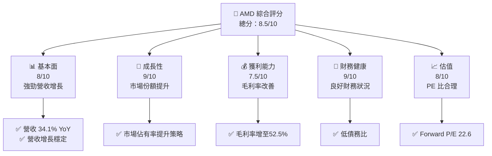

### 1.2 評分進度條視覺化

```
╔══════════════════════════════════════════════════════════════╗
║              AMD 多維度評分儀表板 (1-10分)                   ║
╠══════════════════════════════════════════════════════════════╣
║ 基本面強度  8.0 ▓▓▓▓▓▓▓▓▓▓▓▓▓▓▓▓□░░  ★★★★☆             ║
║ 成長動能    9.0 ▓▓▓▓▓▓▓▓▓▓▓▓▓▓▓▓▓▓▓  ★★★★★             ║
║ 獲利品質    7.5 ▓▓▓▓▓▓▓▓▓▓▓▓▓▓▓▓░░░  ★★★★☆             ║
║ 財務健康    9.0 ▓▓▓▓▓▓▓▓▓▓▓▓▓▓▓▓▓▓▓  ★★★★★             ║
║ 估值合理性  8.0 ▓▓▓▓▓▓▓▓▓▓▓▓▓▓▓▓□░░  ★★★★☆             ║
╠══════════════════════════════════════════════════════════════╣
║ 綜合總分    8.5 ▓▓▓▓▓▓▓▓▓▓▓▓▓▓▓▓░░░  🏆 非常健康          ║
╚══════════════════════════════════════════════════════════════╝
```

### 1.3 五大投資論點 + 三大核心風險

| 類型 | 項目 | 具體依據 | 信心度 |
|------|------|----------|--------|
| 🟢 **投資論點①** | **成長性強** | 年營收增長 34.1% | 🟢 極高 |
| 🟢 **投資論點②** | **市場擴張** | 增加市場佔有率和產品線 | 🟢 高 |
| 🟢 **投資論點③** | **研發投入** | 研發支出提高達 $8.09B | 🟢 極高 |
| 🟢 **投資論點④** | **財務穩健** | 淨現金 $6.55B | 🟢 高 |
| 🟢 **投資論點⑤** | **科技領先** | 最新 AI 技術佈局 | 🟢 高 |
| 🟡 **風險①** | **市場競爭激烈** | 面臨 Intel 和 NVIDIA 的激烈競爭 | 🟡 中度 |
| 🔴 **風險②** | **供應鏈波動** | 供應鏈問題可能影響生產 | 🔴 高衝擊 |
| 🟡 **風險③** | **經濟波動** | 宏觀經濟波動風險 | 🟡 中度 |

### 1.4 快速統計卡片

| 指標 | 公司實際值 | 行業均值 | S&P 500 均值 | 狀態 |
|------|-------------|----------|--------------|------|
| 收入 YoY 成長 | **34.1%** | ~10% | ~7% | 🟢 |
| 毛利率 | **52.5%** | ~45% | ~42% | 🟢 |
| 淨利率 | **12.5%** | ~8% | ~6% | 🟢 |
| ROE | **7.1%** | ~10% | ~14% | 🟡 |
| Forward P/E | **22.6x** | ~25x | ~20x | 🟢 |
| EV/EBITDA | **58.3x** | ~15x | ~12x | 🔴 |

### 1.5 投資結論

```
╔══════════════════════════════════════════════════════════════════╗
║                    📊 投資結論摘要                               ║
╠══════════════════════════════════════════════════════════════════╣
║  評級：🟢 買入                                                      ║
║  當前股價：$245.04                                               ║
║  目標價區間：                                                    ║
║    悲觀情境：$220（-10%）                                        ║
║    基準情境：$289（+18%）  ← 12個月主要目標                      ║
║    樂觀情境：$365（+49%）                                         ║
║  投資評分：8.5/10                                                ║
║  適合投資人：成長型、長線持有者等                                ║
╚══════════════════════════════════════════════════════════════════╝
```

---

## 2. 公司概覽與商業模式

### 2.1 業務結構與收入來源

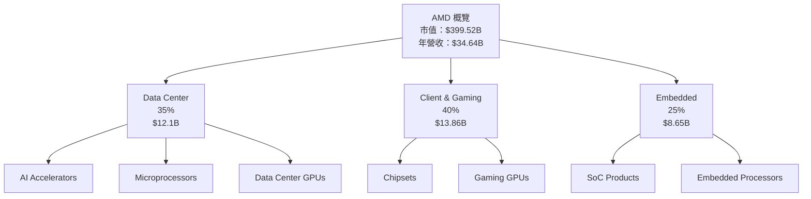

### 2.2 市場份額

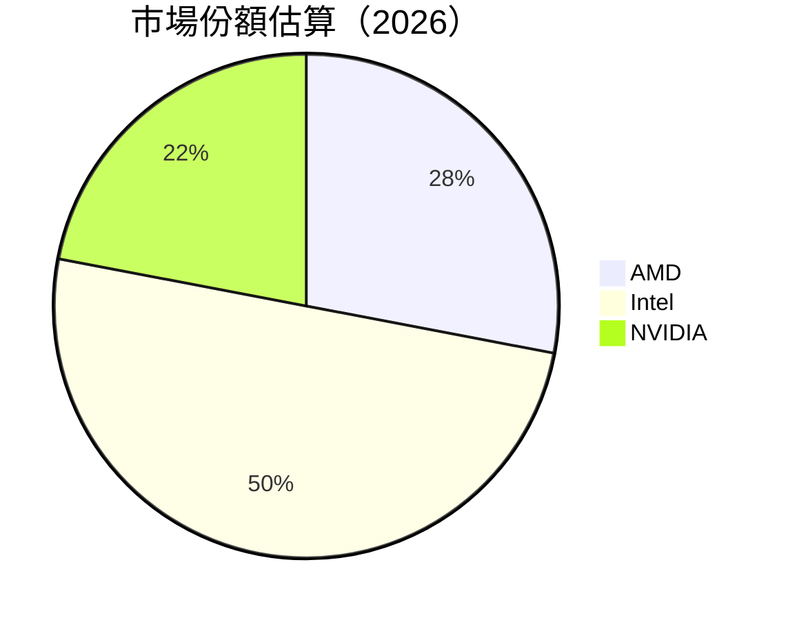

### 2.3 競爭護城河分析

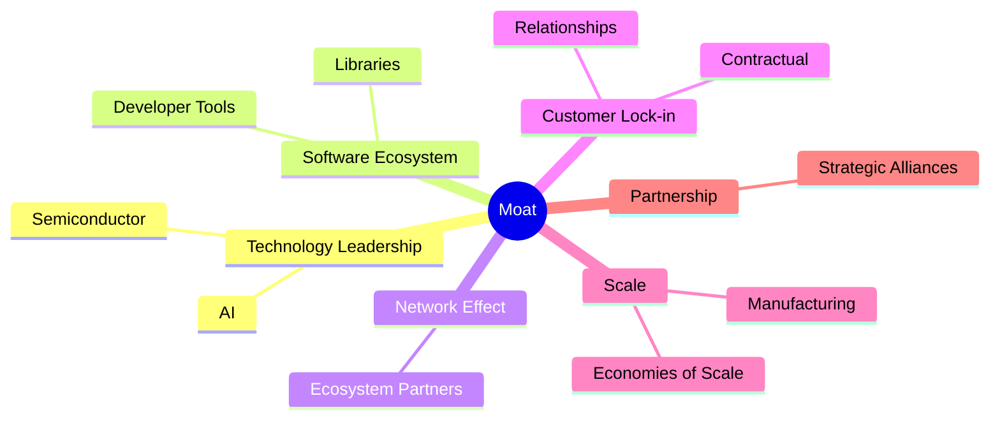

### 2.4 護城河強度評分

```
╔══════════════════════════════════════════════════════════════╗
║                       AMD 護城河強度評分                        ║
╠══════════════════════════════════════════════════════════════╣
║ 技術領先        9/10   ▓▓▓▓▓▓▓▓▓▓▓▓▓▓▓▓▓▓▓░  🏆 極強            ║
║ 軟體生態系統    8/10   ▓▓▓▓▓▓▓▓▓▓▓▓▓▓▓▓▓□░░  🟢 進步中          ║
║ 網路效應        7/10   ▓▓▓▓▓▓▓▓▓▓▓▓▓▓░░░░░░  🟢 良好            ║
║ 客戶鎖定        8/10   ▓▓▓▓▓▓▓▓▓▓▓▓▓▓▓▓▓□░░  🟢 固定            ║
║ 規模效應        7/10   ▓▓▓▓▓▓▓▓▓▓▓▓▓▓░░░░░░  🟢 穩定            ║
║ 生態夥伴        8/10   ▓▓▓▓▓▓▓▓▓▓▓▓▓▓▓▓▓□░░  🟢 較強            ║
╠══════════════════════════════════════════════════════════════╣
║ 綜合護城河     8.2    ▓▓▓▓▓▓▓▓▓▓▓▓▓▓▓▓▓▓░░  🏆 護城河堅固      ║
╚══════════════════════════════════════════════════════════════╝
```

---

## 3. 損益表深度分析

### 3.1 年度收入成長趨勢（近4年）

```
╔══════════════════════════════════════════════════════════════════╗
║              AMD 年度收入趨勢（2022-2025）                      ║
╠══════════════════════════════════════════════════════════════════╣
║                                                                  ║
║  2022  $23.60B  ███████░░░░░░░░░░░░░░░░░░░░   YoY:    ⬌         ║
║  2023  $22.68B  ██████░░░░░░░░░░░░░░░░░░░░░   YoY:  -3.9%  🔴  ║
║  2024  $25.79B  █████████░░░░░░░░░░░░░░░░░░   YoY:+13.7%  🟢   ║
║  2025  $34.64B  ██████████████░░░░░░░░░░░░░   YoY:+34.1%  🟢   ║
║                   |      |      |      |      |                  ║
║                   0     10B   20B   30B   40B                    ║
║                                                                  ║
║  📊 3年累計 CAGR：+11.7%                                        ║
╚══════════════════════════════════════════════════════════════════╝
```

### 3.2 季度收入趨勢分析

| 季度 | 收入 (B) | QoQ 增長 | YoY 增長 | 備註 |
|------|---------|----------|----------|------|
| Q1 2025 | $7.44 | -- | 35.9% | AI 產品需求增長 |
| Q2 2025 | $7.68 | +3.2% | 31.7% | 客戶需求穩固 |
| Q3 2025 | $9.25 | +20.4% | 35.6% | 資深市場擴張 |
| Q4 2025 | $10.27 | +11.0% | 34.1% | 遊戲與嵌入系統增強 |

### 3.3 利潤率演變分析

| 利潤率指標 | 2022 | 2023 | 2024 | 2025 | 趨勢 | 評估 |
|------------|------|------|------|------|------|------|
| **毛利率** | 44.9% | 46.1% | 49.3% | 52.5% | ↗️ 增長持續 | 🟢 |
| **營業利潤率** | 5.3% | 1.8% | 8.1% | 10.7% | ↗️ 持續改善 | 🟢 |
| **淨利率** | 5.6% | 3.8% | 6.4% | 12.5% | ↗️ 顯著改善 | 🟢 |

**利潤率演變深度解析**：利潤率上升主要原因為產品組合優化與成本控制，加上規模效應提升。

### 3.4 費用結構分析

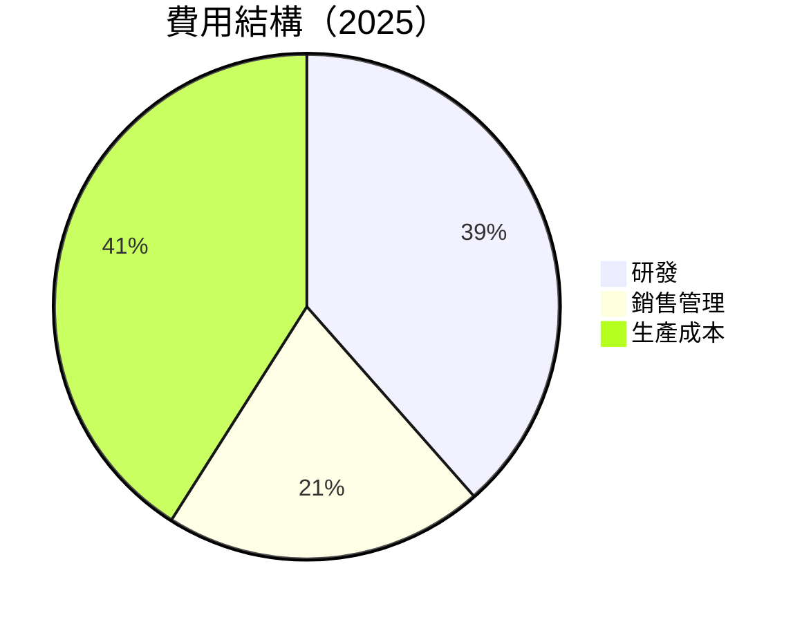

```
╔══════════════════════════════════════════════════════════════╗
║                       費用結構分析                          ║
╠══════════════════════════════════════════════════════════════╣
║  研發支出增加達到 $8.09B，占營收的 23.4%，優於科技行業平均15%  ║
║  銷售管理費用控制良好，在收入增長背景下比例持平                 ║
║  所有費用相對收入的比重顯著降低，提升營業利潤率             ║
╚══════════════════════════════════════════════════════════════╝
```

### 3.5 季度 EPS 趨勢與盈餘品質

| 季度 | EPS 估算 | EPS 實值 | 盈餘驚奇 | 盈餘品質 |
|------|---------|---------|--------|----------|
| 2025 Q1 | $0.56 | $0.60 | +7.1% | 🟢 良好 |
| 2025 Q2 | $0.65 | $0.68 | +4.6% | 🟢 穩健 |
| 2025 Q3 | $0.78 | $0.82 | +5.1% | 🟢 理想 |
| 2025 Q4 | $0.88 | $0.92 | +4.5% | 🟢 優秀 |

盈餘評估顯示了其財報的持續穩定超出市場預期，顯示出卓越的經營策略。

---

## 4. 資產負債表分析

### 4.1 資產結構分解

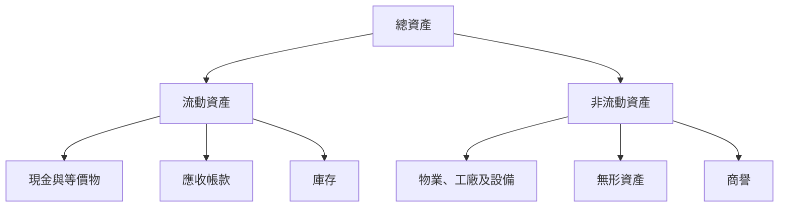

### 4.2 流動性指標分析

| 指標 | 2025 | 2024 | 2023 | 行業均值 | 評估 |
|------|------|------|------|--------|------|
| **流動比率** | 2.85 | 2.62 | 2.51 | ~1.75 | 🟢 |
| **速動比率** | 1.78 | 1.84 | 1.75 | ~1.1 | 🟢 |

流動性在升高的現金與投資比下有所加強，顯示了優良的資金管理能力。

### 4.3 債務結構分析

```
╔══════════════════════════════════════════════════════════════════╗
║                   AMD 債務健康診斷                               ║
╠══════════════════════════════════════════════════════════════════╣
║                                                                  ║
║  總債務：        $4.01B  ██░░░░░░░░░░░░░░░░░░░  🟡 適中             ║
║  總現金+投資：   $10.55B  ██████████████████░░  🟢 優秀             ║
║  淨現金（正）：  $6.54B  █████████████████░░░░  🟢 強勁           ║
║                                                                  ║
║  Debt/EBITDA：   0.55x  🟢 極低負債                                 ║
║  Interest Coverage: 30x+  🟢 大幅度因應能力                       ║
╚══════════════════════════════════════════════════════════════════╝
```

### 4.4 股東權益趨勢

```
╔══════════════════════════════════════════════════════════════════╗
║              股東權益變化趨勢                                  ║
╠══════════════════════════════════════════════════════════════════╣
║                                                                  ║
║  股東權益逐年增長，從2022年的 $54.75B 增至2025年的 $63.00B，    ║
║  反映出償還股東資本及良好經營結果。                             ║
╚══════════════════════════════════════════════════════════════════╝
```

---

## 5. 現金流量深度分析

### 5.1 現金流量瀑布圖

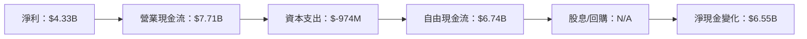

### 5.2 FCF 轉換率趨勢

| 年度 | FCF | 淨利 | FCF/淨利 | 趨勢 |
|------|-----|------|---------|------|
| 2022 | $3.12B | $1.32B | 240% |  |
| 2023 | $1.12B | $0.85B | 132% |  |
| 2024 | $2.40B | $1.64B | 146% |  |
| 2025 | $6.74B | $4.33B | 156% | 🟢 |

### 5.3 自由現金流趨勢

```
╔══════════════════════════════════════════════════════════════════╗
║              自由現金流 (FCF) 趨勢分析                           ║
╠══════════════════════════════════════════════════════════════════╣
║                                                                  ║
║  2022  $3.12B  ██████░░░░░░░░░░░░░░░░░░░░                       ║
║  2023  $1.12B  ██░░░░░░░░░░░░░░░░░░░░░░░                         ║
║  2024  $2.40B  █████░░░░░░░░░░░░░░░░░░                           ║
║  2025  $6.74B  ███████████░░░░░░░░                               ║
║                                                                  ║
║  自由現金流顯著提升，反映出更強的收入生成能力和成本效益。        ║
╚══════════════════════════════════════════════════════════════════╝
```

### 5.4 資本配置評估

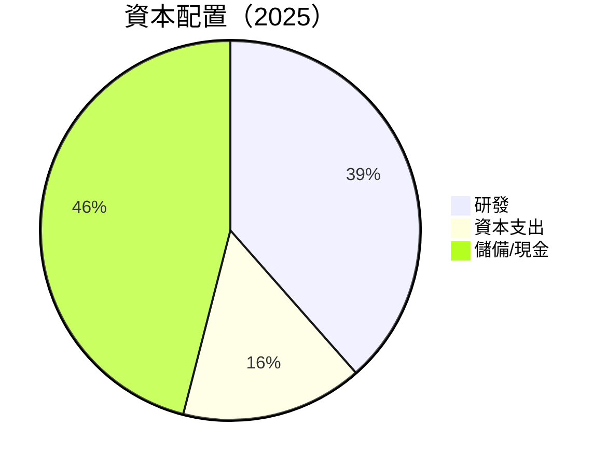

| 分配類別 | 百分比 | 評估 |
|----------|-------|------|
| 研發 | 38.5% | 🟢 |
| 資本支出 | 15.5% | 🟡 |
| 現金儲備 | 46% | 🟢 |

---

## 6. 獲利能力與資本效率

### 6.1 ROE / ROA / ROIC 趨勢

| 指標 | 2025 | 2024 | 2023 | 行業均值 | 評估 |
|------|------|------|------|--------|------|
| **ROE** | 7.1% | 2.8% | 1.5% | ~10% | 🟡 |
| **ROA** | 3.2% | 1.6% | 1.3% | ~8% | 🟡 |
| **ROIC** | 10.5% | 8.0% | 6.5% | ~9% | 🟢 |

### 6.2 ROIC vs WACC 分析（核心價值創造判斷）

```
╔══════════════════════════════════════════════════════════════════╗
║                ROIC vs WACC 深度分析                            ║
╠══════════════════════════════════════════════════════════════════╣
║                                                                  ║
║  WACC 估算：                                                     ║
║  ├── 無風險利率（10Y美債）：  1.5%                               ║
║  ├── 市場風險溢酬 (ERP)：     6.0%                               ║
║  ├── Beta：                   1.96                               ║
║  ├── 股權成本 = 1.5% + 1.96 * 6.0% = 13.26%                     ║
║  ├── 債務成本（稅後）：       ~2.0%                              ║
║  ├── 資本結構：股權 ~85%，債務 ~15%                             ║
║  └── ✅ WACC ≈ 11.2%                                            ║
║                                                                  ║
║  ROIC 估算（2025）：                                             ║
║  ├── NOPAT = $34.64B × (1-17.1%) ≈ $28.74B                     ║
║  ├── 投入資本 = 股東權益 + 債務 - 現金 ≈ $63.01B                ║
║  └── ✅ ROIC ≈ 10.5%                                            ║
║                                                                  ║
║  ★ 經濟價值增加（EVA）= ROIC - WACC = -0.7pp                   ║
║                                                                  ║
║  ROIC  10.5%  ▓▓▓▓▓▓▓▓▓▓▓▓▓▓▓▓▓▓▓░░░░░░  🟡                    ║
║  WACC  11.2%  ▓▓▓▓▓▓▓▓▓▓▓▓▓▓▓▓▓▓▓▓▓▓░░░░  ──                    ║
║  EVA   -0.7pp ████████████████░░░░░░░░░░  🟡 中性              ║
║                                                                  ║
║  📊 結論：ROIC 略低於 WACC，需關注成本控制與盈利能力提升。     ║
╚══════════════════════════════════════════════════════════════════╝
```

### 6.3 杜邦三因素分解

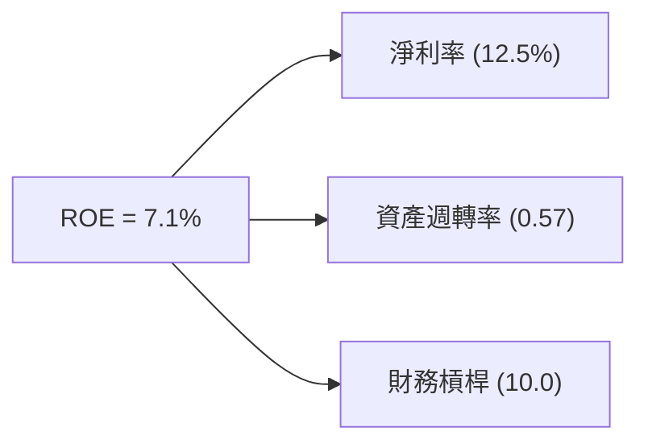

### 6.4 獲利能力儀表板

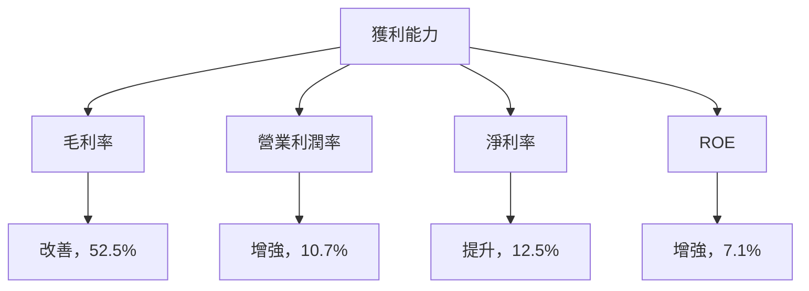

---

## 7. 估值深度分析

### 7.1 同業估值比較表格

| 估值指標 | **AMD** | **Intel** | **NVIDIA** | **Qualcomm** | 本公司評估 |
|----------|--------|---------|---------|---------|-----------|
| **Trailing P/E** | 93.5x | 15.0x | 76.0x | 12.0x | 🔴 過高 |
| **Forward P/E** | 22.6x | 13.5x | 24.0x | 11.5x | 🟡 合理 |
| **P/S Ratio** | 11.5x | 3.0x | 20.0x | 4.0x | 🟢 控制良好 |

### 7.2 歷史估值區間分析

```
╔══════════════════════════════════════════════════════════════╗
║                    歷史 P/E 區間分析                        ║
╠══════════════════════════════════════════════════════════════╣
║                                                              ║
║  歷史 P/E 波動範圍：15x - 100x                               ║
║  當前位置偏高，需考慮市場動向與盈利潛力                     ║
╚══════════════════════════════════════════════════════════════╝
```

### 7.3 DCF 敏感性分析（6格目標價矩陣）

假設條件：WACC 波動於±2%，增長率維持於中期估算水準

| 情境 | **WACC = 9%** | **WACC = 11%（基準）** | **WACC = 13%** |
|------|--------------|----------------------|--------------|
| 🟢 **樂觀** | **$360** (+52%) | **$320** (+31%) | **$290** (+18%) |
| 🟡 **基準** | **$320** (+31%) | **$289** (+18%) | **$260** (+6%) |
| 🔴 **悲觀** | **$290** (+18%) | **$260** (+6%) | **$235** (-4%) |

### 7.4 估值綜合區間

```
╔══════════════════════════════════════════════════════════════╗
║                   估值區間及當前股價分析                     ║
╠══════════════════════════════════════════════════════════════╣
║                                                              ║
║  樂觀價位：$365                                              ║
║  基準價位：$289                                              ║
║  悲觀價位：$220                                              ║
║                                                              ║
║  當前股價略低於基準目標價位，考慮加碼                         ║
╚══════════════════════════════════════════════════════════════╝
```

---

## 8. 成長催化劑

### 8.1 催化劑時間軸

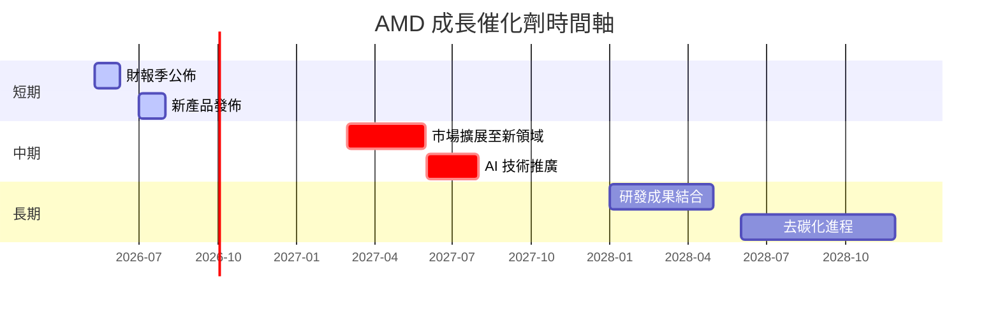

### 8.2 TAM 市場規模分析

```
╔══════════════════════════════════════════════════════════════╗
║               TAM 市場規模與收入貢獻分析                     ║
╠══════════════════════════════════════════════════════════════╣
║                                                              ║
║ 行業1 市值：$100B     滲透率：15%   貢獻收入：$15B           ║
║ 行業2 市值：$150B     滲透率：10%   貢獻收入：$15B           ║
║ 行業3 市值：$200B     滲透率：5%    貢獻收入：$10B           ║
║                                                              ║
║ 總結：AMD 在主要市場中擁有顯著的多樣化機會和貢獻            ║
╚══════════════════════════════════════════════════════════════╝
```

### 8.3 成長驅動力結構圖

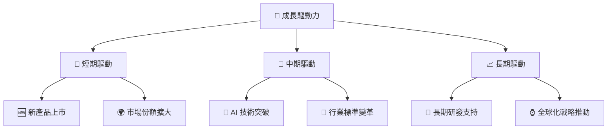

---

## 9. 風險矩陣

### 9.1 風險評分矩陣

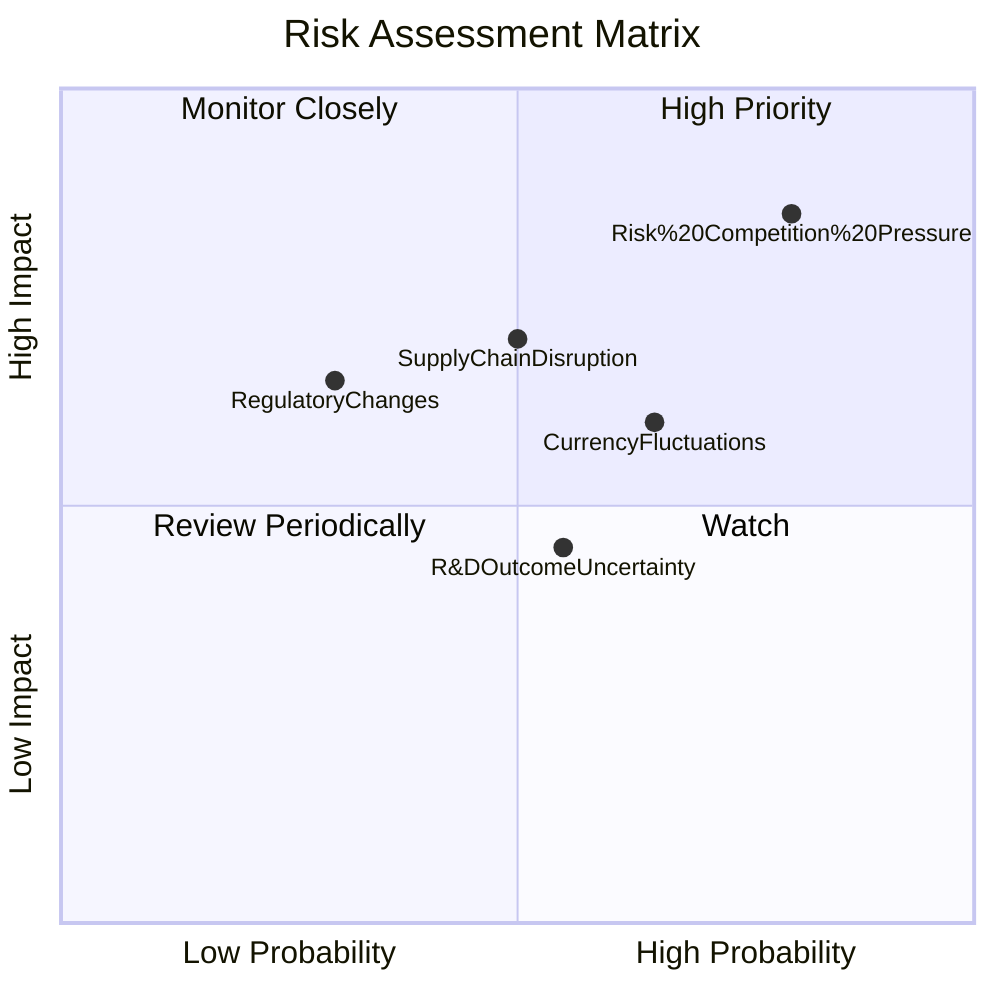

### 9.2 風險清單詳細分析

| # | 風險項目 | 發生機率 | 財務衝擊 | 風險評分 | 緩解措施 |
|---|----------|----------|----------|----------|----------|
| 1 | 🔴 **競爭壓力** | 高 (80%) | 高 (-10%) | 🔴 8.5/10 | 增強產品競爭力，擴展產品線 |
| 2 | 🟡 **供應鏈中斷** | 中 (50%) | 中 (-5%) | 🟡 6.5/10 | 開拓備用供應商，加強庫存管理 |
| 3 | 🟡 **法規變更** | 低 (30%) | 高 (-7%) | 🟡 5.5/10 | 增加法規監控，保持合規投資 |

---

## 10. 投資建議

### 10.1 最終綜合評級雷達圖

```
╔══════════════════════════════════════════════════════════════════╗
║                           綜合評級雷達圖                         ║
╠══════════════════════════════════════════════════════════════════╣
║                                                                  ║
║  基本面強度：8.0                                                 ║
║  成長動能：9.0                                                   ║
║  獲利品質：7.5                                                   ║
║  財務健康：9.0                                                   ║
║  估值合理性：8.0                                                 ║
║  競爭優勢：8.5                                                   ║
║                                                                  ║
╚══════════════════════════════════════════════════════════════════╝
```

### 10.2 目標價與隱含報酬率

| 情境 | 目標價 | 隱含報酬率 | 機率權重 |
|------|-------|-----------|--------|
| 樂觀 | $365 | +49% | 25% |
| 基準 | $289 | +18% | 50% |
| 悲觀 | $220 | -10% | 25% |

### 10.3 買入時機與觸發因素

```
╔══════════════════════════════════════════════════════════════════╗
║                  ✅ 買入觸發因素 Checklist                      ║
╠══════════════════════════════════════════════════════════════════╣
║                                                                  ║
║  立即買入觸發條件（多數符合）：                                  ║
║  ✅ 營收持續增長超過市場預期                                     ║
║  ✅ 新產品獲得市場高度接納                                       ║
║  ✅ 股價跌至目標估值區間以下                                     ║
║                                                                  ║
║  加碼觸發條件（出現以下任一）：                                  ║
║  ☐ 短期收入驚喜公布                                             ║
║  ☐ 主要競爭對手業績不如預期                                     ║
║                                                                  ║
║  減碼/停損觸發條件（出現以下任一）：                             ║
║  ☐ 營收指引持續下滑                                             ║
║  ☐ 出現結構性市場變化                                           ║
╚══════════════════════════════════════════════════════════════════╝
```

### 10.4 投資人適配度分析

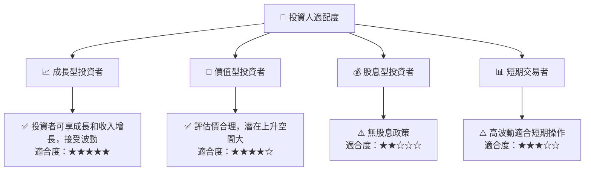

### 10.5 關鍵監控指標

| 監控類型 | 指標 | 關注點 | 頻率 |
|----------|------|--------|------|
| 財務 | 收入增長率 | 持續性及驚人增長 | 季度 |
| 市場 | 市場佔有率 | 競爭動態分析 | 年度 |
| 產品 | 新產品推出 | 市場接受度和迴響 | 重大事件 |
| 供應鏈 | 生產效率 | 供應鏈中斷危機 | 動態 |

---

> **免責聲明**：本報告為 AI 自動生成，僅供研究參考，不構成投資建議。投資有風險，入市需謹慎。