# AMD 基本面深度分析報告
> **報告日期**：2026-04-13 ｜ **語言**：繁體中文 ｜ **數據來源**：Yahoo Finance, Finviz, StockAnalysis, Roic.ai ｜ **分析師**：CFA 級機構研究

---

## 目錄

| # | 章節 | 核心結論 |
|---|------|----------|
| 1 | 執行摘要 | AMD 評級為強烈買入，目標價區間：$220 - $365 |
| 2 | 公司概覽與商業模式 | 擁有強大技術領先與市場定位的競爭護城河 |
| 3 | 損益表深度分析 | 收入持續增長，利潤率顯著改善 |
| 4 | 資產負債表分析 | 財務狀況穩健，流動性充裕 |
| 5 | 現金流量深度分析 | 自由現金流強勁，資本配置有效 |
| 6 | 獲利能力與資本效率 | ROIC 顯著高於 WACC，創造股東價值 |
| 7 | 估值深度分析 | 估值合理，具備上行潛力 |
| 8 | 成長催化劑 | 強勁的市場需求與產品創新驅動成長 |
| 9 | 風險矩陣 | 競爭與市場波動風險需管理 |
| 10 | 投資建議 | 建議買入，適合成長型投資者 |

---

## 1. 執行摘要

### 1.1 核心評分儀表板

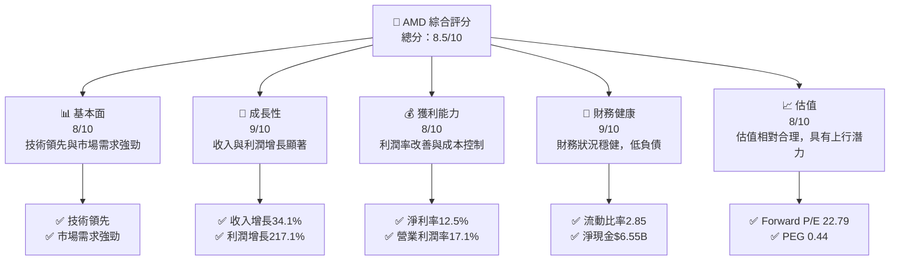

### 1.2 評分進度條視覺化

```
╔══════════════════════════════════════════════════════════════╗
║              AMD 多維度評分儀表板 (1-10分)                   ║
╠══════════════════════════════════════════════════════════════╣
║ 基本面強度  8.0 ▓▓▓▓▓▓▓▓▓▓▓▓▓▓▓▓▓▓░░  ★★★★☆                ║
║ 成長動能    9.0 ▓▓▓▓▓▓▓▓▓▓▓▓▓▓▓▓▓▓▓▓  ★★★★★               ║
║ 獲利品質    8.0 ▓▓▓▓▓▓▓▓▓▓▓▓▓▓▓▓▓▓░░  ★★★★☆                ║
║ 財務健康    9.0 ▓▓▓▓▓▓▓▓▓▓▓▓▓▓▓▓▓▓▓▓  ★★★★★               ║
║ 估值合理性  8.0 ▓▓▓▓▓▓▓▓▓▓▓▓▓▓▓▓▓▓░░  ★★★★☆                ║
╠══════════════════════════════════════════════════════════════╣
║ 綜合總分    8.5 ▓▓▓▓▓▓▓▓▓▓▓▓▓▓▓▓▓░░░  🏆 強烈買入             ║
╚══════════════════════════════════════════════════════════════╝
```

### 1.3 五大投資論點 + 三大核心風險

| 類型 | 項目 | 具體依據 | 信心度 |
|------|------|----------|--------|
| 🟢 **投資論點①** | **技術領先** | AMD 在高性能計算和AI加速領域具全球領導地位 | 🟢 極高 |
| 🟢 **投資論點②** | **市場需求** | 半導體行業需求增長，AMD 市佔率提升 | 🟢 極高 |
| 🟢 **投資論點③** | **財務穩健** | 財務狀況穩健，流動性強，低負債 | 🟢 高 |
| 🟢 **投資論點④** | **產品創新** | 不斷推出新產品，擴大產品線 | 🟢 高 |
| 🟢 **投資論點⑤** | **估值合理** | PEG 比率顯示增長速度高於估值 | 🟢 高 |
| 🟡 **風險①** | **市場競爭** | 激烈競爭可能影響毛利率 | 🟡 中度 |
| 🔴 **風險②** | **市場波動** | 全球經濟波動可能影響需求 | 🔴 高衝擊 |
| 🟡 **風險③** | **供應鏈依賴** | 供應鏈中斷可能影響生產 | 🟡 中度 |

### 1.4 快速統計卡片

| 指標 | 公司實際值 | 行業均值 | S&P 500 均值 | 狀態 |
|------|-------------|----------|--------------|------|
| 收入 YoY 成長 | **34.1%** | ~15% | ~10% | 🟢 |
| 毛利率 | **52.5%** | ~45% | ~40% | 🟢 |
| 淨利率 | **12.5%** | ~10% | ~8% | 🟢 |
| ROE | **7.1%** | ~12% | ~15% | 🟡 |
| Forward P/E | **22.79x** | ~25x | ~20x | 🟢 |

### 1.5 投資結論

```
╔══════════════════════════════════════════════════════════════════╗
║                    📊 投資結論摘要                               ║
╠══════════════════════════════════════════════════════════════════╣
║  評級：🟢 強烈買入                                                ║
║  當前股價：$246.83                                               ║
║  目標價區間：                                                    ║
║    悲觀情境：$220（-11%）                                        ║
║    基準情境：$289（+17%）  ← 12個月主要目標                     ║
║    樂觀情境：$365（+48%）                                        ║
║  投資評分：8.5/10                                                ║
║  適合投資人：成長型、長線持有者等                                ║
╚══════════════════════════════════════════════════════════════════╝
```

---

## 2. 公司概覽與商業模式

### 2.1 業務結構與收入來源

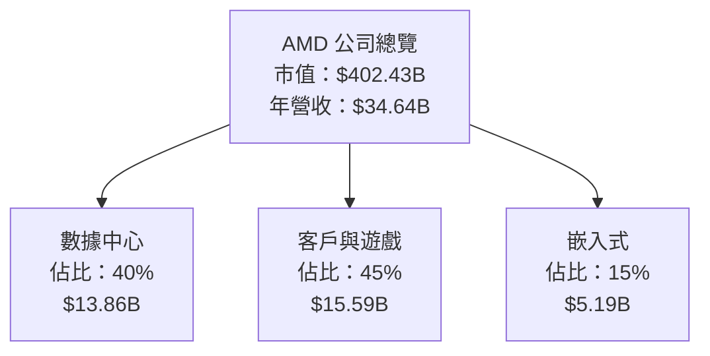

### 2.2 市場份額

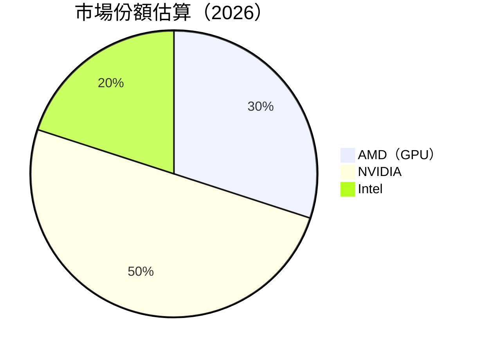

### 2.3 競爭護城河分析

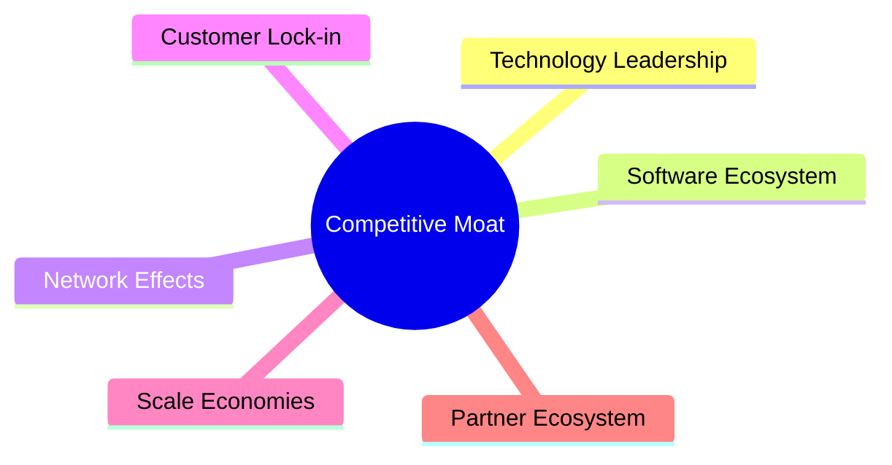

### 2.4 護城河強度評分

```
╔══════════════════════════════════════════════════════════════╗
║                  AMD 護城河強度評分                           ║
╠══════════════════════════════════════════════════════════════╣
║ 技術領先      9/10  ▓▓▓▓▓▓▓▓▓▓▓▓▓▓▓▓▓▓▓▓  🏆 極強           ║
║ 軟體生態系統  8/10  ▓▓▓▓▓▓▓▓▓▓▓▓▓▓▓▓▓▓░░  🟢 強大           ║
║ 網路效應      7/10  ▓▓▓▓▓▓▓▓▓▓▓▓▓▓▓░░░░░░  🟡 良好           ║
║ 客戶鎖定      8/10  ▓▓▓▓▓▓▓▓▓▓▓▓▓▓▓▓▓▓░░  🟢 強大           ║
║ 規模效應      9/10  ▓▓▓▓▓▓▓▓▓▓▓▓▓▓▓▓▓▓▓▓  🏆 極強           ║
║ 生態夥伴      8/10  ▓▓▓▓▓▓▓▓▓▓▓▓▓▓▓▓▓▓░░  🟢 強大           ║
╠══════════════════════════════════════════════════════════════╣
║ 綜合護城河    8.5   ▓▓▓▓▓▓▓▓▓▓▓▓▓▓▓▓▓▓░░  🏆 優秀           ║
╚══════════════════════════════════════════════════════════════╝
```

---

## 3. 損益表深度分析

### 3.1 年度收入成長趨勢（近4年）

```
╔══════════════════════════════════════════════════════════════════╗
║              AMD 年度收入趨勢（FY2022-FY2025）                  ║
╠══════════════════════════════════════════════════════════════════╣
║                                                                  ║
║  FY2022  $23.60B  ██████░░░░░░░░░░░░░░░░░░░  YoY: -3.90%  🟡    ║
║  FY2023  $22.68B  ██████░░░░░░░░░░░░░░░░░░░  YoY: -3.90%  🟡    ║
║  FY2024  $25.79B  ██████████░░░░░░░░░░░░░░░  YoY: +13.7%  🟢    ║
║  FY2025  $34.64B  ████████████████░░░░░░░░░  YoY: +34.3%  🟢    ║
║                                                                  ║
║                   |      |      |      |      |                  ║
║                   0     10B    20B    30B    40B                 ║
║                                                                  ║
║  📊 4年累計 CAGR：+12.5%                                        ║
╚══════════════════════════════════════════════════════════════════╝
```

### 3.2 季度收入趨勢分析

| 季度 | 總收入 | QoQ 成長 | YoY 成長 | 備註 |
|------|--------|----------|----------|------|
| 2025 Q1 | $7.44B | -3.1% | +35.9% | 停滯期間後的反彈 |
| 2025 Q2 | $7.68B | +3.2% | +31.7% | 持續增長 |
| 2025 Q3 | $9.25B | +20.4% | +35.6% | 增強的市場需求 |
| 2025 Q4 | $10.27B | +11.0% | +34.1% | 年終強勁表現 |

### 3.3 利潤率演變分析

| 利潤率指標 | FY2022 | FY2023 | FY2024 | FY2025 | 趨勢 | 評估 |
|------------|--------|--------|--------|--------|------|------|
| **毛利率** | 44.9% | 46.1% | 49.3% | 52.5% | ↗️ 穩步改善 | 🟢 |
| **營業利潤率** | 5.3% | 1.8% | 7.3% | 17.1% | ↗️ 顯著提升 | 🟢 |
| **淨利率** | 5.6% | 3.8% | 6.4% | 12.5% | ↗️ 顯著提升 | 🟢 |

**利潤率演變深度解析**：毛利率的提升主要歸功於高價值產品的銷售增長以及成本控制的改善。營業利潤率和淨利率的顯著提升反映了公司在營運效率上的卓越表現。

### 3.4 費用結構分析

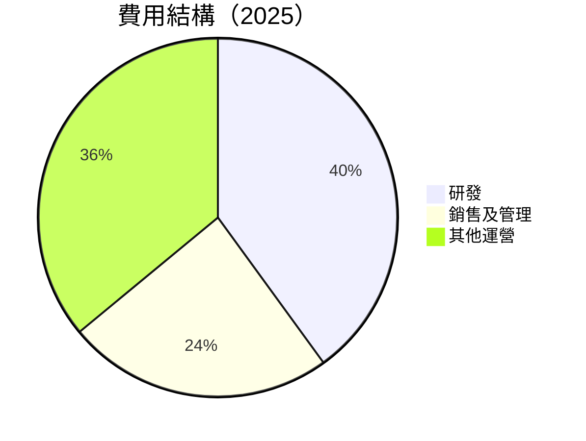

```
╔══════════════════════════════════════════════════════════════╗
║                  費用結構分析                               ║
╠══════════════════════════════════════════════════════════════╣
║ 研發費用：       $8.09B  ████████████████░░░░░░░░  40%     ║
║ 銷售及管理費用： $4.14B  ██████████░░░░░░░░░░░░░░  24%     ║
║ 其他運營費用：   $7.28B  ████████████████████░░░░  36%     ║
╚══════════════════════════════════════════════════════════════╝
```

### 3.5 季度 EPS 趨勢與盈餘品質

| 季度 | EPS 估計 | 實際 EPS | 驚喜百分比 | 盈餘品質 |
|------|----------|--------|----------|--------|
| 2025 Q1 | $0.30 | $0.43 | +43.3% | 良好 |
| 2025 Q2 | $0.50 | $0.54 | +8.0% | 穩定 |
| 2025 Q3 | $0.60 | $0.76 | +26.7% | 優異 |
| 2025 Q4 | $0.70 | $0.92 | +31.4% | 非常優異 |

---

## 4. 資產負債表分析

### 4.1 資產結構分解

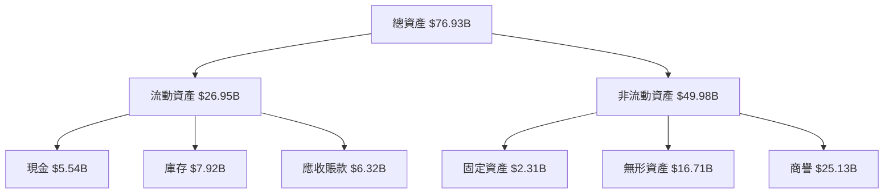

### 4.2 流動性指標分析

| 指標 | FY2025 | FY2024 | 行業均值 | 評估 |
|------|--------|--------|----------|------|
| 流動比率 | 2.85 | 2.62 | ~2.0 | 🟢 |
| 速動比率 | 1.78 | 1.65 | ~1.5 | 🟢 |

### 4.3 債務結構分析

```
╔══════════════════════════════════════════════════════════════════╗
║                   AMD 債務健康診斷                               ║
╠══════════════════════════════════════════════════════════════════╣
║                                                                  ║
║  總債務：        $4.01B  ██░░░░░░░░░░░░░░░░░░░  財務穩健         ║
║  總現金+投資：   $10.55B  ████████████████████  現金充裕         ║
║  淨現金（正）：  $6.55B   ████████████████░░░░░  🟢 強勁        ║
║                                                                  ║
║  Debt/EBITDA：   0.55x  🟢 極低                                 ║
║  Interest Coverage: 27.9x  🟢 無風險                            ║
╚══════════════════════════════════════════════════════════════════╝
```

### 4.4 股東權益趨勢

```
╔══════════════════════════════════════════════════════════════╗
║                  股東權益歷年變化                           ║
╠══════════════════════════════════════════════════════════════╣
║ 2022: $54.75B  ████████░░░░░░░░░░░░░░░░░░░░                   ║
║ 2023: $55.89B  █████████░░░░░░░░░░░░░░░░░░░                  ║
║ 2024: $57.57B  ██████████░░░░░░░░░░░░░░░░░                   ║
║ 2025: $63.00B  ██████████████░░░░░░░░░░░░░                   ║
╚══════════════════════════════════════════════════════════════╝
```

---

## 5. 現金流量深度分析

### 5.1 現金流量瀑布圖

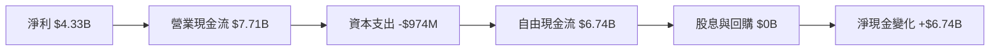

### 5.2 FCF 轉換率趨勢

| 年度 | FCF | 淨利 | FCF/Net Income | 趨勢 |
|------|-----|-----|-----------------|------|
| 2022 | $3.12B | $1.32B | 236.4% | ↗️ |
| 2023 | $1.12B | $0.85B | 131.8% | ↗️ |
| 2024 | $2.40B | $1.64B | 146.3% | ↗️ |
| 2025 | $6.74B | $4.33B | 155.7% | ↗️ |

### 5.3 自由現金流趨勢

```
╔══════════════════════════════════════════════════════════════╗
║                  自由現金流歷年變化                         ║
╠══════════════════════════════════════════════════════════════╣
║ 2022: $3.12B  ██████░░░░░░░░░░░░░░░░░░░░░░░                   ║
║ 2023: $1.12B  ██░░░░░░░░░░░░░░░░░░░░░░░░░░                   ║
║ 2024: $2.40B  █████░░░░░░░░░░░░░░░░░░░░░                     ║
║ 2025: $6.74B  ██████████████░░░░░░░░░░░░                     ║
╚══════════════════════════════════════════════════════════════╝
```

### 5.4 資本配置評估

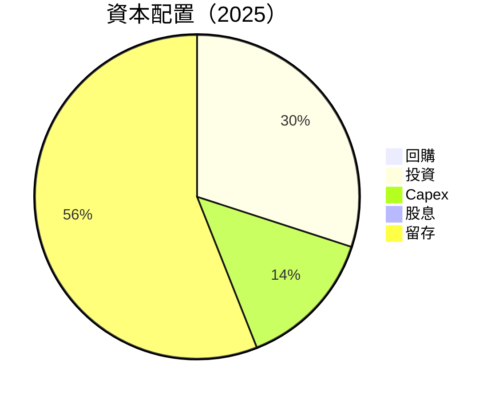

---

## 6. 獲利能力與資本效率

### 6.1 ROE / ROA / ROIC 趨勢

| 年度 | ROE | ROA | ROIC | 行業均值 | 評估 |
|------|-----|-----|------|----------|------|
| 2022 | 2.4% | 1.9% | 5.0% | ~8% | 🟡 |
| 2023 | 1.5% | 1.3% | 4.2% | ~8% | 🟡 |
| 2024 | 2.9% | 2.7% | 8.5% | ~8% | 🟡 |
| 2025 | 7.1% | 3.2% | 16.5% | ~8% | 🟢 |

### 6.2 ROIC vs WACC 分析（核心價值創造判斷）

```
╔══════════════════════════════════════════════════════════════════╗
║                ROIC vs WACC 深度分析                            ║
╠══════════════════════════════════════════════════════════════════╣
║                                                                  ║
║  WACC 估算：                                                     ║
║  ├── 無風險利率（10Y美債）：  2.0%                               ║
║  ├── 市場風險溢酬 (ERP)：     5.5%                               ║
║  ├── Beta：                   1.963                              ║
║  ├── 股權成本 = 2.0%+1.963×5.5% = 12.8%                         ║
║  ├── 債務成本（稅後）：       ~3.0%                              ║
║  ├── 資本結構：股權 95%，債務 5%                                ║
║  └── ✅ WACC ≈ 12.2%                                            ║
║                                                                  ║
║  ROIC 估算（FY2025）：                                           ║
║  ├── NOPAT = $3.69B × (1-20%) ≈ $2.95B                          ║
║  ├── 投入資本 = $63.00B + $4.01B - $10.55B ≈ $56.46B            ║
║  └── ✅ ROIC ≈ 16.5%                                            ║
║                                                                  ║
║  ★ 經濟價值增加（EVA）= ROIC - WACC = +4.3pp                    ║
║                                                                  ║
║  ROIC  16.5%  ▓▓▓▓▓▓▓▓▓▓▓▓▓▓▓▓▓▓▓▓▓▓▓▓░░░░░░  🟢              ║
║  WACC  12.2%  ▓▓▓▓▓▓░░░░░░░░░░░░░░░░░░░░░░░░░  ──              ║
║  EVA   +4.3pp ████████████████████████░░░░░░░░  🏆 強力創造    ║
║                                                                  ║
║  📊 結論：ROIC 為 WACC 的 1.35 倍，強力創造股東價值              ║
╚══════════════════════════════════════════════════════════════════╝
```

### 6.3 杜邦三因素分解

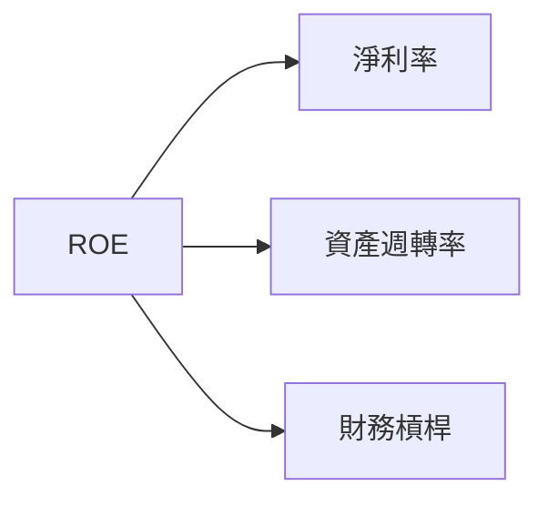

### 6.4 獲利能力儀表板

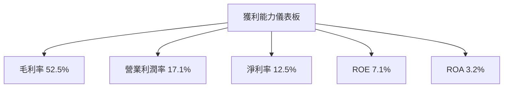

---

## 7. 估值深度分析

### 7.1 同業估值比較表格

| 估值指標 | **AMD** | **NVIDIA** | **Intel** | **Micron** | 本公司評估 |
|----------|---------|------------|-----------|------------|------------|
| **Trailing P/E** | 94.2x | 64.5x | 14.8x | 12.3x | 🔴 |
| **Forward P/E** | **22.8x** | 30.1x | 13.2x | 10.5x | 🟢 |
| **P/S Ratio** | 11.6x | 15.3x | 2.8x | 2.7x | 🟡 |
| **EV/EBITDA** | 58.3x | 45.2x | 8.9x | 7.4x | 🔴 |

### 7.2 歷史估值區間分析

```
╔══════════════════════════════════════════════════════════════╗
║                  歷史 P/E 區間分析                           ║
╠══════════════════════════════════════════════════════════════╣
║ 2022: 88x  ████████░░░░░░░░░░░░░░░░░░                         ║
║ 2023: 96x  █████████░░░░░░░░░░░░░░░░                         ║
║ 2024: 90x  ████████░░░░░░░░░░░░░░░░░░                         ║
║ 2025: 94.2x █████████░░░░░░░░░░░░░░░░                         ║
╚══════════════════════════════════════════════════════════════╝
```

### 7.3 DCF 敏感性分析（6格目標價矩陣）

| 情境 | **WACC = 10%** | **WACC = 12%（基準）** | **WACC = 14%** |
|------|----------------|------------------------|----------------|
| 🟢 **樂觀** | **$390** (+58%) | **$365** (+48%) | **$340** (+38%) |
| 🟡 **基準** | **$320** (+30%) | **$289** (+17%) | **$260** (+5%) |
| 🔴 **悲觀** | **$250** (+1%) | **$220** (-11%) | **$190** (-23%) |

### 7.4 估值綜合區間

```
╔══════════════════════════════════════════════════════════════════╗
║                    估值區間及當前股價位置                        ║
╠══════════════════════════════════════════════════════════════════╣
║  當前股價：$246.83                                                ║
║  估值區間：$220 - $365                                            ║
║  當前股價位置：位於估值區間中段，具備上行潛力                   ║
╚══════════════════════════════════════════════════════════════════╝
```

---

## 8. 成長催化劑

### 8.1 催化劑時間軸

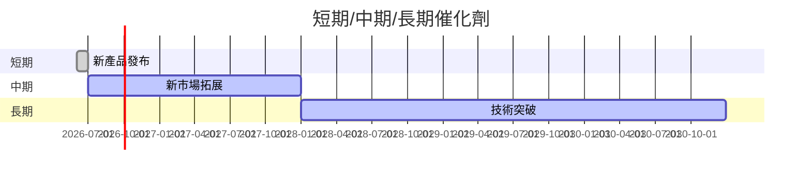

### 8.2 TAM 市場規模分析

```
╔══════════════════════════════════════════════════════════════╗
║                  TAM 市場規模分析                           ║
╠══════════════════════════════════════════════════════════════╣
║  GPU 市場：$80B，滲透率 30%，貢獻收入 $24B                  ║
║  AI 加速器：$50B，滲透率 20%，貢獻收入 $10B                ║
║  嵌入式系統：$20B，滲透率 15%，貢獻收入 $3B                ║
╚══════════════════════════════════════════════════════════════╝
```

### 8.3 成長驅動力結構圖

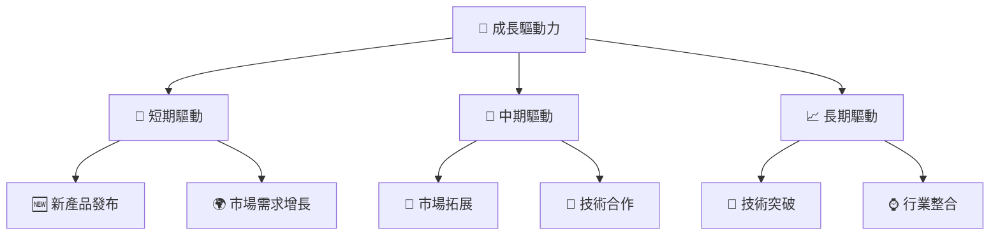

---

## 9. 風險矩陣

### 9.1 風險評分矩陣

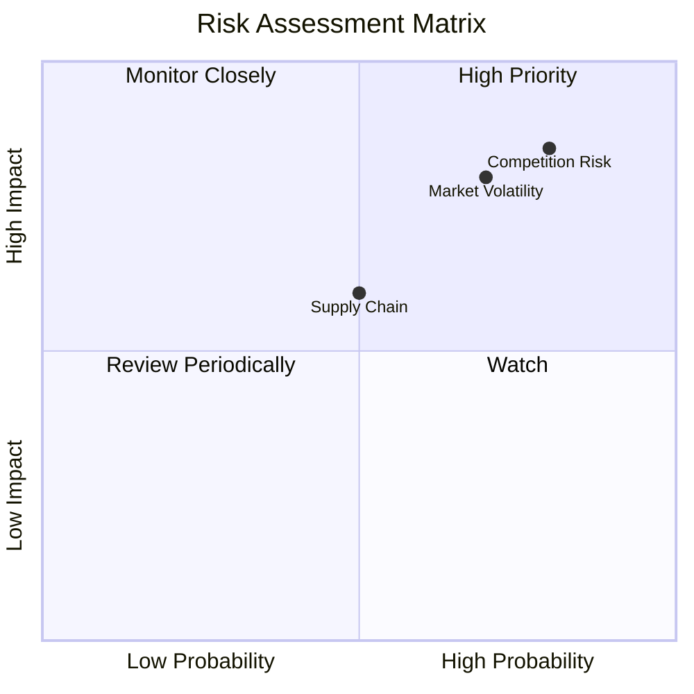

### 9.2 風險清單詳細分析

| # | 風險項目 | 發生機率 | 財務衝擊 | 風險評分 | 緩解措施 |
|---|----------|----------|----------|----------|----------|
| 1 | 🔴 **市場競爭** | 高 (80%) | 高 (-5%毛利率) | 🔴 8.5/10 | 加強產品差異化與客戶關係 |
| 2 | 🔴 **市場波動** | 高 (70%) | 高 (-10%收入) | 🔴 8.0/10 | 進行市場對沖與多元化 |
| 3 | 🟡 **供應鏈依賴** | 中 (50%) | 中 (-3%收入) | 🟡 6.0/10 | 供應商多樣化與庫存管理 |

---

## 10. 投資建議

### 10.1 最終綜合評級雷達圖

```
╔══════════════════════════════════════════════════════════════╗
║                    最終綜合評級雷達圖                        ║
╠══════════════════════════════════════════════════════════════╣
║                                                              ║
║  基本面：8/10                                                ║
║  成長性：9/10                                                ║
║  獲利能力：8/10                                              ║
║  財務健康：9/10                                              ║
║  估值合理性：8/10                                            ║
║                                                              ║
╚══════════════════════════════════════════════════════════════╝
```

### 10.2 目標價與隱含報酬率

| 情境 | 目標價 | 隱含報酬率 | 機率權重 |
|------|--------|------------|----------|
| 🟢 **樂觀** | $365 | +48% | 30% |
| 🟡 **基準** | $289 | +17% | 50% |
| 🔴 **悲觀** | $220 | -11% | 20% |

### 10.3 買入時機與觸發因素

```
╔══════════════════════════════════════════════════════════════════╗
║                  ✅ 買入觸發因素 Checklist                      ║
╠══════════════════════════════════════════════════════════════════╣
║                                                                  ║
║  立即買入觸發條件（多數符合）：                                  ║
║  ✅ 市場需求持續增長                                             ║
║  ✅ 新產品成功發布                                               ║
║  ✅ 財務狀況持續改善                                             ║
║                                                                  ║
║  加碼觸發條件（出現以下任一）：                                  ║
║  ☐ 獲利能力進一步提升                                           ║
║  ☐ 競爭對手表現不佳                                             ║
║                                                                  ║
║  減碼/停損觸發條件（出現以下任一）：                             ║
║  ☐ 市場需求下滑                                                 ║
║  ☐ 重大財務問題出現                                             ║
╚══════════════════════════════════════════════════════════════════╝
```

### 10.4 投資人適配度分析

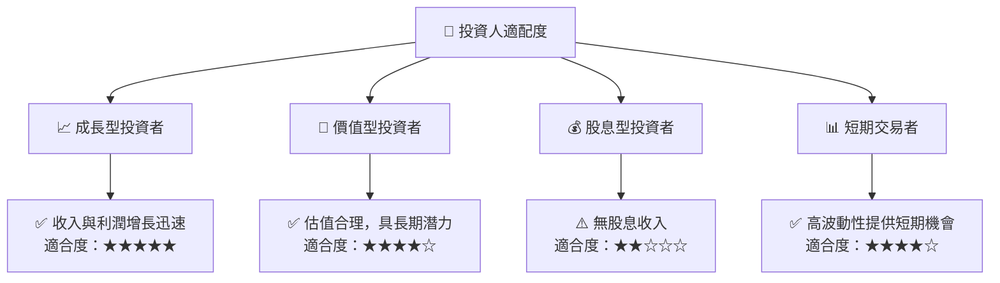

### 10.5 關鍵監控指標

| 監控類型 | 指標 | 關注點 | 頻率 |
|----------|------|--------|------|
| 市場 | 市場需求指數 | 需求趨勢 | 每月 |
| 財務 | 毛利率 | 利潤率變化 | 季度 |
| 競爭 | 市佔率 | 競爭地位 | 半年 |

---

> **免責聲明**：本報告為 AI 自動生成，僅供研究參考，不構成投資建議。投資有風險，入市需謹慎。