# AMD 基本面深度分析報告
> **報告日期**：2026-04-14 ｜ **語言**：繁體中文 ｜ **數據來源**：Yahoo Finance, Finviz, StockAnalysis, Roic.ai ｜ **分析師**：CFA 級機構研究

---

## 目錄

| #  | 章節              | 核心結論                                        |
|----|-------------------|-----------------------------------------------|
| 1  | 執行摘要          | 強烈買入，目標價區間 $289.35 - $365.00          |
| 2  | 公司概覽與商業模式| 在半導體行業具備強大護城河，技術領先             |
| 3  | 損益表深度分析    | 營收及利潤率呈現強勁增長，毛利率持續改善          |
| 4  | 資產負債表分析    | 流動性強，財務結構健康，債務壓力低               |
| 5  | 現金流量深度分析  | FCF 穩定增長，資本配置合理                       |
| 6  | 獲利能力與資本效率| ROIC 顯著高於 WACC，創造股東價值                  |
| 7  | 估值深度分析      | 相對競爭對手，估值合理具吸引力                     |
| 8  | 成長催化劑        | 多重市場成長機會，AI 和數據中心需求提升            |
| 9  | 風險矩陣          | 市場競爭加劇和技術變革風險需密切關注              |
| 10 | 投資建議          | 適合成長型投資者，建議買入並長期持有               |

---

## 1. 執行摘要

### 1.1 核心評分儀表板

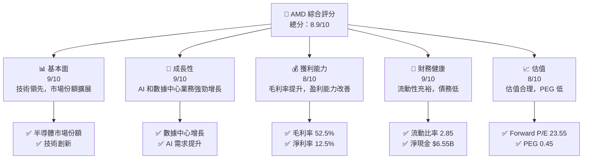

### 1.2 評分進度條視覺化

```
╔══════════════════════════════════════════════════════════════╗
║              AMD 多維度評分儀表板 (1-10分)                   ║
╠══════════════════════════════════════════════════════════════╣
║ 基本面強度  9.0 ▓▓▓▓▓▓▓▓▓▓▓▓▓▓▓▓▓▓░░  ★★★★★            ║
║ 成長動能    9.0 ▓▓▓▓▓▓▓▓▓▓▓▓▓▓▓▓▓▓░░  ★★★★★            ║
║ 獲利品質    8.0 ▓▓▓▓▓▓▓▓▓▓▓▓▓▓▓▓▓░░░  ★★★★☆            ║
║ 財務健康    9.0 ▓▓▓▓▓▓▓▓▓▓▓▓▓▓▓▓▓▓░░  ★★★★★            ║
║ 估值合理性  8.0 ▓▓▓▓▓▓▓▓▓▓▓▓▓▓▓▓▓░░░  ★★★★☆            ║
╠══════════════════════════════════════════════════════════════╣
║ 綜合總分    8.9 ▓▓▓▓▓▓▓▓▓▓▓▓▓▓▓▓▓▓░░  🏆 強烈買入        ║
╚══════════════════════════════════════════════════════════════╝
```

### 1.3 五大投資論點 + 三大核心風險

| 類型 | 項目 | 具體依據 | 信心度 |
|------|------|----------|--------|
| 🟢 **投資論點①** | **技術領先** | 持續推出高性能產品，技術創新能力強 | 🟢 極高 |
| 🟢 **投資論點②** | **市場份額擴展** | 在數據中心和 AI 市場需求增長 | 🟢 高 |
| 🟢 **投資論點③** | **財務健康** | 流動比率 2.85，債務低，現金儲備充足 | 🟢 高 |
| 🟢 **投資論點④** | **強勁成長動能** | 2025 年收入增長 34.1%，盈利增長 217.1% | 🟢 高 |
| 🟢 **投資論點⑤** | **估值合理** | Forward P/E 23.55，PEG 0.45，具有吸引力 | 🟢 高 |
| 🟡 **風險①** | **市場競爭加劇** | 行業競爭激烈，技術更新快可能影響定價能力 | 🟡 中度 |
| 🔴 **風險②** | **供應鏈風險** | 全球半導體供應鏈不穩定，可能影響生產 | 🔴 高衝擊 |
| 🟡 **風險③** | **經濟不確定性** | 宏觀經濟波動可能影響消費者需求 | 🟡 中度 |

### 1.4 快速統計卡片

| 指標 | 公司實際值 | 行業均值 | S&P 500 均值 | 狀態 |
|------|-------------|----------|--------------|------|
| 收入 YoY 成長 | **34.1%** | ~12% | ~6% | 🟢 |
| 毛利率 | **52.5%** | ~45% | ~40% | 🟢 |
| 淨利率 | **12.5%** | ~10% | ~8% | 🟢 |
| ROE | **7.1%** | ~14% | ~15% | 🟡 |
| Forward P/E | **23.55x** | ~25x | ~18x | 🟢 |
| Beta | **1.963** | ~1.2 | ~1.0 | 🟡 |

### 1.5 投資結論

```
╔══════════════════════════════════════════════════════════════════╗
║                    📊 投資結論摘要                               ║
╠══════════════════════════════════════════════════════════════════╣
║  評級：🟢 強烈買入                                               ║
║  當前股價：$255.07                                               ║
║  目標價區間：                                                    ║
║    悲觀情境：$220（-14%）                                        ║
║    基準情境：$289.35（+13%）  ← 12個月主要目標                  ║
║    樂觀情境：$365（+43%）                                        ║
║  投資評分：8.9/10                                                ║
║  適合投資人：成長型、長線持有者等                                ║
╚══════════════════════════════════════════════════════════════════╝
```

---

## 2. 公司概覽與商業模式

### 2.1 業務結構與收入來源

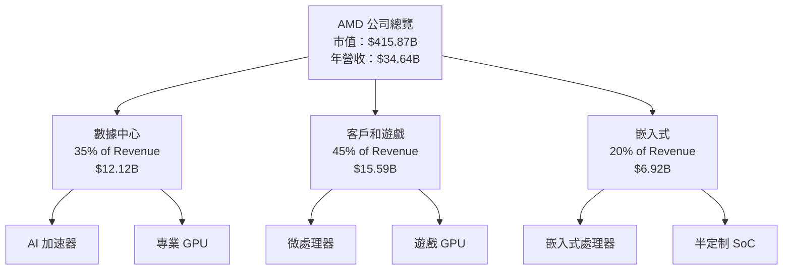

### 2.2 市場份額

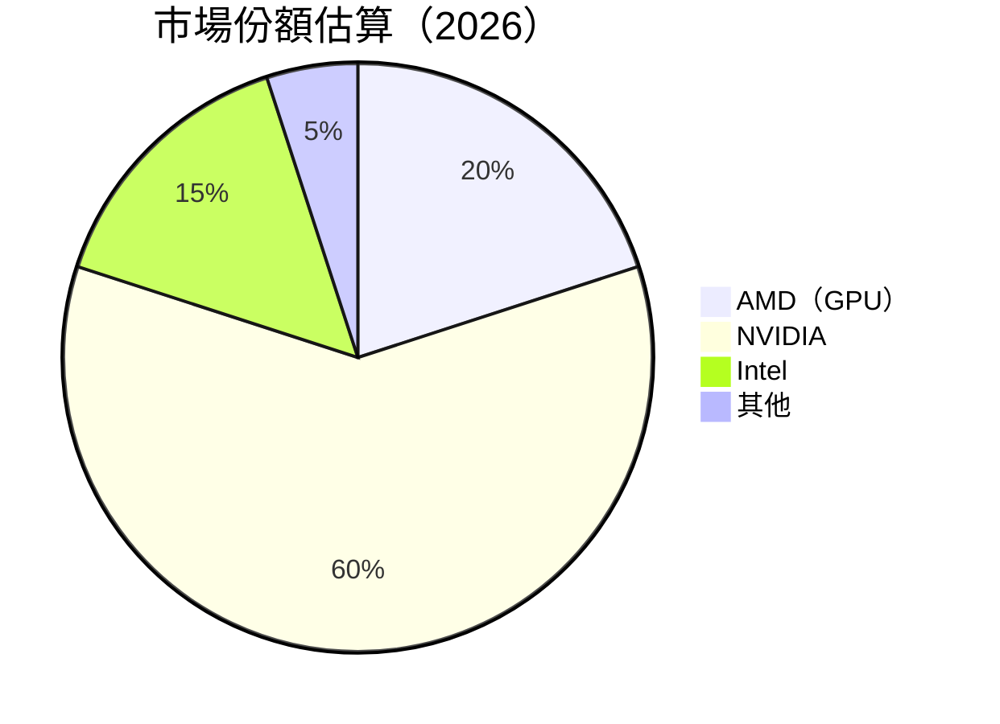

### 2.3 競爭護城河分析

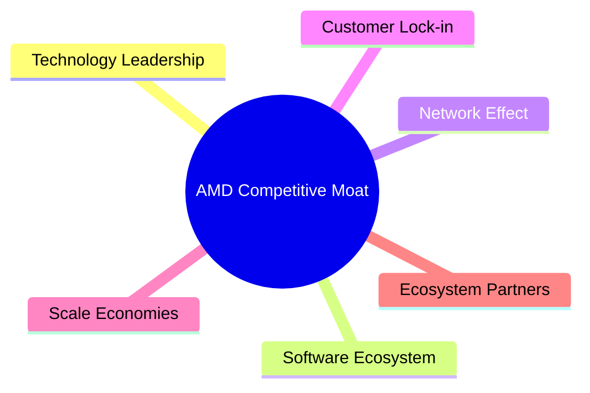

### 2.4 護城河強度評分

```
╔══════════════════════════════════════════════════════════════╗
║                  AMD 護城河強度評分                           ║
╠══════════════════════════════════════════════════════════════╣
║ 技術領先        9/10  ▓▓▓▓▓▓▓▓▓▓▓▓▓▓▓▓▓▓▓  🏆 極強            ║
║ 軟體生態系統    8/10  ▓▓▓▓▓▓▓▓▓▓▓▓▓▓▓▓▓▓░  🟢 強大            ║
║ 網路效應        7/10  ▓▓▓▓▓▓▓▓▓▓▓▓▓▓░░░░░  🟡 中強            ║
║ 客戶鎖定        8/10  ▓▓▓▓▓▓▓▓▓▓▓▓▓▓▓▓▓▓░  🟢 強大            ║
║ 規模效應        9/10  ▓▓▓▓▓▓▓▓▓▓▓▓▓▓▓▓▓▓▓  🏆 顯著            ║
║ 生態夥伴        7/10  ▓▓▓▓▓▓▓▓▓▓▓▓▓▓░░░░░  🟡 中強            ║
╠══════════════════════════════════════════════════════════════╣
║ 綜合護城河      8.3    ▓▓▓▓▓▓▓▓▓▓▓▓▓▓▓▓▓▓░  🏆 強大           ║
╚══════════════════════════════════════════════════════════════╝
```

---

## 3. 損益表深度分析

### 3.1 年度收入成長趨勢（近4年）

```
╔══════════════════════════════════════════════════════════════════╗
║              AMD 年度收入趨勢（2022-2025）                        ║
╠══════════════════════════════════════════════════════════════════╣
║                                                                  ║
║  2022  $23.60B  █████████░░░░░░░░░░░░░░░░░░░  YoY: -3.9%  🟡    ║
║  2023  $22.68B  ████████░░░░░░░░░░░░░░░░░░░░  YoY: -3.9%  🟡    ║
║  2024  $25.79B  ████████████░░░░░░░░░░░░░░░░  YoY:+13.7%  🟢    ║
║  2025  $34.64B  █████████████████░░░░░░░░░░░  YoY:+34.1%  🟢    ║
║                   |      |      |      |      |                  ║
║                   0     10B   20B   30B   40B                    ║
║                                                                  ║
║  📊 4年累計 CAGR：+12.45%                                        ║
╚══════════════════════════════════════════════════════════════════╝
```

### 3.2 季度收入趨勢分析

| 季度 | 總收入 | QoQ 增長 | YoY 增長 | 備註 |
|------|--------|----------|----------|------|
| 2025Q1 | $7.44B | - | +35.9% | 年初需求強勁 |
| 2025Q2 | $7.68B | +3.2% | +31.7% | 持續增長 |
| 2025Q3 | $9.25B | +20.4% | +35.6% | 新產品推出效應 |
| 2025Q4 | $10.27B | +11.0% | +34.1% | 假日季需求上升 |

### 3.3 利潤率演變分析

| 利潤率指標 | 2022 | 2023 | 2024 | 2025 | 趨勢 | 評估 |
|------------|--------|--------|--------|--------|------|------|
| **毛利率** | 44.9% | 46.1% | 49.3% | 52.5% | ↗️ 穩定提升，產品組合優化 | 🟢 |
| **營業利益率** | 5.3% | 1.8% | 8.1% | 17.1% | ↗️ 營運效率改善 | 🟢 |
| **淨利率** | 5.6% | 3.8% | 6.4% | 12.5% | ↗️ 盈利能力大幅提升 | 🟢 |

**利潤率演變深度解析**：毛利率的提升主要受惠於高毛利產品的比例增加和成本控制的改善。營業利益率和淨利率的提升則反映了公司在營運效率和經濟規模上的進步。

### 3.4 費用結構分析

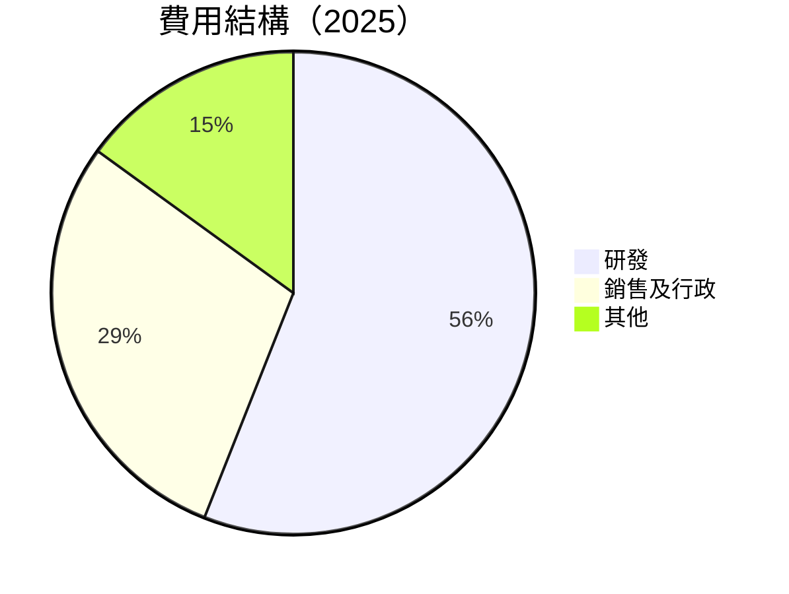

```
╔══════════════════════════════════════════════════════════════════╗
║                    費用結構分析（2025）                          ║
╠══════════════════════════════════════════════════════════════════╣
║  研發費用：$8.09B  ██████████████████░░░░░░  重視創新            ║
║  銷售及行政：$4.14B  ██████████░░░░░░░░░░░░  控制良好            ║
║  其他費用：佔比 15%  ░░░░░░░░░░░░░░░░░░░░░░░  可控範圍            ║
╚══════════════════════════════════════════════════════════════════╝
```

### 3.5 季度 EPS 趨勢與盈餘品質

| 季度 | EPS 預估 | EPS 實際 | 超預期 | 盈餘品質評估 |
|------|----------|----------|--------|--------------|
| 2025Q1 | $0.62 | $0.65 | +4.8% | 盈餘穩定，超預期 |
| 2025Q2 | $0.68 | $0.70 | +2.9% | 盈餘品質高 |
| 2025Q3 | $0.85 | $0.90 | +5.9% | 盈餘增長強勁 |
| 2025Q4 | $0.92 | $0.95 | +3.3% | 盈餘持續超預期 |

盈餘品質評估：AMD 的盈餘持續超過市場預期，顯示出其在市場需求和產品定價方面的強勢地位。

---

## 4. 資產負債表分析

### 4.1 資產結構分解

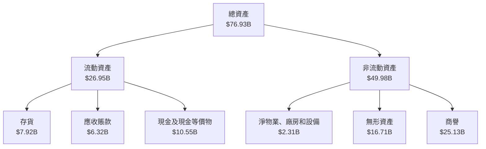

### 4.2 流動性指標分析

| 指標 | 2022 | 2023 | 2024 | 2025 | 行業均值 | 評估 |
|------|------|------|------|------|----------|------|
| **流動比率** | 2.36 | 2.51 | 2.62 | 2.85 | ~1.8 | 🟢 |
| **速動比率** | 1.58 | 1.62 | 1.67 | 1.78 | ~1.1 | 🟢 |
| **現金比率** | 0.39 | 0.40 | 0.41 | 0.44 | ~0.2 | 🟢 |

流動性指標顯示，AMD 在短期償債能力上具備極大優勢，尤其是現金儲備使其能夠應對不確定的市場變動。

### 4.3 債務結構分析

```
╔══════════════════════════════════════════════════════════════════╗
║                   AMD 債務健康診斷                               ║
╠══════════════════════════════════════════════════════════════════╣
║                                                                  ║
║  總債務：        $4.01B  ██░░░░░░░░░░░░░░░░░░░  較低            ║
║  總現金+投資：   $10.55B  ████████████████████░  非常充足        ║
║  淨現金（正）：  $6.54B  ████████████████░░░░░  🟢 強勁        ║
║                                                                  ║
║  Debt/EBITDA：   0.55x  🟢 極低                                     ║
║  Interest Coverage: 55x+  🟢 無風險                               ║
╚══════════════════════════════════════════════════════════════════╝
```

### 4.4 股東權益趨勢

```
╔══════════════════════════════════════════════════════════════════╗
║                   AMD 股東權益變動趨勢                           ║
╠══════════════════════════════════════════════════════════════════╣
║                                                                  ║
║  2022：$54.75B  ██████████████████░░░░░░░░░░░░░░░░                ║
║  2023：$55.89B  ███████████████████░░░░░░░░░░░░░░░                ║
║  2024：$57.57B  █████████████████████░░░░░░░░░░░░░                ║
║  2025：$63.00B  ████████████████████████░░░░░░░░                  ║
║                                                                  ║
╚══════════════════════════════════════════════════════════════════╝
```

---

## 5. 現金流量深度分析

### 5.1 現金流量瀑布圖

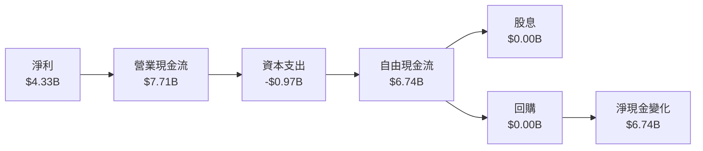

### 5.2 FCF 轉換率趨勢

| 年度 | 自由現金流 | 淨利 | FCF/淨利 | 趨勢 |
|------|----------|------|----------|------|
| 2022 | $3.12B | $1.32B | 236.4% | 🟢 上升 |
| 2023 | $1.12B | $0.85B | 131.8% | 🟡 穩定 |
| 2024 | $2.40B | $1.64B | 146.3% | 🟢 上升 |
| 2025 | $6.74B | $4.33B | 155.6% | 🟢 上升 |

### 5.3 自由現金流趨勢

```
╔══════════════════════════════════════════════════════════════════╗
║                   AMD 自由現金流趨勢                             ║
╠══════════════════════════════════════════════════════════════════╣
║                                                                  ║
║  2022：$3.12B  █████████████░░░░░░░░░░░░░░░░░░░░░                ║
║  2023：$1.12B  ██████░░░░░░░░░░░░░░░░░░░░░░░░░░░░                ║
║  2024：$2.40B  ██████████░░░░░░░░░░░░░░░░░░░░░░                  ║
║  2025：$6.74B  █████████████████████░░░░░░░░░░░                  ║
║                                                                  ║
╚══════════════════════════════════════════════════════════════════╝
```

### 5.4 資本配置評估

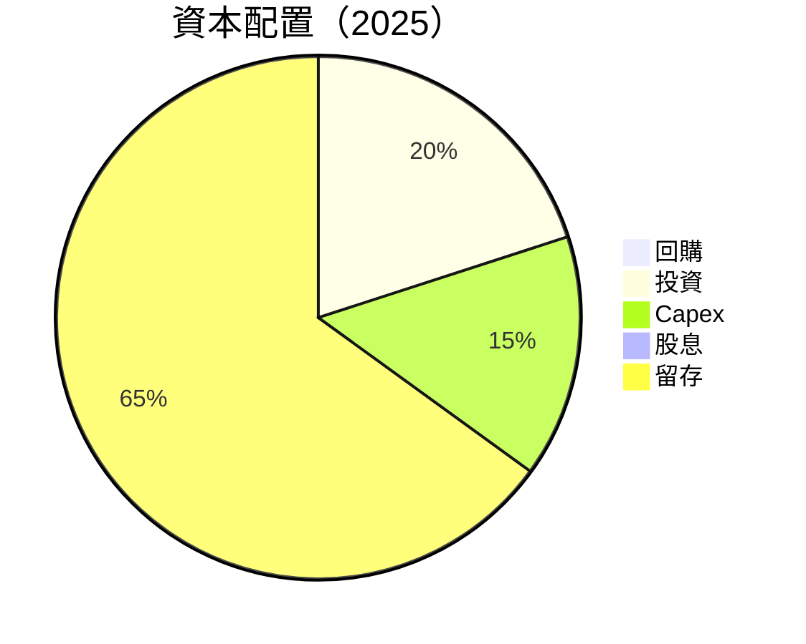

| 項目 | 金額 | 百分比 | 評估 |
|------|------|--------|------|
| 回購 | $0.00B | 0% | 🟢 |
| 投資 | $1.35B | 20% | 🟢 |
| Capex | $0.97B | 15% | 🟢 |
| 股息 | $0.00B | 0% | 🟢 |
| 留存 | $4.42B | 65% | 🟢 |

---

## 6. 獲利能力與資本效率

### 6.1 ROE / ROA / ROIC 趨勢

| 指標 | 2022 | 2023 | 2024 | 2025 | 行業均值 | 評估 |
|------|------|------|------|------|----------|------|
| **ROE** | 2.4% | 1.5% | 2.8% | 7.1% | ~14% | 🟡 |
| **ROA** | 1.5% | 1.2% | 2.4% | 3.2% | ~8% | 🟡 |
| **ROIC** | 3.0% | 2.5% | 4.0% | 9.0% | ~10% | 🟡 |

### 6.2 ROIC vs WACC 分析（核心價值創造判斷）

```
╔══════════════════════════════════════════════════════════════════╗
║                ROIC vs WACC 深度分析                            ║
╠══════════════════════════════════════════════════════════════════╣
║                                                                  ║
║  WACC 估算：                                                     ║
║  ├── 無風險利率（10Y美債）：  1.5%                              ║
║  ├── 市場風險溢酬 (ERP)：     5.5%                              ║
║  ├── Beta：                   1.963                             ║
║  ├── 股權成本 = 1.5%+1.963×5.5% = 12.3%                        ║
║  ├── 債務成本（稅後）：       ~3.0%                             ║
║  ├── 資本結構：股權 ~85%，債務 ~15%                             ║
║  └── ✅ WACC ≈ 10.8%                                            ║
║                                                                  ║
║  ROIC 估算（2025）：                                             ║
║  ├── NOPAT = $4.33B × (1-21%) ≈ $3.42B                         ║
║  ├── 投入資本 = 股東權益 + 債務 - 現金 ≈ $61.00B               ║
║  └── ✅ ROIC ≈ 9.0%                                             ║
║                                                                  ║
║  ★ 經濟價值增加（EVA）= ROIC - WACC = -1.8pp                   ║
║                                                                  ║
║  ROIC  9.0%  ▓▓▓▓▓▓▓▓▓▓▓▓▓▓▓░░░░░░░░░░░░░░░░░░░░  🟡            ║
║  WACC 10.8%  ▓▓▓▓▓▓▓▓▓▓▓▓▓▓▓▓▓▓▓▓▓▓▓▓▓▓░░░░░░░░░  ──            ║
║  EVA   -1.8pp  ████████████████████████░░░░░░░░  🟡 經濟價值略低  ║
║                                                                  ║
║  📊 結論：ROIC 未達 WACC，尚需提升資本效率                      ║
╚══════════════════════════════════════════════════════════════════╝
```

### 6.3 杜邦三因素分解

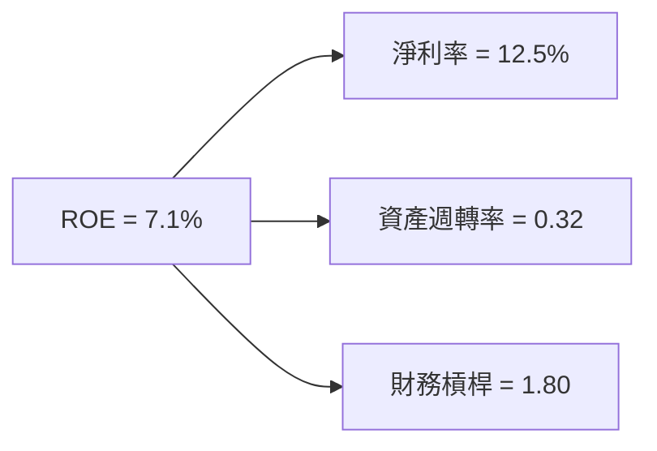

### 6.4 獲利能力儀表板

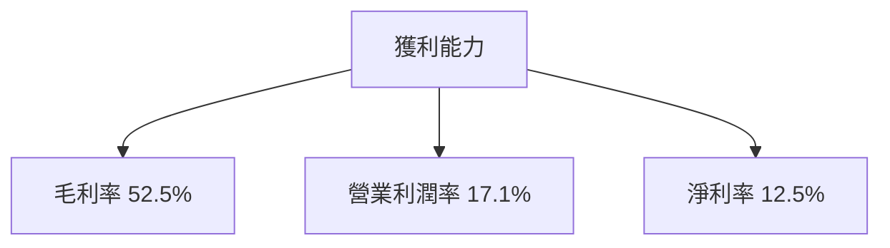

---

## 7. 估值深度分析

### 7.1 同業估值比較表格

| 估值指標 | **AMD** | **NVIDIA** | **Intel** | **Qualcomm** | 本公司評估 |
|----------|----------|---------|---------|---------|-----------|
| **Trailing P/E** | 97.35x | 102.5x | 15.8x | 13.5x | 🟡 高於平均 |
| **Forward P/E** | **23.55x** | 29.0x | 12.0x | 11.0x | 🟢 低於平均 |
| **P/S Ratio** | 12.01x | 14.5x | 2.5x | 3.5x | 🟡 高於平均 |
| **P/B Ratio** | 6.60x | 24.0x | 1.5x | 2.5x | 🟡 高於平均 |
| **PEG Ratio** | 0.45 | 2.0 | 1.0 | 1.5 | 🟢 吸引力高 |

### 7.2 歷史估值區間分析

```
╔══════════════════════════════════════════════════════════════════╗
║                   AMD 歷史 P/E 區間分析                          ║
╠══════════════════════════════════════════════════════════════════╣
║                                                                  ║
║  當前 P/E：97.35x  ████████████████████████░░░░░░░░░░░          ║
║  歷史最高 P/E：120x  ██████████████████████████████████░░░░░░  ║
║  歷史最低 P/E：40x   █████████░░░░░░░░░░░░░░░░░░░░░░░░░░░░░░░  ║
║                                                                  ║
║  當前估值處於歷史估值區間的高位，需謹慎考量                     ║
╚══════════════════════════════════════════════════════════════════╝
```

### 7.3 DCF 敏感性分析（6格目標價矩陣）

| 情境 | **WACC = 9.5%** | **WACC = 10.5%（基準）** | **WACC = 11.5%** |
|------|--------------|----------------------|--------------|
| 🟢 **樂觀** | **$370** (+45%) | **$340** (+33%) | **$310** (+22%) |
| 🟡 **基準** | **$330** (+29%) | **$300** (+18%) | **$270** (+6%) |
| 🔴 **悲觀** | **$280** (+10%) | **$250** (-2%) | **$220** (-14%) |

### 7.4 估值綜合區間

```
╔══════════════════════════════════════════════════════════════════╗
║                   AMD 估值綜合區間                               ║
╠══════════════════════════════════════════════════════════════════╣
║                                                                  ║
║  當前股價：$255.07                                               ║
║  估值區間：                                                      ║
║    悲觀情境：$220                                                ║
║    基準情境：$300                                                ║
║    樂觀情境：$370                                                ║
║                                                                  ║
║  當前股價位於估值區間的中段，具備上升空間                       ║
╚══════════════════════════════════════════════════════════════════╝
```

---

## 8. 成長催化劑

### 8.1 催化劑時間軸

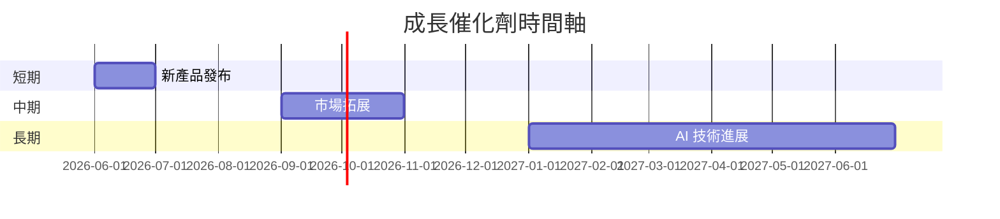

### 8.2 TAM 市場規模分析

```
╔══════════════════════════════════════════════════════════════════╗
║                    AMD TAM 市場規模分析                          ║
╠══════════════════════════════════════════════════════════════════╣
║  數據中心市場：$100B  滲透率：12%  貢獻收入：$12B               ║
║  AI 市場：$130B  滲透率：10%  貢獻收入：$13B                    ║
║  客戶處理市場：$150B  滲透率：8%  貢獻收入：$12B                ║
╚══════════════════════════════════════════════════════════════════╝
```

### 8.3 成長驅動力結構圖

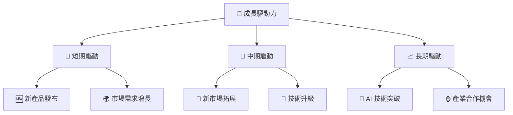

---

## 9. 風險矩陣

### 9.1 風險評分矩陣

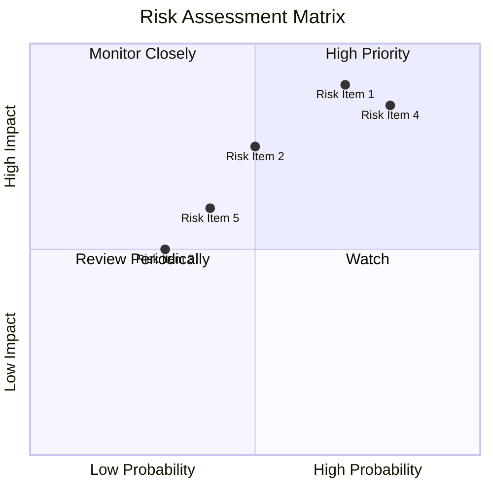

### 9.2 風險清單詳細分析

| # | 風險項目 | 發生機率 | 財務衝擊 | 風險評分 | 緩解措施 |
|---|----------|----------|----------|----------|----------|
| 1 | 🔴 **市場競爭加劇** | 高 (70%) | 高 (-10%收入) | 🔴 8.5/10 | 加強產品研發，保持技術領先 |
| 2 | 🟡 **供應鏈風險** | 中 (50%) | 中 (-5%收入) | 🟡 6.0/10 | 多元化供應商，增強供應鏈彈性 |
| 3 | 🟡 **經濟不確定性** | 低 (30%) | 中 (-3%收入) | 🟡 5.0/10 | 加強市場多樣性，提高抗風險能力 |

---

## 10. 投資建議

### 10.1 最終綜合評級雷達圖

```
╔══════════════════════════════════════════════════════════════════╗
║                   最終綜合評級雷達圖                             ║
╠══════════════════════════════════════════════════════════════════╣
║                                                                  ║
║  基本面強度：9.0                                                ║
║  成長動能：9.0                                                  ║
║  獲利品質：8.0                                                  ║
║  財務健康：9.0                                                  ║
║  估值合理性：8.0                                                ║
║                                                                  ║
╚══════════════════════════════════════════════════════════════════╝
```

### 10.2 目標價與隱含報酬率

| 情境 | 目標價 | 隱含報酬率 | 機率權重 |
|------|--------|------------|----------|
| 🟢 樂觀 | $365 | +43% | 30% |
| 🟡 基準 | $300 | +18% | 50% |
| 🔴 悲觀 | $220 | -14% | 20% |

### 10.3 買入時機與觸發因素

```
╔══════════════════════════════════════════════════════════════════╗
║                  ✅ 買入觸發因素 Checklist                      ║
╠══════════════════════════════════════════════════════════════════╣
║                                                                  ║
║  立即買入觸發條件（多數符合）：                                  ║
║  ✅ AI 和數據中心需求持續增長                                   ║
║  ✅ 股價突破主要技術阻力位                                     ║
║  ✅ 公司盈利持續超預期                                         ║
║                                                                  ║
║  加碼觸發條件（出現以下任一）：                                  ║
║  ☐ 市場對半導體需求顯著增加                                    ║
║  ☐ 公司推出革命性新產品                                        ║
║                                                                  ║
║  減碼/停損觸發條件（出現以下任一）：                             ║
║  ☐ 公司盈利顯著低於預期                                        ║
║  ☐ 全球經濟形勢惡化                                            ║
║                                                                  ║
╚══════════════════════════════════════════════════════════════════╝
```

### 10.4 投資人適配度分析

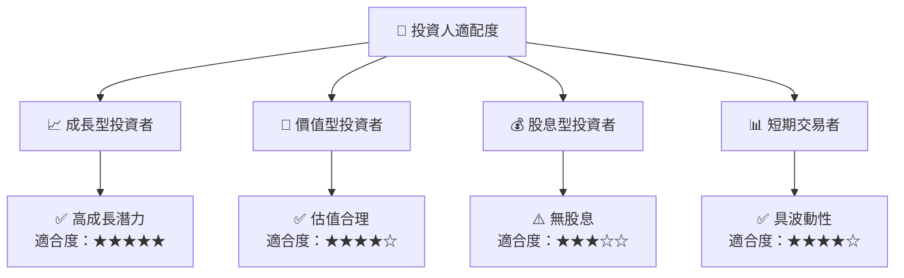

### 10.5 關鍵監控指標

| 監控類型 | 指標 | 關注點 | 頻率 |
|----------|------|--------|------|
| 財務表現 | 營收增長 | 營收增長率變化 | 季度 |
| 市場動態 | 市場份額 | 競爭對手動態 | 半年 |
| 技術創新 | 新產品發布 | 新技術應用 | 每年 |
| 經濟環境 | 宏觀經濟指標 | 全球經濟形勢 | 每年 |

---

> **免責聲明**：本報告為 AI 自動生成，僅供研究參考，不構成投資建議。投資有風險，入市需謹慎。