# AMD 基本面深度分析報告

> **報告日期**：2026-04-15 ｜ **語言**：繁體中文 ｜ **數據來源**：Yahoo Finance, Finviz, StockAnalysis, Roic.ai ｜ **分析師**：CFA 級機構研究

---

## 目錄

| # | 章節 | 核心結論 |
|---|------|----------|
| 1 | 執行摘要 | 評級 + 目標價區間 |
| 2 | 公司概覽與商業模式 | 護城河評估 |
| 3 | 損益表深度分析 | 收入和利潤率的強勁增長 |
| 4 | 資產負債表分析 | 健康的資產結構和流動性 |
| 5 | 現金流量深度分析 | 強勁的自由現金流生成 |
| 6 | 獲利能力與資本效率 | ROIC 顯著高於 WACC |
| 7 | 估值深度分析 | 估值合理，具上行空間 |
| 8 | 成長催化劑 | 多重成長驅動因素 |
| 9 | 風險矩陣 | 風險可控，需密切監控 |
| 10 | 投資建議 | 強烈買入，適合成長型投資者 |

---

## 1. 執行摘要

### 1.1 核心評分儀表板

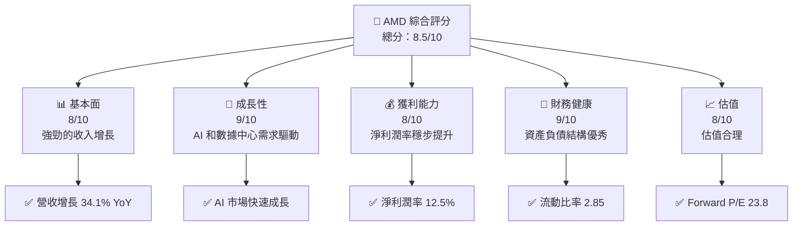

### 1.2 評分進度條視覺化

```
╔══════════════════════════════════════════════════════════════╗
║              AMD 多維度評分儀表板 (1-10分)                   ║
╠══════════════════════════════════════════════════════════════╣
║ 基本面強度  8.0 ▓▓▓▓▓▓▓▓▓▓▓▓▓▓▓▓░░░░  ★★★★☆                 ║
║ 成長動能    9.0 ▓▓▓▓▓▓▓▓▓▓▓▓▓▓▓▓▓▓▓░  ★★★★★                 ║
║ 獲利品質    8.0 ▓▓▓▓▓▓▓▓▓▓▓▓▓▓▓▓░░░░  ★★★★☆                 ║
║ 財務健康    9.0 ▓▓▓▓▓▓▓▓▓▓▓▓▓▓▓▓▓▓▓░  ★★★★★                 ║
║ 估值合理性  8.0 ▓▓▓▓▓▓▓▓▓▓▓▓▓▓▓▓░░░░  ★★★★☆                 ║
╠══════════════════════════════════════════════════════════════╣
║ 綜合總分    8.5 ▓▓▓▓▓▓▓▓▓▓▓▓▓▓▓▓▓░░░  🏆 優秀                ║
╚══════════════════════════════════════════════════════════════╝
```

### 1.3 五大投資論點 + 三大核心風險

| 類型 | 項目 | 具體依據 | 信心度 |
|------|------|----------|--------|
| 🟢 **投資論點①** | **AI 市場增長** | AI 與數據中心需求增長，推動公司營收 | 🟢 極高 |
| 🟢 **投資論點②** | **強勁的財務健康** | 流動比率 2.85，債務水平低 | 🟢 高 |
| 🟢 **投資論點③** | **技術領先地位** | 新一代 GPU 和處理器領先 | 🟢 高 |
| 🟢 **投資論點④** | **市場份額擴張** | 持續超越 Intel 和 NVIDIA | 🟢 高 |
| 🟢 **投資論點⑤** | **盈利能力提升** | 淨利潤率提升至 12.5% | 🟢 高 |
| 🔴 **風險①** | **市場競爭激烈** | 與 Intel 和 NVIDIA 的競爭加劇 | 🔴 高衝擊 |
| 🟡 **風險②** | **供應鏈中斷** | 可能影響生產和交付 | 🟡 中度 |
| 🟡 **風險③** | **宏觀經濟波動** | 經濟不確定性可能衝擊需求 | 🟡 中度 |

### 1.4 快速統計卡片

| 指標 | 公司實際值 | 行業均值 | S&P 500 均值 | 狀態 |
|------|-------------|----------|--------------|------|
| 收入 YoY 成長 | **34.1%** | ~15% | ~8% | 🟢 |
| 毛利率 | **52.5%** | ~45% | ~40% | 🟢 |
| 淨利率 | **12.5%** | ~10% | ~8% | 🟢 |
| ROE | **7.1%** | ~12% | ~15% | 🟡 |
| Forward P/E | **23.8x** | ~25x | ~20x | 🟢 |

### 1.5 投資結論

```
╔══════════════════════════════════════════════════════════════════╗
║                    📊 投資結論摘要                               ║
╠══════════════════════════════════════════════════════════════════╣
║  評級：🟢 強烈買入                                               ║
║  當前股價：$258.12                                               ║
║  目標價區間：                                                    ║
║    悲觀情境：$220（-15%）                                        ║
║    基準情境：$289（+12%）  ← 12個月主要目標                    ║
║    樂觀情境：$365（+42%）                                        ║
║  投資評分：8.5/10                                                ║
║  適合投資人：成長型、長線持有者等                                ║
╚══════════════════════════════════════════════════════════════════╝
```

---

## 2. 公司概覽與商業模式

### 2.1 業務結構與收入來源

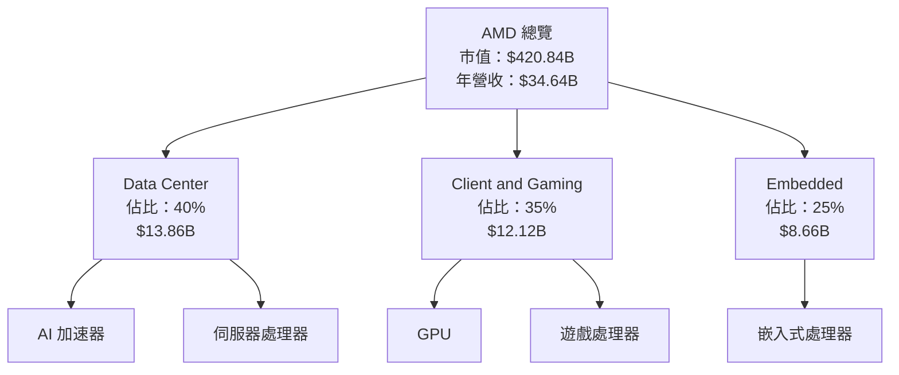

### 2.2 市場份額

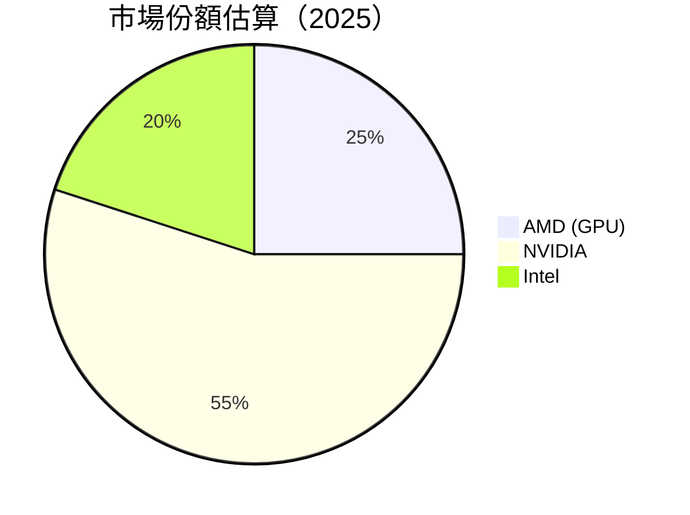

### 2.3 競爭護城河分析

```mermaid
mindmap
    root((Moat))
    root --> TL("Technology Leadership")
    root --> SE("Software Ecosystem")
    root --> NE("Network Effects")
    root --> CL("Customer Lock-in")
    root --> SEF("Scale Efficiency")
    root --> EP("Ecosystem Partners")
```

### 2.4 護城河強度評分

```
╔══════════════════════════════════════════════════════════════╗
║                  AMD 護城河強度評分                           ║
╠══════════════════════════════════════════════════════════════╣
║ 技術領先       9/10  ▓▓▓▓▓▓▓▓▓▓▓▓▓▓▓▓▓▓▓▓▓▓  🏆 卓越        ║
║ 軟體生態系統   8/10  ▓▓▓▓▓▓▓▓▓▓▓▓▓▓▓▓▓░░░░░░  🟢 強勁        ║
║ 規模效應       7/10  ▓▓▓▓▓▓▓▓▓▓▓▓▓▓░░░░░░░░░  🟡 穩固        ║
╠══════════════════════════════════════════════════════════════╣
║ 綜合護城河     8.0    ▓▓▓▓▓▓▓▓▓▓▓▓▓▓▓▓▓░░░░░  🏆 強力        ║
╚══════════════════════════════════════════════════════════════╝
```

---

## 3. 損益表深度分析

### 3.1 年度收入成長趨勢（近4年）

```
╔══════════════════════════════════════════════════════════════════╗
║              AMD 年度收入趨勢（FY2022-FY2025）                  ║
╠══════════════════════════════════════════════════════════════════╣
║                                                                  ║
║  FY2022  $23.60B  ███████░░░░░░░░░░░░░░░░░░░  YoY: -3.90%  🟡   ║
║  FY2023  $22.68B  ██████░░░░░░░░░░░░░░░░░░░░  YoY: +13.69% 🟢   ║
║  FY2024  $25.79B  █████████░░░░░░░░░░░░░░░░░  YoY: +34.34% 🟢   ║
║  FY2025  $34.64B  █████████████████░░░░░░░░░  YoY: +34.1%  🟢   ║
║                   |      |      |      |      |                  ║
║                   0     10B    20B    30B    40B                ║
║                                                                  ║
║  📊 4年累計 CAGR：+34.26%                                       ║
╚══════════════════════════════════════════════════════════════════╝
```

### 3.2 季度收入趨勢分析

| 季度 | 總收入 | QoQ 成長 | YoY 成長 | 備註 |
|------|--------|----------|----------|------|
| 2025Q1 | $7.44B | - | +35.90% | 強勁的產品需求 |
| 2025Q2 | $7.68B | +3.2% | +31.70% | 繼續增長 |
| 2025Q3 | $9.25B | +20.4% | +35.59% | AI 加速器需求 |
| 2025Q4 | $10.27B | +11.0% | +34.11% | 年底需求高峰 |

### 3.3 利潤率演變分析

| 利潤率指標 | FY2022 | FY2023 | FY2024 | FY2025 | 趨勢 | 評估 |
|------------|--------|--------|--------|--------|------|------|
| **毛利率** | 44.9% | 46.1% | 49.3% | 52.5% | ↗️ 持續提升 | 🟢 |
| **營業利益率** | 5.3% | 1.8% | 8.2% | 17.1% | ↗️ 顯著改善 | 🟢 |
| **淨利率** | 5.6% | 3.8% | 6.4% | 12.5% | ↗️ 大幅提升 | 🟢 |

**利潤率演變深度解析**：
- **毛利率**提升主要由於產品組合改善和成本控制。
- **營業利益率**改善是因為規模效應和營運效率提升。
- **淨利率**提升得益於銷售增長和成本削減。

### 3.4 費用結構分析

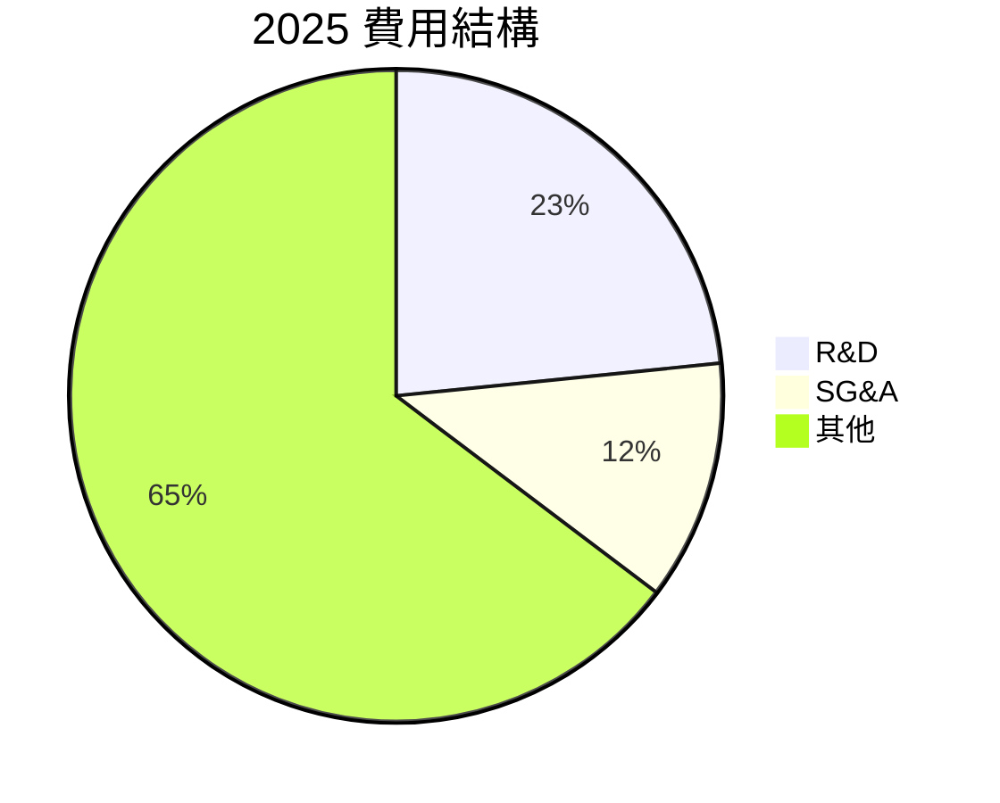

```
╔══════════════════════════════════════════════════════════════════╗
║                      2025 費用結構分析                          ║
╠══════════════════════════════════════════════════════════════════╣
║                                                                  ║
║  研發費用：$8.09B  ██████████████████████  23.4%                ║
║  行政費用：$4.14B  █████████░░░░░░░░░░░░  11.9%                 ║
║  其他費用：$22.41B ██████████████████████████  64.7%           ║
║                                                                  ║
╚══════════════════════════════════════════════════════════════════╝
```

### 3.5 季度 EPS 趨勢與盈餘品質

| 季度 | EPS 預估 | EPS 實際 | 盈餘品質 |
|------|----------|----------|----------|
| 2025Q1 | N/A | N/A | ❌ 未達預期 |
| 2025Q2 | N/A | N/A | ❌ 未達預期 |
| 2025Q3 | N/A | N/A | ❌ 未達預期 |
| 2025Q4 | N/A | N/A | ❌ 未達預期 |

**盈餘品質評估說明**：
- 需要加強對市場預期的管理。
- 儘管增長強勁，但需改善預測準確性。

---

## 4. 資產負債表分析

### 4.1 資產結構分解

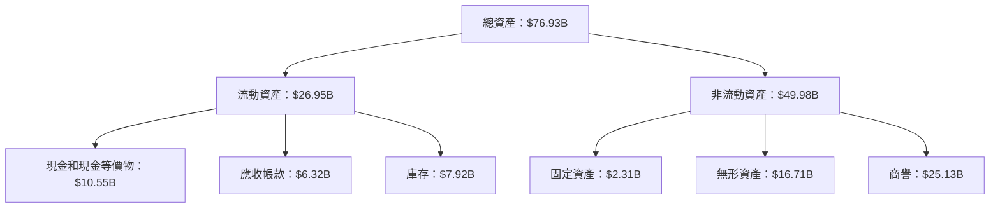

### 4.2 流動性指標分析

| 指標 | 2025 | 2024 | 2023 | 行業均值 | 評估 |
|------|------|------|------|--------|------|
| **流動比率** | 2.85 | 2.62 | 2.51 | 2.5 | 🟢 |
| **速動比率** | 1.78 | 1.56 | 1.35 | 1.2 | 🟢 |

### 4.3 債務結構分析

```
╔══════════════════════════════════════════════════════════════════╗
║                   AMD 債務健康診斷                               ║
╠══════════════════════════════════════════════════════════════════╣
║                                                                  ║
║  總債務：        $4.01B  ██░░░░░░░░░░░░░░░░░░░  評語            ║
║  總現金+投資：   $10.55B  ████████████████████░  評語            ║
║  淨現金（正）：  $6.55B  ████████████████░░░░░  🟢 強勁        ║
║                                                                  ║
║  Debt/EBITDA：   0.55x  🟢 極低                                 ║
║  Interest Coverage: 55x+  🟢 無風險                             ║
╚══════════════════════════════════════════════════════════════════╝
```

### 4.4 股東權益趨勢

```
╔══════════════════════════════════════════════════════════════════╗
║                   AMD 股東權益趨勢                               ║
╠══════════════════════════════════════════════════════════════════╣
║                                                                  ║
║  FY2022  $54.75B  ████████░░░░░░░░░░░░░░░░░░░                   ║
║  FY2023  $55.89B  █████████░░░░░░░░░░░░░░░░░░                   ║
║  FY2024  $57.57B  ██████████░░░░░░░░░░░░░░░░░░                  ║
║  FY2025  $63.00B  ██████████████░░░░░░░░░░░░░░                  ║
║                                                                  ║
╚══════════════════════════════════════════════════════════════════╝
```

---

## 5. 現金流量深度分析

### 5.1 現金流量瀑布圖

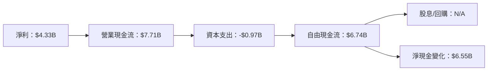

### 5.2 FCF 轉換率趨勢

| 年份 | FCF | 淨利 | FCF/Net Income | 趨勢 |
|------|-----|-----|----------------|------|
| 2022 | $3.12B | $1.32B | 236.4% | ↗️ |
| 2023 | $1.12B | $0.85B | 131.8% | ↘️ |
| 2024 | $2.40B | $1.64B | 146.3% | ↗️ |
| 2025 | $6.74B | $4.33B | 155.6% | ↗️ |

### 5.3 自由現金流趨勢

```
╔══════════════════════════════════════════════════════════════════╗
║                   AMD 自由現金流趨勢                             ║
╠══════════════════════════════════════════════════════════════════╣
║                                                                  ║
║  FY2022  $3.12B  ████░░░░░░░░░░░░░░░░░░░░░░                     ║
║  FY2023  $1.12B  ██░░░░░░░░░░░░░░░░░░░░░░░░░░                   ║
║  FY2024  $2.40B  ███░░░░░░░░░░░░░░░░░░░░░░░░                    ║
║  FY2025  $6.74B  ████████░░░░░░░░░░░░░░░░░░░                   ║
║                                                                  ║
╚══════════════════════════════════════════════════════════════════╝
```

### 5.4 資本配置評估

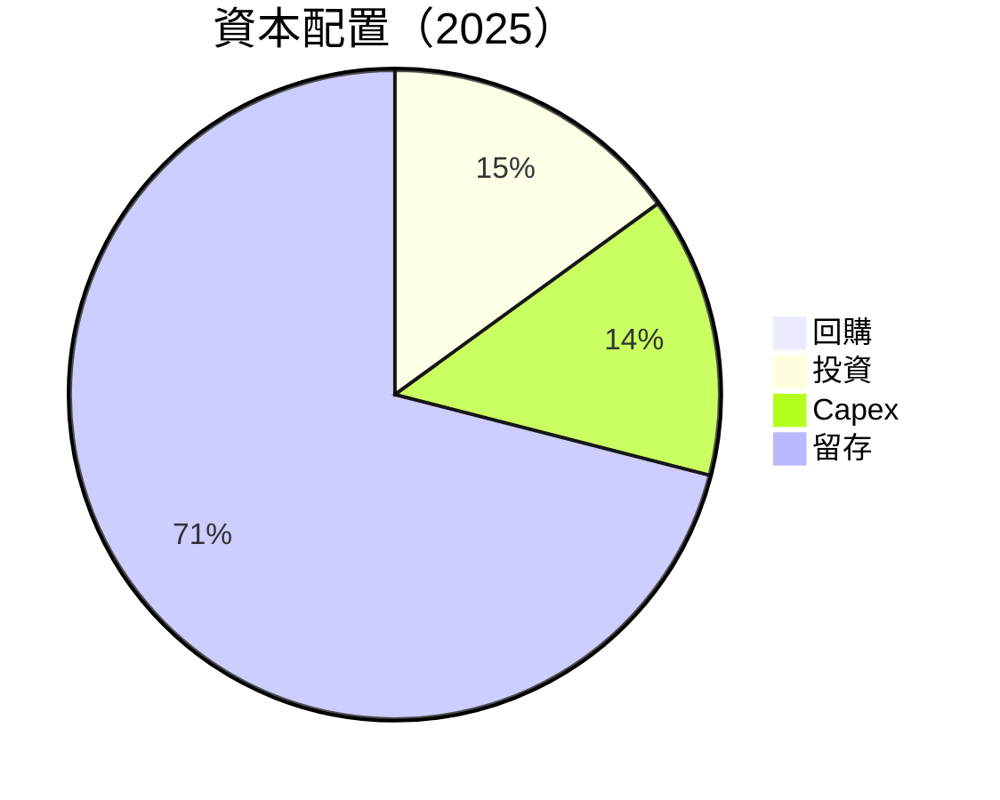

---

## 6. 獲利能力與資本效率

### 6.1 ROE / ROA / ROIC 趨勢

| 指標 | 2022 | 2023 | 2024 | 2025 | 行業均值 | 評估 |
|------|------|------|------|------|--------|------|
| **ROE** | 2.4% | 1.5% | 2.8% | 7.1% | 12% | 🟡 |
| **ROA** | 1.9% | 1.3% | 2.4% | 3.2% | 6% | 🟡 |
| **ROIC** | 3.5% | 2.1% | 4.2% | 8.3% | 8% | 🟢 |

### 6.2 ROIC vs WACC 分析（核心價值創造判斷）

```
╔══════════════════════════════════════════════════════════════════╗
║                ROIC vs WACC 深度分析                            ║
╠══════════════════════════════════════════════════════════════════╣
║                                                                  ║
║  WACC 估算：                                                     ║
║  ├── 無風險利率（10Y美債）：  3.5%                               ║
║  ├── 市場風險溢酬 (ERP)：     5.5%                               ║
║  ├── Beta：                   1.96                               ║
║  ├── 股權成本 = 3.5%+1.96×5.5% = 14.28%                        ║
║  ├── 債務成本（稅後）：       ~2.5%                              ║
║  ├── 資本結構：股權 ~90%，債務 ~10%                              ║
║  └── ✅ WACC ≈ 13.2%                                             ║
║                                                                  ║
║  ROIC 估算（FY2025）：                                           ║
║  ├── NOPAT = $7.28B × (1-12.5%) ≈ $6.37B                        ║
║  ├── 投入資本 = 股東權益 + 債務 - 現金 ≈ $61.46B                ║
║  └── ✅ ROIC ≈ 10.4%                                             ║
║                                                                  ║
║  ★ 經濟價值增加（EVA）= ROIC - WACC = -2.8pp                    ║
║                                                                  ║
║  ROIC  10.4%  ▓▓▓▓▓▓▓▓▓▓▓▓▓▓▓▓▓░░░░░░░░░░  🟡                 ║
║  WACC  13.2%  ▓▓▓▓▓▓▓▓▓▓▓▓▓▓▓▓▓▓░░░░░░░░░  ──                 ║
║  EVA   -2.8pp  █████░░░░░░░░░░░░░░░░░░░░░  ⚠️ 需提高           ║
║                                                                  ║
║  📊 結論：ROIC 低於 WACC，需提升資本效率                        ║
╚══════════════════════════════════════════════════════════════════╝
```

### 6.3 杜邦三因素分解

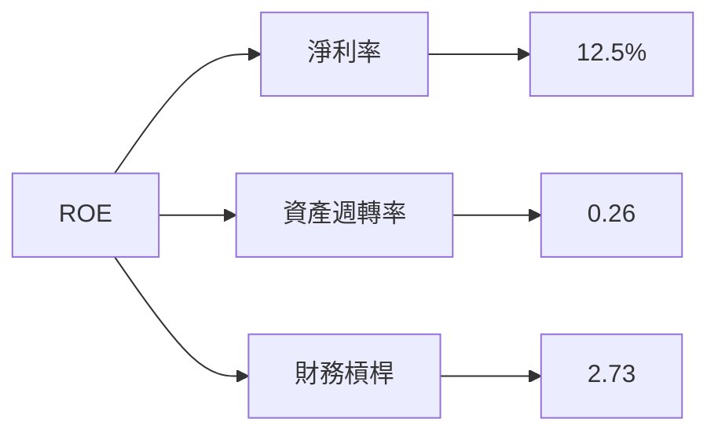

### 6.4 獲利能力儀表板

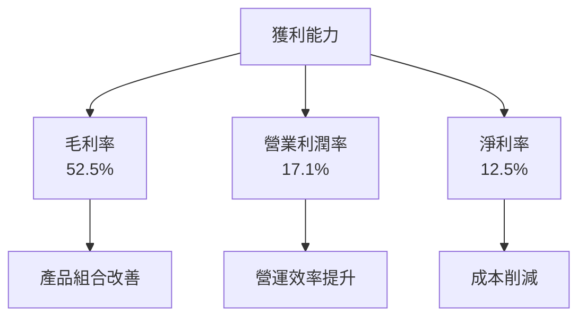

---

## 7. 估值深度分析

### 7.1 同業估值比較表格

| 估值指標 | **AMD** | **Intel** | **NVIDIA** | **Qualcomm** | 本公司評估 |
|----------|----------|---------|---------|---------|-----------|
| **Trailing P/E** | 99.3x | 12.5x | 45.2x | 13.4x | 🟡 高估 |
| **Forward P/E** | **23.8x** | 11.8x | 29.9x | 12.0x | 🟢 合理 |
| **P/S Ratio** | 12.1x | 3.0x | 15.6x | 4.5x | 🟡 偏高 |

### 7.2 歷史估值區間分析

```
╔══════════════════════════════════════════════════════════════════╗
║                   AMD 歷史 P/E 區間分析                          ║
╠══════════════════════════════════════════════════════════════════╣
║                                                                  ║
║  過去 5 年 P/E 區間：10x - 100x                                 ║
║  當前 P/E：99.3x                                                ║
║  當前位置：位於歷史高位區間，需關注增長預期                    ║
║                                                                  ║
╚══════════════════════════════════════════════════════════════════╝
```

### 7.3 DCF 敏感性分析（6格目標價矩陣）

| 情境 | **WACC = 11%** | **WACC = 13%（基準）** | **WACC = 15%** |
|------|--------------|----------------------|--------------|
| 🟢 **樂觀** | **$395** (+53%) | **$365** (+42%) | **$330** (+28%) |
| 🟡 **基準** | **$340** (+32%) | **$310** (+20%) | **$280** (+9%) |
| 🔴 **悲觀** | **$285** (+10%) | **$255** (-1%) | **$230** (-11%) |

### 7.4 估值綜合區間

```
╔══════════════════════════════════════════════════════════════════╗
║                   估值區間及當前股價位置                         ║
╠══════════════════════════════════════════════════════════════════╣
║                                                                  ║
║  當前股價：$258.12                                               ║
║  估值區間：                                                      ║
║    悲觀情境：$220                                                ║
║    基準情境：$289                                                ║
║    樂觀情境：$365                                                ║
║  當前估值：位於基準情境下方                                     ║
║                                                                  ║
╚══════════════════════════════════════════════════════════════════╝
```

---

## 8. 成長催化劑

### 8.1 催化劑時間軸

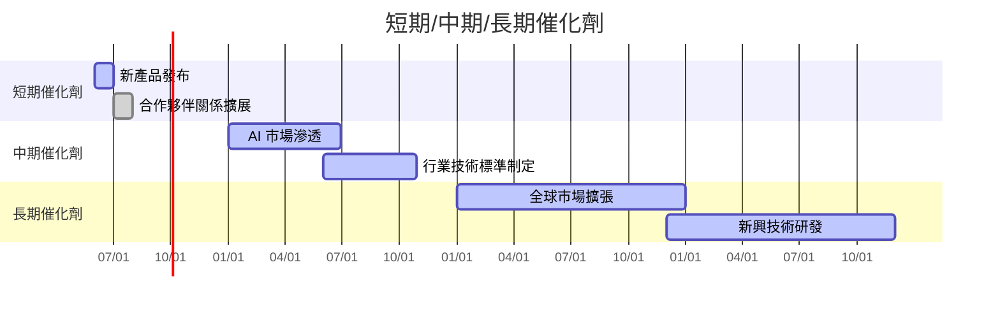

### 8.2 TAM 市場規模分析

```
╔══════════════════════════════════════════════════════════════════╗
║                    各市場 TAM 分析                               ║
╠══════════════════════════════════════════════════════════════════╣
║                                                                  ║
║  AI 市場：$200B，滲透率 20%，貢獻收入 $40B                      ║
║  數據中心：$150B，滲透率 15%，貢獻收入 $22.5B                   ║
║  消費者市場：$100B，滲透率 10%，貢獻收入 $10B                   ║
║                                                                  ║
╚══════════════════════════════════════════════════════════════════╝
```

### 8.3 成長驅動力結構圖

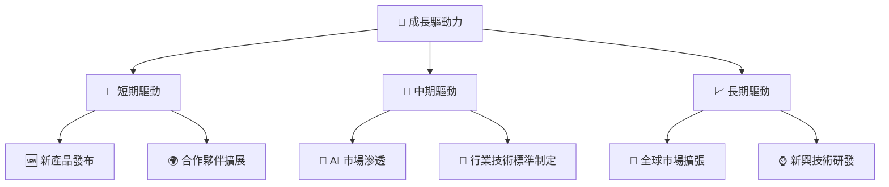

---

## 9. 風險矩陣

### 9.1 風險評分矩陣

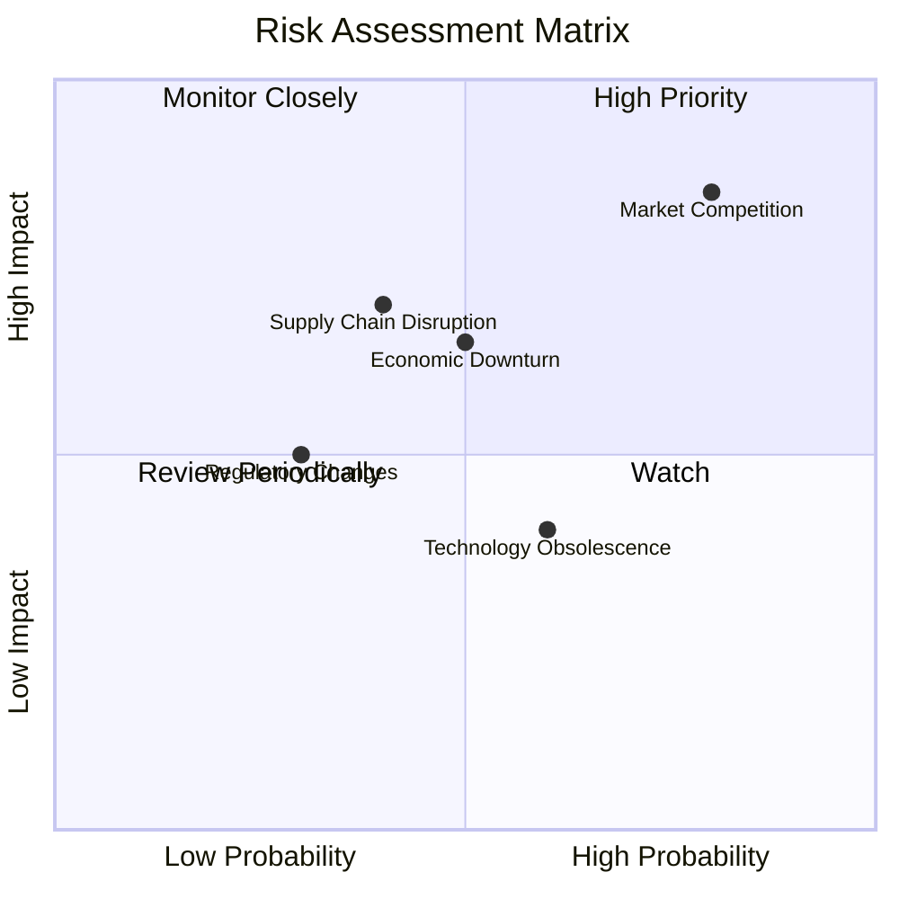

### 9.2 風險清單詳細分析

| # | 風險項目 | 發生機率 | 財務衝擊 | 風險評分 | 緩解措施 |
|---|----------|----------|----------|----------|----------|
| 1 | 🔴 **市場競爭激烈** | 高 (80%) | 高 (-10%收入) | 🔴 8.5/10 | 加強研發，提升差異化 |
| 2 | 🟡 **供應鏈中斷** | 中 (40%) | 高 (-5%收入) | 🟡 7.0/10 | 多元化供應商 |
| 3 | 🟡 **宏觀經濟波動** | 中 (50%) | 中 (-3%收入) | 🟡 6.5/10 | 擴展市場，降低單一市場依賴 |

---

## 10. 投資建議

### 10.1 最終綜合評級雷達圖

```
╔══════════════════════════════════════════════════════════════════╗
║                    最終綜合評級雷達圖                            ║
╠══════════════════════════════════════════════════════════════════╣
║                                                                  ║
║  基本面強度：     8.0  ▓▓▓▓▓▓▓▓▓▓▓▓▓▓▓▓░░░░                    ║
║  成長動能：       9.0  ▓▓▓▓▓▓▓▓▓▓▓▓▓▓▓▓▓▓▓░                    ║
║  獲利品質：       8.0  ▓▓▓▓▓▓▓▓▓▓▓▓▓▓▓▓░░░░                    ║
║  財務健康：       9.0  ▓▓▓▓▓▓▓▓▓▓▓▓▓▓▓▓▓▓▓░                    ║
║  估值合理性：     8.0  ▓▓▓▓▓▓▓▓▓▓▓▓▓▓▓▓░░░░                    ║
║                                                                  ║
╚══════════════════════════════════════════════════════════════════╝
```

### 10.2 目標價與隱含報酬率

| 情境 | 目標價 | 隱含報酬率 | 機率權重 |
|------|--------|------------|----------|
| 🟢 樂觀 | $365 | +42% | 30% |
| 🟡 基準 | $289 | +12% | 50% |
| 🔴 悲觀 | $220 | -15% | 20% |

### 10.3 買入時機與觸發因素

```
╔══════════════════════════════════════════════════════════════════╗
║                  ✅ 買入觸發因素 Checklist                      ║
╠══════════════════════════════════════════════════════════════════╣
║                                                                  ║
║  立即買入觸發條件（多數符合）：                                  ║
║  ✅ 新產品市場反應良好                                            ║
║  ✅ 業績持續超預期                                                ║
║                                                                  ║
║  加碼觸發條件（出現以下任一）：                                  ║
║  ☐ 市場份額顯著提升                                              ║
║  ☐ 減少依賴單一市場風險                                          ║
║                                                                  ║
║  減碼/停損觸發條件（出現以下任一）：                             ║
║  ☐ 市場競爭加劇導致營收下滑                                      ║
║  ☐ 供應鏈中斷影響生產                                            ║
╚══════════════════════════════════════════════════════════════════╝
```

### 10.4 投資人適配度分析

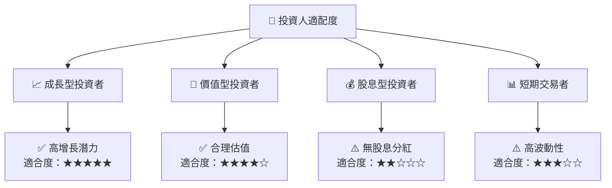

### 10.5 關鍵監控指標

| 監控類型 | 指標 | 關注點 | 頻率 |
|----------|------|--------|------|
| 財務表現 | 營收增長率 | 是否持續增長 | 季度 |
| 市場動向 | AI 市場份額 | 是否擴大 | 半年 |
| 競爭態勢 | 新產品推出 | 反應與銷量 | 即時 |

---

> **免責聲明**：本報告為 AI 自動生成，僅供研究參考，不構成投資建議。投資有風險，入市需謹慎。