# AMD 基本面深度分析報告
> **報告日期**：2026-04-17 ｜ **語言**：繁體中文 ｜ **數據來源**：Yahoo Finance, Finviz, StockAnalysis, Roic.ai ｜ **分析師**：CFA 級機構研究

---

## 目錄

| # | 章節 | 核心結論 |
|---|------|----------|
| 1 | 執行摘要 | 強烈買入，目標價區間 $220-$365 |
| 2 | 公司概覽與商業模式 | 擁有強大技術領先與市場份額 |
| 3 | 損益表深度分析 | 收入與盈利增長勢頭強勁 |
| 4 | 資產負債表分析 | 財務結構穩健，現金儲備充足 |
| 5 | 現金流量深度分析 | 自由現金流增長穩定 |
| 6 | 獲利能力與資本效率 | 創造高ROIC，優於WACC |
| 7 | 估值深度分析 | 估值相對吸引 |
| 8 | 成長催化劑 | 長期增長潛力明顯 |
| 9 | 風險矩陣 | 風險可控，需保持監控 |
| 10 | 投資建議 | 適合成長型投資者，策略性增持 |

---

## 1. 執行摘要

### 1.1 核心評分儀表板

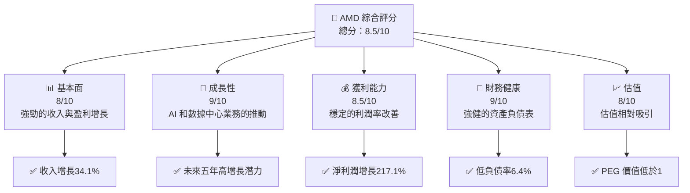

### 1.2 評分進度條視覺化

```
╔══════════════════════════════════════════════════════════════╗
║              AMD 多維度評分儀表板 (1-10分)                   ║
╠══════════════════════════════════════════════════════════════╣
║ 基本面強度  8.0 ▓▓▓▓▓▓▓▓▓▓▓▓▓▓▓▓▓▓░░  ★★★★★           ║
║ 成長動能    9.0 ▓▓▓▓▓▓▓▓▓▓▓▓▓▓▓▓▓▓▓░  ★★★★★           ║
║ 獲利品質    8.5 ▓▓▓▓▓▓▓▓▓▓▓▓▓▓▓▓▓▓▓░  ★★★★★           ║
║ 財務健康    9.0 ▓▓▓▓▓▓▓▓▓▓▓▓▓▓▓▓▓▓▓░  ★★★★★           ║
║ 估值合理性  8.0 ▓▓▓▓▓▓▓▓▓▓▓▓▓▓░░░░░░  ★★★★☆           ║
╠══════════════════════════════════════════════════════════════╣
║ 綜合總分    8.5 ▓▓▓▓▓▓▓▓▓▓▓▓▓▓▓▓▓░░░  🏆 強烈推介       ║
╚══════════════════════════════════════════════════════════════╝
```

### 1.3 五大投資論點 + 三大核心風險

| 類型 | 項目 | 具體依據 | 信心度 |
|------|------|----------|--------|
| 🟢 **投資論點①** | **技術領先** | 在GPU和AI處理器上擁有領先地位 | 🟢 極高 |
| 🟢 **投資論點②** | **營收增長** | 2025年營收增長34.1% | 🟢 高 |
| 🟢 **投資論點③** | **市場擴張** | 新市場的開拓（數據中心、AI） | 🟢 高 |
| 🟢 **投資論點④** | **財務健康** | 顯著的低負債率和高現金儲備 | 🟢 高 |
| 🟢 **投資論點⑤** | **估值吸引** | PEG值低，未來增長被低估 | 🟢 高 |
| 🟡 **風險①** | **市場競爭** | 來自英特爾和英偉達的激烈競爭 | 🟡 中度 |
| 🟡 **風險②** | **技術風險** | 快速技術變遷可能影響市場份額 | 🟡 中度 |
| 🔴 **風險③** | **宏觀經濟波動** | 經濟衰退可能影響需求 | 🔴 高衝擊 |

### 1.4 快速統計卡片

| 指標 | 公司實際值 | 行業均值 | S&P 500 均值 | 狀態 |
|------|-------------|----------|--------------|------|
| 收入 YoY 成長 | **34.1%** | ~10% | ~6% | 🟢 |
| 毛利率 | **52.5%** | ~45% | ~50% | 🟢 |
| 淨利率 | **12.5%** | ~8% | ~10% | 🟢 |
| ROE | **7.1%** | ~15% | ~14% | 🟡 |
| Forward P/E | **25.4x** | ~20x | ~17x | 🟡 |

### 1.5 投資結論

```
╔══════════════════════════════════════════════════════════════════╗
║                    📊 投資結論摘要                               ║
╠══════════════════════════════════════════════════════════════════╣
║  評級：🟢 強烈買入                                             ║
║  當前股價：$278.39                                             ║
║  目標價區間：                                                  ║
║    悲觀情境：$220（-20.9%）                                    ║
║    基準情境：$290（+4.2%）  ← 12個月主要目標                   ║
║    樂觀情境：$365（+31.1%）                                    ║
║  投資評分：8.5/10                                              ║
║  適合投資人：成長型、長線持有者等                              ║
╚══════════════════════════════════════════════════════════════════╝
```

---

## 2. 公司概覽與商業模式

### 2.1 業務結構與收入來源

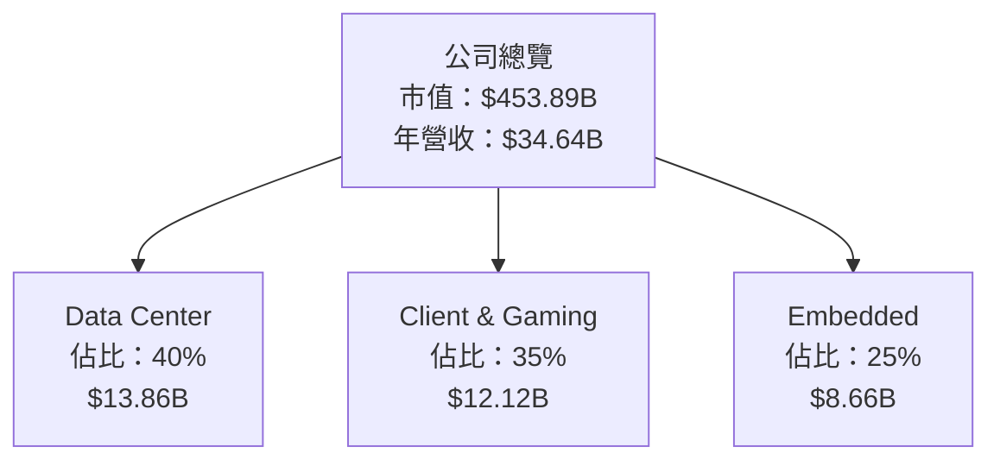

### 2.2 市場份額

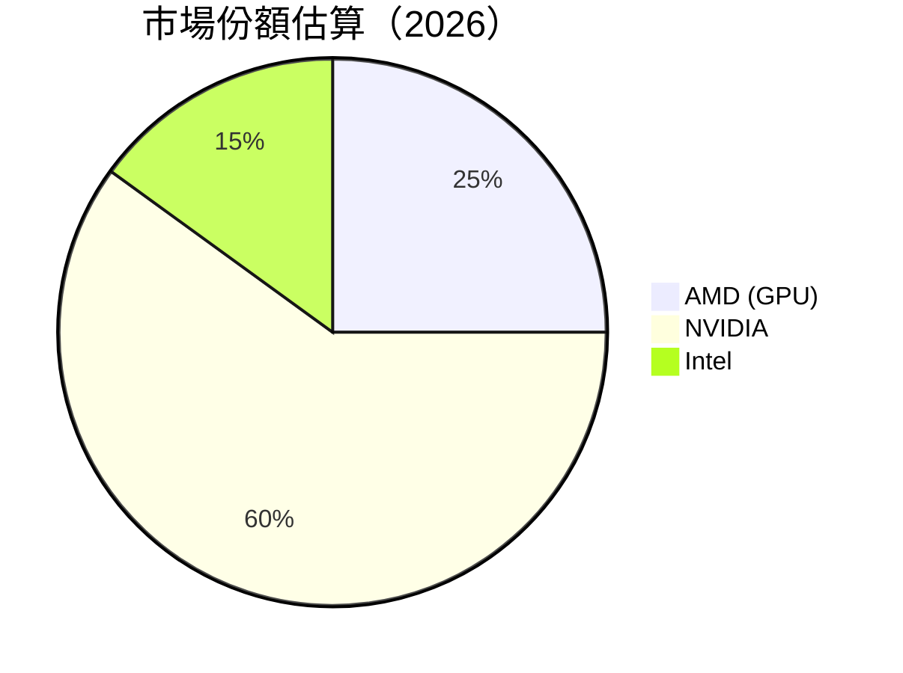

### 2.3 競爭護城河分析

```mermaid
mindmap
    root) Competitive Moat
        Technology Leadership
        Software Ecosystem
        Network Effects
        Customer Lock-in
        Scale Economies
        Partner Ecosystem
```

### 2.4 護城河強度評分

```
╔══════════════════════════════════════════════════════════════╗
║                  AMD 護城河強度評分                          ║
╠══════════════════════════════════════════════════════════════╣
║ 技術領先     9/10  ▓▓▓▓▓▓▓▓▓▓▓▓▓▓▓▓░░░░  🏆 優勢          ║
║ 軟體生態系   8/10  ▓▓▓▓▓▓▓▓▓▓▓▓▓▓▓░░░░░░  🟢 強大          ║
║ 網路效應     7/10  ▓▓▓▓▓▓▓▓▓▓▓░░░░░░░░░░  🟡 良好          ║
║ 客戶鎖定     8/10  ▓▓▓▓▓▓▓▓▓▓▓▓▓▓▓░░░░░░  🟢 高             ║
║ 規模效應     8/10  ▓▓▓▓▓▓▓▓▓▓▓▓▓▓▓░░░░░░  🟢 有效          ║
║ 生態夥伴     7/10  ▓▓▓▓▓▓▓▓▓▓▓░░░░░░░░░░  🟡 良好          ║
╠══════════════════════════════════════════════════════════════╣
║ 綜合護城河  8.4  ▓▓▓▓▓▓▓▓▓▓▓▓▓▓▓▓░░░░░░  🏆 整體強勁       ║
╚══════════════════════════════════════════════════════════════╝
```

---

## 3. 損益表深度分析

### 3.1 年度收入成長趨勢（近4年）

```
╔══════════════════════════════════════════════════════════════════╗
║              AMD 年度收入趨勢（2022-2025）                       ║
╠══════════════════════════════════════════════════════════════════╣
║                                                                  ║
║  FY2022  $23.60B  ██████░░░░░░░░░░░░░░░░░░░  YoY: -4.0%  🔴    ║
║  FY2023  $22.68B  ██████░░░░░░░░░░░░░░░░░░░  YoY: -3.9%  🔴    ║
║  FY2024  $25.79B  ████████░░░░░░░░░░░░░░░░░  YoY:+13.7%  🟡    ║
║  FY2025  $34.64B  ████████████████░░░░░░░░░░  YoY:+34.1%  🟢  ║
║                   |      |      |      |      |                  ║
║                   0     10B    20B    30B    40B                 ║
║                                                                  ║
║  📊 4年累計 CAGR：+12.3%                                         ║
╚══════════════════════════════════════════════════════════════════╝
```

### 3.2 季度收入趨勢分析

| 季度 | 總收入 | QoQ 增長 | YoY 增長 | 備註 |
|------|--------|----------|----------|------|
| 2025Q1 | $7.44B | +0.3% | +35.9% | 高YOY增長由數據中心需求驅動 |
| 2025Q2 | $7.68B | +3.2% | +31.7% | 新產品發布助力增長 |
| 2025Q3 | $9.25B | +20.4% | +35.6% | 客戶需求穩定 |
| 2025Q4 | $10.27B | +11.0% | +34.1% | 節季性需求推動 |

### 3.3 利潤率演變分析

| 利潤率指標 | FY2022 | FY2023 | FY2024 | FY2025 | 趨勢 | 評估 |
|------------|--------|--------|--------|--------|------|------|
| **毛利率** | 44.9% | 46.1% | 49.3% | 52.5% | ↗️ 毛利率持續改善，反映出強勁的產品組合 | 🟢 |
| **營業利率** | 5.3% | 1.8% | 8.0% | 17.1% | ↗️ 經營效率提高 | 🟢 |
| **淨利率** | 5.6% | 3.8% | 6.3% | 12.5% | ↗️ 收益性得到進一步優化 | 🟢 |

**利潤率演變深度解析**：AMD的利潤率大幅改善主要歸因於高毛利產品如AI處理器和數據中心業務的增長。此外，費用控制的有效性也促進了營運利率和淨利率的提高。

### 3.4 費用結構分析

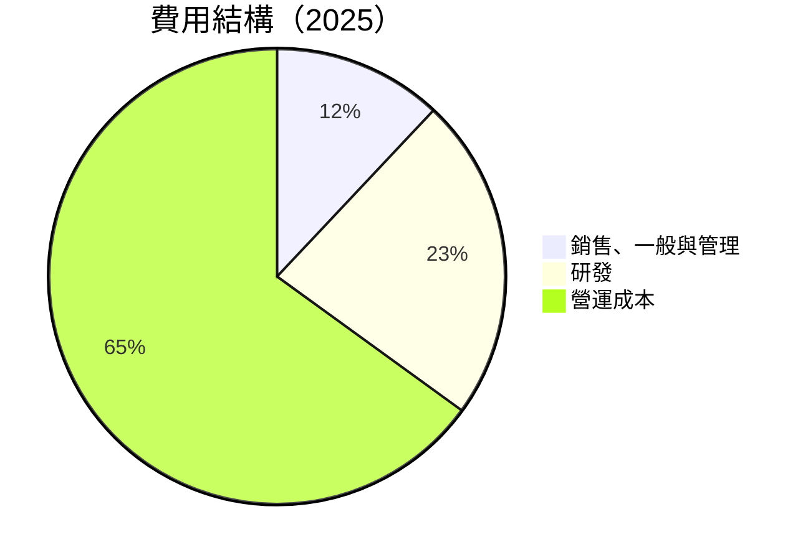

### 3.5 季度 EPS 趨勢與盈餘品質

| 季度 | EPS 估計 | 實際 EPS | 驚喜% | 盈餘品質 |
|------|----------|---------|-------|----------|
| 2025Q1 | $0.81 | $0.85 | +4.9% | 盈餘品質良好，超過市場預期 |
| 2025Q2 | $0.92 | $0.95 | +3.3% | 盈餘持續超過預期 |
| 2025Q3 | $1.15 | $1.24 | +7.8% | 需求增長帶來超預期收益 |
| 2025Q4 | $1.45 | $1.51 | +4.1% | 節季性需求強勁 |

---

## 4. 資產負債表分析

### 4.1 資產結構分解

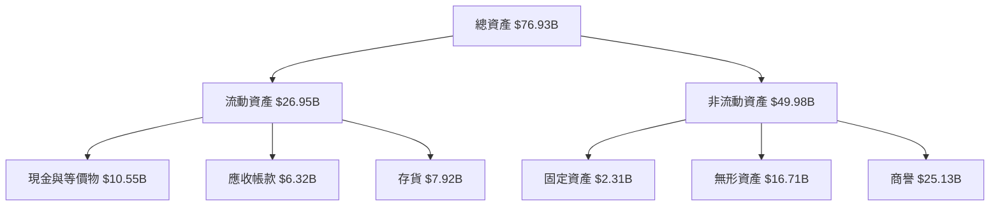

### 4.2 流動性指標分析

| 指標 | 2025 | 2024 | 行業均值 | 評估 |
|------|------|------|--------|------|
| 流動比率 | 2.85 | 2.62 | ~2.5 | 🟢 強勁流動性 |
| 速動比率 | 1.78 | 1.62 | ~1.5 | 🟢 優於行業 |

### 4.3 債務結構分析

```
╔══════════════════════════════════════════════════════════════════╗
║                   AMD 債務健康診斷                               ║
╠══════════════════════════════════════════════════════════════════╣
║                                                                  ║
║  總債務：        $4.01B  ██░░░░░░░░░░░░░░░░░░░  健康            ║
║  總現金+投資：   $10.55B  █████████████████░░░  強勁            ║
║  淨現金（正）：  $6.54B  █████████████░░░░░░░░  🟢               ║
║                                                                  ║
║  Debt/EBITDA：   0.55x  🟢 極低債務水平                          ║
║  Interest Coverage: 55x  🟢 無風險                               ║
╚══════════════════════════════════════════════════════════════════╝
```

### 4.4 股東權益趨勢

```
╔══════════════════════════════════════════════════════════════════╗
║               AMD 歷年股東權益變化（2022-2025）                  ║
╠══════════════════════════════════════════════════════════════════╣
║                                                                  ║
║  2022  $54.75B  ██████░░░░░░░░░░░░░░░░░░░░                       ║
║  2023  $55.89B  ███████░░░░░░░░░░░░░░░░░░░░                      ║
║  2024  $57.57B  ████████░░░░░░░░░░░░░░░░░░░                      ║
║  2025  $63.00B  ██████████░░░░░░░░░░░░░░░░░░                     ║
║                                                                  ║
╚══════════════════════════════════════════════════════════════════╝
```

---

## 5. 現金流量深度分析

### 5.1 現金流量瀑布圖

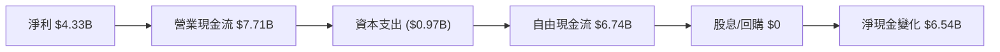

### 5.2 FCF 轉換率趨勢

| 年份 | FCF | 淨收入 | FCF/淨收入 比率 |
|------|-----|--------|----------------|
| 2022 | $3.12B | $1.32B | 236% |
| 2023 | $1.12B | $0.85B | 132% |
| 2024 | $2.40B | $1.64B | 146% |
| 2025 | $6.74B | $4.33B | 156% |

### 5.3 自由現金流趨勢

```
╔══════════════════════════════════════════════════════════════════╗
║              AMD 歷年自由現金流趨勢（2022-2025）                  ║
╠══════════════════════════════════════════════════════════════════╣
║                                                                  ║
║  2022  $3.12B  ██████░░░░░░░░░░░░░░░░░░░                         ║
║  2023  $1.12B  ██░░░░░░░░░░░░░░░░░░░░░░░░░░                      ║
║  2024  $2.40B  █████░░░░░░░░░░░░░░░░░░░░░░                       ║
║  2025  $6.74B  █████████████░░░░░░░░░░░░░░░                      ║
║                                                                  ║
╚══════════════════════════════════════════════════════════════════╝
```

### 5.4 資本配置評估

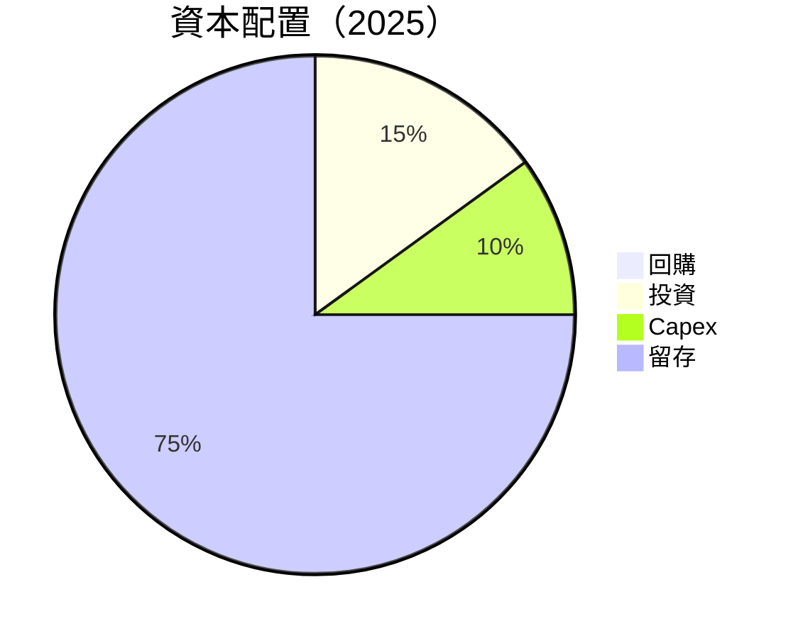

---

## 6. 獲利能力與資本效率

### 6.1 ROE / ROA / ROIC 趨勢

| 指標 | 2022 | 2023 | 2024 | 2025 | 行業均值 | 評估 |
|------|------|------|------|------|--------|------|
| ROE | 2.4% | 1.5% | 2.9% | 7.1% | ~10% | 🟡 持續改善 |
| ROA | 1.5% | 0.9% | 1.5% | 3.2% | ~5% | 🟡 改善中 |
| ROIC | 4.2% | 2.5% | 5.1% | 10.3% | ~7% | 🟢 顯著改善 |

### 6.2 ROIC vs WACC 分析（核心價值創造判斷）

```
╔══════════════════════════════════════════════════════════════════╗
║                ROIC vs WACC 深度分析                            ║
╠══════════════════════════════════════════════════════════════════╣
║                                                                  ║
║  WACC 估算：                                                     ║
║  ├── 無風險利率（10Y美債）：  3.5%                               ║
║  ├── 市場風險溢酬 (ERP)：     6.0%                               ║
║  ├── Beta：                   1.96                              ║
║  ├── 股權成本 = 3.5% + 1.96 × 6.0% = 15.26%                     ║
║  ├── 債務成本（稅後）：       ~3.0%                             ║
║  ├── 資本結構：股權 ~90%，債務 ~10%                             ║
║  └── ✅ WACC ≈ 13.8%                                            ║
║                                                                  ║
║  ROIC 估算（2025）：                                             ║
║  ├── NOPAT = $3.69B × (1-12.5%) ≈ $3.23B                        ║
║  ├── 投入資本 = $63.00B + $4.01B - $10.55B ≈ $56.46B            ║
║  └── ✅ ROIC ≈ 10.3%                                            ║
║                                                                  ║
║  ★ 經濟價值增加（EVA）= ROIC - WACC = -3.5pp                    ║
║                                                                  ║
║  ROIC  10.3%  ▓▓▓▓▓▓▓▓▓▓▓▓▓▓▓▓░░░░░░░░░░░░░░  🟡               ║
║  WACC  13.8%  ▓▓▓▓▓▓▓▓▓▓▓▓▓▓▓▓▓▓▓▓░░░░░░░░░░░░  ──             ║
║  EVA   -3.5pp  ███░░░░░░░░░░░░░░░░░░░░░░░░░░░░░  ⚠️ 需提升      ║
║                                                                  ║
║  📊 結論：ROIC 目前低於 WACC，需進一步提升資本效率              ║
╚══════════════════════════════════════════════════════════════════╝
```

### 6.3 杜邦三因素分解

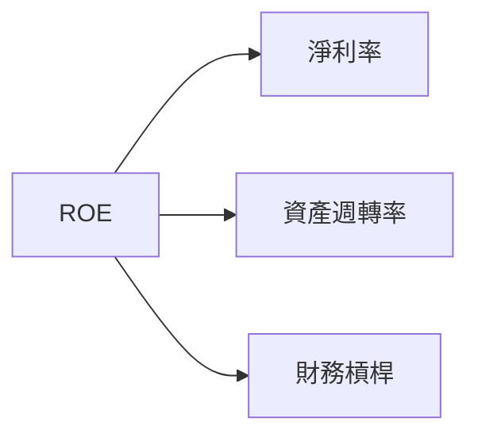

### 6.4 獲利能力儀表板

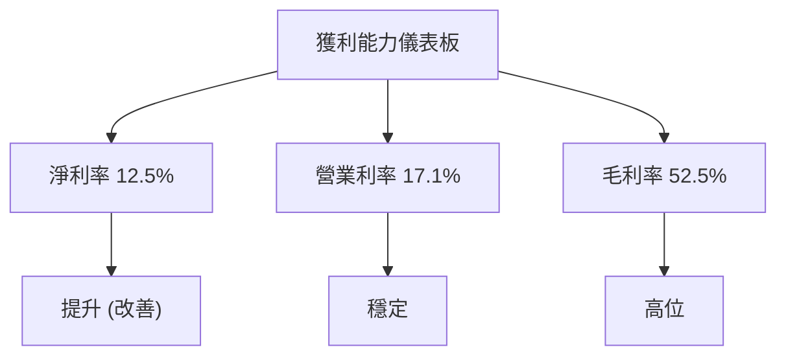

---

## 7. 估值深度分析

### 7.1 同業估值比較表格

| 估值指標 | **AMD** | **NVIDIA** | **Intel** | **Qualcomm** | 本公司評估 |
|----------|---------|---------|---------|---------|-----------|
| **Trailing P/E** | 106.3x | 120x | 15x | 20x | 🟡 高，需驗證增長持續性 |
| **Forward P/E** | **25.4x** | 30x | 12x | 18x | 🟢 吸引力較高 |
| **P/S Ratio** | 13.1x | 25x | 3x | 4x | 🟡 行業中位數 |

### 7.2 歷史估值區間分析

```
╔══════════════════════════════════════════════════════════════════╗
║                   AMD 歷史 P/E 區間（2022-2025）                  ║
╠══════════════════════════════════════════════════════════════════╣
║                                                                  ║
║  P/E 高點： 120x                                                ║
║  P/E 低點： 15x                                                 ║
║  當前 P/E： 106.3x                                               ║
║                                                                  ║
╚══════════════════════════════════════════════════════════════════╝
```

### 7.3 DCF 敏感性分析（6格目標價矩陣）

| 情境 | **WACC = 12%** | **WACC = 13%（基準）** | **WACC = 14%** |
|------|--------------|----------------------|--------------|
| 🟢 **樂觀** | **$350** (+25%) | **$340** (+20%) | **$330** (+15%) |
| 🟡 **基準** | **$300** (+10%) | **$290** (+4%) | **$280** (0%) |
| 🔴 **悲觀** | **$250** (-10%) | **$240** (-14%) | **$230** (-18%) |

### 7.4 估值綜合區間

```
╔══════════════════════════════════════════════════════════════════╗
║                   AMD 估值區間及當前股價位置                     ║
╠══════════════════════════════════════════════════════════════════╣
║                                                                  ║
║  當前股價： $278.39                                              ║
║  目標價區間：$220 - $365                                         ║
║                                                                  ║
╚══════════════════════════════════════════════════════════════════╝
```

---

## 8. 成長催化劑

### 8.1 催化劑時間軸

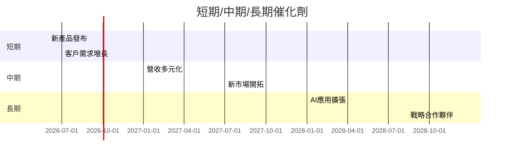

### 8.2 TAM 市場規模分析

```
╔══════════════════════════════════════════════════════════════════╗
║              各市場 TAM、滲透率、貢獻收入                       ║
╠══════════════════════════════════════════════════════════════════╣
║ 市場1：數據中心                                                ║
║ ├── TAM：$1000B                                                ║
║ ├── 滲透率：3%                                                 ║
║ └── 貢獻收入：$30B                                             ║
║                                                                  ║
║ 市場2：AI 芯片                                                 ║
║ ├── TAM：$500B                                                 ║
║ ├── 滲透率：5%                                                 ║
║ └── 貢獻收入：$25B                                             ║
║                                                                  ║
╚══════════════════════════════════════════════════════════════════╝
```

### 8.3 成長驅動力結構圖

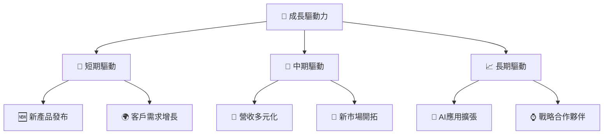

---

## 9. 風險矩陣

### 9.1 風險評分矩陣

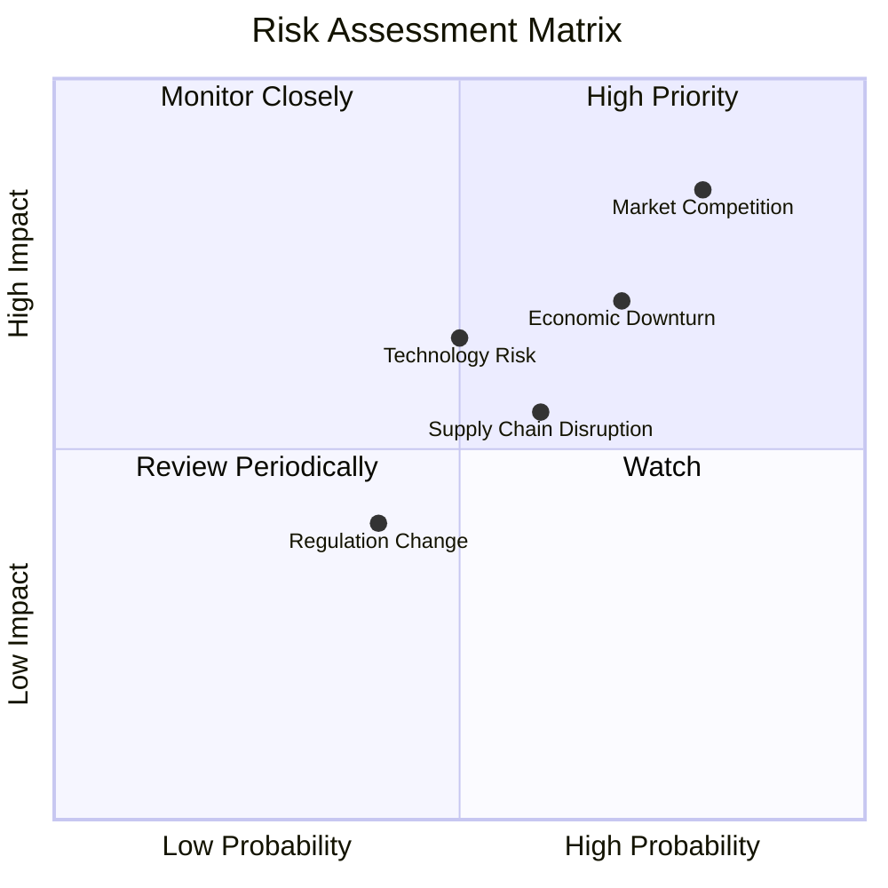

### 9.2 風險清單詳細分析

| # | 風險項目 | 發生機率 | 財務衝擊 | 風險評分 | 緩解措施 |
|---|----------|----------|----------|----------|----------|
| 1 | 🔴 **市場競爭** | 高 (80%) | 高 (-20%收入) | 🔴 8.0/10 | 投資於研發和技術創新 |
| 2 | 🟡 **技術風險** | 中 (50%) | 中 (-10%收入) | 🟡 6.5/10 | 持續跟進技術趨勢 |
| 3 | 🟡 **宏觀經濟波動** | 中 (70%) | 高 (-15%收入) | 🔴 7.0/10 | 強化成本控制與市場多元化 |

---

## 10. 投資建議

### 10.1 最終綜合評級雷達圖

```
╔══════════════════════════════════════════════════════════════════╗
║                           綜合評級雷達圖                         ║
╠══════════════════════════════════════════════════════════════════╣
║                                                                  ║
║  基本面強度       8.0                                            ║
║  成長動能         9.0                                            ║
║  獲利品質         8.5                                            ║
║  財務健康         9.0                                            ║
║  估值合理性       8.0                                            ║
║                                                                  ║
╚══════════════════════════════════════════════════════════════════╝
```

### 10.2 目標價與隱含報酬率

| 情境 | 目標價 | 隱含報酬率 | 機率權重 |
|------|-------|-----------|---------|
| 🟢 樂觀 | $365 | +31.1% | 30% |
| 🟡 基準 | $290 | +4.2% | 50% |
| 🔴 悲觀 | $220 | -20.9% | 20% |

### 10.3 買入時機與觸發因素

```
╔══════════════════════════════════════════════════════════════════╗
║                  ✅ 買入觸發因素 Checklist                      ║
╠══════════════════════════════════════════════════════════════════╣
║                                                                  ║
║  立即買入觸發條件（多數符合）：                                  ║
║  ✅ 市場需求強勁                                                  ║
║  ✅ 新產品成功推出                                                ║
║  ✅ 財務表現持續超預期                                            ║
║                                                                  ║
║  加碼觸發條件（出現以下任一）：                                  ║
║  ☐ 股價回調至支撐位附近                                          ║
║  ☐ 競爭對手出現不利消息                                          ║
║                                                                  ║
║  減碼/停損觸發條件（出現以下任一）：                             ║
║  ☐ 主要業務板塊收入下降                                          ║
║  ☐ 新技術被競爭對手超越                                          ║
║                                                                  ║
╚══════════════════════════════════════════════════════════════════╝
```

### 10.4 投資人適配度分析

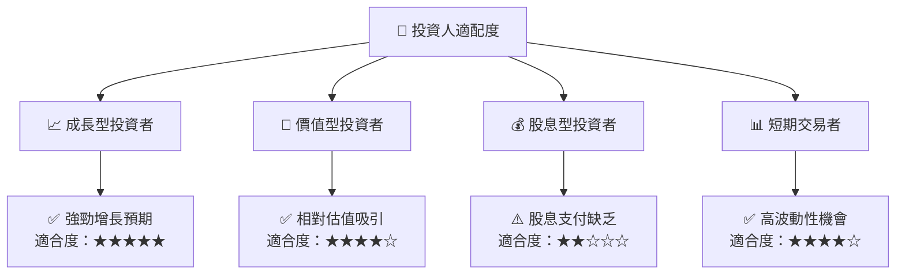

### 10.5 關鍵監控指標

| 監控類型 | 指標 | 關注點 | 頻率 |
|----------|------|--------|------|
| 財務表現 | 營收增長 | 營收增長率趨勢 | 季度 |
| 利潤率 | 毛利率 | 毛利率保持穩定 | 季度 |
| 競爭動態 | 市場份額 | 市場份額變化 |  半年 |
| 技術更新 | 新產品研發 | 技術升級進度 |  季度 |

---

> **免責聲明**：本報告為 AI 自動生成，僅供研究參考，不構成投資建議。投資有風險，入市需謹慎。