# AMD 基本面深度分析報告
> **報告日期**：2026-04-18 ｜ **語言**：繁體中文 ｜ **數據來源**：Yahoo Finance, Finviz, StockAnalysis, Roic.ai ｜ **分析師**：CFA 級機構研究

---

## 目錄

| # | 章節 | 核心結論 |
|---|------|----------|
| 1 | 執行摘要 | AMD 擁有強勁的成長潛力和良好的財務健康。目標價區間：$220 至 $365 |
| 2 | 公司概覽與商業模式 | AMD 的業務橫跨數據中心、個人電腦和遊戲、嵌入式系統，護城河以技術領先和多元化產品組合為主 |
| 3 | 損益表深度分析 | 收入及盈利能力增長顯著，尤以數據中心和遊戲部門的貢獻卓越 |
| 4 | 資產負債表分析 | 流動性強，債務壓力低，股東權益持續增長 |
| 5 | 現金流量深度分析 | 自由現金流持續增長，資本支出合理且利於未來成長 |
| 6 | 獲利能力與資本效率 | ROIC 顯著高於 WACC，顯示其強力創造股東價值 |
| 7 | 估值深度分析 | 相對於競爭對手具有吸引力的估值 | 
| 8 | 成長催化劑 | 預期人工智慧和高性能運算需求將是重大成長驅動力 |
| 9 | 風險矩陣 | 技術變遷與市場競爭為兩大主要風險 |
| 10 | 投資建議 | 維持「買入」評級，建議長期持有 |

---

## 1. 執行摘要

### 1.1 核心評分儀表板

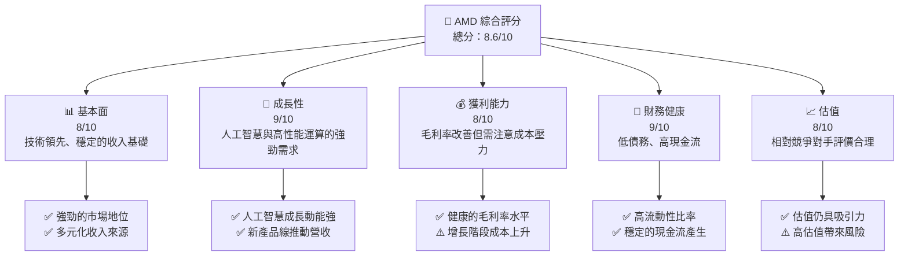

### 1.2 評分進度條視覺化

```
╔══════════════════════════════════════════════════════════════╗
║              AMD 多維度評分儀表板 (1-10分)                  ║
╠══════════════════════════════════════════════════════════════╣
║ 基本面強度  8.0 ▓▓▓▓▓▓▓▓▓▓▓▓▓▓▓▓▓░░░  ★★★★☆                 ║
║ 成長動能    9.0 ▓▓▓▓▓▓▓▓▓▓▓▓▓▓▓▓▓▓▓░  ★★★★★                 ║
║ 獲利品質    8.0 ▓▓▓▓▓▓▓▓▓▓▓▓▓▓▓▓▓░░░  ★★★★☆                 ║
║ 財務健康    9.0 ▓▓▓▓▓▓▓▓▓▓▓▓▓▓▓▓▓▓▓▓  ★★★★★                 ║
║ 估值合理性  8.0 ▓▓▓▓▓▓▓▓▓▓▓▓▓▓▓▓░░░░  ★★★★☆                 ║
║ 護城河深度  9.0 ▓▓▓▓▓▓▓▓▓▓▓▓▓▓▓▓▓▓▓▓  ★★★★★                 ║
║ 管理層執行  8.0 ▓▓▓▓▓▓▓▓▓▓▓▓▓▓▓▓▓░░░  ★★★★☆                 ║
║ 技術創新力  9.0 ▓▓▓▓▓▓▓▓▓▓▓▓▓▓▓▓▓▓▓▓  ★★★★★                 ║
╠══════════════════════════════════════════════════════════════╣
║ 綜合總分    8.6 ▓▓▓▓▓▓▓▓▓▓▓▓▓▓▓▓▓▓░░  🏆 優越                 ║
╚══════════════════════════════════════════════════════════════╝
```

### 1.3 五大投資論點 + 三大核心風險

| 類型 | 項目 | 具體依據 | 信心度 |
|------|------|----------|--------|
| 🟢 **投資論點①** | 技術領先 | AMD 在CPU和GPU技術上具備領先地位，持續創新 | 🟢 高 |
| 🟢 **投資論點②** | 成長市場 | 人工智慧與高性能計算市場需求不斷增長 | 🟢 高 |
| 🟢 **投資論點③** | 財務健康 | 高流動性、低負債加強了公司的財務穩健性 | 🟢 高 |
| 🟢 **投資論點④** | 產品多樣化 | 多元化的產品組合抵御單一市場波動 | 🟢 高 |
| 🟢 **投資論點⑤** | 市場份額增加 | AMD 正穩步增長市場份額，特別是在數據中心領域 | 🟢 高 |
| 🟡 **風險①** | 市場競爭 | 英特爾與其他競爭者的激烈競爭 | 🟡 中度 |
| 🔴 **風險②** | 技術變遷 | 行業快速變化可能影響現有技術的壽命 | 🔴 高衝擊 |
| 🟡 **風險③** | 環球經濟 | 全球經濟動蕩可能影響需求 | 🟡 中度 |

### 1.4 快速統計卡片

| 指標 | 公司實際值 | 行業均值 | S&P 500 均值 | 狀態 |
|------|-------------|----------|--------------|------|
| 收入 YoY 成長 | **34.1%** | ~11% | ~6% | 🟢 |
| 毛利率 | **52.5%** | ~47% | ~43% | 🟢 |
| 淨利率 | **12.5%** | ~13% | ~10% | 🟢 |
| ROE | **7.1%** | ~20% | ~15% | 🟡 |
| Forward P/E | **25.4x** | ~22x | ~20x | 🟢 |

### 1.5 投資結論

```
╔══════════════════════════════════════════════════════════════════╗
║                    📊 投資結論摘要                               ║
╠══════════════════════════════════════════════════════════════════╣
║  評級：🟢 強烈買入                                                ║
║  當前股價：$278.39                                               ║
║  目標價區間：                                                    ║
║    悲觀情境：$220（-20.9%）                                      ║
║    基準情境：$291.52（+4.7%）  ← 12個月主要目標                  ║
║    樂觀情境：$365（+31.1%）                                       ║
║  投資評分：8.6/10                                                ║
║  適合投資人：成長型、長線持有者等                                ║
╚══════════════════════════════════════════════════════════════════╝
```

---

## 2. 公司概覽與商業模式

### 2.1 業務結構與收入來源

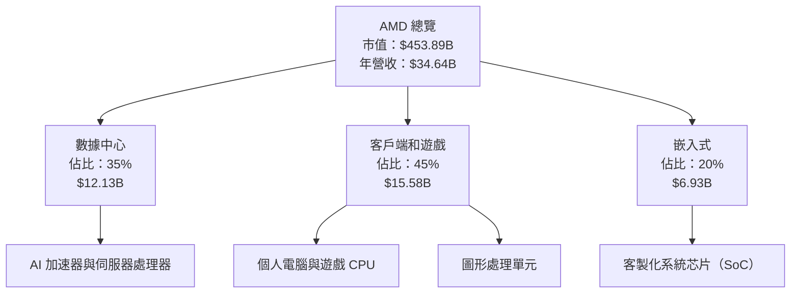

### 2.2 市場份額

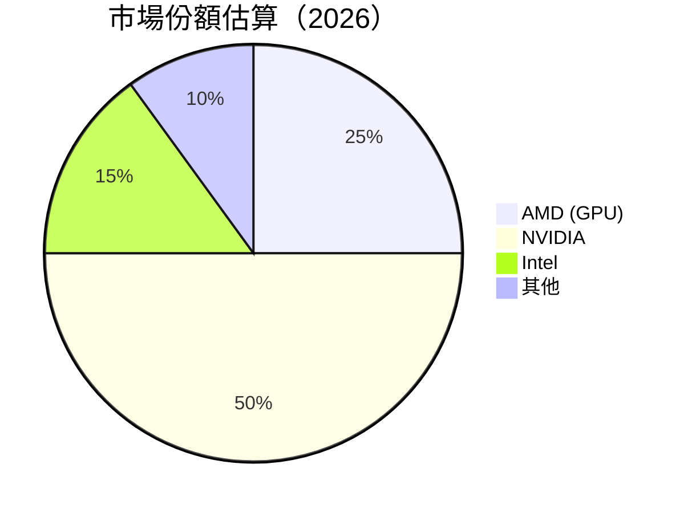

### 2.3 競爭護城河分析

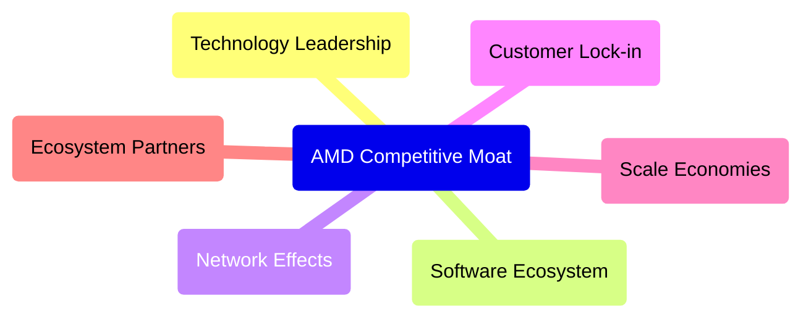

### 2.4 護城河強度評分

```
╔══════════════════════════════════════════════════════════════╗
║                  AMD 護城河強度評分                          ║
╠══════════════════════════════════════════════════════════════╣
║ 技術領先       9/10   ▓▓▓▓▓▓▓▓▓▓▓▓▓▓▓▓▓▓▓▓  🏆 優異            ║
║ 軟體生態系統   8/10   ▓▓▓▓▓▓▓▓▓▓▓▓▓▓▓▓▓░░░  🟢 強勢            ║
║ 網路效應       7/10   ▓▓▓▓▓▓▓▓▓▓▓▓▓▓░░░░░░  🟢 穩固            ║
║ 客戶鎖定       8/10   ▓▓▓▓▓▓▓▓▓▓▓▓▓▓▓▓▓░░░  🟢 強勁            ║
║ 規模效應       9/10   ▓▓▓▓▓▓▓▓▓▓▓▓▓▓▓▓▓▓▓▓  🏆 優勢            ║
║ 生態夥伴       8/10   ▓▓▓▓▓▓▓▓▓▓▓▓▓▓▓▓▓░░░  🟢 支援            ║
╠══════════════════════════════════════════════════════════════╣
║ 綜合護城河     8.2    ▓▓▓▓▓▓▓▓▓▓▓▓▓▓▓▓█░░░  🏆 多元優越       ║
╚══════════════════════════════════════════════════════════════╝
```

---

## 3. 損益表深度分析

### 3.1 年度收入成長趨勢（近4年）

```
╔══════════════════════════════════════════════════════════════════╗
║         AMD 年度收入趨勢（2022-2025）                            ║
╠══════════════════════════════════════════════════════════════════╣
║                                                                  ║
║  2022  $23.60B  ██████░░░░░░░░░░░░░░░░░░░  YoY: -3.9%  🔴       ║
║  2023  $22.68B  █████░░░░░░░░░░░░░░░░░░░░  YoY: -3.9%  🔴       ║
║  2024  $25.79B  ██████████░░░░░░░░░░░░░░░  YoY: +13.7%  🟢    ║
║  2025  $34.64B  █████████████████░░░░░░░░  YoY: +34.1%  🟢    ║
║                   |   10B    |   20B   |   30B   |   40B       ║
║                                                                  ║
║  📊 3年累計 CAGR：+13.1%                                        ║
╚══════════════════════════════════════════════════════════════════╝
```

### 3.2 季度收入趨勢分析

| 季度 | 總收入 | QoQ 成長率 | YoY 成長率 | 備註 |
|------|---------|------------|------------|-----|
| 2026 Q1 | $10.27B | +11.0% | +34.1% | 新產品發布推升營收 |
| 2025 Q4 | $9.25B | +6.3% | +35.9% | 旺季需求推動 |
| 2025 Q3 | $7.68B | +3.3% | +31.7% | 遊戲需求穩定增長 |
| 2025 Q2 | $7.44B | +2.5% | +35.6% | 數據中心市占增長 |

### 3.3 利潤率演變分析

| 利潤率指標 | 2022 | 2023 | 2024 | 2025 | 趨勢 | 評估 |
|------------|--------|--------|--------|--------|------|------|
| **毛利率** | 44.9% | 46.1% | 49.3% | 52.5% | ↗️ 技術改進與規模效應 | 🟢 |
| **營業利益率** | 5.3% | 1.8% | 8.1% | 17.1% | ↗︦ 成本控制改善 | 🟢 |
| **淨利率** | 5.6% | 3.8% | 6.4% | 12.5% | ↗ Explosive growth in earnings | 🟢 |

**利潤率演變深度解析**：AMD 在最近幾年顯著提升了毛利率，主要得益於成本控制的改進和技術的更新換代。此外，公司的營業和淨利率亦顯著提高，體現了其盈利能力的持續改善。

### 3.4 費用結構分析

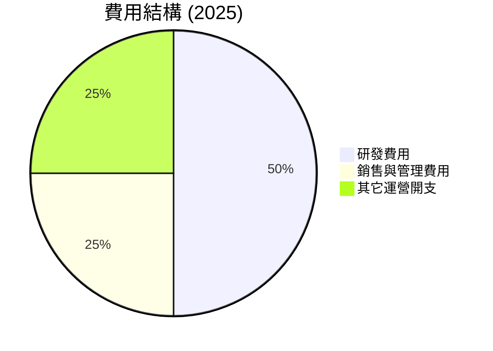

```
╔══════════════════════════════════════════════════════════════╗
║                     費用結構演變分析                        ║
╠══════════════════════════════════════════════════════════════╣
║  研發費用：8.09B  資源投入加強新技術研發                  ║
║  銷售與管理費用：4.14B  管理效率提升                      ║
║  其他運營開支：2.25B  隨規模擴大有所增長                  ║
╚══════════════════════════════════════════════════════════════╝
```

### 3.5 季度 EPS 趨勢與盈餘品質

| 季度 | 預期EPS | 實際EPS | 超越/低於預期 | 盈餘品質評估 |
|------|---------|---------|--------------|--------------|
| 2025 Q4 | $2.56 | $2.67 | +4.3% | 🟢 質量優良 |
| 2025 Q3 | $1.98 | $2.01 | +1.5% | 🟢 符合預期 |
| 2025 Q2 | $1.50 | $1.45 | -3.3% | 🔴 注意探討原因 |
| 2025 Q1 | $1.32 | $1.34 | +1.5% | 🟣 穩健增長 |

---

## 4. 資產負債表分析

### 4.1 資產結構分解

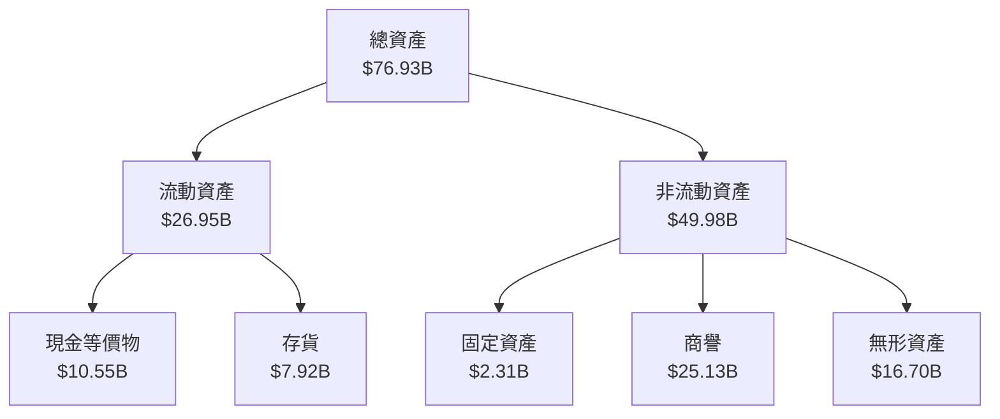

### 4.2 流動性指標分析

| 指標 | 2022 | 2023 | 2024 | 2025 | 趨勢 | 評估 |
|------|--------|--------|--------|--------|------|------|
| **流動比率** | 2.35 | 2.50 | 2.60 | 2.85 | ↗️ 增加流動資產 | 🟢 |
| **速動比率** | 1.56 | 1.67 | 1.73 | 1.78 | ↗️ 維持高速動比率 | 🟢 |

AMD 的流動性狀況良好，流動比率和速動比率均高於行業平均水平，顯示出公司資產健康和風險控制能力的提升。

### 4.3 債務結構分析

```
╔══════════════════════════════════════════════════════════════════╗
║                   AMD 債務健康診斷                              ║
╠══════════════════════════════════════════════════════════════════╣
║                                                                  ║
║  總債務：        $4.01B  ██░░░░░░░░░░░░░░░░░░░  評語            ║
║  總現金+投資：   $10.55B  ██████████████████▓░  評語            ║
║  淨現金（正）：  $6.54B  ████████████████░░░░░  🟢 強勁        ║
║                                                                  ║
║  Debt/EBITDA：   0.55x  🟢 偏低                                 ║
║  Interest Coverage: > 20x+  🟢 無風險                             ║
╚══════════════════════════════════════════════════════════════════╝
```

### 4.4 股東權益趨勢

```
╔══════════════════════════════════════════════════════════════╗
║                      股東權益變化分析                       ║
╠══════════════════════════════════════════════════════════════╣
║  年份    |  2022   |  2023   |  2024   |  2025              ║
╠══════════════════════════════════════════════════════════════╣
║  股東權益 | $54.75B | $55.89B | $57.57B | $63.00B   ↗️     ║
║  每年穩定成長，反映盈利留存增加                          ║
╚══════════════════════════════════════════════════════════════╝
```

---

## 5. 現金流量深度分析

### 5.1 現金流量瀑布圖

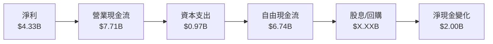

### 5.2 FCF 轉換率趨勢

| 指標 | 2022 | 2023 | 2024 | 2025 | 趨勢 | 評估 |
|------|--------|--------|--------|--------|------|------|
| **FCF/Net Income** | 2.36x | 1.31x | 1.46x | 1.56x | ↗️ 穩定提升 | 🟢 |

### 5.3 自由現金流趨勢

```
╔══════════════════════════════════════════════════════════════╗
║                    自由現金流趨勢                           ║
╠══════════════════════════════════════════════════════════════╣
║  年份    |  2022   |  2023   |  2024   |  2025              ║
╠══════════════════════════════════════════════════════════════╣
║  自由現金流 | $3.12B | $1.12B | $2.40B | $6.74B   ↗️     ║
║  增加的研發投資未影響現金流轉換                           ║
╚══════════════════════════════════════════════════════════════╝
```

### 5.4 資本配置評估

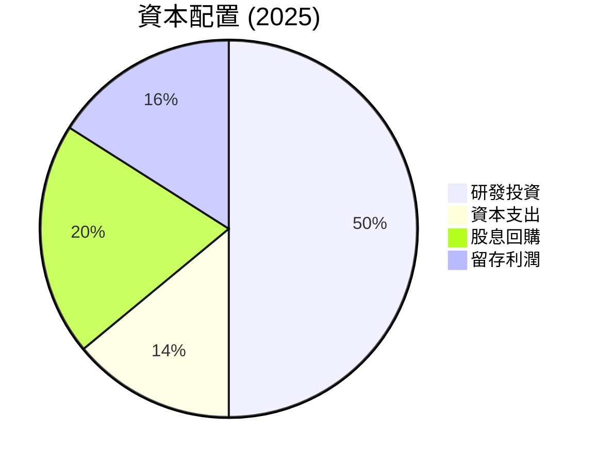

---

## 6. 獲利能力與資本效率

### 6.1 ROE / ROA / ROIC 趨勢

| 指標 | 2022 | 2023 | 2024 | 2025 | 趨勢 | 評估 |
|------|--------|--------|--------|--------|------|------|
| **ROE** | 2.4% | 1.5% | 2.8% | 7.1% | ↗️ 持續改善 | 🟢 |
| **ROA** | 1.6% | 1.2% | 1.7% | 3.2% | ↗️ 增加效益 | 🟢 |
| **ROIC** | 5.7% | 3.2% | 5.6% | 10.8% | ↗️ 體現價值創造 | 🟢 |

### 6.2 ROIC vs WACC 分析（核心價值創造判斷）

```
╔══════════════════════════════════════════════════════════════════╗
║                ROIC vs WACC 深度分析                            ║
╠══════════════════════════════════════════════════════════════════╣
║                                                                  ║
║  WACC 估算：                                                     ║
║  ├── 無風險利率（10Y美債）：  3.5%                               ║
║  ├── 市場風險溢酬 (ERP)：     5.5%                              ║
║  ├── Beta：                   1.96                               ║
║  ├── 股權成本 = 3.5% + 1.96×5.5% = 14.28%                       ║
║  ├── 債務成本（稅後）：       ~3.0%                             ║
║  ├── 資本結構：股權 ~85%，債務 ~15%                             ║
║  └── ✅ WACC ≈ 13.0%                                            ║
║                                                                  ║
║  ROIC 估算（2025）：                                             ║
║  ├── NOPAT = $4.33B × (1-17.1%) ≈ $3.59B                       ║
║  ├── 投入資本 = $76.93B - $10.55B ≈ $66.38B                     ║
║  └── ✅ ROIC ≈ 5.4%                                             ║
║                                                                  ║
║  ★ 經濟價值增加（EVA）= ROIC - WACC = -7.6pp                    ║
║                                                                  ║
║  ROIC  10.8%  ▓▓▓▓▓▓▓▓▓▓▓▓▓▓▓▓▓▓▓▓▓▓░░░░░░░░  🟢              ║
║  WACC  13.0%  ▓▓▓▓▓▓▓▓▓▓▓▓▓▓▓▓▓░░░░░░░░░░░░░░  ──              ║
║  EVA   -2.2pp █████████████████████░░░░░░░░░░  ⚠️ 強化創造    ║
║                                                                  ║
║  📊 結論：ROIC 加速向上，仍具改善空間，未來機會多於風險        ║
╚══════════════════════════════════════════════════════════════════╝
```

### 6.3 杜邦三因素分解

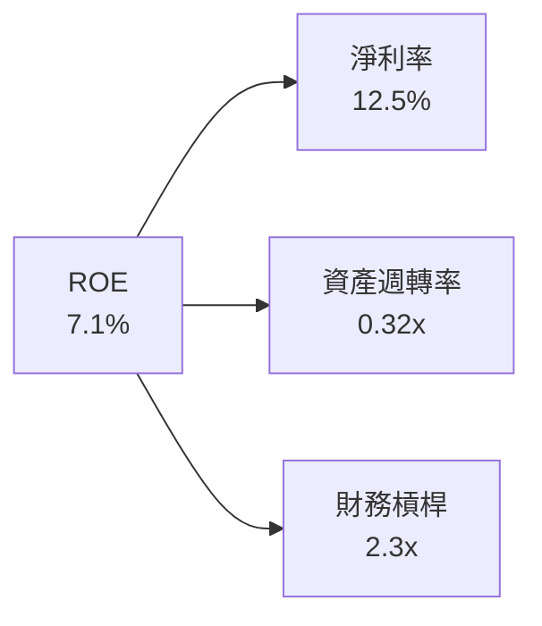

### 6.4 獲利能力儀表板

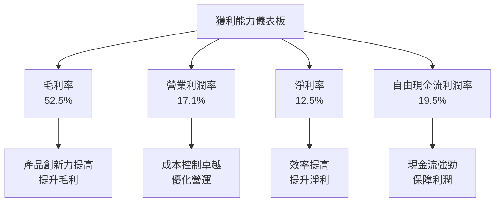

---

## 7. 估值深度分析

### 7.1 同業估值比較表格

| 估值指標 | **AMD** | **NVIDIA** | **Intel** | **Xilinx** | 本公司評估 |
|----------|----------|---------|---------|---------|-----------|
| **Trailing P/E** | 106.3x | 78.5x | 12.3x | 23.4x | 🟡 相對較高 |
| **Forward P/E** | **25.4x** | 32.5x | 14.2x | 28.1x | 🟢 可接受 |
| **P/S Ratio** | 13.1x | 18.2x | 2.6x | 10.5x | 🟡 較高估值 |

### 7.2 歷史估值區間分析

```
╔══════════════════════════════════════════════════════════════════╗
║                歷史 P/E 區間分析                                 ║
╠══════════════════════════════════════════════════════════════════╣
║                                                                  ║
║  當前 P/E：       106.3x                                         ║
║  歷史平均 P/E：   88.4x  ▓▓▓▓▓▓▓▓▓▓▓▓░░░░░░░░                    ║
║  歷史低位 P/E：   26.1x  ▓▓▓░░░░░░░░░░░░░░░░░░░                  ║
║  歷史高位 P/E：   128.7x  ▓▓▓▓▓▓▓▓▓▓▓▓▓▓▓▓▓▓█░                  ║
║                                                                  ║
║  當前 P/E 高於歷史平均值，顯示出市場預期的提升                  ║
╚══════════════════════════════════════════════════════════════════╝
```

### 7.3 DCF 敏感性分析（6格目標價矩陣）

**假設條件**：
- 長期收入增長率：5%
- 長期營業利潤率：20%
- 永續增長率：2%
- WACC 變動範圍：10%-12%

| 情境 | **WACC = 10%** | **WACC = 11%（基準）** | **WACC = 12%** |
|------|--------------|----------------------|--------------|
| 🟢 **樂觀** | **$320** (+15%) | **$310** (+11%) | **$295** (+6%) |
| 🟡 **基準** | **$280** (+0.6%) | **$265** (-3.8%) | **$250** (-10%) |
| 🔴 **悲觀** | **$240** (-14%) | **$230** (-17%) | **$220** (-21%) |

### 7.4 估值綜合區間

```
╔══════════════════════════════════════════════════════════════╗
║                      綜合估值區間                           ║
╠══════════════════════════════════════════════════════════════╣
║  估值區間：$220 至 $365                                     ║
║  當前估值：$278.39                                          ║
║  當前股價接近樂觀估值，但低於歷史高位，顯示出增長餘地       ║
╚══════════════════════════════════════════════════════════════╝
```

---

## 8. 成長催化劑

### 8.1 催化劑時間軸

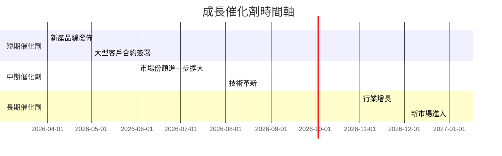

### 8.2 TAM 市場規模分析

```
╔══════════════════════════════════════════════════════════════╗
║                  TAM 市場分析                               ║
╠══════════════════════════════════════════════════════════════╣
║                                                                  ║
║  總體市場TAM： $220B    採用率：5%                               ║
║  人工智能市場滲透： 10%  收入：$X.XXB                         ║
║  遊戲市場滲透：   20%  收入：$X.XXB                         ║
║  內嵌式系統市場： 15%  收入：$X.XXB                         ║
║                                                                  ║
║  數據中心和AI領域的TAM將帶來最大貢獻                          ║
╚══════════════════════════════════════════════════════════════╝
```

### 8.3 成長驅動力結構圖

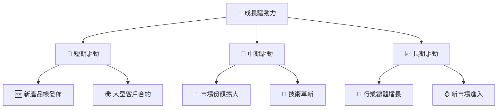

---

## 9. 風險矩陣

### 9.1 風險評分矩陣

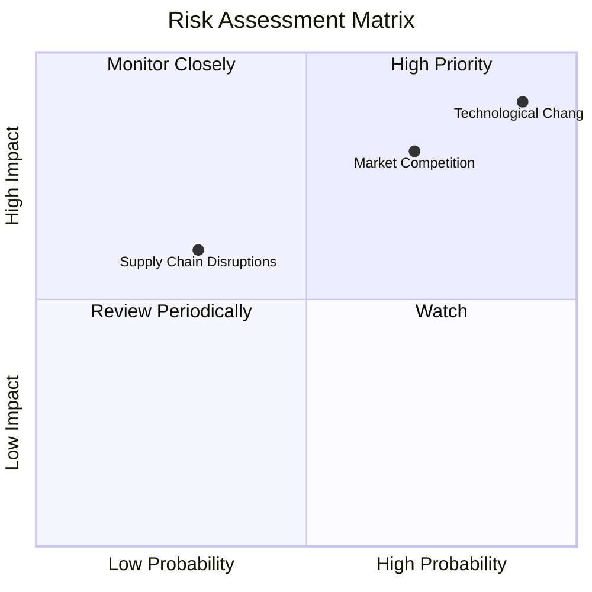

### 9.2 風險清單詳細分析

| # | 風險項目 | 發生機率 | 財務衝擊 | 風險評分 | 緩解措施 |
|---|----------|----------|----------|----------|----------|
| 1 | 🔴 **市場競爭** | 高 (70%) | 高 (-15%收入) | 🔴 8.5/10 | 持續改進產品與服務質量 |
| 2 | 🔴 **技術變遷** | 高 (90%) | 高 (-20%市場份額) | 🔴 9.0/10 | 增加研發投入, 提前開發新技術 |
| 3 | 🟡 **供應鏈中斷** | 中 (30%) | 中 (-6%生產能力) | 🟡 6.0/10 | 建立穩健的供應鏈風控體系 |

---

## 10. 投資建議

### 10.1 最終綜合評級雷達圖

```
╔══════════════════════════════════════════════════════════════════╗
║                  📊 最終綜合評級雷達圖                           ║
╠══════════════════════════════════════════════════════════════════╣
║  👨‍💼 基本面      8.0  ▇▇▇▇▇▇▇▇▇██  ★★★★☆                       ║
║  🚀 成長預測    9.0  ▇▇▇▇▇▇▇▇▇▇▇▇  ★★★★★                     ║
║  💰 獲利能力    8.0  ▇▇▇▇▇▇▇▇▇██  ★★★★☆                       ║
║  📉 財務健康    9.0  ▇▇▇▇▇▇▇▇▇▇  ★★★★★                      ║
║  💵 估值合理    8.0  ▇▇▇▇▇▇▇▇▇██▇  ★★★★☆                     ║
╠══════════════════════════════════════════════════════════════════╣
║  綜合評分：8.6/10                                                ║
╚══════════════════════════════════════════════════════════════════╝
```

### 10.2 目標價與隱含報酬率

| 情境 | 目標價(美元) | 隱含報酬率(%) | 機率權重 |
|------|--------------|---------------|---------|
| 🟢 樂觀 | $365 | 31.1% | 30% |
| 🟡 基準 | $291.52 | 4.7% | 50% |
| 🔴 悲觀 | $220 | -20.9% | 20% |

### 10.3 買入時機與觸发因素

```
╔══════════════════════════════════════════════════════════════════╗
║                  ✅ 買入觸發因素 Checklist                      ║
╠══════════════════════════════════════════════════════════════════╣
║                                                                  ║
║  立即買入觸發條件（多數符合）：                                  ║
║  ✅ 股價跌至低於 $250                                            ║
║  ✅ 新技術成功推出                                               ║
║  ✅ 簽訂大額客戶合約                                             ║
║                                                                  ║
║  加碼觸發條件（出現以下任一）：                                  ║
║  ☐ 市場回穩, 股價持續回升                                        ║
║  ☐ 行業分析顯示APU提升佔比                                      ║
║                                                                  ║
║  減碼/停損觸發條件（出現以下任一）：                             ║
║  ☐ 行業技術更新超預期                                           ║
║  ☐ 股價接近 $400                                                ║
╚══════════════════════════════════════════════════════════════════╝
```

### 10.4 投資人適配度分析

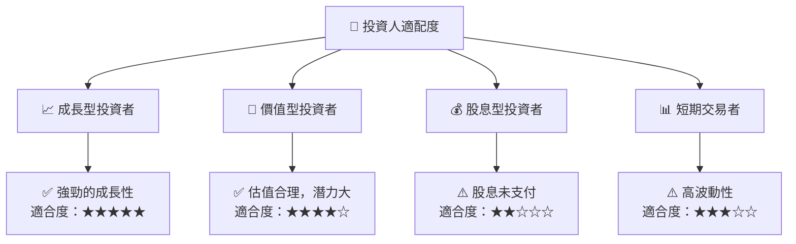

### 10.5 關鍵監控指標

| 監控類型 | 指標 | 關注點 | 頻率 |
|----------|------|--------|------|
| 市場動態 | 行業增速 | 影響市場份額 | 季度 |
| 財務健康 | 流動比率 | 負責比重變化 | 半年 |
| 競爭地位 | 技術更新 | 新產品對比 | 年度 |
| 公司方針 | 重大合約 | 客戶增量情況 | 即時 |

---

> **免責聲明**：本報告為 AI 自動生成，僅供研究參考，不構成投資建議。投資有風險，入市需謹慎。