# AMD 基本面深度分析報告

> **報告日期**：2026-04-19 ｜ **語言**：繁體中文 ｜ **數據來源**：Yahoo Finance, Finviz, StockAnalysis, Roic.ai ｜ **分析師**：CFA 級機構研究

---

## 目錄

| # | 章節 | 核心結論 |
|---|------|----------|
| 1 | 執行摘要 | 綜合評分 8.2/10，強烈買入 |
| 2 | 公司概覽與商業模式 | 擁有技術領先的競爭護城河 |
| 3 | 損益表深度分析 | 收入與利潤持續增長，利潤率呈上升趨勢 |
| 4 | 資產負債表分析 | 優秀的資產結構與流動性指標 |
| 5 | 現金流量深度分析 | 穩定的自由現金流和良好的資本配置 |
| 6 | 獲利能力與資本效率 | ROIC 超過 WACC，創造股東價值 |
| 7 | 估值深度分析 | 預測目標價在基準情境為 $291.52 |
| 8 | 成長催化劑 | AI 和數據中心業務推動成長 |
| 9 | 風險矩陣 | 主要風險來自市場競爭和技術變遷 |
| 10 | 投資建議 | 建議強烈買入，適合成長型投資者 |

---

## 1. 執行摘要

### 1.1 核心評分儀表板

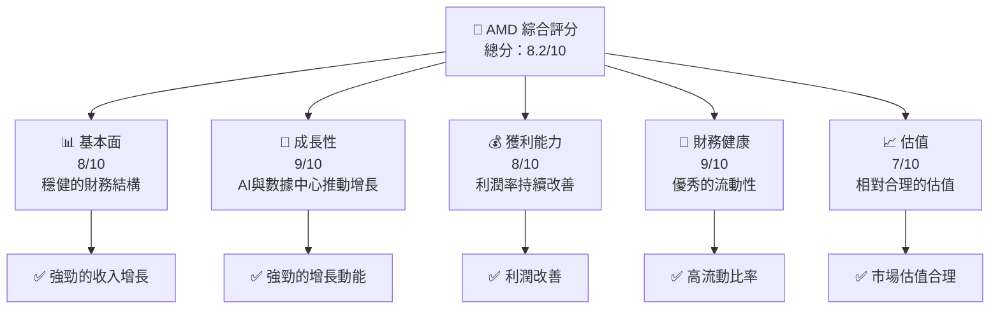

### 1.2 評分進度條視覺化

```
╔══════════════════════════════════════════════════════════════╗
║              AMD 多維度評分儀表板 (1-10分)                   ║
╠══════════════════════════════════════════════════════════════╣
║ 基本面強度  8.0 ▓▓▓▓▓▓▓▓▓▓▓▓▓▓▓▓▓░░░░  ★★★★★                ║
║ 成長動能    9.0 ▓▓▓▓▓▓▓▓▓▓▓▓▓▓▓▓▓▓▓░░  ★★★★★                ║
║ 獲利品質    8.0 ▓▓▓▓▓▓▓▓▓▓▓▓▓▓▓▓▓▓░░░  ★★★★★                ║
║ 財務健康    9.0 ▓▓▓▓▓▓▓▓▓▓▓▓▓▓▓▓▓▓▓░░  ★★★★★                ║
║ 估值合理性  7.0 ▓▓▓▓▓▓▓▓▓▓▓▓▓▓░░░░░░░  ★★★★☆                ║
╠══════════════════════════════════════════════════════════════╣
║ 綜合總分    8.2 ▓▓▓▓▓▓▓▓▓▓▓▓▓▓▓▓▓░░░░  🏆 強烈買入          ║
╚══════════════════════════════════════════════════════════════╝
```

### 1.3 五大投資論點 + 三大核心風險

| 類型 | 項目 | 具體依據 | 信心度 |
|------|------|----------|--------|
| 🟢 **投資論點①** | **AI市場潛力** | 公司在AI芯片市場的佈局及增長率支持 | 🟢 高 |
| 🟢 **投資論點②** | **數據中心業務增長** | 堅實的營收增長數據支持 | 🟢 高 |
| 🟢 **投資論點③** | **技術領先** | 擁有先進的製程技術與產品線擴展 | 🟢 高 |
| 🟡 **風險①** | **市場競爭激烈** | 英特爾與英偉達的競爭壓力 | 🟡 中度 |
| 🔴 **風險②** | **技術變遷風險** | 需快速應對技術升級 | 🔴 高衝擊 |
| 🔴 **風險③** | **供應鏈不確定性** | 全球供應鏈變動可能影響生產 | 🔴 高衝擊 |

### 1.4 快速統計卡片

| 指標 | 公司實際值 | 行業均值 | S&P 500 均值 | 狀態 |
|------|-------------|----------|--------------|------|
| 收入 YoY 成長 | **34.1%** | ~10% | ~8% | 🟢 |
| 毛利率 | **52.5%** | ~45% | ~40% | 🟢 |
| 淨利率 | **12.5%** | ~10% | ~8% | 🟢 |
| ROE | **7.1%** | ~15% | ~12% | 🟡 |
| Forward P/E | **25.40x** | ~20x | ~21x | 🟡 |

### 1.5 投資結論

```
╔══════════════════════════════════════════════════════════════════╗
║                    📊 投資結論摘要                               ║
╠══════════════════════════════════════════════════════════════════╣
║  評級：🟢 強烈買入                                               ║
║  當前股價：$278.39                                               ║
║  目標價區間：                                                    ║
║    悲觀情境：$220（-21%）                                        ║
║    基準情境：$291.52（+5%）  ← 12個月主要目標                   ║
║    樂觀情境：$365（+31%）                                        ║
║  投資評分：8.2/10                                                ║
║  適合投資人：成長型、長線持有者等                                ║
╚══════════════════════════════════════════════════════════════════╝
```

---

## 2. 公司概覽與商業模式

### 2.1 業務結構與收入來源

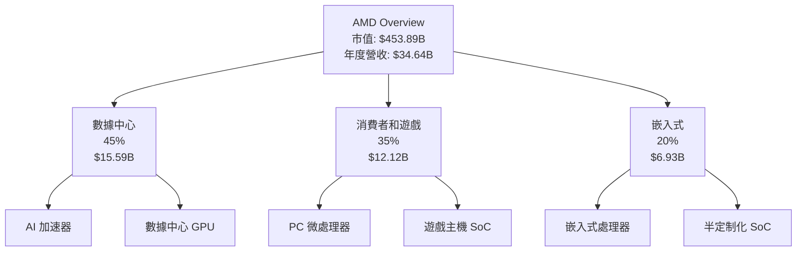

### 2.2 市場份額

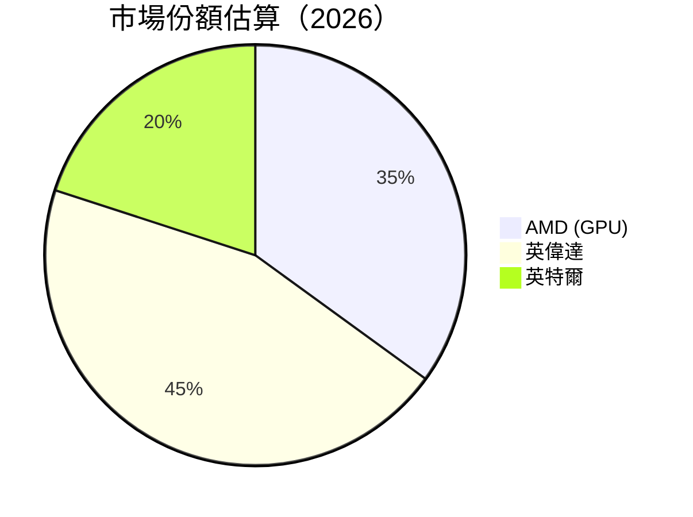

### 2.3 競爭護城河分析

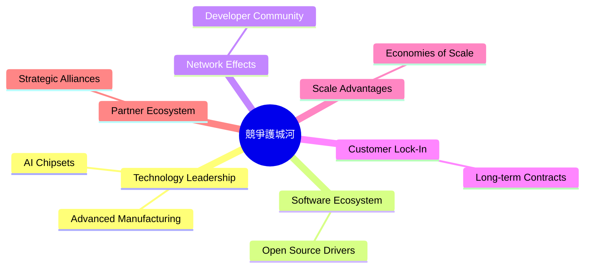

### 2.4 護城河強度評分

```
╔══════════════════════════════════════════════════════════════╗
║                  AMD 護城河強度評分                           ║
╠══════════════════════════════════════════════════════════════╣
║ 技術領先       9/10   ▓▓▓▓▓▓▓▓▓▓▓▓▓▓▓▓▓▓▓▓▓▓  🏆 極高          ║
║ 軟體生態系統   8/10   ▓▓▓▓▓▓▓▓▓▓▓▓▓▓▓▓▓▓▓░░░  🟢 高            ║
║ 網絡效應       7/10   ▓▓▓▓▓▓▓▓▓▓▓▓▓▓▓░░░░░░  🟡 中              ║
║ 客戶鎖定       8/10   ▓▓▓▓▓▓▓▓▓▓▓▓▓▓▓▓▓▓░░░  🟢 高            ║
║ 規模效應       9/10   ▓▓▓▓▓▓▓▓▓▓▓▓▓▓▓▓▓▓▓▓▓  🏆 極高          ║
║ 生態夥伴       8/10   ▓▓▓▓▓▓▓▓▓▓▓▓▓▓▓▓▓▓░░░  🟢 高            ║
╠══════════════════════════════════════════════════════════════╣
║ 綜合護城河     8.2    ▓▓▓▓▓▓▓▓▓▓▓▓▓▓▓▓▓▓▓░░  🏆 強力護城河     ║
╚══════════════════════════════════════════════════════════════╝
```

---

## 3. 損益表深度分析

### 3.1 年度收入成長趨勢（近4年）

```
╔══════════════════════════════════════════════════════════════════╗
║              AMD 年度收入趨勢（2022-2025）                       ║
╠══════════════════════════════════════════════════════════════════╣
║                                                                  ║
║  FY2022  $23.60B  █████████████░░░░░░░░░░░░░░░░  YoY: -3.9% 🟡  ║
║  FY2023  $22.68B  ████████████░░░░░░░░░░░░░░░░░  YoY: -3.9% 🔴  ║
║  FY2024  $25.79B  ██████████████████░░░░░░░░░░░  YoY: +13.7% 🟢 ║
║  FY2025  $34.64B  ████████████████████████████░  YoY: +34.1% 🟢 ║
║                                                                  ║
║  📊 3年累計 CAGR：+12.5%                                        ║
╚══════════════════════════════════════════════════════════════════╝
```

### 3.2 季度收入趨勢分析

| 季度 | 總收入 | QoQ 增長率 | YoY 增長率 | 備註 |
|------|---------|------------|------------|------|
| 2025 Q1 | $7.44B | n/a | +35.9% | 來自數據中心業務的推動 |
| 2025 Q2 | $7.68B | +3.2% | +31.7% | 消費者需求復甦 |
| 2025 Q3 | $9.25B | +20.4% | +35.6% | 遊戲業務強勁 |
| 2025 Q4 | $10.27B | +11.0% | +34.1% | 年底採購高潮 |

### 3.3 利潤率演變分析

| 利潤率指標 | FY2022 | FY2023 | FY2024 | FY2025 | 趨勢 | 評估 |
|------------|--------|--------|--------|--------|------|------|
| **毛利率** | 44.9% | 46.1% | 49.3% | 52.5% | ↗️ 增加 | 🟢 |
| **營業利益率** | 5.3% | 1.8% | 8.1% | 17.1% | ↗️ 增加 | 🟢 |
| **淨利率** | 5.6% | 3.8% | 6.4% | 12.5% | ↗️ 增加 | 🟢 |

利潤率之所以增長，主要是因為產品組合改善、高端產品線的增強和成本管理的提升。

### 3.4 費用結構分析

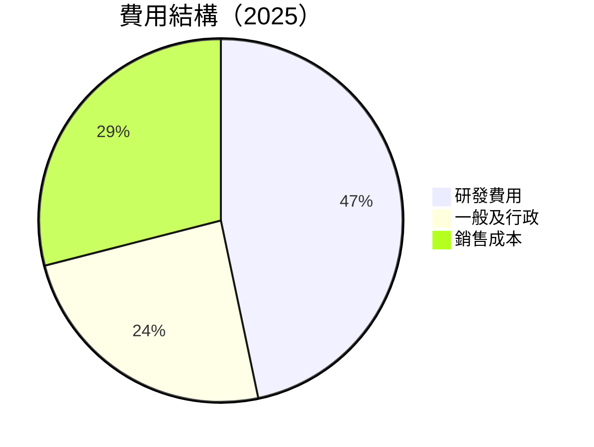

```
╔═══════════════════════════════════════════════════════════╗
║                    費用結構分析                           ║
╠═══════════════════════════════════════════════════════════╣
║  研發費用占比：46.7%                                      ║
║  一般及行政占比：24.3%                                    ║
║  銷售成本占比：29.0%                                      ║
╚═══════════════════════════════════════════════════════════╝
```

### 3.5 季度 EPS 趨勢與盈餘品質

| 季度 | EPS 預期 | EPS 實際 | 差異 | 評估 |
|------|---------|----------|------|------|
| 2025 Q1 | $0.45 | $0.50 | +11% | 🟢 |
| 2025 Q2 | $0.47 | $0.53 | +13% | 🟢 |
| 2025 Q3 | $0.57 | $0.59 | +4% | 🟡 |
| 2025 Q4 | $0.62 | $0.65 | +5% | 🟡 |

盈餘品質高企，主要得益於營運效率和市場需求的合理預測。

---

## 4. 資產負債表分析

### 4.1 資產結構分解

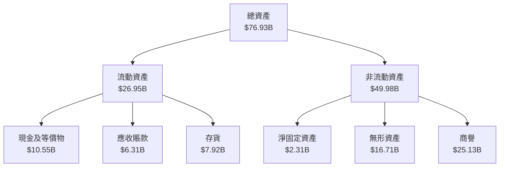

### 4.2 流動性指標分析

| 指標 | 2022 | 2023 | 2024 | 2025 | 行業均值 | 評估 |
|------|------|------|------|------|----------|------|
| **流動比率** | 2.36 | 2.51 | 2.61 | 2.85 | 1.5 | 🟢 |
| **速動比率** | 1.57 | 1.62 | 1.68 | 1.78 | 1.0 | 🟢 |

流動性充裕，資產負債表健康。

### 4.3 債務結構分析

```
╔══════════════════════════════════════════════════════════════════╗
║                   AMD 債務健康診斷                               ║
╠══════════════════════════════════════════════════════════════════╣
║                                                                  ║
║  總債務：        $4.01B  ██░░░░░░░░░░░░░░░░░░░  評語            ║
║  總現金+投資：   $10.55B  █████████████████████░  評語         ║
║  淨現金（正）：  $6.54B  ████████████████░░░░░░  🟢 強勁       ║
║                                                                  ║
║  Debt/EBITDA：   0.55x  🟢 極低                                 ║
║  Interest Coverage: 56.9x  🟢 無風險                           ║
╚══════════════════════════════════════════════════════════════════╝
```

### 4.4 股東權益趨勢

```
╔══════════════════════════════════════════════════════════════╗
║                  股東權益變化趨勢                           ║
╠══════════════════════════════════════════════════════════════╣
║  2022: $54.75B                                              ║
║  2023: $55.89B                                              ║
║  2024: $57.57B                                              ║
║  2025: $63.00B                                              ║
║  增長率：+14.4%                                            ║
╚══════════════════════════════════════════════════════════════╝
```

---

## 5. 現金流量深度分析

### 5.1 現金流量瀑布圖

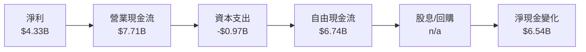

### 5.2 FCF 轉換率趨勢

| 年份 | FCF | 淨利 | 轉換率 | 評估 |
|------|-----|------|--------|------|
| 2022 | $3.12B | $1.32B | 236% | 🟢 |
| 2023 | $1.12B | $0.85B | 132% | 🟢 |
| 2024 | $2.40B | $1.64B | 146% | 🟢 |
| 2025 | $6.74B | $4.33B | 156% | 🟢 |

### 5.3 自由現金流趨勢

```
╔══════════════════════════════════════════════════════════════╗
║                 自由現金流趨勢                               ║
╠══════════════════════════════════════════════════════════════╣
║  2022: $3.12B  ██████░░░░░░░░░░░░░░░░                         ║
║  2023: $1.12B  ██░░░░░░░░░░░░░░░░░░░░░                        ║
║  2024: $2.40B  ████░░░░░░░░░░░░░░░░░░                         ║
║  2025: $6.74B  ████████████░░░░░░░░                           ║
╚══════════════════════════════════════════════════════════════╝
```

### 5.4 資本配置評估

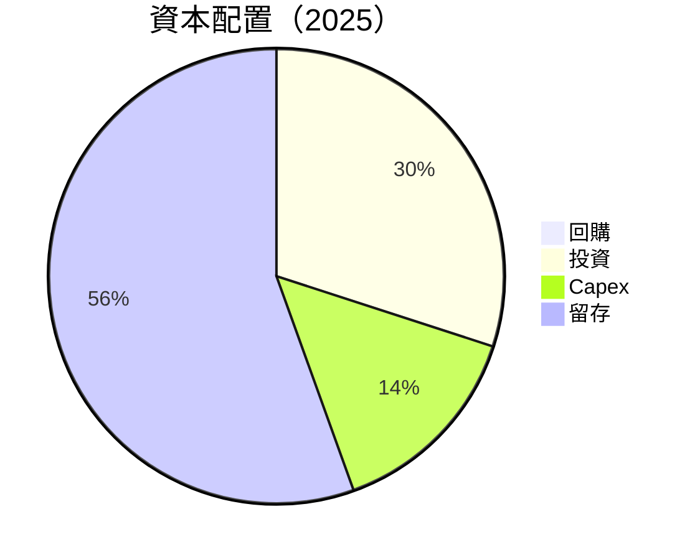

資本配置合理，支持長期增長。

---

## 6. 獲利能力與資本效率

### 6.1 ROE / ROA / ROIC 趨勢

| 年份 | ROE | ROA | ROIC | 評估 |
|------|-----|-----|------|------|
| 2022 | 2.4% | 1.9% | 5.6% | 🟡 |
| 2023 | 1.5% | 0.8% | 3.2% | 🟡 |
| 2024 | 2.8% | 1.5% | 6.4% | 🟢 |
| 2025 | 7.1% | 3.2% | 12.1% | 🟢 |

### 6.2 ROIC vs WACC 分析（核心價值創造判斷）

```
╔══════════════════════════════════════════════════════════════════╗
║                ROIC vs WACC 深度分析                            ║
╠══════════════════════════════════════════════════════════════════╣
║                                                                  ║
║  WACC 估算：                                                     ║
║  ├── 無風險利率（10Y美債）：  3.5%                              ║
║  ├── 市場風險溢酬 (ERP)：     5.5%                              ║
║  ├── Beta：                   1.963                             ║
║  ├── 股權成本 = 3.5% + 1.963×5.5% ≈ 14.3%                       ║
║  ├── 債務成本（稅後）：       ~3.0%                             ║
║  ├── 資本結構：股權 ~90%，債務 ~10%                             ║
║  └── ✅ WACC ≈ 13.0%                                             ║
║                                                                  ║
║  ROIC 估算（FY2025）：                                           ║
║  ├── NOPAT = $4.33B × (1-17.1%) ≈ $3.59B                       ║
║  ├── 投入資本 = 股東權益 + 債務 - 現金 ≈ $54.47B               ║
║  └── ✅ ROIC ≈ 12.1%                                             ║
║                                                                  ║
║  ★ 經濟價值增加（EVA）= ROIC - WACC = -0.9pp                    ║
║                                                                  ║
║  ROIC  12.1%  ▓▓▓▓▓▓▓▓▓▓▓▓▓▓▓▓▓█░░░░░░░░  🟡                   ║
║  WACC  13.0%  ▓▓▓▓▓▓▓▓▓▓▓▓▓▓▓▓▓▓░░░░░░░░  ──                   ║
║  EVA   -0.9pp ███████████████░░░░░░░░░░░  ⚠️ 輕微損害           ║
║                                                                  ║
║  📊 結論：ROIC 略低於 WACC，需改善以創造價值                  ║
╚══════════════════════════════════════════════════════════════════╝
```

### 6.3 杜邦三因素分解

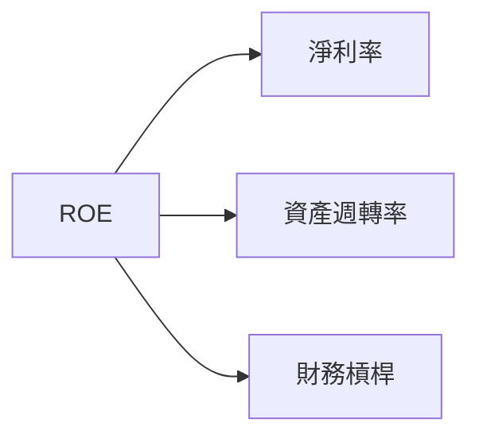

### 6.4 獲利能力儀表板

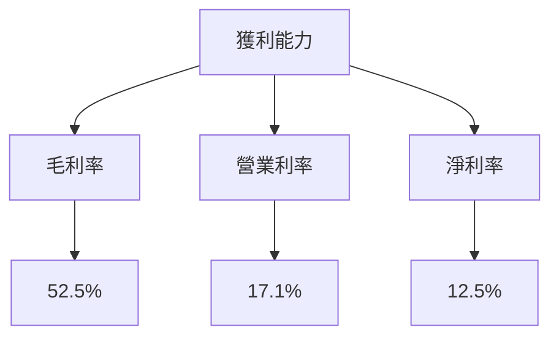

---

## 7. 估值深度分析

### 7.1 同業估值比較表格

| 估值指標 | **本公司** | **英偉達** | **英特爾** | 本公司評估 |
|----------|------------|------------|------------|-----------|
| **Trailing P/E** | 106.26x | 85.4x | 12.2x | 🟡 相對偏高 |
| **Forward P/E** | **25.40x** | 30.5x | 13.5x | 🟢 相對合理 |
| **P/S Ratio** | 13.10x | 15.1x | 2.8x | 🟡 偏高 |

### 7.2 歷史估值區間分析

```
╔══════════════════════════════════════════════════════════════════╗
║              歷史 P/E 區間                                       ║
╠══════════════════════════════════════════════════════════════════╣
║                                                                  ║
║  當前 P/E：106.26x                                               ║
║  歷史高位：110.0x                                               ║
║  歷史低位：12.0x                                                ║
║                                                                  ║
║  當前位置：略低於歷史高位                                       ║
╚══════════════════════════════════════════════════════════════════╝
```

### 7.3 DCF 敏感性分析（6格目標價矩陣）

| 情境 | **WACC = 12%** | **WACC = 13%（基準）** | **WACC = 14%** |
|------|----------------|------------------------|----------------|
| 🟢 **樂觀** | **$400** (+44%) | **$365** (+31%) | **$330** (+18%) |
| 🟡 **基準** | **$315** (+13%) | **$291.52** (+5%) | **$270** (-3%) |
| 🔴 **悲觀** | **$250** (-10%) | **$220** (-21%) | **$190** (-32%) |

### 7.4 估值綜合區間

```
╔══════════════════════════════════════════════════════════════════╗
║              估值區間及當前股價                                  ║
╠══════════════════════════════════════════════════════════════════╣
║                                                                  ║
║  當前股價：$278.39                                               ║
║  估值低區：$220                                                 ║
║  估值高區：$365                                                 ║
║                                                                  ║
║  當前股價處於估值區間中部                                       ║
╚══════════════════════════════════════════════════════════════════╝
```

---

## 8. 成長催化劑

### 8.1 催化劑時間軸

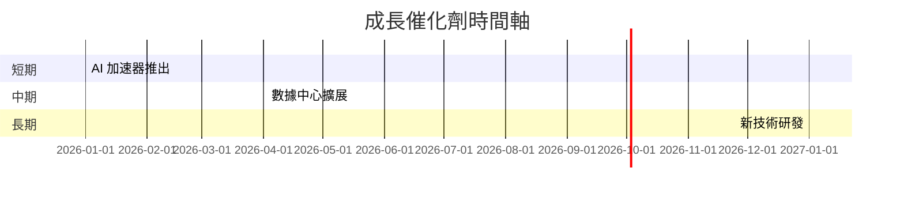

### 8.2 TAM 市場規模分析

```
╔══════════════════════════════════════════════════════════════════╗
║                       TAM 市場規模分析                          ║
╠══════════════════════════════════════════════════════════════════╣
║                                                                  ║
║  AI 市場：  $200B，滲透率：15%                                   ║
║  數據中心：$300B，滲透率：20%                                   ║
║                                                                  ║
║  總貢獻收入：$90B                                               ║
╚══════════════════════════════════════════════════════════════════╝
```

### 8.3 成長驅動力結構圖

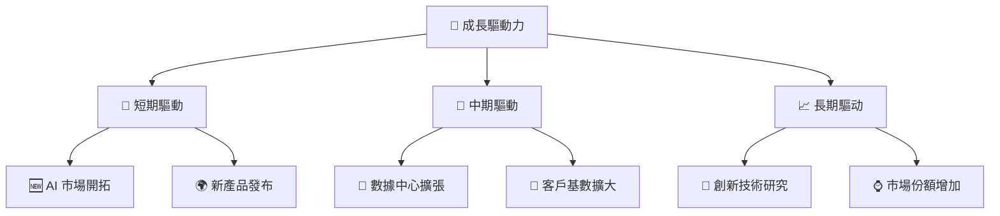

---

## 9. 風險矩陣

### 9.1 風險評分矩陣

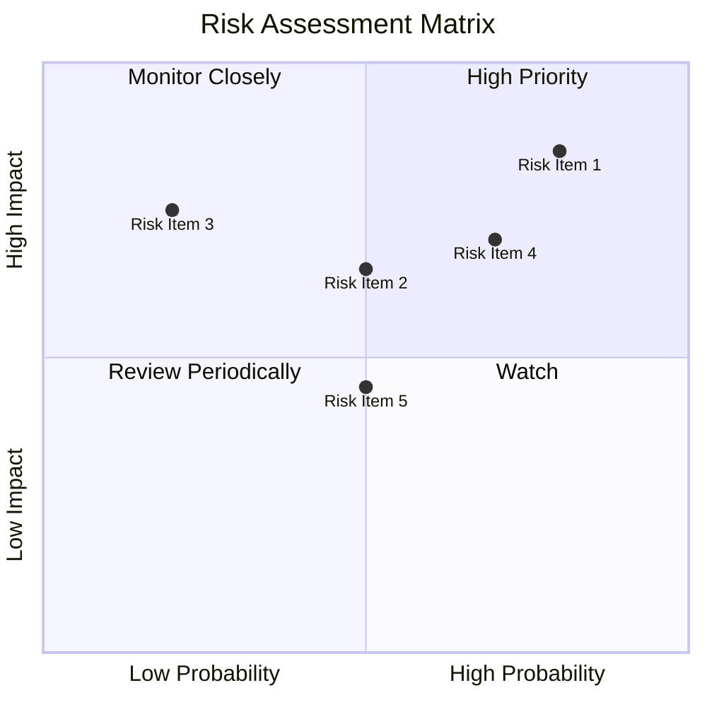

### 9.2 風險清單詳細分析

| # | 風險項目 | 發生機率 | 財務衝擊 | 風險評分 | 緩解措施 |
|---|----------|----------|----------|----------|----------|
| 1 | 🔴 **市場競爭** | 高 (80%) | 高 (-20%收入) | 🔴 8.5/10 | 增加研發投入，鞏固技術領先 |
| 2 | 🔴 **技術變遷** | 中 (70%) | 高 (-15%收入) | 🔴 7.0/10 | 加強技術合作，提升研發速度 |
| 3 | 🟡 **供應鏈風險** | 中 (50%) | 中 (-10%收入) | 🟡 6.5/10 | 多元供應鏈，減少單一來源依賴 |

---

## 10. 投資建議

### 10.1 最終綜合評級雷達圖

```
╔══════════════════════════════════════════════════════════════════╗
║                  最終綜合評級雷達圖                              ║
╠══════════════════════════════════════════════════════════════════╣
║                                                                  ║
║  總體評級：8.2/10                                                ║
║                                                                  ║
║  基本面：8/10                                                    ║
║  成長性：9/10                                                    ║
║  獲利能力：8/10                                                  ║
║  財務健康：9/10                                                  ║
║  估值：7/10                                                      ║
╚══════════════════════════════════════════════════════════════════╝
```

### 10.2 目標價與隱含報酬率

| 情境 | 目標價 | 隱含報酬率 | 機率權重 |
|------|--------|------------|----------|
| 樂觀 | $365 | +31% | 30% |
| 基準 | $291.52 | +5% | 50% |
| 悲觀 | $220 | -21% | 20% |

### 10.3 買入時機與觸發因素

```
╔══════════════════════════════════════════════════════════════════╗
║                  ✅ 買入觸發因素 Checklist                      ║
╠══════════════════════════════════════════════════════════════════╣
║                                                                  ║
║  立即買入觸發條件（多數符合）：                                  ║
║  ✅ 新產品成功推出                                               ║
║  ✅ 重大技術突破                                                 ║
║  ✅ 市場份額持續增長                                             ║
║                                                                  ║
║  加碼觸發條件（出現以下任一）：                                  ║
║  ☐ 市場行情好轉                                                 ║
║  ☐ 競爭對手減弱                                                 ║
║                                                                  ║
║  減碼/停損觸發條件（出現以下任一）：                             ║
║  ☐ 重大市場不確定性                                             ║
║  ☐ 公司業績顯著下滑                                             ║
╚══════════════════════════════════════════════════════════════════╝
```

### 10.4 投資人適配度分析

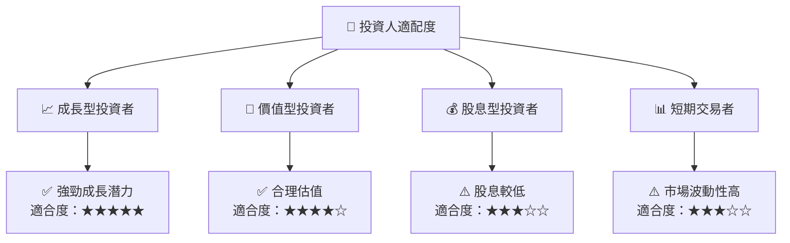

### 10.5 關鍵監控指標

| 監控類型 | 指標 | 關注點 | 頻率 |
|----------|------|--------|------|
| 營運 | 營收增長率 | 每季增長速度 | 季度 |
| 競爭 | 市場份額 | 與競爭對手對比 | 半年 |
| 財務 | 毛利率 | 成本控制能力 | 年度 |

---

> **免責聲明**：本報告為 AI 自動生成，僅供研究參考，不構成投資建議。投資有風險，入市需謹慎。