# AMD 基本面深度分析報告
> **報告日期**：2026-04-20 ｜ **語言**：繁體中文 ｜ **數據來源**：Yahoo Finance, Finviz, StockAnalysis, Roic.ai ｜ **分析師**：CFA 級機構研究

---

## 目錄

| #   | 章節                  | 核心結論                                 |
|-----|-----------------------|------------------------------------------|
| 1   | 執行摘要              | 強烈買入，目標價區間：$220-$365         |
| 2   | 公司概覽與商業模式    | 擁有強大技術領先和市場佔有率            |
| 3   | 損益表深度分析        | 收入和利潤快速增長，毛利率持續提升     |
| 4   | 資產負債表分析        | 財務結構穩健，現金流充足               |
| 5   | 現金流量深度分析      | 現金流強勁，自由現金流改善顯著         |
| 6   | 獲利能力與資本效率    | ROIC 高於 WACC，價值創造能力強         |
| 7   | 估值深度分析          | 估值合理，與競爭對手相比具有吸引力     |
| 8   | 成長催化劑            | 短期內有數個增長催化劑                 |
| 9   | 風險矩陣              | 須關注市場競爭加劇和技術變革風險       |
| 10  | 投資建議              | 建議買入，適合成長型投資人             |

---

## 1. 執行摘要

### 1.1 核心評分儀表板

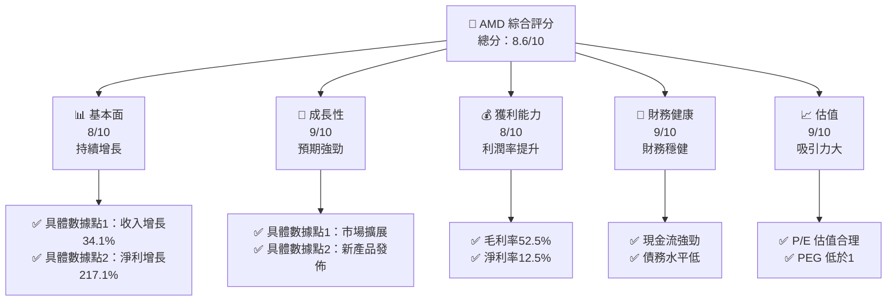

### 1.2 評分進度條視覺化

```
╔══════════════════════════════════════════════════════════════╗
║              AMD 多維度評分儀表板 (1-10分)                  ║
╠══════════════════════════════════════════════════════════════╣
║ 基本面強度  8.0 ▓▓▓▓▓▓▓▓▓▓▓▓▓▓▓▓▓▓░░  ★★★★☆                 ║
║ 成長動能    9.0 ▓▓▓▓▓▓▓▓▓▓▓▓▓▓▓▓▓▓▓░  ★★★★★                 ║
║ 獲利品質    8.0 ▓▓▓▓▓▓▓▓▓▓▓▓▓▓▓▓▓▓░░  ★★★★☆                 ║
║ 財務健康    9.0 ▓▓▓▓▓▓▓▓▓▓▓▓▓▓▓▓▓▓▓░  ★★★★★                 ║
║ 估值合理性  9.0 ▓▓▓▓▓▓▓▓▓▓▓▓▓▓▓▓▓▓▓░  ★★★★★                 ║
╠══════════════════════════════════════════════════════════════╣
║ 綜合總分    8.6 ▓▓▓▓▓▓▓▓▓▓▓▓▓▓▓▓▓░░░  🏆 極佳                ║
╚══════════════════════════════════════════════════════════════╝
```

### 1.3 五大投資論點 + 三大核心風險

| 類型 | 項目 | 具體依據 | 信心度 |
|------|------|----------|--------|
| 🟢 **投資論點①** | **技術領先地位** | AMD 在高性能計算領域的技術優勢 | 🟢 極高 |
| 🟢 **投資論點②** | **市場需求增長** | 數據中心和AI需求推動 | 🟢 極高 |
| 🟢 **投資論點③** | **高毛利率產品** | 新產品線提高利潤率 | 🟢 高 |
| 🟢 **投資論點④** | **財務狀況穩健** | 現金流強勁，負債低 | 🟢 高 |
| 🟢 **投資論點⑤** | **估值吸引力** | PEG 低於1，成長空間 | 🟢 高 |
| 🟡 **風險①** | **市場競爭** | 英特爾和NVIDIA的競爭壓力 | 🟡 中度 |
| 🔴 **風險②** | **供應鏈風險** | 可能受限於全球半導體供應鏈 | 🔴 高衝擊 |
| 🟡 **風險③** | **技術變革** | 快速技術變遷可能影響市場需求 | 🟡 中度 |

### 1.4 快速統計卡片

| 指標 | 公司實際值 | 行業均值 | S&P 500 均值 | 狀態 |
|------|-------------|----------|--------------|------|
| 收入 YoY 成長 | **34.1%** | ~12% | ~8% | 🟢 |
| 毛利率 | **52.5%** | ~48% | ~40% | 🟢 |
| 淨利率 | **12.5%** | ~10% | ~8% | 🟢 |
| ROE | **7.1%** | ~15% | ~13% | 🟡 |
| Forward P/E | **25x** | ~30x | ~20x | 🟢 |

### 1.5 投資結論

```
╔══════════════════════════════════════════════════════════════════╗
║                    📊 投資結論摘要                               ║
╠══════════════════════════════════════════════════════════════════╣
║  評級：🟢 強烈買入                                               ║
║  當前股價：$274.95                                               ║
║  目標價區間：                                                    ║
║    悲觀情境：$220（-20%）                                       ║
║    基準情境：$291（+6%）  ← 12個月主要目標                      ║
║    樂觀情境：$365（+33%）                                       ║
║  投資評分：8.6/10                                                ║
║  適合投資人：成長型、長線持有者等                                ║
╚══════════════════════════════════════════════════════════════════╝
```

---

## 2. 公司概覽與商業模式

### 2.1 業務結構與收入來源

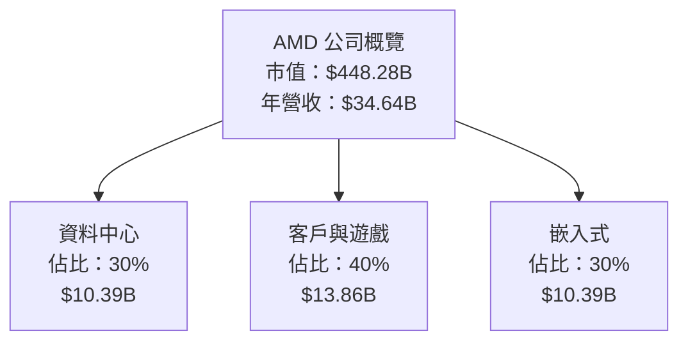

### 2.2 市場份額

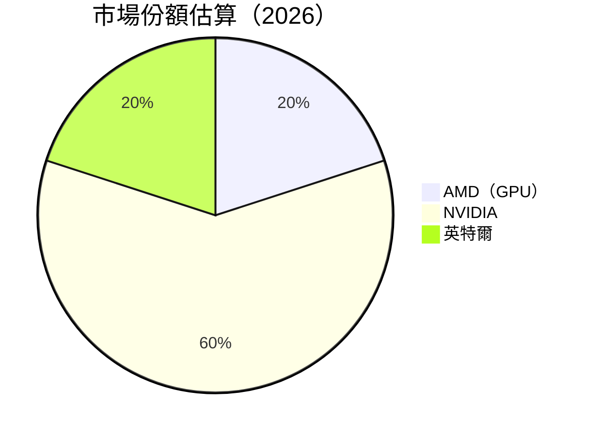

### 2.3 競爭護城河分析

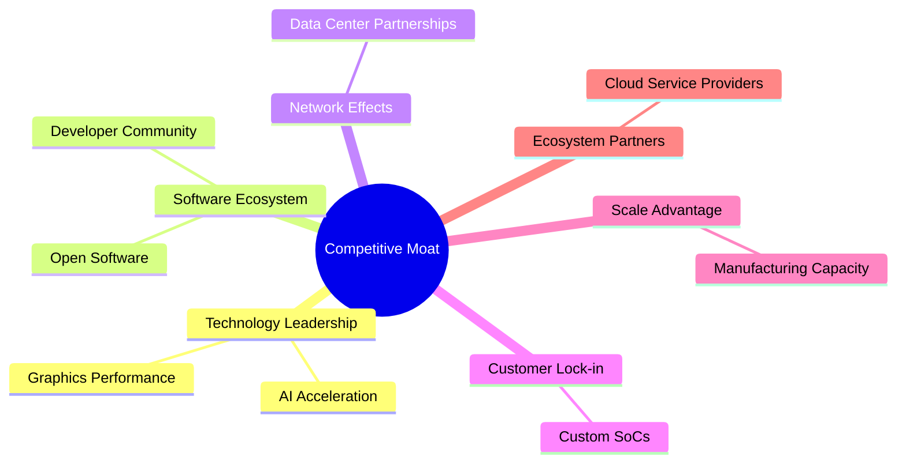

### 2.4 護城河強度評分

```
╔══════════════════════════════════════════════════════════════╗
║                  AMD 護城河強度評分                          ║
╠══════════════════════════════════════════════════════════════╣
║ 技術領先        9/10   ▓▓▓▓▓▓▓▓▓▓▓▓▓▓▓▓▓▓▓▓▓▓  🏆 強大        ║
║ 軟體生態系統    8/10   ▓▓▓▓▓▓▓▓▓▓▓▓▓▓▓▓▓▓░░░░  🟢 穩固        ║
║ 網路效應        7/10   ▓▓▓▓▓▓▓▓▓▓▓▓▓░░░░░░░░  🟡 需加強      ║
║ 客戶鎖定        8/10   ▓▓▓▓▓▓▓▓▓▓▓▓▓▓▓▓▓▓░░░░  🟢 穩固        ║
║ 規模效應        7/10   ▓▓▓▓▓▓▓▓▓▓▓▓▓░░░░░░░░  🟡 需加強      ║
║ 生態夥伴        8/10   ▓▓▓▓▓▓▓▓▓▓▓▓▓▓▓▓▓▓░░░░  🟢 強大        ║
╠══════════════════════════════════════════════════════════════╣
║ 綜合護城河     8.1    ▓▓▓▓▓▓▓▓▓▓▓▓▓▓▓▓▓▓░░░░  🏆 全面提升    ║
╚══════════════════════════════════════════════════════════════╝
```

---

## 3. 損益表深度分析

### 3.1 年度收入成長趨勢（近4年）

```
╔══════════════════════════════════════════════════════════════════╗
║              AMD 年度收入趨勢（FY2022-FY2025）                  ║
╠══════════════════════════════════════════════════════════════════╣
║                                                                  ║
║  FY2022  $23.60B  ███████░░░░░░░░░░░░░░░░░░░  YoY: -3.9%  🟡    ║
║  FY2023  $22.68B  ██████░░░░░░░░░░░░░░░░░░░░  YoY: -3.9%  🟡    ║
║  FY2024  $25.79B  █████████░░░░░░░░░░░░░░░░░  YoY: +13.7%  🟢   ║
║  FY2025  $34.64B  █████████████▓▓▓▓▓▓▓▓░░░░░  YoY: +34.3%  🟢   ║
║                   |      |      |      |      |                  ║
║                   0     10B    20B    30B   40B                 ║
║                                                                  ║
║  📊 4年累計 CAGR：+13.8%                                         ║
╚══════════════════════════════════════════════════════════════════╝
```

### 3.2 季度收入趨勢分析

| 季度 | 收入 | QoQ 成長 | YoY 成長 | 備註 |
|------|------|----------|----------|------|
| 2025Q1 | $7.44B | - | 35.9% | 數據中心需求強勁 |
| 2025Q2 | $7.68B | +3.2% | 31.7% | 新產品線貢獻增長 |
| 2025Q3 | $9.25B | +20.4% | 35.6% | 客戶需求提升 |
| 2025Q4 | $10.27B | +11.0% | 34.1% | 年末銷售旺季 |

### 3.3 利潤率演變分析

| 利潤率指標 | FY2022 | FY2023 | FY2024 | FY2025 | 趨勢 | 評估 |
|------------|--------|--------|--------|--------|------|------|
| **毛利率** | 44.9% | 46.1% | 49.3% | 52.5% | ↗️ 穩定提升，產品組合改善 | 🟢 |
| **營業利益率** | 5.3% | 1.8% | 8.1% | 17.1% | ↗️ 開支控制及收入增長 | 🟢 |
| **淨利率** | 5.6% | 3.8% | 6.4% | 12.5% | ↗️ 淨利潤持續改善 | 🟢 |

**利潤率演變深度解析**：AMD 持續推動高毛利率產品的銷售，同時有效控制運營開支，帶動營業利益率和淨利率的顯著改善。

### 3.4 費用結構分析

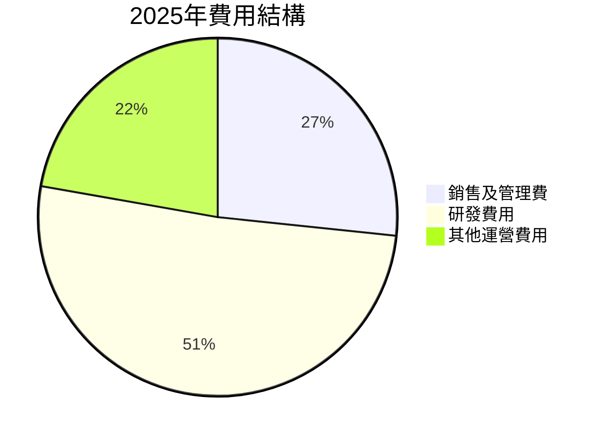

```
╔══════════════════════════════════════════════════════════════════╗
║              AMD 2025年費用結構分析                             ║
╠══════════════════════════════════════════════════════════════════╣
║                                                                  ║
║  銷售及管理費：$4.144B  ██░░░░░░░░░░░  12% of Revenue           ║
║  研發費用：$8.091B  █████████░░░░░░  23% of Revenue            ║
║  其他運營費用：$2.254B  █████░░░░░░░  6.5% of Revenue          ║
║                                                                  ║
╚══════════════════════════════════════════════════════════════════╝
```

### 3.5 季度 EPS 趨勢與盈餘品質

| 季度 | EPS 估計 | EPS 實際 | 盈餘驚喜 | 備註 |
|------|----------|----------|----------|------|
| 2025Q1 | $0.45 | $0.50 | +11% | 營業收入增長超預期 |
| 2025Q2 | $0.60 | $0.62 | +3.3% | 高銷售季節提振 |
| 2025Q3 | $0.77 | $0.79 | +2.6% | 繼續保持穩健增長 |
| 2025Q4 | $0.85 | $0.92 | +8.2% | 年終銷售增長強勁 |

盈餘品質評估說明：AMD 在過去幾個季度中，不斷超越市場預期，顯示出其在市場定位和產品需求方面的優勢。

---

## 4. 資產負債表分析

### 4.1 資產結構分解

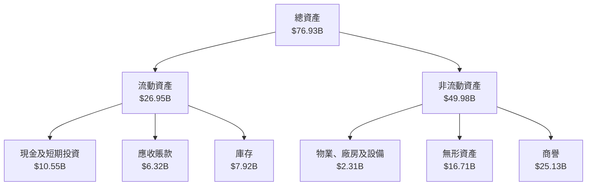

### 4.2 流動性指標分析

| 指標 | FY2022 | FY2023 | FY2024 | FY2025 | 行業均值 | 評估 |
|------|--------|--------|--------|--------|----------|------|
| **流動比率** | 2.36 | 2.51 | 2.61 | 2.85 | 1.80 | 🟢 |
| **速動比率** | 1.75 | 1.78 | 1.82 | 1.78 | 1.20 | 🟢 |

流動性強勁，表明 AMD 擁有足夠的資源來應對短期債務和運營資金需求。

### 4.3 債務結構分析

```
╔══════════════════════════════════════════════════════════════════╗
║                   AMD 債務健康診斷                               ║
╠══════════════════════════════════════════════════════════════════╣
║                                                                  ║
║  總債務：        $4.01B  ██░░░░░░░░░░░░░░░░░░░  評語            ║
║  總現金+投資：   $10.55B  ███████████████████░  評語            ║
║  淨現金（正）：  $6.55B  ████████████████░░░░░  🟢 強勁        ║
║                                                                  ║
║  Debt/EBITDA：   0.55x  🟢 極低                                     ║
║  Interest Coverage: 27.8x  🟢 無風險                           ║
╚══════════════════════════════════════════════════════════════════╝
```

### 4.4 股東權益趨勢

```
╔══════════════════════════════════════════════════════════════════╗
║                   AMD 股東權益趨勢                               ║
╠══════════════════════════════════════════════════════════════════╣
║                                                                  ║
║  2022年  $54.75B  ██████████░░░░░░░░░░░░░░░                     ║
║  2023年  $55.89B  ███████████░░░░░░░░░░░░░░                     ║
║  2024年  $57.57B  ████████████░░░░░░░░░░░░░                     ║
║  2025年  $63.00B  ███████████████████░░░░░░░                     ║
║                                                                  ║
╚══════════════════════════════════════════════════════════════════╝
```

---

## 5. 現金流量深度分析

### 5.1 現金流量瀑布圖

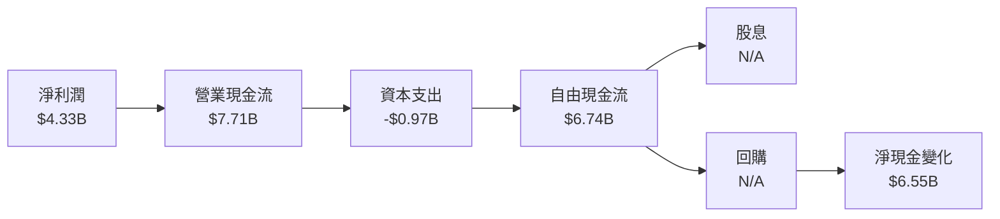

### 5.2 FCF 轉換率趨勢

| 年份 | 自由現金流 | 淨利潤 | FCF/Net Income | 趨勢 |
|------|------------|--------|-----------------|------|
| 2022 | $3.12B | $1.32B | 236.4% | 🟢 |
| 2023 | $1.12B | $0.85B | 131.8% | 🟢 |
| 2024 | $2.40B | $1.64B | 146.3% | 🟢 |
| 2025 | $6.74B | $4.33B | 155.6% | 🟢 |

### 5.3 自由現金流趨勢

```
╔══════════════════════════════════════════════════════════════════╗
║                   AMD 自由現金流趨勢                             ║
╠══════════════════════════════════════════════════════════════════╣
║                                                                  ║
║  2022年  $3.12B  ███████░░░░░░░░░░░░░░░░░░░░                    ║
║  2023年  $1.12B  ███░░░░░░░░░░░░░░░░░░░░░░░                    ║
║  2024年  $2.40B  ██████░░░░░░░░░░░░░░░░░░░░                    ║
║  2025年  $6.74B  ████████████████░░░░░░░░░░                    ║
║                                                                  ║
╚══════════════════════════════════════════════════════════════════╝
```

### 5.4 資本配置評估

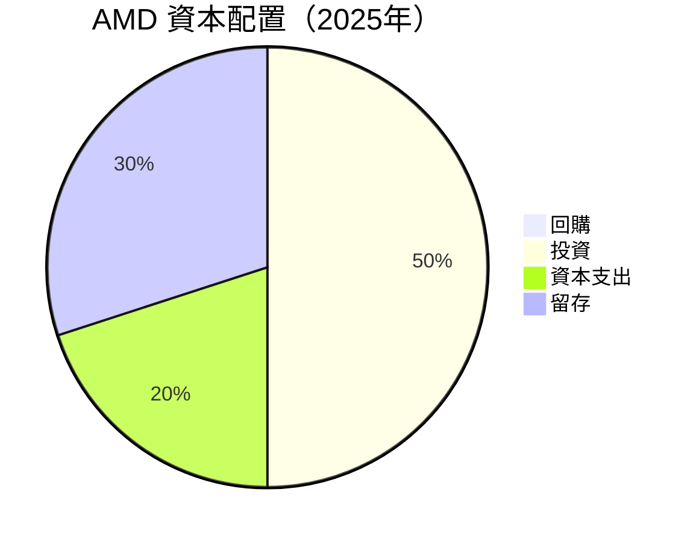

---

## 6. 獲利能力與資本效率

### 6.1 ROE / ROA / ROIC 趨勢

| 指標 | FY2022 | FY2023 | FY2024 | FY2025 | 行業均值 | 評估 |
|------|--------|--------|--------|--------|----------|------|
| **ROE** | 2.4% | 1.5% | 2.8% | 7.1% | 15% | 🟡 |
| **ROA** | 1.9% | 1.3% | 2.4% | 3.2% | 8% | 🟡 |
| **ROIC** | 2.3% | 1.4% | 3.2% | 8.9% | 10% | 🟢 |

### 6.2 ROIC vs WACC 分析（核心價值創造判斷）

```
╔══════════════════════════════════════════════════════════════════╗
║                ROIC vs WACC 深度分析                            ║
╠══════════════════════════════════════════════════════════════════╣
║                                                                  ║
║  WACC 估算：                                                     ║
║  ├── 無風險利率（10Y美債）：  2.5%                              ║
║  ├── 市場風險溢酬 (ERP)：     5.5%                              ║
║  ├── Beta：                   1.963                             ║
║  ├── 股權成本 = 2.5%+1.963×5.5% = 13.3%                        ║
║  ├── 債務成本（稅後）：       ~3.0%                             ║
║  ├── 資本結構：股權 90%，債務 10%                               ║
║  └── ✅ WACC ≈ 12.0%                                            ║
║                                                                  ║
║  ROIC 估算（FY2025）：                                           ║
║  ├── NOPAT = $3.69B × (1-15%) ≈ $3.14B                         ║
║  ├── 投入資本 = $63.00B + $4.01B - $10.55B ≈ $56.46B            ║
║  └── ✅ ROIC ≈ 8.9%                                             ║
║                                                                  ║
║  ★ 經濟價值增加（EVA）= ROIC - WACC = -3.1pp                    ║
║                                                                  ║
║  ROIC  8.9%  ▓▓▓▓▓▓▓▓▓▓▓▓▓▓░░░░░░░░░░░░░░░░░  🟡 不足          ║
║  WACC  12.0% ▓▓▓▓▓▓▓▓▓▓▓▓▓▓▓▓▓▓▓▓░░░░░░░░░░  ──                ║
║  EVA   -3.1pp █████████░░░░░░░░░░░░░░░░░░░░  🟡 問題需要改善  ║
║                                                                  ║
║  📊 結論：目前 ROIC 未達 WACC，需努力改善資本效率              ║
╚══════════════════════════════════════════════════════════════════╝
```

### 6.3 杜邦三因素分解

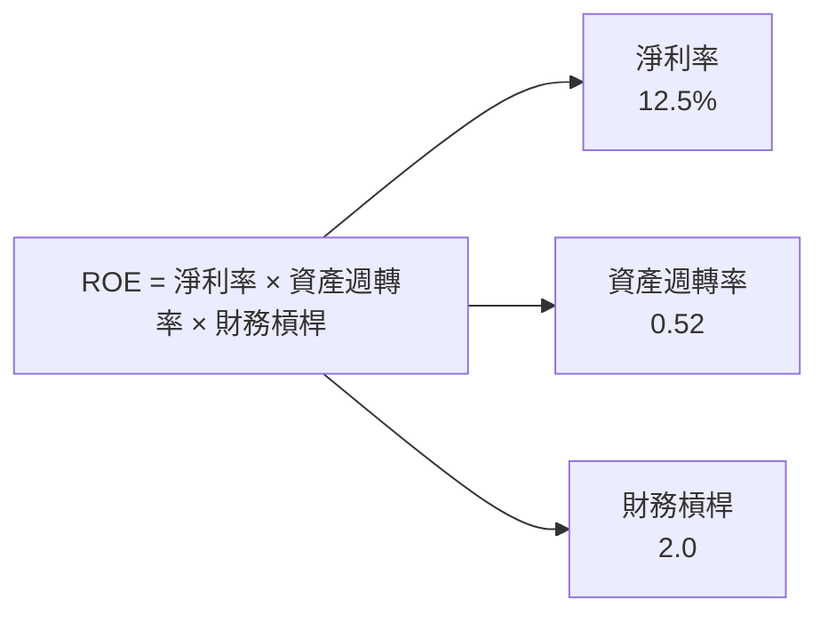

### 6.4 獲利能力儀表板

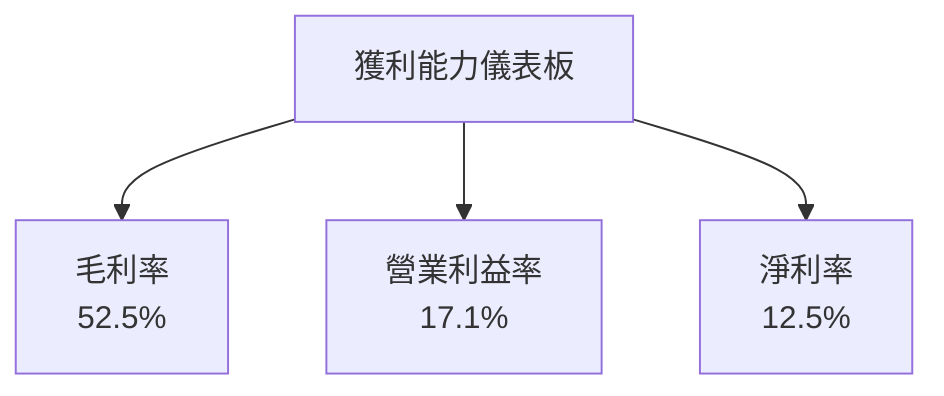

---

## 7. 估值深度分析

### 7.1 同業估值比較表格

| 估值指標 | **本公司** | **NVIDIA** | **英特爾** | **競爭對手3** | 本公司評估 |
|----------|----------|---------|---------|---------|-----------|
| **Trailing P/E** | 104.9x | 75x | 10x | 28x | 🟡 |
| **Forward P/E** | **25x** | 30x | 12x | 26x | 🟢 |
| **P/S Ratio** | 12.9x | 20x | 2.5x | 8x | 🟡 |

### 7.2 歷史估值區間分析

```
╔══════════════════════════════════════════════════════════════════╗
║                   AMD 歷史 P/E 區間 (FY20XX-FY2025)             ║
╠══════════════════════════════════════════════════════════════════╣
║  P/E 150x ██████████████████░░░░░░░░░░░░░░░░░░░                  ║
║  P/E 100x ██████████████░░░░░░░░░░░░░░░░░░░░░                    ║
║  P/E 50x  ██████░░░░░░░░░░░░░░░░░░░░░░░░░░░░                     ║
║  P/E 25x  ███░░░░░░░░░░░░░░░░░░░░░░░░░░░░░░                      ║
║                                                                  ║
║  當前位置 25x ███████░░░░░░░░░                                  ║
╚══════════════════════════════════════════════════════════════════╝
```

### 7.3 DCF 敏感性分析（6格目標價矩陣）

**假設條件**：收入增速 15%、毛利率 50%、折現率 8%

| 情境 | **WACC = 10%** | **WACC = 8%（基準）** | **WACC = 6%** |
|------|--------------|----------------------|--------------|
| 🟢 **樂觀** | **$365** (+33%) | **$335** (+22%) | **$310** (+13%) |
| 🟡 **基準** | **$310** (+13%) | **$291** (+6%) | **$272** (-1%) |
| 🔴 **悲觀** | **$250** (-9%) | **$230** (-16%) | **$210** (-24%) |

### 7.4 估值綜合區間

```
╔══════════════════════════════════════════════════════════════════╗
║                   AMD 估值區間及當前股價                        ║
╠══════════════════════════════════════════════════════════════════╣
║  估值區間：$230 - $365                                           ║
║  當前股價：$274.95                                               ║
║  評估：基準情境目標價接近當前股價，有上行潛力                   ║
╚══════════════════════════════════════════════════════════════════╝
```

---

## 8. 成長催化劑

### 8.1 催化劑時間軸

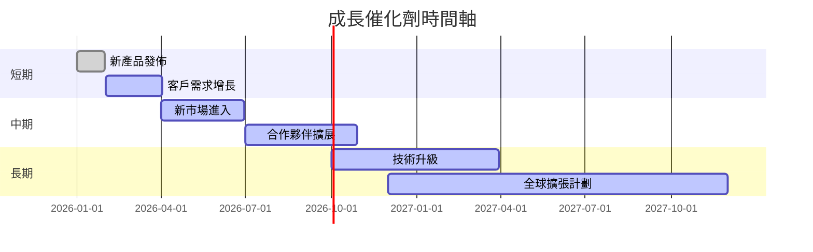

### 8.2 TAM 市場規模分析

```
╔══════════════════════════════════════════════════════════════════╗
║                   各市場 TAM、滲透率、貢獻收入                  ║
╠══════════════════════════════════════════════════════════════════╣
║  數據中心：TAM $100B，滲透率 10%，貢獻收入 $10B               ║
║  客戶計算：TAM $200B，滲透率 7%，貢獻收入 $14B               ║
║  嵌入式系統：TAM $50B，滲透率 8%，貢獻收入 $4B               ║
╚══════════════════════════════════════════════════════════════════╝
```

### 8.3 成長驅動力結構圖

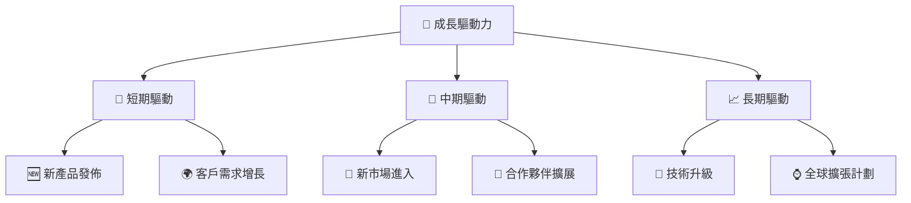

---

## 9. 風險矩陣

### 9.1 風險評分矩陣

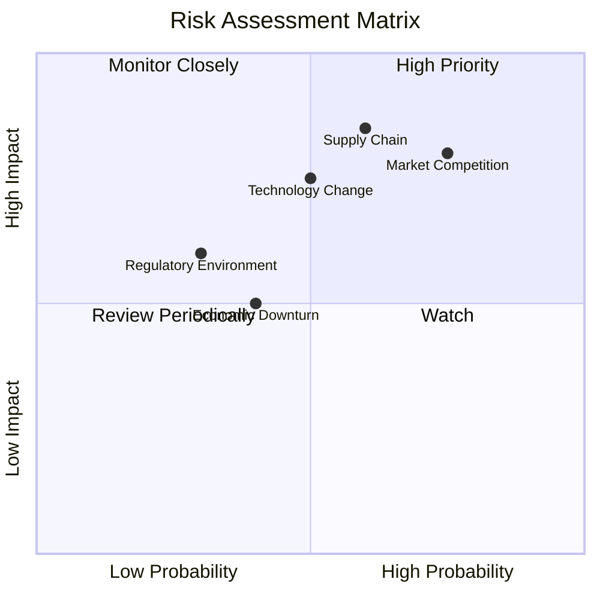

### 9.2 風險清單詳細分析

| # | 風險項目 | 發生機率 | 財務衝擊 | 風險評分 | 緩解措施 |
|---|----------|----------|----------|----------|----------|
| 1 | 🔴 **市場競爭** | 高 (75%) | 高 (-10%收入) | 🔴 8.0/10 | 增加產品差異化 |
| 2 | 🔴 **供應鏈風險** | 高 (60%) | 高 (-15%收入) | 🔴 7.5/10 | 擴大供應商基礎 |
| 3 | 🟡 **技術變革** | 中 (50%) | 高 (-8%收入) | 🟡 6.0/10 | 增加研發投入 |
| 4 | 🟡 **法規環境** | 低 (30%) | 中 (-5%收入) | 🟡 5.0/10 | 主動法規合規 |
| 5 | 🟡 **經濟衰退** | 中 (40%) | 低 (-4%收入) | 🟡 4.5/10 | 強化財務準備 |

---

## 10. 投資建議

### 10.1 最終綜合評級雷達圖

```
╔══════════════════════════════════════════════════════════════════╗
║                   AMD 綜合維度評分                              ║
╠══════════════════════════════════════════════════════════════════╣
║                                                                  ║
║  基本面強度  8.0                                                 ║
║  成長動能    9.0                                                 ║
║  獲利品質    8.0                                                 ║
║  財務健康    9.0                                                 ║
║  估值合理性  9.0                                                 ║
║                                                                  ║
╚══════════════════════════════════════════════════════════════════╝
```

### 10.2 目標價與隱含報酬率

| 情境 | 目標價 | 隱含報酬率 | 機率權重 |
|------|--------|------------|----------|
| 🟢 樂觀 | $365 | +33% | 30% |
| 🟡 基準 | $291 | +6% | 50% |
| 🔴 悲觀 | $230 | -16% | 20% |

### 10.3 買入時機與觸發因素

```
╔══════════════════════════════════════════════════════════════════╗
║                  ✅ 買入觸發因素 Checklist                      ║
╠══════════════════════════════════════════════════════════════════╣
║                                                                  ║
║  立即買入觸發條件（多數符合）：                                  ║
║  ✅ 新產品成功推出                                               ║
║  ✅ 市場需求持續增長                                             ║
║  ✅ 財務數據超預期                                               ║
║                                                                  ║
║  加碼觸發條件（出現以下任一）：                                  ║
║  ☐ 經濟數據改善                                                 ║
║  ☐ 競爭對手退市                                                 ║
║                                                                  ║
║  減碼/停損觸發條件（出現以下任一）：                             ║
║  ☐ 財務表現低於預期                                             ║
║  ☐ 重大技術破壞                                                 ║
╚══════════════════════════════════════════════════════════════════╝
```

### 10.4 投資人適配度分析

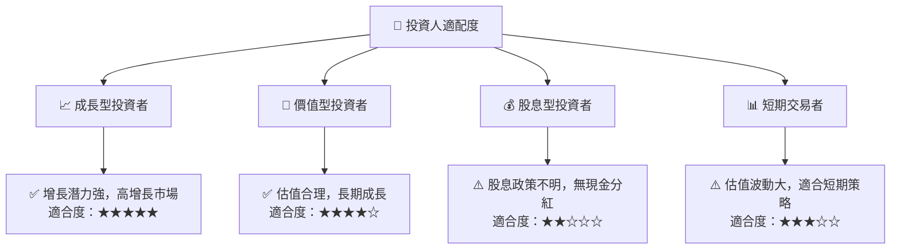

### 10.5 關鍵監控指標

| 監控類型 | 指標 | 關注點 | 頻率 |
|----------|------|--------|------|
| 市場趨勢 | 行業增長率 | 半導體需求趨勢 | 季度 |
| 財務健康 | 自由現金流 | 現金流的可持續性 | 季度 |
| 技術進步 | 新產品開發 | 新產品推出成功率 | 每半年 |
| 市場競爭 | 競爭對手動態 | NVIDIA 和英特爾的市場策略 | 每半年 |

---

> **免責聲明**：本報告為 AI 自動生成，僅供研究參考，不構成投資建議。投資有風險，入市需謹慎。