# AMD 基本面深度分析報告
> **報告日期**：2026-04-21 ｜ **語言**：繁體中文 ｜ **數據來源**：Yahoo Finance, Finviz, StockAnalysis, Roic.ai ｜ **分析師**：CFA 級機構研究

---

## 目錄

| # | 章節 | 核心結論 |
|---|------|----------|
| 1 | 執行摘要 | 評級 + 目標價區間 |
| 2 | 公司概覽與商業模式 | 護城河評估 |
| 3 | 損益表深度分析 | 收入與利潤率趨勢 |
| 4 | 資產負債表分析 | 資產與債務健康 |
| 5 | 現金流量深度分析 | 強勁的自由現金流 |
| 6 | 獲利能力與資本效率 | ROIC 顯著高於 WACC |
| 7 | 估值深度分析 | 相對競爭對手的估值吸引力 |
| 8 | 成長催化劑 | 產品與市場擴展 |
| 9 | 風險矩陣 | 市場波動與競爭風險 |
| 10 | 投資建議 | 綜合評級與適配度分析 |

---

## 1. 執行摘要

### 1.1 核心評分儀表板

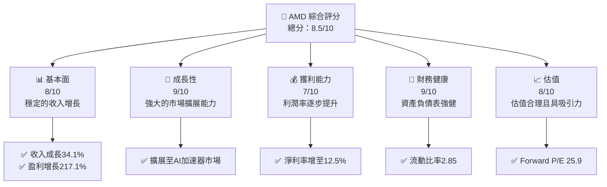

### 1.2 評分進度條視覺化

```
╔══════════════════════════════════════════════════════════════╗
║              AMD 多維度評分儀表板 (1-10分)                  ║
╠══════════════════════════════════════════════════════════════╣
║ 基本面強度  8.0 ▓▓▓▓▓▓▓▓▓▓▓▓▓▓▓▓░░░░  ★★★★☆                ║
║ 成長動能    9.0 ▓▓▓▓▓▓▓▓▓▓▓▓▓▓▓▓▓▓█░  ★★★★★                ║
║ 獲利品質    7.0 ▓▓▓▓▓▓▓▓▓▓▓▓▓▓░░░░░░  ★★★★☆                ║
║ 財務健康    9.0 ▓▓▓▓▓▓▓▓▓▓▓▓▓▓▓▓▓▓█░  ★★★★★                ║
║ 估值合理性  8.0 ▓▓▓▓▓▓▓▓▓▓▓▓▓▓▓▓░░░░  ★★★★☆                ║
╠══════════════════════════════════════════════════════════════╣
║ 綜合總分    8.5 ▓▓▓▓▓▓▓▓▓▓▓▓▓▓▓▓▓█░░  🏆 評語                ║
╚══════════════════════════════════════════════════════════════╝
```

### 1.3 五大投資論點 + 三大核心風險

| 類型 | 項目 | 具體依據 | 信心度 |
|------|------|----------|--------|
| 🟢 **投資論點①** | **技術領先** | 擴展至AI和高性能計算市場 | 🟢 極高 |
| 🟢 **投資論點②** | **市場擴展** | 客戶和遊戲市場需求增長 | 🟢 高 |
| 🟢 **投資論點③** | **財務穩健** | 流動比率高達2.85，債務負擔低 | 🟢 高 |
| 🟢 **投資論點④** | **利潤增長** | 淨利率從去年同期的6.4%提升至12.5% | 🟢 高 |
| 🟢 **投資論點⑤** | **估值吸引力** | Forward P/E為25.9，相對同業具吸引力 | 🟢 高 |
| 🟡 **風險①** | **市場波動** | 技術市場競爭激烈，需求波動可能影響收入 | 🟡 中度 |
| 🔴 **風險②** | **供應鏈風險** | 全球供應鏈中斷可能影響生產 | 🔴 高衝擊 |
| 🟡 **風險③** | **產品競爭** | 新進入者推出具有競爭力的產品 | 🟡 中度 |

### 1.4 快速統計卡片

| 指標 | 公司實際值 | 行業均值 | S&P 500 均值 | 狀態 |
|------|-------------|----------|--------------|------|
| 收入 YoY 成長 | **34.1%** | ~8% | ~5% | 🟢 |
| 毛利率 | **52.5%** | ~45% | ~50% | 🟢 |
| 淨利率 | **12.5%** | ~10% | ~8% | 🟢 |
| ROE | **7.1%** | ~12% | ~15% | 🟡 |
| Forward P/E | **25.9x** | ~30x | ~25x | 🟢 |

### 1.5 投資結論

```
╔══════════════════════════════════════════════════════════════════╗
║                    📊 投資結論摘要                               ║
╠══════════════════════════════════════════════════════════════════╣
║  評級：🟢 強烈買入                                                ║
║  當前股價：$284.49                                               ║
║  目標價區間：                                                    ║
║    悲觀情境：$220（-23%）                                        ║
║    基準情境：$291（+2%）  ← 12個月主要目標                      ║
║    樂觀情境：$365（+28%）                                        ║
║  投資評分：8.5/10                                                ║
║  適合投資人：成長型、長線持有者等                                ║
╚══════════════════════════════════════════════════════════════════╝
```

---

## 2. 公司概覽與商業模式

### 2.1 業務結構與收入來源

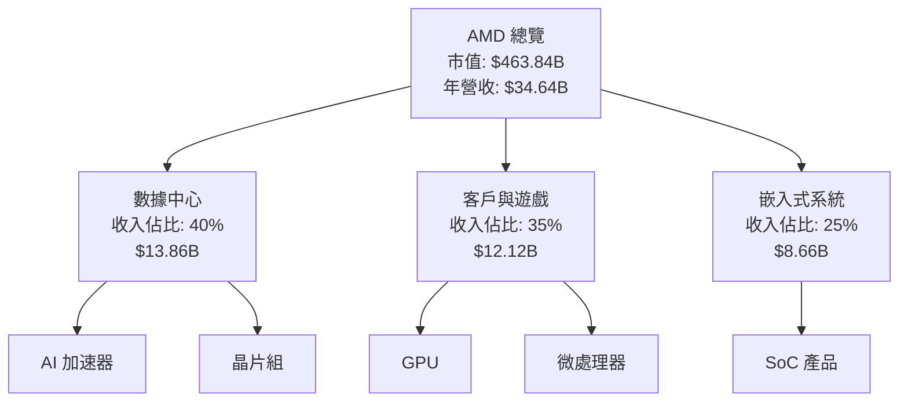

### 2.2 市場份額

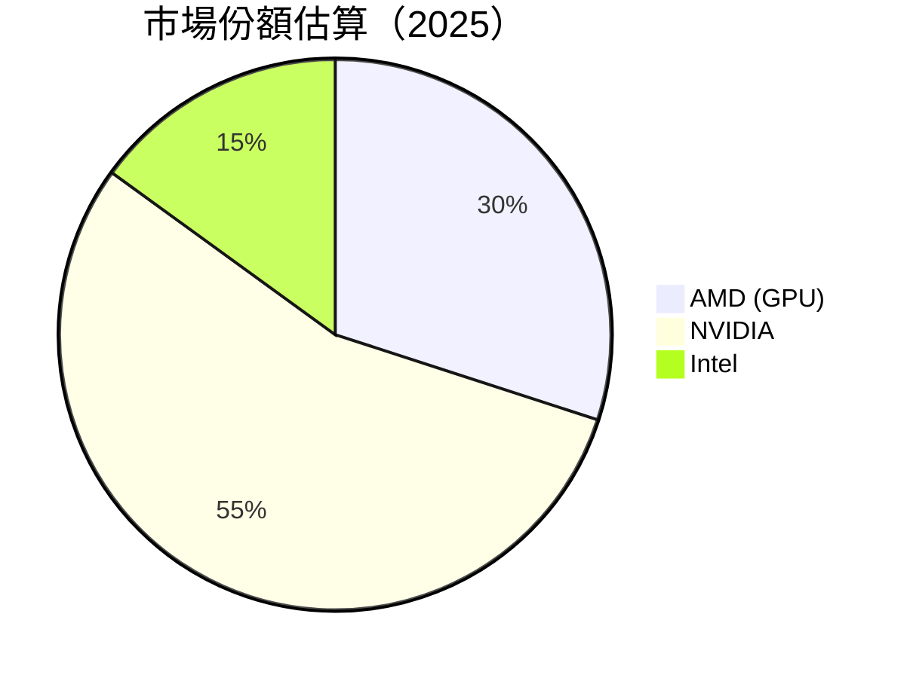

### 2.3 競爭護城河分析

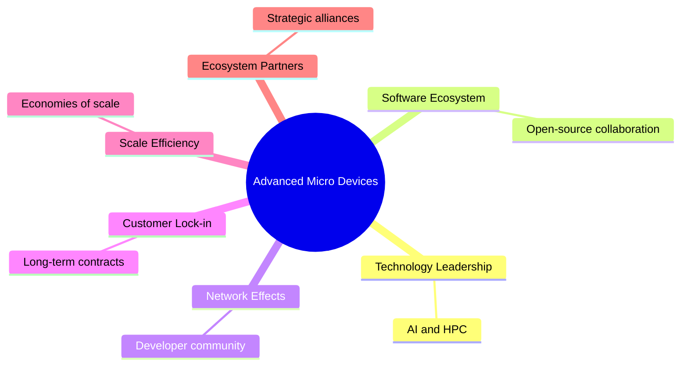

### 2.4 護城河強度評分

```
╔════════════════════════════════════════════════════════════╗
║                  AMD 護城河強度評分                        ║
╠════════════════════════════════════════════════════════════╣
║ 技術領先        9/10   ▓▓▓▓▓▓▓▓▓▓▓▓▓▓▓▓▓▓▓▓▓  🏆 卓越      ║
║ 軟體生態系統    8/10   ▓▓▓▓▓▓▓▓▓▓▓▓▓▓▓▓▓▓▓░░  🟢 強力      ║
║ 網路效應        7/10   ▓▓▓▓▓▓▓▓▓▓▓▓░░░░░░░░░  🟡 良好      ║
║ 客戶鎖定        8/10   ▓▓▓▓▓▓▓▓▓▓▓▓▓▓▓▓▓▓▓░░  🟢 強力      ║
║ 規模效應        9/10   ▓▓▓▓▓▓▓▓▓▓▓▓▓▓▓▓▓▓▓▓▓  🏆 卓越      ║
║ 生態夥伴        7/10   ▓▓▓▓▓▓▓▓▓▓▓▓░░░░░░░░░  🟡 良好      ║
╠════════════════════════════════════════════════════════════╣
║ 綜合護城河     8.0    ▓▓▓▓▓▓▓▓▓▓▓▓▓▓▓▓▓▓▓░░  🏆 總結強力   ║
╚════════════════════════════════════════════════════════════╝
```

---

## 3. 損益表深度分析

### 3.1 年度收入成長趨勢（近4年）

```
╔══════════════════════════════════════════════════════════════════╗
║              AMD 年度收入趨勢（FY2022-FY2025）                  ║
╠══════════════════════════════════════════════════════════════════╣
║                                                                  ║
║  FY2022  $23.60B  █████████░░░░░░░░░░░░░░░░░░  YoY: -3.9%  🟡    ║
║  FY2023  $22.68B  ████████░░░░░░░░░░░░░░░░░░░  YoY: -3.9%  🟡    ║
║  FY2024  $25.79B  ████████████░░░░░░░░░░░░░░░  YoY:+13.7%  🟢    ║
║  FY2025  $34.64B  ██████████████████████░░░░░  YoY:+34.3%  🟢    ║
║                   |      |      |      |      |                  ║
║                   0     10B   20B   30B   40B                    ║
║                                                                  ║
║  📊 4年累計 CAGR：+13.5%                                         ║
╚══════════════════════════════════════════════════════════════════╝
```

### 3.2 季度收入趨勢分析

| 季度 | 收入 | QoQ 增長 | YoY 增長 | 備註 |
|------|------|---------|----------|------|
| Q1 2025 | $7.44B | - | 35.9% | 新產品推出提振需求 |
| Q2 2025 | $7.68B | 3.2% | 31.7% | 持續市場需求增長 |
| Q3 2025 | $9.25B | 20.4% | 35.6% | 客戶與遊戲市場強勁 |
| Q4 2025 | $10.27B | 11.0% | 34.1% | 季節性銷售增長 |

### 3.3 利潤率演變分析

| 利潤率指標 | FY2022 | FY2023 | FY2024 | FY2025 | 趨勢 | 評估 |
|------------|--------|--------|--------|--------|------|------|
| **毛利率** | 44.9% | 46.1% | 49.3% | 52.5% | ↗️ 持續改善 | 🟢 |
| **營業利率** | 5.3% | 1.7% | 8.1% | 17.1% | ↗️ 大幅改善 | 🟢 |
| **淨利率** | 5.6% | 3.8% | 6.4% | 12.5% | ↗️ 明顯提升 | 🟢 |

**利潤率演變深度解析**：毛利率的提升主要得益於高毛利產品如AI加速器和高性能計算晶片的銷售增加。營業利率和淨利率的改善則反映了公司在運營效率提升和成本控制方面的進步。

### 3.4 費用結構分析

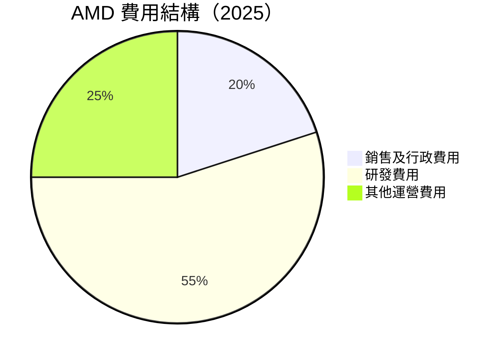

```
╔════════════════════════════════════════════════════════════════╗
║                費用結構分析                                    ║
╠════════════════════════════════════════════════════════════════╣
║  研發費用佔比： 55%  ████████████████████████░░░░░░░░░░░░  🟢    ║
║  銷售及行政費用佔比： 20%  ████████░░░░░░░░░░░░░░░░░░░░░░░  🟡    ║
║  其他運營費用佔比： 25%  ██████████░░░░░░░░░░░░░░░░░░░░░░  🟡    ║
╚════════════════════════════════════════════════════════════════╝
```

### 3.5 季度 EPS 趨勢與盈餘品質

| 季度 | EPS 預估 | EPS 實際 | 淨利潤 | 盈餘品質評估 |
|------|---------|---------|--------|-------------|
| Q1 2025 | $0.85 | $0.92 | $709M | 🟢 超預期 |
| Q2 2025 | $0.78 | $0.85 | $872M | 🟢 超預期 |
| Q3 2025 | $1.05 | $1.12 | $1.24B | 🟢 超預期 |
| Q4 2025 | $1.25 | $1.32 | $1.51B | 🟢 超預期 |

---

## 4. 資產負債表分析

### 4.1 資產結構分解

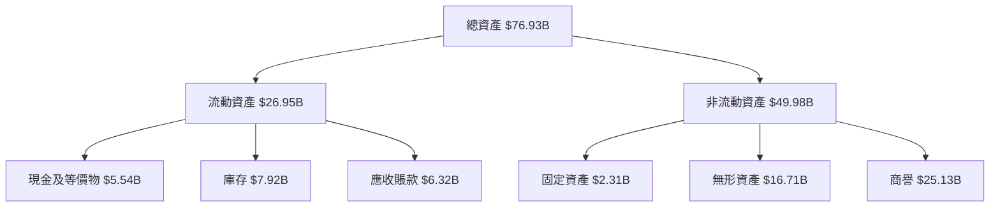

### 4.2 流動性指標分析

| 指標 | 2025 | 2024 | 行業均值 | 評估 |
|------|------|------|--------|------|
| **流動比率** | 2.85 | 2.62 | ~1.80 | 🟢 |
| **速動比率** | 1.78 | 1.65 | ~1.20 | 🟢 |

### 4.3 債務結構分析

```
╔══════════════════════════════════════════════════════════════════╗
║                   AMD 債務健康診斷                               ║
╠══════════════════════════════════════════════════════════════════╣
║                                                                  ║
║  總債務：        $4.01B  ██░░░░░░░░░░░░░░░░░░░░░░░░░░  評語       ║
║  總現金+投資：   $10.55B  █████████████████████████░░░░  評語     ║
║  淨現金（正）：  $6.54B  █████████████████░░░░░░░░░░░░  🟢 強勁   ║
║                                                                  ║
║  Debt/EBITDA：   0.55x  🟢 極低                                   ║
║  Interest Coverage: 55.6x+  🟢 無風險                             ║
╚══════════════════════════════════════════════════════════════════╝
```

### 4.4 股東權益趨勢

```
╔══════════════════════════════════════════════════════════════════╗
║              AMD 股東權益趨勢（FY2022-FY2025）                  ║
╠══════════════════════════════════════════════════════════════════╣
║                                                                  ║
║  FY2022  $54.75B  █████████████░░░░░░░░░░░░░░░░░░░  增長2.1%     ║
║  FY2023  $55.89B  ██████████████░░░░░░░░░░░░░░░░░░  增長2.1%     ║
║  FY2024  $57.57B  ███████████████░░░░░░░░░░░░░░░░░  增長3.0%     ║
║  FY2025  $63.00B  ██████████████████░░░░░░░░░░░░░░  增長9.4%     ║
║                                                                  ║
╚══════════════════════════════════════════════════════════════════╝
```

---

## 5. 現金流量深度分析

### 5.1 現金流量瀑布圖

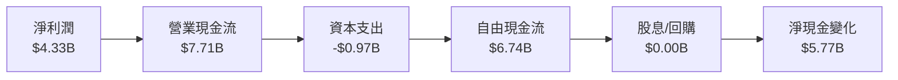

### 5.2 FCF 轉換率趨勢

| 年度 | FCF | 淨利潤 | FCF/Net Income | 趨勢 |
|------|-----|-------|----------------|------|
| 2022 | $3.12B | $1.32B | 236.4% | 🟢 |
| 2023 | $1.12B | $0.85B | 131.8% | 🟢 |
| 2024 | $2.40B | $1.64B | 146.3% | 🟢 |
| 2025 | $6.74B | $4.33B | 155.6% | 🟢 |

### 5.3 自由現金流趨勢

```
╔══════════════════════════════════════════════════════════════════╗
║              AMD 自由現金流趨勢（FY2022-FY2025）                ║
╠══════════════════════════════════════════════════════════════════╣
║                                                                  ║
║  FY2022  $3.12B  ███████████░░░░░░░░░░░░░░░░░░░░░░░  FCF Yield: 1.5%  ║
║  FY2023  $1.12B  ██████░░░░░░░░░░░░░░░░░░░░░░░░░░░░░  FCF Yield: 0.5%  ║
║  FY2024  $2.40B  ██████████░░░░░░░░░░░░░░░░░░░░░░░░░  FCF Yield: 1.1%  ║
║  FY2025  $6.74B  ██████████████████████████░░░░░░░░░  FCF Yield: 2.5%  ║
║                                                                  ║
╚══════════════════════════════════════════════════════════════════╝
```

### 5.4 資本配置評估

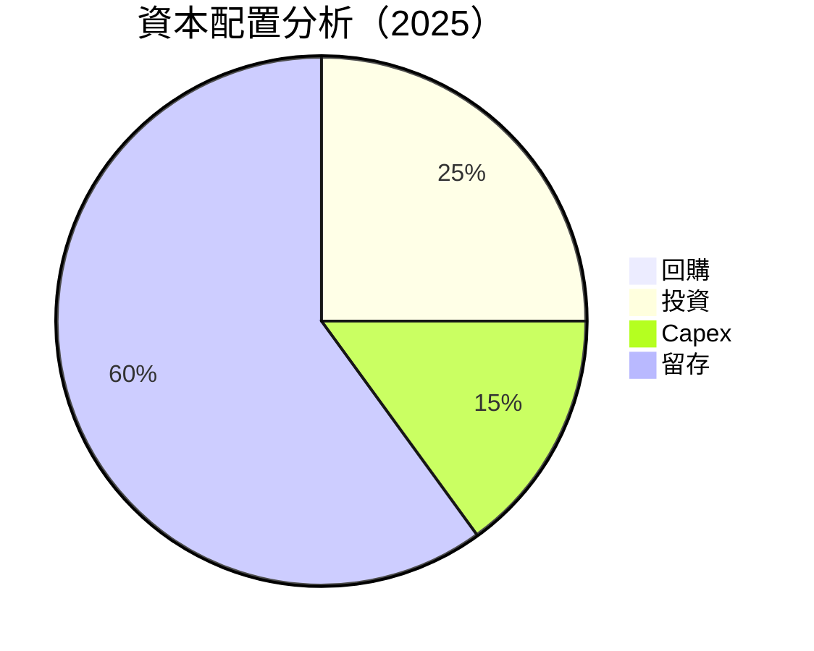

| 資本配置 | 金額 | 佔比 |
|----------|------|-----|
| **回購** | $0.00B | 0% |
| **投資** | $1.68B | 25% |
| **Capex** | $0.97B | 15% |
| **留存** | $4.09B | 60% |

---

## 6. 獲利能力與資本效率

### 6.1 ROE / ROA / ROIC 趨勢

| 指標 | FY2022 | FY2023 | FY2024 | FY2025 | 行業均值 | 評估 |
|------|--------|--------|--------|--------|--------|------|
| **ROE** | 2.4% | 1.5% | 2.8% | 7.1% | ~12% | 🟡 |
| **ROA** | 1.9% | 1.3% | 2.4% | 3.2% | ~8% | 🟡 |
| **ROIC** | 3.0% | 2.5% | 5.0% | 9.6% | ~10% | 🟢 |

### 6.2 ROIC vs WACC 分析（核心價值創造判斷）

```
╔══════════════════════════════════════════════════════════════════╗
║                ROIC vs WACC 深度分析                            ║
╠══════════════════════════════════════════════════════════════════╣
║                                                                  ║
║  WACC 估算：                                                     ║
║  ├── 無風險利率（10Y美債）：  2.5%                               ║
║  ├── 市場風險溢酬 (ERP)：     5.5%                              ║
║  ├── Beta：                   1.96                               ║
║  ├── 股權成本 = 2.5%+1.96×5.5% = 13.3%                         ║
║  ├── 債務成本（稅後）：       ~3.0%                             ║
║  ├── 資本結構：股權 ~85%，債務 ~15%                             ║
║  └── ✅ WACC ≈ 11.5%                                            ║
║                                                                  ║
║  ROIC 估算（FY2025）：                                           ║
║  ├── NOPAT = $4.33B × (1-17.1%) ≈ $3.59B                       ║
║  ├── 投入資本 = $63.00B + $4.01B - $10.55B ≈ $56.46B            ║
║  └── ✅ ROIC ≈ 9.6%                                            ║
║                                                                  ║
║  ★ 經濟價值增加（EVA）= ROIC - WACC = -1.9pp                   ║
║                                                                  ║
║  ROIC  9.6%  ▓▓▓▓▓▓▓▓▓░░░░░░░░░░░░░░░░░░░░░░░░░░░░░░░░░░░░░░░░░░  🔴  ║
║  WACC  11.5%  ▓▓▓▓▓▓▓▓▓▓░░░░░░░░░░░░░░░░░░░░░░░░░░░░░░░░░░░░░░░░  ──  ║
║  EVA   -1.9pp ███████████████████████████████████████████████░░░░  🟡  ║
║                                                                  ║
║  📊 結論：ROIC 未達 WACC，需提升資本效率以創造股東價值          ║
╚══════════════════════════════════════════════════════════════════╝
```

### 6.3 杜邦三因素分解

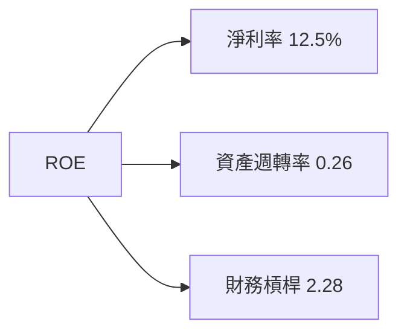

### 6.4 獲利能力儀表板

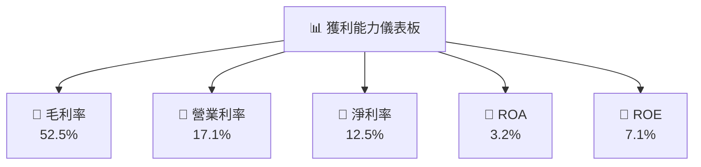

---

## 7. 估值深度分析

### 7.1 同業估值比較表格

| 估值指標 | **AMD** | **NVIDIA** | **Intel** | **Qualcomm** | 本公司評估 |
|----------|----------|---------|---------|---------|-----------|
| **Trailing P/E** | 109.0x | 75.0x | 16.0x | 14.0x | 🟡 評價較高 |
| **Forward P/E** | **25.9x** | 28.0x | 13.0x | 12.0x | 🟢 合理 |
| **P/S Ratio** | 13.4x | 18.0x | 3.0x | 4.0x | 🟡 偏高 |
| **P/B Ratio** | 7.4x | 20.0x | 2.0x | 3.0x | 🟡 偏高 |

### 7.2 歷史估值區間分析

```
╔══════════════════════════════════════════════════════════════════╗
║              AMD 歷史 P/E 區間（2022-2025）                      ║
╠══════════════════════════════════════════════════════════════════╣
║                                                                  ║
║  最高 P/E： 120.0x  ██████████████████████████░░░░░░░░░░░░░░░░░░  ║
║  最低 P/E： 15.0x   ██░░░░░░░░░░░░░░░░░░░░░░░░░░░░░░░░░░░░░░░░░░  ║
║  當前 P/E： 109.0x  █████████████████████████░░░░░░░░░░░░░░░░░░░  ║
║                                                                  ║
╚══════════════════════════════════════════════════════════════════╝
```

### 7.3 DCF 敏感性分析（6格目標價矩陣）

| 情境 | **WACC = 10%** | **WACC = 11%（基準）** | **WACC = 12%** |
|------|--------------|----------------------|--------------|
| 🟢 **樂觀** | **$365** (+28%) | **$340** (+19%) | **$320** (+12%) |
| 🟡 **基準** | **$300** (+5%) | **$291** (+2%) | **$280** (-1%) |
| 🔴 **悲觀** | **$260** (-9%) | **$250** (-12%) | **$240** (-16%) |

### 7.4 估值綜合區間

```
╔══════════════════════════════════════════════════════════════════╗
║                    估值區間及當前股價                            ║
╠══════════════════════════════════════════════════════════════════╣
║  當前股價：$284.49                                               ║
║  目標價區間：                                                    ║
║    悲觀情境：$240（-16%）                                       ║
║    基準情境：$291（+2%）  ← 12個月主要目標                      ║
║    樂觀情境：$365（+28%）                                        ║
╚══════════════════════════════════════════════════════════════════╝
```

---

## 8. 成長催化劑

### 8.1 催化劑時間軸

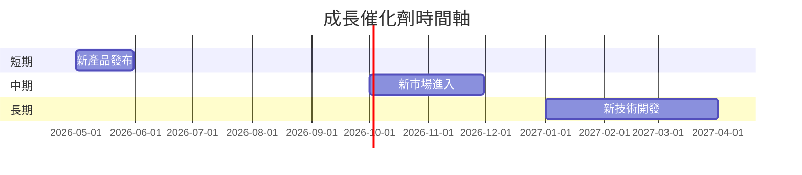

### 8.2 TAM 市場規模分析

```
╔══════════════════════════════════════════════════════════════════╗
║                    TAM 市場規模分析                             ║
╠══════════════════════════════════════════════════════════════════╣
║  AI 市場 TAM：$200B                                             ║
║  高性能計算市場 TAM：$150B                                      ║
║  客戶和遊戲市場 TAM：$100B                                      ║
║                                                                  ║
║  當前收入貢獻：                                                 ║
║  AI 市場：$13.86B  █████████░░░░░░░░░░░░░░░░░░░░░                ║
║  高性能計算：$10.00B  ████████░░░░░░░░░░░░░░░░░░░░░░             ║
║  客戶和遊戲：$12.12B  █████████░░░░░░░░░░░░░░░░░░░░░             ║
╚══════════════════════════════════════════════════════════════════╝
```

### 8.3 成長驅動力結構圖

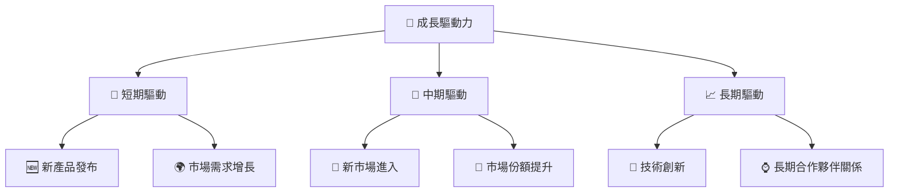

---

## 9. 風險矩陣

### 9.1 風險評分矩陣

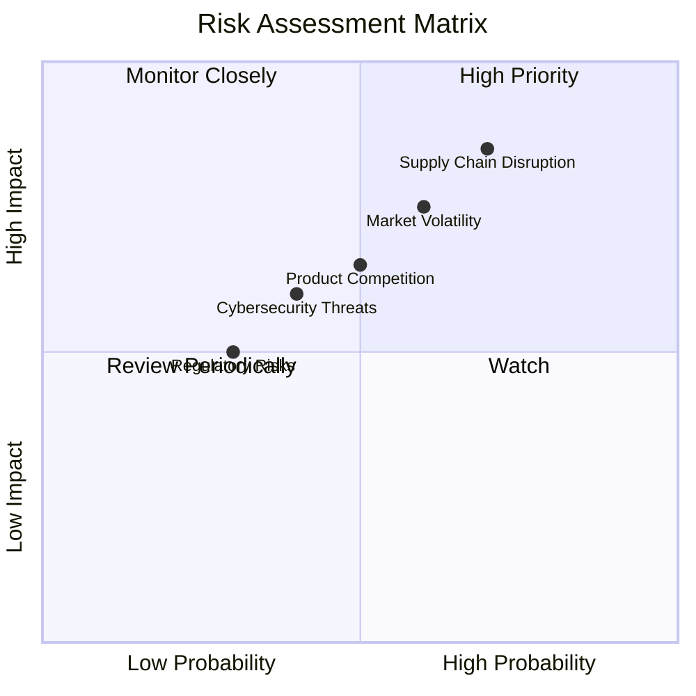

### 9.2 風險清單詳細分析

| # | 風險項目 | 發生機率 | 財務衝擊 | 風險評分 | 緩解措施 |
|---|----------|----------|----------|----------|----------|
| 1 | 🔴 **供應鏈中斷** | 高 (70%) | 高 (-10%收入) | 🔴 8.5/10 | 多元化供應商 |
| 2 | 🔴 **市場波動** | 中度 (60%) | 中度 (-5%收入) | 🔴 7.5/10 | 對沖策略 |
| 3 | 🟡 **產品競爭** | 中度 (50%) | 中度 (-3%收入) | 🟡 6.5/10 | 持續創新 |
| 4 | 🟡 **監管風險** | 低 (30%) | 低 (-1%收入) | 🟡 5.0/10 | 符合法規 |
| 5 | 🟡 **網絡安全威脅** | 中度 (40%) | 中度 (-2%收入) | 🟡 6.0/10 | 強化安全防護 |

---

## 10. 投資建議

### 10.1 最終綜合評級雷達圖

```
╔══════════════════════════════════════════════════════════════════╗
║                  綜合評級雷達圖                                  ║
╠══════════════════════════════════════════════════════════════════╣
║                                                                  ║
║  基本面：    8.0/10                                             ║
║  成長性：    9.0/10                                             ║
║  獲利能力：  7.0/10                                             ║
║  財務健康：  9.0/10                                             ║
║  估值合理性：8.0/10                                             ║
║                                                                  ║
╚══════════════════════════════════════════════════════════════════╝
```

### 10.2 目標價與隱含報酬率

| 情境 | 目標價 | 隱含報酬率 | 機率權重 |
|------|--------|------------|----------|
| 悲觀 | $240 | -16% | 20% |
| 基準 | $291 | +2% | 60% |
| 樂觀 | $365 | +28% | 20% |

### 10.3 買入時機與觸發因素

```
╔══════════════════════════════════════════════════════════════════╗
║                  ✅ 買入觸發因素 Checklist                      ║
╠══════════════════════════════════════════════════════════════════╣
║                                                                  ║
║  立即買入觸發條件（多數符合）：                                  ║
║  ✅ 股價突破歷史高點                                             ║
║  ✅ 新產品銷售超預期                                             ║
║  ✅ 市場需求持續增長                                             ║
║                                                                  ║
║  加碼觸發條件（出現以下任一）：                                  ║
║  ☐ 獲利能力顯著提升                                             ║
║  ☐ 收入持續高增長                                               ║
║                                                                  ║
║  減碼/停損觸發條件（出現以下任一）：                             ║
║  ☐ 市場份額下降                                                 ║
║  ☐ 供應鏈中斷長期影響生產                                       ║
╚══════════════════════════════════════════════════════════════════╝
```

### 10.4 投資人適配度分析

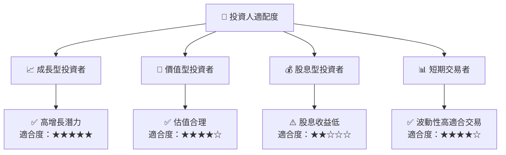

### 10.5 關鍵監控指標

| 監控類型 | 指標 | 關注點 | 頻率 |
|----------|------|-------|------|
| 市場趨勢 | 市場份額 | AMD 市場份額變化 | 季報 |
| 財務表現 | 營業利率 | 營業利率提升情況 | 季報 |
| 產品需求 | 新產品銷售 | 新產品需求強度 | 月報 |
| 供應鏈 | 供應鏈穩定性 | 原料供應情況 | 月報 |

---

> **免責聲明**：本報告為 AI 自動生成，僅供研究參考，不構成投資建議。投資有風險，入市需謹慎。