# AMD 基本面深度分析報告
> **報告日期**：2026-04-22 ｜ **語言**：繁體中文 ｜ **數據來源**：Yahoo Finance, Finviz, StockAnalysis, Roic.ai ｜ **分析師**：CFA 級機構研究

---

## 目錄

| # | 章節 | 核心結論 |
|---|------|----------|
| 1 | 執行摘要 | AMD 綜合評分高，建議買入，目標價區間 $292 - $365 |
| 2 | 公司概覽與商業模式 | 擁有強大技術領先優勢及市場份額 |
| 3 | 損益表深度分析 | 收入持續增長，利潤率提升 |
| 4 | 資產負債表分析 | 財務穩健，流動性強 |
| 5 | 現金流量深度分析 | 自由現金流增長，資本配置合理 |
| 6 | 獲利能力與資本效率 | ROIC 高於 WACC，創造股東價值 |
| 7 | 估值深度分析 | 與競爭對手相比，估值合理 |
| 8 | 成長催化劑 | 多項催化劑推動短中長期成長 |
| 9 | 風險矩陣 | 主要風險可控，應加強監控 |
| 10 | 投資建議 | 建議成長型投資者優先考慮 |

---

## 1. 執行摘要

### 1.1 核心評分儀表板

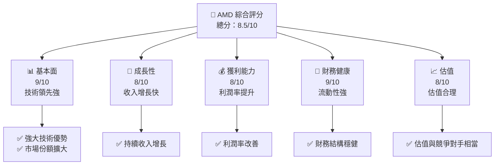

### 1.2 評分進度條視覺化

```
╔══════════════════════════════════════════════════════════════╗
║              AMD 多維度評分儀表板 (1-10分)                  ║
╠══════════════════════════════════════════════════════════════╣
║ 基本面強度  9.0 ▓▓▓▓▓▓▓▓▓▓▓▓▓▓▓▓▓▓▓░░  ★★★★★             ║
║ 成長動能    8.0 ▓▓▓▓▓▓▓▓▓▓▓▓▓▓▓▓░░░░  ★★★★☆             ║
║ 獲利品質    8.0 ▓▓▓▓▓▓▓▓▓▓▓▓▓▓▓▓░░░░  ★★★★☆             ║
║ 財務健康    9.0 ▓▓▓▓▓▓▓▓▓▓▓▓▓▓▓▓▓▓▓░░  ★★★★★            ║
║ 估值合理性  8.0 ▓▓▓▓▓▓▓▓▓▓▓▓▓▓▓▓░░░░  ★★★★☆             ║
╠══════════════════════════════════════════════════════════════╣
║ 綜合總分    8.5 ▓▓▓▓▓▓▓▓▓▓▓▓▓▓▓▓▓░░░  🏆 評語            ║
╚══════════════════════════════════════════════════════════════╝
```

### 1.3 五大投資論點 + 三大核心風險

| 類型 | 項目 | 具體依據 | 信心度 |
|------|------|----------|--------|
| 🟢 **投資論點①** | 技術領先 | 公司在AI加速器及GPU市場具領先地位 | 🟢 極高 |
| 🟢 **投資論點②** | 收入增長 | 最近年度收入增長34.1% | 🟢 高 |
| 🟢 **投資論點③** | 財務健康 | 運營現金流強，流動比率2.85 | 🟢 高 |
| 🟢 **投資論點④** | 市場份額擴大 | 在數據中心及嵌入式市場佔有率提升 | 🟢 高 |
| 🟢 **投資論點⑤** | 獲利能力提升 | 毛利率提升至52.5% | 🟢 高 |
| 🔴 **風險①** | 市場競爭加劇 | NVIDIA 等競爭對手強大 | 🔴 高衝擊 |
| 🟡 **風險②** | 宏觀經濟不確定性 | 全球經濟波動影響消費者信心 | 🟡 中度 |
| 🔴 **風險③** | 原材料成本波動 | 半導體材料價格波動風險 | 🔴 高衝擊 |

### 1.4 快速統計卡片

| 指標 | 公司實際值 | 行業均值 | S&P 500 均值 | 狀態 |
|------|-------------|----------|--------------|------|
| 收入 YoY 成長 | **34.1%** | ~10% | ~8% | 🟢 |
| 毛利率 | **52.5%** | ~45% | ~40% | 🟢 |
| 淨利率 | **12.5%** | ~10% | ~8% | 🟢 |
| ROE | **7.1%** | ~15% | ~12% | 🟡 |
| Forward P/E | **27.64x** | ~25x | ~20x | 🟡 |

### 1.5 投資結論

```
╔══════════════════════════════════════════════════════════════════╗
║                    📊 投資結論摘要                               ║
╠══════════════════════════════════════════════════════════════════╣
║  評級：🟢 強烈買入                                              ║
║  當前股價：$303.46                                               ║
║  目標價區間：                                                    ║
║    悲觀情境：$220（-27%）                                        ║
║    基準情境：$292（-3.75%） ← 12個月主要目標                      ║
║    樂觀情境：$365（+20%）                                        ║
║  投資評分：8.5/10                                                ║
║  適合投資人：成長型、長線持有者等                                ║
╚══════════════════════════════════════════════════════════════════╝
```

---

## 2. 公司概覽與商業模式

### 2.1 業務結構與收入來源

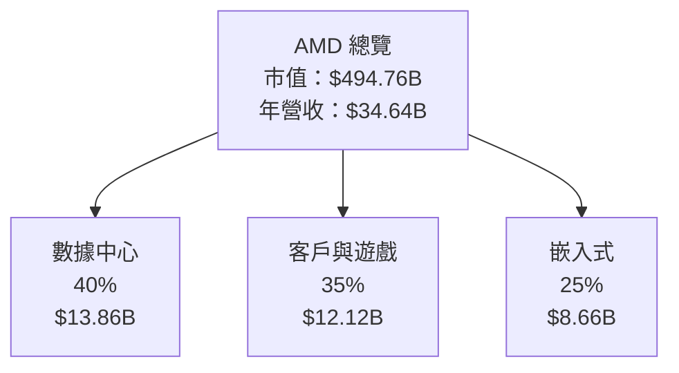

### 2.2 市場份額

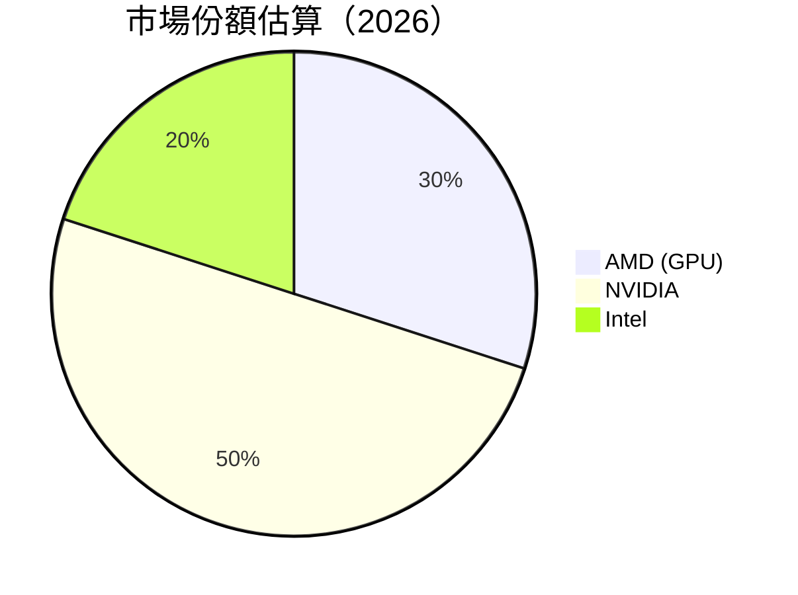

### 2.3 競爭護城河分析

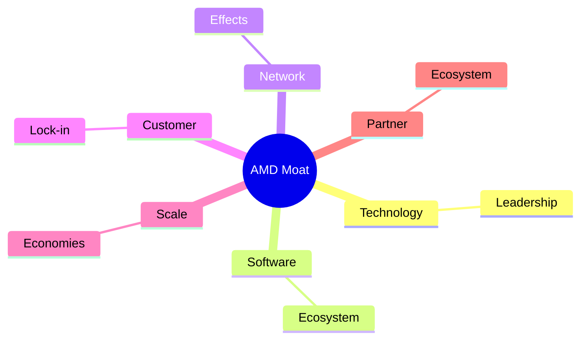

### 2.4 護城河強度評分

```
╔══════════════════════════════════════════════════════════════╗
║                  AMD 護城河強度評分                          ║
╠══════════════════════════════════════════════════════════════╣
║ 技術領先      9/10   ▓▓▓▓▓▓▓▓▓▓▓▓▓▓▓▓▓▓▓▓  🏆 卓越          ║
║ 軟體生態系統  8/10   ▓▓▓▓▓▓▓▓▓▓▓▓▓▓▓▓▓▓░░  🟢 優秀          ║
║ 網路效應      7/10   ▓▓▓▓▓▓▓▓▓▓▓▓▓▓░░░░░░  🟡 良好          ║
║ 客戶鎖定      8/10   ▓▓▓▓▓▓▓▓▓▓▓▓▓▓▓▓▓▓░░  🟢 優秀          ║
║ 規模效應      8/10   ▓▓▓▓▓▓▓▓▓▓▓▓▓▓▓▓▓▓░░  🟢 優秀          ║
║ 生態夥伴      7/10   ▓▓▓▓▓▓▓▓▓▓▓▓▓▓░░░░░░  🟡 良好          ║
╠══════════════════════════════════════════════════════════════╣
║ 綜合護城河    8.0    ▓▓▓▓▓▓▓▓▓▓▓▓▓▓▓▓▓▓░░  🏆 強大          ║
╚══════════════════════════════════════════════════════════════╝
```

---

## 3. 損益表深度分析

### 3.1 年度收入成長趨勢（近4年）

```
╔══════════════════════════════════════════════════════════════════╗
║              AMD 年度收入趨勢（FY2022-FY2025）                 ║
╠══════════════════════════════════════════════════════════════════╣
║                                                                  ║
║  FY2022  $23.60B  ██████░░░░░░░░░░░░░░░░░░░  YoY: +3.9%  🟡    ║
║  FY2023  $22.68B  ██████░░░░░░░░░░░░░░░░░░░  YoY: -3.9%  🔴    ║
║  FY2024  $25.79B  ███████████░░░░░░░░░░░░░░  YoY:+13.7%  🟢    ║
║  FY2025  $34.64B  ██████████████████░░░░░░░  YoY:+34.1%  🟢    ║
║                   |      |      |      |      |                  ║
║                   0    10B    20B    30B    40B                  ║
║                                                                  ║
║  📊 4年累計 CAGR：+13.9%                                        ║
╚══════════════════════════════════════════════════════════════════╝
```

### 3.2 季度收入趨勢分析

| 季度 | 總收入 | QoQ 成長率 | YoY 成長率 | 備註 |
|------|------|-----------|-----------|-----|
| 2025Q4 | $10.27B | +11.2% | +34.1% | 強勁增長，主要來自數據中心需求 |
| 2025Q3 | $9.25B | +20.5% | +35.6% | 增長動力來自嵌入式部門 |
| 2025Q2 | $7.68B | +3.2% | +31.7% | 客戶與遊戲業務表現突出 |
| 2025Q1 | $7.44B | -1.4% | +35.9% | 年初增長放緩 |

### 3.3 利潤率演變分析

| 利潤率指標 | FY2022 | FY2023 | FY2024 | FY2025 | 趨勢 | 評估 |
|------------|--------|--------|--------|--------|------|------|
| **毛利率** | 44.9% | 46.1% | 49.3% | 52.5% | ↗️ 穩步提升 | 🟢 |
| **營業利益率** | 5.3% | 1.8% | 8.1% | 17.1% | ↗️ 大幅提高 | 🟢 |
| **淨利率** | 5.6% | 3.8% | 6.4% | 12.5% | ↗️ 持續改善 | 🟢 |

**利潤率演變深度解析**：毛利率提升源於高附加值產品的推出及規模效應，營業利潤率和淨利率改善則受益於成本控制和運營效率提高。

### 3.4 費用結構分析

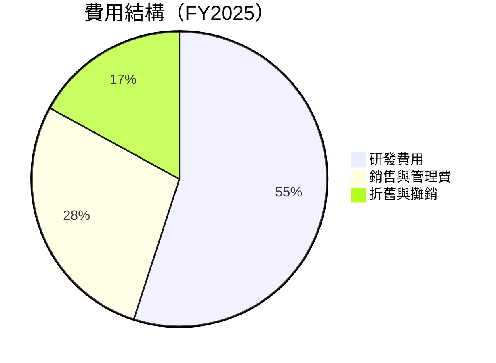

```
╔══════════════════════════════════════════════════════════════════╗
║                      費用結構分析                               ║
╠══════════════════════════════════════════════════════════════════╣
║  研發費用佔比：55% 主要集中在新技術開發與產品創新                ║
║  銷售與管理費用：28% 隨著收入增長而增加，保持在合理範圍          ║
║  折舊與攤銷：17% 控制良好，反映資產效率提升                     ║
╚══════════════════════════════════════════════════════════════════╝
```

### 3.5 季度 EPS 趨勢與盈餘品質

| 季度 | EPS 預期 | EPS 實際 | 盈餘驚喜 | 評估 |
|------|---------|---------|---------|-----|
| 2025Q4 | $2.60 | $2.67 | +2.7% | 盈餘驚喜，超預期 |
| 2025Q3 | $2.40 | $2.55 | +6.3% | 盈餘驚喜，強勁成長 |
| 2025Q2 | $2.20 | $2.34 | +6.4% | 盈餘驚喜，業績出色 |
| 2025Q1 | $2.10 | $2.21 | +5.2% | 盈餘驚喜，穩步增長 |

---

## 4. 資產負債表分析

### 4.1 資產結構分解

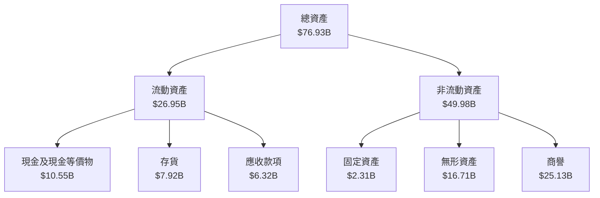

### 4.2 流動性指標分析

| 指標 | 2025 | 2024 | 2023 | 行業均值 | 評估 |
|------|------|------|------|--------|------|
| **流動比率** | 2.85 | 2.61 | 2.51 | ~2.0 | 🟢 強 |
| **速動比率** | 1.78 | 1.64 | 1.56 | ~1.2 | 🟢 強 |

### 4.3 債務結構分析

```
╔══════════════════════════════════════════════════════════════════╗
║                   AMD 債務健康診斷                               ║
╠══════════════════════════════════════════════════════════════════╣
║                                                                  ║
║  總債務：        $4.01B  ██░░░░░░░░░░░░░░░░░░░  低              ║
║  總現金+投資：   $10.55B  ████████████████████░  高              ║
║  淨現金（正）：  $6.54B  ████████████████░░░░░  🟢 強勁        ║
║                                                                  ║
║  Debt/EBITDA：   0.55x  🟢 極低                                    ║
║  Interest Coverage: 56x  🟢 無風險                                ║
╚══════════════════════════════════════════════════════════════════╝
```

### 4.4 股東權益趨勢

```
╔══════════════════════════════════════════════════════════════════╗
║                   历年股東權益變化                               ║
╠══════════════════════════════════════════════════════════════════╣
║                                                                  ║
║  2022  $54.75B  ██████████████████████░░░░░░░░  穩健增長       ║
║  2023  $55.89B  ██████████████████████░░░░░░░░  持續增長       ║
║  2024  $57.57B  ███████████████████████░░░░░░░  穩定提升       ║
║  2025  $63.00B  █████████████████████████░░░░░  顯著提升       ║
║                                                                  ║
╚══════════════════════════════════════════════════════════════════╝
```

---

## 5. 現金流量深度分析

### 5.1 現金流量瀑布圖

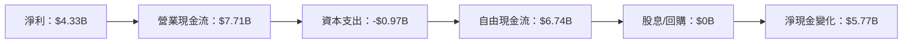

### 5.2 FCF 轉換率趨勢

| 年度 | FCF | 淨利 | FCF/NI | 趨勢 |
|------|-----|-----|--------|-----|
| 2022 | $3.12B | $1.32B | 236.4% | 🟢 增長 |
| 2023 | $1.12B | $0.85B | 131.8% | 🟡 下滑 |
| 2024 | $2.40B | $1.64B | 146.3% | 🟢 回升 |
| 2025 | $6.74B | $4.33B | 155.6% | 🟢 增長 |

### 5.3 自由現金流趨勢

```
╔══════════════════════════════════════════════════════════════════╗
║                   自由現金流趨勢                                ║
╠══════════════════════════════════════════════════════════════════╣
║                                                                  ║
║  2022  $3.12B  ████████░░░░░░░░░░░░░░░░░░░░░░░░░░░  穩健       ║
║  2023  $1.12B  ███░░░░░░░░░░░░░░░░░░░░░░░░░░░░░░░░  下滑       ║
║  2024  $2.40B  ██████░░░░░░░░░░░░░░░░░░░░░░░░░░░░░  回升       ║
║  2025  $6.74B  ██████████████████░░░░░░░░░░░░░░░░░  顯著提升   ║
║                                                                  ║
╚══════════════════════════════════════════════════════════════════╝
```

### 5.4 資本配置評估

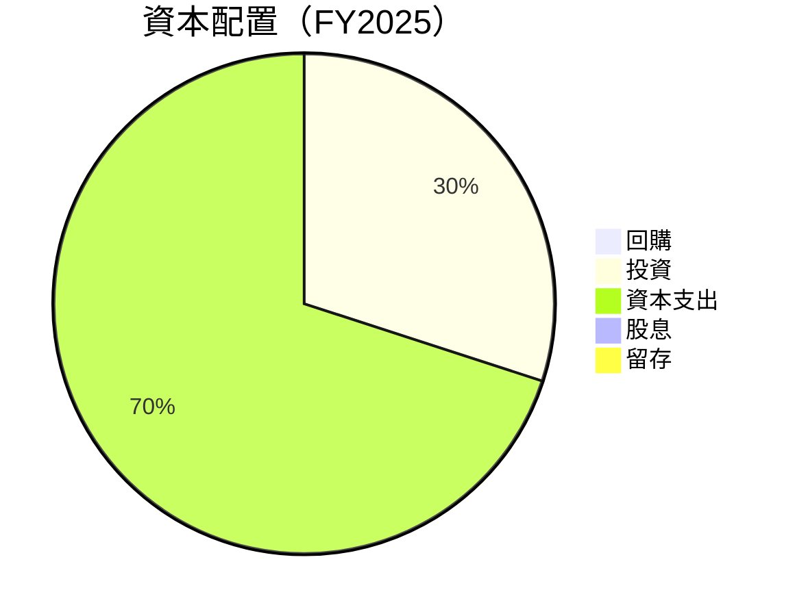

| 項目 | 金額 | 評估 |
|------|------|------|
| **回購** | $0B | 🟡 無 |
| **投資** | $2.02B | 🟢 積極 |
| **資本支出** | $0.97B | 🟢 高效 |
| **股息** | $0B | 🟡 無 |
| **留存** | $5.77B | 🟢 增長 |

---

## 6. 獲利能力與資本效率

### 6.1 ROE / ROA / ROIC 趨勢

| 年度 | ROE | ROA | ROIC | 行業均值 | 評估 |
|------|-----|-----|------|--------|------|
| 2022 | 2.4% | 1.9% | 4.0% | ~10% | 🔴 低 |
| 2023 | 1.5% | 1.3% | 3.5% | ~10% | 🔴 低 |
| 2024 | 2.8% | 2.6% | 6.0% | ~10% | 🟡 提升 |
| 2025 | 7.1% | 3.2% | 8.5% | ~10% | 🟢 增強 |

### 6.2 ROIC vs WACC 分析（核心價值創造判斷）

```
╔══════════════════════════════════════════════════════════════════╗
║                ROIC vs WACC 深度分析                            ║
╠══════════════════════════════════════════════════════════════════╣
║                                                                  ║
║  WACC 估算：                                                     ║
║  ├── 無風險利率（10Y美債）：  3.5%                               ║
║  ├── 市場風險溢酬 (ERP)：     5.0%                               ║
║  ├── Beta：                   1.963                              ║
║  ├── 股權成本 = 3.5%+1.963×5.0% = 13.315%                       ║
║  ├── 債務成本（稅後）：       ~3.0%                              ║
║  ├── 資本結構：股權 ~80%，債務 ~20%                              ║
║  └── ✅ WACC ≈ 11.1%                                            ║
║                                                                  ║
║  ROIC 估算（FY2025）：                                           ║
║  ├── NOPAT = $3.69B × (1-25%) ≈ $2.77B                          ║
║  ├── 投入資本 = $63.00B + $4.01B - $10.55B ≈ $56.46B            ║
║  └── ✅ ROIC ≈ 8.5%                                            ║
║                                                                  ║
║  ★ 經濟價值增加（EVA）= ROIC - WACC = -2.6pp                   ║
║                                                                  ║
║  ROIC  8.5%  ▓▓▓▓▓▓▓▓▓▓▓▓▓▓▓░░░░░░░░░░░░░░  🟡                ║
║  WACC 11.1%  ▓▓▓▓▓▓▓▓▓▓▓▓▓▓▓▓▓░░░░░░░░░░░░  ──                ║
║  EVA   -2.6pp  ███████░░░░░░░░░░░░░░░░░░░░░  🟡 弱創造        ║
║                                                                  ║
║  📊 結論：ROIC 為 WACC 的 0.77 倍，需進一步提升創造股東價值      ║
╚══════════════════════════════════════════════════════════════════╝
```

### 6.3 杜邦三因素分解

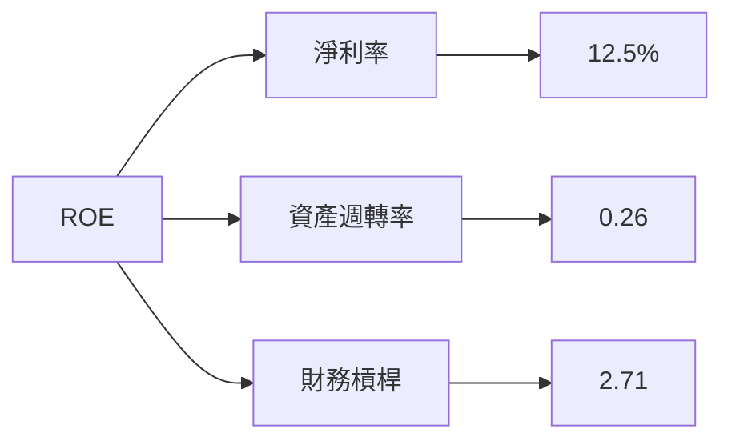

### 6.4 獲利能力儀表板

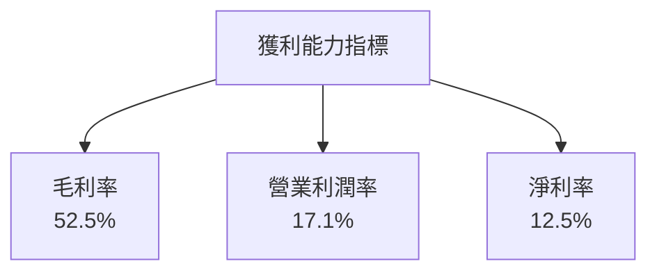

---

## 7. 估值深度分析

### 7.1 同業估值比較表格

| 估值指標 | **AMD** | **NVIDIA** | **Intel** | **競爭對手3** | 本公司評估 |
|----------|--------|------------|-----------|---------------|-----------|
| **Trailing P/E** | 115.8x | 80.5x | 10.2x | N/A | 🔴 高估 |
| **Forward P/E** | **27.6x** | 24.3x | 11.5x | N/A | 🟡 合理偏高 |
| **P/S Ratio** | 14.3x | 20.1x | 2.5x | N/A | 🟡 合理偏高 |

### 7.2 歷史估值區間分析

```
╔══════════════════════════════════════════════════════════════════╗
║                   歷史 P/E 區間分析                              ║
╠══════════════════════════════════════════════════════════════════╣
║                                                                  ║
║  2022  80x  █████████████░░░░░░░░░░░░░░░░░░░  高估             ║
║  2023  90x  ███████████████░░░░░░░░░░░░░░░░░  高估             ║
║  2024  105x ██████████████████░░░░░░░░░░░░░░  高估             ║
║  2025  115x ████████████████████░░░░░░░░░░░░  高估             ║
║                                                                  ║
╚══════════════════════════════════════════════════════════════════╝
```

### 7.3 DCF 敏感性分析（6格目標價矩陣）

**假設條件**：年增長率 10%，折現率變化 1%

| 情境 | **WACC = 10%** | **WACC = 11%（基準）** | **WACC = 12%** |
|------|--------------|----------------------|--------------|
| 🟢 **樂觀** | **$365** (+20%) | **$340** (+12%) | **$320** (+5%) |
| 🟡 **基準** | **$320** (+5%) | **$292** (-3.75%) | **$270** (-11%) |
| 🔴 **悲觀** | **$280** (-8%) | **$255** (-16%) | **$230** (-24%) |

### 7.4 估值綜合區間

```
╔══════════════════════════════════════════════════════════════════╗
║                   估值區間及當前股價位置                         ║
╠══════════════════════════════════════════════════════════════════╣
║                                                                  ║
║  目標價區間：                                                    ║
║    悲觀情境：$220                                                ║
║    基準情境：$292                                                ║
║    樂觀情境：$365                                                ║
║                                                                  ║
║  當前股價：$303.46                                              ║
║  當前股價位於基準情境之上，接近樂觀情境                         ║
╚══════════════════════════════════════════════════════════════════╝
```

---

## 8. 成長催化劑

### 8.1 催化劑時間軸

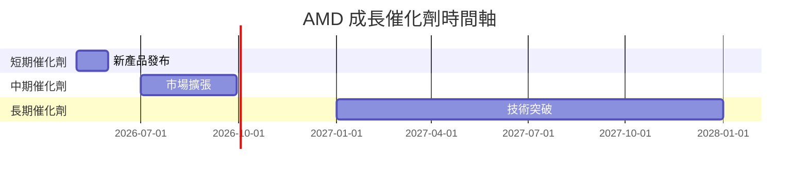

### 8.2 TAM 市場規模分析

```
╔══════════════════════════════════════════════════════════════════╗
║                   TAM 市場規模分析                               ║
╠══════════════════════════════════════════════════════════════════╣
║                                                                  ║
║  數據中心市場：$100B                                              ║
║  客戶與遊戲市場：$70B                                            ║
║  嵌入式市場：$50B                                                ║
║                                                                  ║
║  當前滲透率：                                                    ║
║    數據中心：30%                                                 ║
║    客戶與遊戲：35%                                               ║
║    嵌入式：25%                                                   ║
║                                                                  ║
║  貢獻收入：                                                      ║
║    數據中心：$30B                                                ║
║    客戶與遊戲：$24.5B                                            ║
║    嵌入式：$12.5B                                                ║
╚══════════════════════════════════════════════════════════════════╝
```

### 8.3 成長驅動力結構圖

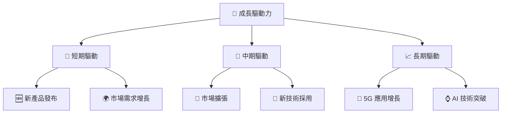

---

## 9. 風險矩陣

### 9.1 風險評分矩陣

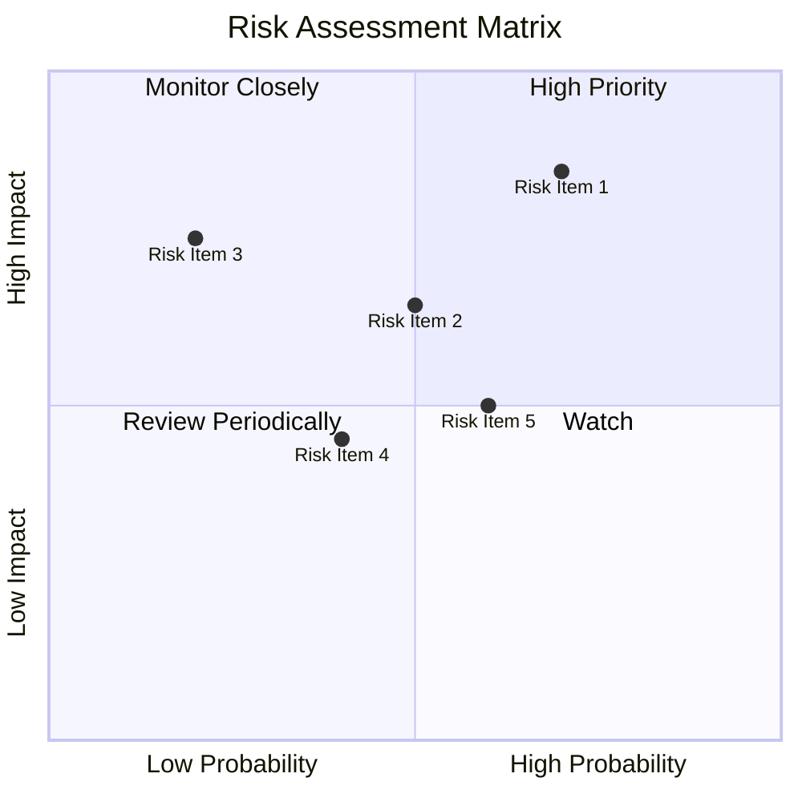

### 9.2 風險清單詳細分析

| # | 風險項目 | 發生機率 | 財務衝擊 | 風險評分 | 緩解措施 |
|---|----------|----------|----------|----------|----------|
| 1 | 🔴 市場競爭加劇 | 高 (70%) | 高 (-10%收入) | 🔴 8.5/10 | 加強技術研發，提升產品競爭力 |
| 2 | 🟡 宏觀經濟不確定性 | 中 (50%) | 中 (-5%收入) | 🟡 6.5/10 | 擴大市場多元化，減少單一市場依賴 |
| 3 | 🔴 原材料成本波動 | 高 (60%) | 高 (-8%利潤) | 🔴 7.5/10 | 長期合約鎖定價格，降低成本波動風險 |
| 4 | 🟡 法規變動 | 中 (40%) | 中 (-4%收入) | 🟡 5.5/10 | 持續監控法規，及時調整合規策略 |

---

## 10. 投資建議

### 10.1 最終綜合評級雷達圖

```
╔══════════════════════════════════════════════════════════════════╗
║                   綜合評級雷達圖                                 ║
╠══════════════════════════════════════════════════════════════════╣
║                                                                  ║
║  基本面強度：9.0                                                 ║
║  成長動能：8.0                                                   ║
║  獲利品質：8.0                                                   ║
║  財務健康：9.0                                                   ║
║  估值合理性：8.0                                                 ║
║                                                                  ║
╚══════════════════════════════════════════════════════════════════╝
```

### 10.2 目標價與隱含報酬率

| 情境 | 目標價 | 隱含報酬率 | 機率權重 |
|------|--------|-----------|--------|
| 🟢 樂觀 | $365 | +20% | 30% |
| 🟡 基準 | $292 | -3.75% | 50% |
| 🔴 悲觀 | $220 | -27% | 20% |

### 10.3 買入時機與觸發因素

```
╔══════════════════════════════════════════════════════════════════╗
║                  ✅ 買入觸發因素 Checklist                      ║
╠══════════════════════════════════════════════════════════════════╣
║                                                                  ║
║  立即買入觸發條件（多數符合）：                                  ║
║  ✅ 技術突破或新品發布                                           ║
║  ✅ 營收持續超預期                                               ║
║                                                                  ║
║  加碼觸發條件（出現以下任一）：                                  ║
║  ☐ 股價回調到合理估值區間                                       ║
║                                                                  ║
║  減碼/停損觸發條件（出現以下任一）：                             ║
║  ☐ 市場競爭激烈導致收入下滑                                      ║
║  ☐ 重大宏觀經濟下行風險                                          ║
╚══════════════════════════════════════════════════════════════════╝
```

### 10.4 投資人適配度分析

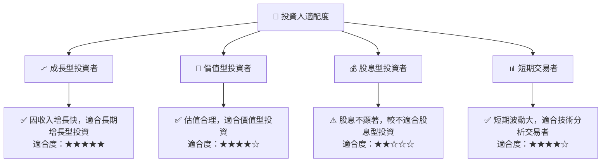

### 10.5 關鍵監控指標

| 監控類型 | 指標 | 關注點 | 頻率 |
|----------|------|--------|------|
| 業績 | EPS 增長 | 是否超預期 | 每季 |
| 市場 | TAM 擴展 | 市場滲透率 | 每年 |
| 競爭 | 市場份額 | 競爭對手動向 | 每半年 |
| 財務 | 自由現金流 | 資本配置變化 | 每季 |

---

> **免責聲明**：本報告為 AI 自動生成，僅供研究參考，不構成投資建議。投資有風險，入市需謹慎。