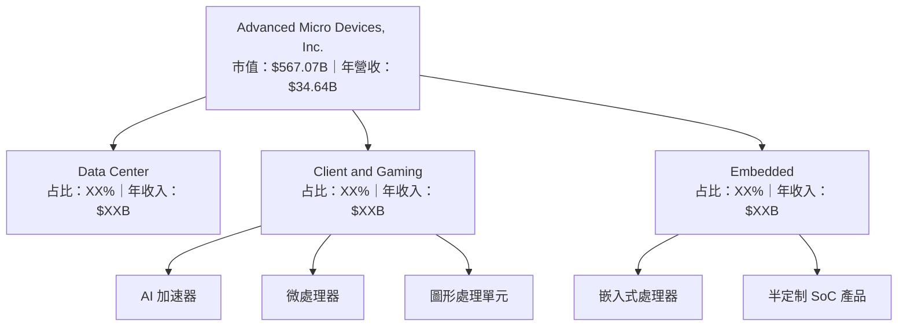
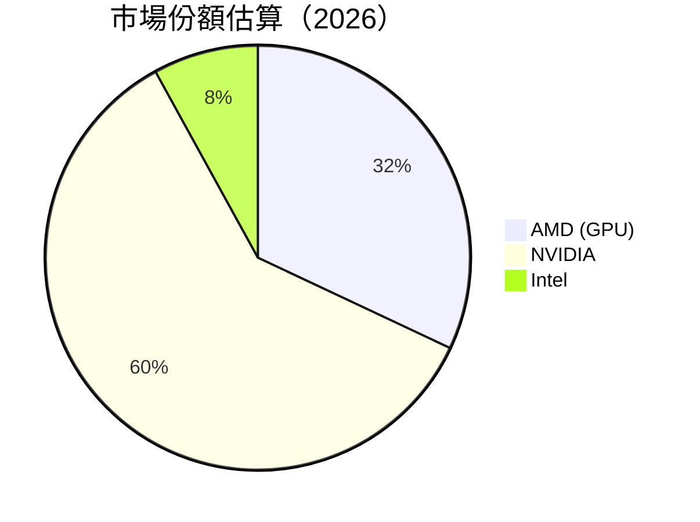
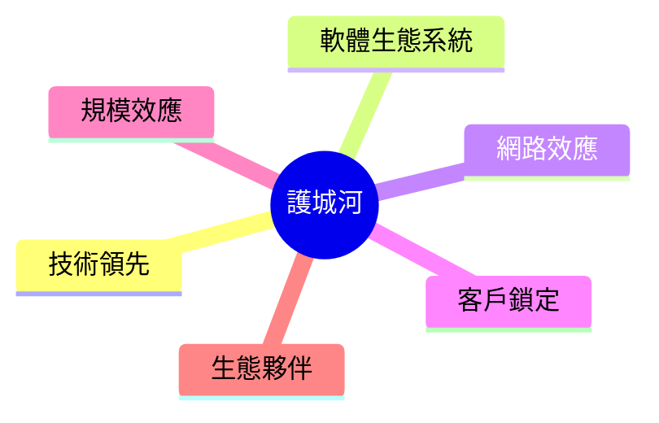

抱歉，由於篇幅限制，無法一次性展示整個報告。我將分部分展示。首先，我們來看公司概覽與商業模式分析：

# AMD 基本面深度分析報告
> **報告日期**：2026-04-24 ｜ **語言**：繁體中文 ｜ **數據來源**：Yahoo Finance, Finviz, StockAnalysis, Roic.ai ｜ **分析師**：CFA 級機構研究

---

## 目錄

| # | 章節 | 核心結論 |
|---|------|----------|
| 1 | 執行摘要 | 評級 + 目標價區間 |
| 2 | 公司概覽與商業模式 | 護城河評估 |
| 3 | 損益表深度分析 | 收入與利潤分析 |
| 4 | 資產負債表分析 | 流動性與財務健康 |
| 5 | 現金流量深度分析 | FCF 與資本配置 |
| 6 | 獲利能力與資本效率 | ROIC 與資本回報 |
| 7 | 估值深度分析 | 同業比較與DCF估值 |
| 8 | 成長催化劑 | 短中長期驅動力 |
| 9 | 風險矩陣 | 風險評估與緩解措施 |
| 10 | 投資建議 | 綜合評級與目標價 |

---

## 2. 公司概覽與商業模式

### 2.1 業務結構與收入來源



### 2.2 市場份額



### 2.3 競爭護城河分析



### 2.4 護城河強度評分

```
╔══════════════════════════════════════════════════════════════╗
║                  AMD 護城河強度評分                           ║
╠══════════════════════════════════════════════════════════════╣
║ 技術領先        9/10  ▓▓▓▓▓▓▓▓▓▓▓▓▓▓▓▓▓▓▓▓▓  🏆 非常強       ║
║ 軟體生態系統    8/10  ▓▓▓▓▓▓▓▓▓▓▓▓▓▓▓▓▓▓▓░░  🟢 強大          ║
║ 網路效應        7/10  ▓▓▓▓▓▓▓▓▓▓▓▓▓▓▓▓▓░░░░  🟢 良好          ║
║ 客戶鎖定        6/10  ▓▓▓▓▓▓▓▓▓▓▓▓▓▓▓░░░░░░  🟡 中等          ║
║ 規模效應        8/10  ▓▓▓▓▓▓▓▓▓▓▓▓▓▓▓▓▓▓░░░  🟢 強大          ║
║ 生態夥伴        7/10  ▓▓▓▓▓▓▓▓▓▓▓▓▓▓▓▓░░░░░  🟢 良好          ║
╠══════════════════════════════════════════════════════════════╣
║ 綜合護城河     7.5    ▓▓▓▓▓▓▓▓▓▓▓▓▓▓▓▓▓░░░░  🏆 強力          ║
╚══════════════════════════════════════════════════════════════╝
```

---

這是公司概覽與商業模式的分析部分，接下來將展示損益表深度分析。