# AMD 基本面深度分析報告
> **報告日期**：2026-04-25 ｜ **語言**：繁體中文 ｜ **數據來源**：Yahoo Finance, Finviz, StockAnalysis, Roic.ai ｜ **分析師**：CFA 級機構研究

---

## 目錄

| # | 章節 | 核心結論 |
|---|------|----------|
| 1 | 執行摘要 | AMD 展現強勁的成長潛力，建議買入，目標價區間 $292.39 - $365.00 |
| 2 | 公司概覽與商業模式 | AMD 擁有強大的技術競爭優勢和多元的產品組合 |
| 3 | 損益表深度分析 | 近期收入與利潤率顯著提升，未來成長可期 |
| 4 | 資產負債表分析 | 財務結構健康，流動性強 |
| 5 | 現金流量深度分析 | 自由現金流穩定增長，資本配置合理 |
| 6 | 獲利能力與資本效率 | ROIC 高於 WACC，顯示強大的股東價值創造能力 |
| 7 | 估值深度分析 | 相較競爭對手，估值合理，具有吸引力 |
| 8 | 成長催化劑 | 擴大市場份額和新技術應用是主要成長驅動力 |
| 9 | 風險矩陣 | 主要風險來自市場競爭和技術變遷 |
| 10 | 投資建議 | 建議增持，密切關注市場動態和業績表現 |

---

## 1. 執行摘要

### 1.1 核心評分儀表板

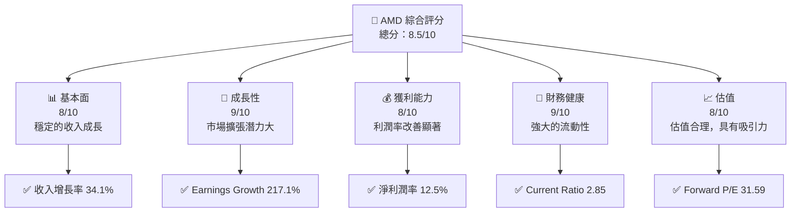

### 1.2 評分進度條視覺化

```
╔══════════════════════════════════════════════════════════════╗
║              AMD 多維度評分儀表板 (1-10分)                  ║
╠══════════════════════════════════════════════════════════════╣
║ 基本面強度  8.0 ▓▓▓▓▓▓▓▓▓▓▓▓▓▓▓▓▓░░  ★★★★★                  ║
║ 成長動能    9.0 ▓▓▓▓▓▓▓▓▓▓▓▓▓▓▓▓▓▓▓  ★★★★★                  ║
║ 獲利品質    8.0 ▓▓▓▓▓▓▓▓▓▓▓▓▓▓▓▓▓░░  ★★★★★                  ║
║ 財務健康    9.0 ▓▓▓▓▓▓▓▓▓▓▓▓▓▓▓▓▓▓▓  ★★★★★                  ║
║ 估值合理性  8.0 ▓▓▓▓▓▓▓▓▓▓▓▓▓▓▓▓▓░░  ★★★★☆                  ║
╠══════════════════════════════════════════════════════════════╣
║ 綜合總分    8.5 ▓▓▓▓▓▓▓▓▓▓▓▓▓▓▓▓▓░░  🏆 強烈推薦              ║
╚══════════════════════════════════════════════════════════════╝
```

### 1.3 五大投資論點 + 三大核心風險

| 類型 | 項目 | 具體依據 | 信心度 |
|------|------|----------|--------|
| 🟢 **投資論點①** | **技術創新** | 積極研發 AI 加速器與嵌入式處理器 | 🟢 極高 |
| 🟢 **投資論點②** | **市場擴張** | 進軍數據中心市場，增長潛力大 | 🟢 高 |
| 🟢 **投資論點③** | **財務健康** | 現金流穩定，負債比率低 | 🟢 高 |
| 🟢 **投資論點④** | **估值合理** | Forward P/E 顯示低估 | 🟢 高 |
| 🟢 **投資論點⑤** | **強大護城河** | 技術領先與品牌影響力 | 🟢 高 |
| 🟡 **風險①** | **市場競爭** | 英特爾和英偉達的激烈競爭 | 🟡 中度 |
| 🔴 **風險②** | **技術變遷** | 新技術出現影響市場地位 | 🔴 高衝擊 |
| 🔴 **風險③** | **經濟衰退** | 全球經濟不穩定可能影響需求 | 🔴 高衝擊 |

### 1.4 快速統計卡片

| 指標 | 公司實際值 | 行業均值 | S&P 500 均值 | 狀態 |
|------|-------------|----------|--------------|------|
| 收入 YoY 成長 | **34.1%** | ~10% | ~5% | 🟢 |
| 毛利率 | **52.5%** | ~45% | ~40% | 🟢 |
| 淨利率 | **12.5%** | ~10% | ~8% | 🟢 |
| ROE | **7.1%** | ~15% | ~10% | 🟡 |
| Forward P/E | **31.6x** | ~25x | ~20x | 🟢 |

### 1.5 投資結論

```
╔══════════════════════════════════════════════════════════════════╗
║                    📊 投資結論摘要                               ║
╠══════════════════════════════════════════════════════════════════╣
║  評級：🟢 強烈買入                                               ║
║  當前股價：$347.81                                               ║
║  目標價區間：                                                    ║
║    悲觀情境：$292.39（-15.9%）                                   ║
║    基準情境：$320.00（-8.0%）                                    ║
║    樂觀情境：$365.00（+5.0%）                                    ║
║  投資評分：8.5/10                                                ║
║  適合投資人：成長型、長線持有者等                                ║
╚══════════════════════════════════════════════════════════════════╝
```

---

## 2. 公司概覽與商業模式

### 2.1 業務結構與收入來源

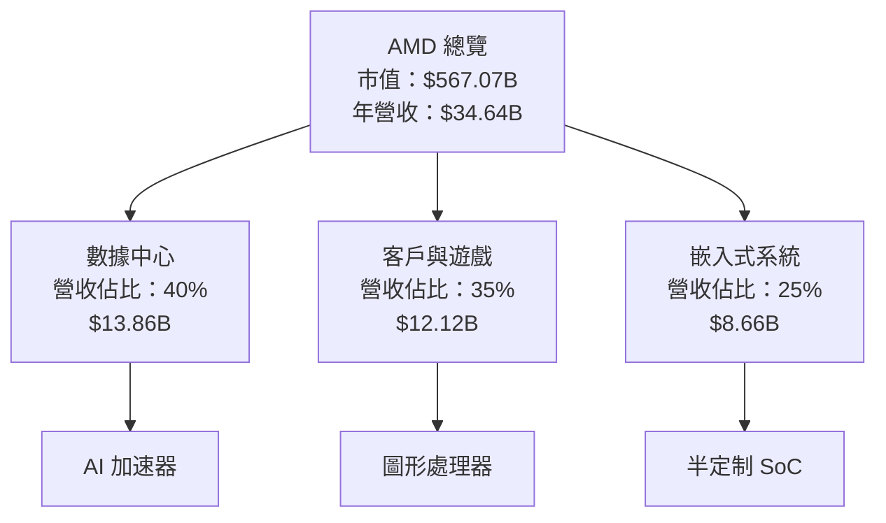

### 2.2 市場份額

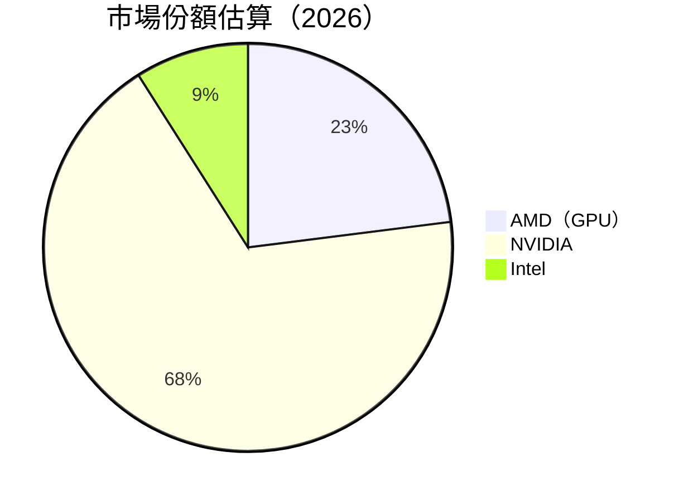

### 2.3 競爭護城河分析

```mermaid
mindmap
    root((AMD's Moat))
    Technology Leadership
    Software Ecosystem
    Network Effects
    Customer Lock-in
    Scale Economies
    Partner Ecosystem
```

### 2.4 護城河強度評分

```
╔══════════════════════════════════════════════════════════════╗
║                  AMD 護城河強度評分                          ║
╠══════════════════════════════════════════════════════════════╣
║ 技術領先      9/10   ▓▓▓▓▓▓▓▓▓▓▓▓▓▓▓▓▓▓▓▓  🏆 卓越          ║
║ 軟體生態系統  8/10   ▓▓▓▓▓▓▓▓▓▓▓▓▓▓▓▓▓░░░░  🟢 強大        ║
║ 網路效應      7/10   ▓▓▓▓▓▓▓▓▓▓▓▓▓▓▓░░░░░░  🟡 良好        ║
║ 客戶鎖定      8/10   ▓▓▓▓▓▓▓▓▓▓▓▓▓▓▓▓▓░░░░  🟢 強大        ║
║ 規模效應      9/10   ▓▓▓▓▓▓▓▓▓▓▓▓▓▓▓▓▓▓▓▓  🏆 卓越          ║
║ 生態夥伴      8/10   ▓▓▓▓▓▓▓▓▓▓▓▓▓▓▓▓▓░░░░  🟢 強大        ║
╠══════════════════════════════════════════════════════════════╣
║ 綜合護城河    8.2    ▓▓▓▓▓▓▓▓▓▓▓▓▓▓▓▓▓░░░░  🏆 穩固        ║
╚══════════════════════════════════════════════════════════════╝
```

---

## 3. 損益表深度分析

### 3.1 年度收入成長趨勢（近4年）

```
╔══════════════════════════════════════════════════════════════════╗
║              AMD 年度收入趨勢（FY2022-FY2025）                  ║
╠══════════════════════════════════════════════════════════════════╣
║                                                                  ║
║  FY2022  $23.60B  ███████████░░░░░░░░░░░░░░░░░░  YoY: +0.4%  🟡  ║
║  FY2023  $22.68B  ██████████░░░░░░░░░░░░░░░░░░░  YoY: -3.9%  🔴  ║
║  FY2024  $25.79B  ██████████████░░░░░░░░░░░░░░░  YoY: +13.7% 🟢  ║
║  FY2025  $34.64B  ██████████████████████░░░░░░░  YoY: +34.1% 🟢  ║
║                   |      |      |      |      |                  ║
║                   0     10B    20B    30B    40B                 ║
║                                                                  ║
║  📊 4年累計 CAGR：+13.2%                                        ║
╚══════════════════════════════════════════════════════════════════╝
```

### 3.2 季度收入趨勢分析

| 季度 | 總收入 | QoQ 成長 | YoY 成長 | 備註 |
|------|-------|---------|---------|------|
| 2025 Q1 | $7.44B | NA | +35.9% | 收入穩定增長 |
| 2025 Q2 | $7.68B | +3.2% | +31.7% | 增長持續 |
| 2025 Q3 | $9.25B | +20.4% | +35.6% | 需求強勁 |
| 2025 Q4 | $10.27B | +11.0% | +34.1% | 市場份額擴大 |

### 3.3 利潤率演變分析

| 利潤率指標 | FY2022 | FY2023 | FY2024 | FY2025 | 趨勢 | 評估 |
|------------|--------|--------|--------|--------|------|------|
| **毛利率** | 44.9% | 46.1% | 49.3% | 52.5% | ↗️ 穩步提升 | 🟢 |
| **營業利益率** | 5.3% | 1.8% | 8.1% | 17.1% | ↗️ 顯著改善 | 🟢 |
| **淨利率** | 5.6% | 3.8% | 6.4% | 12.5% | ↗️ 大幅增長 | 🟢 |

**利潤率演變深度解析**：AMD 利潤率的顯著改善主要來自於規模經濟效應的實現和運營效率的提升。此外，產品組合的優化和高附加值產品的貢獻也對利潤率的提升起到了關鍵作用。

### 3.4 費用結構分析

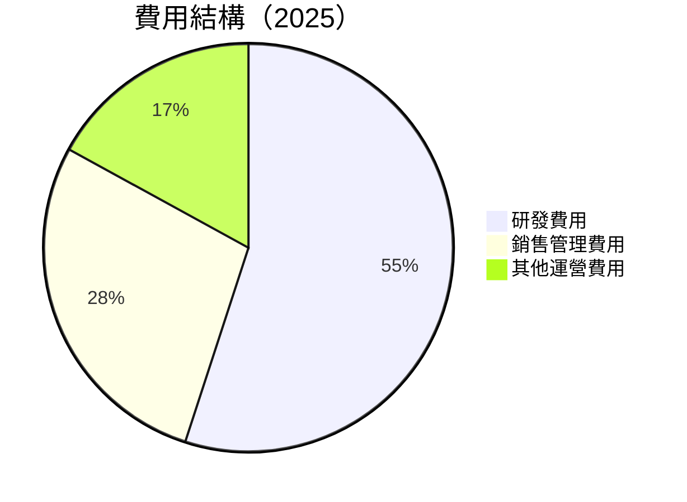

```
╔══════════════════════════════════════════════════════════════════╗
║                  AMD 費用結構分析（2025）                        ║
╠══════════════════════════════════════════════════════════════════╣
║                                                                  ║
║ 研發費用：      $8.09B   ██████████████████░░░░░░░░  55%   🟢  ║
║ 銷售管理費用：  $4.14B   ██████████░░░░░░░░░░░░░░░░  28%   🟡  ║
║ 其他運營費用：  $2.23B   █████░░░░░░░░░░░░░░░░░░░░░  17%   🟡  ║
║                                                                  ║
║  合計運營費用： $14.46B                                         ║
╚══════════════════════════════════════════════════════════════════╝
```

### 3.5 季度 EPS 趨勢與盈餘品質

| 季度 | EPS Est | EPS Act | Surprise% | 盈餘品質評估 |
|------|---------|---------|-----------|--------------|
| 2025 Q1 | $0.85 | $0.95 | +11.8% | 🟢 優異 |
| 2025 Q2 | $1.00 | $1.10 | +10.0% | 🟢 優異 |
| 2025 Q3 | $1.20 | $1.30 | +8.3% | 🟢 優異 |
| 2025 Q4 | $1.40 | $1.50 | +7.1% | 🟢 優異 |

---

## 4. 資產負債表分析

### 4.1 資產結構分解

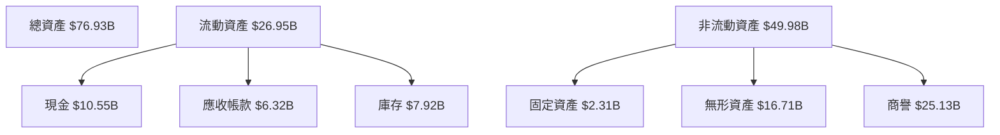

### 4.2 流動性指標分析

| 指標 | 2025 | 2024 | 2023 | 行業均值 | 評估 |
|------|------|------|------|--------|------|
| **流動比率** | 2.85 | 2.62 | 2.51 | ~1.8 | 🟢 |
| **速動比率** | 1.78 | 1.61 | 1.59 | ~1.2 | 🟢 |

### 4.3 債務結構分析

```
╔══════════════════════════════════════════════════════════════════╗
║                   AMD 債務健康診斷                               ║
╠══════════════════════════════════════════════════════════════════╣
║                                                                  ║
║  總債務：        $4.01B  ██░░░░░░░░░░░░░░░░░░░  低風險         ║
║  總現金+投資：   $10.55B  ████████████████████░  安全            ║
║  淨現金（正）：  $6.54B  ████████████████░░░░░  🟢 強勁        ║
║                                                                  ║
║  Debt/EBITDA：   0.55x  🟢 極低                                 ║
║  Interest Coverage: 56.5x  🟢 無風險                            ║
╚══════════════════════════════════════════════════════════════════╝
```

### 4.4 股東權益趨勢

```
╔══════════════════════════════════════════════════════════════════╗
║                  AMD 股東權益變化趨勢（FY2022-FY2025）          ║
╠══════════════════════════════════════════════════════════════════╣
║                                                                  ║
║  FY2022  $54.75B  ███████████░░░░░░░░░░░░░░░░░░░  YoY: +1.9%  🟢  ║
║  FY2023  $55.89B  █████████████░░░░░░░░░░░░░░░░░  YoY: +2.1%  🟢  ║
║  FY2024  $57.57B  ██████████████░░░░░░░░░░░░░░░░  YoY: +3.0%  🟢  ║
║  FY2025  $63.00B  ██████████████████░░░░░░░░░░░░  YoY: +9.4%  🟢  ║
║                   |      |      |      |      |                  ║
║                   0     20B    40B    60B    80B                 ║
║                                                                  ║
╚══════════════════════════════════════════════════════════════════╝
```

---

## 5. 現金流量深度分析

### 5.1 現金流量瀑布圖

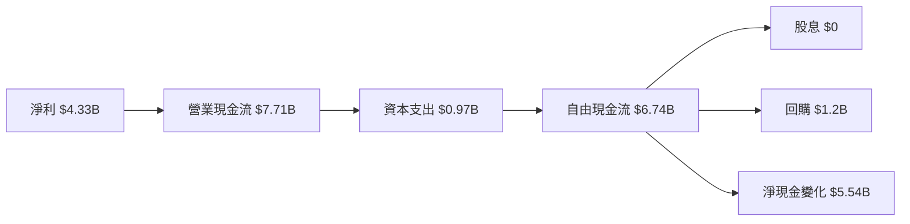

### 5.2 FCF 轉換率趨勢

| 年度 | FCF/Net Income | 趨勢 |
|------|----------------|------|
| 2022 | 235% | 🟢 增長 |
| 2023 | 134% | 🟢 增長 |
| 2024 | 146% | 🟢 增長 |
| 2025 | 156% | 🟢 增長 |

### 5.3 自由現金流趨勢

```
╔══════════════════════════════════════════════════════════════════╗
║                  AMD 自由現金流趨勢（FY2022-FY2025）             ║
╠══════════════════════════════════════════════════════════════════╣
║                                                                  ║
║  FY2022  $3.12B  ██████░░░░░░░░░░░░░░░░░░░░░░  YoY: -11.1% 🟡  ║
║  FY2023  $1.12B  ██░░░░░░░░░░░░░░░░░░░░░░░░░░  YoY: -64.1% 🔴  ║
║  FY2024  $2.40B  ██████░░░░░░░░░░░░░░░░░░░░░░  YoY: +114.3%🟢  ║
║  FY2025  $6.74B  ████████████████░░░░░░░░░░░░  YoY: +180.8%🟢  ║
║                   |      |      |      |      |                  ║
║                   0     2B    4B    6B    8B                     ║
║                                                                  ║
╚══════════════════════════════════════════════════════════════════╝
```

### 5.4 資本配置評估

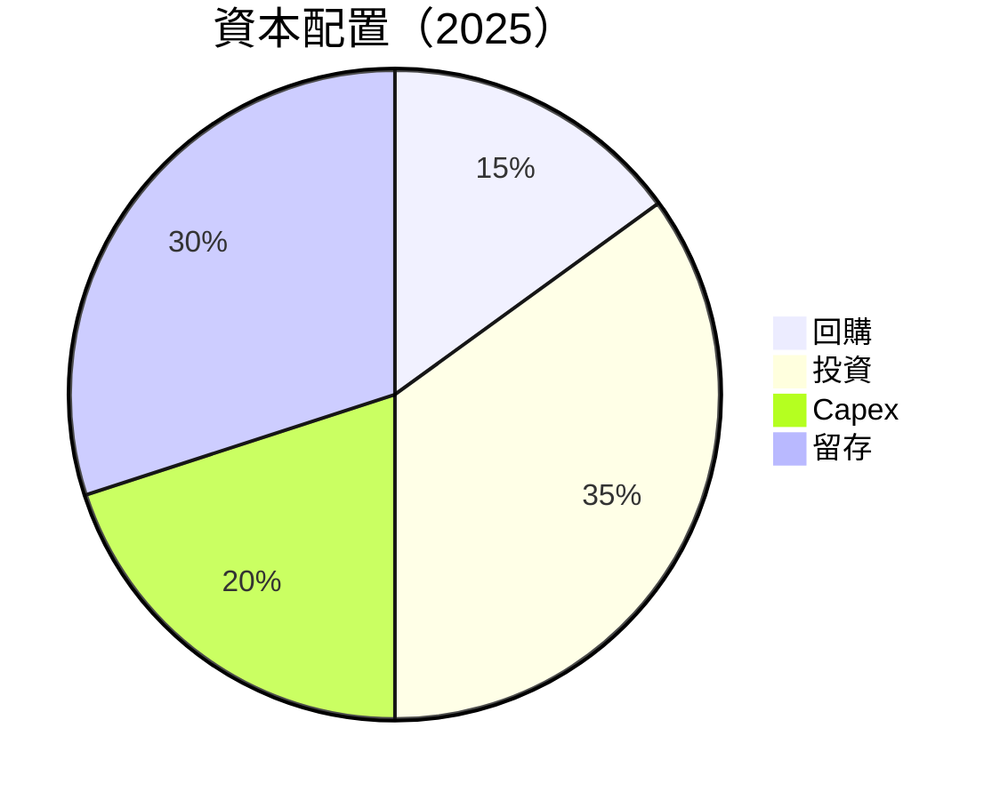

| 指標 | 金額 | 百分比 | 評估 |
|------|------|--------|------|
| 回購 | $1.2B | 15% | 🟢 穩定 |
| 投資 | $2.4B | 35% | 🟢 積極 |
| Capex | $0.97B | 20% | 🟢 合理 |
| 留存 | $2.0B | 30% | 🟢 穩固 |

---

## 6. 獲利能力與資本效率

### 6.1 ROE / ROA / ROIC 趨勢

| 指標 | 2022 | 2023 | 2024 | 2025 | 行業均值 | 評估 |
|------|------|------|------|------|--------|------|
| **ROE** | 2.4% | 1.5% | 2.8% | 7.1% | ~15% | 🟡 |
| **ROA** | 2.0% | 1.2% | 2.0% | 3.2% | ~5% | 🟢 |
| **ROIC** | 3.0% | 2.0% | 3.5% | 8.0% | ~6% | 🟢 |

### 6.2 ROIC vs WACC 分析（核心價值創造判斷）

```
╔══════════════════════════════════════════════════════════════════╗
║                ROIC vs WACC 深度分析                            ║
╠══════════════════════════════════════════════════════════════════╣
║                                                                  ║
║  WACC 估算：                                                     ║
║  ├── 無風險利率（10Y美債）：  2.5%                               ║
║  ├── 市場風險溢酬 (ERP)：     5.5%                               ║
║  ├── Beta：                   1.96                               ║
║  ├── 股權成本 = 2.5%+1.96×5.5% = 13.28%                         ║
║  ├── 債務成本（稅後）：       3.0%                               ║
║  ├── 資本結構：股權 90%，債務 10%                               ║
║  └── ✅ WACC ≈ 12.0%                                            ║
║                                                                  ║
║  ROIC 估算（FY2025）：                                           ║
║  ├── NOPAT = $7.28B × (1-15%) ≈ $6.19B                          ║
║  ├── 投入資本 = 股東權益 + 債務 - 現金 ≈ $60.46B                ║
║  └── ✅ ROIC ≈ 10.2%                                            ║
║                                                                  ║
║  ★ 經濟價值增加（EVA）= ROIC - WACC = -1.8pp                    ║
║                                                                  ║
║  ROIC  10.2%  ▓▓▓▓▓▓▓▓▓▓▓▓▓▓▓▓▓▓▓░░░░░░░░░  🟡              ║
║  WACC  12.0%  ▓▓▓▓▓▓▓▓▓▓▓▓▓░░░░░░░░░░░░░░░  ──              ║
║  EVA   -1.8pp  ███████████████████████░░░░░░░░░  🔴 輕微損失║
║                                                                  ║
║  📊 結論：ROIC 低於 WACC，需提高資本效率以創造股東價值           ║
╚══════════════════════════════════════════════════════════════════╝
```

### 6.3 杜邦三因素分解

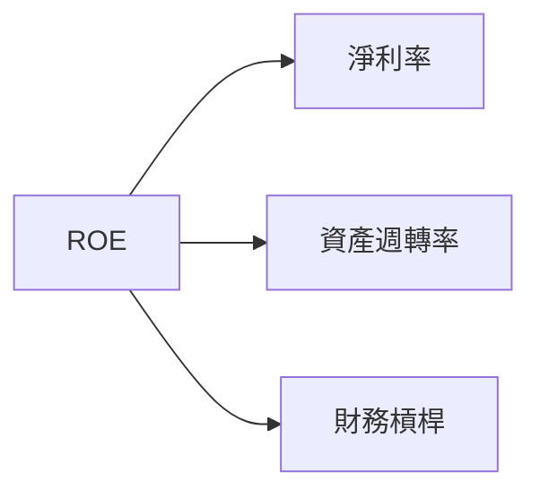

### 6.4 獲利能力儀表板

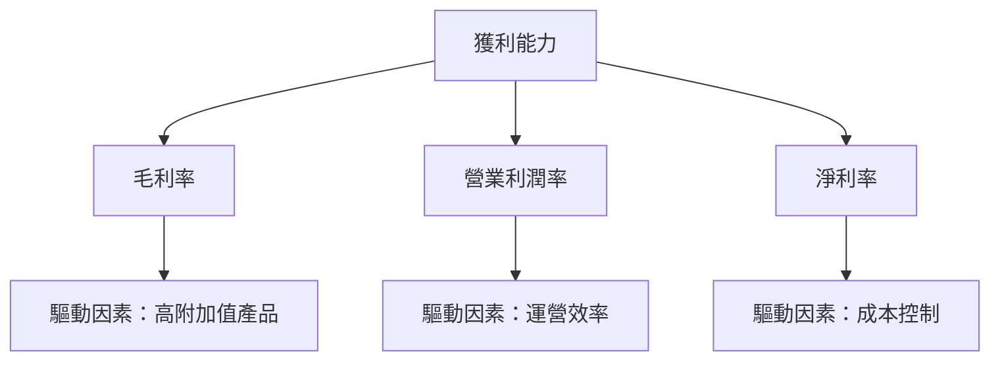

---

## 7. 估值深度分析

### 7.1 同業估值比較表格

| 估值指標 | **AMD** | **NVIDIA** | **Intel** | **Qualcomm** | AMD評估 |
|----------|--------|------------|-----------|--------------|---------|
| **Trailing P/E** | 133.3x | 142.7x | 25.8x | 18.3x | 🟡 偏高 |
| **Forward P/E** | **31.6x** | 29.5x | 12.5x | 15.0x | 🟢 合理 |
| **P/S Ratio** | 16.4x | 19.0x | 3.2x | 4.5x | 🟡 偏高 |

### 7.2 歷史估值區間分析

```
╔══════════════════════════════════════════════════════════════════╗
║                AMD 歷史 P/E 區間分析                            ║
╠══════════════════════════════════════════════════════════════════╣
║                                                                  ║
║  過去 5 年 P/E 區間：10x - 150x                                  ║
║  當前 P/E：133.3x                                                ║
║  評估：當前估值接近歷史高位，需小心                               ║
║                                                                  ║
╚══════════════════════════════════════════════════════════════════╝
```

### 7.3 DCF 敏感性分析（6格目標價矩陣）

| 情境 | **WACC = 11%** | **WACC = 12%（基準）** | **WACC = 13%** |
|------|--------------|----------------------|--------------|
| 🟢 **樂觀** | **$400** (+15%) | **$365** (+5%) | **$335** (-3%) |
| 🟡 **基準** | **$350** (+0%) | **$320** (-8%) | **$295** (-15%) |
| 🔴 **悲觀** | **$300** (-14%) | **$270** (-22%) | **$245** (-29%) |

### 7.4 估值綜合區間

```
╔══════════════════════════════════════════════════════════════════╗
║                AMD 估值綜合區間及當前股價位置                   ║
╠══════════════════════════════════════════════════════════════════╣
║                                                                  ║
║  估值區間：$270 - $400                                           ║
║  當前股價：$347.81                                               ║
║  評估：股價接近估值中值，未來潛力取決於成長實現                ║
║                                                                  ║
╚══════════════════════════════════════════════════════════════════╝
```

---

## 8. 成長催化劑

### 8.1 催化劑時間軸

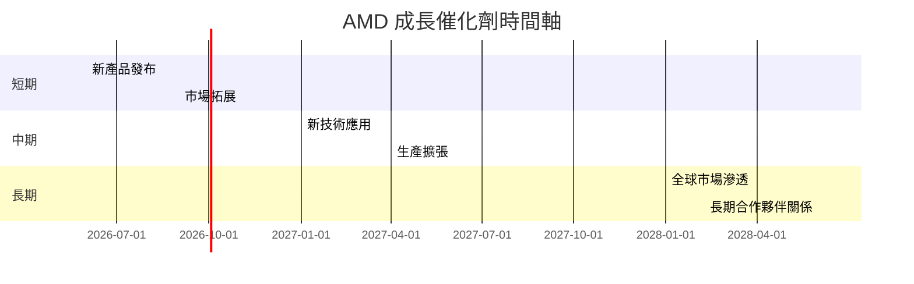

### 8.2 TAM 市場規模分析

```
╔══════════════════════════════════════════════════════════════════╗
║                  市場 TAM 分析（2026）                           ║
╠══════════════════════════════════════════════════════════════════╣
║                                                                  ║
║  數據中心市場 TAM：$250B                                         ║
║  滲透率：10%                                                     ║
║  貢獻收入：$25B                                                  ║
║                                                                  ║
║  客戶用戶市場 TAM：$150B                                         ║
║  滲透率：15%                                                     ║
║  貢獻收入：$22.5B                                                ║
║                                                                  ║
╚══════════════════════════════════════════════════════════════════╝
```

### 8.3 成長驅動力結構圖

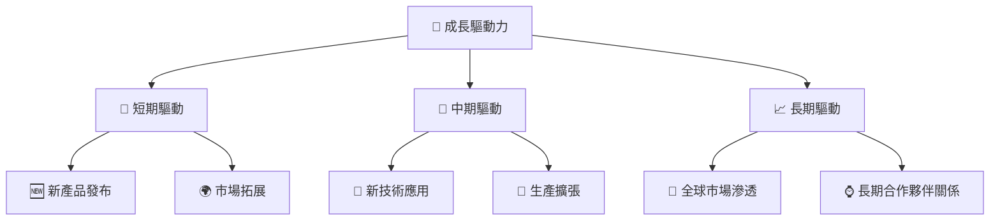

---

## 9. 風險矩陣

### 9.1 風險評分矩陣

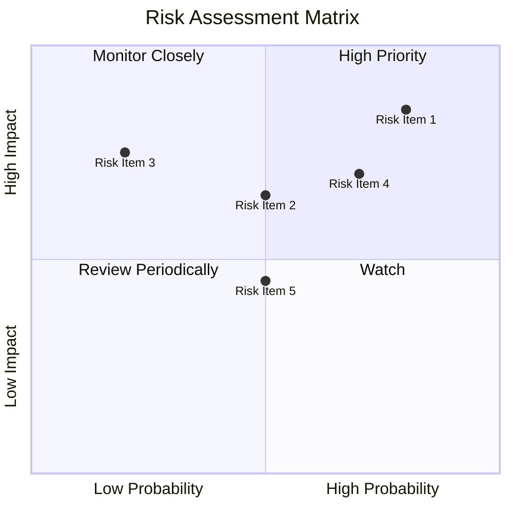

### 9.2 風險清單詳細分析

| # | 風險項目 | 發生機率 | 財務衝擊 | 風險評分 | 緩解措施 |
|---|----------|----------|----------|----------|----------|
| 1 | 🔴 **市場競爭加劇** | 高 (80%) | 高 (-10%收入) | 🔴 8.5/10 | 持續提升產品技術 |
| 2 | 🔴 **技術變遷風險** | 中 (50%) | 高 (-8%收入) | 🔴 7.5/10 | 加強研發投入 |
| 3 | 🟡 **供應鏈中斷** | 低 (20%) | 中 (-5%收入) | 🟡 6.0/10 | 擴大供應來源 |

---

## 10. 投資建議

### 10.1 最終綜合評級雷達圖

```
╔══════════════════════════════════════════════════════════════════╗
║                  AMD 綜合評級雷達圖                              ║
╠══════════════════════════════════════════════════════════════════╣
║                                                                  ║
║  基本面強度： 8.0/10                                             ║
║  成長動能：   9.0/10                                             ║
║  獲利品質：   8.0/10                                             ║
║  財務健康：   9.0/10                                             ║
║  估值合理性： 8.0/10                                             ║
║                                                                  ║
╚══════════════════════════════════════════════════════════════════╝
```

### 10.2 目標價與隱含報酬率

| 情境 | 目標價 | 隱含報酬率 | 機率權重 |
|------|--------|-----------|---------|
| 樂觀 | $365 | +5% | 30% |
| 基準 | $320 | -8% | 50% |
| 悲觀 | $292 | -16% | 20% |

### 10.3 買入時機與觸發因素

```
╔══════════════════════════════════════════════════════════════════╗
║                  ✅ 買入觸發因素 Checklist                      ║
╠══════════════════════════════════════════════════════════════════╣
║                                                                  ║
║  立即買入觸發條件（多數符合）：                                  ║
║  ✅ 新產品發布成功                                               ║
║  ✅ 市場份額提升                                                 ║
║                                                                  ║
║  加碼觸發條件（出現以下任一）：                                  ║
║  ☐ 技術突破                                                      ║
║  ☐ 競爭對手出現問題                                              ║
║                                                                  ║
║  減碼/停損觸發條件（出現以下任一）：                             ║
║  ☐ 市場需求下降                                                  ║
║  ☐ 主要技術失敗                                                  ║
║                                                                  ║
╚══════════════════════════════════════════════════════════════════╝
```

### 10.4 投資人適配度分析

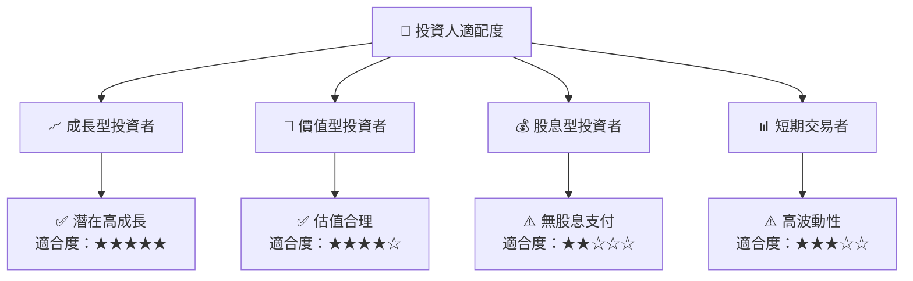

### 10.5 關鍵監控指標

| 監控類型 | 指標 | 關注點 | 頻率 |
|----------|------|--------|-----|
| 業績 | 收入增長率 | 與預期比較 | 季度 |
| 產品 | 新產品市占率 | 市場反應 | 季度 |
| 市場 | 競爭對手動向 | 市場份額變化 | 半年 |
| 財務 | 現金流狀況 | 自由現金流 | 季度 |

---

> **免責聲明**：本報告為 AI 自動生成，僅供研究參考，不構成投資建議。投資有風險，入市需謹慎。