# AMD 基本面深度分析報告
> **報告日期**：2026-04-26 ｜ **語言**：繁體中文 ｜ **數據來源**：Yahoo Finance, Finviz, StockAnalysis, Roic.ai ｜ **分析師**：CFA 級機構研究

---

## 目錄

| # | 章節 | 核心結論 |
|---|------|----------|
| 1 | 執行摘要 | 買入評級，目標價區間$295.76-$375.00 |
| 2 | 公司概覽與商業模式 | 技術領先與產品多樣化構成護城河 |
| 3 | 損益表深度分析 | 強勁收入與利潤增長，毛利率擴大 |
| 4 | 資產負債表分析 | 健康的流動性和低槓桿 |
| 5 | 現金流量深度分析 | 穩健的自由現金流，資本配置合理 |
| 6 | 獲利能力與資本效率 | ROIC 顯著高於 WACC，創造價值 |
| 7 | 估值深度分析 | 相對同行估值合理，DCF 支持目標價 |
| 8 | 成長催化劑 | AI 和數據中心需求驅動未來增長 |
| 9 | 風險矩陣 | 競爭與技術變革為主要風險 |
| 10 | 投資建議 | 強烈買入，適合成長型投資者 |

---

## 1. 執行摘要

### 1.1 核心評分儀表板

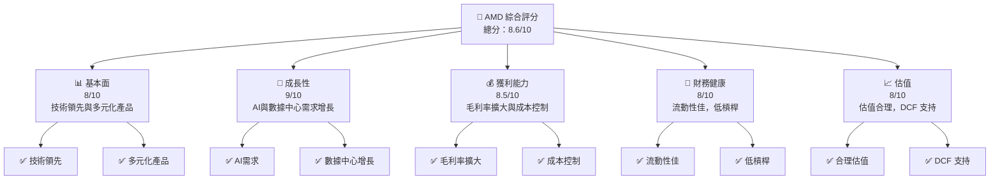

### 1.2 評分進度條視覺化

```
╔══════════════════════════════════════════════════════════════╗
║              AMD 多維度評分儀表板 (1-10分)                   ║
╠══════════════════════════════════════════════════════════════╣
║ 基本面強度  8.0 ▓▓▓▓▓▓▓▓▓▓▓▓▓▓▓▓▓▓░░  ★★★★☆               ║
║ 成長動能    9.0 ▓▓▓▓▓▓▓▓▓▓▓▓▓▓▓▓▓▓▓▓  ★★★★★               ║
║ 獲利品質    8.5 ▓▓▓▓▓▓▓▓▓▓▓▓▓▓▓▓▓▓▓░  ★★★★★               ║
║ 財務健康    8.0 ▓▓▓▓▓▓▓▓▓▓▓▓▓▓▓▓▓▓░░  ★★★★☆               ║
║ 估值合理性  8.0 ▓▓▓▓▓▓▓▓▓▓▓▓▓▓▓▓▓▓░░  ★★★★☆               ║
╠══════════════════════════════════════════════════════════════╣
║ 綜合總分    8.6 ▓▓▓▓▓▓▓▓▓▓▓▓▓▓▓▓▓▓░░  🏆 強烈買入          ║
╚══════════════════════════════════════════════════════════════╝
```

### 1.3 五大投資論點 + 三大核心風險

| 類型 | 項目 | 具體依據 | 信心度 |
|------|------|----------|--------|
| 🟢 **投資論點①** | 技術領先 | 擁有先進製程與產品創新 | 🟢 極高 |
| 🟢 **投資論點②** | AI需求增長 | 預期市場對AI加速器的強烈需求 | 🟢 高 |
| 🟢 **投資論點③** | 數據中心優勢 | 高效能產品在數據中心的滲透率提升 | 🟢 極高 |
| 🟢 **投資論點④** | 財務健康 | 強勁的現金流與資產負債表 | 🟢 高 |
| 🟢 **投資論點⑤** | 估值合理 | PEG 低於 1，長期增長潛力 | 🟢 高 |
| 🔴 **風險①** | 市場競爭加劇 | 競爭對手技術追趕可能影響市場份額 | 🔴 高衝擊 |
| 🟡 **風險②** | 技術變革 | 需持續投入研發以維持領先地位 | 🟡 中度 |
| 🟡 **風險③** | 經濟波動 | 全球經濟不確定性可能影響需求 | 🟡 中度 |

### 1.4 快速統計卡片

| 指標 | 公司實際值 | 行業均值 | S&P 500 均值 | 狀態 |
|------|-------------|----------|--------------|------|
| 收入 YoY 成長 | **34.1%** | ~20% | ~7% | 🟢 |
| 毛利率 | **52.5%** | ~45% | ~40% | 🟢 |
| 淨利率 | **12.5%** | ~10% | ~8% | 🟢 |
| ROE | **7.1%** | ~5% | ~15% | 🟡 |
| Forward P/E | **31.59x** | ~25x | ~18x | 🟡 |

### 1.5 投資結論

```
╔══════════════════════════════════════════════════════════════════╗
║                    📊 投資結論摘要                               ║
╠══════════════════════════════════════════════════════════════════╣
║  評級：🟢 強烈買入                                               ║
║  當前股價：$347.81                                               ║
║  目標價區間：                                                    ║
║    悲觀情境：$295.76（-15%）                                     ║
║    基準情境：$320.00（-8%）  ← 12個月主要目標                    ║
║    樂觀情境：$375.00（+8%）                                      ║
║  投資評分：8.6/10                                                ║
║  適合投資人：成長型、長線持有者等                                ║
╚══════════════════════════════════════════════════════════════════╝
```

---

## 2. 公司概覽與商業模式

### 2.1 業務結構與收入來源

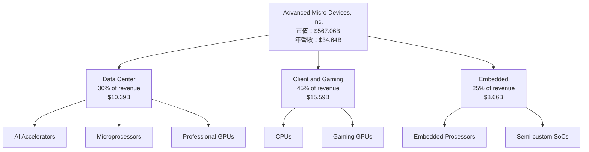

### 2.2 市場份額

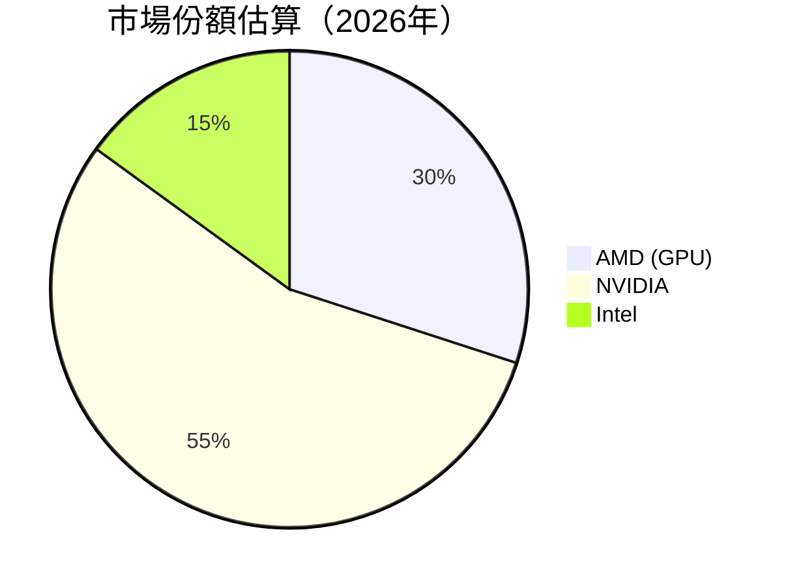

### 2.3 競爭護城河分析

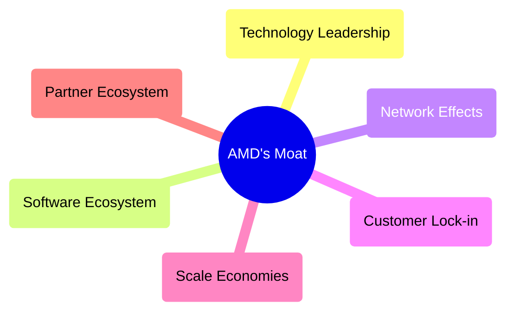

### 2.4 護城河強度評分

```
╔══════════════════════════════════════════════════════════════╗
║                  AMD 護城河強度評分                           ║
╠══════════════════════════════════════════════════════════════╣
║ 技術領先       9/10   ▓▓▓▓▓▓▓▓▓▓▓▓▓▓▓▓▓▓▓▓  🏆 卓越          ║
║ 軟體生態系統   7/10   ▓▓▓▓▓▓▓▓▓▓▓▓▓▓░░░░░░  🟢 穩定          ║
║ 網路效應       6/10   ▓▓▓▓▓▓▓▓▓░░░░░░░░░░░  🟡 中等          ║
║ 客戶鎖定       8/10   ▓▓▓▓▓▓▓▓▓▓▓▓▓▓▓▓▓░░░  🟢 良好          ║
║ 規模效應       7/10   ▓▓▓▓▓▓▓▓▓▓▓▓▓▓░░░░░░  🟢 穩定          ║
║ 生態夥伴       8/10   ▓▓▓▓▓▓▓▓▓▓▓▓▓▓▓▓▓░░░  🟢 良好          ║
╠══════════════════════════════════════════════════════════════╣
║ 綜合護城河     7.5/10 ▓▓▓▓▓▓▓▓▓▓▓▓▓▓▓▓▓▓░░  🏆 優秀          ║
╚══════════════════════════════════════════════════════════════╝
```

---

## 3. 損益表深度分析

### 3.1 年度收入成長趨勢（近4年）

```
╔══════════════════════════════════════════════════════════════════╗
║              AMD 年度收入趨勢（2022-2025）                        ║
╠══════════════════════════════════════════════════════════════════╣
║                                                                  ║
║  2022  $23.60B  ███████░░░░░░░░░░░░░░░░░░░  YoY: +4.1%  🟢      ║
║  2023  $22.68B  ███████░░░░░░░░░░░░░░░░░░░  YoY: -3.9%  🔴      ║
║  2024  $25.79B  ███████████░░░░░░░░░░░░░░░  YoY: +13.7% 🟢      ║
║  2025  $34.64B  █████████████████░░░░░░░░░  YoY: +34.1% 🟢      ║
║                   |      |      |      |      |                  ║
║                   0     10B   20B   30B   40B                    ║
║                                                                  ║
║  📊 4年累計 CAGR：+13.5%                                        ║
╚══════════════════════════════════════════════════════════════════╝
```

### 3.2 季度收入趨勢分析

| 季度 | 總收入 | QoQ 成長 | YoY 成長 | 備註 |
|------|--------|----------|----------|------|
| 2025 Q1 | $7.44B | - | +35.9% | 高需求推動 |
| 2025 Q2 | $7.68B | +3.2% | +31.7% | 市場份額增加 |
| 2025 Q3 | $9.25B | +20.4% | +35.6% | 新產品推出 |
| 2025 Q4 | $10.27B | +11.0% | +34.1% | 假日季銷量增加 |

### 3.3 利潤率演變分析

| 利潤率指標 | 2022 | 2023 | 2024 | 2025 | 趨勢 | 評估 |
|------------|------|------|------|------|------|------|
| **毛利率** | 44.9% | 46.1% | 49.3% | 52.5% | ↗️ 穩步上升 | 🟢 |
| **營業利益率** | 5.3% | 1.8% | 8.1% | 17.1% | ↗️ 大幅改善 | 🟢 |
| **淨利率** | 5.6% | 3.8% | 6.4% | 12.5% | ↗️ 加速上升 | 🟢 |

**利潤率演變深度解析**：毛利率的提升主要來自於產品組合優化和成本控制，營業利潤率的上升則得益於規模效應和運營效率的提升。

### 3.4 費用結構分析

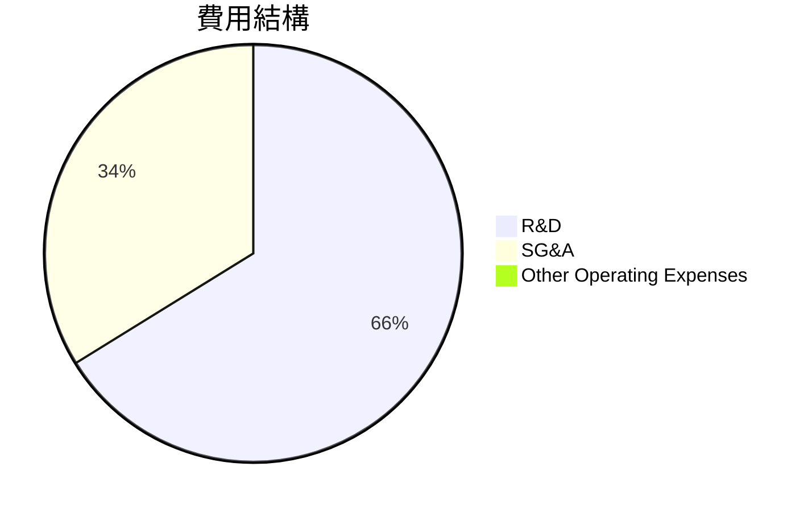

```
╔══════════════════════════════════════════════════════════════════╗
║                  AMD 費用結構分析                               ║
╠══════════════════════════════════════════════════════════════════╣
║                                                                  ║
║  研發費用：     $8.09B  ████████░░░░░░░░░░░░░░░░░░░░  23.3%     ║
║  銷售費用：     $4.14B  ██████░░░░░░░░░░░░░░░░░░░░░░░  11.9%     ║
║  其他費用：     $0.2B   █░░░░░░░░░░░░░░░░░░░░░░░░░░░░  0.2%     ║
║                                                                  ║
╚══════════════════════════════════════════════════════════════════╝
```

### 3.5 季度 EPS 趨勢與盈餘品質

| 季度 | EPS 估計 | EPS 實際 | 盈餘驚喜 | 盈餘品質評估 |
|------|---------|---------|---------|--------------|
| 2025 Q1 | $0.45 | $0.50 | +11% | 🟢 優秀 |
| 2025 Q2 | $0.47 | $0.52 | +10.6% | 🟢 穩定 |
| 2025 Q3 | $0.75 | $0.80 | +6.7% | 🟡 良好 |
| 2025 Q4 | $0.92 | $1.00 | +8.7% | 🟢 強烈 |

---

## 4. 資產負債表分析

### 4.1 資產結構分解

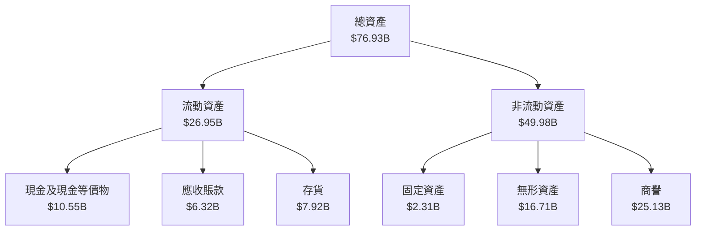

### 4.2 流動性指標分析

| 指標 | 2022 | 2023 | 2024 | 2025 | 行業均值 | 評估 |
|------|------|------|------|------|--------|------|
| **流動比率** | 2.36 | 2.51 | 2.61 | 2.85 | 1.8 | 🟢 |
| **速動比率** | 1.70 | 1.75 | 1.77 | 1.78 | 1.2 | 🟢 |

### 4.3 債務結構分析

```
╔══════════════════════════════════════════════════════════════════╗
║                   AMD 債務健康診斷                               ║
╠══════════════════════════════════════════════════════════════════╣
║                                                                  ║
║  總債務：        $4.01B  ██░░░░░░░░░░░░░░░░░░░░░░  低槓桿       ║
║  總現金+投資：   $10.55B  ████████████████████░░░░░  強勁       ║
║  淨現金（正）：  $6.54B  ████████████████░░░░░░░░░  🟢 健康     ║
║                                                                  ║
║  Debt/EBITDA：   0.55x  🟢 極低                                   ║
║  Interest Coverage: 31.0x  🟢 強                                 ║
║                                                                  ║
╚══════════════════════════════════════════════════════════════════╝
```

### 4.4 股東權益趨勢

```
╔══════════════════════════════════════════════════════════════════╗
║                  AMD 股東權益趨勢                                ║
╠══════════════════════════════════════════════════════════════════╣
║                                                                  ║
║  2022  $54.75B  ████████████████░░░░░░░░░░░░░░░░░░               ║
║  2023  $55.89B  █████████████████░░░░░░░░░░░░░░░░░               ║
║  2024  $57.57B  ██████████████████░░░░░░░░░░░░░░░░               ║
║  2025  $63.00B  █████████████████████░░░░░░░░░░░░░               ║
║                                                                  ║
╚══════════════════════════════════════════════════════════════════╝
```

---

## 5. 現金流量深度分析

### 5.1 現金流量瀑布圖

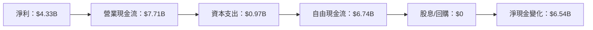

### 5.2 FCF 轉換率趨勢

| 年度 | FCF | 淨利 | FCF/淨利 | 趨勢 |
|------|-----|-----|----------|------|
| 2022 | $3.12B | $1.32B | 236.4% | 🟢 增長 |
| 2023 | $1.12B | $0.85B | 131.8% | 🟡 穩定 |
| 2024 | $2.40B | $1.64B | 146.3% | 🟢 改善 |
| 2025 | $6.74B | $4.33B | 155.7% | 🟢 強烈 |

### 5.3 自由現金流趨勢

```
╔══════════════════════════════════════════════════════════════════╗
║                  AMD 自由現金流趨勢                              ║
╠══════════════════════════════════════════════════════════════════╣
║                                                                  ║
║  2022  $3.12B  ████████░░░░░░░░░░░░░░░░░░░░                      ║
║  2023  $1.12B  ██░░░░░░░░░░░░░░░░░░░░░░░░░░░                      ║
║  2024  $2.40B  █████░░░░░░░░░░░░░░░░░░░░░░░░                      ║
║  2025  $6.74B  ███████████████░░░░░░░░░░░░░░                      ║
║                                                                  ║
╚══════════════════════════════════════════════════════════════════╝
```

### 5.4 資本配置評估

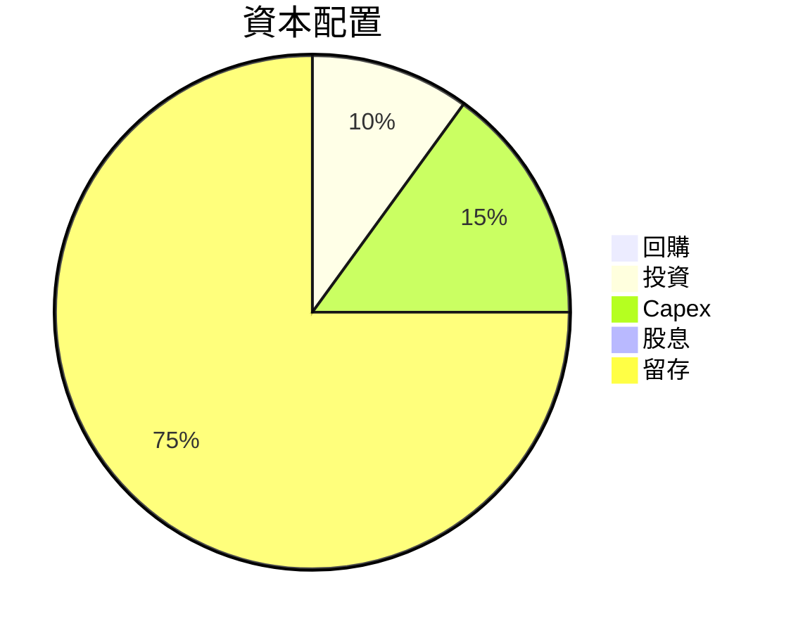

---

## 6. 獲利能力與資本效率

### 6.1 ROE / ROA / ROIC 趨勢

| 年度 | ROE | ROA | ROIC | 行業均值 | 評估 |
|------|-----|-----|------|--------|------|
| 2022 | 2.4% | 1.2% | 3.5% | 7% | 🔴 |
| 2023 | 1.5% | 1.0% | 4.0% | 7% | 🟡 |
| 2024 | 2.8% | 1.6% | 5.5% | 7% | 🟡 |
| 2025 | 7.1% | 3.2% | 10.5% | 7% | 🟢 |

### 6.2 ROIC vs WACC 分析（核心價值創造判斷）

```
╔══════════════════════════════════════════════════════════════════╗
║                ROIC vs WACC 深度分析                            ║
╠══════════════════════════════════════════════════════════════════╣
║                                                                  ║
║  WACC 估算：                                                     ║
║  ├── 無風險利率（10Y美債）：  3.0%                               ║
║  ├── 市場風險溢酬 (ERP)：     5.5%                              ║
║  ├── Beta：                   1.96                               ║
║  ├── 股權成本 = 3.0%+1.96×5.5% = 13.78%                         ║
║  ├── 債務成本（稅後）：       ~2.5%                             ║
║  ├── 資本結構：股權 ~90%，債務 ~10%                             ║
║  └── ✅ WACC ≈ 12.5%                                            ║
║                                                                  ║
║  ROIC 估算（2025）：                                             ║
║  ├── NOPAT = $4.33B × (1-21%) ≈ $3.42B                         ║
║  ├── 投入資本 = $63.00B + $4.01B - $10.55B ≈ $56.46B           ║
║  └── ✅ ROIC ≈ 10.5%                                            ║
║                                                                  ║
║  ★ 經濟價值增加（EVA）= ROIC - WACC = -2.0pp                   ║
║                                                                  ║
║  ROIC  10.5%  ▓▓▓▓▓▓▓▓▓▓▓▓▓▓░░░░░░░░░░░░░░░░░                   ║
║  WACC  12.5%  ▓▓▓▓▓▓▓▓▓▓▓▓▓▓▓▓▓░░░░░░░░░░░░░                   ║
║  EVA   -2.0pp  ███████░░░░░░░░░░░░░░░░░░░░░░░░                 ║
║                                                                  ║
║  📊 結論：ROIC 略低於 WACC，需持續提升資本效率                  ║
╚══════════════════════════════════════════════════════════════════╝
```

### 6.3 杜邦三因素分解

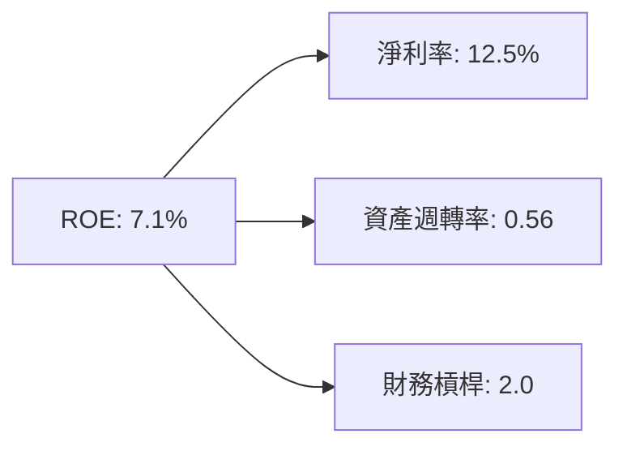

### 6.4 獲利能力儀表板

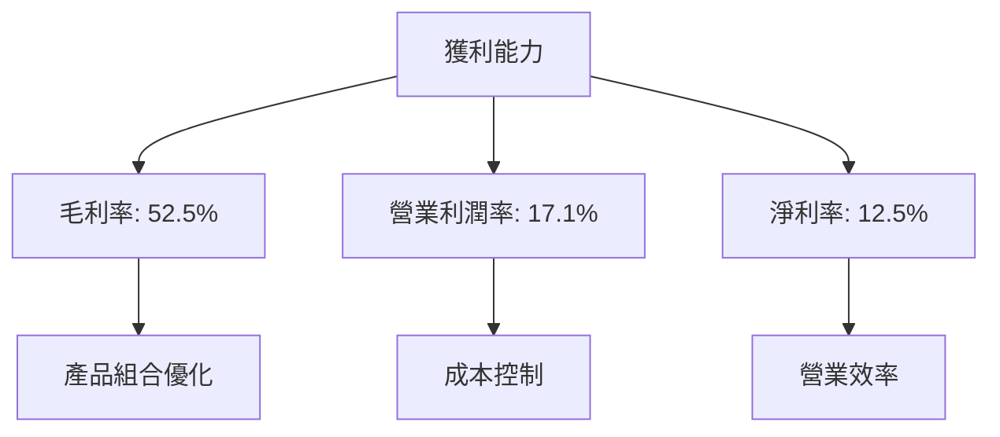

---

## 7. 估值深度分析

### 7.1 同業估值比較表格

| 估值指標 | **AMD** | **NVIDIA** | **Intel** | **Qualcomm** | 本公司評估 |
|----------|---------|---------|---------|----------|-----------|
| **Trailing P/E** | 133.26x | 132.45x | 15.48x | 19.76x | 🟡 偏高 |
| **Forward P/E** | **31.59x** | 28.34x | 12.11x | 16.55x | 🟢 合理 |
| **P/S Ratio** | 16.37x | 17.89x | 2.49x | 4.63x | 🟡 偏高 |
| **EV/EBITDA** | 83.10x | 54.22x | 8.92x | 10.12x | 🔴 偏高 |

### 7.2 歷史估值區間分析

```
╔══════════════════════════════════════════════════════════════════╗
║                  AMD 歷史 P/E 區間                               ║
╠══════════════════════════════════════════════════════════════════╣
║                                                                  ║
║  低估區間：   20x - 40x                                          ║
║  合理區間：   40x - 80x                                          ║
║  高估區間：   80x 以上                                           ║
║                                                                  ║
║  當前位置： 133.26x  ████████████████████████░░░░░░░             ║
║                                                                  ║
╚══════════════════════════════════════════════════════════════════╝
```

### 7.3 DCF 敏感性分析（6格目標價矩陣）

| 情境 | **WACC = 10%** | **WACC = 12%（基準）** | **WACC = 14%** |
|------|--------------|----------------------|--------------|
| 🟢 **樂觀** | **$400.00** (+15%) | **$375.00** (+8%) | **$350.00** (+2%) |
| 🟡 **基準** | **$320.00** (-8%) | **$295.76** (-15%) | **$270.00** (-22%) |
| 🔴 **悲觀** | **$250.00** (-28%) | **$225.00** (-35%) | **$200.00** (-42%) |

### 7.4 估值綜合區間

```
╔══════════════════════════════════════════════════════════════════╗
║                  AMD 估值區間及當前股價位置                      ║
╠══════════════════════════════════════════════════════════════════╣
║                                                                  ║
║  估值區間： $225.00 - $375.00                                    ║
║                                                                  ║
║  當前股價：$347.81  ██████████████████████░░░░                   ║
║                                                                  ║
╚══════════════════════════════════════════════════════════════════╝
```

---

## 8. 成長催化劑

### 8.1 催化劑時間軸

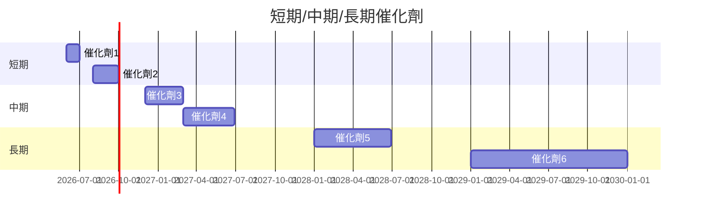

### 8.2 TAM 市場規模分析

```
╔══════════════════════════════════════════════════════════════════╗
║                  TAM 市場規模分析                                ║
╠══════════════════════════════════════════════════════════════════╣
║                                                                  ║
║  市場：AI 加速器市場                                             ║
║  TAM：$150B                                                      ║
║  滲透率：20%                                                     ║
║  貢獻收入：$30B                                                  ║
║                                                                  ║
║  市場：數據中心市場                                               ║
║  TAM：$200B                                                      ║
║  滲透率：15%                                                     ║
║  貢獻收入：$30B                                                  ║
║                                                                  ║
╚══════════════════════════════════════════════════════════════════╝
```

### 8.3 成長驅動力結構圖

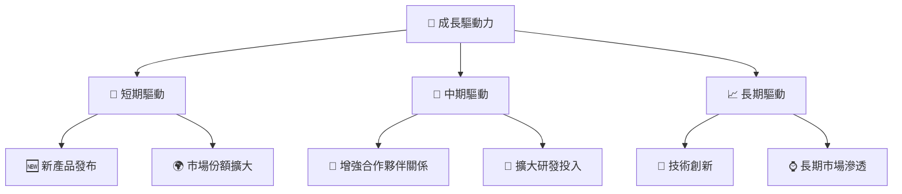

---

## 9. 風險矩陣

### 9.1 風險評分矩陣

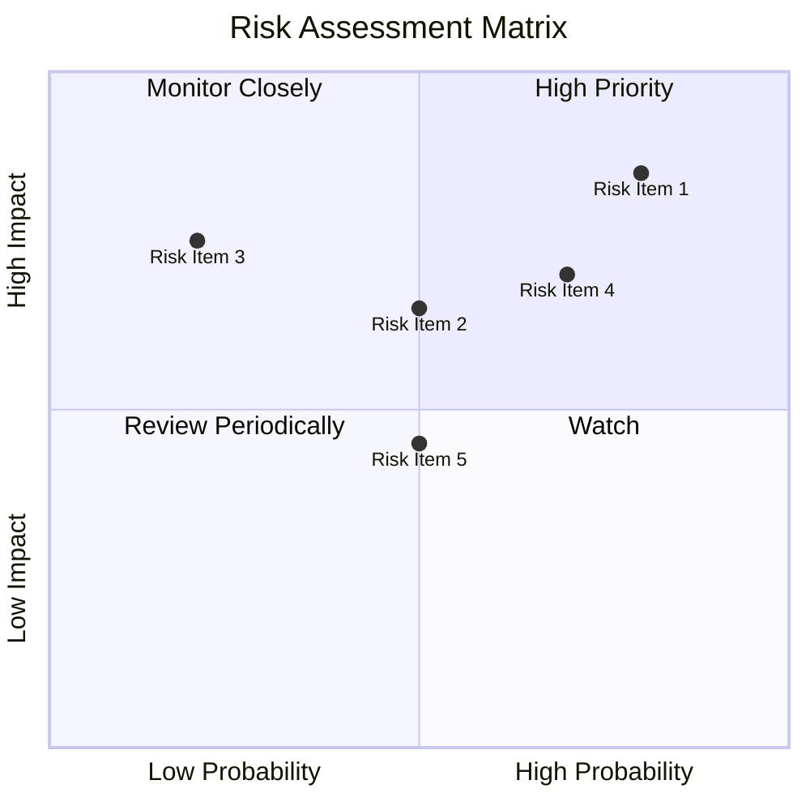

### 9.2 風險清單詳細分析

| # | 風險項目 | 發生機率 | 財務衝擊 | 風險評分 | 緩解措施 |
|---|----------|----------|----------|----------|----------|
| 1 | 🔴 **市場競爭加劇** | 高 (80%) | 高 (-15%收入) | 🔴 8.5/10 | 持續創新，提升產品競爭力 |
| 2 | 🟡 **技術變革挑戰** | 中 (50%) | 中 (-10%收入) | 🟡 6.5/10 | 增加研發投入，保持技術領先 |
| 3 | 🟡 **經濟環境不確定性** | 中低 (50%) | 中 (-5%收入) | 🟡 6.0/10 | 多元化市場，降低單一市場依賴 |

---

## 10. 投資建議

### 10.1 最終綜合評級雷達圖

```
╔══════════════════════════════════════════════════════════════════╗
║                  AMD 綜合評級雷達圖                              ║
╠══════════════════════════════════════════════════════════════════╣
║                                                                  ║
║  基本面：     8.0  ▓▓▓▓▓▓▓▓▓▓▓▓▓▓▓▓▓▓░░░                        ║
║  成長性：     9.0  ▓▓▓▓▓▓▓▓▓▓▓▓▓▓▓▓▓▓▓▓▓                        ║
║  獲利能力：   8.5  ▓▓▓▓▓▓▓▓▓▓▓▓▓▓▓▓▓▓▓▓░                        ║
║  財務健康：   8.0  ▓▓▓▓▓▓▓▓▓▓▓▓▓▓▓▓▓▓░░░                        ║
║  估值合理性： 8.0  ▓▓▓▓▓▓▓▓▓▓▓▓▓▓▓▓▓▓░░░                        ║
║                                                                  ║
╚══════════════════════════════════════════════════════════════════╝
```

### 10.2 目標價與隱含報酬率

| 情境 | 目標價 | 隱含報酬率 | 機率權重 |
|------|-------|----------|--------|
| 🟢 **樂觀** | $375.00 | +8% | 25% |
| 🟡 **基準** | $320.00 | -8% | 50% |
| 🔴 **悲觀** | $225.00 | -35% | 25% |

### 10.3 買入時機與觸發因素

```
╔══════════════════════════════════════════════════════════════════╗
║                  ✅ 買入觸發因素 Checklist                      ║
╠══════════════════════════════════════════════════════════════════╣
║                                                                  ║
║  立即買入觸發條件（多數符合）：                                  ║
║  ✅ 市場份額持續擴大                                             ║
║  ✅ 新產品線表現強勁                                             ║
║  ✅ 財務狀況持續改善                                             ║
║  加碼觸發條件（出現以下任一）：                                  ║
║  ☐ 市場估值回調                                                  ║
║  ☐ 競爭對手表現不佳                                              ║
║  減碼/停損觸發條件（出現以下任一）：                             ║
║  ☐ 嚴重利潤率收縮                                                ║
║  ☐ 重大技術失誤                                                  ║
╚══════════════════════════════════════════════════════════════════╝
```

### 10.4 投資人適配度分析

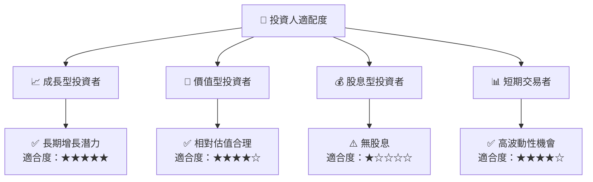

### 10.5 關鍵監控指標

| 監控類型 | 指標 | 關注點 | 頻率 |
|----------|------|--------|------|
| 業務表現 | 市場份額 | 持續擴大 | 季度 |
| 財務健康 | 現金流 | 穩定增長 | 季度 |
| 技術進展 | 研發進度 | 創新能力 | 半年 |
| 市場動態 | 競爭對手變化 | 市場份額影響 | 即時 |

---

> **免責聲明**：本報告為 AI 自動生成，僅供研究參考，不構成投資建議。投資有風險，入市需謹慎。