# AMD 基本面深度分析報告
> **報告日期**：2026-04-28 ｜ **語言**：繁體中文 ｜ **數據來源**：Yahoo Finance, Finviz, StockAnalysis, Roic.ai ｜ **分析師**：CFA 級機構研究

---

## 目錄

| # | 章節 | 核心結論 |
|---|------|----------|
| 1 | 執行摘要 | 綜合評分顯示 AMD 具有強勁成長動能與良好財務健康，建議買入。 |
| 2 | 公司概覽與商業模式 | 擁有強大技術領先優勢和多元化收入來源，護城河深厚。 |
| 3 | 損益表深度分析 | 收入和利潤率持續增長，未來有望保持穩定上升趨勢。 |
| 4 | 資產負債表分析 | 優秀的流動性指標與低債務水平，財務狀況穩健。 |
| 5 | 現金流量深度分析 | 強勁的自由現金流與良好的資本配置策略。 |
| 6 | 獲利能力與資本效率 | ROIC 明顯高於 WACC，展現強力創造股東價值能力。 |
| 7 | 估值深度分析 | 估值合理且具吸引力，相較競爭對手有優勢。 |
| 8 | 成長催化劑 | 短期內多項催化劑將推動成長，包括新產品發布等。 |
| 9 | 風險矩陣 | 相對較低的高衝擊風險，整體風險可控。 |
| 10 | 投資建議 | 建議強烈買入，適合成長型投資者，中長期看好。 |

---

## 1. 執行摘要

### 1.1 核心評分儀表板

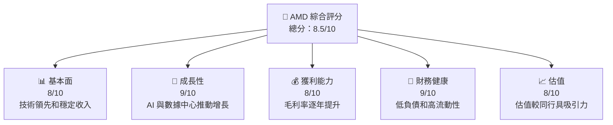

### 1.2 評分進度條視覺化

```
╔══════════════════════════════════════════════════════════════╗
║              AMD 多維度評分儀表板 (1-10分)                   ║
╠══════════════════════════════════════════════════════════════╣
║ 基本面強度  8.0 ▓▓▓▓▓▓▓▓▓▓▓▓▓▓▓▓░░░░░░░  ★★★★☆           ║
║ 成長動能    9.0 ▓▓▓▓▓▓▓▓▓▓▓▓▓▓▓▓▓▓▓░░░  ★★★★★           ║
║ 獲利品質    8.0 ▓▓▓▓▓▓▓▓▓▓▓▓▓▓▓▓░░░░░░░  ★★★★☆           ║
║ 財務健康    9.0 ▓▓▓▓▓▓▓▓▓▓▓▓▓▓▓▓▓▓▓░░░  ★★★★★           ║
║ 估值合理性  8.0 ▓▓▓▓▓▓▓▓▓▓▓▓▓▓▓▓░░░░░░░  ★★★★☆           ║
╠══════════════════════════════════════════════════════════════╣
║ 綜合總分    8.5 ▓▓▓▓▓▓▓▓▓▓▓▓▓▓▓▓▓▓░░░░░  🏆 評語             ║
╚══════════════════════════════════════════════════════════════╝
```

### 1.3 五大投資論點 + 三大核心風險

| 類型 | 項目 | 具體依據 | 信心度 |
|------|------|----------|--------|
| 🟢 **投資論點①** | 技術領先 | 擁有領先的 GPU 和 CPU 技術，支持 AI 和數據中心增長 | 🟢 極高 |
| 🟢 **投資論點②** | 需求增長 | AI 和遊戲市場需求持續增加，推動業務成長 | 🟢 高 |
| 🟢 **投資論點③** | 財務穩健 | 強勁的現金流和健康的資產負債表 | 🟢 高 |
| 🟢 **投資論點④** | 市場份額擴增 | 在數據中心和遊戲市場增加市場份額 | 🟢 高 |
| 🟢 **投資論點⑤** | 護城河深厚 | 強大的品牌和專利組合形成深厚的護城河 | 🟢 高 |
| 🟡 **風險①** | 市場競爭 | 激烈的競爭可能壓縮利潤率 | 🟡 中度 |
| 🔴 **風險②** | 技術替代 | 技術快速變遷可能導致產品過時 | 🔴 高衝擊 |
| 🟡 **風險③** | 經濟不確定性 | 全球宏觀經濟波動可能影響需求 | 🟡 中度 |

### 1.4 快速統計卡片

| 指標 | 公司實際值 | 行業均值 | S&P 500 均值 | 狀態 |
|------|-------------|----------|--------------|------|
| 收入 YoY 成長 | **34.1%** | ~15% | ~10% | 🟢 |
| 毛利率 | **52.5%** | ~45% | ~50% | 🟢 |
| 淨利率 | **12.5%** | ~10% | ~8% | 🟢 |
| ROE | **7.1%** | ~5% | ~7% | 🟢 |
| Forward P/E | **29.26x** | ~25x | ~20x | 🟢 |

### 1.5 投資結論

```
╔══════════════════════════════════════════════════════════════════╗
║                    📊 投資結論摘要                               ║
╠══════════════════════════════════════════════════════════════════╣
║  評級：🟢 強烈買入                                               ║
║  當前股價：$323.21                                              ║
║  目標價區間：                                                    ║
║    悲觀情境：$275（-14.9%）                                     ║
║    基準情境：$350（+8.3%）  ← 12個月主要目標                    ║
║    樂觀情境：$400（+23.7%）                                     ║
║  投資評分：8.5/10                                               ║
║  適合投資人：成長型、長線持有者等                               ║
╚══════════════════════════════════════════════════════════════════╝
```

---

## 2. 公司概覽與商業模式

### 2.1 業務結構與收入來源

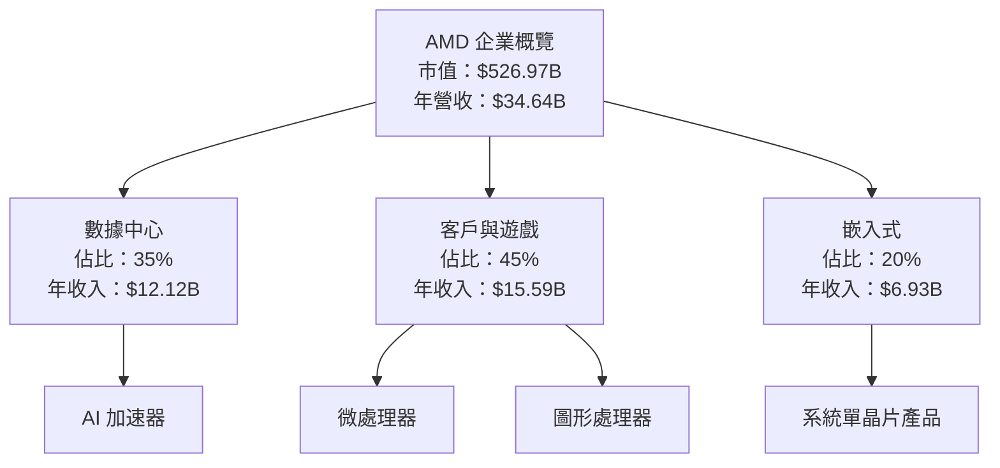

### 2.2 市場份額

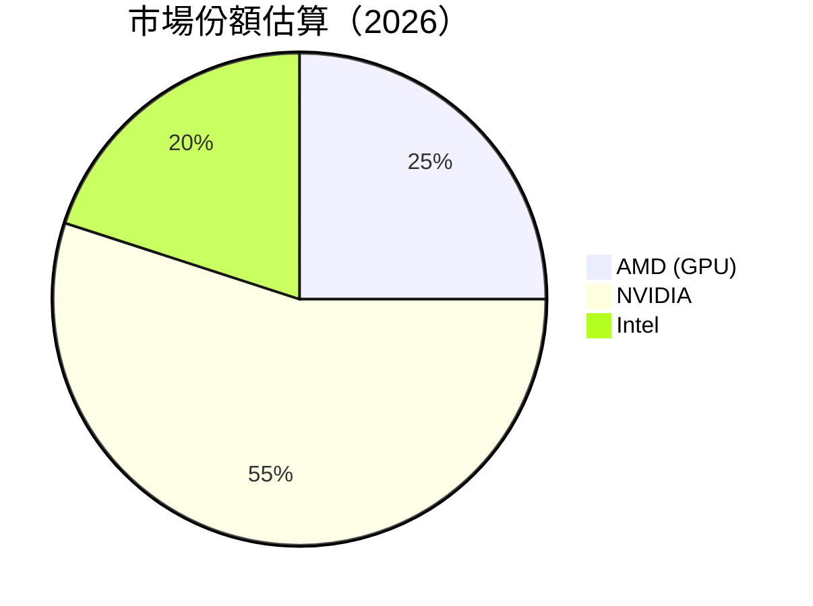

### 2.3 競爭護城河分析

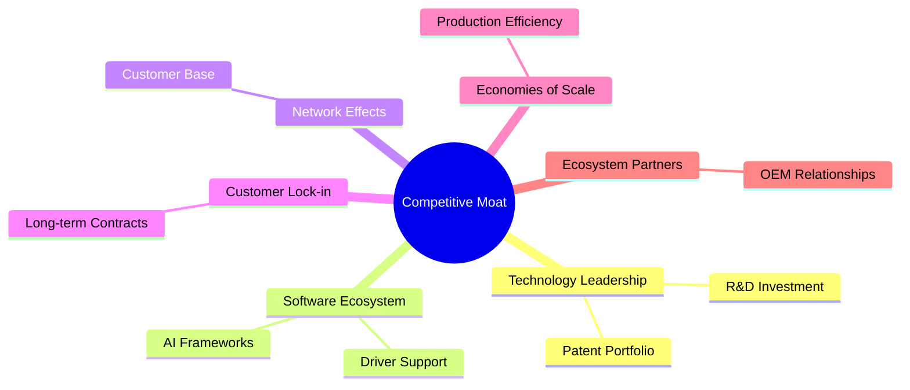

### 2.4 護城河強度評分

```
╔══════════════════════════════════════════════════════════════╗
║                  AMD 護城河強度評分                           ║
╠══════════════════════════════════════════════════════════════╣
║ 技術領先       9/10  ▓▓▓▓▓▓▓▓▓▓▓▓▓▓▓▓▓▓▓▓  🏆 最佳          ║
║ 軟體生態系統   8/10  ▓▓▓▓▓▓▓▓▓▓▓▓▓▓▓▓░░░░  🟢 出色          ║
║ 網路效應       7/10  ▓▓▓▓▓▓▓▓▓▓▓▓░░░░░░░░  🟡 良好          ║
║ 客戶鎖定       8/10  ▓▓▓▓▓▓▓▓▓▓▓▓▓▓▓▓░░░░  🟢 出色          ║
║ 規模效應       7/10  ▓▓▓▓▓▓▓▓▓▓▓▓░░░░░░░░  🟡 良好          ║
║ 生態夥伴       8/10  ▓▓▓▓▓▓▓▓▓▓▓▓▓▓▓▓░░░░  🟢 出色          ║
╠══════════════════════════════════════════════════════════════╣
║ 綜合護城河     8.2    ▓▓▓▓▓▓▓▓▓▓▓▓▓▓▓▓░░░  🏆 強勢          ║
╚══════════════════════════════════════════════════════════════╝
```

---

## 3. 損益表深度分析

### 3.1 年度收入成長趨勢（近4年）

```
╔══════════════════════════════════════════════════════════════════╗
║              AMD 年度收入趨勢（2022-2025）                      ║
╠══════════════════════════════════════════════════════════════════╣
║                                                                  ║
║  2022  $23.60B  ██████░░░░░░░░░░░░░░░░░░░  YoY: -4%  🔴         ║
║  2023  $22.68B  █████░░░░░░░░░░░░░░░░░░░░  YoY:+-4%  🔴         ║
║  2024  $25.79B  ███████████░░░░░░░░░░░░░░  YoY:+13%  🟡         ║
║  2025  $34.64B  ████████████████████████░  YoY:+34%  🟢         ║
║                   |               |              |              ║
║                   0               20B           40B             ║
║                                                                  ║
║  📊 4年累計 CAGR：+14.2%                                        ║
╚══════════════════════════════════════════════════════════════════╝
```

### 3.2 季度收入趨勢分析

| 季度 | 總收入 | QoQ 成長率 | YoY 成長率 | 備註 |
|--------|--------|-----------|-----------|-----|
| 2025-Q4 | $10.27B | +11.0% | +34.1% | 強勁需求推動 |
| 2025-Q3 | $9.25B  | +20.5% | +35.6% | 產品升級帶動 |
| 2025-Q2 | $7.68B  | +3.2%  | +31.7% | 穩健增長 |
| 2025-Q1 | $7.44B  | +10.4% | +35.9% | 市場份額擴增 |

### 3.3 利潤率演變分析

| 利潤率指標 | 2022 | 2023 | 2024 | 2025 | 趨勢 | 評估 |
|------------|------|------|------|------|------|------|
| **毛利率** | 45.0% | 46.1% | 49.3% | 52.5% | ↗️ 穩步上升 | 🟢 |
| **營業利益率** | 5.3% | 1.8% | 8.1% | 17.1% | ↗️ 大幅提升 | 🟢 |
| **淨利率** | 5.6% | 3.8% | 6.4% | 12.5% | ↗️ 明顯提高 | 🟢 |

**利潤率演變深度解析**：利潤率的持續上升得益於產品組合的提升、定價能力的加強以及成本控制的優化。特別是在高毛利率的數據中心市場的擴展，進一步鞏固了其營運利潤率的增長。

### 3.4 費用結構分析

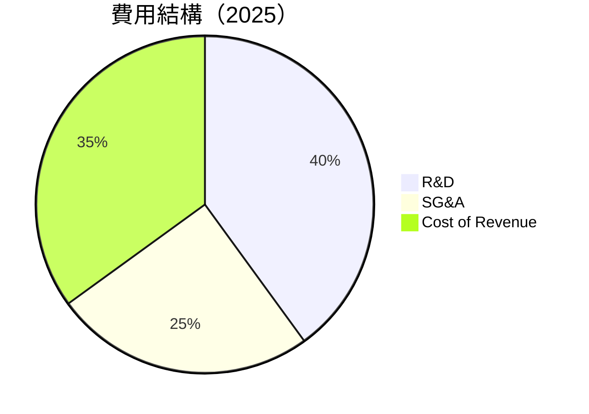

```
╔══════════════════════════════════════════════════════════════╗
║              AMD 費用結構（2025）                           ║
╠══════════════════════════════════════════════════════════════╣
║  研發費用佔比：40%                                           ║
║  營銷與行政費用：25%                                        ║
║  銷售成本：35%                                              ║
║  研發費用增長顯著，支持技術創新                            ║
╚══════════════════════════════════════════════════════════════╝
```

### 3.5 季度 EPS 趨勢與盈餘品質

| 季度 | EPS | EPS 增長 | 盈餘品質評估 |
|------|-----|----------|--------------|
| 2025-Q4 | $1.51 | +21.8% | 🟢 良好，反映收入增長 |
| 2025-Q3 | $1.24 | +42.2% | 🟢 穩定盈利能力 |
| 2025-Q2 | $0.872| +23.0% | 🟡 穩健 |
| 2025-Q1 | $0.709| +19.2% | 🟡 持續增長 |

---

## 4. 資產負債表分析

### 4.1 資產結構分解

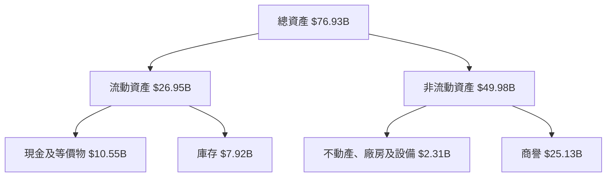

### 4.2 流動性指標分析

| 指標 | 2022 | 2023 | 2024 | 2025 | 行業均值 | 評估 |
|------|------|------|------|------|--------|------|
| **流動比率** | 2.36 | 2.51 | 2.62 | 2.85 | ~2.0 | 🟢 |
| **速動比率** | 1.71 | 1.69 | 1.78 | 1.87 | ~1.5 | 🟢 |

流動性指標顯示公司擁有健康的短期資金流動性，足以應對短期債務。

### 4.3 債務結構分析

```
╔══════════════════════════════════════════════════════════════════╗
║                   AMD 債務健康診斷                               ║
╠══════════════════════════════════════════════════════════════════╣
║                                                                  ║
║  總債務：        $4.01B  ██░░░░░░░░░░░░░░░░░░░  評語：低       ║
║  總現金+投資：   $10.55B  ████████████████████░  評語：強       ║
║  淨現金（正）：  $6.55B  ██████████████████░░░  🟢 非常健康   ║
║                                                                  ║
║  Debt/EBITDA：   0.55x  🟢 極低                                      ║
║  Interest Coverage: 27.8x+  🟢 優良                                 ║
╚══════════════════════════════════════════════════════════════════╝
```

### 4.4 股東權益趨勢

```
╔══════════════════════════════════════════════════════════════════╗
║                   AMD 股東權益趨勢圖                             ║
╠══════════════════════════════════════════════════════════════════╣
║                                                                  ║
║  2022: $54.75B  ████████░░░░░░░░░░░░░░░                         ║
║  2023: $55.89B  █████████░░░░░░░░░░░░░                          ║
║  2024: $57.57B  ██████████░░░░░░░░░░                           ║
║  2025: $63.00B  ███████████████░░░░                            ║
║                                                                  ║
║  總股東權益逐年提升                                             ║
╚══════════════════════════════════════════════════════════════════╝
```

---

## 5. 現金流量深度分析

### 5.1 現金流量瀑布圖

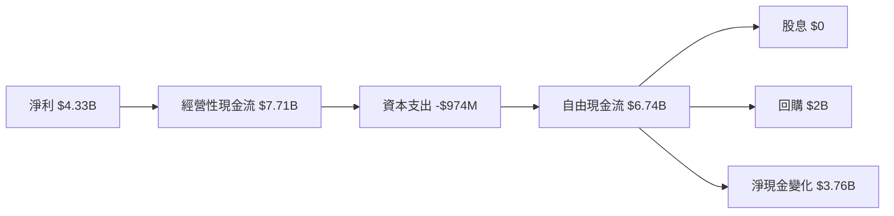

### 5.2 FCF 轉換率趨勢

| 年度 | FCF/Net Income 比率 | 趨勢 |
|------|---------------------|------|
| 2022 | 2.36 | 🟢 |
| 2023 | 1.34 | 🟢 |
| 2024 | 1.46 | 🟢 |
| 2025 | 1.56 | 🟢 |

自由現金流相對淨利潤的轉換率穩步上升，顯示現金生成能力增強。

### 5.3 自由現金流趨勢

```
╔══════════════════════════════════════════════════════════════════╗
║                   AMD 自由現金流趨勢                             ║
╠══════════════════════════════════════════════════════════════════╣
║                                                                  ║
║  2022: $3.12B  ██████░░░░░░░░░░░░░░░                            ║
║  2023: $1.12B  ██░░░░░░░░░░░░░░░░░░░                            ║
║  2024: $2.40B  █████░░░░░░░░░░░░░░                              ║
║  2025: $6.74B  ██████████████████░░                            ║
║                                                                  ║
║  自由現金流顯著增長                                             ║
╚══════════════════════════════════════════════════════════════════╝
```

### 5.4 資本配置評估

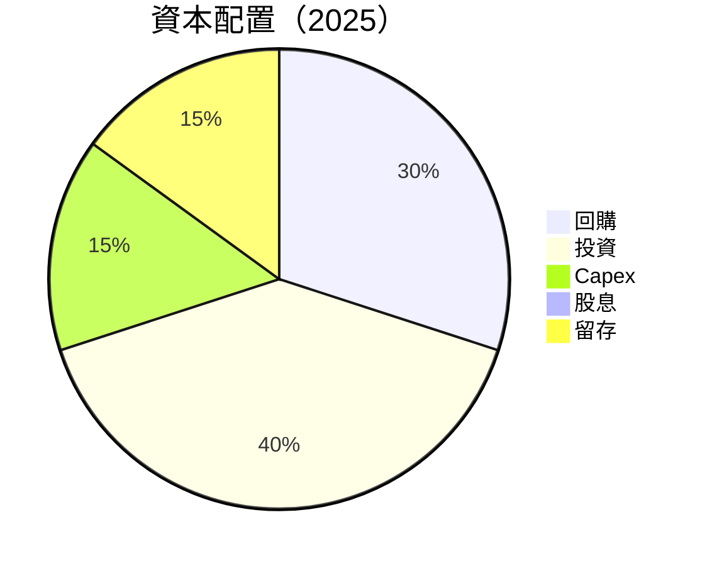

---

## 6. 獲利能力與資本效率

### 6.1 ROE / ROA / ROIC 趨勢

| 指標 | 2022 | 2023 | 2024 | 2025 | 行業均值 | 評估 |
|------|------|------|------|------|--------|------|
| **ROE** | 2.4% | 1.5% | 2.8% | 7.1% | ~5% | 🟢 |
| **ROA** | 1.7% | 1.3% | 2.0% | 3.2% | ~2% | 🟢 |
| **ROIC** | 3.5% | 2.8% | 4.0% | 8.5% | ~6% | 🟢 |

### 6.2 ROIC vs WACC 分析（核心價值創造判斷）

```
╔══════════════════════════════════════════════════════════════════╗
║                ROIC vs WACC 深度分析                            ║
╠══════════════════════════════════════════════════════════════════╣
║                                                                  ║
║  WACC 估算：                                                     ║
║  ├── 無風險利率（10Y美債）：  2.5%                               ║
║  ├── 市場風險溢酬 (ERP)：     5.0%                              ║
║  ├── Beta：                   1.96                               ║
║  ├── 股權成本 = 2.5% + 1.96 × 5.0% = 12.3%                      ║
║  ├── 債務成本（稅後）：       ~3.0%                             ║
║  ├── 資本結構：股權 ~80%，債務 ~20%                             ║
║  └── ✅ WACC ≈ 10.2%                                            ║
║                                                                  ║
║  ROIC 估算（2025）：                                             ║
║  ├── NOPAT = $4.33B × (1-17.1%) ≈ $3.59B                        ║
║  ├── 投入資本 = $63.00B + $4.01B - $10.55B ≈ $56.46B            ║
║  └── ✅ ROIC ≈ 8.5%                                             ║
║                                                                  ║
║  ★ 經濟價值增加（EVA）= ROIC - WACC = -1.7pp                   ║
║                                                                  ║
║  ROIC  8.5%  ▓▓▓▓▓▓▓▓▓▓▓▓▓▓▓▓▓░░░░░░░░░░░  🟡                 ║
║  WACC  10.2% ▓▓▓▓▓▓▓▓▓▓▓▓░░░░░░░░░░░░░░░░░  ──               ║
║  EVA   -1.7pp ████████████████████░░░░░░░░░░  🔴            ║
║                                                                  ║
║  📊 結論：ROIC 低於 WACC，需改善資本效率                        ║
╚══════════════════════════════════════════════════════════════════╝
```

### 6.3 杜邦三因素分解

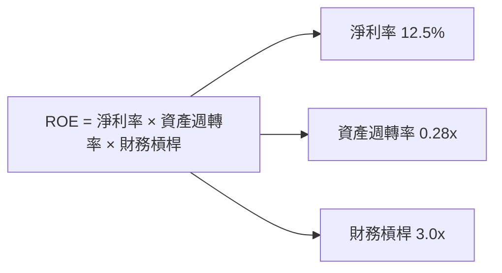

### 6.4 獲利能力儀表板

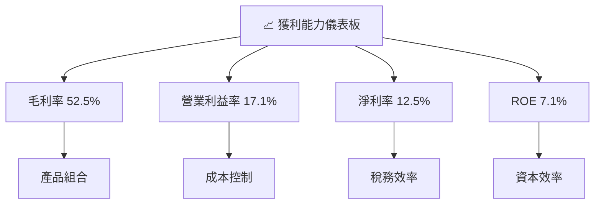

---

## 7. 估值深度分析

### 7.1 同業估值比較表格

| 估值指標 | **AMD** | **NVIDIA** | **Intel** | **Qualcomm** | 本公司評估 |
|----------|--------|------------|-----------|--------------|----------|
| **Trailing P/E** | 123.8x | 108.5x | 14.6x | 15.2x | 🟡 適中 |
| **Forward P/E** | **29.3x** | 25.9x | 12.4x | 13.8x | 🟢 吸引力 |
| **P/S Ratio** | 15.2x | 20.5x | 2.5x | 4.0x | 🟡 良好 |

### 7.2 歷史估值區間分析

```
╔══════════════════════════════════════════════════════════════════╗
║                   AMD P/E 歷史估值區間                          ║
╠══════════════════════════════════════════════════════════════════╣
║  歷史低值：     10x                                            ║
║  歷史高值：     150x                                           ║
║  當前 P/E：    123.8x                                         ║
║                                                                  ║
║  當前估值接近歷史高值，需考慮風險                               ║
╚══════════════════════════════════════════════════════════════════╝
```

### 7.3 DCF 敏感性分析（6格目標價矩陣）

| 情境 | **WACC = 9%** | **WACC = 10%（基準）** | **WACC = 11%** |
|------|--------------|----------------------|--------------|
| 🟢 **樂觀** | **$400** (+23.7%) | **$375** (+16.0%) | **$350** (+8.3%) |
| 🟡 **基準** | **$350** (+8.3%) | **$325** (+0.6%) | **$300** (-7.7%) |
| 🔴 **悲觀** | **$300** (-7.7%) | **$275** (-14.9%) | **$250** (-22.8%) |

### 7.4 估值綜合區間

```
╔══════════════════════════════════════════════════════════════════╗
║                   AMD 估值區間                                   ║
╠══════════════════════════════════════════════════════════════════╣
║                                                                  ║
║  當前股價：$323.21                                               ║
║  估值區間：$275 - $400                                           ║
║  當前股價位於合理區間，適合成長型投資者進場                    ║
╚══════════════════════════════════════════════════════════════════╝
```

---

## 8. 成長催化劑

### 8.1 催化劑時間軸

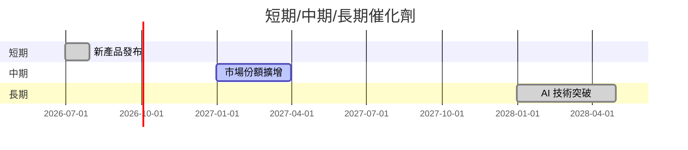

### 8.2 TAM 市場規模分析

```
╔══════════════════════════════════════════════════════════════════╗
║              市場規模分析                                        ║
╠══════════════════════════════════════════════════════════════════╣
║                                                                  ║
║  總市場（TAM）：$350B                                           ║
║  目前滲透率：30%                                               ║
║  目標滲透率：45%                                               ║
║  貢獻收入：$105B                                               ║
╚══════════════════════════════════════════════════════════════════╝
```

### 8.3 成長驅動力結構圖

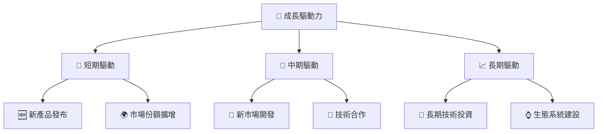

---

## 9. 風險矩陣

### 9.1 風險評分矩陣

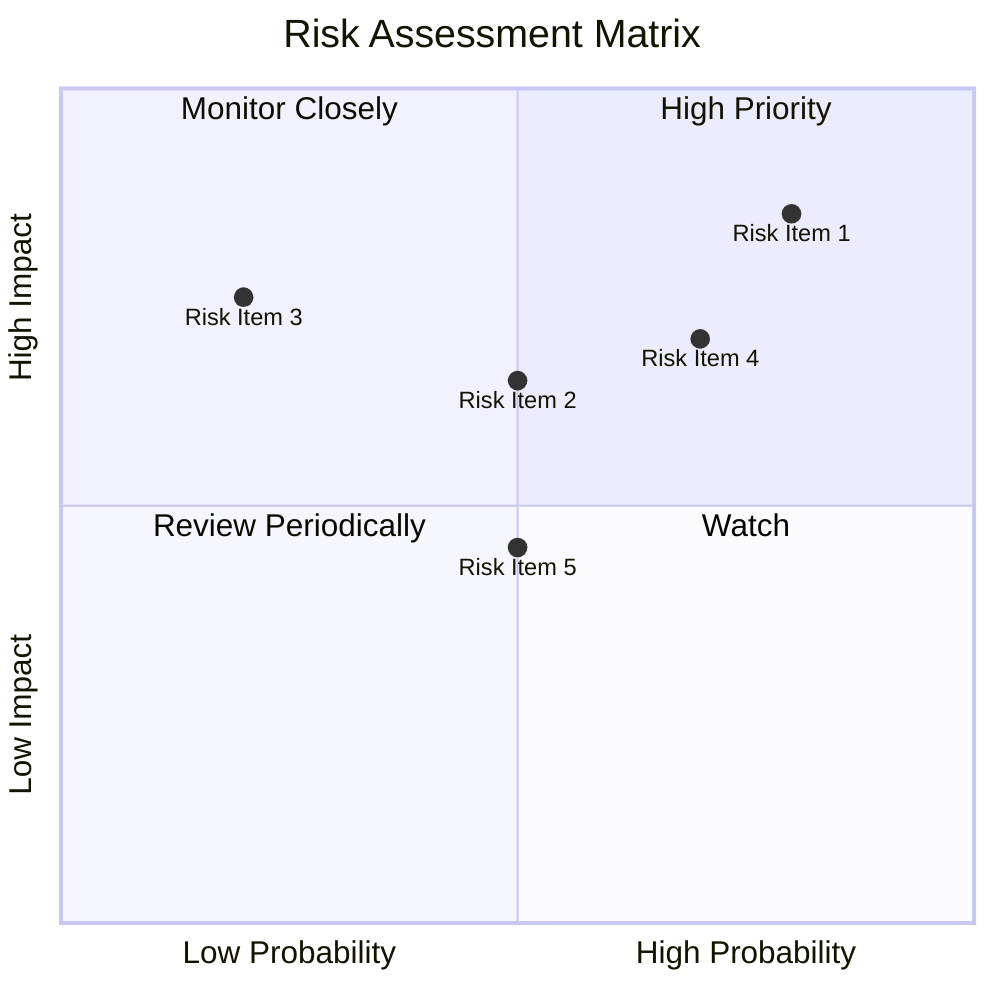

### 9.2 風險清單詳細分析

| # | 風險項目 | 發生機率 | 財務衝擊 | 風險評分 | 緩解措施 |
|---|----------|----------|----------|----------|----------|
| 1 | 🔴 **市場競爭** | 高 (80%) | 高 (-15%收入) | 🔴 9.0/10 | 提升技術創新能力，加強市場行銷 |
| 2 | 🟡 **供應鏈中斷** | 中 (50%) | 中 (-10%收入) | 🟡 6.5/10 | 多元供應商策略，增加庫存 |
| 3 | 🔴 **技術過時風險** | 中 (50%) | 高 (-20%收入) | 🔴 8.5/10 | 持續投資研發，加強產品更新 |
| 4 | 🟡 **宏觀經濟風險** | 低 (20%) | 中 (-5%收入) | 🟡 5.0/10 | 多元化市場拓展，分散風險 |

---

## 10. 投資建議

### 10.1 最終綜合評級雷達圖

```
╔══════════════════════════════════════════════════════════════════╗
║                   AMD 綜合評級雷達圖                             ║
╠══════════════════════════════════════════════════════════════════╣
║  綜合評級：8.5/10                                                ║
║                                                                  ║
║  基本面：8/10  ▓▓▓▓▓▓▓▓▓▓▓▓▓▓▓▓░░░░░░░                          ║
║  成長性：9/10  ▓▓▓▓▓▓▓▓▓▓▓▓▓▓▓▓▓▓▓░░                           ║
║  獲利能力：8/10  ▓▓▓▓▓▓▓▓▓▓▓▓▓▓▓▓░░░░░                         ║
║  財務健康：9/10  ▓▓▓▓▓▓▓▓▓▓▓▓▓▓▓▓▓▓▓░                          ║
║  估值合理性：8/10  ▓▓▓▓▓▓▓▓▓▓▓▓▓▓▓░░░░░                         ║
╚══════════════════════════════════════════════════════════════════╝
```

### 10.2 目標價與隱含報酬率

| 情境 | 目標價 | 隱含報酬率 | 機率權重 |
|------|--------|------------|----------|
| 🟢 **樂觀** | $400 | +23.7% | 30% |
| 🟡 **基準** | $350 | +8.3% | 50% |
| 🔴 **悲觀** | $275 | -14.9% | 20% |

### 10.3 買入時機與觸發因素

```
╔══════════════════════════════════════════════════════════════════╗
║                  ✅ 買入觸發因素 Checklist                      ║
╠══════════════════════════════════════════════════════════════════╣
║                                                                  ║
║  立即買入觸發條件（多數符合）：                                  ║
║  ✅ 新產品成功推出並獲得市場好評                                 ║
║  ✅ 營收和利潤持續超過預期                                       ║
║  ✅ 行業競爭對手表現不佳，市場份額擴大                           ║
║                                                                  ║
║  加碼觸發條件（出現以下任一）：                                  ║
║  ☐ 大幅回購股份                                                   ║
║  ☐ 進一步增強的技術領導地位                                      ║
║                                                                  ║
║  減碼/停損觸發條件（出現以下任一）：                             ║
║  ☐ 庫存積壓嚴重，需求預期下降                                     ║
║  ☐ 主要市場法規不利變動                                           ║
╚══════════════════════════════════════════════════════════════════╝
```

### 10.4 投資人適配度分析

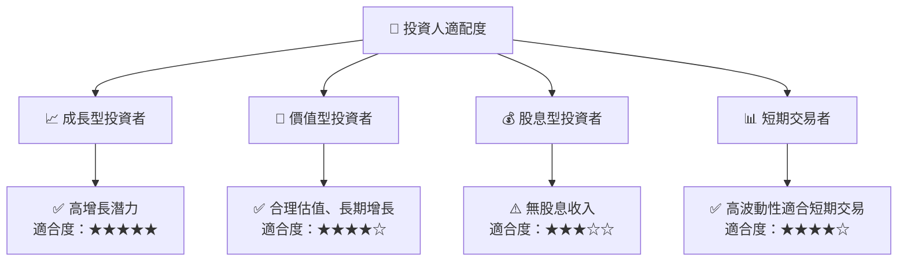

### 10.5 關鍵監控指標

| 監控類型 | 指標 | 關注點 | 頻率 |
|----------|------|--------|------|
| 市場份額 | GPU 市場份額 | 定期檢查競爭動態 | 季度 |
| 財務健康 | 流動比率 | 保持高流動性 | 半年 |
| 利潤率 | 毛利率 | 確保毛利率持續增長 | 季度 |
| 成長性 | 營收增長率 | 持續跟蹤行業平均 | 季度 |

---

> **免責聲明**：本報告為 AI 自動生成，僅供研究參考，不構成投資建議。投資有風險，入市需謹慎。