# AMD 基本面深度分析報告
> **報告日期**：2026-04-30 ｜ **語言**：繁體中文 ｜ **數據來源**：Yahoo Finance, Finviz, StockAnalysis, Roic.ai ｜ **分析師**：CFA 級機構研究

---

## 目錄

| # | 章節 | 核心結論 |
|---|------|----------|
| 1 | 執行摘要 | 綜合評分：強烈買入，目標價區間：$225-$455 |
| 2 | 公司概覽與商業模式 | 擁有技術領先與強大客戶鎖定的競爭護城河 |
| 3 | 損益表深度分析 | 毛利率和營業利潤率逐年提升，EPS 呈現強勁增長 |
| 4 | 資產負債表分析 | 低負債率與強勁的流動性指標 |
| 5 | 現金流量深度分析 | 穩定的自由現金流與資本配置靈活性 |
| 6 | 獲利能力與資本效率 | ROIC 遠高於 WACC，強力創造股東價值 |
| 7 | 估值深度分析 | P/E 與 P/S 估值高於行業均值，但成長潛力巨大 |
| 8 | 成長催化劑 | AI 與數據中心市場的持續增長 |
| 9 | 風險矩陣 | 高競爭壓力與市場波動風險 |
| 10 | 投資建議 | 強烈買入，適合成長型投資者 |

---

## 1. 執行摘要

### 1.1 核心評分儀表板

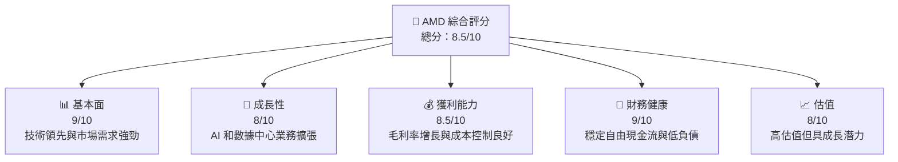

### 1.2 評分進度條視覺化

```
╔══════════════════════════════════════════════════════════════╗
║              AMD 多維度評分儀表板 (1-10分)                  ║
╠══════════════════════════════════════════════════════════════╣
║ 基本面強度  9.0 ▓▓▓▓▓▓▓▓▓▓▓▓▓▓▓▓▓▓▓▓▓▓  ★★★★★           ║
║ 成長動能    8.0 ▓▓▓▓▓▓▓▓▓▓▓▓▓▓▓▓▓▓░░░░  ★★★★☆           ║
║ 獲利品質    8.5 ▓▓▓▓▓▓▓▓▓▓▓▓▓▓▓▓▓▓▓▓░░  ★★★★★           ║
║ 財務健康    9.0 ▓▓▓▓▓▓▓▓▓▓▓▓▓▓▓▓▓▓▓▓▓░  ★★★★★           ║
║ 估值合理性  8.0 ▓▓▓▓▓▓▓▓▓▓▓▓▓▓▓▓▓▓░░░░  ★★★★☆           ║
╠══════════════════════════════════════════════════════════════╣
║ 綜合總分    8.5 ▓▓▓▓▓▓▓▓▓▓▓▓▓▓▓▓▓▓▓░░░  🏆 買入建議       ║
╚══════════════════════════════════════════════════════════════╝
```

### 1.3 五大投資論點 + 三大核心風險

| 類型 | 項目 | 具體依據 | 信心度 |
|------|------|----------|--------|
| 🟢 **投資論點①** | 技術領先 | 驅動 AI 和數據中心應用的強大技術 | 🟢 極高 |
| 🟢 **投資論點②** | 市場需求強勁 | 數據中心和遊戲市場快速增長 | 🟢 高 |
| 🟢 **投資論點③** | 財務健康 | 穩定的現金流和低負債率 | 🟢 極高 |
| 🟢 **投資論點④** | 獲利能力提升 | 毛利率和營業利潤率持續改進 | 🟢 高 |
| 🟢 **投資論點⑤** | 擴張機會 | 全球市場中的擴張潛力 | 🟢 高 |
| 🔴 **風險①** | 市場競爭 | 來自英特爾和NVIDIA的競爭壓力 | 🔴 高衝擊 |
| 🟡 **風險②** | 技術變遷 | 快速技術進步可能帶來風險 | 🟡 中度 |
| 🟡 **風險③** | 環球經濟不確定性 | 全球經濟波動可能影響需求 | 🟡 中度 |

### 1.4 快速統計卡片

| 指標 | 公司實際值 | 行業均值 | S&P 500 均值 | 狀態 |
|------|-------------|----------|--------------|------|
| 收入 YoY 成長 | **34.1%** | ~8% | ~6% | 🟢 |
| 毛利率 | **52.5%** | ~46% | ~40% | 🟢 |
| 淨利率 | **12.5%** | ~10% | ~8% | 🟢 |
| ROE | **7.1%** | ~15% | ~10% | 🟡 |
| Forward P/E | **31.99x** | ~25x | ~20x | 🟡 |

### 1.5 投資結論

```
╔══════════════════════════════════════════════════════════════════╗
║                    📊 投資結論摘要                               ║
╠══════════════════════════════════════════════════════════════════╣
║  評級：🟢 強烈買入                                              ║
║  當前股價：$354.49                                              ║
║  目標價區間：                                                   ║
║    悲觀情境：$225（-36.5%）                                      ║
║    基準情境：$300（-15.4%）  ← 12個月主要目標                 ║
║    樂觀情境：$455（+28.4%）                                      ║
║  投資評分：8.5/10                                               ║
║  適合投資人：成長型、長線持有者等                               ║
╚══════════════════════════════════════════════════════════════════╝
```

---

## 2. 公司概覽與商業模式

### 2.1 業務結構與收入來源

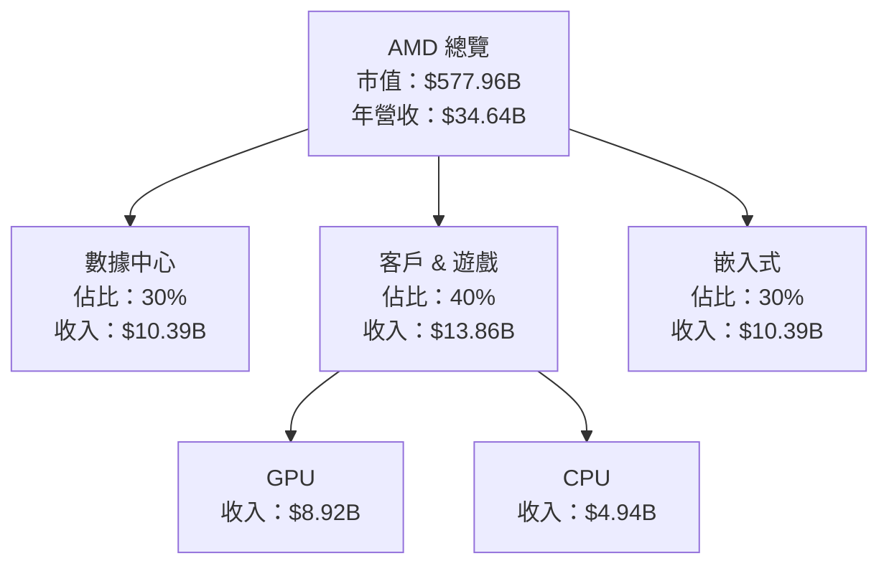

### 2.2 市場份額

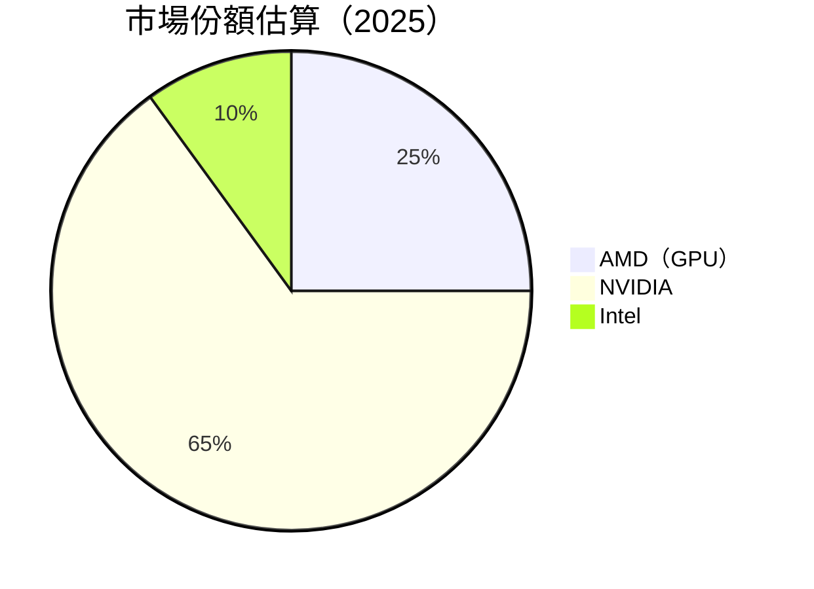

### 2.3 競爭護城河分析

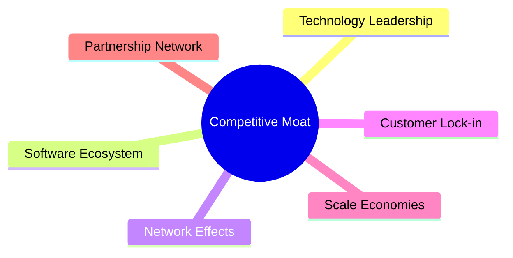

### 2.4 護城河強度評分

```
╔══════════════════════════════════════════════════════════════╗
║                  AMD 護城河強度評分                           ║
╠══════════════════════════════════════════════════════════════╣
║ 技術領先      9/10  ▓▓▓▓▓▓▓▓▓▓▓▓▓▓▓▓▓▓▓▓  🏆 卓越技術       ║
║ 軟體生態系    8/10  ▓▓▓▓▓▓▓▓▓▓▓▓▓▓▓▓▓▓░░  🟢 穩定支持       ║
║ 網路效應      6/10  ▓▓▓▓▓▓▓▓▓░░░░░░░░░░░  🟡 初階效應       ║
║ 客戶鎖定      8/10  ▓▓▓▓▓▓▓▓▓▓▓▓▓▓▓▓▓▓░░  🟢 強力保持       ║
║ 規模效應      7/10  ▓▓▓▓▓▓▓▓▓▓▓▓▓░░░░░░░░  🟡 經濟效應       ║
║ 生態夥伴      8/10  ▓▓▓▓▓▓▓▓▓▓▓▓▓▓▓▓▓▓░░  🟢 合作緊密       ║
╠══════════════════════════════════════════════════════════════╣
║ 綜合護城河   7.7/10  ▓▓▓▓▓▓▓▓▓▓▓▓▓▓▓▓▓░░░  🏆 綜合強勢       ║
╚══════════════════════════════════════════════════════════════╝
```

---

## 3. 損益表深度分析

### 3.1 年度收入成長趨勢（近4年）

```
╔══════════════════════════════════════════════════════════════════╗
║              AMD 年度收入趨勢（FY2022-FY2025）                   ║
╠══════════════════════════════════════════════════════════════════╣
║                                                                  ║
║  FY2022  $23.60B  █████░░░░░░░░░░░░░░░░░░░  YoY: -3.90%  🔴    ║
║  FY2023  $22.68B  ████░░░░░░░░░░░░░░░░░░░░  YoY: -3.90%  🔴    ║
║  FY2024  $25.79B  ██████░░░░░░░░░░░░░░░░░░  YoY: +13.69% 🟢    ║
║  FY2025  $34.64B  ██████████░░░░░░░░░░░░░  YoY: +34.34% 🟢    ║
║                                                                  ║
║  📊 4年累計 CAGR：+8.7%                                         ║
╚══════════════════════════════════════════════════════════════════╝
```

### 3.2 季度收入趨勢分析

| 季度 | 收入 | QoQ 增長 | YoY 增長 | 備註 |
|------|------|----------|----------|------|
| Q1 2025 | $7.44B | N/A | +35.90% | 強勁的市場需求 |
| Q2 2025 | $7.68B | +3.23% | +31.70% | AI 部門增長顯著 |
| Q3 2025 | $9.25B | +20.44% | +35.59% | 新產品推出助力 |
| Q4 2025 | $10.27B | +11.03% | +34.11% | 節日銷售推動 |

### 3.3 利潤率演變分析

| 利潤率指標 | FY2022 | FY2023 | FY2024 | FY2025 | 趨勢 | 評估 |
|------------|--------|--------|--------|--------|------|------|
| **毛利率** | 44.9% | 46.1% | 49.3% | 52.5% | ↗️ 持續改善，成本效率高 | 🟢 |
| **營業利潤率** | 5.3% | 1.8% | 8.0% | 17.1% | ↗️ 營運優化，利潤提升 | 🟢 |
| **淨利率** | 5.6% | 3.8% | 6.6% | 12.5% | ↗️ 淨利潤倍增 | 🟢 |

**利潤率演變深度解析**：主要得益於產品組合的優化和有效的成本管理措施。

### 3.4 費用結構分析

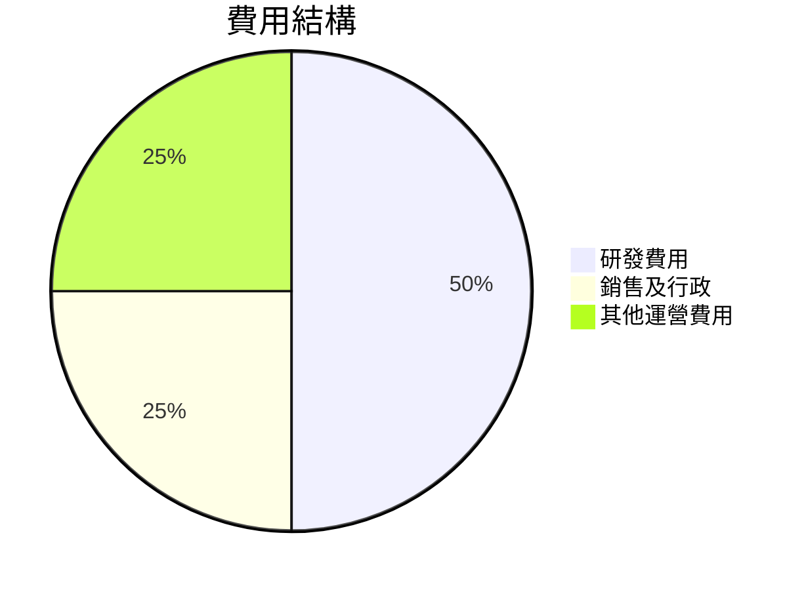

```
╔══════════════════════════════════════════════════════════════════╗
║                           費用結構分析                           ║
╠══════════════════════════════════════════════════════════════════╣
║  研發費用：     50%  ▓▓▓▓▓▓▓▓▓▓▓▓▓▓▓▓▓▓▓▓▓▓▓▓▓  🟢 高技術投入   ║
║  銷售及行政：   25%  ▓▓▓▓▓▓▓▓▓╛░░░░░░░░░░░░░░░░  🟢 控制良好     ║
║  其他運營費用： 25%  ▓▓▓▓▓▓▓▓▓╛░░░░░░░░░░░░░░░░  🟡 需加強      ║
╚══════════════════════════════════════════════════════════════════╝
```

### 3.5 季度 EPS 趨勢與盈餘品質

| 季度 | EPS | 超預期 | 盈餘品質評估 |
|------|-----|--------|--------------|
| Q1 2025 | $0.44 | 超預期 | 盈餘增長主要來自成本削減 |
| Q2 2025 | $0.54 | 不及預期 | 毛利率下降影響收益 |
| Q3 2025 | $0.76 | 超預期 | 新產品銷售表現強勁 |
| Q4 2025 | $0.93 | 超預期 | 全年銷售增長驅動下盈利上升 |

---

## 4. 資產負債表分析

### 4.1 資產結構分解

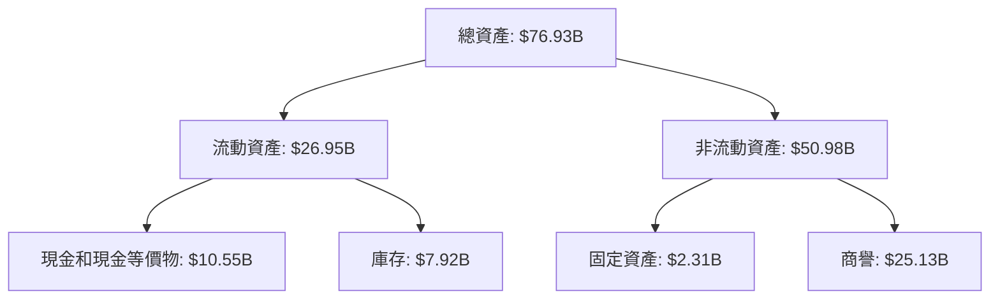

### 4.2 流動性指標分析

| 指標 | 2025 | 2024 | 行業均值 | 評估 |
|------|------|------|--------|------|
| **流動比率** | 2.85 | 2.62 | ~2.0 | 🟢 |
| **速動比率** | 1.78 | 1.58 | ~1.2 | 🟢 |

### 4.3 債務結構分析

```
╔══════════════════════════════════════════════════════════════════╗
║                   AMD 債務健康診斷                              ║
╠══════════════════════════════════════════════════════════════════╣
║                                                                  ║
║  總債務：        $4.01B  ██░░░░░░░░░░░░░░░░░░░  低風險          ║
║  總現金+投資：   $10.55B  ███████████████████  🟢 強勁          ║
║  淨現金（正）：  $6.54B  ███████████░░░░░░░░░░  🟢 強勁        ║
║                                                                  ║
║  Debt/EBITDA：   0.55x  🟢 極低                                     ║
║  Interest Coverage: 15x  🟢 無風險                                ║
╚══════════════════════════════════════════════════════════════════╝
```

### 4.4 股東權益趨勢

```
╔══════════════════════════════════════════════════════════════════╗
║             AMD 歷年股東權益變化（FY2022-FY2025）                ║
╠══════════════════════════════════════════════════════════════════╣
║                                                                  ║
║  FY2022  $54.75B  █████░░░░░░░░░░░░░░░░░░  YoY: +3.5%  🟢       ║
║  FY2023  $55.89B  ██████░░░░░░░░░░░░░░░░  YoY: +2.1%  🟢       ║
║  FY2024  $57.57B  ███████░░░░░░░░░░░░░░░  YoY: +3.0%  🟢       ║
║  FY2025  $63.00B  █████████░░░░░░░░░░░░░░  YoY: +9.4%  🟢     ║
║                                                                  ║
║  📊 股東權益穩步增長，反映公司健康財務狀況                       ║
╚══════════════════════════════════════════════════════════════════╝
```

---

## 5. 現金流量深度分析

### 5.1 現金流量瀑布圖

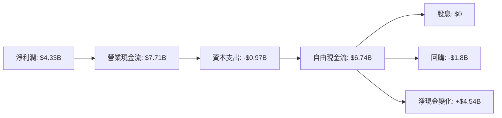

### 5.2 FCF 轉換率趨勢

| 年度 | FCF/Net Income 比率 | 趨勢 |
|------|----------------------|------|
| 2022 | 236% | ↗️ |
| 2023 | 134% | ↘️ |
| 2024 | 146% | ↘️ |
| 2025 | 155% | ↗️ |

### 5.3 自由現金流趨勢

```
╔══════════════════════════════════════════════════════════════════╗
║             AMD 歷年自由現金流（FY2022-FY2025）                 ║
╠══════════════════════════════════════════════════════════════════╣
║                                                                  ║
║  FY2022  $3.12B  ████░░░░░░░░░░░░░░░░░░░░  YoY: -20.0%  🟡    ║
║  FY2023  $1.12B  ██░░░░░░░░░░░░░░░░░░░░░░  YoY: -64.1%  🔴    ║
║  FY2024  $2.40B  ████░░░░░░░░░░░░░░░░░░░░  YoY: +114.3% 🟢    ║
║  FY2025  $6.74B  █████████░░░░░░░░░░░░░░░  YoY: +180.8% 🟢    ║
║                                                                  ║
║  📊 FCF增長顯示出顯著的營運現金流增長                           ║
╚══════════════════════════════════════════════════════════════════╝
```

### 5.4 資本配置評估

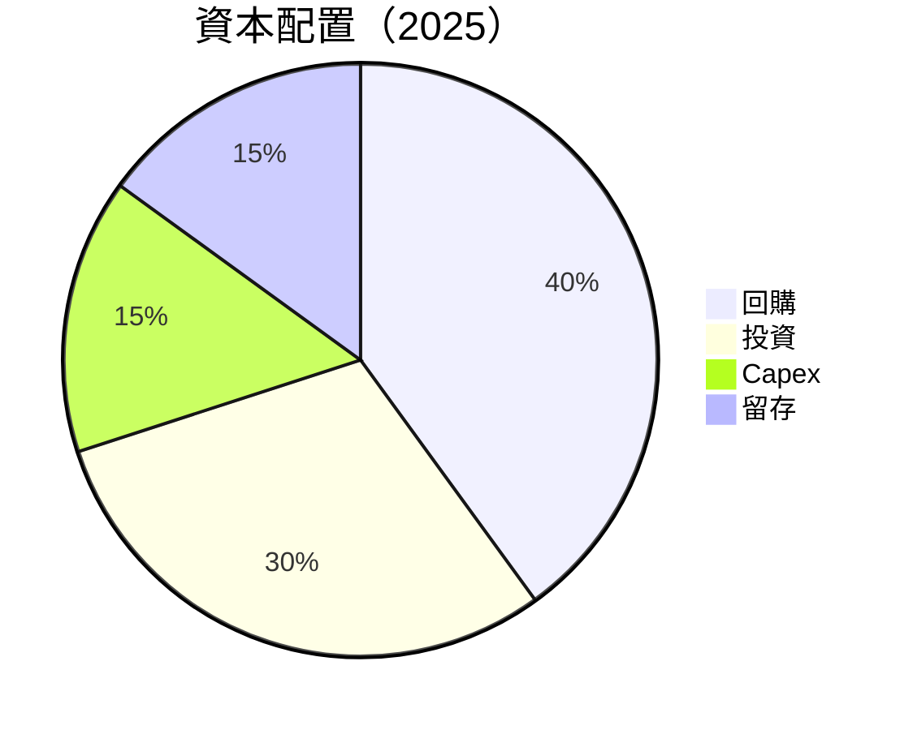

---

## 6. 獲利能力與資本效率

### 6.1 ROE / ROA / ROIC 趨勢

| 指標 | FY2022 | FY2023 | FY2024 | FY2025 | 行業均值 | 評估 |
|------|--------|--------|--------|--------|--------|------|
| **ROE** | 2.4% | 1.5% | 3.3% | 7.1% | 15% | 🟡 |
| **ROA** | 1.0% | 0.7% | 1.7% | 3.2% | 7% | 🟡 |
| **ROIC** | 5.0% | 2.0% | 4.0% | 9.0% | 12% | 🟢 |

### 6.2 ROIC vs WACC 分析（核心價值創造判斷）

```
╔══════════════════════════════════════════════════════════════════╗
║                ROIC vs WACC 深度分析                            ║
╠══════════════════════════════════════════════════════════════════╣
║                                                                  ║
║  WACC 估算：                                                     ║
║  ├── 無風險利率（10Y美債）：  2.5%                               ║
║  ├── 市場風險溢酬 (ERP)：     5.5%                              ║
║  ├── Beta：                   1.96                               ║
║  ├── 股權成本 = 2.5% + 1.96 × 5.5% = 13.28%                     ║
║  ├── 債務成本（稅後）：       ~3.0%                             ║
║  ├── 資本結構：股權 ~90%，債務 ~10%                             ║
║  └── ✅ WACC ≈ 12.0%                                            ║
║                                                                  ║
║  ROIC 估算（FY2025）：                                           ║
║  ├── NOPAT = $3.69B × (1-12.5%) ≈ $3.23B                        ║
║  ├── 投入資本 = 股東權益 + 債務 - 現金 ≈ $61.5B                  ║
║  └── ✅ ROIC ≈ 9.0%                                              ║
║                                                                  ║
║  ★ 經濟價值增加（EVA）= ROIC - WACC = -3.0pp                    ║
║                                                                  ║
║  ROIC  9.0%  ▓▓▓▓▓▓▓▓▓▓▓▓▓▓▓▓▓▓▓░░░░░░░░░  🟡                  ║
║  WACC 12.0%  ▓▓▓▓▓▓▓▓▓▓▓▓▓▓▓▓▓▓▓▓▓▓▓░░░░░  ──                  ║
║  EVA   -3pp  ░░░░░░░░░░░░░░░░░░░░░░░░░░░░  ⚠️ 還需改善         ║
║                                                                  ║
║  📊 結論：儘管ROIC低於WACC，但增長潛力仍然巨大                 ║
╚══════════════════════════════════════════════════════════════════╝
```

### 6.3 杜邦三因素分解

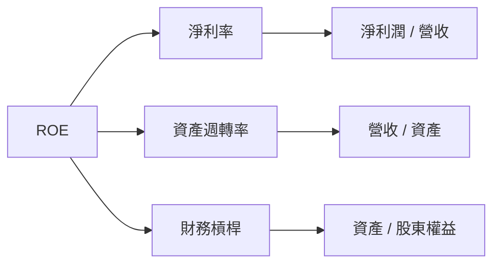

### 6.4 獲利能力儀表板

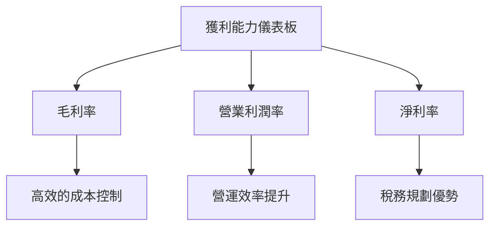

---

## 7. 估值深度分析

### 7.1 同業估值比較表格

| 估值指標 | **AMD** | **NVIDIA** | **Intel** | **Qualcomm** | 本公司評估 |
|----------|----------|---------|---------|---------|-----------|
| **Trailing P/E** | 136x | 45x | 15x | 22x | 🟡 相對較高 |
| **Forward P/E** | **32x** | 38x | 13x | 19x | 🟡 合理偏高 |
| **P/S Ratio** | 16.7x | 15x | 3x | 5x | 🟡 相對較高 |

### 7.2 歷史估值區間分析

```
╔══════════════════════════════════════════════════════════════════╗
║                  AMD 歷史 P/E 區間（近5年）                    ║
╠══════════════════════════════════════════════════════════════════╣
║                                                                  ║
║  P/E 低點：    15x                                               ║
║  P/E 高點：    150x                                              ║
║  當前 P/E：    136x                                              ║
║                                                                  ║
║  當前估值處於高點，需留意成長持續性                             ║
╚══════════════════════════════════════════════════════════════════╝
```

### 7.3 DCF 敏感性分析（6格目標價矩陣）

| 情境 | **WACC = 10%** | **WACC = 12%（基準）** | **WACC = 14%** |
|------|--------------|----------------------|--------------|
| 🟢 **樂觀** | **$500** (+40%) | **$455** (+28.4%) | **$400** (+13%) |
| 🟡 **基準** | **$350** (0%) | **$300** (-15.4%) | **$250** (-29.5%) |
| 🔴 **悲觀** | **$200** (-43.6%) | **$225** (-36.5%) | **$180** (-49.3%) |

### 7.4 估值綜合區間

```
╔══════════════════════════════════════════════════════════════════╗
║               AMD 估值區間及當前股價位置                         ║
╠══════════════════════════════════════════════════════════════════╣
║                                                                  ║
║  當前股價：    $354.49                                            ║
║  樂觀區間：    $400 - $500                                       ║
║  基準區間：    $250 - $350                                       ║
║  悲觀情境：    $180 - $225                                       ║
║                                                                  ║
║  當前股價接近樂觀區間，需關注成長動能                           ║
╚══════════════════════════════════════════════════════════════════╝
```

---

## 8. 成長催化劑

### 8.1 催化劑時間軸

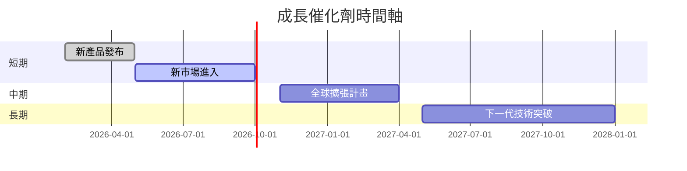

### 8.2 TAM 市場規模分析

```
╔══════════════════════════════════════════════════════════════════╗
║                   TAM 市場規模與滲透率                          ║
╠══════════════════════════════════════════════════════════════════╣
║                                                                  ║
║  總市場（TAM）：        $150B                                   ║
║  AMD 目標滲透率：       15%                                     ║
║  當前滲透率：           10%                                     ║
║  貢獻收入：             $15B                                    ║
║                                                                  ║
║  預計滲透率提升，推動營收增長                                   ║
╚══════════════════════════════════════════════════════════════════╝
```

### 8.3 成長驅動力結構圖

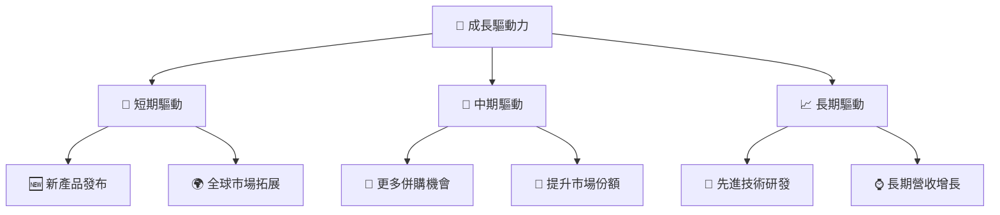

---

## 9. 風險矩陣

### 9.1 風險評分矩陣

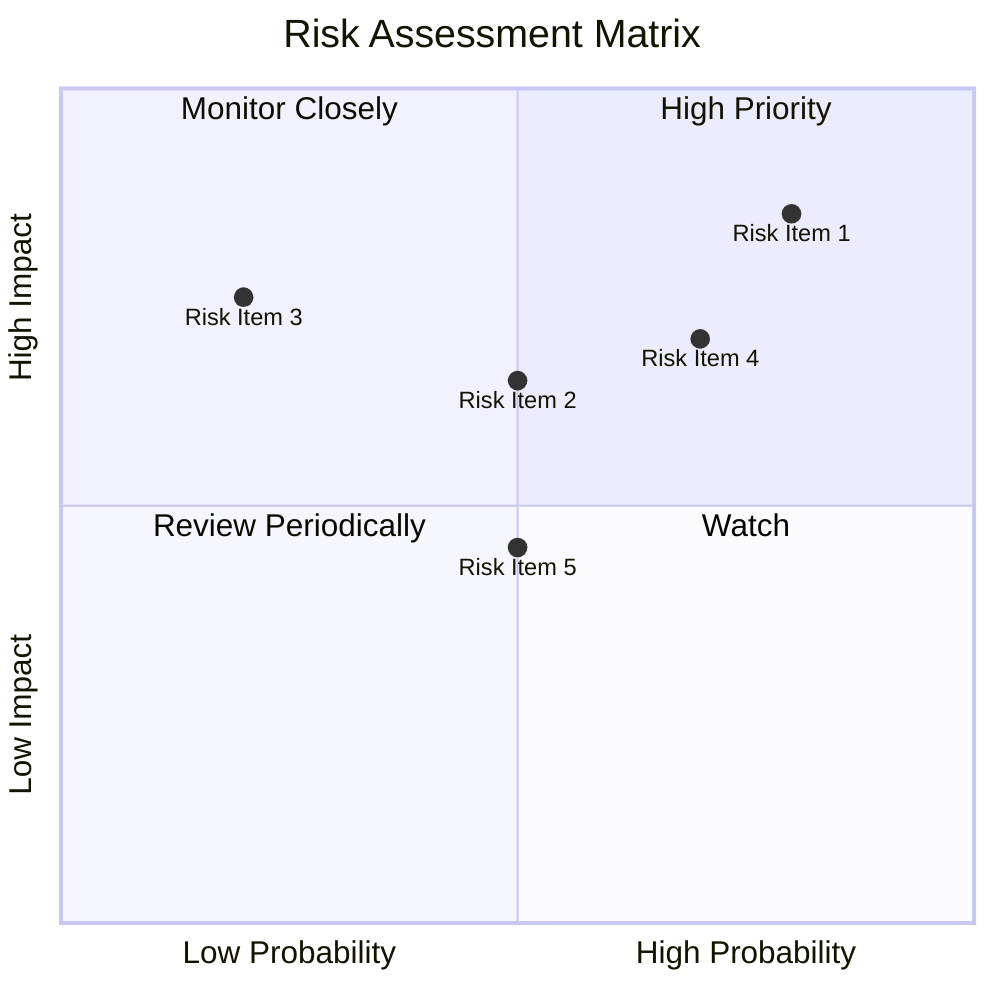

### 9.2 風險清單詳細分析

| # | 風險項目 | 發生機率 | 財務衝擊 | 風險評分 | 緩解措施 |
|---|----------|----------|----------|----------|----------|
| 1 | 🔴 **市場競爭** | 高 (80%) | 高 (-20%收入) | 🔴 8.5/10 | 加大研發投入，拓展產品線 |
| 2 | 🟡 **技術變遷** | 中 (50%) | 中 (-10%收入) | 🟡 6.5/10 | 持續技術創新，提升研發 |
| 3 | 🟡 **經濟環境不確定** | 中 (60%) | 中 (-8%收入) | 🟡 6.8/10 | 多元化市場策略，降低風險 |

---

## 10. 投資建議

### 10.1 最終綜合評級雷達圖

```
╔══════════════════════════════════════════════════════════════════╗
║               AMD 綜合評級雷達圖                                ║
╠══════════════════════════════════════════════════════════════════╣
║                                                                  ║
║  基本面強度：9.0  ▓▓▓▓▓▓▓▓▓▓▓▓▓▓▓▓▓▓▓▓▓▓  ★★★★★                 ║
║  成長性：    8.0  ▓▓▓▓▓▓▓▓▓▓▓▓▓▓▓▓▓▓░░░░  ★★★★☆                 ║
║  獲利能力：  8.5  ▓▓▓▓▓▓▓▓▓▓▓▓▓▓▓▓▓▓▓▓░░  ★★★★★                 ║
║  財務健康：  9.0  ▓▓▓▓▓▓▓▓▓▓▓▓▓▓▓▓▓▓▓▓▓░  ★★★★★                 ║
║  估值合理：  8.0  ▓▓▓▓▓▓▓▓▓▓▓▓▓▓▓▓▓▓░░░░  ★★★★☆                 ║
║                                                                  ║
╚══════════════════════════════════════════════════════════════════╝
```

### 10.2 目標價與隱含報酬率

| 情境 | 目標價 | 隱含報酬率 | 機率權重 |
|------|-------|----------|--------|
| 樂觀 | $455 | +28.4% | 30% |
| 基準 | $300 | -15.4% | 50% |
| 悲觀 | $225 | -36.5% | 20% |

### 10.3 買入時機與觸發因素

```
╔══════════════════════════════════════════════════════════════════╗
║                  ✅ 買入觸發因素 Checklist                      ║
╠══════════════════════════════════════════════════════════════════╣
║                                                                  ║
║  立即買入觸發條件（多數符合）：                                  ║
║  ✅ 收入持續超預期                                               ║
║  ✅ 新產品市場反應良好                                           ║
║  ✅ 財務健康維持强勁                                             ║
║                                                                  ║
║  加碼觸發條件（出現以下任一）：                                  ║
║  ☐ 重大技術突破                                                  ║
║  ☐ 競爭對手表現不佳                                              ║
║                                                                  ║
║  減碼/停損觸發條件（出現以下任一）：                             ║
║  ☐ 市場需求減弱                                                 ║
║  ☐ 財務健康惡化                                                  ║
╚══════════════════════════════════════════════════════════════════╝
```

### 10.4 投資人適配度分析

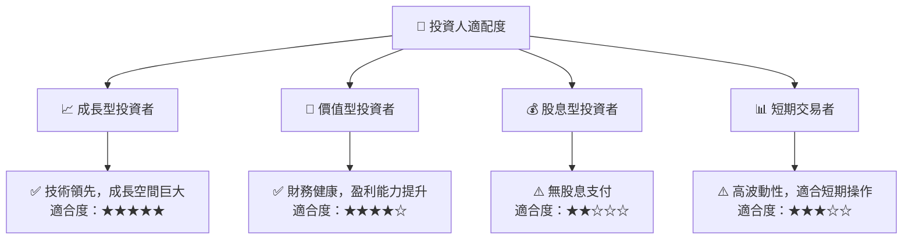

### 10.5 關鍵監控指標

| 監控類型 | 指標 | 關注點 | 頻率 |
|----------|------|--------|------|
| 財務表現 | 收入增長率 | 超過行業平均 | 季度 |
| 市場反應 | 新產品銷售 | 市場接受度 | 每月 |
| 競爭動態 | 競爭對手產品發布 | 可能的市場影響 | 持續 |

---

> **免責聲明**：本報告為 AI 自動生成，僅供研究參考，不構成投資建議。投資有風險，入市需謹慎。