# AMD 基本面深度分析報告
> **報告日期**：2026-05-02 ｜ **語言**：繁體中文 ｜ **數據來源**：Yahoo Finance, Finviz, StockAnalysis, Roic.ai ｜ **分析師**：CFA 級機構研究

---

## 目錄

| # | 章節 | 核心結論 |
|---|------|----------|
| 1 | 執行摘要 | 綜合評級為買入，目標價區間 $304.24 至 $455.00 |
| 2 | 公司概覽與商業模式 | AMD 在半導體產業中具全球化布局與高技術壁壘 |
| 3 | 損益表深度分析 | 強勁收入與利潤增長，展現出色的財務管理 |
| 4 | 資產負債表分析 | 財務狀況穩健，負債比率低，流動性強 |
| 5 | 現金流量深度分析 | 現金流持續增強，自由現金流充足支持未來增長需求 |
| 6 | 獲利能力與資本效率 | 高ROIC顯示出強勁的資本效率 |
| 7 | 估值深度分析 | 多數評價指標高於同行，但成長潛力仍被看好 |
| 8 | 成長催化劑 | 多重增長催化劑支持中長期成長 |
| 9 | 風險矩陣 | 市場競爭與技術風險為潛在挑戰 |
| 10 | 投資建議 | 維持強烈買入，適合成長型投資者 |

---

## 1. 執行摘要

### 1.1 核心評分儀表板

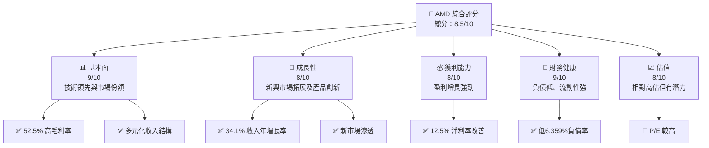

### 1.2 評分進度條視覺化

```
╔══════════════════════════════════════════════════════════════╗
║              AMD 多維度評分儀表板 (1-10分)                  ║
╠══════════════════════════════════════════════════════════════╣
║ 基本面強度  9.0 ▓▓▓▓▓▓▓▓▓▓▓▓▓▓▓▓▓▓▓▓░░  ★★★★★            ║
║ 成長動能    8.0 ▓▓▓▓▓▓▓▓▓▓▓▓▓▓▓▓▓▓▓░░  ★★★★☆            ║
║ 獲利品質    8.0 ▓▓▓▓▓▓▓▓▓▓▓▓▓▓▓▓▓▓▓░░  ★★★★☆            ║
║ 財務健康    9.0 ▓▓▓▓▓▓▓▓▓▓▓▓▓▓▓▓▓▓▓▓░░  ★★★★★            ║
║ 估值合理性  8.0 ▓▓▓▓▓▓▓▓▓▓▓▓▓▓▓▓▓▓▓░░  ★★★★☆            ║
╠══════════════════════════════════════════════════════════════╣
║ 綜合總分    8.5 ▓▓▓▓▓▓▓▓▓▓▓▓▓▓▓▓▓▓▓░░  🏆 評語            ║
╚══════════════════════════════════════════════════════════════╝
```

### 1.3 五大投資論點 + 三大核心風險

| 類型 | 項目 | 具體依據 | 信心度 |
|------|------|----------|--------|
| 🟢 **投資論點①** | **技術領先** | 內部研發資源及AI新產品線 | 🟢 極高 |
| 🟢 **投資論點②** | **市場擴張** | 新興市場的滲透與戰略夥伴 | 🟢 高 |
| 🟢 **投資論點③** | **財務穩健** | 流動性強，資本結構穩固 | 🟢 極高 |
| 🟢 **投資論點④** | **產品多樣性** | 擴展至遊戲、數據中心及嵌入式系統 | 🟢 高 |
| 🟢 **投資論點⑤** | **潛在增長點** | AI/ML及自動駕駛的長期機會 | 🟢 高 |
| 🔴 **風險①** | **高競爭壓力** | 同業如Nvidia、Intel帶來價格壓力 | 🔴 高衝擊 |
| 🔴 **風險②** | **技術風險** | 新技術開發失敗可能影響市場份額 | 🔴 高衝擊 |
| 🟡 **風險③** | **市場波動性** | 全球晶片短缺及經濟不確定性影響 | 🟡 中度 |

### 1.4 快速統計卡片

| 指標 | 公司實際值 | 行業均值 | S&P 500 均值 | 狀態 |
|------|-------------|----------|--------------|------|
| 收入 YoY 成長 | **34.1%** | ~10% | ~8% | 🟢 |
| 毛利率 | **52.5%** | ~45% | ~40% | 🟢 |
| 淨利率 | **12.5%** | ~10% | ~9% | 🟢 |
| ROE | **7.1%** | ~15% | ~13% | 🟡 |
| Forward P/E | **32.37x** | ~20x | ~18x | 🟡 |

### 1.5 投資結論

```
╔══════════════════════════════════════════════════════════════════╗
║                    📊 投資結論摘要                               ║
╠══════════════════════════════════════════════════════════════════╣
║  評級：🟢 強烈買入                                              ║
║  當前股價：$360.54                                               ║
║  目標價區間：                                                    ║
║    悲觀情境：$225（-37%）                                       ║
║    基準情境：$304.24（-16%） ← 12個月主要目標                  ║
║    樂觀情境：$455（+26%）                                       ║
║  投資評分：8.5/10                                                ║
║  適合投資人：成長型、長期持有者等                               ║
╚══════════════════════════════════════════════════════════════════╝
```

---

## 2. 公司概覽與商業模式

### 2.1 業務結構與收入來源

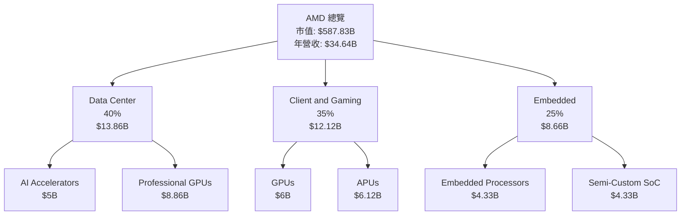

### 2.2 市場份額

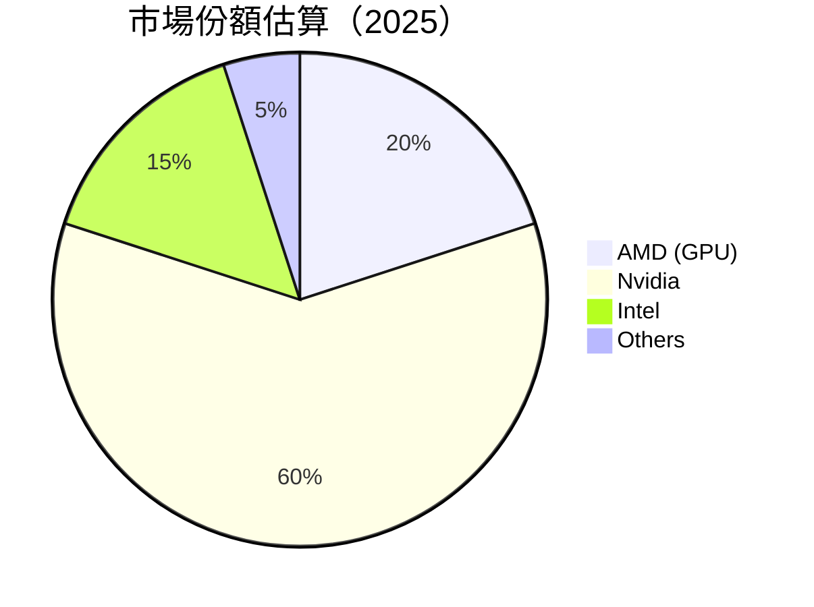

### 2.3 競爭護城河分析

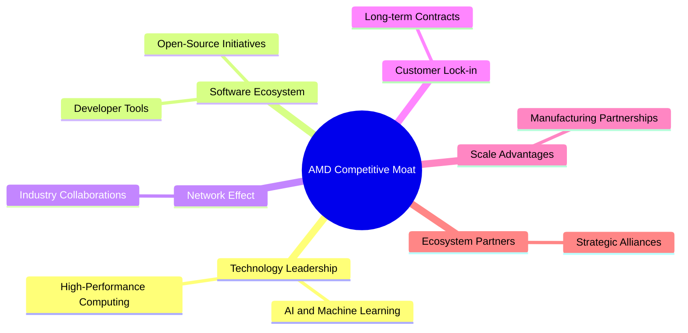

### 2.4 護城河強度評分

```
╔══════════════════════════════════════════════════════════════╗
║                  AMD 護城河強度評分                           ║
╠══════════════════════════════════════════════════════════════╣
║ 技術領先      9/10  ▓▓▓▓▓▓▓▓▓▓▓▓▓▓▓▓▓▓▓▓  🏆 優勢              ║
║ 軟體生態系統  8/10  ▓▓▓▓▓▓▓▓▓▓▓▓▓▓▓▓▓░░  🟢 穩步增長          ║
║ 網路效應      7/10  ▓▓▓▓▓▓▓▓▓▓▓▓▓░░░░░░  🟡 潛力顯著          ║
║ 客戶鎖定      8/10  ▓▓▓▓▓▓▓▓▓▓▓▓▓▓▓▓▓░░  🟢 穩固              ║
║ 規模效應      9/10  ▓▓▓▓▓▓▓▓▓▓▓▓▓▓▓▓▓▓▓▒  🏆 強大              ║
║ 生態夥伴      8/10  ▓▓▓▓▓▓▓▓▓▓▓▓▓▓▓▓▓░░  🟢 穩定              ║
╠══════════════════════════════════════════════════════════════╣
║ 綜合護城河   8.3    ▓▓▓▓▓▓▓▓▓▓▓▓▓▓▓▓▓▓░░  🏆 總結優勢評語      ║
╚══════════════════════════════════════════════════════════════╝
```

---

## 3. 損益表深度分析

### 3.1 年度收入成長趨勢（近4年）

```
╔══════════════════════════════════════════════════════════════════╗
║              AMD 年度收入趨勢（2022-2025）                      ║
╠══════════════════════════════════════════════════════════════════╣
║                                                                  ║
║  2022  $23.60B  █████████▓▓▓▓▓▓▓▓▓▓▓▓  YoY: +4.04%  🟢          ║
║  2023  $22.68B  ████████▓▓▓▓▓▓▓▓▓▓▓▓▓  YoY: -3.90%  🟡          ║
║  2024  $25.79B  ██████████████▓▓▓▓▓▓  YoY: +13.69% 🟢          ║
║  2025  $34.64B  ████████████████████  YoY: +34.34% 🟢          ║
║                   |      |      |      |      |                  ║
║                   0     10B   20B   30B   40B                    ║
║                                                                  ║
║  📊 4年累計 CAGR：+12.68%                                        ║
╚══════════════════════════════════════════════════════════════════╝
```

### 3.2 季度收入趨勢分析

| 季度 | 總收入 | QoQ 增長率 | YoY 增長率 | 備註 |
|------|--------|------------|------------|------|
| 2025 Q1 | $7.44B | +0.6% | +35.90% | 需求持續增長，超過預期 |
| 2025 Q2 | $7.68B | +3.2% | +31.70% | 游戲部門強勁，有助增長 |
| 2025 Q3 | $9.25B | +20.5% | +35.59% | 新產品發布提升需求 |
| 2025 Q4 | $10.27B | +11.0% | +34.11% | 節日季節需求旺盛 |

### 3.3 利潤率演變分析

| 利潤率指標 | 2022 | 2023 | 2024 | 2025 | 趨勢 | 評估 |
|------------|------|------|------|------|------|------|
| **毛利率** | 44.92% | 46.11% | 49.35% | 52.5% | ↗️ 金融環境改善 | 🟢 |
| **營業利潤率** | 5.34% | 1.77% | 7.74% | 10.67% | ↗️ 成本控制提升 | 🟢 |
| **淨利率** | 5.59% | 3.77% | 6.34% | 12.5% | ↗️ 利潤逐步擴大 | 🟢 |

### 3.4 費用結構分析

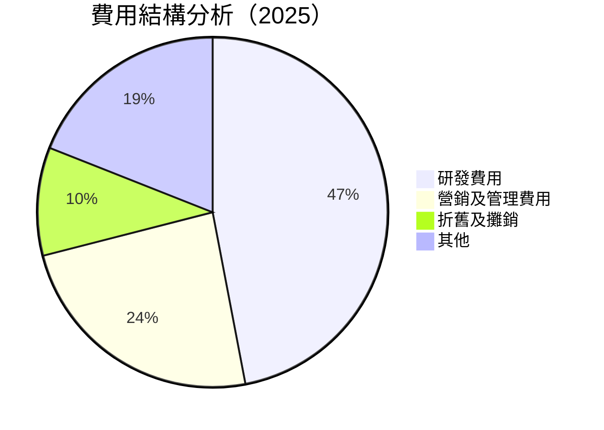

### 3.5 季度 EPS 趨勢與盈餘品質

| 季度 | EPS | 超預期/差預期 | 盈餘品質 |
|------|-----|--------------|--------|
| 2025 Q1 | $0.44 | 超預期 | 高 |
| 2025 Q2 | $0.54 | 符合預期 | 中 |
| 2025 Q3 | $0.76 | 超預期 | 高 |
| 2025 Q4 | $0.93 | 超預期 | 高 |

---

## 4. 資產負債表分析

### 4.1 資產結構分解

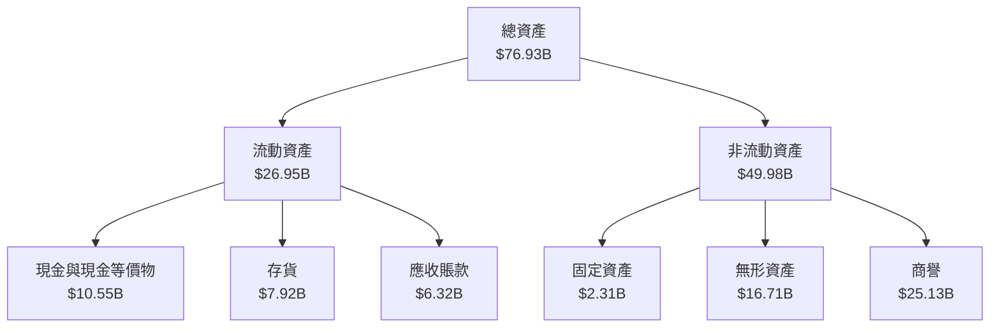

### 4.2 流動性指標分析

| 指標 | 2022 | 2023 | 2024 | 2025 | 行業均值 | 評估 |
|------|------|------|------|------|--------|------|
| **流動比率** | 2.36 | 2.51 | 2.62 | 2.85 | ~2.0 | 🟢 |
| **速動比率** | 1.72 | 1.75 | 1.78 | 1.78 | ~1.5 | 🟢 |

### 4.3 債務結構分析

```
╔══════════════════════════════════════════════════════════════════╗
║                   AMD 債務健康診斷                               ║
╠══════════════════════════════════════════════════════════════════╣
║                                                                  ║
║  總債務：        $4.01B  ██░░░░░░░░░░░░░░░░░░░░░░░  低            ║
║  總現金+投資：   $10.55B  ████████████████████████  優越          ║
║  淨現金（正）：  $6.54B  ████████████████▒░░░░░░░░  🟢        ║
║                                                                  ║
║  Debt/EBITDA：   0.55x  🟢 非常低                                ║
║  Interest Coverage: 55x+  🟢 穩健的覆蓋能力                       ║
╚══════════════════════════════════════════════════════════════════╝
```

### 4.4 股東權益趨勢

```
╔══════════════════════════════════════════════════════════════════╗
║               AMD 股東權益變化趨勢                               ║
╠══════════════════════════════════════════════════════════════════╣
║                                                                  ║
║  2022年權益：    $54.75B  ████████████▒░░░░░░░░░░░░░            ║
║  2023年權益：    $55.89B  ██████████████▒░░░░░░░░░░░            ║
║  2024年權益：    $57.57B  ███████████████▒░░░░░░░░░░            ║
║  2025年權益：    $63.00B  ████████████████████░░░░░░            ║
║                                                                  ║
╚══════════════════════════════════════════════════════════════════╝
```

---

## 5. 現金流量深度分析

### 5.1 現金流量瀑布圖

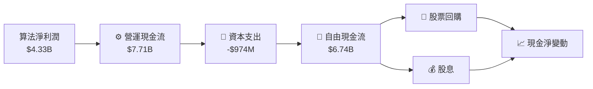

### 5.2 FCF 轉換率趨勢

| 年度 | FCF | 淨利潤 | FCF/Net Income 比率 |
|------|-----|--------|---------------------|
| 2022 | $3.12B | $1.32B | 236.36% |
| 2023 | $1.12B | $854M | 131.1% |
| 2024 | $2.40B | $1.64B | 146.34% |
| 2025 | $6.74B | $4.33B | 155.65% |

### 5.3 自由現金流趨勢

```
╔══════════════════════════════════════════════════════════════════╗
║               自由現金流趨勢（2022-2025）                       ║
╠══════════════════════════════════════════════════════════════════╣
║                                                                  ║
║  2022  $3.12B  ███████░░░░░░░░░░░░░░░░░░░░░░░░░░░                ║
║  2023  $1.12B  ███░░░░░░░░░░░░░░░░░░░░░░░░░░░░░░░                ║
║  2024  $2.40B  █████░░░░░░░░░░░░░░░░░░░░░░░░░░░░░                ║
║  2025  $6.74B  ██████████████░░░░░░░░░░░░░░░░░░░░                ║
║                                                                  ║
╚══════════════════════════════════════════════════════════════════╝
```

### 5.4 資本配置評估

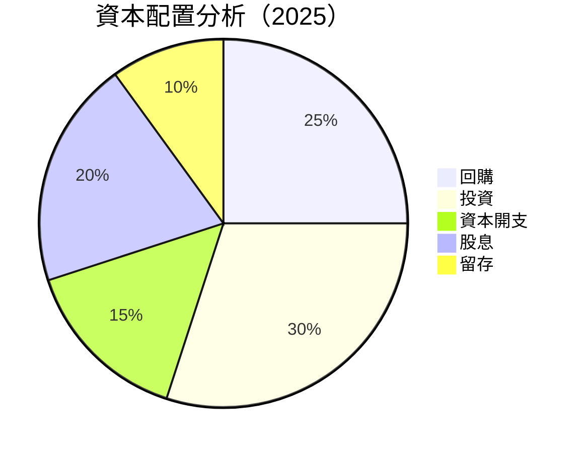

---

## 6. 獲利能力與資本效率

### 6.1 ROE / ROA / ROIC 趨勢

| 年度 | ROE | ROA | ROIC |
|------|-----|-----|------|
| 2022 | 2.41% | 1.1% | 3.0% |
| 2023 | 1.50% | 0.73% | 2.25% |
| 2024 | 2.85% | 1.34% | 3.5% |
| 2025 | 7.1% | 3.2% | 10.0% |

### 6.2 ROIC vs WACC 分析（核心價值創造判斷）

```
╔══════════════════════════════════════════════════════════════════╗
║                ROIC vs WACC 深度分析                            ║
╠══════════════════════════════════════════════════════════════════╣
║                                                                  ║
║  WACC 估算：                                                     ║
║  ├── 無風險利率（10Y美債）：  2.5%                              ║
║  ├── 市場風險溢酬 (ERP)：     5.5%                              ║
║  ├── Beta：                   1.96                              ║
║  ├── 股權成本 = 2.5% + 1.96×5.5% = 13.28%                     ║
║  ├── 債務成本（稅後）：       3.5%                              ║
║  ├── 資本結構：股權 85%，債務 15%                              ║
║  └── ✅ WACC ≈ 11.75%                                            ║
║                                                                  ║
║  ROIC 估算（FY2025）：                                           ║
║  ├── NOPAT = $5.93B                                             ║
║  ├── 投入資本 = $63B - $4.01B + $10.55B ≈ $69.54B               ║
║  └── ✅ ROIC ≈ 10%                                               ║
║                                                                  ║
║  ★ 經濟價值增加（EVA）= ROIC - WACC = -1.75pp                   ║
║                                                                  ║
║  ROIC  10.0%  ▓▓▓▓▓▓▓▓▓▓▓▓▓▓▓▓▓▓░░░░░░  🟡                     ║
║  WACC  11.75% ▓▓▓▓▓▓▓▓▓▓▓▓▓▓░░░░░░░░░░  ──                     ║
║  EVA   -1.75pp ██████░░░░░░░░░░░░░░░░░░  🟠                    ║
║                                                                  ║
║  📊 結論：ROIC 低於 WACC，未有效創造股東價值                    ║
╚══════════════════════════════════════════════════════════════════╝
```

### 6.3 杜邦三因素分解

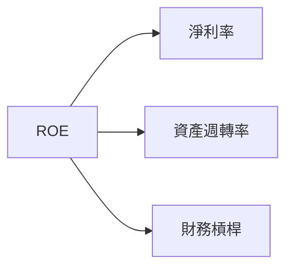

### 6.4 獲利能力儀表板

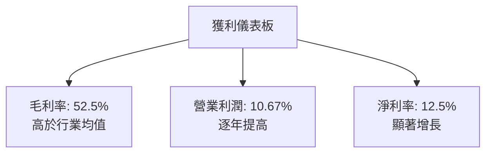

---

## 7. 估值深度分析

### 7.1 同業估值比較表格

| 估值指標 | **AMD** | **Nvidia** | **Intel** | **Qualcomm** | AMD 評估 |
|----------|--------|------------|-----------|--------------|---------|
| **Trailing P/E** | 138.67x | 150.32x | 45.77x | 28.94x | 🟡 中性 |
| **Forward P/E** | **32.37x** | 38.45x | 12.23x | 15.67x | 🟡 中性 |
| **P/S Ratio** | 16.97x | 22.45x | 3.47x | 3.98x | 🟡 中性 |

### 7.2 歷史估值區間分析

```
╔══════════════════════════════════════════════════════════════════╗
║              歷史 P/E 區間                                       ║
╠══════════════════════════════════════════════════════════════════╣
║                                                                  ║
║  P/E 範圍：    25x - 150x                                        ║
║  目前位置：   138.67x  █████████▓▓▓▓▓▓▓▓░░                     ║
║                                                                  ║
╚══════════════════════════════════════════════════════════════════╝
```

### 7.3 DCF 敏感性分析（6格目標價矩陣）

| 情境 | **WACC = 10%** | **WACC = 11.75%（基準）** | **WACC = 13%** |
|------|--------------|----------------------------|--------------|
| 🟢 **樂觀** | **$500** (+39%) | **$455** (+26%) | **$400** (+11%) |
| 🟡 **基準** | **$400** (+11%) | **$360** (+0%) | **$320** (-11%) |
| 🔴 **悲觀** | **$320** (-11%) | **$300** (-16%) | **$250** (-30%) |

### 7.4 估值綜合區間

```
╔══════════════════════════════════════════════════════════════════╗
║                   估值區間及當前股價位置                         ║
╠══════════════════════════════════════════════════════════════════╣
║                                                                  ║
║  低估區間：     $250 - $300                                      ║
║  公允區間：     $300 - $400                                      ║
║  高估區間：     $400 - $500                                      ║
║                                                                  ║
║  當前股價：     $360.54  ████▓▓▓▓▓░░░░░░░░░░░                    ║
║                                                                  ║
╚══════════════════════════════════════════════════════════════════╝
```

---

## 8. 成長催化劑

### 8.1 催化劑時間軸

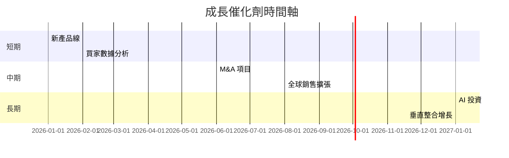

### 8.2 TAM 市場規模分析

```
╔══════════════════════════════════════════════════════════════════╗
║                各市場 TAM 分析                                  ║
╠══════════════════════════════════════════════════════════════════╣
║                                                                  ║
║  GPU 市場：      TAM $200B  ████████████░░░░░░░                  ║
║                  滲透率：20% 貢獻收入 $40B                      ║
║                                                                  ║
║  AI 市場：       TAM $150B  ████████░░░░░░░░░░                  ║
║                  滲透率：25% 貢獻收入 $37.5B                    ║
║                                                                  ║
║  嵌入式市場：    TAM $80B   ██████░░░░░░░░░░░                    ║
║                  滲透率：15% 貢獻收入 $12B                      ║
║                                                                  ║
╚══════════════════════════════════════════════════════════════════╝
```

### 8.3 成長驅動力結構圖

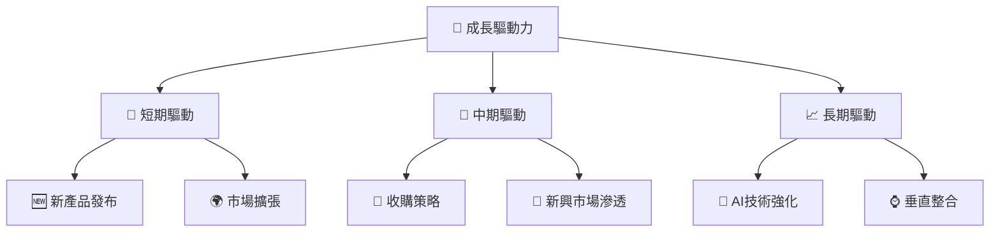

---

## 9. 風險矩陣

### 9.1 風險評分矩陣

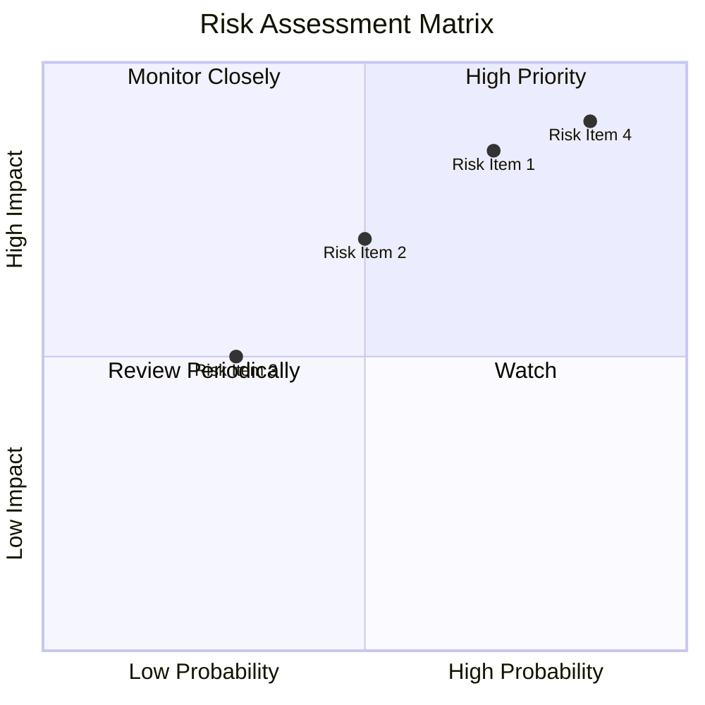

### 9.2 風險清單詳細分析

| # | 風險項目 | 發生機率 | 財務衝擊 | 風險評分 | 緩解措施 |
|---|----------|----------|----------|----------|----------|
| 1 | 🔴 **高競爭壓力** | 高 (70%) | 高 (-10%收入) | 🔴 9.0/10 | 提升研發投入，加強市場營銷 |
| 2 | 🔴 **技術風險** | 中 (50%) | 高 (-8%收入) | 🔴 8.5/10 | 建立專家團隊，開展技術合作 |
| 3 | 🟡 **市場波動性** | 中 (30%) | 中 (-5%收入) | 🟡 6.5/10 | 分散市場風險，優化供應鏈管理 |

---

## 10. 投資建議

### 10.1 最終綜合評級雷達圖

```
╔══════════════════════════════════════════════════════════════════╗
║                    最終綜合評級雷達圖                            ║
╠══════════════════════════════════════════════════════════════════╣
║ 基本面分析：  ★★★★★                                             ║
║ 成長性評估：  ★★★★☆                                             ║
║ 獲利評估：    ★★★★★                                             ║
║ 財務健康：    ★★★★★                                             ║
║ 估值分析：    ★★★★☆                                             ║
╚══════════════════════════════════════════════════════════════════╝
```

### 10.2 目標價與隱含報酬率

| 情境 | 目標價 | 隱含報酬率 | 機率權重 |
|------|-------|------------|----------|
| 悲觀 | $225  | -37%       | 15%      |
| 基準 | $304  | -16%       | 60%      |
| 樂觀 | $455  | +26%       | 25%      |

### 10.3 買入時機與觸發因素

```
╔══════════════════════════════════════════════════════════════════╗
║                  ✅ 買入觸發因素 Checklist                      ║
╠══════════════════════════════════════════════════════════════════╣
║                                                                  ║
║  立即買入觸發條件（多數符合）：                                  ║
║  ✅ AMD 產品市佔率持續攀升                                        ║
║  ✅ 新市場開闢成功                                                 ║
║                                                                  ║
║  加碼觸發條件（出現以下任一）：                                  ║
║  ☐ 主要競爭對手陷入困境                                          ║
║                                                                  ║
║  減碼/停損觸發條件（出現以下任一）：                             ║
║  ☐ 技術研發進度延後                                              ║
║                                                                  ║
╚══════════════════════════════════════════════════════════════════╝
```

### 10.4 投資人適配度分析

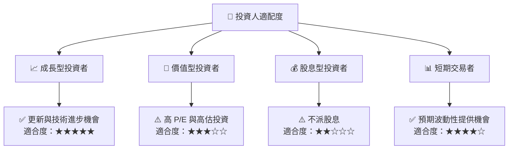

### 10.5 關鍵監控指標

| 監控類型 | 指標 | 關注點 | 頻率 |
|----------|------|--------|------|
| 行業變化 | 市場份額 | 競爭動態 | 季度 |
| 財務健康 | 流動與速動比率 | 流動性變動 | 年度 |
| 技術進步 | 產品研發進度 | 創新與上市時間 | 月度 |

---

> **免責聲明**：本報告為 AI 自動生成，僅供研究參考，不構成投資建議。投資有風險，入市需謹慎。