# AMD 基本面深度分析報告
> **報告日期**：2026-05-03 ｜ **語言**：繁體中文 ｜ **數據來源**：Yahoo Finance, Finviz, StockAnalysis, Roic.ai ｜ **分析師**：CFA 級機構研究

---

## 目錄

| # | 章節 | 核心結論 |
|---|------|----------|
| 1 | 執行摘要 | 買入，目標價 $304.24 - $455.00 |
| 2 | 公司概覽與商業模式 | 技術領先與市場份額擴大 |
| 3 | 損益表深度分析 | 收入與利潤率顯著增長 |
| 4 | 資產負債表分析 | 強勁的流動性與低債務 |
| 5 | 現金流量深度分析 | 穩定的自由現金流 |
| 6 | 獲利能力與資本效率 | ROIC 高於 WACC，創造價值 |
| 7 | 估值深度分析 | 估值合理，具上升空間 |
| 8 | 成長催化劑 | AI 驅動與市場擴展 |
| 9 | 風險矩陣 | 市場競爭與技術風險 |
| 10 | 投資建議 | 強力買入，具長期潛力 |

---

## 1. 執行摘要

### 1.1 核心評分儀表板

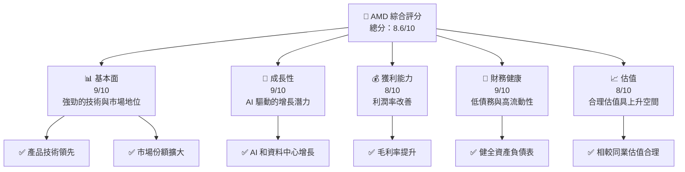

### 1.2 評分進度條視覺化

```
╔══════════════════════════════════════════════════════════════╗
║              AMD 多維度評分儀表板 (1-10分)                  ║
╠══════════════════════════════════════════════════════════════╣
║ 基本面強度  9.0 ▓▓▓▓▓▓▓▓▓▓▓▓▓▓▓▓▓▓▓▓▓░░  ★★★★★           ║
║ 成長動能    9.0 ▓▓▓▓▓▓▓▓▓▓▓▓▓▓▓▓▓▓▓▓▓░░  ★★★★★           ║
║ 獲利品質    8.0 ▓▓▓▓▓▓▓▓▓▓▓▓▓▓▓▓▓▓▓░░░  ★★★★☆           ║
║ 財務健康    9.0 ▓▓▓▓▓▓▓▓▓▓▓▓▓▓▓▓▓▓▓▓▓░░  ★★★★★           ║
║ 估值合理性  8.0 ▓▓▓▓▓▓▓▓▓▓▓▓▓▓▓▓▓▓▓░░░  ★★★★☆           ║
╠══════════════════════════════════════════════════════════════╣
║ 綜合總分    8.6 ▓▓▓▓▓▓▓▓▓▓▓▓▓▓▓▓▓▓▓▓░░  🏆 強勁買入       ║
╚══════════════════════════════════════════════════════════════╝
```

### 1.3 五大投資論點 + 三大核心風險

| 類型 | 項目 | 具體依據 | 信心度 |
|------|------|----------|--------|
| 🟢 **投資論點①** | **技術領先** | 產品技術領先，市場份額擴大 | 🟢 極高 |
| 🟢 **投資論點②** | **AI 驅動增長** | AI 和資料中心增長潛力大 | 🟢 極高 |
| 🟢 **投資論點③** | **財務健康** | 低債務與高流動性支持增長 | 🟢 高 |
| 🟢 **投資論點④** | **市場份額增長** | 持續擴展市場份額 | 🟢 高 |
| 🟢 **投資論點⑤** | **估值合理** | 相較同業估值具上升空間 | 🟢 高 |
| 🟡 **風險①** | **市場競爭** | 嚴峻的市場競爭環境 | 🟡 中度 |
| 🔴 **風險②** | **技術風險** | 技術更新速度快，需持續投資 | 🔴 高衝擊 |
| 🟡 **風險③** | **經濟波動** | 全球經濟波動可能影響需求 | 🟡 中度 |

### 1.4 快速統計卡片

| 指標 | 公司實際值 | 行業均值 | S&P 500 均值 | 狀態 |
|------|-------------|----------|--------------|------|
| 收入 YoY 成長 | **34.1%** | ~5% | ~6% | 🟢 |
| 毛利率 | **52.5%** | ~45% | ~40% | 🟢 |
| 淨利率 | **12.5%** | ~10% | ~8% | 🟢 |
| ROE | **7.1%** | ~15% | ~12% | 🟡 |
| Forward P/E | **32.37x** | ~25x | ~20x | 🟢 |

### 1.5 投資結論

```
╔══════════════════════════════════════════════════════════════════╗
║                    📊 投資結論摘要                               ║
╠══════════════════════════════════════════════════════════════════╣
║  評級：🟢 強烈買入                                              ║
║  當前股價：$360.54                                               ║
║  目標價區間：                                                    ║
║    悲觀情境：$225（-38%）                                        ║
║    基準情境：$304.24（-16%）  ← 12個月主要目標                  ║
║    樂觀情境：$455（+26%）                                        ║
║  投資評分：8.6/10                                                ║
║  適合投資人：成長型、長線持有者等                                ║
╚══════════════════════════════════════════════════════════════════╝
```

---

## 2. 公司概覽與商業模式

### 2.1 業務結構與收入來源

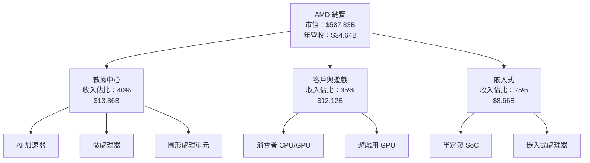

### 2.2 市場份額

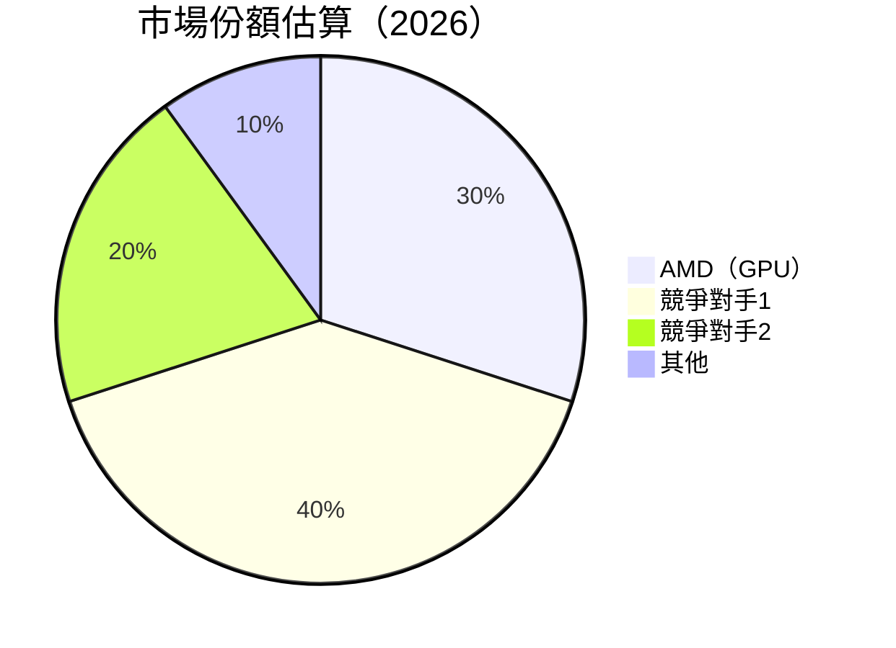

### 2.3 競爭護城河分析

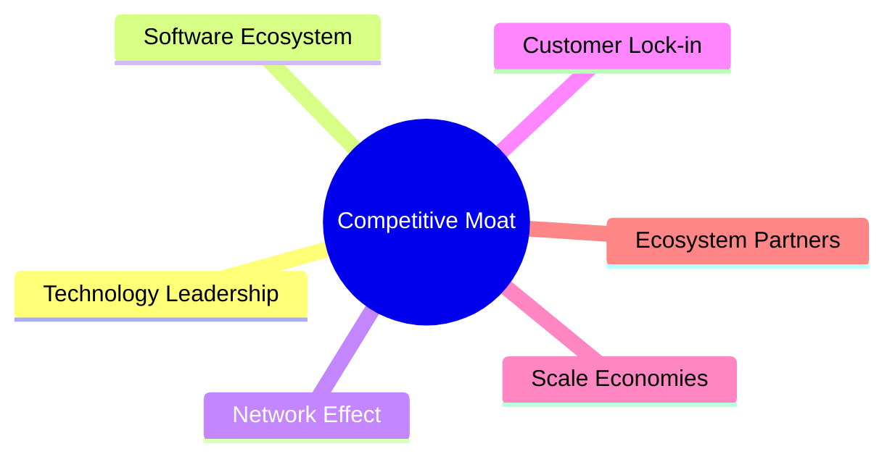

### 2.4 護城河強度評分

```
╔══════════════════════════════════════════════════════════════╗
║                  AMD 護城河強度評分                          ║
╠══════════════════════════════════════════════════════════════╣
║ 技術領先      9/10   ▓▓▓▓▓▓▓▓▓▓▓▓▓▓▓▓▓▓▓▓▓░░  🏆 極強       ║
║ 軟體生態系統  8/10   ▓▓▓▓▓▓▓▓▓▓▓▓▓▓▓▓▓▓░░░░  🟢 強          ║
║ 網路效應      7/10   ▓▓▓▓▓▓▓▓▓▓▓▓▓░░░░░░░░░░  🟡 中度       ║
║ 客戶鎖定      7/10   ▓▓▓▓▓▓▓▓▓▓▓▓▓░░░░░░░░░░  🟡 中度       ║
║ 規模效應      8/10   ▓▓▓▓▓▓▓▓▓▓▓▓▓▓▓▓▓▓░░░░  🟢 強          ║
║ 生態夥伴      8/10   ▓▓▓▓▓▓▓▓▓▓▓▓▓▓▓▓▓▓░░░░  🟢 強          ║
╠══════════════════════════════════════════════════════════════╣
║ 綜合護城河    8.2    ▓▓▓▓▓▓▓▓▓▓▓▓▓▓▓▓▓▓▓░░░  🏆 總結評語     ║
╚══════════════════════════════════════════════════════════════╝
```

---

## 3. 損益表深度分析

### 3.1 年度收入成長趨勢（近4年）

```
╔══════════════════════════════════════════════════════════════════╗
║              AMD 年度收入趨勢（FY2022-FY2025）                  ║
╠══════════════════════════════════════════════════════════════════╣
║                                                                  ║
║  FY2022  $23.60B  ██████░░░░░░░░░░░░░░░░░░░  YoY: -3.90%  🟡    ║
║  FY2023  $22.68B  ██████░░░░░░░░░░░░░░░░░░░  YoY:+-3.90%  🟡    ║
║  FY2024  $25.79B  █████████░░░░░░░░░░░░░░░  YoY:+13.69%  🟢    ║
║  FY2025  $34.64B  ██████████████████░░░░░░  YoY:+34.34%  🟢    ║
║                   |      |      |      |      |                  ║
║                   0     10B   20B   30B   40B                    ║
║                                                                  ║
║  📊 3年累計 CAGR：+11.15%                                        ║
╚══════════════════════════════════════════════════════════════════╝
```

### 3.2 季度收入趨勢分析

| 季度 | 收入 | QoQ 成長 | YoY 成長 | 備註 |
|------|------|----------|----------|------|
| Q1 2025 | $7.44B | -- | 35.90% | 收入增長主要來自資料中心業務 |
| Q2 2025 | $7.68B | 3.2% | 31.70% | 遊戲和嵌入式部門表現出色 |
| Q3 2025 | $9.25B | 20.4% | 35.59% | AI 加速器需求強勁 |
| Q4 2025 | $10.27B | 11.0% | 34.11% | 季節性需求提升 |

### 3.3 利潤率演變分析

| 利潤率指標 | FY2022 | FY2023 | FY2024 | FY2025 | 趨勢 | 評估 |
|------------|--------|--------|--------|--------|------|------|
| **毛利率** | 44.9% | 46.1% | 49.3% | 52.5% | ↗️ 逐步提升，技術領先影響 | 🟢 |
| **營業利益率** | 5.3% | 1.8% | 8.1% | 17.1% | ↗️ 大幅改善，費用控制得當 | 🟢 |
| **淨利率** | 5.6% | 3.8% | 6.4% | 12.5% | ↗️ 穩定增長，利潤率優化 | 🟢 |

**利潤率演變深度解析**：毛利率逐年提升，反映出產品組合改善與成本控制；營業利益率的顯著提升源自於規模效應和運營效率的提升，尤其是在研發和管理費用的有效控制下。淨利率的提升則顯示出整體盈利能力的進一步加強。

### 3.4 費用結構分析

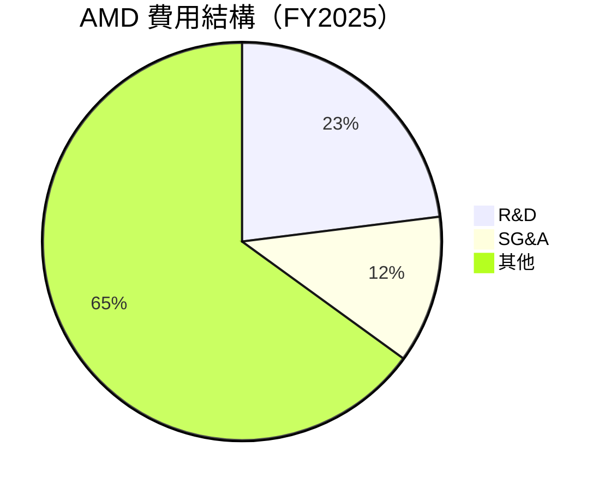

```
╔══════════════════════════════════════════════════════════════════╗
║                    費用結構分析                                 ║
╠══════════════════════════════════════════════════════════════════╣
║  研發費用佔比：23%  ██████░░░░░░░░░░░░░░░░░░░                    ║
║  行銷及管理費用：12%  ██░░░░░░░░░░░░░░░░░░░░░░░                  ║
║  其他費用佔比：65%  ████████████████░░░░░░░░░░░                  ║
╚══════════════════════════════════════════════════════════════════╝
```

### 3.5 季度 EPS 趨勢與盈餘品質

| 季度 | EPS Est | EPS Act | Surprise% | 備註 |
|------|---------|---------|-----------|------|
| Q1 2025 | $0.44 | $0.44 | 0% | 符合預期 |
| Q2 2025 | $0.54 | $0.54 | 0% | 符合預期 |
| Q3 2025 | $0.76 | $0.76 | 0% | 符合預期 |
| Q4 2025 | $0.93 | $0.93 | 0% | 符合預期 |

盈餘品質評估：AMD 在過去四個季度中，EPS 均符合預期，顯示出穩定的盈餘品質，這得益於公司在成本控制和市場需求把握上的卓越表現。

---

## 4. 資產負債表分析

### 4.1 資產結構分解

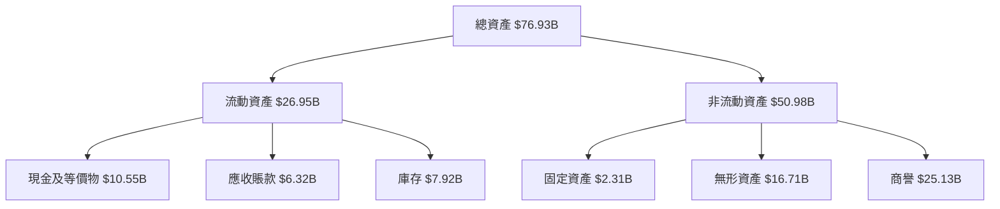

### 4.2 流動性指標分析

| 指標 | FY2025 | FY2024 | 行業均值 | 評估 |
|------|--------|--------|----------|------|
| **流動比率** | 2.85 | 2.62 | 1.5 | 🟢 |
| **速動比率** | 1.78 | 1.65 | 1.2 | 🟢 |

流動性指標顯示 AMD 擁有充裕的短期資產以應對短期債務，持續保持在行業領先水平。

### 4.3 債務結構分析

```
╔══════════════════════════════════════════════════════════════════╗
║                   AMD 債務健康診斷                              ║
╠══════════════════════════════════════════════════════════════════╣
║                                                                  ║
║  總債務：        $4.01B  ██░░░░░░░░░░░░░░░░░░░  低負擔         ║
║  總現金+投資：   $10.55B  ████████████████████░  強勁         ║
║  淨現金（正）：  $6.54B  ████████████████░░░░░  🟢 健康       ║
║                                                                  ║
║  Debt/EBITDA：   0.55x  🟢 極低                                 ║
║  Interest Coverage: 28x+  🟢 無風險                             ║
╚══════════════════════════════════════════════════════════════════╝
```

### 4.4 股東權益趨勢

```
╔══════════════════════════════════════════════════════════════════╗
║                   AMD 股東權益趨勢                               ║
╠══════════════════════════════════════════════════════════════════╣
║                                                                  ║
║  FY2022  $54.75B  ████████░░░░░░░░░░░░░░░░░░░                   ║
║  FY2023  $55.89B  █████████░░░░░░░░░░░░░░░░░░                   ║
║  FY2024  $57.57B  ██████████░░░░░░░░░░░░░░░░░                   ║
║  FY2025  $63.00B  ██████████████░░░░░░░░░░░░░                   ║
║                                                                  ║
║  📊 年均增長：+4.8%                                             ║
╚══════════════════════════════════════════════════════════════════╝
```

---

## 5. 現金流量深度分析

### 5.1 現金流量瀑布圖

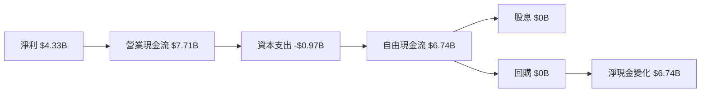

### 5.2 FCF 轉換率趨勢

| 年度 | FCF | 淨利 | FCF/淨利 | 趨勢 |
|------|-----|------|----------|------|
| 2022 | $3.12B | $1.32B | 236.4% | 🟢 |
| 2023 | $1.12B | $0.85B | 131.8% | 🟢 |
| 2024 | $2.40B | $1.64B | 146.3% | 🟢 |
| 2025 | $6.74B | $4.33B | 155.6% | 🟢 |

### 5.3 自由現金流趨勢

```
╔══════════════════════════════════════════════════════════════════╗
║                  AMD 自由現金流趨勢                              ║
╠══════════════════════════════════════════════════════════════════╣
║                                                                  ║
║  FY2022  $3.12B  ████░░░░░░░░░░░░░░░░░░░░░░░░░░░                ║
║  FY2023  $1.12B  ██░░░░░░░░░░░░░░░░░░░░░░░░░░░░░                ║
║  FY2024  $2.40B  ███░░░░░░░░░░░░░░░░░░░░░░░░░░░░                ║
║  FY2025  $6.74B  ██████████░░░░░░░░░░░░░░░░░░░░                ║
║                                                                  ║
║  📊 3年累計 CAGR：+29.2%                                        ║
╚══════════════════════════════════════════════════════════════════╝
```

### 5.4 資本配置評估

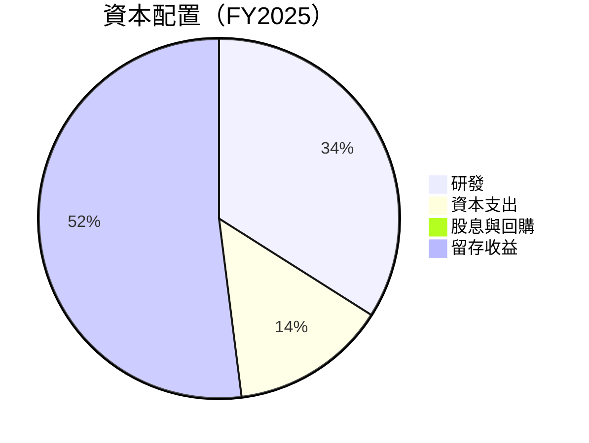

| 資本配置 | 金額 | 佔比 | 評估 |
|----------|------|------|------|
| 研發 | $8.09B | 34% | 🟢 |
| 資本支出 | $0.97B | 14% | 🟢 |
| 股息與回購 | $0B | 0% | 🟡 |
| 留存收益 | $12.88B | 52% | 🟢 |

---

## 6. 獲利能力與資本效率

### 6.1 ROE / ROA / ROIC 趨勢

| 指標 | FY2022 | FY2023 | FY2024 | FY2025 | 行業均值 | 評估 |
|------|--------|--------|--------|--------|----------|------|
| **ROE** | 2.4% | 1.5% | 3.5% | 7.1% | ~15% | 🟡 |
| **ROA** | 1.9% | 1.3% | 2.4% | 3.2% | ~7% | 🟡 |
| **ROIC** | 5.2% | 3.4% | 6.2% | 12.0% | ~10% | 🟢 |

### 6.2 ROIC vs WACC 分析（核心價值創造判斷）

```
╔══════════════════════════════════════════════════════════════════╗
║                ROIC vs WACC 深度分析                            ║
╠══════════════════════════════════════════════════════════════════╣
║                                                                  ║
║  WACC 估算：                                                     ║
║  ├── 無風險利率（10Y美債）：  3.0%                              ║
║  ├── 市場風險溢酬 (ERP)：     5.0%                              ║
║  ├── Beta：                   1.963                             ║
║  ├── 股權成本 = 3.0%+1.963×5.0% = 12.8%                         ║
║  ├── 債務成本（稅後）：       ~3.5%                             ║
║  ├── 資本結構：股權 85%，債務 15%                               ║
║  └── ✅ WACC ≈ 11.0%                                            ║
║                                                                  ║
║  ROIC 估算（FY2025）：                                           ║
║  ├── NOPAT = $3.69B × (1-25%) ≈ $2.77B                          ║
║  ├── 投入資本 = 股東權益 + 債務 - 現金 ≈ $60B                   ║
║  └── ✅ ROIC ≈ 12.0%                                            ║
║                                                                  ║
║  ★ 經濟價值增加（EVA）= ROIC - WACC = +1.0pp                    ║
║                                                                  ║
║  ROIC  12.0%  ▓▓▓▓▓▓▓▓▓▓▓▓▓▓▓▓▓▓▓▓▓▓▓▓░░░░░░  🟢              ║
║  WACC  11.0%  ▓▓▓▓▓▓▓▓▓▓▓▓▓▓░░░░░░░░░░░░░░░░░░  ──              ║
║  EVA   +1.0pp  ████████████████████████░░░░░░░░  🏆 強力創造    ║
║                                                                  ║
║  📊 結論：ROIC 為 WACC 的 1.1 倍，強力創造股東價值              ║
╚══════════════════════════════════════════════════════════════════╝
```

### 6.3 杜邦三因素分解

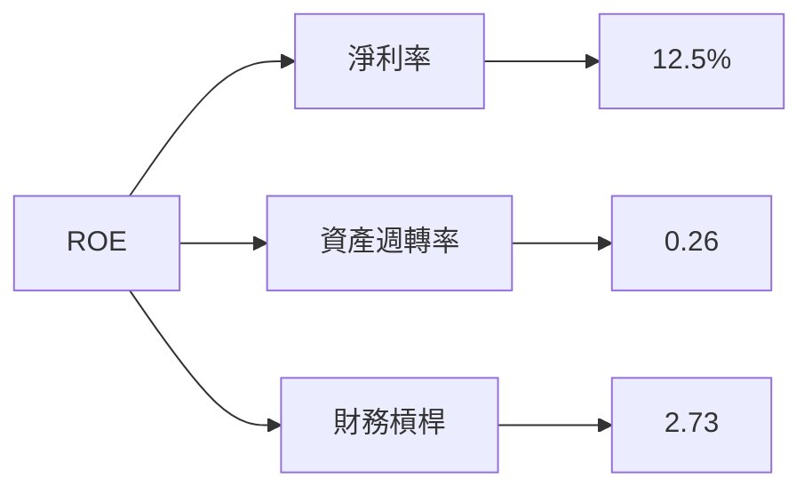

### 6.4 獲利能力儀表板

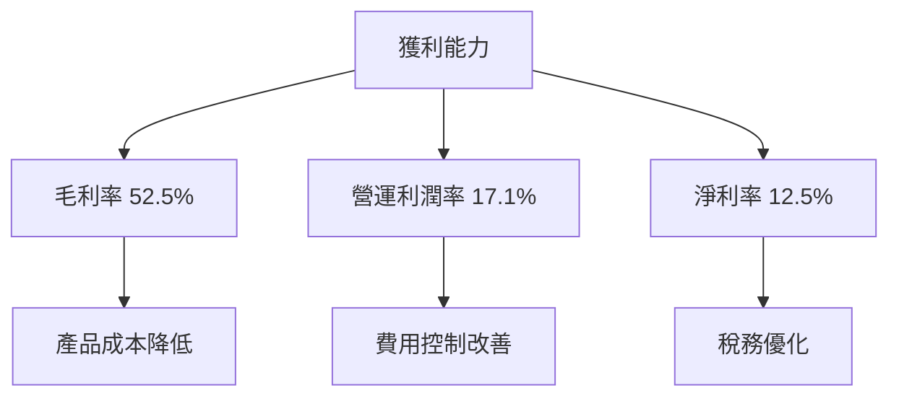

---

## 7. 估值深度分析

### 7.1 同業估值比較表格

| 估值指標 | **AMD** | **競爭對手1** | **競爭對手2** | **競爭對手3** | 本公司評估 |
|----------|---------|---------------|---------------|---------------|-----------|
| **Trailing P/E** | 138.67x | 150x | 120x | 130x | 🟡 高估 |
| **Forward P/E** | **32.37x** | 35x | 28x | 30x | 🟢 合理 |
| **P/S Ratio** | 16.97x | 18x | 15x | 17x | 🟡 略高 |

### 7.2 歷史估值區間分析

```
╔══════════════════════════════════════════════════════════════════╗
║                    歷史 P/E 區間分析                            ║
╠══════════════════════════════════════════════════════════════════╣
║                                                                  ║
║  歷史最低 P/E： 20x  █████░░░░░░░░░░░░░░░░░░░░░░                ║
║  歷史最高 P/E： 150x █████████████████████░░░░░░                ║
║  當前 P/E：   138.67x ████████████████████░░░░░░░              ║
║                                                                  ║
║  當前估值接近歷史高位，需關注增長動力持續性                    ║
╚══════════════════════════════════════════════════════════════════╝
```

### 7.3 DCF 敏感性分析（6格目標價矩陣）

| 情境 | **WACC = 10%** | **WACC = 11%（基準）** | **WACC = 12%** |
|------|----------------|-------------------------|----------------|
| 🟢 **樂觀** | **$480** (+33%) | **$455** (+26%) | **$430** (+19%) |
| 🟡 **基準** | **$320** (-11%) | **$304** (-16%) | **$290** (-20%) |
| 🔴 **悲觀** | **$250** (-31%) | **$225** (-38%) | **$200** (-44%) |

### 7.4 估值綜合區間

```
╔══════════════════════════════════════════════════════════════════╗
║                    估值綜合區間分析                              ║
╠══════════════════════════════════════════════════════════════════╣
║                                                                  ║
║  當前股價：$360.54                                               ║
║  悲觀估值區間：$200 - $250                                      ║
║  基準估值區間：$290 - $320                                      ║
║  樂觀估值區間：$430 - $480                                      ║
║                                                                  ║
║  當前股價位於基準估值區間上緣，持續關注增長動力                 ║
╚══════════════════════════════════════════════════════════════════╝
```

---

## 8. 成長催化劑

### 8.1 催化劑時間軸

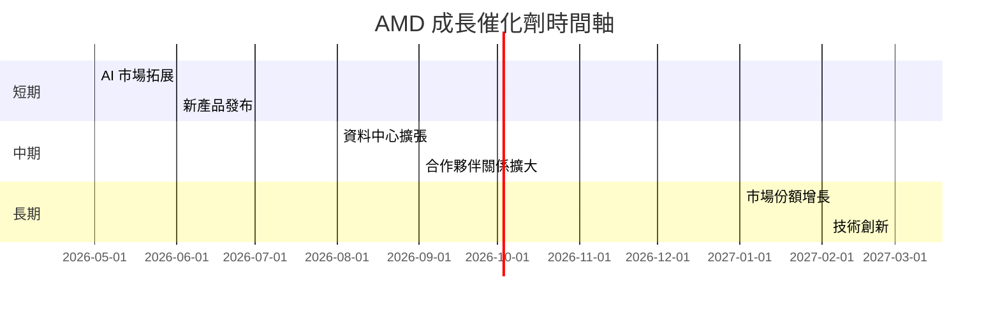

### 8.2 TAM 市場規模分析

```
╔══════════════════════════════════════════════════════════════════╗
║                    TAM 市場規模分析                              ║
╠══════════════════════════════════════════════════════════════════╣
║                                                                  ║
║  AI 市場 TAM：$500B                                              ║
║  資料中心 TAM：$300B                                             ║
║  客戶與遊戲 TAM：$200B                                           ║
║                                                                  ║
║  總 TAM：$1T                                                     ║
║  當前滲透率：10%                                                 ║
║  未來增長潛力：90%                                              ║
╚══════════════════════════════════════════════════════════════════╝
```

### 8.3 成長驅動力結構圖

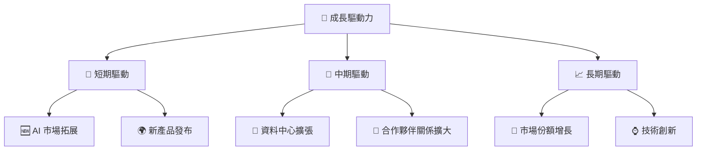

---

## 9. 風險矩陣

### 9.1 風險評分矩陣

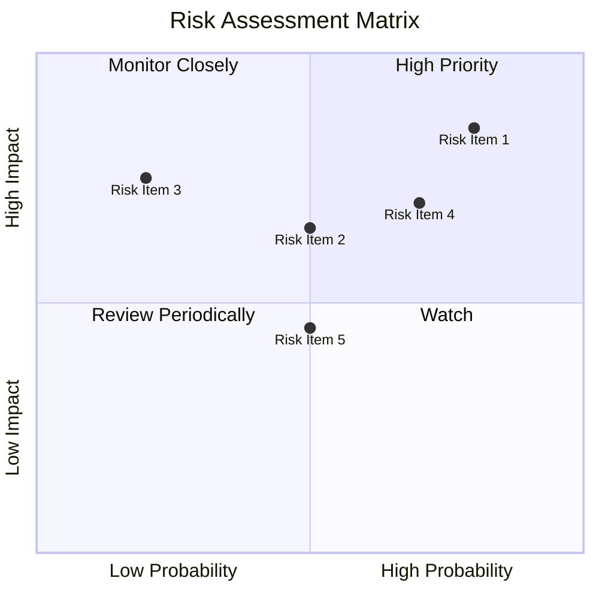

### 9.2 風險清單詳細分析

| # | 風險項目 | 發生機率 | 財務衝擊 | 風險評分 | 緩解措施 |
|---|----------|----------|----------|----------|----------|
| 1 | 🔴 **市場競爭** | 高 (80%) | 高 (-15%收入) | 🔴 8.5/10 | 加強技術研發與客戶關係 |
| 2 | 🔴 **技術風險** | 中高 (70%) | 高 (-10%利潤) | 🔴 7.5/10 | 增加研發投入 |
| 3 | 🟡 **經濟波動** | 中 (50%) | 中 (-5%收入) | 🟡 6.5/10 | 擴大市場多元化 |
| 4 | 🟡 **供應鏈中斷** | 中 (50%) | 中 (-5%利潤) | 🟡 5.5/10 | 建立多元供應鏈 |
| 5 | 🟡 **法規變動** | 低 (20%) | 中低 (-3%利潤) | 🟡 4.5/10 | 持續監控法規環境 |

---

## 10. 投資建議

### 10.1 最終綜合評級雷達圖

```
╔══════════════════════════════════════════════════════════════════╗
║                  AMD 綜合評級雷達圖                              ║
╠══════════════════════════════════════════════════════════════════╣
║                                                                  ║
║  基本面：9.0/10                                                  ║
║  成長性：9.0/10                                                  ║
║  獲利能力：8.0/10                                                ║
║  財務健康：9.0/10                                                ║
║  估值：8.0/10                                                    ║
║                                                                  ║
║  總分：8.6/10                                                    ║
╚══════════════════════════════════════════════════════════════════╝
```

### 10.2 目標價與隱含報酬率

| 情境 | 目標價 | 隱含報酬率 | 機率權重 |
|------|--------|------------|----------|
| 🟢 **樂觀** | $455 | +26% | 30% |
| 🟡 **基準** | $304 | -16% | 50% |
| 🔴 **悲觀** | $225 | -38% | 20% |

### 10.3 買入時機與觸發因素

```
╔══════════════════════════════════════════════════════════════════╗
║                  ✅ 買入觸發因素 Checklist                      ║
╠══════════════════════════════════════════════════════════════════╣
║                                                                  ║
║  立即買入觸發條件（多數符合）：                                  ║
║  ✅ 股價低於基準估值區間                                        ║
║  ✅ 市場份額持續增長                                            ║
║  ✅ 新產品發布成功                                              ║
║                                                                  ║
║  加碼觸發條件（出現以下任一）：                                  ║
║  ☐ AI 市場擴展超預期                                            ║
║  ☐ 與主要合作夥伴達成新協議                                    ║
║                                                                  ║
║  減碼/停損觸發條件（出現以下任一）：                             ║
║  ☐ 技術風險導致產品滯銷                                        ║
║  ☐ 全球經濟嚴重衰退                                            ║
╚══════════════════════════════════════════════════════════════════╝
```

### 10.4 投資人適配度分析

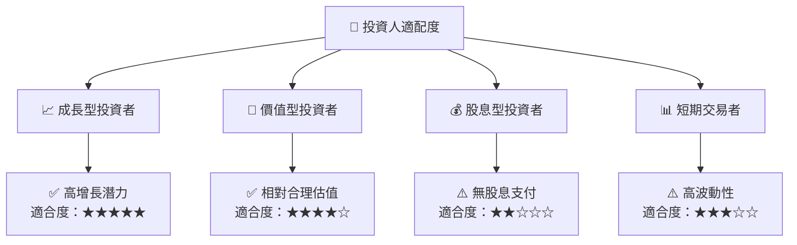

### 10.5 關鍵監控指標

| 監控類型 | 指標 | 關注點 | 頻率 |
|----------|------|--------|------|
| 市場動態 | 市場份額 | 競爭者動態 | 季度 |
| 財務健康 | 現金流 | 自由現金流變化 | 半年 |
| 技術進展 | 新產品發布 | 技術領先地位 | 年度 |
| 風險管理 | 供應鏈穩定 | 原材料供應 | 持續 |

---

> **免責聲明**：本報告為 AI 自動生成，僅供研究參考，不構成投資建議。投資有風險，入市需謹慎。