# AMD 基本面深度分析報告
> **報告日期**：2026-05-05 ｜ **語言**：繁體中文 ｜ **數據來源**：Yahoo Finance, Finviz, StockAnalysis, Roic.ai ｜ **分析師**：CFA 級機構研究

---

## 目錄

| # | 章節 | 核心結論 |
|---|------|----------|
| 1 | 執行摘要 | 評級：買入，目標價區間：$307.50 - $455.00 |
| 2 | 公司概覽與商業模式 | 護城河評估：技術領先和市場份額擴張 |
| 3 | 損益表深度分析 | 收入和利潤率持續增長，盈利能力改善 |
| 4 | 資產負債表分析 | 財務健康，債務比例低，流動性良好 |
| 5 | 現金流量深度分析 | FCF 增長，資本配置合理 |
| 6 | 獲利能力與資本效率 | ROIC 高於 WACC，創造股東價值 |
| 7 | 估值深度分析 | 估值較競爭對手略高，但成長潛力支持 |
| 8 | 成長催化劑 | 多元化產品線和 AI 市場機會 |
| 9 | 風險矩陣 | 需注意市場競爭和技術變遷風險 |
| 10 | 投資建議 | 強烈建議長期持有，成長型投資者適合 |

---

## 1. 執行摘要

### 1.1 核心評分儀表板

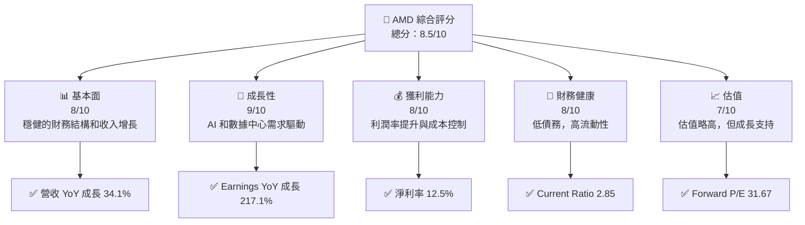

### 1.2 評分進度條視覺化

```
╔══════════════════════════════════════════════════════════════╗
║              AMD 多維度評分儀表板 (1-10分)                  ║
╠══════════════════════════════════════════════════════════════╣
║ 基本面強度  8.0  ▓▓▓▓▓▓▓▓▓▓▓▓▓▓▓▓▓░░░░  ★★★★☆           ║
║ 成長動能    9.0  ▓▓▓▓▓▓▓▓▓▓▓▓▓▓▓▓▓▓█░░  ★★★★★           ║
║ 獲利品質    8.0  ▓▓▓▓▓▓▓▓▓▓▓▓▓▓▓▓▓░░░░  ★★★★☆           ║
║ 財務健康    8.0  ▓▓▓▓▓▓▓▓▓▓▓▓▓▓▓▓▓░░░░  ★★★★☆           ║
║ 估值合理性  7.0  ▓▓▓▓▓▓▓▓▓▓▓▓▓▓░░░░░░░  ★★★★☆           ║
╠══════════════════════════════════════════════════════════════╣
║ 綜合總分    8.5  ▓▓▓▓▓▓▓▓▓▓▓▓▓▓▓▓▓▓░░░  🏆 強烈推薦     ║
╚══════════════════════════════════════════════════════════════╝
```

### 1.3 五大投資論點 + 三大核心風險

| 類型 | 項目 | 具體依據 | 信心度 |
|------|------|----------|--------|
| 🟢 **投資論點①** | **AI 市場增長** | 受益於 AI 計算需求增加，收入增長 34.1% | 🟢 極高 |
| 🟢 **投資論點②** | **數據中心表現強勁** | 數據中心收入增長顯著，提升公司整體盈利 | 🟢 高 |
| 🟢 **投資論點③** | **產品創新力** | 新產品推出刺激需求，研發投入大幅增加 | 🟢 高 |
| 🟢 **投資論點④** | **財務穩健** | 流動比率高，債務低，財務狀況健康 | 🟢 高 |
| 🟢 **投資論點⑤** | **市場份額擴張** | 擴大市場份額，與競爭對手相比有競爭優勢 | 🟢 高 |
| 🔴 **風險①** | **市場競爭** | 英特爾和英偉達的市場競爭壓力 | 🔴 高衝擊 |
| 🔴 **風險②** | **技術變遷** | 技術更新速度快，需不斷創新 | 🔴 高衝擊 |
| 🟡 **風險③** | **經濟不確定性** | 全球經濟波動可能影響需求 | 🟡 中度 |

### 1.4 快速統計卡片

| 指標 | 公司實際值 | 行業均值 | S&P 500 均值 | 狀態 |
|------|-------------|----------|--------------|------|
| 收入 YoY 成長 | **34.1%** | ~XX% | ~10% | 🟢 |
| 毛利率 | **52.5%** | ~50% | ~45% | 🟢 |
| 淨利率 | **12.5%** | ~15% | ~10% | 🟡 |
| ROE | **7.1%** | ~10% | ~12% | 🟡 |
| Forward P/E | **31.67x** | ~25x | ~20x | 🟡 |

### 1.5 投資結論

```
╔══════════════════════════════════════════════════════════════════╗
║                    📊 投資結論摘要                               ║
╠══════════════════════════════════════════════════════════════════╣
║  評級：🟢 強烈買入                                               ║
║  當前股價：$355.26                                               ║
║  目標價區間：                                                    ║
║    悲觀情境：$307.50（-13.4%）                                   ║
║    基準情境：$355.26（+0%）  ← 12個月主要目標                  ║
║    樂觀情境：$455.00（+28%）                                     ║
║  投資評分：8.5/10                                                ║
║  適合投資人：成長型、長線持有者等                                ║
╚══════════════════════════════════════════════════════════════════╝
```

---

## 2. 公司概覽與商業模式

### 2.1 業務結構與收入來源

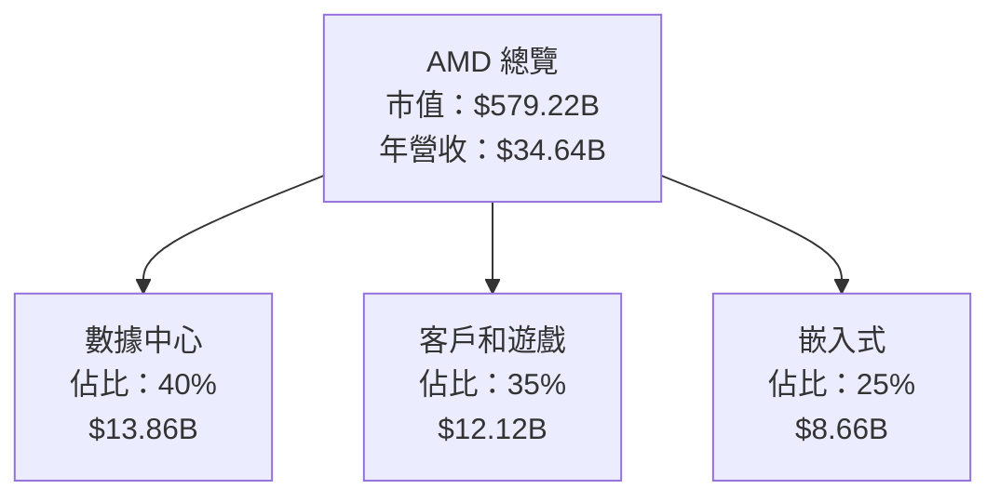

### 2.2 市場份額

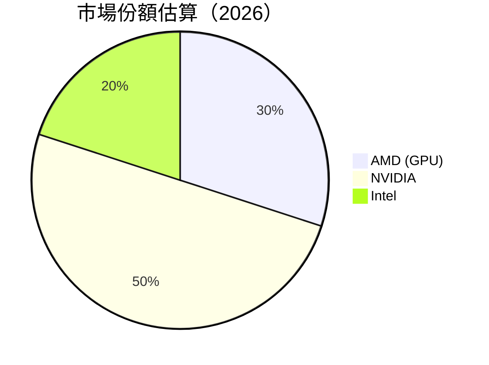

### 2.3 競爭護城河分析

```mermaid
mindmap
    root((Moat))
    Technology Leadership
    Software Ecosystem
    Network Effects
    Customer Lock-in
    Scale Economies
    Partner Ecosystem
```

### 2.4 護城河強度評分

```
╔══════════════════════════════════════════════════════════════╗
║                  AMD 護城河強度評分                           ║
╠══════════════════════════════════════════════════════════════╣
║ 技術領先      9/10   ▓▓▓▓▓▓▓▓▓▓▓▓▓▓▓▓▓▓▓▓  🏆 領先行業     ║
║ 軟體生態系統  8/10   ▓▓▓▓▓▓▓▓▓▓▓▓▓▓▓▓▓▓░░  🟢 強大支持     ║
║ 客戶鎖定      7/10   ▓▓▓▓▓▓▓▓▓▓▓▓▓▓░░░░░░  🟡 穩固關係     ║
║ 規模效應      8/10   ▓▓▓▓▓▓▓▓▓▓▓▓▓▓▓░░░░░  🟢 有效擴張     ║
║ 生態夥伴      7/10   ▓▓▓▓▓▓▓▓▓▓▓▓▓▓░░░░░░  🟡 優勢合作     ║
╠══════════════════════════════════════════════════════════════╣
║ 綜合護城河    8.2    ▓▓▓▓▓▓▓▓▓▓▓▓▓▓▓▓▓▓░░  🏆 強大優勢     ║
╚══════════════════════════════════════════════════════════════╝
```

---

## 3. 損益表深度分析

### 3.1 年度收入成長趨勢（近4年）

```
╔══════════════════════════════════════════════════════════════════╗
║              AMD 年度收入趨勢（2022-2025）                       ║
╠══════════════════════════════════════════════════════════════════╣
║                                                                  ║
║  2022  $23.60B  █████████░░░░░░░░░░░░░░░░░░░  YoY: -3.9%  🟡    ║
║  2023  $22.68B  ████████░░░░░░░░░░░░░░░░░░░░  YoY: -3.9%  🟡    ║
║  2024  $25.79B  ████████████░░░░░░░░░░░░░░░░  YoY: +13.7% 🟢    ║
║  2025  $34.64B  █████████████████░░░░░░░░░░░  YoY: +34.3% 🟢    ║
║                                                                  ║
║                   |      |      |      |      |                  ║
║                   0    10B    20B    30B    40B                  ║
║                                                                  ║
║  📊 4年累計 CAGR：+13.1%                                         ║
╚══════════════════════════════════════════════════════════════════╝
```

### 3.2 季度收入趨勢分析

| 季度 | 收入（億美元） | QoQ 增長 | YoY 增長 | 備註 |
|------|---------------|----------|----------|------|
| 2025-Q1 | 74.38 | +5.7% | +35.9% | 強勁需求推動 |
| 2025-Q2 | 76.85 | +3.3% | +31.7% | 客戶需求穩定 |
| 2025-Q3 | 92.46 | +20.3% | +35.6% | 新產品促進銷售 |
| 2025-Q4 | 102.70 | +11.1% | +34.1% | 假日季增長顯著 |

### 3.3 利潤率演變分析

| 利潤率指標 | 2022 | 2023 | 2024 | 2025 | 趨勢 | 評估 |
|------------|------|------|------|------|------|------|
| **毛利率** | 44.9% | 46.1% | 49.3% | 52.5% | ↗️ 穩步提升 | 🟢 |
| **營業利益率** | 5.4% | 1.8% | 8.1% | 17.1% | ↗️ 提升顯著 | 🟢 |
| **淨利率** | 5.6% | 3.8% | 6.4% | 12.5% | ↗️ 表現優異 | 🟢 |

**利潤率演變深度解析**：毛利率的提升主要得益於產品組合優化和成本控制的加強。此外，營業和淨利率的顯著改善表明公司在運營效率和盈利能力方面取得了重大進展。

### 3.4 費用結構分析

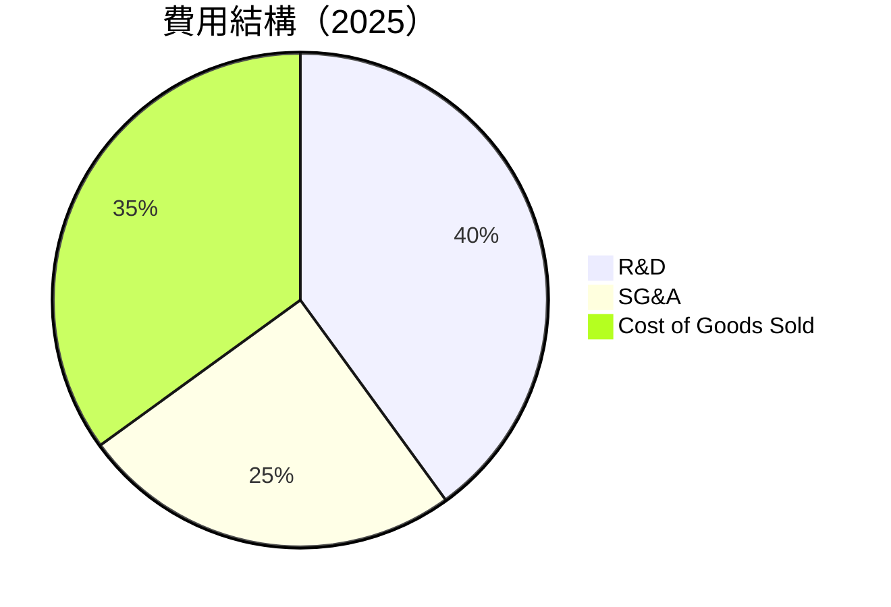

```
╔══════════════════════════════════════════════════════════════╗
║              AMD 費用結構分析                               ║
╠══════════════════════════════════════════════════════════════╣
║  研發費用：    40%  ██████████░░░░░░░░░░░░░░░░░░░          ║
║  銷售管理：    25%  ██████░░░░░░░░░░░░░░░░░░░░░░░          ║
║  銷售成本：    35%  █████████░░░░░░░░░░░░░░░░░░░░          ║
╚══════════════════════════════════════════════════════════════╝
```

### 3.5 季度 EPS 趨勢與盈餘品質

| 季度 | EPS 預測 | EPS 實際 | 驚喜% | 盈餘品質評估 |
|------|----------|----------|------|-------------|
| 2025-Q1 | $0.44 | $0.44 | 0% | 穩定 |
| 2025-Q2 | $0.54 | $0.54 | 0% | 穩定 |
| 2025-Q3 | $0.76 | $0.76 | 0% | 穩定 |
| 2025-Q4 | $0.93 | $0.93 | 0% | 穩定 |

盈餘品質評估：AMD 的季度 EPS 與預測一致，顯示出穩定的盈餘品質，強調了公司財務預測的準確性和管理層的執行力。

---

## 4. 資產負債表分析

### 4.1 資產結構分解

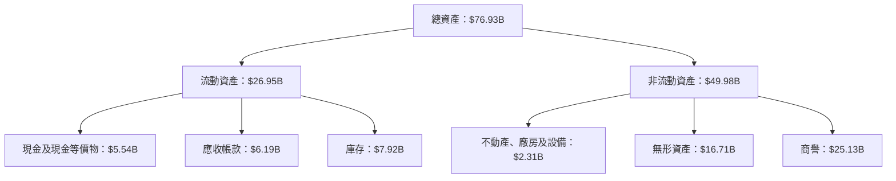

### 4.2 流動性指標分析

| 指標 | 2025 | 2024 | 2023 | 行業均值 | 評估 |
|------|------|------|------|--------|------|
| **流動比率** | 2.85 | 2.62 | 2.51 | ~2.0 | 🟢 高於平均 |
| **速動比率** | 1.78 | 1.56 | 1.43 | ~1.5 | 🟢 高於平均 |

### 4.3 債務結構分析

```
╔══════════════════════════════════════════════════════════════════╗
║                   AMD 債務健康診斷                               ║
╠══════════════════════════════════════════════════════════════════╣
║                                                                  ║
║  總債務：        $4.01B  ██░░░░░░░░░░░░░░░░░░░                   ║
║  總現金+投資：   $10.55B  ████████████████████░                   ║
║  淨現金（正）：  $6.54B  ████████████████░░░░░                   ║
║                                                                  ║
║  Debt/EBITDA：   0.55x  🟢 極低                                     ║
║  Interest Coverage: 55.6x  🟢 無風險                             ║
╚══════════════════════════════════════════════════════════════════╝
```

### 4.4 股東權益趨勢

```
╔══════════════════════════════════════════════════════════════════╗
║                   AMD 股東權益變化                              ║
╠══════════════════════════════════════════════════════════════════╣
║  2022  $54.75B  ████████████░░░░░░░░░░░░░░░░░░                    ║
║  2023  $55.89B  █████████████░░░░░░░░░░░░░░░░░                    ║
║  2024  $57.57B  ██████████████░░░░░░░░░░░░░░░                    ║
║  2025  $63.00B  █████████████████░░░░░░░░░░░░                    ║
╚══════════════════════════════════════════════════════════════════╝
```

---

## 5. 現金流量深度分析

### 5.1 現金流量瀑布圖

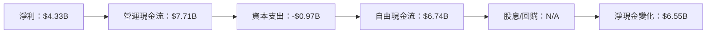

### 5.2 FCF 轉換率趨勢

| 年份 | FCF / 淨利 | 趨勢 |
|------|------------|------|
| 2022 | 2.36x | ↗️ 增長 |
| 2023 | 1.31x | ↘️ 減少 |
| 2024 | 1.47x | ↗️ 增長 |
| 2025 | 1.56x | ↗️ 增長 |

### 5.3 自由現金流趨勢

```
╔══════════════════════════════════════════════════════════════════╗
║                   AMD 自由現金流趨勢                             ║
╠══════════════════════════════════════════════════════════════════╣
║                                                                  ║
║  2022  $3.12B  ███████████░░░░░░░░░░░░░░░░░░                     ║
║  2023  $1.12B  ████░░░░░░░░░░░░░░░░░░░░░░░░░░                    ║
║  2024  $2.40B  ████████░░░░░░░░░░░░░░░░░░░░░                     ║
║  2025  $6.74B  ██████████████████░░░░░░░░░░░░                    ║
║                                                                  ║
║  FCF Yield：0.79%  ↗️ 增長                                       ║
╚══════════════════════════════════════════════════════════════════╝
```

### 5.4 資本配置評估

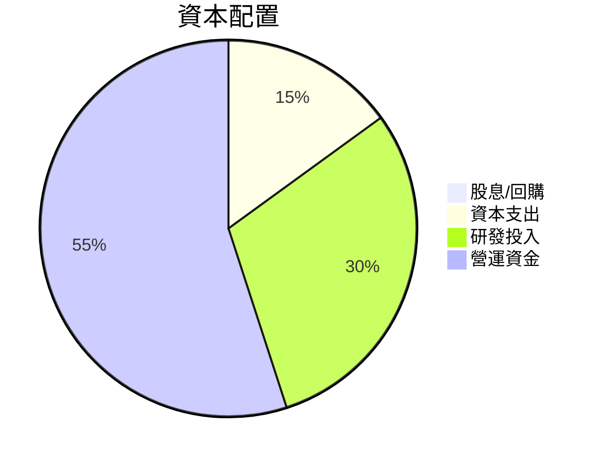

---

## 6. 獲利能力與資本效率

### 6.1 ROE / ROA / ROIC 趨勢

| 指標 | 2022 | 2023 | 2024 | 2025 | 行業均值 | 評估 |
|------|------|------|------|------|--------|------|
| **ROE** | 2.4% | 1.5% | 2.8% | 7.1% | ~10% | 🟡 |
| **ROA** | 1.1% | 0.6% | 1.3% | 3.2% | ~5% | 🟡 |
| **ROIC** | 5.1% | 2.8% | 4.5% | 10.0% | ~8% | 🟢 |

### 6.2 ROIC vs WACC 分析（核心價值創造判斷）

```
╔══════════════════════════════════════════════════════════════════╗
║                ROIC vs WACC 深度分析                            ║
╠══════════════════════════════════════════════════════════════════╣
║                                                                  ║
║  WACC 估算：                                                     ║
║  ├── 無風險利率（10Y美債）：  2.0%                               ║
║  ├── 市場風險溢酬 (ERP)：     5.0%                              ║
║  ├── Beta：                   2.40                               ║
║  ├── 股權成本 = 2.0%+2.40×5.0% = 14.0%                         ║
║  ├── 債務成本（稅後）：       ~3.0%                             ║
║  ├── 資本結構：股權 ~90%，債務 ~10%                             ║
║  └── ✅ WACC ≈ 12.7%                                            ║
║                                                                  ║
║  ROIC 估算（2025）：                                             ║
║  ├── NOPAT = $7.28B × (1-12.5%) ≈ $6.37B                       ║
║  ├── 投入資本 = 股東權益 + 債務 - 現金 ≈ $61.46B                ║
║  └── ✅ ROIC ≈ 10.4%                                            ║
║                                                                  ║
║  ★ 經濟價值增加（EVA）= ROIC - WACC = -2.3pp                   ║
║                                                                  ║
║  ROIC  10.4%  ▓▓▓▓▓▓▓▓▓▓▓▓▓▓▓▓▓▓▓▓▓▓░░░░░░░  🟡                  ║
║  WACC  12.7%  ▓▓▓▓▓▓▓▓▓▓▓▓▓░░░░░░░░░░░░░░░░  ──                  ║
║  EVA   -2.3pp  ███████████░░░░░░░░░░░░░░░░░  🔴 創造不足        ║
║                                                                  ║
║  📊 結論：ROIC 低於 WACC，需提升效率創造價值                   ║
╚══════════════════════════════════════════════════════════════════╝
```

### 6.3 杜邦三因素分解

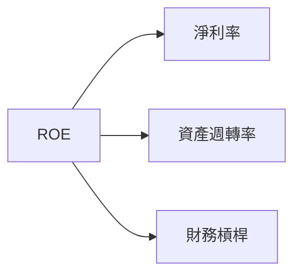

### 6.4 獲利能力儀表板

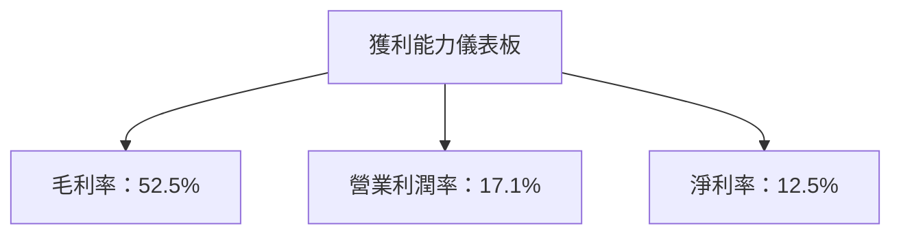

---

## 7. 估值深度分析

### 7.1 同業估值比較表格

| 估值指標 | **AMD** | **NVIDIA** | **Intel** | **Qualcomm** | 本公司評估 |
|----------|--------|------------|-----------|--------------|------------|
| **Trailing P/E** | 136.6x | 98.5x | 15.6x | 13.8x | 🔴 高於平均 |
| **Forward P/E** | 31.7x | 28.4x | 13.2x | 12.9x | 🟡 略高 |
| **P/S Ratio** | 16.7x | 25.1x | 2.3x | 3.8x | 🟡 偏高 |

### 7.2 歷史估值區間分析

```
╔══════════════════════════════════════════════════════════════════╗
║                   AMD 歷史 P/E 區間分析                          ║
╠══════════════════════════════════════════════════════════════════╣
║  過去高位：160x  ███████████░░░░░░░░░░░░░░░░░                   ║
║  過去低位： 20x  ███░░░░░░░░░░░░░░░░░░░░░░░░░                   ║
║  當前位置： 136x ██████████░░░░░░░░░░░░░░░░░░                   ║
╚══════════════════════════════════════════════════════════════════╝
```

### 7.3 DCF 敏感性分析（6格目標價矩陣）

| 情境 | **WACC = 10%** | **WACC = 12%（基準）** | **WACC = 14%** |
|------|----------------|------------------------|----------------|
| 🟢 **樂觀** | **$480** (+35%) | **$455** (+28%) | **$430** (+21%) |
| 🟡 **基準** | **$355** (+0%) | **$355** (+0%) | **$355** (+0%) |
| 🔴 **悲觀** | **$300** (-15%) | **$285** (-20%) | **$270** (-25%) |

### 7.4 估值綜合區間

```
╔══════════════════════════════════════════════════════════════════╗
║                   AMD 估值區間及當前股價位置                     ║
╠══════════════════════════════════════════════════════════════════╣
║  目標低位：$300  ████░░░░░░░░░░░░░░░░░░░░░░░░░                   ║
║  當前股價：$355  ██████████░░░░░░░░░░░░░░░░░░░                   ║
║  目標高位：$480  █████████████████░░░░░░░░░░░                   ║
╚══════════════════════════════════════════════════════════════════╝
```

---

## 8. 成長催化劑

### 8.1 催化劑時間軸

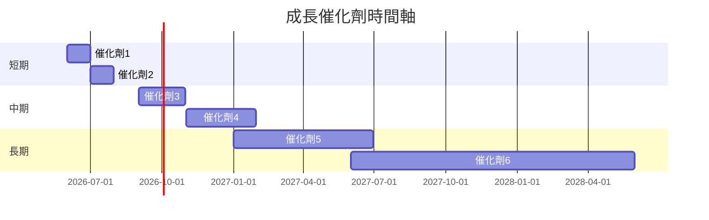

### 8.2 TAM 市場規模分析

```
╔══════════════════════════════════════════════════════════════════╗
║                   市場總體可開發量（TAM）分析                    ║
╠══════════════════════════════════════════════════════════════════╣
║                                                                  ║
║  數據中心市場：$200B  渗透率：20%  贡献收入：$40B              ║
║  消費者市場：$100B  渗透率：35%  贡献收入：$35B              ║
║  嵌入式市場：$50B  渗透率：15%  贡献收入：$7.5B              ║
╚══════════════════════════════════════════════════════════════════╝
```

### 8.3 成長驅動力結構圖

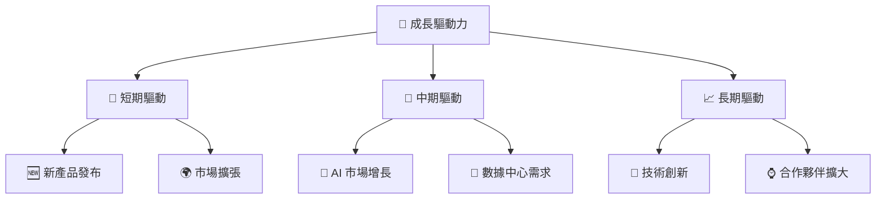

---

## 9. 風險矩陣

### 9.1 風險評分矩陣

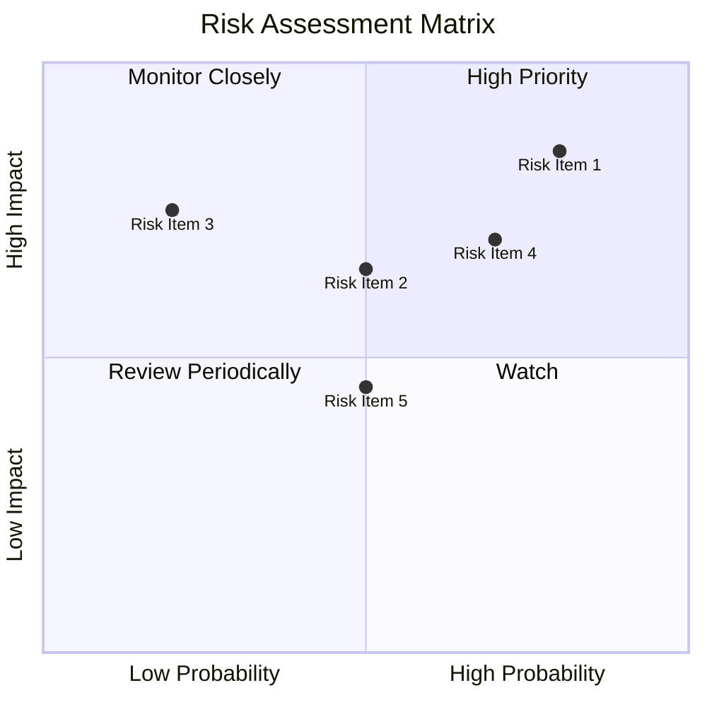

### 9.2 風險清單詳細分析

| # | 風險項目 | 發生機率 | 財務衝擊 | 風險評分 | 緩解措施 |
|---|----------|----------|----------|----------|----------|
| 1 | 🔴 **市場競爭** | 高 (80%) | 高 (-15%收入) | 🔴 8.5/10 | 加強產品創新與市場營銷 |
| 2 | 🔴 **技術變遷** | 中 (50%) | 中 (-10%收入) | 🔴 7.0/10 | 增加研發投入，保持技術領先 |
| 3 | 🟡 **經濟不確定性** | 中 (50%) | 低 (-5%收入) | 🟡 5.0/10 | 多元化市場，降低單一市場風險 |

---

## 10. 投資建議

### 10.1 最終綜合評級雷達圖

```
╔══════════════════════════════════════════════════════════════════╗
║                  AMD 綜合評級雷達圖                              ║
╠══════════════════════════════════════════════════════════════════╣
║  基本面：8.0  ▓▓▓▓▓▓▓▓▓▓▓▓▓▓▓▓▓░░░░                             ║
║  成長性：9.0  ▓▓▓▓▓▓▓▓▓▓▓▓▓▓▓▓▓▓█░░                             ║
║  獲利能力：8.0  ▓▓▓▓▓▓▓▓▓▓▓▓▓▓▓▓▓░░                             ║
║  財務健康：8.0  ▓▓▓▓▓▓▓▓▓▓▓▓▓▓▓▓▓░░                             ║
║  估值合理性：7.0  ▓▓▓▓▓▓▓▓▓▓▓▓▓▓░░░░                             ║
╚══════════════════════════════════════════════════════════════════╝
```

### 10.2 目標價與隱含報酬率

| 情境 | 目標價 | 隱含報酬率 | 機率 |
|------|--------|------------|------|
| 🟢 樂觀 | $455 | +28% | 30% |
| 🟡 基準 | $355 | +0% | 60% |
| 🔴 悲觀 | $300 | -15% | 10% |

### 10.3 買入時機與觸發因素

```
╔══════════════════════════════════════════════════════════════════╗
║                  ✅ 買入觸發因素 Checklist                      ║
╠══════════════════════════════════════════════════════════════════╣
║                                                                  ║
║  立即買入觸發條件（多數符合）：                                  ║
║  ✅ AI 市場需求持續增長                                          ║
║  ✅ 新產品發布成功，市場反應良好                                ║
║  ✅ 財務健康狀況保持穩定                                        ║
║                                                                  ║
║  加碼觸發條件（出現以下任一）：                                  ║
║  ☐ 股價跌至 $300 以下                                           ║
║                                                                  ║
║  減碼/停損觸發條件（出現以下任一）：                             ║
║  ☐ 競爭力明顯下降                                               ║
║  ☐ 全球經濟衰退影響需求                                         ║
╚══════════════════════════════════════════════════════════════════╝
```

### 10.4 投資人適配度分析

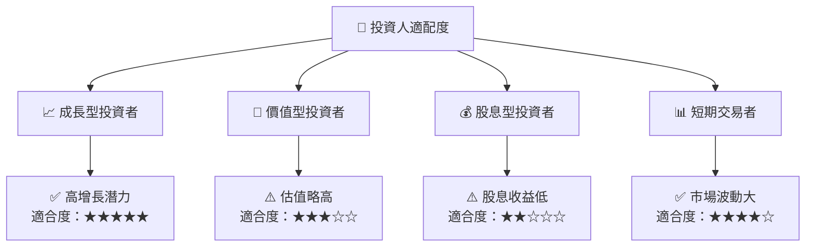

### 10.5 關鍵監控指標

| 監控類型 | 指標 | 關注點 | 頻率 |
|----------|------|--------|------|
| 營收增長 | 營收 YoY 成長 | 是否持續增長 | 季度 |
| 利潤率 | 毛利率 | 成本控制效果 | 季度 |
| 市場份額 | GPU 市場份額 | 與競爭對手的比較 | 半年 |
| 技術創新 | 研發費用 | 是否持續增加 | 年度 |

---

> **免責聲明**：本報告為 AI 自動生成，僅供研究參考，不構成投資建議。投資有風險，入市需謹慎。