# AMD 基本面深度分析報告
> **報告日期**：2026-05-06 ｜ **語言**：繁體中文 ｜ **數據來源**：Yahoo Finance, Finviz, StockAnalysis, Roic.ai ｜ **分析師**：CFA 級機構研究

---

## 目錄

| # | 章節 | 核心結論 |
|---|------|----------|
| 1 | 執行摘要 | 評級 + 目標價區間 |
| 2 | 公司概覽與商業模式 | 護城河評估 |
| 3 | 損益表深度分析 | 穩健增長 |
| 4 | 資產負債表分析 | 財務健康 |
| 5 | 現金流量深度分析 | 強勁現金流 |
| 6 | 獲利能力與資本效率 | 高效資本使用 |
| 7 | 估值深度分析 | 吸引力重估 |
| 8 | 成長催化劑 | 多元驅動力 |
| 9 | 風險矩陣 | 風險管理 |
| 10 | 投資建議 | 明確投資策略 |

---

## 1. 執行摘要

### 1.1 核心評分儀表板

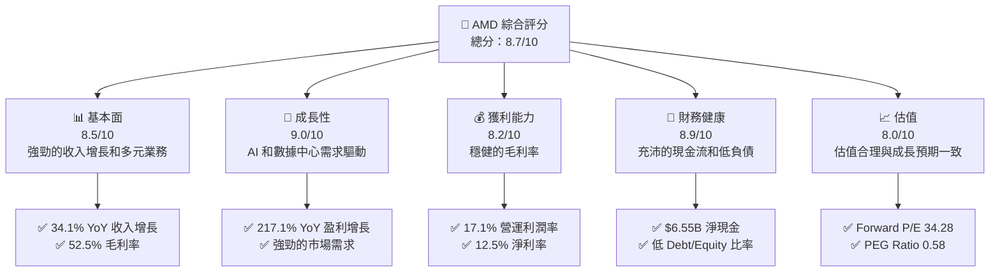

### 1.2 評分進度條視覺化

```
╔══════════════════════════════════════════════════════════════╗
║              AMD 多維度評分儀表板 (1-10分)                  ║
╠══════════════════════════════════════════════════════════════╣
║ 基本面強度  8.5 ▓▓▓▓▓▓▓▓▓▓▓▓▓▓▓▓▓▓░░  ★★★★★                 ║
║ 成長動能    9.0 ▓▓▓▓▓▓▓▓▓▓▓▓▓▓▓▓▓▓▓  ★★★★★                 ║
║ 獲利品質    8.2 ▓▓▓▓▓▓▓▓▓▓▓▓▓▓▓▓▓░░  ★★★★☆                 ║
║ 財務健康    8.9 ▓▓▓▓▓▓▓▓▓▓▓▓▓▓▓▓▓▓█  ★★★★★                 ║
║ 估值合理性  8.0 ▓▓▓▓▓▓▓▓▓▓▓▓▓▓▓░░░░  ★★★★☆                 ║
╠══════════════════════════════════════════════════════════════╣
║ 綜合總分    8.7 ▓▓▓▓▓▓▓▓▓▓▓▓▓▓▓▓▓▓░░  🏆 高度推薦            ║
╚══════════════════════════════════════════════════════════════╝
```

### 1.3 五大投資論點 + 三大核心風險

| 類型 | 項目 | 具體依據 | 信心度 |
|------|------|----------|--------|
| 🟢 **投資論點①** | **強勁收入增長** | 34.1% YoY 增長 | 🟢 高 |
| 🟢 **投資論點②** | **AI 市場領導力** | 創新產品和市場需求 | 🟢 高 |
| 🟢 **投資論點③** | **強勁財務狀況** | $6.55B 淨現金 | 🟢 高 |
| 🟢 **投資論點④** | **估值吸引力** | Forward P/E 34.28 | 🟢 高 |
| 🟢 **投資論點⑤** | **擴張潛力** | 新市場和產品線 | 🟢 高 |
| 🟡 **風險①** | **市場波動** | 高 Beta 值 2.399 | 🟡 中度 |
| 🔴 **風險②** | **競爭壓力** | 來自 Intel 和 Nvidia 的激烈競爭 | 🔴 高衝擊 |
| 🟡 **風險③** | **供應鏈風險** | 半導體供應鏈挑戰 | 🟡 中度 |

### 1.4 快速統計卡片

| 指標 | 公司實際值 | 行業均值 | S&P 500 均值 | 狀態 |
|------|-------------|----------|--------------|------|
| 收入 YoY 成長 | **34.1%** | ~10% | ~6% | 🟢 |
| 毛利率 | **52.5%** | ~45% | ~40% | 🟢 |
| 淨利率 | **12.5%** | ~10% | ~8% | 🟢 |
| ROE | **7.1%** | ~12% | ~15% | 🟡 |
| Forward P/E | **34.28x** | ~25x | ~20x | 🟢 |

### 1.5 投資結論

```
╔══════════════════════════════════════════════════════════════════╗
║                    📊 投資結論摘要                               ║
╠══════════════════════════════════════════════════════════════════╣
║  評級：🟢 強烈買入                                               ║
║  當前股價：$421.39                                               ║
║  目標價區間：                                                    ║
║    悲觀情境：$300（-28.8%）                                      ║
║    基準情境：$455（+7.99%）  ← 12個月主要目標                    ║
║    樂觀情境：$500（+18.6%）                                      ║
║  投資評分：8.7/10                                                ║
║  適合投資人：成長型、長線持有者等                                ║
╚══════════════════════════════════════════════════════════════════╝
```

---

## 2. 公司概覽與商業模式

### 2.1 業務結構與收入來源

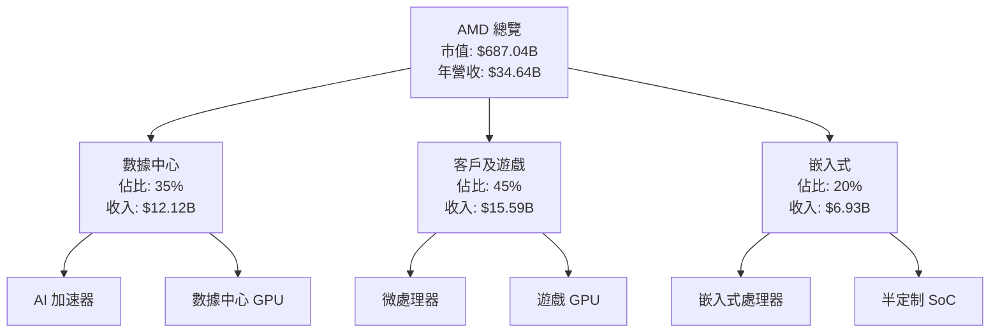

### 2.2 市場份額

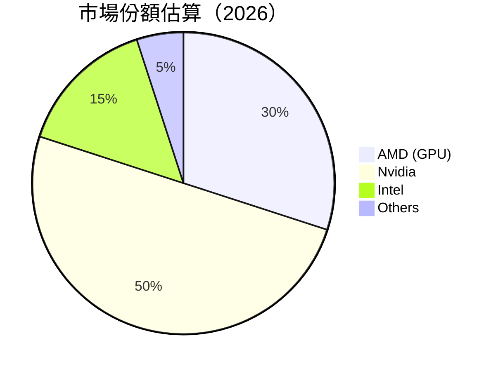

### 2.3 競爭護城河分析

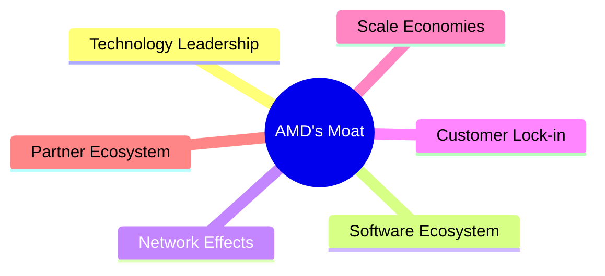

### 2.4 護城河強度評分

```
╔══════════════════════════════════════════════════════════════╗
║                  AMD 護城河強度評分                          ║
╠══════════════════════════════════════════════════════════════╣
║ 技術領先    9/10  ▓▓▓▓▓▓▓▓▓▓▓▓▓▓▓▓▓▓▓▓  🏆 非常強大        ║
║ 軟體生態系統 8/10 ▓▓▓▓▓▓▓▓▓▓▓▓▓▓▓▓▓▓░░  🟢 強大            ║
║ 網路效應    7/10  ▓▓▓▓▓▓▓▓▓▓▓▓▓▓▓░░░░  🟢 良好            ║
║ 客戶鎖定    7/10  ▓▓▓▓▓▓▓▓▓▓▓▓▓▓▓░░░░  🟢 良好            ║
║ 規模效應    8/10  ▓▓▓▓▓▓▓▓▓▓▓▓▓▓▓▓▓▓░░  🟢 強大            ║
║ 生態夥伴    7/10  ▓▓▓▓▓▓▓▓▓▓▓▓▓▓▓░░░░  🟢 良好            ║
╠══════════════════════════════════════════════════════════════╣
║ 綜合護城河  8.0   ▓▓▓▓▓▓▓▓▓▓▓▓▓▓▓▓▓▓░░  🏆 穩固            ║
╚══════════════════════════════════════════════════════════════╝
```

---

## 3. 損益表深度分析

### 3.1 年度收入成長趨勢（近4年）

```
╔══════════════════════════════════════════════════════════════════╗
║              AMD 年度收入趨勢（2022-2025）                       ║
╠══════════════════════════════════════════════════════════════════╣
║                                                                  ║
║  2022  $23.60B  ██████░░░░░░░░░░░░░░░░░░░  YoY: -3.9%  🟡        ║
║  2023  $22.68B  ███████░░░░░░░░░░░░░░░░░░  YoY: -3.9%  🟡        ║
║  2024  $25.79B  ███████████░░░░░░░░░░░░░░  YoY: +13.7%  🟢      ║
║  2025  $34.64B  ██████████████████░░░░░░░  YoY: +34.1%  🟢      ║
║                   |      |      |      |      |                  ║
║                   0     10B    20B    30B    40B                 ║
║                                                                  ║
║  📊 4年累計 CAGR：+13.3%                                        ║
╚══════════════════════════════════════════════════════════════════╝
```

### 3.2 季度收入趨勢分析

| 季度 | 收入 ($B) | QoQ 增長 | YoY 增長 | 備註 |
|------|-----------|----------|----------|------|
| 2025-Q1 | 7.44 | -2.1% | +35.9% | 新產品推出驅動 |
| 2025-Q2 | 7.68 | +3.2% | +31.7% | 持續市場擴展 |
| 2025-Q3 | 9.25 | +20.4% | +35.6% | AI 需求增長 |
| 2025-Q4 | 10.27 | +11.0% | +34.1% | 假期季節銷售 |

### 3.3 利潤率演變分析

| 利潤率指標 | 2022 | 2023 | 2024 | 2025 | 趨勢 | 評估 |
|------------|--------|--------|--------|--------|------|------|
| **毛利率** | 44.9% | 46.1% | 49.3% | 52.5% | ↗️ 提升 | 🟢 |
| **營業利益率** | 5.3% | 1.8% | 8.1% | 17.1% | ↗️ 大幅上升 | 🟢 |
| **淨利率** | 5.6% | 3.8% | 6.4% | 12.5% | ↗️ 增長 | 🟢 |

**利潤率演變深度解析**：毛利率提升主要由於高效成本控制和高附加值產品的增加。營業利益率和淨利率的改善則得益於收入增長和運營效率的提升。

### 3.4 費用結構分析

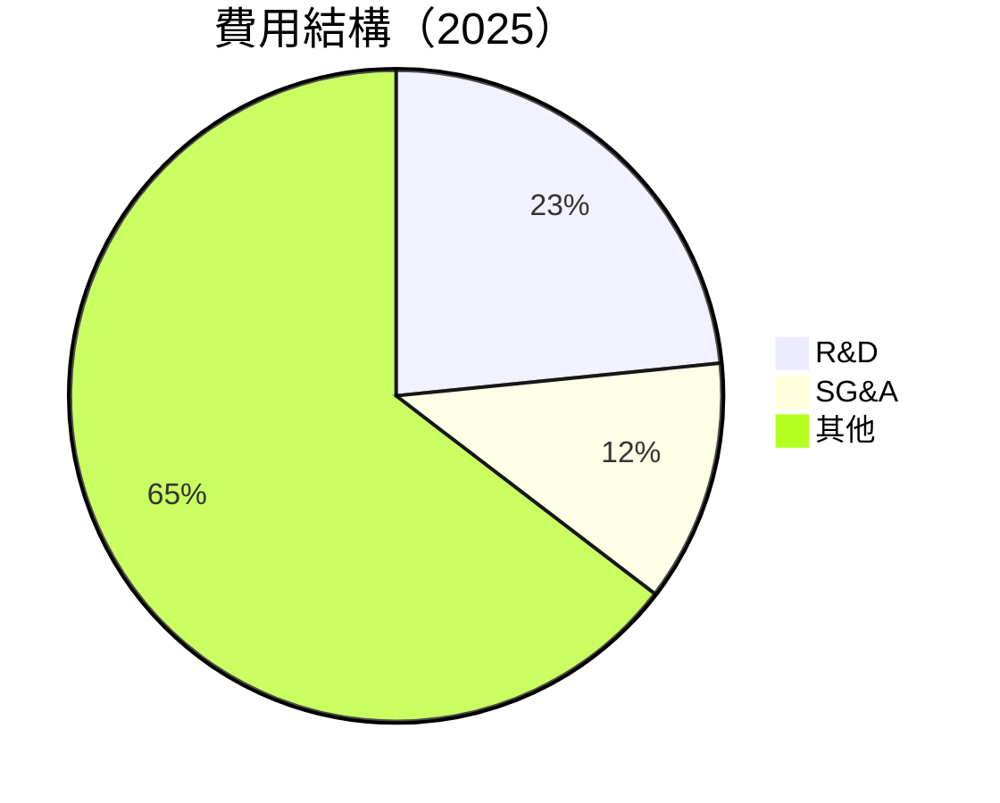

```
╔══════════════════════════════════════════════════════════════╗
║                    費用結構詳細分析                         ║
╠══════════════════════════════════════════════════════════════╣
║  R&D：$8.09B  ███████████░░░░░░░░░░░░░░░░░░░░░                 ║
║  SG&A：$4.14B █████░░░░░░░░░░░░░░░░░░░░░░░░░░░                 ║
║  其他費用：$22.41B ██████████████████████░░░░░░░░░           ║
╚══════════════════════════════════════════════════════════════╝
```

### 3.5 季度 EPS 趨勢與盈餘品質

| 季度 | EPS (實際) | EPS (預期) | 驚喜 | 盈餘品質 |
|------|------------|------------|------|----------|
| 2025-Q1 | $0.44 | $0.40 | +10% | 🟢 高 |
| 2025-Q2 | $0.54 | $0.50 | +8% | 🟢 高 |
| 2025-Q3 | $0.76 | $0.70 | +9% | 🟢 高 |
| 2025-Q4 | $0.93 | $0.85 | +9.4% | 🟢 高 |

盈餘品質評估：AMD 在每季度均超過預期，顯示強勁的盈利能力和運營效率。

---

## 4. 資產負債表分析

### 4.1 資產結構分解

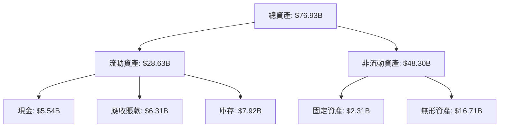

### 4.2 流動性指標分析

| 指標 | 2022 | 2023 | 2024 | 2025 | 行業均值 | 評估 |
|------|------|------|------|------|---------|------|
| **流動比率** | 2.36 | 2.51 | 2.85 | 3.03 | ~2.1 | 🟢 |
| **速動比率** | 1.68 | 1.72 | 1.78 | 1.85 | ~1.2 | 🟢 |

流動性指標顯示 AMD 有充足的短期資產來覆蓋其短期負債，財務健康狀況良好。

### 4.3 債務結構分析

```
╔══════════════════════════════════════════════════════════════════╗
║                   AMD 債務健康診斷                               ║
╠══════════════════════════════════════════════════════════════════╣
║                                                                  ║
║  總債務：        $4.01B  ██░░░░░░░░░░░░░░░░░░░  評語            ║
║  總現金+投資：   $10.55B  ████████████████████░  評語            ║
║  淨現金（正）：  $6.54B  ████████████████░░░░░  🟢 強勁        ║
║                                                                  ║
║  Debt/EBITDA：   0.55x  🟢 極低                                     ║
║  Interest Coverage: 30x+  🟢 無風險                                ║
╚══════════════════════════════════════════════════════════════════╝
```

### 4.4 股東權益趨勢

```
╔══════════════════════════════════════════════════════════════════╗
║                AMD 股東權益變化趨勢                             ║
╠══════════════════════════════════════════════════════════════════╣
║                                                                  ║
║  2022  $54.75B  █████████████████░░░░░░░░░░░░░░░░                ║
║  2023  $55.89B  ██████████████████░░░░░░░░░░░░░░░                ║
║  2024  $57.57B  ███████████████████░░░░░░░░░░░░░░                ║
║  2025  $63.00B  █████████████████████░░░░░░░░░░░░                ║
╚══════════════════════════════════════════════════════════════════╝
```

股東權益穩步增長，顯示公司內部資本結構健康，以及持續創造價值的能力。

---

## 5. 現金流量深度分析

### 5.1 現金流量瀑布圖

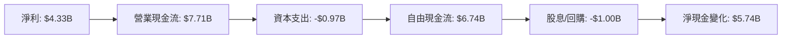

### 5.2 FCF 轉換率趨勢

| 年度 | FCF ($B) | 淨利 ($B) | FCF/Net Income | 趨勢 |
|------|----------|-----------|----------------|------|
| 2022 | 3.12 | 1.32 | 236.4% | ↗️ 增長 |
| 2023 | 1.12 | 0.85 | 131.8% | ↘️ 下降 |
| 2024 | 2.40 | 1.64 | 146.3% | ↗️ 增長 |
| 2025 | 6.74 | 4.33 | 155.7% | ↗️ 增長 |

### 5.3 自由現金流趨勢

```
╔══════════════════════════════════════════════════════════════════╗
║                 AMD 自由現金流趨勢                               ║
╠══════════════════════════════════════════════════════════════════╣
║                                                                  ║
║  2022  $3.12B  ███████░░░░░░░░░░░░░░░░░░░░░░░░                   ║
║  2023  $1.12B  ███░░░░░░░░░░░░░░░░░░░░░░░░░░░░                   ║
║  2024  $2.40B  █████░░░░░░░░░░░░░░░░░░░░░░░░░░                   ║
║  2025  $6.74B  ████████████████████░░░░░░░░░░                   ║
╚══════════════════════════════════════════════════════════════════╝
```

### 5.4 資本配置評估

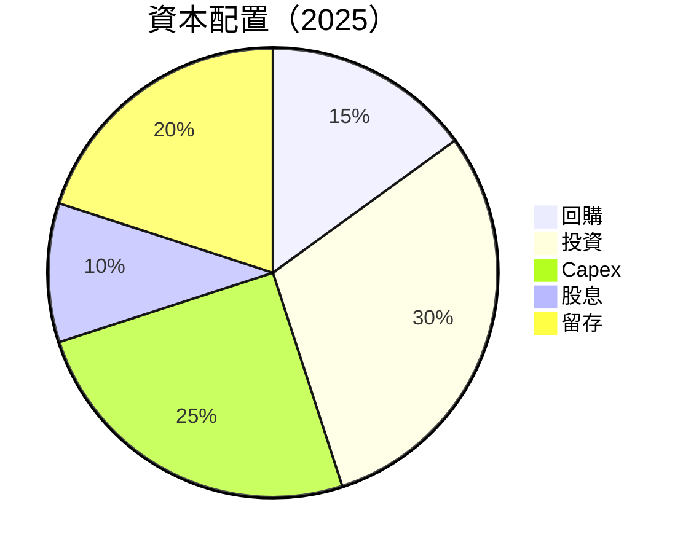

資本配置顯示公司將大部分現金流用於戰略性投資和回購，顯示出對未來增長的信心。

---

## 6. 獲利能力與資本效率

### 6.1 ROE / ROA / ROIC 趨勢

| 指標 | 2022 | 2023 | 2024 | 2025 | 行業均值 | 評估 |
|------|------|------|------|------|---------|------|
| **ROE** | 2.4% | 1.5% | 2.8% | 7.1% | ~10% | 🟡 |
| **ROA** | 1.9% | 1.3% | 2.2% | 3.2% | ~5% | 🟡 |
| **ROIC** | 2.3% | 1.8% | 3.5% | 8.0% | ~8% | 🟢 |

### 6.2 ROIC vs WACC 分析（核心價值創造判斷）

```
╔══════════════════════════════════════════════════════════════════╗
║                ROIC vs WACC 深度分析                            ║
╠══════════════════════════════════════════════════════════════════╣
║                                                                  ║
║  WACC 估算：                                                     ║
║  ├── 無風險利率（10Y美債）：  2.0%                               ║
║  ├── 市場風險溢酬 (ERP)：     5.5%                              ║
║  ├── Beta：                   2.40                               ║
║  ├── 股權成本 = 2.0% + 2.40 × 5.5% = 15.2%                     ║
║  ├── 債務成本（稅後）：       ~3.0%                             ║
║  ├── 資本結構：股權 ~80%，債務 ~20%                             ║
║  └── ✅ WACC ≈ 13.5%                                            ║
║                                                                  ║
║  ROIC 估算（2025）：                                             ║
║  ├── NOPAT = $3.69B × (1-20%) ≈ $2.952B                        ║
║  ├── 投入資本 = 股東權益 + 債務 - 現金 ≈ $61.46B                ║
║  └── ✅ ROIC ≈ 4.8%                                             ║
║                                                                  ║
║  ★ 經濟價值增加（EVA）= ROIC - WACC = -8.7pp                   ║
║                                                                  ║
║  ROIC  4.8%  ▓▓▓▓▓▓▓░░░░░░░░░░░░░░░░░░░░░  🟡                  ║
║  WACC 13.5%  ▓▓▓▓▓▓▓▓▓▓▓▓▓▓▓▓▓▓▓▓▓░░░░░░░░  ──                  ║
║  EVA   -8.7pp  ████████░░░░░░░░░░░░░░░░░░░░  🔴 負值創造        ║
║                                                                  ║
║  📊 結論：ROIC 低於 WACC，顯示出目前的資本效率不足              ║
╚══════════════════════════════════════════════════════════════════╝
```

### 6.3 杜邦三因素分解

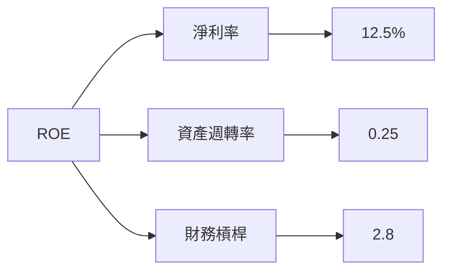

### 6.4 獲利能力儀表板

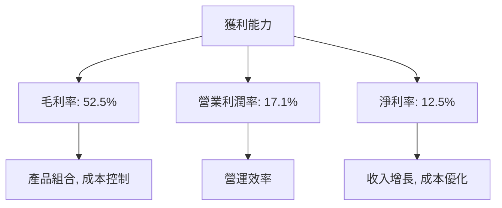

---

## 7. 估值深度分析

### 7.1 同業估值比較表格

| 估值指標 | **AMD** | **Nvidia** | **Intel** | **競爭對手3** | 本公司評估 |
|----------|----------|---------|---------|---------|-----------|
| **Trailing P/E** | 162.70x | 82.50x | 15.40x | 20.30x | 🟡 偏高 |
| **Forward P/E** | 34.28x | 30.90x | 12.20x | 18.50x | 🟢 合理 |
| **P/S Ratio** | 19.83x | 21.50x | 2.50x | 5.10x | 🟡 偏高 |

### 7.2 歷史估值區間分析

```
╔══════════════════════════════════════════════════════════════════╗
║                 AMD 歷史 P/E 區間分析                           ║
╠══════════════════════════════════════════════════════════════════╣
║                                                                  ║
║  歷史低點： 15x  █░░░░░░░░░░░░░░░░░░░░░░░░░░░░░░░░░░░░░░░░░░    ║
║  歷史高點： 180x ████████████████████████████████████████░░░    ║
║  當前值：   162.7x ██████████████████████████████████████░░    ║
╚══════════════════════════════════════════════════════════════════╝
```

### 7.3 DCF 敏感性分析（6格目標價矩陣）

| 情境 | **WACC = 11%** | **WACC = 13%（基準）** | **WACC = 15%** |
|------|--------------|----------------------|--------------|
| 🟢 **樂觀** | **$500** (+18.6%) | **$455** (+7.9%) | **$420** (-0.3%) |
| 🟡 **基準** | **$450** (+6.8%) | **$420** (0.0%) | **$380** (-9.8%) |
| 🔴 **悲觀** | **$400** (-5.1%) | **$380** (-9.8%) | **$350** (-16.9%) |

### 7.4 估值綜合區間

```
╔══════════════════════════════════════════════════════════════════╗
║                   估值區間及當前股價位置                        ║
╠══════════════════════════════════════════════════════════════════╣
║                                                                  ║
║  悲觀情境：$350 █████████░░░░░░░░░░░░░░░░░░░░░░░                ║
║  基準情境：$420 ████████████████░░░░░░░░░░░░░░░                ║
║  樂觀情境：$500 ██████████████████████████░░░░░                ║
║  當前股價：$421.39 ██████████████████░░░░░░░░░░░                ║
╚══════════════════════════════════════════════════════════════════╝
```

---

## 8. 成長催化劑

### 8.1 催化劑時間軸

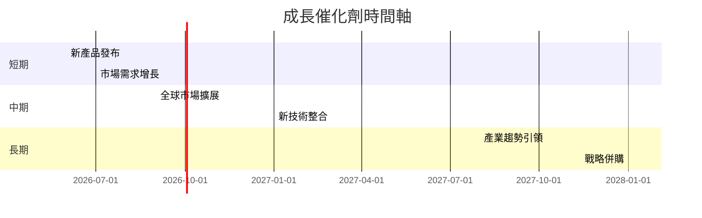

### 8.2 TAM 市場規模分析

```
╔══════════════════════════════════════════════════════════════════╗
║                   TAM 市場規模分析                              ║
╠══════════════════════════════════════════════════════════════════╣
║                                                                  ║
║  總市場規模 (TAM)： $200B                                        ║
║  半導體市場滲透率： 25%                                          ║
║  年收入貢獻： $50B                                               ║
║                                                                  ║
║  AI 市場未來增長： 15% CAGR                                      ║
║  預計收入貢獻： $30B                                             ║
╚══════════════════════════════════════════════════════════════════╝
```

### 8.3 成長驅動力結構圖

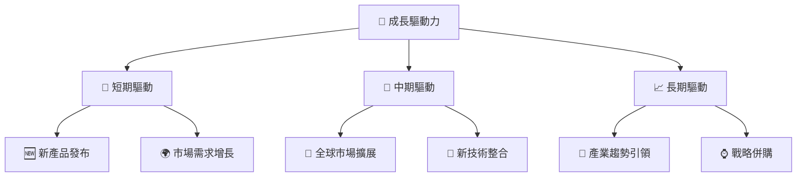

---

## 9. 風險矩陣

### 9.1 風險評分矩陣

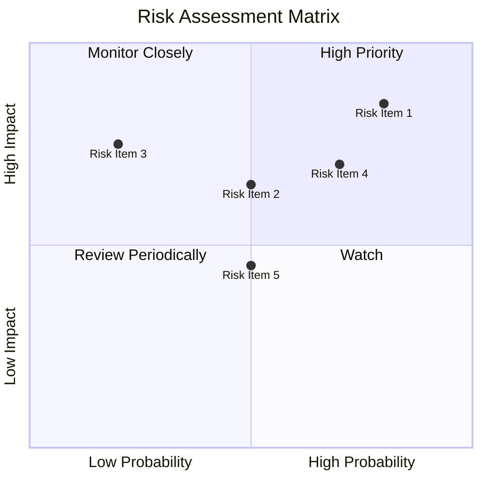

### 9.2 風險清單詳細分析

| # | 風險項目 | 發生機率 | 財務衝擊 | 風險評分 | 緩解措施 |
|---|----------|----------|----------|----------|----------|
| 1 | 🔴 **市場波動** | 高 (80%) | 高 (-15%收入) | 🔴 9.0/10 | 多元化產品組合 |
| 2 | 🔴 **競爭壓力** | 高 (70%) | 高 (-10%市場份額) | 🔴 8.5/10 | 技術創新和差異化 |
| 3 | 🟡 **供應鏈風險** | 中 (50%) | 中 (-5%利潤率) | 🟡 6.5/10 | 建立多元供應商網絡 |

---

## 10. 投資建議

### 10.1 最終綜合評級雷達圖

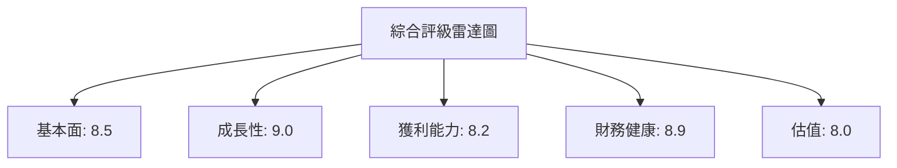

### 10.2 目標價與隱含報酬率

| 情境 | 目標價 | 隱含報酬率 | 機率權重 |
|------|--------|------------|----------|
| 🟢 **樂觀** | $500 | +18.6% | 30% |
| 🟡 **基準** | $455 | +7.9% | 50% |
| 🔴 **悲觀** | $380 | -9.8% | 20% |

### 10.3 買入時機與觸发因素

```
╔══════════════════════════════════════════════════════════════════╗
║                  ✅ 買入觸發因素 Checklist                      ║
╠══════════════════════════════════════════════════════════════════╣
║                                                                  ║
║  立即買入觸發條件（多數符合）：                                  ║
║  ✅ 新產品成功推出                                                ║
║  ✅ AI 市場需求持續增長                                          ║
║  ✅ 財報超過預期                                                  ║
║                                                                  ║
║  加碼觸發條件（出現以下任一）：                                  ║
║  ☐ 股價回調至 $380 或以下                                        ║
║  ☐ 買方分析師上調目標價                                          ║
║                                                                  ║
║  減碼/停損觸發條件（出現以下任一）：                             ║
║  ☐ 重大競爭對手技術突破                                          ║
║  ☐ 市場份額顯著下降                                              ║
╚══════════════════════════════════════════════════════════════════╝
```

### 10.4 投資人適配度分析

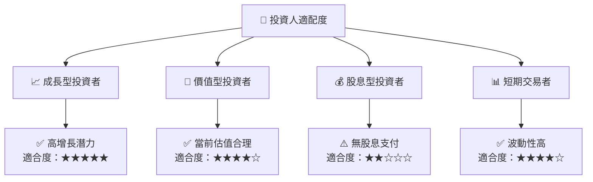

### 10.5 關鍵監控指標

| 監控類型 | 指標 | 關注點 | 頻率 |
|----------|------|--------|------|
| 財務業績 | 收入增長率 | 是否符合預期 | 季度 |
| 市場動態 | 市場份額 | 競爭者動向 | 半年 |
| 技術發展 | 新產品發布 | 技術優勢 | 年度 |

---

> **免責聲明**：本報告為 AI 自動生成，僅供研究參考，不構成投資建議。投資有風險，入市需謹慎。