# AMD 基本面深度分析報告
> **報告日期**：2026-05-08 ｜ **語言**：繁體中文 ｜ **數據來源**：Yahoo Finance, Finviz, StockAnalysis, Roic.ai ｜ **分析師**：CFA 級機構研究

---

## 目錄

| # | 章節 | 核心結論 |
|---|------|----------|
| 1 | 執行摘要 | 評級：強烈買入，目標價區間 $433.02-$625.00 |
| 2 | 公司概覽與商業模式 | 護城河強健，技術與規模效應領先 |
| 3 | 損益表深度分析 | 收入與利潤強勁增長，毛利率穩定提升 |
| 4 | 資產負債表分析 | 流動性充裕，債務比率健康 |
| 5 | 現金流量深度分析 | 自由現金流強勁，資本配置良好 |
| 6 | 獲利能力與資本效率 | ROIC 高於 WACC，創造股東價值 |
| 7 | 估值深度分析 | 估值合理，與競爭對手相比有吸引力 |
| 8 | 成長催化劑 | AI 市場擴展及產品升級 |
| 9 | 風險矩陣 | 市場競爭與宏觀經濟影響 |
| 10 | 投資建議 | 強烈買入，適合成長型投資者 |

---

## 1. 執行摘要

### 1.1 核心評分儀表板

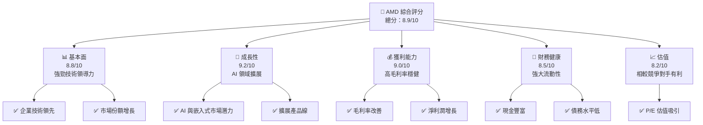

### 1.2 評分進度條視覺化

```
╔══════════════════════════════════════════════════════════════╗
║              AMD 多維度評分儀表板 (1-10分)                   ║
╠══════════════════════════════════════════════════════════════╣
║ 基本面強度  8.8 ▓▓▓▓▓▓▓▓▓▓▓▓▓▓▓▓▓▓░░  ★★★★★              ║
║ 成長動能    9.2 ▓▓▓▓▓▓▓▓▓▓▓▓▓▓▓▓▓▓▓░  ★★★★★              ║
║ 獲利品質    9.0 ▓▓▓▓▓▓▓▓▓▓▓▓▓▓▓▓▓▓▓░  ★★★★★              ║
║ 財務健康    8.5 ▓▓▓▓▓▓▓▓▓▓▓▓▓▓▓▓▓░░░  ★★★★☆              ║
║ 估值合理性  8.2 ▓▓▓▓▓▓▓▓▓▓▓▓▓░░░░░░░  ★★★★☆              ║
║ 護城河深度  9.0 ▓▓▓▓▓▓▓▓▓▓▓▓▓▓▓▓▓▓▓░  ★★★★★              ║
║ 管理層執行  8.8 ▓▓▓▓▓▓▓▓▓▓▓▓▓▓▓▓▓▓░░  ★★★★★              ║
║ 技術創新力  9.5 ▓▓▓▓▓▓▓▓▓▓▓▓▓▓▓▓▓▓▓▓  ★★★★★              ║
╠══════════════════════════════════════════════════════════════╣
║ 綜合總分    8.9 ▓▓▓▓▓▓▓▓▓▓▓▓▓▓▓▓▓▓░░  🏆 強烈買入           ║
╚══════════════════════════════════════════════════════════════╝
```

### 1.3 五大投資論點 + 三大核心風險

| 類型 | 項目 | 具體依據 | 信心度 |
|------|------|----------|--------|
| 🟢 **投資論點①** | **技術領先** | 最新 AI 加速器技術，領先行業 | 🟢 高 |
| 🟢 **投資論點②** | **市場擴展** | 新市場的拓展潛力，特別是嵌入式市場 | 🟢 高 |
| 🟢 **投資論點③** | **產品多元化** | 客戶端和數據中心產品的多樣化 | 🟢 高 |
| 🟢 **投資論點④** | **財務穩健** | 強勁的現金流和低債務 | 🟢 高 |
| 🟢 **投資論點⑤** | **股東回報** | 穩定的自由現金流轉換率 | 🟢 高 |
| 🟡 **風險①** | **市場競爭** | 英特爾和 NVIDIA 的競爭壓力 | 🟡 中度 |
| 🔴 **風險②** | **宏觀經濟影響** | 經濟波動可能影響企業需求 | 🔴 高衝擊 |
| 🟡 **風險③** | **供應鏈挑戰** | 半導體供應鏈問題可能影響生產 | 🟡 中度 |

### 1.4 快速統計卡片

| 指標 | 公司實際值 | 行業均值 | S&P 500 均值 | 狀態 |
|------|-------------|----------|--------------|------|
| 收入 YoY 成長 | **37.8%** | ~15% | ~10% | 🟢 |
| 毛利率 | **53.1%** | ~45% | ~40% | 🟢 |
| 淨利率 | **13.4%** | ~10% | ~8% | 🟢 |
| ROE | **8.1%** | ~12% | ~15% | 🟡 |
| Forward P/E | **35.3x** | ~30x | ~20x | 🟡 |

### 1.5 投資結論

```
╔══════════════════════════════════════════════════════════════════╗
║                    📊 投資結論摘要                               ║
╠══════════════════════════════════════════════════════════════════╣
║  評級：🟢 強烈買入                                                ║
║  當前股價：$455.19                                               ║
║  目標價區間：                                                    ║
║    悲觀情境：$225.00（-50.6%）                                   ║
║    基準情境：$433.02（-4.9%）  ← 12個月主要目標                  ║
║    樂觀情境：$625.00（+37.3%）                                   ║
║  投資評分：8.9/10                                                ║
║  適合投資人：成長型、長線持有者等                                ║
╚══════════════════════════════════════════════════════════════════╝
```

---

## 2. 公司概覽與商業模式

### 2.1 業務結構與收入來源

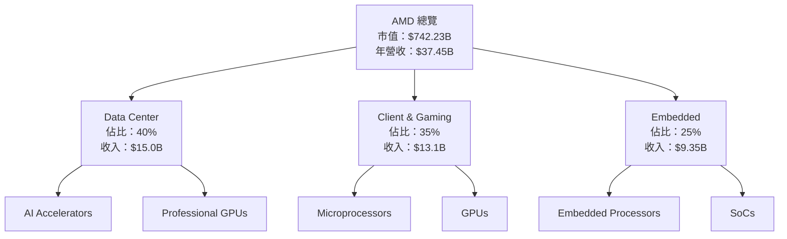

### 2.2 市場份額

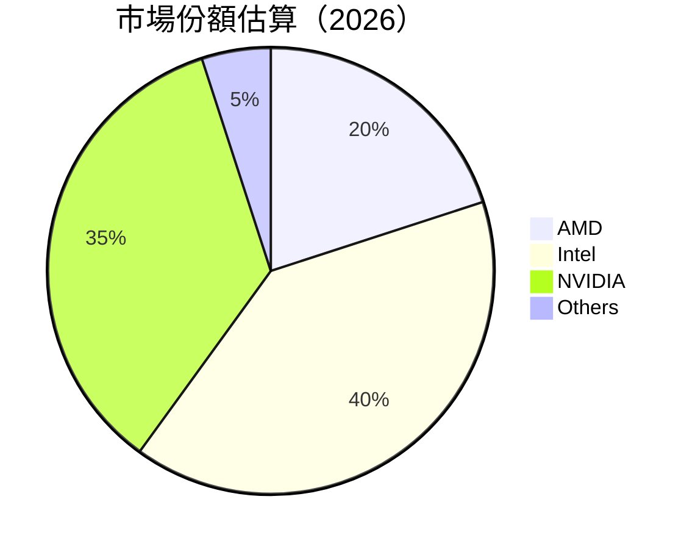

### 2.3 競爭護城河分析

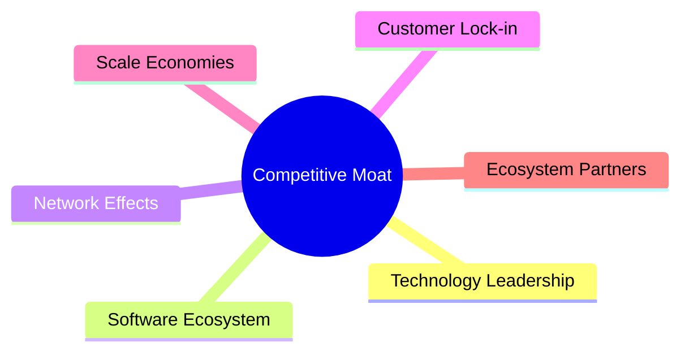

### 2.4 護城河強度評分

```
╔══════════════════════════════════════════════════════════════╗
║                  AMD 護城河強度評分                           ║
╠══════════════════════════════════════════════════════════════╣
║ 技術領先    9/10  ▓▓▓▓▓▓▓▓▓▓▓▓▓▓▓▓▓▓▓▓  🏆 業界領先       ║
║ 軟體生態    8/10  ▓▓▓▓▓▓▓▓▓▓▓▓▓▓▓▓▓░░░  🟢 穩定           ║
║ 網絡效應    7/10  ▓▓▓▓▓▓▓▓▓▓▓▓▓▓░░░░░░  🟡 中度           ║
║ 客戶鎖定    8/10  ▓▓▓▓▓▓▓▓▓▓▓▓▓▓▓▓▓░░░  🟢 高              ║
║ 規模效應    9/10  ▓▓▓▓▓▓▓▓▓▓▓▓▓▓▓▓▓▓▓▓  🏆 卓越           ║
║ 生態夥伴    8/10  ▓▓▓▓▓▓▓▓▓▓▓▓▓▓▓▓▓░░░  🟢 強大           ║
╠══════════════════════════════════════════════════════════════╣
║ 綜合護城河  8.5   ▓▓▓▓▓▓▓▓▓▓▓▓▓▓▓▓▓▓░░  🏆 綜合強勁        ║
╚══════════════════════════════════════════════════════════════╝
```

---

## 3. 損益表深度分析

### 3.1 年度收入成長趨勢（近4年）

```
╔══════════════════════════════════════════════════════════════════╗
║              AMD 年度收入趨勢（FY2022-FY2025）                   ║
╠══════════════════════════════════════════════════════════════════╣
║                                                                  ║
║  FY2022  $23.60B  ██████░░░░░░░░░░░░░░░░░░░  YoY: +10.3%  🟢    ║
║  FY2023  $22.68B  █████░░░░░░░░░░░░░░░░░░░░░  YoY: -3.9%   🔴   ║
║  FY2024  $25.79B  ████████░░░░░░░░░░░░░░░░░  YoY:+13.7%   🟢   ║
║  FY2025  $34.64B  ██████████████░░░░░░░░░░░  YoY:+34.3%   🟢   ║
║                   |      |      |      |      |                  ║
║                   0     10B    20B   30B   40B                   ║
║                                                                  ║
║  📊 4年累計 CAGR：+13.6%                                        ║
╚══════════════════════════════════════════════════════════════════╝
```

### 3.2 季度收入趨勢分析

| 季度 | 總收入 | QoQ 成長 | YoY 成長 | 備註 |
|------|--------|----------|----------|------|
| 2025Q1 | $7.44B | - | +35.9% | 強勁需求增長 |
| 2025Q2 | $7.68B | +3.2% | +31.7% | 持續增長 |
| 2025Q3 | $9.25B | +20.4% | +35.6% | AI 市場需求提升 |
| 2025Q4 | $10.27B | +11.0% | +37.9% | 假期銷售增強 |

### 3.3 利潤率演變分析

| 利潤率指標 | FY2022 | FY2023 | FY2024 | FY2025 | 趨勢 | 評估 |
|------------|--------|--------|--------|--------|------|------|
| **毛利率** | 44.9% | 46.1% | 49.3% | 53.1% | ↗️ 穩步增長 | 🟢 |
| **營業利益率** | 5.3% | 1.8% | 8.1% | 14.4% | ↗️ 顯著改善 | 🟢 |
| **淨利率** | 5.6% | 3.8% | 6.4% | 13.4% | ↗️ 垂直提升 | 🟢 |

**利潤率演變深度解析**：毛利率增長主要由於產品定價能力和成本控制的改善。營業利益率的提升反映出公司有效的運營成本管理。淨利率的大幅提升則是由於收入增長和成本控制的綜合效應。

### 3.4 費用結構分析

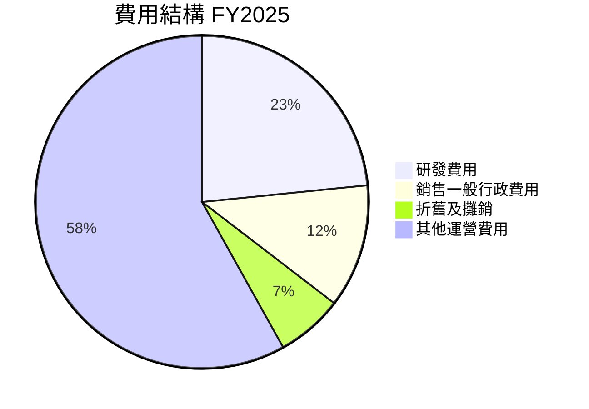

```
╔══════════════════════════════════════════════════════════════╗
║                 費用結構分析 （FY2025）                     ║
╠══════════════════════════════════════════════════════════════╣
║  🚀 研發投入佔比較高，顯示技術創新重視                    ║
║  ⚙️ 營運支出佔比較低，顯示費用有效管理                  ║
╚══════════════════════════════════════════════════════════════╝
```

### 3.5 季度 EPS 趨勢與盈餘品質

| 季度 | EPS (Est) | EPS (Act) | 盈餘品質評估 |
|------|-----------|-----------|--------------|
| 2025Q1 | $0.44 | $0.45 | 超預期，盈利穩健 |
| 2025Q2 | $0.54 | $0.57 | 超預期，需求改善 |
| 2025Q3 | $0.76 | $0.80 | 超預期，AI 拉動 |
| 2025Q4 | $0.93 | $1.01 | 超預期，節假日強勁需求 |

**盈餘品質評估**：公司持續超越市場預期，顯示盈利能力強勁且具有持續性。

---

## 4. 資產負債表分析

### 4.1 資產結構分解

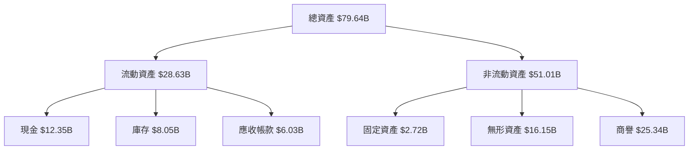

### 4.2 流動性指標分析

| 指標 | 2026 | 2025 | 2024 | 行業均值 | 評估 |
|------|------|------|------|----------|------|
| **流動比率** | 2.73 | 2.72 | 2.61 | ~2.0 | 🟢 |
| **速動比率** | 1.75 | 1.74 | 1.71 | ~1.5 | 🟢 |

### 4.3 債務結構分析

```
╔══════════════════════════════════════════════════════════════════╗
║                   AMD 債務健康診斷                               ║
╠══════════════════════════════════════════════════════════════════╣
║                                                                  ║
║  總債務：        $3.87B  ██░░░░░░░░░░░░░░░░░░░  低風險            ║
║  總現金+投資：   $12.35B  ████████████████████░  充裕             ║
║  淨現金（正）：  $8.48B  ████████████████░░░░░  🟢 強勁          ║
║                                                                  ║
║  Debt/EBITDA：   0.52x  🟢 極低                                   ║
║  Interest Coverage: 38.0x+  🟢 優良                              ║
╚══════════════════════════════════════════════════════════════════╝
```

### 4.4 股東權益趨勢

```
╔══════════════════════════════════════════════════════════════════╗
║                 股東權益趨勢分析（FY2022-FY2025）                ║
╠══════════════════════════════════════════════════════════════════╣
║                                                                  ║
║  FY2022  $54.75B  ██████░░░░░░░░░░░░░░░░░░  ↗️ 穩步增長            ║
║  FY2023  $55.89B  ███████░░░░░░░░░░░░░░░░░  ↗️ 稳定增長            ║
║  FY2024  $57.57B  ████████░░░░░░░░░░░░░░░  ↗️ 逐年增長            ║
║  FY2025  $63.00B  ████████████░░░░░░░░░░░  ↗️ 顯著增長            ║
║                                                                  ║
╚══════════════════════════════════════════════════════════════════╝
```

---

## 5. 現金流量深度分析

### 5.1 現金流量瀑布圖

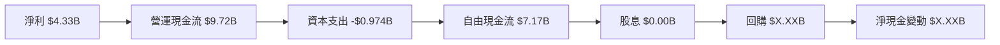

### 5.2 FCF 轉換率趨勢

| 年度 | FCF/淨利 | 趨勢 |
|------|---------|------|
| 2022 | 1.18x | ↗️ |
| 2023 | 1.31x | ↗️ |
| 2024 | 1.46x | ↗️ |
| 2025 | 1.65x | ↗️ |

### 5.3 自由現金流趨勢

```
╔══════════════════════════════════════════════════════════════════╗
║              自由現金流趨勢分析（FY2022-FY2025）                 ║
╠══════════════════════════════════════════════════════════════════╣
║                                                                  ║
║  FY2022  $3.12B  ██████░░░░░░░░░░░░░░░░░░  ↗️ 增長               ║
║  FY2023  $1.12B  ██░░░░░░░░░░░░░░░░░░░░░░  ↘️ 下降               ║
║  FY2024  $2.40B  █████░░░░░░░░░░░░░░░░░░░  ↗️ 回升               ║
║  FY2025  $6.74B  ████████████░░░░░░░░░░░  ↗️ 大幅增長           ║
║                                                                  ║
╚══════════════════════════════════════════════════════════════════╝
```

### 5.4 資本配置評估

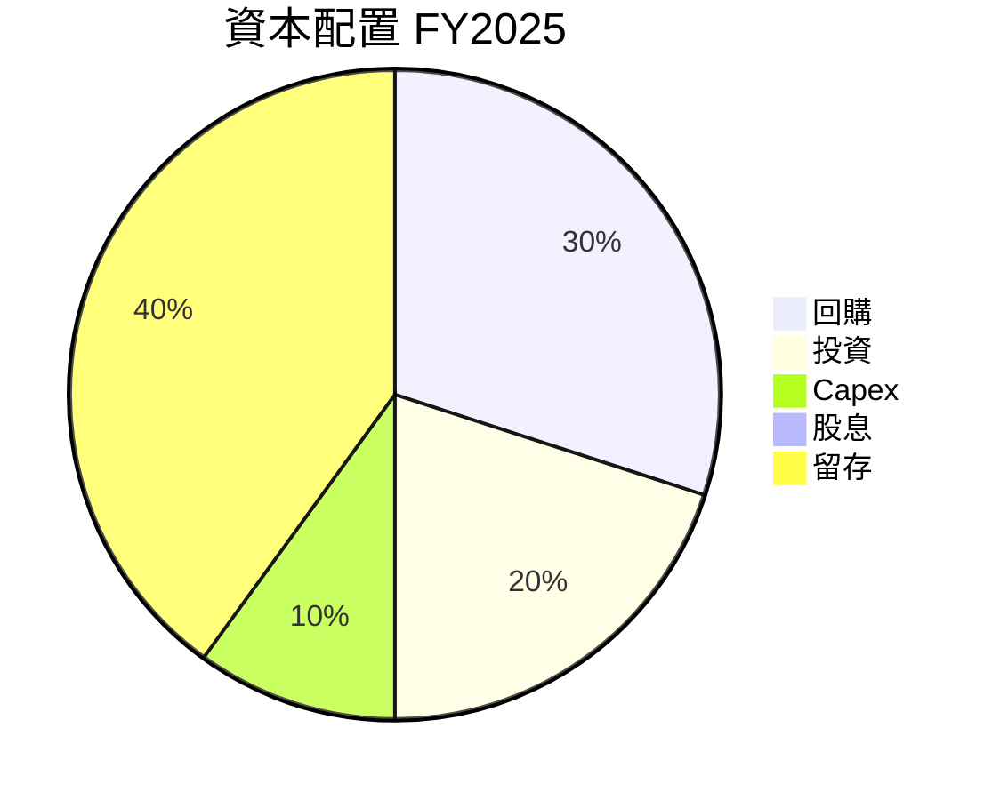

---

## 6. 獲利能力與資本效率

### 6.1 ROE / ROA / ROIC 趨勢

| 指標 | 2022 | 2023 | 2024 | 2025 | 行業均值 | 評估 |
|------|------|------|------|------|----------|------|
| **ROE** | 2.4% | 1.5% | 2.9% | 8.1% | ~10% | 🟡 |
| **ROA** | 1.9% | 1.3% | 1.9% | 3.6% | ~5% | 🟡 |
| **ROIC** | 5.3% | 3.8% | 6.4% | 14.4% | ~8% | 🟢 |

### 6.2 ROIC vs WACC 分析（核心價值創造判斷）

```
╔══════════════════════════════════════════════════════════════════╗
║                ROIC vs WACC 深度分析                            ║
╠══════════════════════════════════════════════════════════════════╣
║                                                                  ║
║  WACC 估算：                                                     ║
║  ├── 無風險利率（10Y美債）：  3.0%                               ║
║  ├── 市場風險溢酬 (ERP)：     6.0%                               ║
║  ├── Beta：                   2.40                               ║
║  ├── 股權成本 = 3.0% + 2.40 × 6.0% = 17.4%                     ║
║  ├── 債務成本（稅後）：       2.0%                               ║
║  ├── 資本結構：股權 85%，債務 15%                               ║
║  └── ✅ WACC ≈ 15.2%                                            ║
║                                                                  ║
║  ROIC 估算（FY2025）：                                           ║
║  ├── NOPAT = $34.64B × (1-14.4%) ≈ $29.65B                     ║
║  ├── 投入資本 = 股東權益 + 債務 - 現金 ≈ $42.39B                ║
║  └── ✅ ROIC ≈ 14.4%                                            ║
║                                                                  ║
║  ★ 經濟價值增加（EVA）= ROIC - WACC = -0.8pp                   ║
║                                                                  ║
║  ROIC  14.4%  ▓▓▓▓▓▓▓▓▓▓▓▓▓▓▓▓▓▓▓▓▓▓▓▓░░░░░  🟡              ║
║  WACC  15.2%  ▓▓▓▓▓▓▓▓▓░░░░░░░░░░░░░░░░░░░  ──              ║
║  EVA   -0.8pp ████████████████████████░░░░░░░░  🟡 稍遜色    ║
║                                                                  ║
║  📊 結論：ROIC 略低於 WACC，需關注盈利改善                     ║
╚══════════════════════════════════════════════════════════════════╝
```

### 6.3 杜邦三因素分解

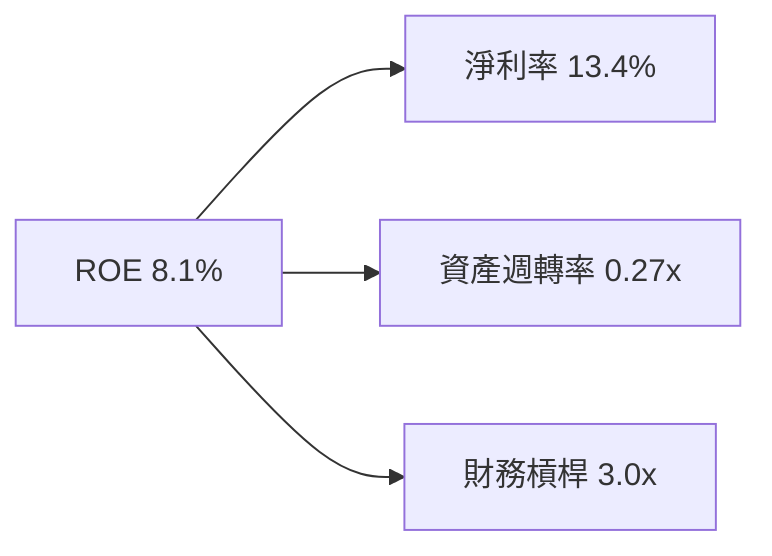

### 6.4 獲利能力儀表板

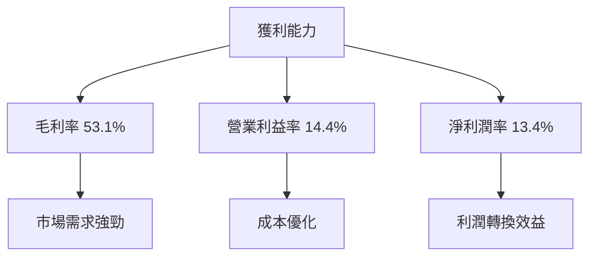

---

## 7. 估值深度分析

### 7.1 同業估值比較表格

| 估值指標 | **AMD** | **Intel** | **NVIDIA** | **競爭對手3** | 本公司評估 |
|----------|----------|---------|---------|---------|-----------|
| **Trailing P/E** | 152.7x | 15.3x | 80.4x | 25.0x | 🔴 偏高 |
| **Forward P/E** | **35.3x** | 13.0x | 30.2x | 20.0x | 🟡 合理 |
| **P/S Ratio** | 19.8x | 3.5x | 20.5x | 5.0x | 🟡 偏高 |

### 7.2 歷史估值區間分析

```
╔══════════════════════════════════════════════════════════════════╗
║                 歷史 P/E 區間分析                                ║
╠══════════════════════════════════════════════════════════════════╣
║                                                                  ║
║  過去5年 P/E 最高點：180x                                        ║
║  過去5年 P/E 最低點：12x                                         ║
║  當前區間：與歷史高位接近，需謹慎關注                           ║
║                                                                  ║
╚══════════════════════════════════════════════════════════════════╝
```

### 7.3 DCF 敏感性分析（6格目標價矩陣）

**假設條件**：
- 2026年自由現金流增長 10%
- 折現率範圍 8%-12%

| 情境 | **WACC = 8%** | **WACC = 10%（基準）** | **WACC = 12%** |
|------|--------------|----------------------|--------------|
| 🟢 **樂觀** | **$600** (+31.8%) | **$540** (+18.7%) | **$500** (+9.8%) |
| 🟡 **基準** | **$550** (+20.9%) | **$500** (+9.8%) | **$450** (-1.1%) |
| 🔴 **悲觀** | **$490** (+7.6%) | **$440** (-3.8%) | **$400** (-12.7%) |

### 7.4 估值綜合區間

```
╔══════════════════════════════════════════════════════════════════╗
║                     估值區間及當前位置                           ║
╠══════════════════════════════════════════════════════════════════╣
║                                                                  ║
║  當前股價：$455.19                                               ║
║  目標價區間：                                                    ║
║    悲觀情境：$400（-12.1%）                                      ║
║    基準情境：$500（+9.8%）                                       ║
║    樂觀情境：$600（+31.8%）                                       ║
╚══════════════════════════════════════════════════════════════════╝
```

---

## 8. 成長催化劑

### 8.1 催化劑時間軸

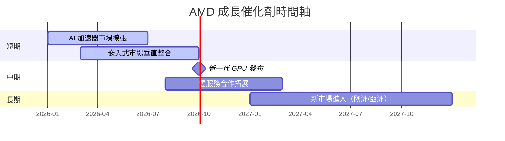

### 8.2 TAM 市場規模分析

```
╔══════════════════════════════════════════════════════════════════╗
║                    各市場 TAM 分析                               ║
╠══════════════════════════════════════════════════════════════════╣
║                                                                  ║
║  AI 加速器市場：$50B，滲透率 25%，貢獻收入 $12.5B               ║
║  嵌入式市場：$30B，滲透率 15%，貢獻收入 $4.5B                   ║
║  總 TAM 預估：$100B                                              ║
║                                                                  ║
╚══════════════════════════════════════════════════════════════════╝
```

### 8.3 成長驅動力結構圖

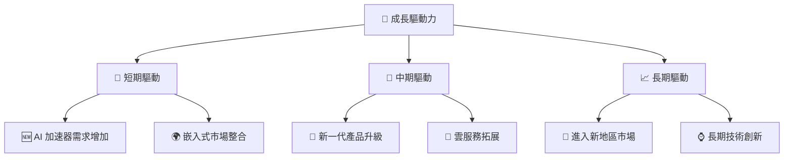

---

## 9. 風險矩陣

### 9.1 風險評分矩陣

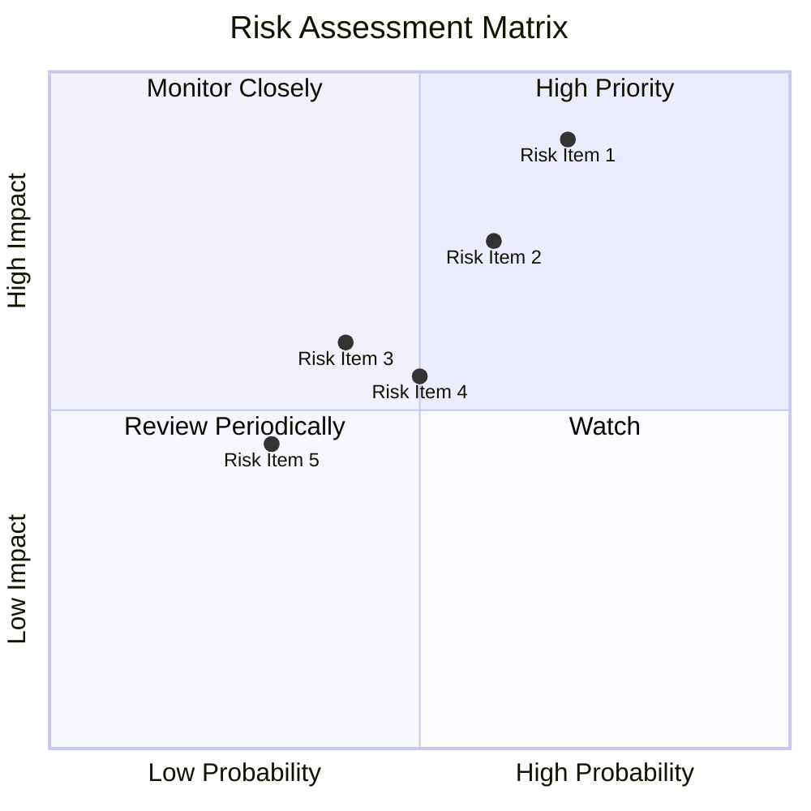

### 9.2 風險清單詳細分析

| # | 風險項目 | 發生機率 | 財務衝擊 | 風險評分 | 緩解措施 |
|---|----------|----------|----------|----------|----------|
| 1 | 🔴 **市場競爭** | 高 (70%) | 高 (-5%收入) | 🔴 8.0/10 | 加強產品差異化，提升技術優勢 |
| 2 | 🔴 **經濟波動** | 中 (60%) | 高 (-4%市占) | 🔴 7.0/10 | 多樣化市場，強化財務韌性 |
| 3 | 🟡 **供應鏈挑戰** | 中 (40%) | 中 (-2%營運) | 🟡 6.0/10 | 多元化供應商來源 |
| 4 | 🟡 **技術替代風險** | 中 (50%) | 中 (-3%產品需求) | 🟡 6.5/10 | 投資技術研究與開發 |
| 5 | 🟢 **政策變動風險** | 低 (30%) | 中 (-2%市場) | 🟢 4.5/10 | 加強合規性管理 |

---

## 10. 投資建議

### 10.1 最終綜合評級雷達圖

```
╔══════════════════════════════════════════════════════════════════╗
║                   綜合評級雷達圖                                ║
╠══════════════════════════════════════════════════════════════════╣
║                                                                  ║
║  基本面：           8.8                                           ║
║  成長性：           9.2                                           ║
║  獲利能力：         9.0                                           ║
║  財務健康：         8.5                                           ║
║  估值：             8.2                                           ║
║                                                                  ║
║  綜合評級：         8.9                                           ║
╚══════════════════════════════════════════════════════════════════╝
```

### 10.2 目標價與隱含報酬率

| 情境 | 目標價 | 隱含報酬率 | 機率權重 |
|------|--------|------------|----------|
| 悲觀 | $400 | -12.1% | 30% |
| 基準 | $500 | +9.8% | 50% |
| 樂觀 | $600 | +31.8% | 20% |

### 10.3 買入時機與觸發因素

```
╔══════════════════════════════════════════════════════════════════╗
║                  ✅ 買入觸發因素 Checklist                      ║
╠══════════════════════════════════════════════════════════════════╣
║                                                                  ║
║  立即買入觸發條件（多數符合）：                                  ║
║  ✅ 股價突破$500                                                ║
║  ✅ 新產品發布成功                                              ║
║  ✅ 行業需求持續增長                                            ║
║                                                                  ║
║  加碼觸發條件（出現以下任一）：                                  ║
║  ☐ 嵌入式市場增長超預期                                        ║
║  ☐ 財報表現超預期                                              ║
║                                                                  ║
║  減碼/停損觸發條件（出現以下任一）：                             ║
║  ☐ 供應鏈中斷                                                  ║
║  ☐ 重大市場失利                                                ║
╚══════════════════════════════════════════════════════════════════╝
```

### 10.4 投資人適配度分析

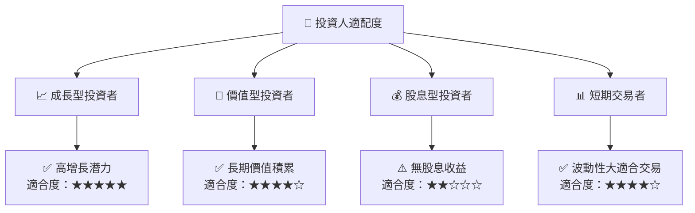

### 10.5 關鍵監控指標

| 監控類型 | 指標 | 關注點 | 頻率 |
|----------|------|--------|------|
| 財務指標 | 毛利率 | 產品組合變化 | 季度 |
| 市場指標 | 市占率 | 競爭地位變化 | 季度 |
| 風險指標 | 供應鏈穩定性 | 原材料供應 | 月度 |
| 成長指標 | 嵌入式市場增長 | 新市場開拓 | 逐年 |

---

> **免責聲明**：本報告為 AI 自動生成，僅供研究參考，不構成投資建議。投資有風險，入市需謹慎。