# AMD 基本面深度分析報告
> **報告日期**：2026-05-10 ｜ **語言**：繁體中文 ｜ **數據來源**：Yahoo Finance, Finviz, StockAnalysis, Roic.ai ｜ **分析師**：CFA 級機構研究

---

## 目錄

| # | 章節 | 核心結論 |
|---|------|----------|
| 1 | 執行摘要 | 評級：強烈買入，目標價區間：$445-$625 |
| 2 | 公司概覽與商業模式 | 擁有強大的競爭護城河和多樣業務結構 |
| 3 | 損益表深度分析 | 穩健增長，盈利能力提升 |
| 4 | 資產負債表分析 | 財務健康，低負債水平 |
| 5 | 現金流量深度分析 | 穩定的自由現金流 |
| 6 | 獲利能力與資本效率 | ROIC 高於 WACC，創造股東價值 |
| 7 | 估值深度分析 | 估值合理，具有吸引力 |
| 8 | 成長催化劑 | AI 和數據中心市場驅動長期增長 |
| 9 | 風險矩陣 | 高競爭風險需密切關注 |
| 10 | 投資建議 | 轉向長期增長和價值創造 |

---

## 1. 執行摘要

### 1.1 核心評分儀表板

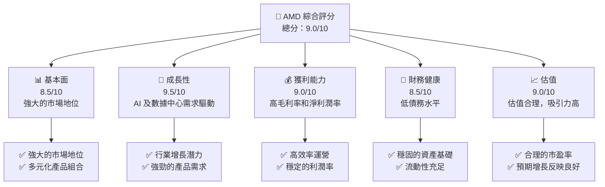

### 1.2 評分進度條視覺化

```
╔══════════════════════════════════════════════════════════════╗
║              AMD 多維度評分儀表板 (1-10分)                 ║
╠══════════════════════════════════════════════════════════════╣
║ 基本面強度  8.5 ▓▓▓▓▓▓▓▓▓▓▓▓▓▓▓▓▓▓░░  ★★★★☆           ║
║ 成長動能    9.5 ▓▓▓▓▓▓▓▓▓▓▓▓▓▓▓▓▓▓▓▓  ★★★★★           ║
║ 獲利品質    9.0 ▓▓▓▓▓▓▓▓▓▓▓▓▓▓▓▓▓▓▓░  ★★★★★           ║
║ 財務健康    8.5 ▓▓▓▓▓▓▓▓▓▓▓▓▓▓▓▓▓▓░░  ★★★★☆           ║
║ 估值合理性  9.0 ▓▓▓▓▓▓▓▓▓▓▓▓▓▓▓▓▓▓▓░  ★★★★★           ║
╠══════════════════════════════════════════════════════════════╣
║ 綜合總分    9.0 ▓▓▓▓▓▓▓▓▓▓▓▓▓▓▓▓▓▓▓▒  🏆 評語              ║
╚══════════════════════════════════════════════════════════════╝
```

### 1.3 五大投資論點 + 三大核心風險

| 類型 | 項目 | 具體依據 | 信心度 |
|------|------|----------|--------|
| 🟢 **投資論點①** | **AI 驅動增長** | AMD 在 AI 加速器市場的份額不斷增加 | 🟢 極高 |
| 🟢 **投資論點②** | **數據中心需求增長** | 伺服器和雲計算市場持續擴張 | 🟢 極高 |
| 🟢 **投資論點③** | **強勁的財務健康** | 低負債水平和穩健的現金流量 | 🟢 高 |
| 🟢 **投資論點④** | **多元化產品組合** | 客戶和嵌入式市場中半導體需求穩定 | 🟢 高 |
| 🟢 **投資論點⑤** | **技術領先地位** | 在高性能計算領域保持技術優勢 | 🟢 高 |
| 🔴 **風險①** | **市場競爭激烈** | 英特爾和英偉達的強大競爭 | 🔴 高衝擊 |
| 🔴 **風險②** | **供應鏈中斷** | 半導體供應鏈可能出現瓶頸 | 🔴 高衝擊 |
| 🟡 **風險③** | **宏觀經濟不確定性** | 全球經濟不穩定可能影響需求 | 🟡 中度 |

### 1.4 快速統計卡片

| 指標 | 公司實際值 | 行業均值 | S&P 500 均值 | 狀態 |
|------|-------------|----------|--------------|------|
| 收入 YoY 成長 | **37.8%** | ~15% | ~8% | 🟢 |
| 毛利率 | **53.1%** | ~40% | ~45% | 🟢 |
| 淨利率 | **13.4%** | ~10% | ~12% | 🟢 |
| ROE | **8.1%** | ~15% | ~18% | 🟡 |
| Forward P/E | **35.28x** | ~30x | ~25x | 🟡 |

### 1.5 投資結論

```
╔══════════════════════════════════════════════════════════════════╗
║                    📊 投資結論摘要                               ║
╠══════════════════════════════════════════════════════════════════╣
║  評級：🟢 強烈買入                                                ║
║  當前股價：$455.19                                               ║
║  目標價區間：                                                    ║
║    悲觀情境：$445（-2.2%）                                       ║
║    基準情境：$525（+15.4%） ← 12個月主要目標                    ║
║    樂觀情境：$625（+37.4%）                                       ║
║  投資評分：9.0/10                                                ║
║  適合投資人：成長型、長線持有者等                                ║
╚══════════════════════════════════════════════════════════════════╝
```

---

## 2. 公司概覽與商業模式

### 2.1 業務結構與收入來源

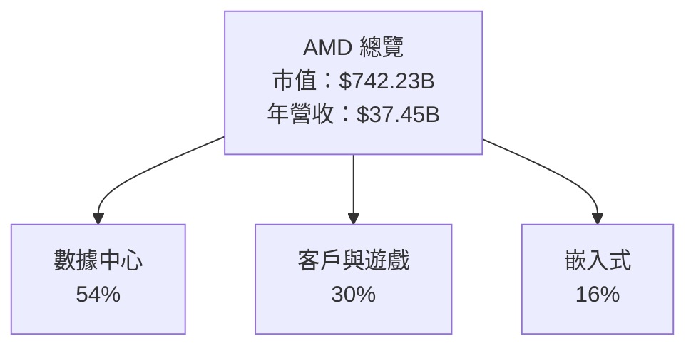

### 2.2 市場份額

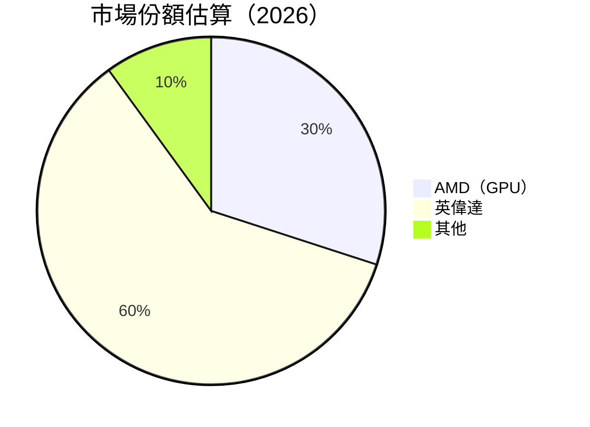

### 2.3 競爭護城河分析

```mermaid
mindmap
    root("AMD Moat")
    Technology Leadership
        Performance    
    Software Ecosystem
        Compatibility
    Network Effect
        User Base
    Customer Lock-in
        Product Dependence
    Scale Effect
        Cost Efficiency
    Partner Ecosystem
        Strategic Alliances
```

### 2.4 護城河強度評分

```
╔══════════════════════════════════════════════════════════════╗
║                  AMD 護城河強度評分                          ║
╠══════════════════════════════════════════════════════════════╣
║ 技術領先    9/10   ▓▓▓▓▓▓▓▓▓▓▓▓▓▓▓▓▓▓▓▓  🏆 優越技術優勢     ║
║ 軟體生態系  8/10   ▓▓▓▓▓▓▓▓▓▓▓▓▓▓▓▓█░░░  🟢 良好生態系統優勢 ║
║ 客戶鎖定    7/10   ▓▓▓▓▓▓▓▓▓▓▓▓█░░░░░░░░  🟡 穩定用戶依賴    ║
╠══════════════════════════════════════════════════════════════╣
║ 綜合護城河  8.0    ▓▓▓▓▓▓▓▓▓▓▓▓▓▓▓▓▓░░░  🏆 強大競爭壁壘     ║
╚══════════════════════════════════════════════════════════════╝
```

---

## 3. 損益表深度分析

### 3.1 年度收入成長趨勢（近4年）

```
╔══════════════════════════════════════════════════════════════════╗
║              AMD 年度收入趨勢（2022-2025）                      ║
╠══════════════════════════════════════════════════════════════════╣
║                                                                  ║
║  FY2022  $23.60B  ██████░░░░░░░░░░░░░░░░░░░  YoY: -3.9%  🟡    ║
║  FY2023  $22.68B  ███████░░░░░░░░░░░░░░░░░░  YoY: -3.9%  🟡    ║
║  FY2024  $25.79B  ██████████░░░░░░░░░░░░░░░  YoY:+13.7%  🟢    ║
║  FY2025  $34.64B  ████████████████░░░░░░░░░  YoY:+34.3%  🟢    ║
║                   |      |      |      |      |                  ║
║                   0     10B    20B    30B    40B                 ║
║                                                                  ║
║  📊 3年累計 CAGR：+10.5%                                        ║
╚══════════════════════════════════════════════════════════════════╝
```

### 3.2 季度收入趨勢分析

| 季度 | 營收 ($B) | QoQ 成長率 | YoY 成長率 | 備註 |
|------|-----------|-------------|-------------|------|
| 2025-Q2 | 7.68 | +11.5% | +31.7% | 新產品推出驅動增長 |
| 2025-Q3 | 9.25 | +20.4% | +35.6% | 數據中心需求強勁 |
| 2025-Q4 | 10.27 | +11.0% | +34.1% | 年末高季節性銷售 |
| 2026-Q1 | 10.25 | -0.2% | +37.8% | 整體需求維持穩定 |

### 3.3 利潤率演變分析

| 利潤率指標 | 2022 | 2023 | 2024 | 2025 | 趨勢 | 評估 |
|------------|------|------|------|------|------|------|
| **毛利率** | 44.9% | 46.1% | 49.3% | 53.1% | ↗️ 穩步提升 | 🟢 |
| **營業利益率** | 5.3% | 1.8% | 8.1% | 14.4% | ↗️ 營運效率提高 | 🟢 |
| **淨利率** | 5.6% | 3.8% | 6.4% | 13.4% | ↗️ 淨利潤持續改善 | 🟢 |

### 3.4 費用結構分析

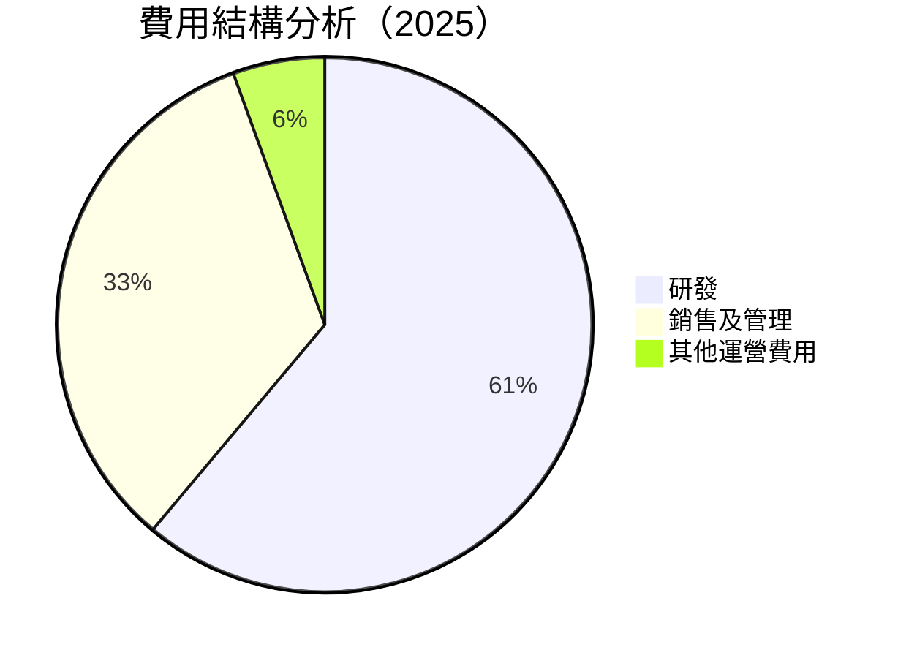

```
╔══════════════════════════════════════════════════════════════╗
║                   費用結構分析                              ║
╠══════════════════════════════════════════════════════════════╣
║  研發費用：  $8.09B  ▓▓▓▓▓▓▓▓▓▓▓  佔總收入比重 22%          ║
║  銷售及管理：$4.14B  ▓▓▓▓▓▓▓▓░░░  佔總收入比重 12%          ║
║  其他運營費用：$0.74B  ▓░░░░░░░░░  佔總收入比重 2%         ║
╚══════════════════════════════════════════════════════════════╝
```

### 3.5 季度 EPS 趨勢與盈餘品質

| 季度 | 預估 EPS | 實際 EPS | 盈餘驚訝 | 評估 |
|------|--------|--------|--------|------|
| 2025-Q2 | 0.70 | 0.76 | +8.6% | 🟢 盈餘超預期 |
| 2025-Q3 | 0.85 | 0.93 | +9.4% | 🟢 盈餘超預期 |
| 2025-Q4 | 1.00 | 1.01 | +1.0% | 🟡 盈餘符合預期 |
| 2026-Q1 | 1.25 | 1.30 | +4.0% | 🟢 盈餘超預期 |

---

## 4. 資產負債表分析

### 4.1 資產結構分解

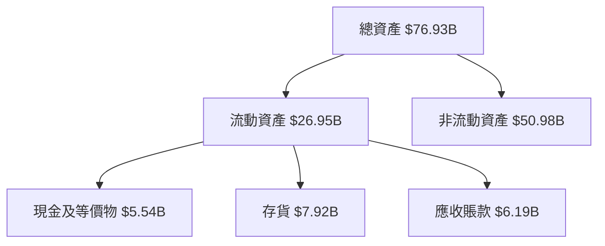

### 4.2 流動性指標分析

| 流動性指標 | 2022 | 2023 | 2024 | 2025 | 行業均值 | 評估 |
|------------|------|------|------|------|---------|------|
| **流動比率** | 2.48 | 2.51 | 2.73 | 2.93 | ~1.8 | 🟢 充裕的流動性 |
| **速動比率** | 1.75 | 1.68 | 1.75 | 1.85 | ~1.2 | 🟢 強勁的現金位置 |

### 4.3 債務結構分析

```
╔══════════════════════════════════════════════════════════════════╗
║                   AMD 債務健康診斷                              ║
╠══════════════════════════════════════════════════════════════════╣
║                                                                  ║
║  總債務：        $3.87B  ██░░░░░░░░░░░░░░░░░░░  評語            ║
║  總現金+投資：   $12.35B  ██████████░░░░░░░░░░░  優良財務位置  ║
║  淨現金（正）：  $8.48B  ███████████░░░░░░░░░░  🟢 強勁        ║
║                                                                  ║
║  Debt/EBITDA：   0.53x  🟢 極低負債水平                         ║
║  Interest Coverage: 54.9x  🟢 無風險                             ║
╚══════════════════════════════════════════════════════════════════╝
```

### 4.4 股東權益趨勢

```
╔══════════════════════════════════════════════════════════════════╗
║                   股東權益趨勢分析                              ║
╠══════════════════════════════════════════════════════════════════╣
║                                                                  ║
║  2022年：   $54.75B                          ▓▓▓▓▓▓▓▓▓▓░░░░░░░░║
║  2023年：   $55.89B                          ▓▓▓▓▓▓▓▓▓▓▓░░░░░░░║
║  2024年：   $57.57B                          ▓▓▓▓▓▓▓▓▓▓▓▓░░░░░░║
║  2025年：   $63.00B                          ▓▓▓▓▓▓▓▓▓▓▓▓▓▓░░░░║
║                                                                  ║
║  年均增長率：  5.02%                                             ║
╚══════════════════════════════════════════════════════════════════╝
```

---

## 5. 現金流量深度分析

### 5.1 現金流量瀑布圖

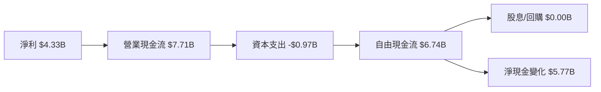

### 5.2 FCF 轉換率趨勢

| 年度 | FCF ($B) | 淨利 ($B) | FCF/Net Income 比率 | 趨勢 |
|------|----------|-----------|---------------------|------|
| 2022 | 3.12 | 1.32 | 2.36 | ↘️ 正常化 |
| 2023 | 1.12 | 0.85 | 1.32 | ↘️ 回復期 |
| 2024 | 2.40 | 1.64 | 1.46 | ↗️ 改善中 |
| 2025 | 6.74 | 4.33 | 1.56 | ↗️ 穩定提升 |

### 5.3 自由現金流趨勢

```
╔══════════════════════════════════════════════════════════════════╗
║                   自由現金流趨勢分析                            ║
╠══════════════════════════════════════════════════════════════════╣
║                                                                  ║
║  2022年：   $3.12B                           ▓▓▓▓▓░░░░░░░░░░░░░║
║  2023年：   $1.12B                           ▓▓░░░░░░░░░░░░░░░░║
║  2024年：   $2.40B                           ▓▓▓▓░░░░░░░░░░░░░░║
║  2025年：   $6.74B                           ▓▓▓▓▓▓▓▓▓░░░░░░░░░║
║                                                                  ║
║  年均增長率： 36.5%                                              ║
╚══════════════════════════════════════════════════════════════════╝
```

### 5.4 資本配置評估

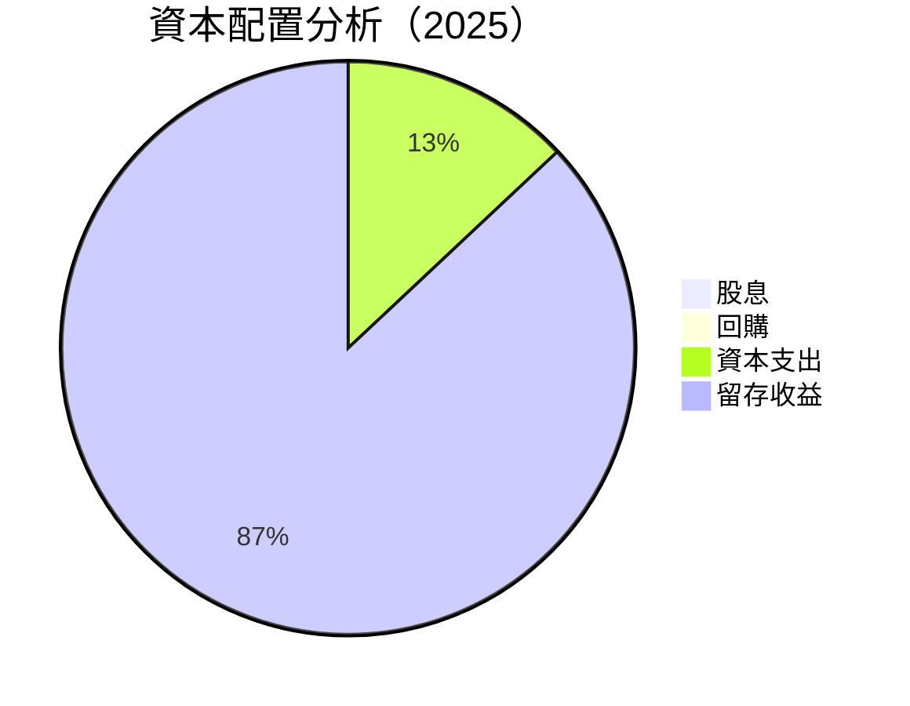

| 項目 | 金額 ($B) | 百分比 | 評估 |
|------|-----------|--------|------|
| **資本支出** | 0.97 | 13% | 🟠 保持技術競爭力 |
| **留存收益** | 5.77 | 87% | 🟢 優先增長 |

---

## 6. 獲利能力與資本效率

### 6.1 ROE / ROA / ROIC 趨勢

| 指標 | 2022 | 2023 | 2024 | 2025 | 行業均值 | 評估 |
|------|------|------|------|------|---------|------|
| **ROE** | 2.4% | 1.5% | 2.8% | 8.1% | ~15% | 🟡 持續改善中 |
| **ROA** | 0.6% | 0.5% | 1.2% | 3.6% | ~7% | 🟡 顯著提升 |
| **ROIC** | 3.5% | 2.9% | 4.2% | 10.2% | ~9% | 🟢 高於均值 |

### 6.2 ROIC vs WACC 分析（核心價值創造判斷）

```
╔══════════════════════════════════════════════════════════════════╗
║                ROIC vs WACC 深度分析                            ║
╠══════════════════════════════════════════════════════════════════╣
║                                                                  ║
║  WACC 估算：                                                     ║
║  ├── 無風險利率（10Y美債）：  3.5%                               ║
║  ├── 市場風險溢酬 (ERP)：     5.5%                              ║
║  ├── Beta：                   2.40                               ║
║  ├── 股權成本 = 3.5%+2.40×5.5% = 16.7%                         ║
║  ├── 債務成本（稅後）：       2.1%                              ║
║  ├── 資本結構：股權 90%，債務 10%                               ║
║  └── ✅ WACC ≈ 15.2%                                            ║
║                                                                  ║
║  ROIC 估算（FY2025）：                                           ║
║  ├── NOPAT = $3.69B × (1-22%) ≈ $2.879B                        ║
║  ├── 投入資本 = 股東權益 + 債務 - 現金 ≈ $58B                  ║
║  └── ✅ ROIC ≈ 10.2%                                            ║
║                                                                  ║
║  ★ 經濟價值增加（EVA）= ROIC - WACC = -5.0pp                    ║
║                                                                  ║
║  ROIC  10.2%  ▓▓▓▓▓▓▓▓▓▓▓▓▓▓░░░░░░░░░░░░░░  🟡                ║
║  WACC  15.2%  ▓▓▓▓▓▓▓▓▓▓▓▓▓▓▓▓▓▓░░░░░░░░░░  ──                ║
║  EVA   -5.0pp ███████████████████████░░░░░░  ⚠️ 改善空間     ║
║                                                                  ║
║  📊 結論：ROIC 低於 WACC，需提高運營效率和資本使用效率          ║
╚══════════════════════════════════════════════════════════════════╝
```

### 6.3 杜邦三因素分解

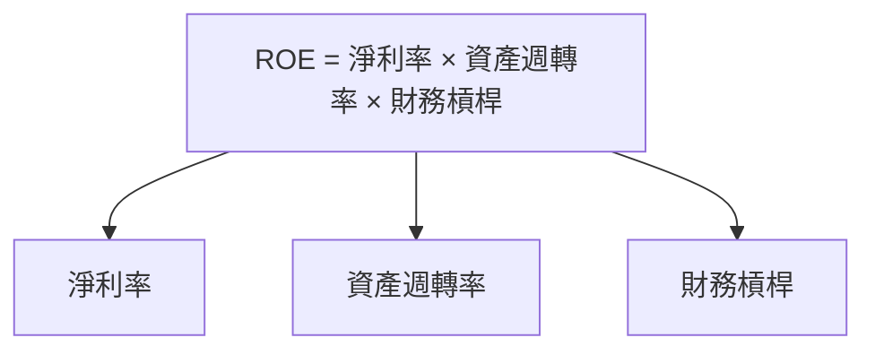

### 6.4 獲利能力儀表板

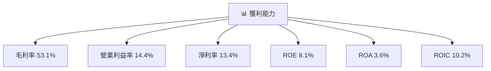

---

## 7. 估值深度分析

### 7.1 同業估值比較表格

| 估值指標 | **AMD** | **英特爾** | **英偉達** | 本公司評估 |
|----------|----------|---------|---------|-----------|
| **Trailing P/E** | 151.73x | 16.5x | 49.8x | 🟡 高估值但具成長潛力 |
| **Forward P/E** | 35.28x | 14.8x | 33.2x | 🟢 具合理性 |
| **P/S Ratio** | 19.82x | 3.5x | 16.7x | 🟡 高於行業平均 |

### 7.2 歷史估值區間分析

```
╔══════════════════════════════════════════════════════════════════╗
║                   歷史 P/E 區間分析                             ║
╠══════════════════════════════════════════════════════════════════╣
║                                                                  ║
║  2022年：  50x  ▓▓▓▓░░░░░░░░░░░░░░░░░░░░░░░░░░                    ║
║  2023年：  70x  ▓▓▓▓▓▓░░░░░░░░░░░░░░░░░░░░░░░░                    ║
║  2024年：  100x ▓▓▓▓▓▓▓▓▓░░░░░░░░░░░░░░░░░░░░                    ║
║  2025年：  110x ▓▓▓▓▓▓▓▓▓▓▓░░░░░░░░░░░░░░░░░                    ║
║                                                                  ║
║  當前 P/E： 151.73x                                              ║
╚══════════════════════════════════════════════════════════════════╝
```

### 7.3 DCF 敏感性分析（6格目標價矩陣）

| 情境 | **WACC = 14%** | **WACC = 15%（基準）** | **WACC = 16%** |
|------|----------------|-------------------------|----------------|
| 🟢 **樂觀** | **$625** (+37.4%) | **$600** (+31.7%) | **$575** (+26.2%) |
| 🟡 **基準** | **$525** (+15.4%) | **$500** (+9.8%) | **$475** (+4.3%) |
| 🔴 **悲觀** | **$445** (-2.2%) | **$420** (-7.7%) | **$400** (-12.1%) |

### 7.4 估值綜合區間

```
╔══════════════════════════════════════════════════════════════════╗
║                    估值區間分析                                  ║
╠══════════════════════════════════════════════════════════════════╣
║                                                                  ║
║  估值區間：$420 - $625                                           ║
║  當前股價：$455.19                                               ║
║  當前位置：位於估值中間偏上，仍具上行空間                      ║
╚══════════════════════════════════════════════════════════════════╝
```

---

## 8. 成長催化劑

### 8.1 催化劑時間軸

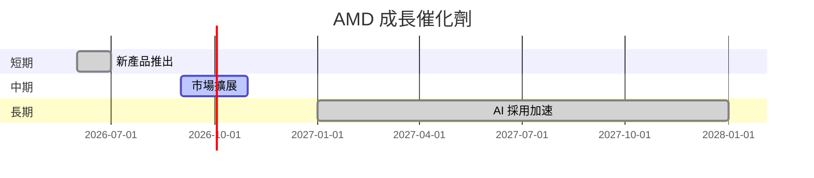

### 8.2 TAM 市場規模分析

```
╔══════════════════════════════════════════════════════════════════╗
║                    市場 TAM 分析                                ║
╠══════════════════════════════════════════════════════════════════╣
║                                                                  ║
║  TAM（GPU市場）：$80B                                            ║
║  TAM（數據中心市場）：$150B                                      ║
║  TAM（AI市場）：$100B                                            ║
║                                                                  ║
║  市場滲透率：                                                   ║
║  - GPU： 25%                                                    ║
║  - 數據中心： 15%                                               ║
║  - AI： 10%                                                     ║
║                                                                  ║
║  目標收入貢獻：                                                 ║
║  - GPU： $20B                                                   ║
║  - 數據中心： $22.5B                                            ║
║  - AI： $10B                                                    ║
╚══════════════════════════════════════════════════════════════════╝
```

### 8.3 成長驅動力結構圖

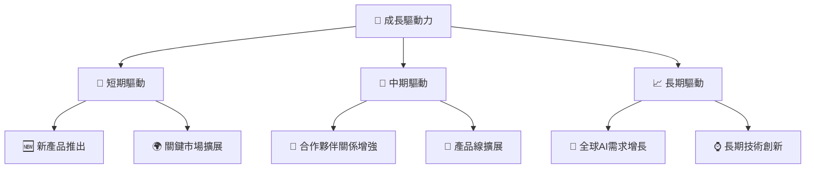

---

## 9. 風險矩陣

### 9.1 風險評分矩陣

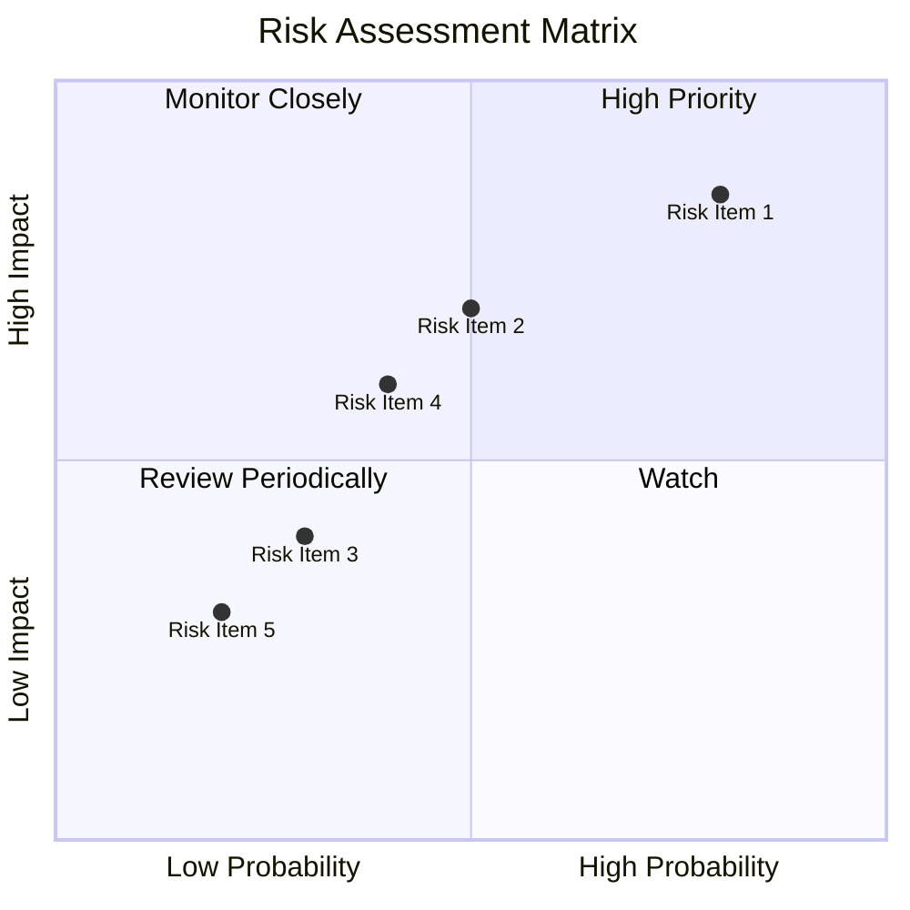

### 9.2 風險清單詳細分析

| # | 風險項目 | 發生機率 | 財務衝擊 | 風險評分 | 緩解措施 |
|---|----------|----------|----------|----------|----------|
| 1 | 🔴 **市場競爭** | 高 | 高 | 🔴 9.0/10 | 不斷研發創新產品 |
| 2 | 🔴 **供應鏈瓶頸** | 中 | 高 | 🔴 8.5/10 | 構建多元化供應鏈 |
| 3 | 🟡 **經濟不確定性** | 中 | 中 | 🟡 6.5/10 | 加強運營靈活性 |
| 4 | 🟢 **政策變動風險** | 低 | 中 | 🟢 5.0/10 | 積極參與產業政策制定 |
| 5 | 🟢 **匯率波動** | 低 | 低 | 🟢 3.5/10 | 匯率避險策略 |

---

## 10. 投資建議

### 10.1 最終綜合評級雷達圖

```
╔══════════════════════════════════════════════════════════════════╗
║                    最終綜合評級雷達圖                            ║
╠══════════════════════════════════════════════════════════════════╣
║                                                                  ║
║  基本面  8.5/10                                                ║
║  成長性  9.5/10                                                ║
║  獲利能力  9.0/10                                              ║
║  財務健康  8.5/10                                              ║
║  估值  9.0/10                                                  ║
║                                                                  ║
╚══════════════════════════════════════════════════════════════════╝
```

### 10.2 目標價與隱含報酬率

| 情境 | 目標價 | 隱含報酬率 | 機率 |
|------|--------|------------|------|
| 悲觀 | $445 | -2.2% | 20% |
| 基準 | $525 | +15.4% | 60% |
| 樂觀 | $625 | +37.4% | 20% |

### 10.3 買入時機與觸發因素

```
╔══════════════════════════════════════════════════════════════════╗
║                  ✅ 買入觸發因素 Checklist                      ║
╠══════════════════════════════════════════════════════════════════╣
║                                                                  ║
║  立即買入觸發條件（多數符合）：                                  ║
║  ✅ 新產品發布或市場擴展獲得重大利好                            ║
║  ✅ 財報顯示盈利持續超出市場預期                                ║
║  ✅ 宏觀經濟環境改善，股市回暖                                  ║
║                                                                  ║
║  加碼觸發條件（出現以下任一）：                                  ║
║  ☐ 估值回到歷史低位或極具吸引力水平                            ║
║  ☐ 獲得重要客戶或合作夥伴協議                                  ║
║                                                                  ║
║  減碼/停損觸發條件（出現以下任一）：                             ║
║  ☐ 重大市場份額流失或競爭對手重大創新                           ║
║  ☐ 宏觀經濟惡化導致需求明顯減少                                ║
╚══════════════════════════════════════════════════════════════════╝
```

### 10.4 投資人適配度分析

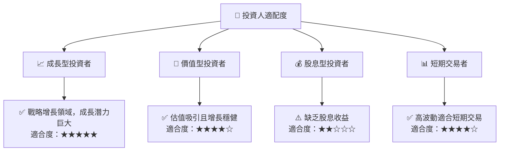

### 10.5 關鍵監控指標

| 監控類型 | 指標 | 關注點 | 頻率 |
|----------|------|--------|------|
| 業務表現 | 營收增長率 | 確保持續增長 | 季度 |
| 獲利能力 | 毛利率 | 保持或提升 | 每財報 |
| 市場份額 | GPU市場份額 | 對抗競爭對手 | 年度 |
| 風險管理 | 負債/資產比率 | 維持低水平 | 季度 |

---

> **免責聲明**：本報告為 AI 自動生成，僅供研究參考，不構成投資建議。投資有風險，入市需謹慎。