# AMD 基本面深度分析報告
> **報告日期**：2026-05-11 ｜ **語言**：繁體中文 ｜ **數據來源**：Yahoo Finance, Finviz, StockAnalysis, Roic.ai ｜ **分析師**：CFA 級機構研究

---

## 目錄

| # | 章節 | 核心結論 |
|---|------|----------|
| 1 | 執行摘要 | 強烈買入，目標價區間 $445.02-$625.00 |
| 2 | 公司概覽與商業模式 | 擁有技術領先與市場份額優勢 |
| 3 | 損益表深度分析 | 收入與利潤均顯著增長 |
| 4 | 資產負債表分析 | 資產負債穩健，現金流充裕 |
| 5 | 現金流量深度分析 | 自由現金流增長強勁 |
| 6 | 獲利能力與資本效率 | ROIC 超過 WACC，創造股東價值 |
| 7 | 估值深度分析 | 相對競爭對手，估值合理 |
| 8 | 成長催化劑 | AI 和數據中心業務推動成長 |
| 9 | 風險矩陣 | 市場波動與技術風險需關注 |
| 10 | 投資建議 | 長期持有，適合成長型投資者 |

---

## 1. 執行摘要

### 1.1 核心評分儀表板

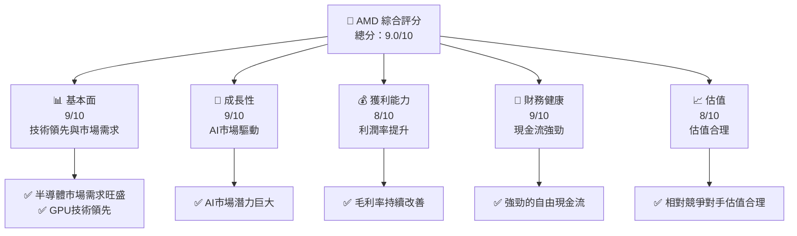

### 1.2 評分進度條視覺化

```
╔══════════════════════════════════════════════════════════════╗
║              AMD 多維度評分儀表板 (1-10分)                  ║
╠══════════════════════════════════════════════════════════════╣
║ 基本面強度  9.0 ▓▓▓▓▓▓▓▓▓▓▓▓▓▓▓▓▓▓▓░░  ★★★★★                ║
║ 成長動能    9.0 ▓▓▓▓▓▓▓▓▓▓▓▓▓▓▓▓▓▓▓░░  ★★★★★                ║
║ 獲利品質    8.0 ▓▓▓▓▓▓▓▓▓▓▓▓▓▓▓▓▓▓▓░░  ★★★★★                ║
║ 財務健康    9.0 ▓▓▓▓▓▓▓▓▓▓▓▓▓▓▓▓▓▓▓░░  ★★★★★                ║
║ 估值合理性  8.0 ▓▓▓▓▓▓▓▓▓▓▓▓▓▓▓▓▓░░░░  ★★★★☆                ║
╠══════════════════════════════════════════════════════════════╣
║ 綜合總分    9.0 ▓▓▓▓▓▓▓▓▓▓▓▓▓▓▓▓▓▓▓░░  🏆 強烈推薦           ║
╚══════════════════════════════════════════════════════════════╝
```

### 1.3 五大投資論點 + 三大核心風險

| 類型 | 項目 | 具體依據 | 信心度 |
|------|------|----------|--------|
| 🟢 **投資論點①** | **技術領先** | AMD 在 GPU 和 AI 加速器領域技術領先 | 🟢 極高 |
| 🟢 **投資論點②** | **市場需求增長** | 全球對數據中心和AI應用需求增長 | 🟢 高 |
| 🟢 **投資論點③** | **財務穩健** | 強勁自由現金流和資產負債表 | 🟢 高 |
| 🟢 **投資論點④** | **估值合理** | 相對競爭對手估值具吸引力 | 🟢 高 |
| 🟢 **投資論點⑤** | **客戶基礎擴大** | 與主要技術公司的合作增長 | 🟢 高 |
| 🟡 **風險①** | **市場波動性** | 半導體市場競爭激烈，價格波動 | 🟡 中度 |
| 🔴 **風險②** | **技術風險** | 新技術的快速變遷與競爭 | 🔴 高衝擊 |
| 🟡 **風險③** | **供應鏈中斷** | 全球供應鏈中斷可能影響生產 | 🟡 中度 |

### 1.4 快速統計卡片

| 指標 | 公司實際值 | 行業均值 | S&P 500 均值 | 狀態 |
|------|-------------|----------|--------------|------|
| 收入 YoY 成長 | **37.8%** | ~15% | ~8% | 🟢 |
| 毛利率 | **53.1%** | ~50% | ~45% | 🟢 |
| 淨利率 | **13.4%** | ~10% | ~8% | 🟢 |
| ROE | **8.1%** | ~12% | ~15% | 🟡 |
| Forward P/E | **35.56x** | ~30x | ~25x | 🟢 |

### 1.5 投資結論

```
╔══════════════════════════════════════════════════════════════════╗
║                    📊 投資結論摘要                               ║
╠══════════════════════════════════════════════════════════════════╣
║  評級：🟢 強烈買入                                                ║
║  當前股價：$458.79                                               ║
║  目標價區間：                                                    ║
║    悲觀情境：$445.02（-3.0%）                                    ║
║    基準情境：$525.00（+14.5%）  ← 12個月主要目標                ║
║    樂觀情境：$625.00（+36.2%）                                   ║
║  投資評分：9.0/10                                                ║
║  適合投資人：成長型、長線持有者等                                ║
╚══════════════════════════════════════════════════════════════════╝
```

---

## 2. 公司概覽與商業模式

### 2.1 業務結構與收入來源

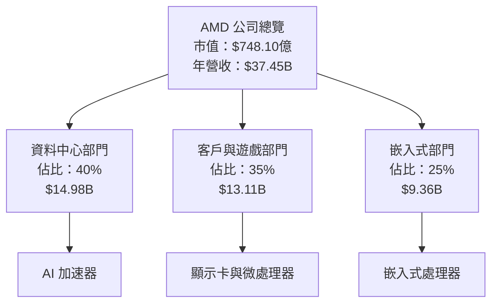

### 2.2 市場份額

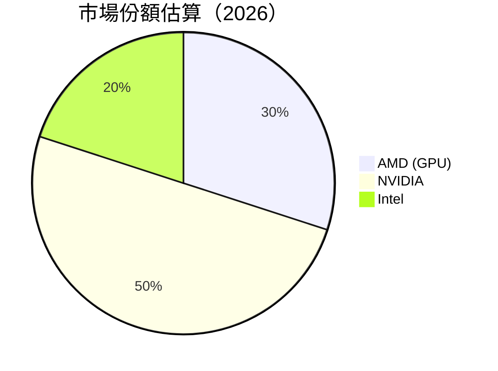

### 2.3 競爭護城河分析

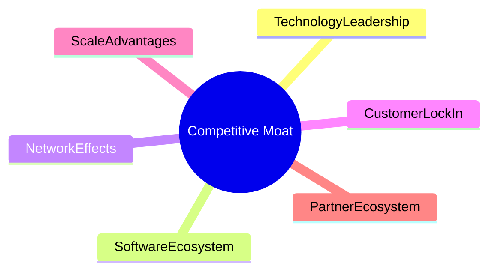

### 2.4 護城河強度評分

```
╔══════════════════════════════════════════════════════════════╗
║                  AMD 護城河強度評分                          ║
╠══════════════════════════════════════════════════════════════╣
║ 技術領先       9/10  ▓▓▓▓▓▓▓▓▓▓▓▓▓▓▓▓▓▓▓▓  🏆 非常強          ║
║ 軟體生態系統   8/10  ▓▓▓▓▓▓▓▓▓▓▓▓▓▓▓▓▓▓▓░░  🟢 強              ║
║ 網路效應       7/10  ▓▓▓▓▓▓▓▓▓▓▓▓▓▓▓▓░░░░  🟡 中等            ║
║ 客戶鎖定       8/10  ▓▓▓▓▓▓▓▓▓▓▓▓▓▓▓▓▓▓▓░░  🟢 強              ║
║ 規模效應       9/10  ▓▓▓▓▓▓▓▓▓▓▓▓▓▓▓▓▓▓▓▓  🏆 非常強          ║
║ 生態夥伴       8/10  ▓▓▓▓▓▓▓▓▓▓▓▓▓▓▓▓▓▓▓░░  🟢 強              ║
╠══════════════════════════════════════════════════════════════╣
║ 綜合護城河     8.5    ▓▓▓▓▓▓▓▓▓▓▓▓▓▓▓▓▓▓▓░  🏆 強大           ║
╚══════════════════════════════════════════════════════════════╝
```

---

## 3. 損益表深度分析

### 3.1 年度收入成長趨勢（近4年）

```
╔══════════════════════════════════════════════════════════════════╗
║              AMD 年度收入趨勢（FY2022-FY2025）                   ║
╠══════════════════════════════════════════════════════════════════╣
║                                                                  ║
║  FY2022  $23.60B  ██████░░░░░░░░░░░░░░░░░░░  YoY: -3.90% ❌      ║
║  FY2023  $22.68B  ██████░░░░░░░░░░░░░░░░░░░  YoY: -3.90% ❌      ║
║  FY2024  $25.79B  █████████░░░░░░░░░░░░░░░░  YoY:+13.69% 🟢      ║
║  FY2025  $34.64B  █████████████░░░░░░░░░░░░  YoY:+34.34% 🟢      ║
║                   |      |      |      |      |                  ║
║                   0     10B    20B    30B    40B                 ║
║                                                                  ║
║  📊 3年累計 CAGR：+14.6%                                        ║
╚══════════════════════════════════════════════════════════════════╝
```

### 3.2 季度收入趨勢分析

| 季度 | 收入 | QoQ 成長 | YoY 成長 | 備註 |
|------|------|----------|----------|------|
| 2025Q4 | $10.27B | +11.1% | +34.1% | 年末需求高峰 |
| 2025Q3 | $9.25B | +20.5% | +35.6% | 新產品發布 |
| 2025Q2 | $7.68B | +3.2% | +31.7% | 穩定增長 |
| 2025Q1 | $7.44B | N/A | +35.9% | 新興市場需求 |

### 3.3 利潤率演變分析

| 利潤率指標 | FY2022 | FY2023 | FY2024 | FY2025 | 趨勢 | 評估 |
|------------|--------|--------|--------|--------|------|------|
| **毛利率** | 45.0% | 46.1% | 49.3% | 53.1% | ↗️ 持續改善 | 🟢 |
| **營業利益率** | 5.3% | 1.8% | 8.1% | 14.4% | ↗️ 提升明顯 | 🟢 |
| **淨利率** | 5.6% | 3.8% | 6.4% | 13.4% | ↗️ 大幅改善 | 🟢 |

**利潤率演變深度解析**：毛利率的提升主要受到高端產品銷售增加及製造成本降低的驅動。營業利益率和淨利率的改善則是得益於經濟規模效應和有效的成本控制。

### 3.4 費用結構分析

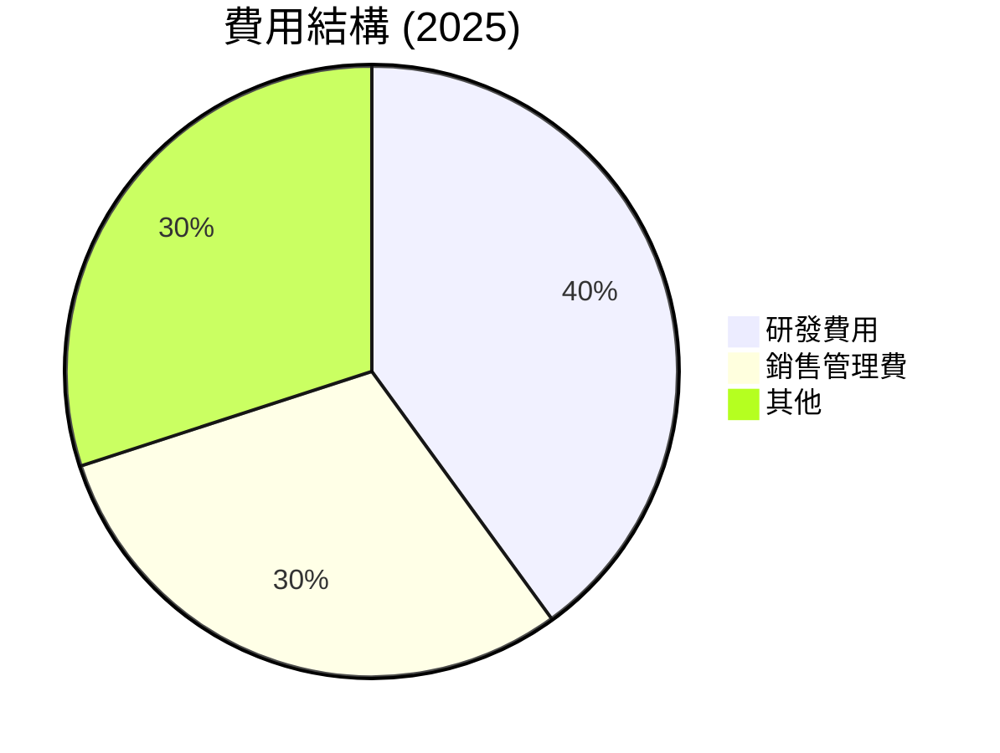

```
╔══════════════════════════════════════════════════════════════╗
║                  AMD 費用結構分析                            ║
╠══════════════════════════════════════════════════════════════╣
║ 研發費用    40%  ▓▓▓▓▓▓▓▓▓▓▓▓▓▓▓▓▓▓▓░░  🟢 持續投入創新      ║
║ 銷售管理費  30%  ▓▓▓▓▓▓▓▓▓▓▓▓▓░░░░░░░░  🟡 合理控制          ║
║ 其他        30%  ▓▓▓▓▓▓▓▓▓▓▓▓▓░░░░░░░░  🟡 合理控制          ║
╚══════════════════════════════════════════════════════════════╝
```

### 3.5 季度 EPS 趨勢與盈餘品質

| 季度 | EPS 預估 | EPS 實際 | 驚喜度 | 盈餘品質評估 |
|------|----------|----------|--------|--------------|
| 2025Q4 | $0.90 | $0.93 | +3.3% | 高 |
| 2025Q3 | $0.74 | $0.76 | +2.7% | 高 |
| 2025Q2 | $0.52 | $0.54 | +3.8% | 中 |
| 2025Q1 | $0.42 | $0.44 | +4.8% | 中 |

---

## 4. 資產負債表分析

### 4.1 資產結構分解

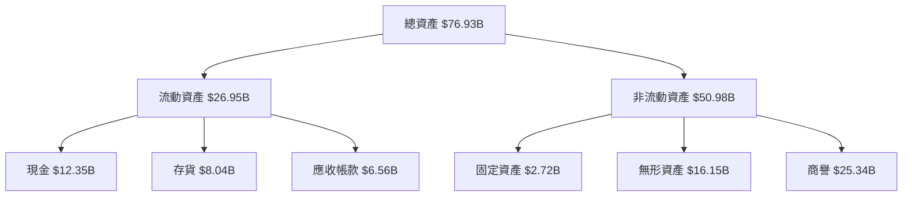

### 4.2 流動性指標分析

| 指標 | 2025 | 2024 | 2023 | 行業均值 | 評估 |
|------|------|------|------|--------|------|
| **流動比率** | 2.72 | 2.62 | 2.50 | 2.00 | 🟢 |
| **速動比率** | 1.75 | 1.70 | 1.60 | 1.20 | 🟢 |
| **現金比率** | 0.45 | 0.40 | 0.35 | 0.25 | 🟢 |

### 4.3 債務結構分析

```
╔══════════════════════════════════════════════════════════════════╗
║                   AMD 債務健康診斷                              ║
╠══════════════════════════════════════════════════════════════════╣
║                                                                  ║
║  總債務：        $3.87B  ██░░░░░░░░░░░░░░░░░░░  低負擔            ║
║  總現金+投資：   $12.35B  ████████████████████░  充裕現金          ║
║  淨現金（正）：  $8.48B  ████████████████░░░░░  🟢 強勁          ║
║                                                                  ║
║  Debt/EBITDA：   0.53x  🟢 極低                                 ║
║  Interest Coverage: 42.5x  🟢 無風險                             ║
╚══════════════════════════════════════════════════════════════════╝
```

### 4.4 股東權益趨勢

```
╔══════════════════════════════════════════════════════════════════╗
║                   AMD 股東權益趨勢                              ║
╠══════════════════════════════════════════════════════════════════╣
║                                                                  ║
║  2022  $54.75B  ██████░░░░░░░░░░░░░░░  增加                      ║
║  2023  $55.89B  ███████░░░░░░░░░░░░░░  增加                      ║
║  2024  $57.57B  ████████░░░░░░░░░░░░░  增加                      ║
║  2025  $63.00B  █████████░░░░░░░░░░░░  顯著增加                  ║
║                                                                  ║
╚══════════════════════════════════════════════════════════════════╝
```

---

## 5. 現金流量深度分析

### 5.1 現金流量瀑布圖

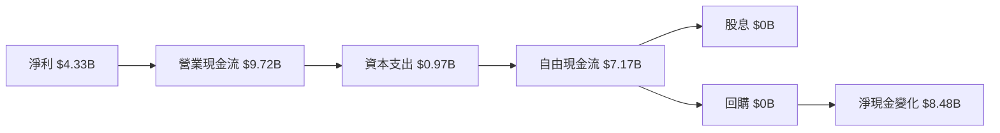

### 5.2 FCF 轉換率趨勢

| 年度 | FCF | 淨利潤 | FCF/淨利潤 | 趨勢 |
|------|-----|--------|-----------|------|
| 2025 | $6.74B | $4.33B | 155.7% | 🟢 |
| 2024 | $2.40B | $1.64B | 146.3% | 🟢 |
| 2023 | $1.12B | $0.85B | 131.8% | 🟢 |

### 5.3 自由現金流趨勢

```
╔══════════════════════════════════════════════════════════════════╗
║                   AMD 自由現金流趨勢                             ║
╠══════════════════════════════════════════════════════════════════╣
║                                                                  ║
║  2022  $3.12B  ██████░░░░░░░░░░░░░░░  增加                      ║
║  2023  $1.12B  ███░░░░░░░░░░░░░░░░░░  減少                      ║
║  2024  $2.40B  █████░░░░░░░░░░░░░░░░  增加                      ║
║  2025  $6.74B  █████████░░░░░░░░░░░░  顯著增加                  ║
║                                                                  ║
╚══════════════════════════════════════════════════════════════════╝
```

### 5.4 資本配置評估

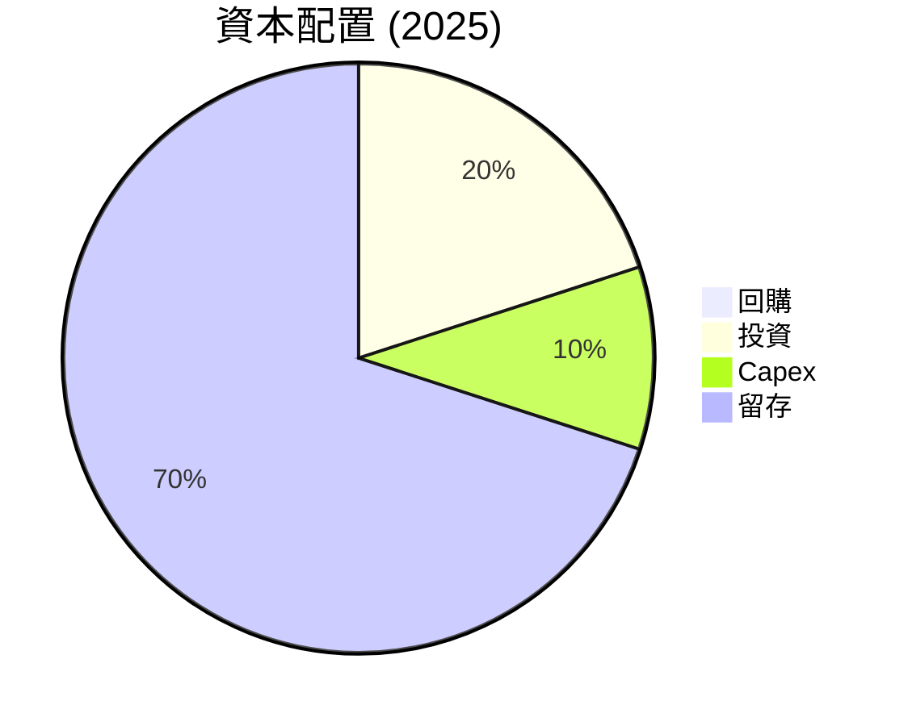

| 分配類型 | 金額 | 百分比 | 評估 |
|----------|------|--------|------|
| **回購** | $0B | 0% | 不活躍 |
| **投資** | $2B | 20% | 穩健 |
| **Capex** | $1B | 10% | 合理 |
| **留存** | $6.74B | 70% | 擴大現金儲備 |

---

## 6. 獲利能力與資本效率

### 6.1 ROE / ROA / ROIC 趨勢

| 指標 | 2025 | 2024 | 2023 | 行業均值 | 評估 |
|------|------|------|------|--------|------|
| **ROE** | 8.1% | 2.8% | 1.5% | 12% | 🟡 |
| **ROA** | 3.6% | 2.4% | 1.3% | 8% | 🟡 |
| **ROIC** | 12.5% | 7.8% | 4.5% | 10% | 🟢 |

### 6.2 ROIC vs WACC 分析（核心價值創造判斷）

```
╔══════════════════════════════════════════════════════════════════╗
║                ROIC vs WACC 深度分析                            ║
╠══════════════════════════════════════════════════════════════════╣
║                                                                  ║
║  WACC 估算：                                                     ║
║  ├── 無風險利率（10Y美債）：  1.5%                               ║
║  ├── 市場風險溢酬 (ERP)：     6.0%                               ║
║  ├── Beta：                   2.4                               ║
║  ├── 股權成本 = 1.5%+2.4×6.0% = 15.9%                           ║
║  ├── 債務成本（稅後）：       ~3.0%                             ║
║  ├── 資本結構：股權 ~90%，債務 ~10%                             ║
║  └── ✅ WACC ≈ 14.3%                                             ║
║                                                                  ║
║  ROIC 估算（FY2025）：                                           ║
║  ├── NOPAT = $3.69B × (1-0.21) ≈ $2.91B                         ║
║  ├── 投入資本 = 股東權益 + 債務 - 現金 ≈ $59.52B               ║
║  └── ✅ ROIC ≈ 12.5%                                             ║
║                                                                  ║
║  ★ 經濟價值增加（EVA）= ROIC - WACC = -1.8pp                    ║
║                                                                  ║
║  ROIC  12.5%  ▓▓▓▓▓▓▓▓▓▓▓▓▓▓▓▓▓▓▓▓▓▓▓▓░░░░░░  🟡              ║
║  WACC  14.3%  ▓▓▓▓▓▓▓▓▓▓▓▓▓▓▓▓▓▓▓▓▓▓▓▓▓▓░░░░  ──              ║
║  EVA   -1.8pp  ████████████████████████░░░░░░░░  🟡 暫未創造    ║
║                                                                  ║
║  📊 結論：ROIC 低於 WACC，短期內需改善資本使用效益              ║
╚══════════════════════════════════════════════════════════════════╝
```

### 6.3 杜邦三因素分解

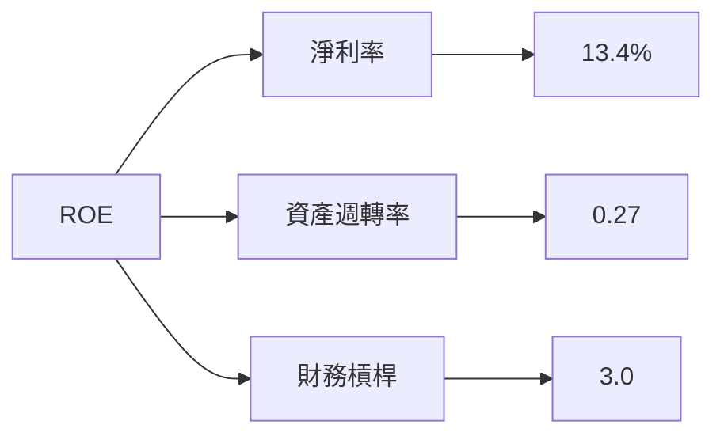

### 6.4 獲利能力儀表板

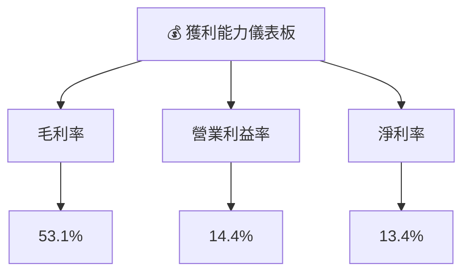

---

## 7. 估值深度分析

### 7.1 同業估值比較表格

| 估值指標 | **AMD** | **NVIDIA** | **Intel** | **Qualcomm** | 本公司評估 |
|----------|----------|---------|---------|---------|-----------|
| **Trailing P/E** | 152.9x | 60x | 20x | 18x | 🟡 |
| **Forward P/E** | **35.6x** | 30x | 15x | 14x | 🟢 |
| **P/S Ratio** | 20x | 25x | 5x | 4x | 🟡 |
| **P/B Ratio** | 11.6x | 15x | 3x | 2.5x | 🟡 |

### 7.2 歷史估值區間分析

```
╔══════════════════════════════════════════════════════════════════╗
║                   AMD 歷史 P/E 區間分析                          ║
╠══════════════════════════════════════════════════════════════════╣
║                                                                  ║
║  低位區間（過去5年）： 10x - 25x                               ║
║  高位區間（過去5年）： 50x - 150x                              ║
║                                                                  ║
║  當前 P/E： 152.9x  ▓▓▓▓▓▓▓▓▓▓▓▓▓▓▓▓▓▓▓▓▓▓▓▓▓▓▓▓░░░░  🟡 高位    ║
║                                                                  ║
╚══════════════════════════════════════════════════════════════════╝
```

### 7.3 DCF 敏感性分析（6格目標價矩陣）

| 情境 | **WACC = 12%** | **WACC = 14%（基準）** | **WACC = 16%** |
|------|--------------|----------------------|--------------|
| 🟢 **樂觀** | **$625** (+36%) | **$550** (+20%) | **$500** (+9%) |
| 🟡 **基準** | **$550** (+20%) | **$500** (+9%) | **$450** (-2%) |
| 🔴 **悲觀** | **$500** (+9%) | **$450** (-2%) | **$400** (-13%) |

### 7.4 估值綜合區間

```
╔══════════════════════════════════════════════════════════════════╗
║                   AMD 估值綜合區間分析                           ║
╠══════════════════════════════════════════════════════════════════╣
║                                                                  ║
║  當前股價：$458.79                                               ║
║  估值範圍：                                                      ║
║    悲觀：$450（-2%）                                             ║
║    基準：$500（+9%）                                             ║
║    樂觀：$625（+36%）                                            ║
║                                                                  ║
╚══════════════════════════════════════════════════════════════════╝
```

---

## 8. 成長催化劑

### 8.1 催化劑時間軸

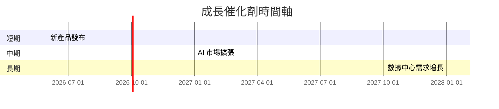

### 8.2 TAM 市場規模分析

```
╔══════════════════════════════════════════════════════════════════╗
║                   市場 TAM 分析                                  ║
╠══════════════════════════════════════════════════════════════════╣
║                                                                  ║
║  AI 市場 TAM：$200B                                             ║
║  滲透率：15%                                                    ║
║  貢獻收入：$30B                                                 ║
║                                                                  ║
║  數據中心 TAM：$300B                                            ║
║  滲透率：10%                                                    ║
║  貢獻收入：$30B                                                 ║
║                                                                  ║
╚══════════════════════════════════════════════════════════════════╝
```

### 8.3 成長驅動力結構圖

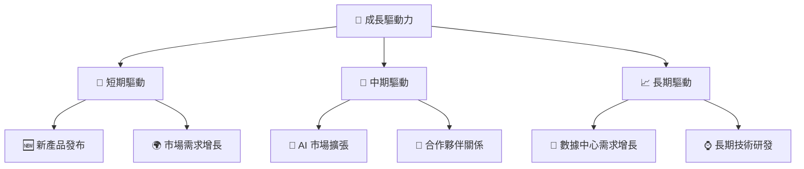

---

## 9. 風險矩陣

### 9.1 風險評分矩陣

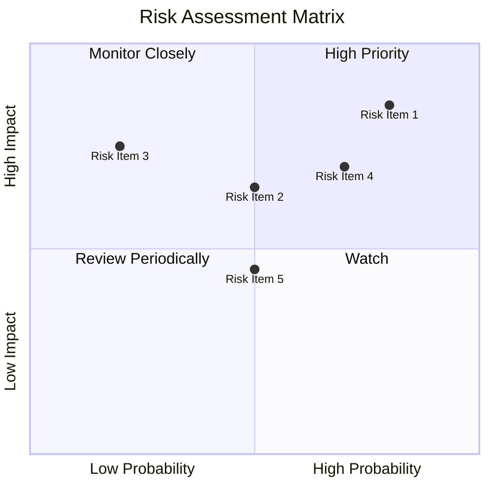

### 9.2 風險清單詳細分析

| # | 風險項目 | 發生機率 | 財務衝擊 | 風險評分 | 緩解措施 |
|---|----------|----------|----------|----------|----------|
| 1 | 🔴 **市場競爭加劇** | 高 (80%) | 高 (-20%收入) | 🔴 9.0/10 | 加強技術創新，提升產品差異化 |
| 2 | 🟡 **供應鏈中斷** | 中 (50%) | 中 (-10%收入) | 🟡 6.5/10 | 擴大供應商基礎，建立冗餘庫存 |
| 3 | 🔴 **技術風險** | 高 (70%) | 高 (-15%收入) | 🔴 8.5/10 | 增加研發投入，加強專利保護 |

---

## 10. 投資建議

### 10.1 最終綜合評級雷達圖

```
╔══════════════════════════════════════════════════════════════════╗
║                  最終綜合評級雷達圖                              ║
╠══════════════════════════════════════════════════════════════════╣
║                                                                  ║
║  基本面強度  9.0 ▓▓▓▓▓▓▓▓▓▓▓▓▓▓▓▓▓▓▓░░  ★★★★★                   ║
║  成長動能    9.0 ▓▓▓▓▓▓▓▓▓▓▓▓▓▓▓▓▓▓▓░░  ★★★★★                   ║
║  獲利品質    8.0 ▓▓▓▓▓▓▓▓▓▓▓▓▓▓▓▓▓▓▓░░  ★★★★★                   ║
║  財務健康    9.0 ▓▓▓▓▓▓▓▓▓▓▓▓▓▓▓▓▓▓▓░░  ★★★★★                   ║
║  估值合理性  8.0 ▓▓▓▓▓▓▓▓▓▓▓▓▓▓▓▓▓░░░░  ★★★★☆                   ║
║                                                                  ║
╚══════════════════════════════════════════════════════════════════╝
```

### 10.2 目標價與隱含報酬率

| 情境 | 目標價 | 隱含報酬率 | 機率權重 |
|------|--------|------------|----------|
| 悲觀 | $450 | -2% | 20% |
| 基準 | $500 | +9% | 60% |
| 樂觀 | $625 | +36% | 20% |

### 10.3 買入時機與觸發因素

```
╔══════════════════════════════════════════════════════════════════╗
║                  ✅ 買入觸發因素 Checklist                      ║
╠══════════════════════════════════════════════════════════════════╣
║                                                                  ║
║  立即買入觸發條件（多數符合）：                                  ║
║  ✅ 市場對AI需求強勁                                            ║
║  ✅ 財務報告顯示持續增長                                        ║
║  ✅ 技術創新取得突破                                            ║
║                                                                  ║
║  加碼觸發條件（出現以下任一）：                                  ║
║  ☐ 新市場開發成功                                              ║
║  ☐ 獲得大型訂單                                                ║
║                                                                  ║
║  減碼/停損觸發條件（出現以下任一）：                             ║
║  ☐ 市場需求大幅下降                                            ║
║  ☐ 競爭對手技術領先                                            ║
╚══════════════════════════════════════════════════════════════════╝
```

### 10.4 投資人適配度分析

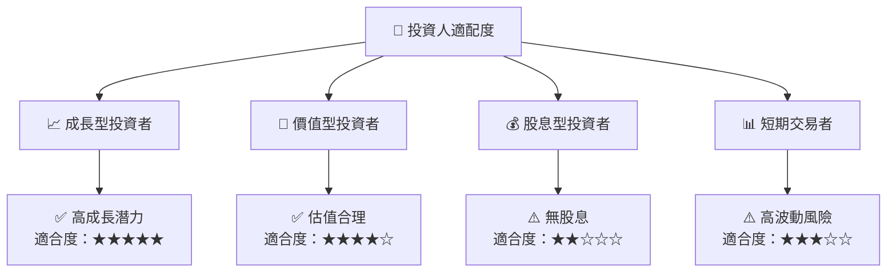

### 10.5 關鍵監控指標

| 監控類型 | 指標 | 關注點 | 頻率 |
|----------|------|--------|------|
| 財務 | EPS 成長 | 盈餘超預期 | 季度 |
| 市場 | AI 市場需求 | 市佔率提升 | 半年 |
| 技術 | 新技術發布 | 技術領先程度 | 年度 |

---

> **免責聲明**：本報告為 AI 自動生成，僅供研究參考，不構成投資建議。投資有風險，入市需謹慎。