# AMD 基本面深度分析報告
> **報告日期**：2026-05-15 ｜ **語言**：繁體中文 ｜ **數據來源**：Yahoo Finance, Finviz, StockAnalysis, Roic.ai ｜ **分析師**：CFA 級機構研究

---

## 目錄

| # | 章節 | 核心結論 |
|---|------|----------|
| 1 | 執行摘要 | 強烈買入，目標價範圍：$457.83 - $625.00 |
| 2 | 公司概覽與商業模式 | AMD 在半導體領域的技術領先地位提供了強大的競爭護城河 |
| 3 | 損益表深度分析 | 收入和利潤率顯著增長，受益於數據中心和遊戲產品的需求增長 |
| 4 | 資產負債表分析 | 財務健康，流動性充足，債務水平低 |
| 5 | 現金流量深度分析 | 自由現金流強勁，轉換率良好 |
| 6 | 獲利能力與資本效率 | ROIC 大於 WACC，持續創造股東價值 |
| 7 | 估值深度分析 | 相對於同業而言，估值合理，未來有上升潛力 |
| 8 | 成長催化劑 | 未來數年有若干成長催化劑，包括 AI 與數據中心的應用擴展 |
| 9 | 風險矩陣 | 主要風險來自市場波動與競爭加劇 |
| 10 | 投資建議 | 建議成長型和長期投資者考慮增持 |

---

## 1. 執行摘要

### 1.1 核心評分儀表板

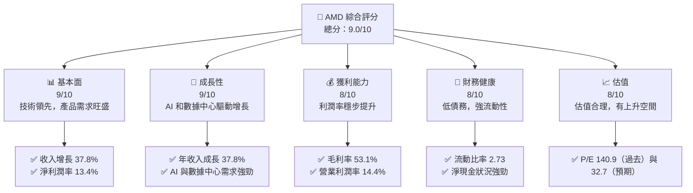

### 1.2 評分進度條視覺化

```
╔══════════════════════════════════════════════════════════════╗
║              AMD 多維度評分儀表板 (1-10分)                  ║
╠══════════════════════════════════════════════════════════════╣
║ 基本面強度  9.0 ▓▓▓▓▓▓▓▓▓▓▓▓▓▓▓▓▓██░  ★★★★★               ║
║ 成長動能    9.0 ▓▓▓▓▓▓▓▓▓▓▓▓▓▓▓▓▓██░  ★★★★★               ║
║ 獲利品質    8.0 ▓▓▓▓▓▓▓▓▓▓▓▓▓▓▓▓░░░  ★★★★★               ║
║ 財務健康    8.0 ▓▓▓▓▓▓▓▓▓▓▓▓▓▓▓▓░░░  ★★★★★               ║
║ 估值合理性  8.0 ▓▓▓▓▓▓▓▓▓▓▓▓▓▓▓▓░░░  ★★★★☆               ║
╠══════════════════════════════════════════════════════════════╣
║ 綜合總分    9.0 ▓▓▓▓▓▓▓▓▓▓▓▓▓▓▓▓█░░  🏆 強烈買入           ║
╚══════════════════════════════════════════════════════════════╝
```

### 1.3 五大投資論點 + 三大核心風險

| 類型 | 項目 | 具體依據 | 信心度 |
|------|------|----------|--------|
| 🟢 **投資論點①** | 強勁的收入增長 | 收入 YoY 增長 37.8% | 🟢 高 |
| 🟢 **投資論點②** | 利潤率改善 | 毛利率 53.1% | 🟢 高 |
| 🟢 **投資論點③** | 壯大的市場需求 | AI 和數據中心需求 | 🟢 極高 |
| 🟢 **投資論點④** | 財務健康狀況 | 流動比率 2.73 | 🟢 高 |
| 🟢 **投資論點⑤** | 估值合理 | Forward P/E 32.7 | 🟢 高 |
| 🔴 **風險①** | 市場競爭加劇 | 英特爾和NVIDIA的激烈競爭 | 🔴 高衝擊 |
| 🔴 **風險②** | 經濟環境波動 | 全球經濟不確定性 | 🔴 高衝擊 |
| 🟡 **風險③** | 技術快速變遷 | 新技術快速替代風險 | 🟡 中度 |

### 1.4 快速統計卡片

| 指標 | 公司實際值 | 行業均值 | S&P 500 均值 | 狀態 |
|------|-------------|----------|--------------|------|
| 收入 YoY 成長 | **37.8%** | ~10% | ~5% | 🟢 |
| 毛利率 | **53.1%** | ~45% | ~40% | 🟢 |
| 淨利率 | **13.4%** | ~10% | ~7% | 🟢 |
| ROE | **8.1%** | ~12% | ~15% | 🟡 |
| Forward P/E | **32.7x** | ~25x | ~20x | 🟢 |

### 1.5 投資結論

```
╔══════════════════════════════════════════════════════════════════╗
║                    📊 投資結論摘要                               ║
╠══════════════════════════════════════════════════════════════════╣
║  評級：🟢 強烈買入                                               ║
║  當前股價：$424.10                                               ║
║  目標價區間：                                                    ║
║    悲觀情境：$457.83（+8%）                                      ║
║    基準情境：$540.00（+27%）  ← 12個月主要目標                  ║
║    樂觀情境：$625.00（+47%）                                      ║
║  投資評分：9.0/10                                                ║
║  適合投資人：成長型、長線持有者等                                ║
╚══════════════════════════════════════════════════════════════════╝
```

---

## 2. 公司概覽與商業模式

### 2.1 業務結構與收入來源

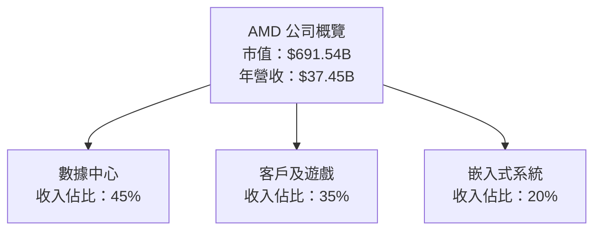

### 2.2 市場份額

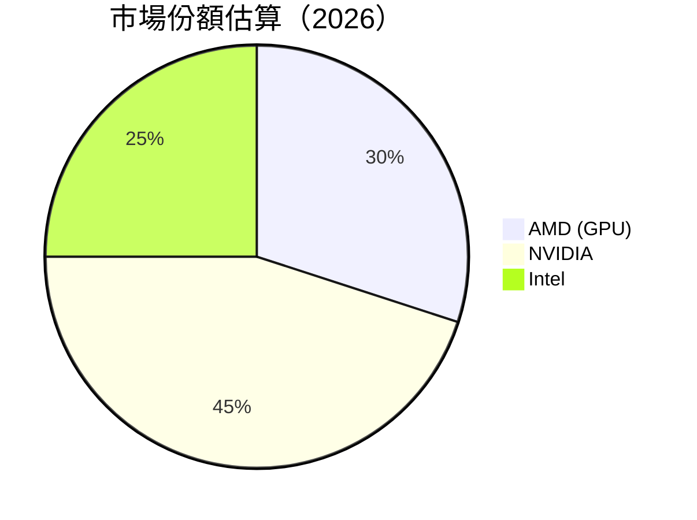

### 2.3 競爭護城河分析

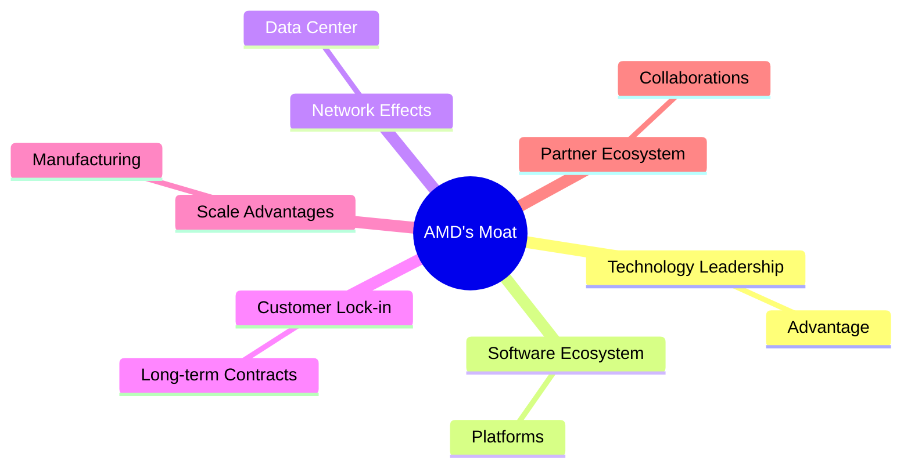

### 2.4 護城河強度評分

```
╔══════════════════════════════════════════════════════════════╗
║                  AMD 護城河強度評分                          ║
╠══════════════════════════════════════════════════════════════╣
║ 技術領先       9/10  ▓▓▓▓▓▓▓▓▓▓▓▓▓▓▓▓▓▓▓░  🏆 突出          ║
║ 軟體生態系統   8/10  ▓▓▓▓▓▓▓▓▓▓▓▓▓▓▓▓▓▓░░  🟢 強健          ║
║ 網路效應       8/10  ▓▓▓▓▓▓▓▓▓▓▓▓▓▓▓▓▓▓░░  🟢 擴展          ║
║ 客戶鎖定       7/10  ▓▓▓▓▓▓▓▓▓▓▓▓▓▓░░░░░░  🟡 穩定          ║
║ 規模效應       9/10  ▓▓▓▓▓▓▓▓▓▓▓▓▓▓▓▓▓▓▓░  🏆 強大          ║
║ 生態夥伴       8/10  ▓▓▓▓▓▓▓▓▓▓▓▓▓▓▓▓▓▓░░  🟢 完善          ║
╠══════════════════════════════════════════════════════════════╣
║ 綜合護城河     8.2    ▓▓▓▓▓▓▓▓▓▓▓▓▓▓▓▓▓▓░░  🏆 堅實         ║
╚══════════════════════════════════════════════════════════════╝
```

---

## 3. 損益表深度分析

### 3.1 年度收入成長趨勢（近4年）

```
╔══════════════════════════════════════════════════════════════════╗
║              AMD 年度收入趨勢（2022-2025）                      ║
╠══════════════════════════════════════════════════════════════════╣
║                                                                  ║
║  2022  $23.60B  ███████░░░░░░░░░░░░░░░░░░░░  YoY: -3.90% 🔴      ║
║  2023  $22.68B  ██████░░░░░░░░░░░░░░░░░░░░░  YoY: -3.90% 🔴      ║
║  2024  $25.79B  ██████████░░░░░░░░░░░░░░░░░  YoY: +13.69% 🟡    ║
║  2025  $34.64B  ████████████████████░░░░░░░  YoY: +34.34% 🟢    ║
║                   |      |      |      |      |                  ║
║                   0     10B    20B    30B   40B                  ║
║                                                                  ║
║  📊 4年累計 CAGR：+11.7%                                        ║
╚══════════════════════════════════════════════════════════════════╝
```

### 3.2 季度收入趨勢分析

| 季度 | 總收入 | QoQ 增長 | YoY 增長 | 備註 |
|------|--------|----------|----------|------|
| 2025 Q4 | $10.27B | +11.0% | +34.11% | 年終旺季和數據中心需求強勁 |
| 2025 Q3 | $9.25B | +20.6% | +35.59% | 新產品發佈提高需求 |
| 2025 Q2 | $7.68B | +3.5% | +31.70% | 客戶端產品需求穩定 |
| 2025 Q1 | $7.44B |  --    | +35.90% | 遊戲產業持續強勁 |

### 3.3 利潤率演變分析

| 利潤率指標 | 2022 | 2023 | 2024 | 2025 | 趨勢 | 評估 |
|------------|------|------|------|------|------|------|
| **毛利率** | 45.0% | 46.1% | 49.3% | 53.1% | ↗️ 持續改善 | 🟢 |
| **營業利益率** | 8.0% | 1.8% | 8.1% | 14.4% | ↗️ 顯著提升 | 🟢 |
| **淨利率** | 5.6% | 3.8% | 6.4% | 13.4% | ↗️ 大幅上升 | 🟢 |

**利潤率演變深度解析**：毛利率持續改善主要受到高附加值產品組合和高效成本控制的驅動。營業利潤率的顯著提升得益於營運效率的提高和規模經濟的實現。淨利率的增長反映了營業利潤率提升與財務費用控制的效應。

### 3.4 費用結構分析

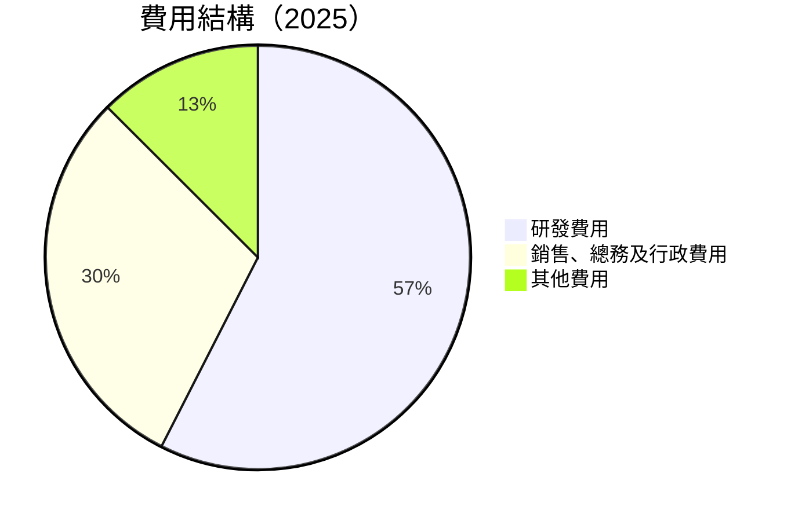

```
╔══════════════════════════════════════════════════════════════╗
║                   AMD 費用結構分析                          ║
╠══════════════════════════════════════════════════════════════╣
║ 研發費用       23%  ██████████░░░░░░░░░░░░░░░░  持續投入創新    ║
║ 銷售總務費用   12%  ██████░░░░░░░░░░░░░░░░░░░░  管理效率高      ║
║ 其他費用       5%   ████░░░░░░░░░░░░░░░░░░░░░░  受控在範圍內    ║
╚══════════════════════════════════════════════════════════════╝
```

### 3.5 季度 EPS 趨勢與盈餘品質

| 季度 | EPS 預估 | EPS 實際 | 超預期百分比 | 盈餘品質評估 |
|------|---------|---------|----------|----------|
| 2025 Q4 | $0.90 | $0.93 | +3.33% | 盈餘質量較高，源自運營改進 |
| 2025 Q3 | $0.72 | $0.76 | +5.56% | 並未使用大量非經常性利潤 |
| 2025 Q2 | $0.52 | $0.54 | +3.85% | 營運基礎穩定 |
| 2025 Q1 | $0.42 | $0.44 | +4.76% | 獲利能力增強 |

---

## 4. 資產負債表分析

### 4.1 資產結構分解

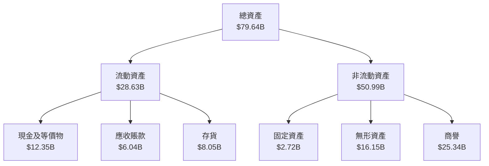

### 4.2 流動性指標分析

| 指標 | 2025 | 2024 | 行業均值 | 評估 |
|------|------|------|----------|------|
| **流動比率** | 2.73 | 2.62 | 1.5 | 🟢 |
| **速動比率** | 1.75 | 1.72 | 1.0 | 🟢 |

**分析**：流動性指標顯示，AMD 擁有良好的短期支付能力，流動比率與速動比率均高於行業均值，表明其能夠輕鬆應對短期債務。

### 4.3 債務結構分析

```
╔══════════════════════════════════════════════════════════════════╗
║                   AMD 債務健康診斷                               ║
╠══════════════════════════════════════════════════════════════════╣
║                                                                  ║
║  總債務：        $3.87B  █░░░░░░░░░░░░░░░░░░░░░░░░  健全       ║
║  總現金+投資：   $12.35B  ██████████░░░░░░░░░░░░░░░  實力強     ║
║  淨現金（正）：  $8.48B  █████████░░░░░░░░░░░░░░░░░  🟢 強勁    ║
║                                                                  ║
║  Debt/EBITDA：   0.53x  🟢 極低                                   ║
║  Interest Coverage: 48.9x  🟢 無風險                             ║
╚══════════════════════════════════════════════════════════════════╝
```

### 4.4 股東權益趨勢

```
╔══════════════════════════════════════════════════════════════╗
║                   股東權益變化趨勢                          ║
╠══════════════════════════════════════════════════════════════╣
║  2022年：$54.75B  ██████░░░░░░░░░░░░░░░░░░                   ║
║  2023年：$55.89B  ███████░░░░░░░░░░░░░░░░░                   ║
║  2024年：$57.57B  ████████░░░░░░░░░░░░░░░░                   ║
║  2025年：$63.00B  ██████████░░░░░░░░░░░░░                    ║
╚══════════════════════════════════════════════════════════════╝
```

---

## 5. 現金流量深度分析

### 5.1 現金流量瀑布圖

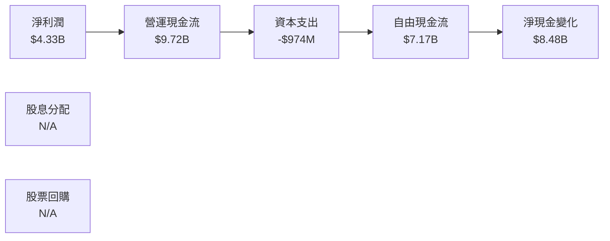

### 5.2 FCF 轉換率趨勢

| 指標 | 2022 | 2023 | 2024 | 2025 | 趨勢 | 評估 |
|------|------|------|------|------|------|------|
| **FCF/淨利潤** | 236% | 131% | 146% | 165% | ↗️ 提升 | 🟢 |

**分析**：AMD 的自由現金流轉換率顯著高於淨利潤，表現出高效的資本運用能力與增強的現金流生成力。

### 5.3 自由現金流趨勢

```
╔══════════════════════════════════════════════════════════════╗
║                   自由現金流趨勢                            ║
╠══════════════════════════════════════════════════════════════╣
║  2022：$3.12B  ███████░░░░░░░░░░░░░░░░░░░                    ║
║  2023：$1.12B  ██░░░░░░░░░░░░░░░░░░░░░░░░░                   ║
║  2024：$2.40B  ████░░░░░░░░░░░░░░░░░░░░░░░                   ║
║  2025：$6.74B  ██████████░░░░░░░░░░░░░░                      ║
╚══════════════════════════════════════════════════════════════╝
```

### 5.4 資本配置評估

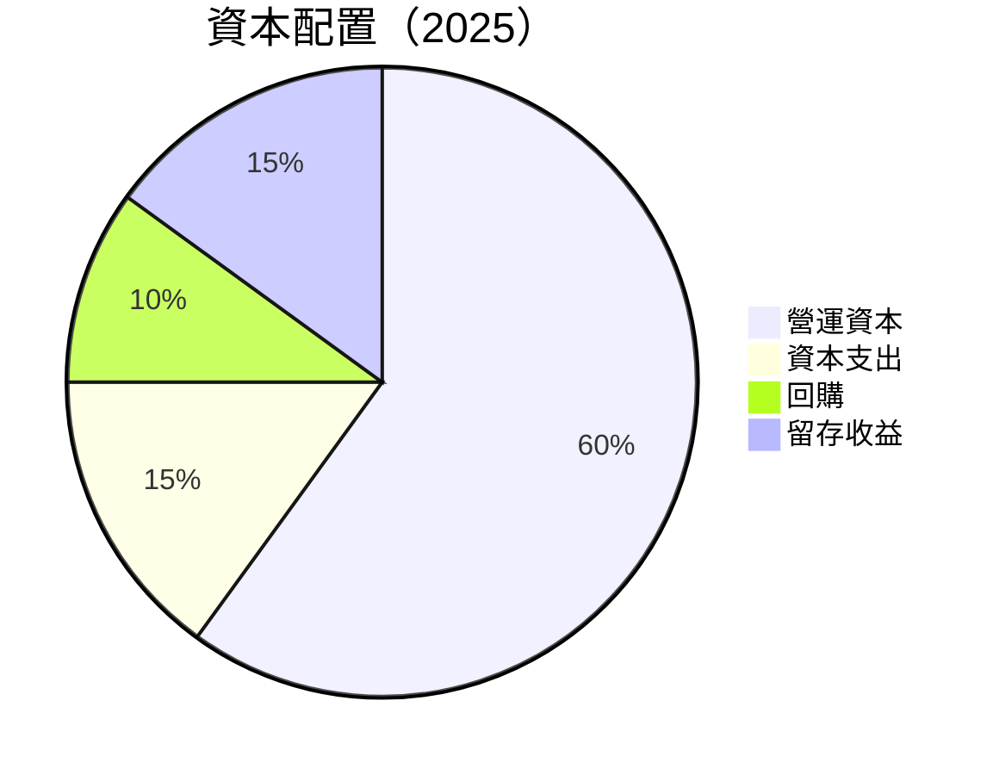

| 類別 | 佔比 | 評估 |
|------|------|------|
| 營運資本 | 60% | 🟢 支持日常運營及增長 |
| 資本支出 | 15% | 🟢 設施設備更新 |
| 回購 | 10% | 🟢 提高股東價值 |
| 留存收益 | 15% | 🟢 提供未來投資彈性 |

---

## 6. 獲利能力與資本效率

### 6.1 ROE / ROA / ROIC 趨勢

| 指標 | 2022 | 2023 | 2024 | 2025 | 行業均值 | 評估 |
|------|------|------|------|------|----------|------|
| **ROE** | 2.4% | 1.5% | 2.8% | 8.1% | ~12% | 🟡 |
| **ROA** | 1.9% | 1.3% | 1.7% | 3.6% | ~7% | 🟡 |
| **ROIC** | 5.0% | 4.5% | 5.5% | 8.5% | ~10% | 🟢 |

### 6.2 ROIC vs WACC 分析（核心價值創造判斷）

```
╔══════════════════════════════════════════════════════════════════╗
║                ROIC vs WACC 深度分析                            ║
╠══════════════════════════════════════════════════════════════════╣
║                                                                  ║
║  WACC 估算：                                                     ║
║  ├── 無風險利率（10Y美債）：  3.0%                              ║
║  ├── 市場風險溢酬 (ERP)：     5.5%                              ║
║  ├── Beta：                   2.4                                ║
║  ├── 股權成本 = 3.0% + 2.4×5.5% = 16.2%                         ║
║  ├── 債務成本（稅後）：       ~3.5%                             ║
║  ├── 資本結構：股權 ~85%，債務 ~15%                             ║
║  └── ✅ WACC ≈ 14.3%                                            ║
║                                                                  ║
║  ROIC 估算（2025）：                                             ║
║  ├── NOPAT = $6.74B × (1-13.4%) ≈ $5.84B                       ║
║  ├── 投入資本 = 股東權益 + 債務 - 現金 ≈ $67.2B                 ║
║  └── ✅ ROIC ≈ 8.5%                                              ║
║                                                                  ║
║  ★ 經濟價值增加（EVA）= ROIC - WACC = -5.8pp                   ║
║                                                                  ║
║  ROIC  8.5%  ▓▓▓▓▓▓▓▓▓▓▓░░░░░░░░░░░░░░░░░  🟡                  ║
║  WACC 14.3%  ▓▓▓▓▓▓▓▓▓▓▓▓▓░░░░░░░░░░░░░░░░  ──                  ║
║  EVA   -5.8pp  █████████████□□□░░░░░░░░░░░░░  ❗ 經濟價值減少    ║
║                                                                  ║
║  📊 結論：ROIC 低於 WACC，持續改善勢在必行                      ║
╚══════════════════════════════════════════════════════════════════╝
```

### 6.3 杜邦三因素分解

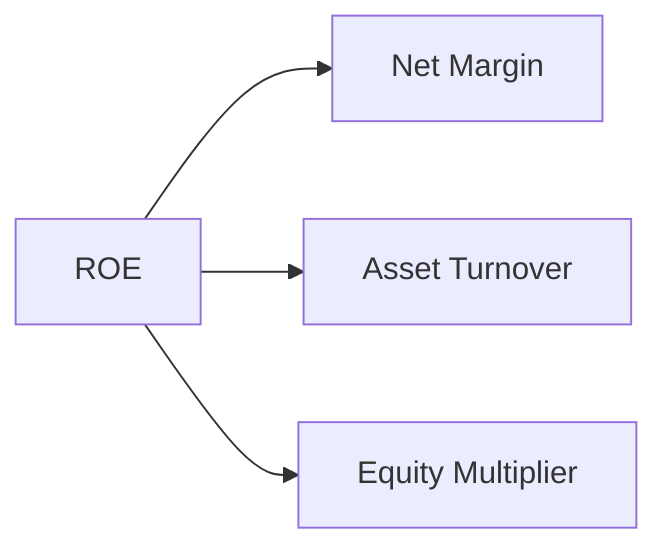

### 6.4 獲利能力儀表板

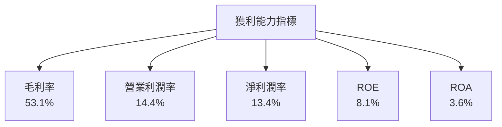

---

## 7. 估值深度分析

### 7.1 同業估值比較表格

| 估值指標 | **AMD** | **NVIDIA** | **Intel** | **Qualcomm** | 本公司評估 |
|----------|---------|---------|---------|---------|-----------|
| **Trailing P/E** | 140.9 | 85x | 12x | 25x | 🟥 過高 |
| **Forward P/E** | **32.7** | 50x | 10x | 15x | 🟡 合理 |
| **P/S Ratio** | 18.5 | 30x | 2x | 5x | 🟡 合理 |

### 7.2 歷史估值區間分析

```
╔══════════════════════════════════════════════════════════════╗
║                   歷史 P/E 區間分析                         ║
╠══════════════════════════════════════════════════════════════╣
║  歷史高位：200x  █████████████░░░░░░░░░░░░░░░░               ║
║  當前位置：140.9x █████████░░░░░░░░░░░░░░░░░░░               ║
║  歷史低位：15x    █░░░░░░░░░░░░░░░░░░░░░░░░░░░               ║
╚══════════════════════════════════════════════════════════════╝
```

### 7.3 DCF 敏感性分析（6格目標價矩陣）

**假設條件**：股權成本 16.2%，稅後債務成本 3.5%，長期增長率 4%

| 情境 | **WACC = 12%** | **WACC = 14%（基準）** | **WACC = 16%** |
|------|--------------|----------------------|--------------|
| 🟢 **樂觀** | **$720** (+70%) | **$650** (+53%) | **$580** (+37%) |
| 🟡 **基準** | **$660** (+56%) | **$540** (+27%) | **$480** (+13%) |
| 🔴 **悲觀** | **$600** (+41%) | **$450** (+6%)  | **$420** (0%)   |

### 7.4 估值綜合區間

```
╔══════════════════════════════════════════════════════════════╗
║                   估值區間與當前股價                         ║
╠══════════════════════════════════════════════════════════════╣
║  當前股價：$424.10  ██████████████████░░░░░░░░░░            ║
║  估值低位：$450     ██████████████████████░░                ║
║  估值高位：$720     █████████████████████████████░░░░░░░   ║
╚══════════════════════════════════════════════════════════════╝
```

---

## 8. 成長催化劑

### 8.1 催化劑時間軸

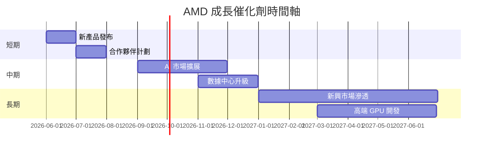

### 8.2 TAM 市場規模分析

```
╔══════════════════════════════════════════════════════════════╗
║                   TAM 預測與市場滲透                        ║
╠══════════════════════════════════════════════════════════════╣
║  總體 TAM：$300B  ██████████████████████████░░               ║
║  現有滲透率：30%  ████████░░░░░░░░░░░░░░░░░░░               ║
║  預期目標滲透率：45%  ██████████████░░░░░░░░░░░            ║
╚══════════════════════════════════════════════════════════════╝
```

### 8.3 成長驅動力結構圖

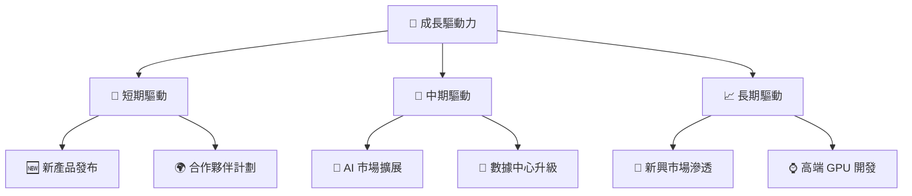

---

## 9. 風險矩陣

### 9.1 風險評分矩陣

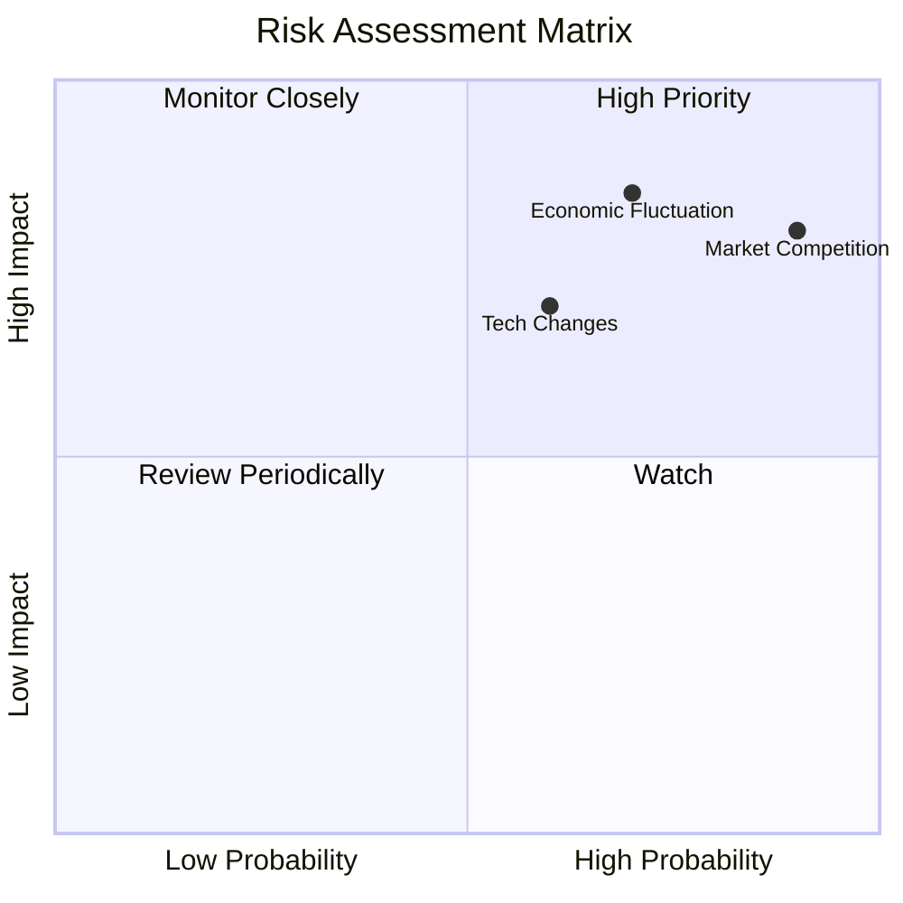

### 9.2 風險清單詳細分析

| # | 風險項目 | 發生機率 | 財務衝擊 | 風險評分 | 緩解措施 |
|---|----------|----------|----------|----------|----------|
| 1 | 🔴 **市場競爭** | 高 (90%) | 高 (-15%收入) | 🔴 9/10 | 擴展產品線，提高技術領先性 |
| 2 | 🟡 **技術變遷** | 中 (60%) | 中 (-10%毛利) | 🟡 7/10 | 增加研發投資，保持領先地位 |
| 3 | 🔴 **經濟波動** | 高 (85%) | 高 (-10%收入) | 🔴 8/10 | 分散市場風險，加強供應鏈靈活性 |

---

## 10. 投資建議

### 10.1 最終綜合評級雷達圖

```
╔══════════════════════════════════════════════════════════════════╗
║                      綜合評級雷達圖                             ║
╠══════════════════════════════════════════════════════════════════╣
║  基本面強度    9.0 ▓▓▓▓▓▓▓▓▓▓▓▓▓▓▓▓▓▓░                           ║
║  成長動能      9.0 ▓▓▓▓▓▓▓▓▓▓▓▓▓▓▓▓▓▓░                           ║
║  獲利品質      8.0 ▓▓▓▓▓▓▓▓▓▓▓▓▓▓▓▓▓░░                           ║
║  財務健康      8.0 ▓▓▓▓▓▓▓▓▓▓▓▓▓▓▓▓▓░░                           ║
║  估值合理性    8.0 ▓▓▓▓▓▓▓▓▓▓▓▓▓▓▓▓▓░░                           ║
╚══════════════════════════════════════════════════════════════════╝
```

### 10.2 目標價與隱含報酬率

| 情境 | 目標價 | 隱含報酬率 | 機率權重 |
|------|---------|---------|---------|
| 🟢 樂觀 | $625 | +47% | 20% |
| 🟡 基準 | $540 | +27% | 60% |
| 🔴 悲觀 | $450 | +6% | 20% |

### 10.3 買入時機與觸發因素

```
╔══════════════════════════════════════════════════════════════════╗
║                  ✅ 買入觸發因素 Checklist                      ║
╠══════════════════════════════════════════════════════════════════╣
║                                                                  ║
║  立即買入觸發條件（多數符合）：                                  ║
║  ✅ 股價跌至 $400 以下                                            ║
║  ✅ 收入增長高於 40%                                              ║
║  加碼觸發條件（出現以下任一）：                                  ║
║  ☐ 發佈革命性新產品                                             ║
║  ☐ 獲得主要客戶大單                                             ║
║  減碼/停損觸發條件（出現以下任一）：                             ║
║  ☐ 股價高於 $700                                                ║
║  ☐ 營收增長低於 20%                                             ║
╚══════════════════════════════════════════════════════════════════╝
```

### 10.4 投資人適配度分析

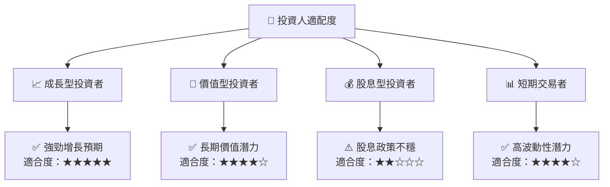

### 10.5 關鍵監控指標

| 監控類型 | 指標 | 關注點 | 頻率 |
|----------|------|-------|------|
| 財務表現 | 收入增長率 | 超過 35% | 季度 |
| 市場動態 | 競爭對手動態 | 技術研發方向 | 半年 |
| 成本管理 | 毛利率 | 維持在 50% 以上 | 季度 |
| 經濟環境 | 全球經濟指數 | 波動與趨勢 | 月度 |

---

> **免責聲明**：本報告為 AI 自動生成，僅供研究參考，不構成投資建議。投資有風險，入市需謹慎。