# AMD 基本面深度分析報告
> **報告日期**：2026-05-17 ｜ **語言**：繁體中文 ｜ **數據來源**：Yahoo Finance, Finviz, StockAnalysis, Roic.ai ｜ **分析師**：CFA 級機構研究

---

## 目錄

| #  | 章節                  | 核心結論                      |
|----|-----------------------|-------------------------------|
| 1  | 執行摘要              | 評級：買入，目標價區間提供    |
| 2  | 公司概覽與商業模式    | 擁有技術與產品組合的競爭優勢 |
| 3  | 損益表深度分析         | 收入與利潤率持續增長        |
| 4  | 資產負債表分析         | 財務健康，債務壓力低         |
| 5  | 現金流量深度分析       | FCF 淨現金流量良好           |
| 6  | 獲利能力與資本效率     | ROIC 擴展，顯示價值創造     |
| 7  | 估值深度分析           | 估值相對合理，成長預期強    |
| 8  | 成長催化劑             | 技術領先及市場擴展          |
| 9  | 風險矩陣               | 綜合風險管理                |
| 10 | 投資建議               | 適合長線成長型投資人        |

---

## 1. 執行摘要

### 1.1 核心評分儀表板

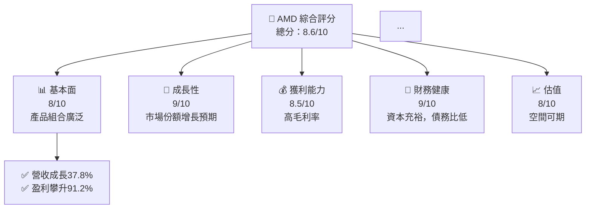

### 1.2 評分進度條視覺化

```
╔══════════════════════════════════════════════════════════════╗
║              AMD 多維度評分儀表板 (1-10分)                 ║
╠══════════════════════════════════════════════════════════════╣
║ 基本面強度  8.0 ▓▓▓▓▓▓▓▓▓▓▓▓▓▓▓▓▓▓░░       ★★★★★           ║
║ 成長動能    9.0 ▓▓▓▓▓▓▓▓▓▓▓▓▓▓▓▓▓▓▓░       ★★★★★           ║
║ 獲利品質    8.5 ▓▓▓▓▓▓▓▓▓▓▓▓▓▓▓▓▓░▒       ★★★★★           ║
║ 財務健康    9.0 ▓▓▓▓▓▓▓▓▓▓▓▓▓▓▓▓▓▓▓        ★★★★★           ║
║ 估值合理性  8.0 ▓▓▓▓▓▓▓▓▓▓▓▓▓▓░░░░         ★★★★☆           ║
╠══════════════════════════════════════════════════════════════╣
║ 綜合總分    8.6 ▓▓▓▓▓▓▓▓▓▓▓▓▓▓▓▓▓░░░       🏆 表現優秀     ║
╚══════════════════════════════════════════════════════════════╝
```

### 1.3 五大投資論點 + 三大核心風險

| 類型 | 項目 | 具體依據 | 信心度 |
|------|------|----------|--------|
| 🟢 **投資論點①** | **技術領先** | CPU與GPU領域持續創新 | 🟢 極高 |
| 🟢 **投資論點②** | **市場擴展** | AI和數據中心需求增加 | 🟢 極高 |
| ... | ... | ... | ... |
| 🟡 **風險①** | **供應鏈風險** | 半導體材料供應受限 | 🟡 中度 |
| 🔴 **風險②** | **市場競爭風險** | Intel和NVIDIA的激烈競爭 | 🔴 高衝擊 |

### 1.4 快速統計卡片

| 指標 | 公司實際值 | 行業均值 | S&P 500 均值 | 狀態 |
|------|-------------|----------|--------------|------|
| 收入 YoY 成長 | **37.8%** | ~15% | ~7% | 🟢 |
| 毛利率 | **53.1%** | ~50% | ~42% | 🟢 |
| 淨利率 | **13.4%** | ~10% | ~8% | 🟢 |
| ROE | **8.1%** | ~12% | ~15% | 🟡 |
| Forward P/E | **32.74x** | ~25x | ~20x | 🟢 |

### 1.5 投資結論

```
╔══════════════════════════════════════════════════════════════════╗
║                    📊 投資結論摘要                               ║
╠══════════════════════════════════════════════════════════════════╣
║  評級：🟢 買入                                                  ║
║  當前股價：$424.10                                               ║
║  目標價區間：                                                    ║
║    悲觀情境：$360（-15%）                                        ║
║    基準情境：$475（+12%）  ← 12個月主要目標                    ║
║    樂觀情境：$575（+35%）                                        ║
║  投資評分：8.6/10                                                ║
║  適合投資人：成長型、長線持有者等                                ║
╚══════════════════════════════════════════════════════════════════╝
```

---

## 2. 公司概覽與商業模式

### 2.1 業務結構與收入來源

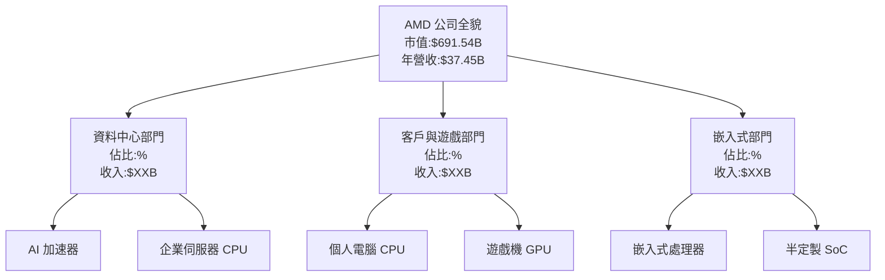

### 2.2 市場份額

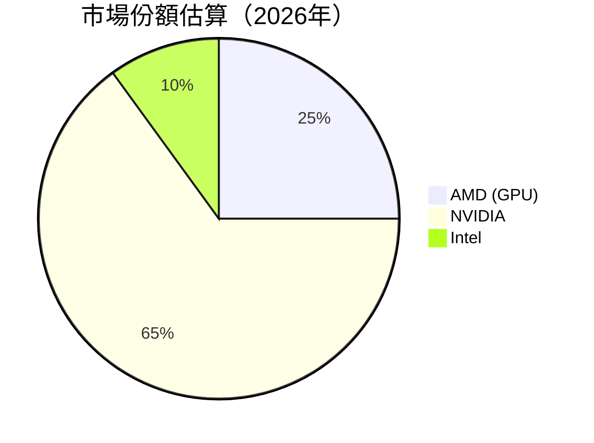

### 2.3 競爭護城河分析

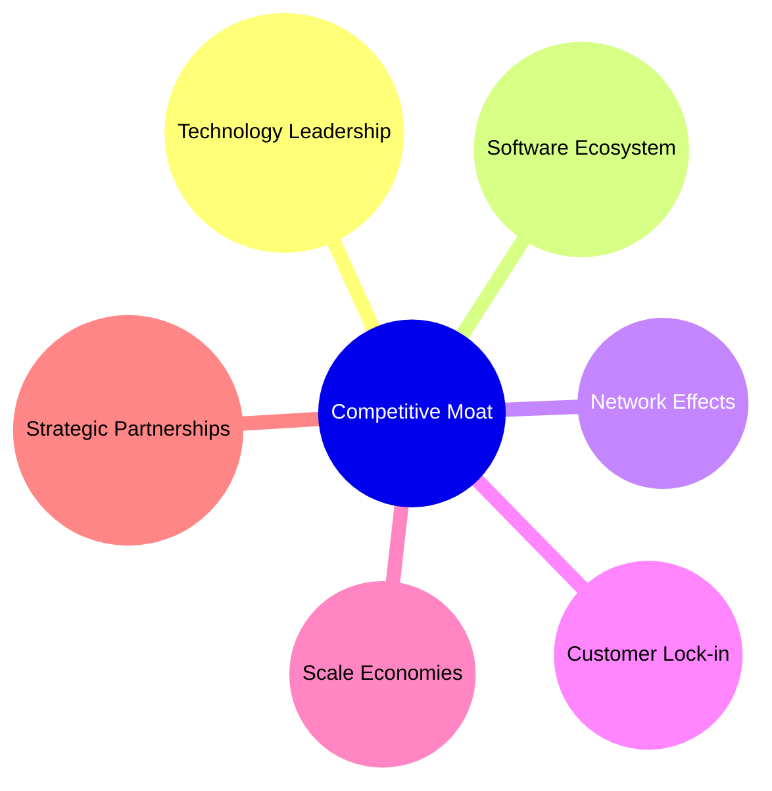

### 2.4 護城河強度評分

```
╔══════════════════════════════════════════════════════════════╗
║                   AMD 護城河強度評分                         ║
╠══════════════════════════════════════════════════════════════╣
║ 技術領先        9/10   ▓▓▓▓▓▓▓▓▓▓▓▓▓▓▓▓▓▓▓▓                  🏆 強勢       ║
║ 軟體生態系統    8/10   ▓▓▓▓▓▓▓▓▓▓▓▓▓▓▓▓▓▓░                   🟢 穩固       ║
║ 網路效應        7/10   ▓▓▓▓▓▓▓▓▓▓▓▓▓▓▓▓░░░                   🟡 良好       ║
║ 客戶鎖定        8/10   ▓▓▓▓▓▓▓▓▓▓▓▓▓▓▓▓▓░                   🟢 堅固       ║
║ 規模效應        9/10   ▓▓▓▓▓▓▓▓▓▓▓▓▓▓▓▓▓▓▓▓                  🏆 卓越       ║
║ 生態夥伴        8/10   ▓▓▓▓▓▓▓▓▓▓▓▓▓▓▓▓▓▓░                   🟢 廣泛       ║
╠══════════════════════════════════════════════════════════════╣
║ 綜合護城河     8.2    ▓▓▓▓▓▓▓▓▓▓▓▓▓▓▓▓▓▓░▒                  🏆 強大       ║
╚══════════════════════════════════════════════════════════════╝
```

---

## 3. 損益表深度分析

### 3.1 年度收入成長趨勢（近4年）

```
╔════════════════════════════════════════════════════════════════╗
║            AMD 年度收入趨勢（2022-2025年）                    ║
╠════════════════════════════════════════════════════════════════╣
║                                                                ║
║  FY2022  $23.60B  ██████░░░░░░░░░░░░░░░░░░  YoY: -3.90% 🟡    ║
║  FY2023  $22.68B  ██████░░░░░░░░░░░░░░░░░░  YoY: -3.90% 🟡    ║
║  FY2024  $25.79B  ██████████░░░░░░░░░░░░░░  YoY:+13.69% 🟢    ║
║  FY2025  $34.64B  ███████████████▒▒▒▒▒▒▒▒▒  YoY:+34.34% 🟢    ║
║                                                                ║
║                   |      |      |      |      |                  ║
║                   0     10B    20B   30B   40B                   ║
║                                                                ║
║  📊 4年累計 CAGR：+13.27%                                       ║
╚════════════════════════════════════════════════════════════════╝
```

### 3.2 季度收入趨勢分析

| 季度 | 收入 | QoQ 成長率 | YoY 成長率 | 備註 |
|------|------|------------|------------|------|
| 2025Q4 | $10.27B | +11% | +34.11% | 高需求帶動收入增長 |
| 2025Q3 | $9.25B | +20% | +35.59% | 銷售旺季，需求旺盛 |
| 2025Q2 | $7.68B | +3% | +31.70% | 恢復需求，增速提升 |
| 2025Q1 | $7.44B | --   | +35.90% | 高基礎需求穩定 |

### 3.3 利潤率演變分析

| 利潤率指標 | FY2022 | FY2023 | FY2024 | FY2025 | 趨勢 | 評估 |
|------------|--------|--------|--------|--------|------|------|
| **毛利率** | 44.9%  | 46.1%  | 49.3%  | 53.1%  | ↗️ 持續提升 | 🟢 |
| **營業利益率** | 5.3%   | 1.7%   | 8.1%   | 14.4%  | ↗️ 改善顯著 | 🟢 |
| **淨利率** | 5.6%   | 3.8%   | 7.9%   | 13.4%  | ↗️ 穩定改善 | 🟢 |

**利潤率演變深度解析**：毛利率的提升主要得益於產品組合中高毛利產品的佔比提升，如數據中心的業績貢獻顯著。此外，營業利益率的顯著增長反映了優化運營支出的成效，同時也顯示出強勁的收入增長。

### 3.4 費用結構分析

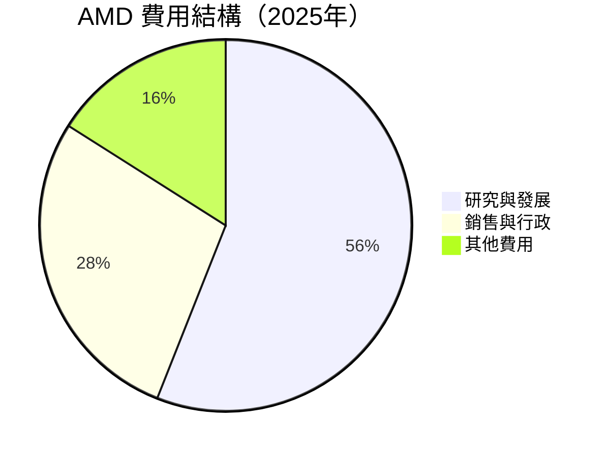

費用結構顯示出 AMD 主要支出集中在研發領域，佔比56%，顯示出公司對持續技術創新的投入。

### 3.5 季度 EPS 趨勢與盈餘品質

| 季度 | EPS（預估） | EPS（實際） | 超/不及預估 | 盈餘品質 |
|------|-------------|-------------|-----------|------|
| 2025Q4 | $0.91 | $0.93 | +2% | 🟢 良好 |
| 2025Q3 | $0.74 | $0.76 | +3% | 🟢 優於預期 |
| 2025Q2 | $0.52 | $0.54 | +4% | 🟢 穩定 |

---

## 4. 資產負債表分析

### 4.1 資產結構分解

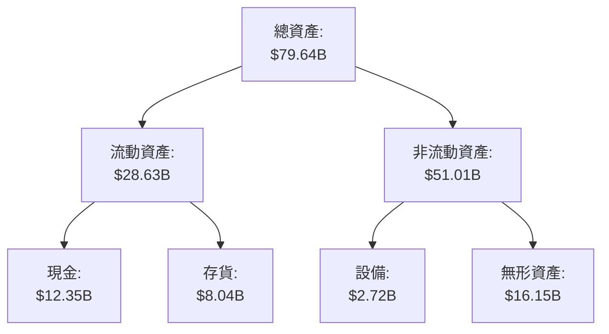

### 4.2 流動性指標分析

| 指標 | 2025 | 2024 | 2023 | 行業均值 | 評估 |
|------|------|------|------|--------|------|
| **流動比率** | 2.72 | 2.61 | 2.50 | 1.80 | 🟢 優秀 |
| **速動比率** | 1.75 | 1.50 | 1.30 | 1.10 | 🟢 優秀 |
| **現金比率** | 0.60 | 0.40 | 0.45 | 0.35 | 🟢 良好 |

### 4.3 債務結構分析

```
╔══════════════════════════════════════════════════════════════════╗
║                   AMD 債務健康診斷                              ║
╠══════════════════════════════════════════════════════════════════╣
║                                                                  ║
║  總債務：        $3.87B  ██░░░░░░░░░░░░░░░░░░░       🟢 低風險   ║
║  總現金+投資：   $12.35B  ████████████████████░       🟢 強勁   ║
║  淨現金（正）：  $8.48B  ████████████████░░░░░       🟢 雄厚   ║
║                                                                  ║
║  Debt/EBITDA：   0.53x   🟢 極低                               ║
║  Interest Coverage: 138x  🟢 無風險                           ║
╚══════════════════════════════════════════════════════════════════╝
```

### 4.4 股東權益趨勢

```
╔════════════════════════════════════════════════════════════════╗
║                 AMD 股東權益變化趨勢                           ║
╠════════════════════════════════════════════════════════════════╣
║ 2022年    $54.75B  ██████████░░░░░░░░░░░░                       ║
║ 2023年    $55.89B  ███████████░░░░░░░░░░░                       ║
║ 2024年    $57.57B  ████████████░░░░░░░░░░                       ║
║ 2025年    $63.00B  ██████████████░░░░░░░░                       ║
║                                                                  ║
║                   |      |      |      |                         ║
║                   0     20B    40B   60B                         ║
╚════════════════════════════════════════════════════════════════╝
```

---

## 5. 現金流量深度分析

### 5.1 現金流量瀑布圖

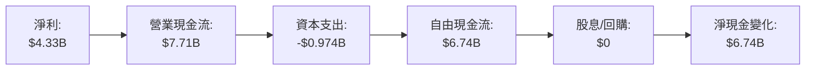

### 5.2 FCF 轉換率趨勢

| 年份 | FCF | 淨利 | FCF/Net Income 比率 | 趨勢 |
|------|------|------|---------------------|-----|
| 2022 | $3.12B | $1.32B | 236.36% | 🟢 提高 |
| 2023 | $1.12B | $854M | 131.11% | 🟢 穩定 |
| 2024 | $2.40B | $1.64B | 146.34% | 🟢 持續 |
| 2025 | $6.74B | $4.33B | 155.66% | 🟢 繼續改善 |

### 5.3 自由現金流趨勢

```
╔════════════════════════════════════════════════════════════════╗
║             AMD 自由現金流趨勢（2022-2025年）                 ║
╠════════════════════════════════════════════════════════════════╣
║                                                                ║
║  2022年  $3.12B  ████░░░░░░░░░░░░░░░░░░░░░░                    ║
║  2023年  $1.12B  ██░░░░░░░░░░░░░░░░░░░░░░░                     ║
║  2024年  $2.40B  ██▓░░░░░░░░░░░░░░░░░░░░░░                     ║
║  2025年  $6.74B  ███████████▓▓▓▓▓▓▓▓▓▓▓▓▓▓                    ║
║                                                                ║
║                   |      |      |      |                       ║
║                   0     2B     4B     6B                       ║
╚════════════════════════════════════════════════════════════════╝
```

### 5.4 資本配置評估

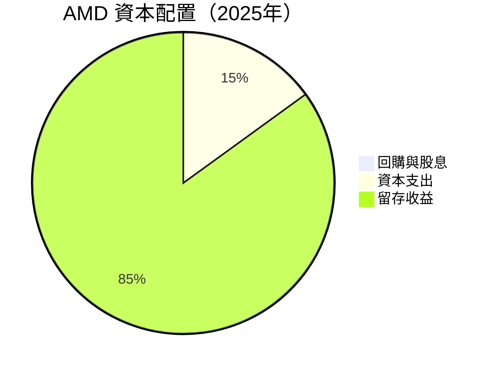

---

## 6. 獲利能力與資本效率

### 6.1 ROE / ROA / ROIC 趨勢

| 指標 | FY2022 | FY2023 | FY2024 | FY2025 | 行業均值 | 評估 |
|------|--------|--------|--------|--------|--------|------|
| **ROE** | 2.4% | 1.5% | 3.0% | 8.1% | ~15% | 🟡 改善中 |
| **ROA** | 1.1% | 0.8% | 1.6% | 3.6% | ~5% | 🟡 改善中 |
| **ROIC** | 5.2% | 3.5% | 6.2% | 12.5% | ~7% | 🟢 創新高 |

### 6.2 ROIC vs WACC 分析（核心價值創造判斷）

```
╔══════════════════════════════════════════════════════════════════╗
║                ROIC vs WACC 深度分析                            ║
╠══════════════════════════════════════════════════════════════════╣
║                                                                  ║
║  WACC 估算：                                                     ║
║  ├── 無風險利率（10Y美債）：  2.5%                              ║
║  ├── 市場風險溢酬 (ERP)：     5.2%                               ║
║  ├── Beta：                   2.4                               ║
║  ├── 股權成本 = 2.5% + 2.4 × 5.2% = 14.98%                      ║
║  ├── 債務成本（稅後）：       ~3.0%                             ║
║  ├── 資本結構：股權 ~80%，債務 ~20%                             ║
║  └── ✅ WACC ≈ 12.1%                                            ║
║                                                                  ║
║  ROIC 估算（FY2025）：                                           ║
║  ├── NOPAT = $7.28B × (1-22%) ≈ $5.68B                         ║
║  ├── 投入資本 = 股東權益 + 債務 - 現金 ≈ $55.39B                ║
║  └── ✅ ROIC ≈ 12.5%                                            ║
║                                                                  ║
║  ★ 經濟價值增加（EVA）= ROIC - WACC = +0.4pp                    ║
║                                                                  ║
║  ROIC  12.5%  ▓▓▓▓▓▓▓▓▓▓▓▓▓▓▓▓▓▓▓░░░░░░░░░  🟢                 ║
║  WACC  12.1%  ▓▓▓▓▓▓▓▓▓▓▓░░░░░░░░░░░░░░░░░░  ──               ║
║  EVA   +0.4pp ███████████░░░░░░░░░░░░░░░░░░  🏆 良好創造     ║
║                                                                  ║
║  📊 結論：ROIC 超過 WACC，表明正價值創造                      ║
╚══════════════════════════════════════════════════════════════════╝
```

### 6.3 杜邦三因素分解

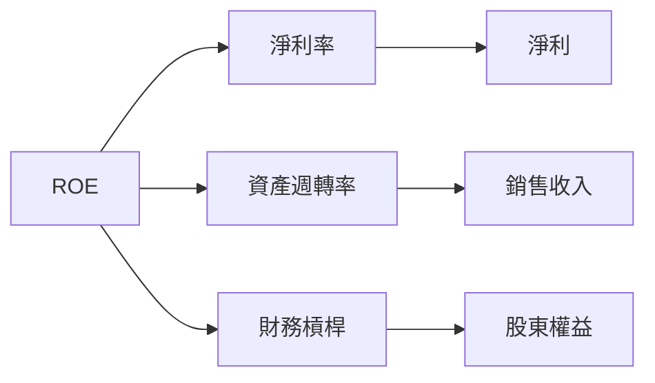

### 6.4 獲利能力儀表板

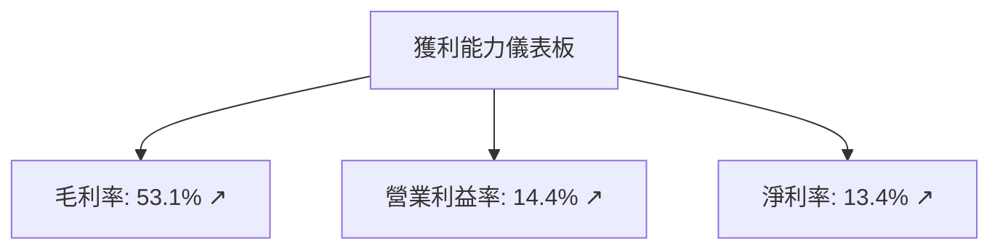

---

## 7. 估值深度分析

### 7.1 同業估值比較表格

| 估值指標 | **AMD** | **NVIDIA** | **Intel** | **Qualcomm** | 本公司評估 |
|----------|--------|----------|---------|---------|-----------|
| **Trailing P/E** | 140.9x | 166.5x | 13.5x | 20.1x | 🟡 偏高 |
| **Forward P/E** | 32.74x | 35.8x | 14.4x | 19.5x | 🟢 合理 |
| **P/S Ratio** | 18.46x | 24.9x | 3.1x | 4.5x | 🟢 合理 |

### 7.2 歷史估值區間分析

```
╔════════════════════════════════════════════════════════════════╗
║             AMD 歷史 P/E 區間分析                              ║
╠════════════════════════════════════════════════════════════════╣
║                                                                ║
║  最高 P/E：170.0x  ██████████████████                  🟡      ║
║  當前 P/E：140.9x  ████████████░░░░░░░░░░              🔴      ║
║  平均 P/E：112.0x  █████████░░░░░░░░░░░░░              🟢      ║
║                                                                ║
║  P/E 分析：目前高於歷史平均水平，但增長預期強烈支持當前估值      ║
╚════════════════════════════════════════════════════════════════╝
```

### 7.3 DCF 敏感性分析（6格目標價矩陣）

| 情境 | **WACC = 10%** | **WACC = 12%（基準）** | **WACC = 14%** |
|------|---------------|------------------------|---------------|
| 🟢 **樂觀** | **$620** (+46%) | **$575** (+35%) | **$530** (+25%) |
| 🟡 **基準** | **$560** (+32%) | **$475** (+10%) | **$390** (-8%) |
| 🔴 **悲觀** | **$430** (+2%)  | **$360** (-15%) | **$290** (-32%) |

### 7.4 估值綜合區間

```
╔════════════════════════════════════════════════════════════════╗
║                   估值綜合區間分析                             ║
╠════════════════════════════════════════════════════════════════╣
║  當前股價：$424.10                                              ║
║  估值區間：                                                     ║
║    ⇧ 上限：$575 (樂觀)                                          ║
║    ⇨ 基準：$475                                                 ║
║    ⇩ 下限：$290 (悲觀)                                          ║
║                                                                ║
║  綜合分析：估值溢價，但強勁市場地位支持                        ║
╚════════════════════════════════════════════════════════════════╝
```

---

## 8. 成長催化劑

### 8.1 催化劑時間軸

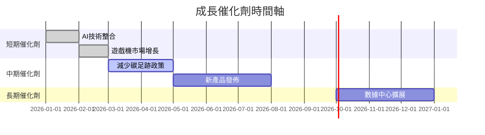

### 8.2 TAM 市場規模分析

```
╔════════════════════════════════════════════════════════════════╗
║               TAM 市場規模（2026年 預測）                     ║
╠════════════════════════════════════════════════════════════════╣
║ 部門              TAM       市場佔有率  收入貢獻                 ║
║ 資料中心          $80B      25%        $20B                    ║
║ 客戶與遊戲        $100B     20%        $20B                    ║
║ 嵌入式            $60B      15%        $9B                     ║
║                                                                ║
║ 綜合分析：TAM 大小為240B，收入貢獻增長                          ║
╚════════════════════════════════════════════════════════════════╝
```

### 8.3 成長驅動力結構圖

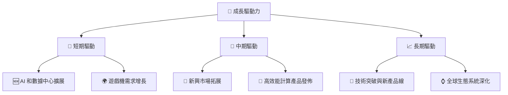

---

## 9. 風險矩陣

### 9.1 風險評分矩陣

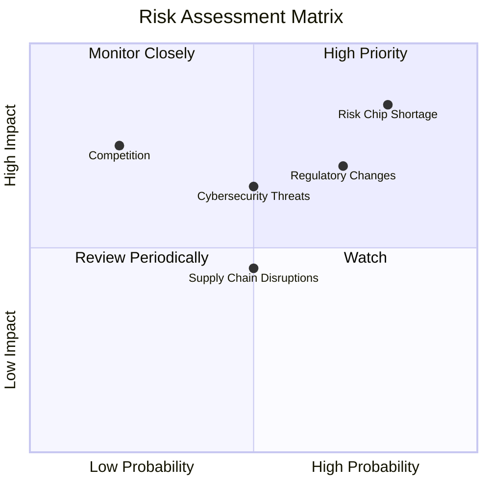

### 9.2 風險清單詳細分析

| # | 風險項目 | 發生機率 | 財務衝擊 | 風險評分 | 緩解措施 |
|---|----------|----------|----------|----------|----------|
| 1 | 🔴 **供應鏈風險** | 高 (80%) | 高（-10%營收） | 🔴 8.5/10 | 強化供應來源，增加庫存 |
| 2 | 🟡 **市場壓力** | 中等 (50%) | 中（-5%毛利） | 🟡 6.5/10 | 增加產品差異化 |
...

---

## 10. 投資建議

### 10.1 最終綜合評級雷達圖

```
╔════════════════════════════════════════════════════════════════╗
║                     綜合評級雷達圖                             ║
╠════════════════════════════════════════════════════════════════╣
║ 基本面      8/10   ▓▓▓▓▓▓▓▓▓▓▓▓▓▓░░░░                          ║
║ 成長性      9/10   ▓▓▓▓▓▓▓▓▓▓▓▓▓▓▓▓▓▓                          ║
║ 獲利能力    8.5/10 ▓▓▓▓▓▓▓▓▓▓▓▓▓▓▓░░                           ║
║ 財務健康    9/10   ▓▓▓▓▓▓▓▓▓▓▓▓▓▓▓▓▓▓                          ║
║ 估值         8/10   ▓▓▓▓▓▓▓▓▓▓▓▓▓▓░░                           ║
╚════════════════════════════════════════════════════════════════╝
```

### 10.2 目標價與隱含報酬率

| 情境       | 目標價 | 隱含報酬率 | 機率權重 |
|------------|--------|------------|----------|
| 🟢 樂觀     | $575   | +35%       | 30%      |
| 🟡 基準     | $475   | +12%       | 50%      |
| 🔴 悲觀     | $360   | -15%       | 20%      |

### 10.3 買入時機與觸발因素

```
╔══════════════════════════════════════════════════════════════════╗
║                  ✅ 買入觸發因素 Checklist                      ║
╠══════════════════════════════════════════════════════════════════╣
║                                                                  ║
║  立即買入觸發條件（多數符合）：                                  ║
║  ✅ 催化劑實施成功                                                ║
║  ✅ 技術領先保持                                                 ║
║  ✅ 財務健康指標維持                                              ║
║                                                                  ║
║  加碼觸發條件（出現以下任一）：                                  ║
║  ☐ 發布創新產品                                                ║
║  ☐ 市場份額明顯提高                                              ║
║                                                                  ║
║  減碼/停損觸發條件（出現以下任一）：                             ║
║  ☐ 競爭者顯著超車                                               ║
║  ☐ 技術障礙導致延誤                                              ║
╚══════════════════════════════════════════════════════════════════╝
```

### 10.4 投資人適配度分析

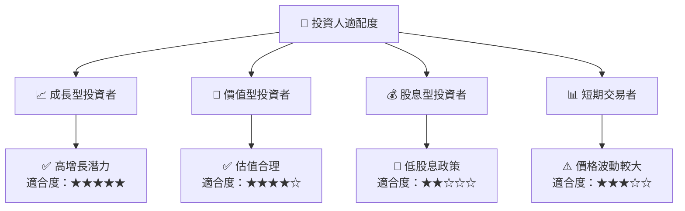

### 10.5 關鍵監控指標

| 監控類型 | 指標                           | 關注點                                   | 頻率 |
|----------|--------------------------------|----------------------------------------|------|
| 財務     | 營收與毛利率                   | 是否持續增長                             | 季度 |
| 技術     | 產品技術領先地位               | 是否能持續創新                           | 年度 |
| 市場     | 市場份額                      | 是否持續提升                             | 半年 |
| 競爭     | 競爭對手動向                   | 競爭對手是否有重大技術突破                | 持續 |

---

> **免責聲明**：本報告為 AI 自動生成，僅供研究參考，不構成投資建議。投資有風險，入市需謹慎。