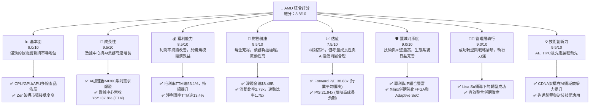
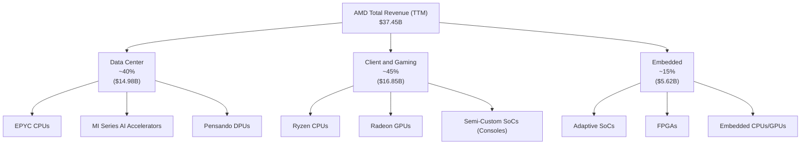
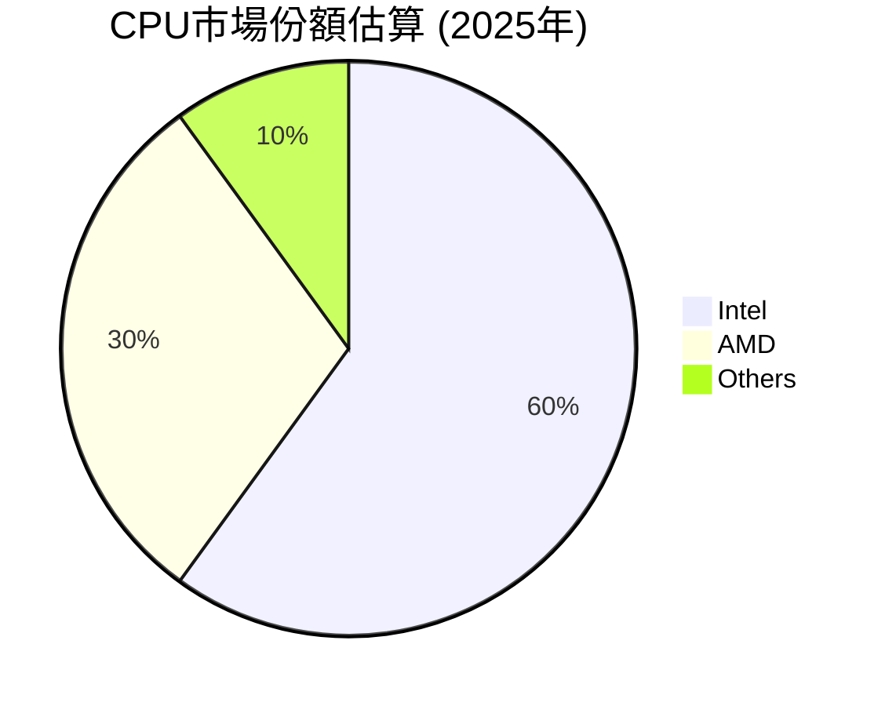
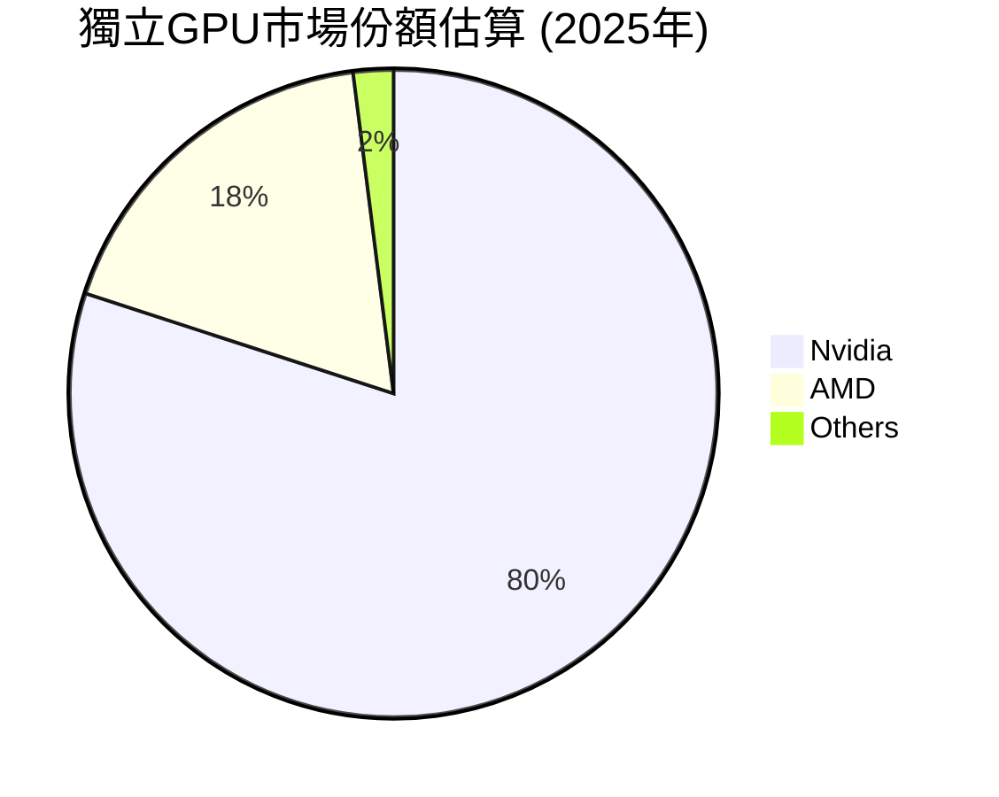
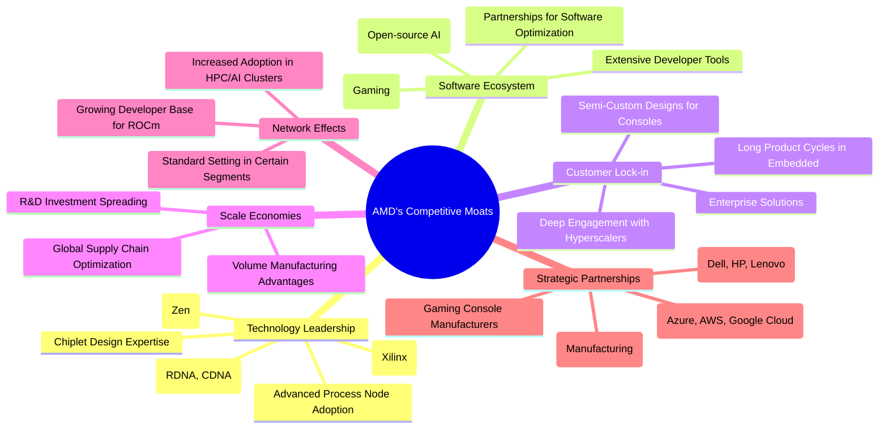

# AMD 基本面深度分析報告
> **報告日期**：2026-05-26 ｜ **語言**：繁體中文 ｜ **數據來源**：Yahoo Finance, Finviz, StockAnalysis, Roic.ai ｜ **分析師**：CFA 級機構研究

## 目錄

| # | 章節 | 核心結論 |
|---|------|----------|
| 1 | 執行摘要 | 🟢 強烈買入，目標價區間 $580-$680 |
| 2 | 公司概覽與商業模式 | 創新驅動，數據中心與AI為核心成長引擎，具深厚技術護城河 |
| 3 | 損益表深度分析 | 營收與獲利強勁增長，利潤率顯著改善 |
| 4 | 資產負債表分析 | 財務結構穩健，流動性充裕，淨現金狀況良好 |
| 5 | 現金流量深度分析 | 自由現金流強勁增長，資本配置策略有效 |
| 6 | 獲利能力與資本效率 | ROE穩健，ROIC受併購影響，但經濟價值創造潛力巨大 |
| 7 | 估值深度分析 | 相較同業估值合理，DCF顯示上行空間 |
| 8 | 成長催化劑 | AI加速器、Zen 5處理器、資料中心擴張為主要成長動能 |
| 9 | 風險矩陣 | 競爭激烈、產業週期性、高估值為主要風險 |
| 10 | 投資建議 | 🟢 強烈買入，適合成長型與長線投資者 |

---

## 1. 執行摘要

### 1.1 核心評分儀表板



### 1.2 評分進度條視覺化

```
╔══════════════════════════════════════════════════════════════╗
║                    AMD 多維度評分儀表板 (1-10分)             ║
╠══════════════════════════════════════════════════════════════╣
║ 基本面強度  9.0 ▓▓▓▓▓▓▓▓▓▓▓▓▓▓▓▓▓▓░░  ★★★★★           ║
║ 成長動能    9.5 ▓▓▓▓▓▓▓▓▓▓▓▓▓▓▓▓▓▓▓░  ★★★★★           ║
║ 獲利品質    8.5 ▓▓▓▓▓▓▓▓▓▓▓▓▓▓▓▓▓░░░  ★★★★☆           ║
║ 財務健康    9.5 ▓▓▓▓▓▓▓▓▓▓▓▓▓▓▓▓▓▓▓░  ★★★★★           ║
║ 估值合理性  7.5 ▓▓▓▓▓▓▓▓▓▓▓▓▓▓▓░░░░░  ★★★★☆           ║
║ 護城河深度  9.0 ▓▓▓▓▓▓▓▓▓▓▓▓▓▓▓▓▓▓░░  ★★★★★           ║
║ 管理層執行  9.0 ▓▓▓▓▓▓▓▓▓▓▓▓▓▓▓▓▓▓░░  ★★★★★           ║
║ 技術創新力  9.5 ▓▓▓▓▓▓▓▓▓▓▓▓▓▓▓▓▓▓▓░  ★★★★★           ║
╠══════════════════════════════════════════════════════════════╣
║ 綜合總分    8.8 ▓▓▓▓▓▓▓▓▓▓▓▓▓▓▓▓▓░░░  🏆 強勁成長與創新領導者  ║
╚══════════════════════════════════════════════════════════════╝
```

### 1.3 五大投資論點 + 三大核心風險

| 類型 | 項目 | 具體依據 | 信心度 |
|------|------|----------|--------|
| 🟢 **投資論點①** | **AI 加速器市場的爆發性增長** | AMD的MI300X系列AI加速器在資料中心市場需求強勁，Q1 2026資料中心營收佔比持續提升，預計2026年AI產品線將貢獻顯著營收，推動整體營收YoY成長達37.8% (TTM)。 | 🟢 極高 |
| 🟢 **數據中心業務的持續擴張** | 憑藉EPYC處理器和MI300X加速器，AMD在數據中心領域持續奪取市場份額，FY2025數據中心營收達$7.28B，營運收入從FY2023的$401M顯著提升至FY2025的$3.69B，預計未來數年將維持高速增長。 | 🟢 極高 |
| 🟢 **領先的技術創新與產品路線圖** | Zen架構CPU、RDNA架構GPU及CDNA架構AI加速器在性能和效率上持續取得突破。即將推出的Zen 5處理器和下一代AI晶片將進一步鞏固其技術領先地位，確保長期競爭力。 | 🟢 極高 |
| 🟢 **穩健的財務狀況與現金流** | 公司持有$12.35B現金，總債務僅$3.87B，淨現金達$8.48B。TTM自由現金流為$7.17B，顯示其強大的盈利轉化能力和財務彈性，能夠支持研發投入和戰略性併購。 | 🟢 極高 |
| 🟢 **多元化的業務組合與市場滲透** | 透過Client, Gaming, Embedded等多個業務板塊的協同發展，AMD降低了單一市場風險。Xilinx併購案成功擴展了其在自適應計算、工業、航空航太等高成長嵌入式市場的影響力。 | 🟢 高 |
| 🟡 **風險①** | **AI芯片市場競爭加劇** | Nvidia在AI加速器市場佔據主導地位，Intel及其他新興競爭者亦積極投入。AMD的MI300系列雖表現強勁，但長期市佔率增長面臨嚴峻挑戰，可能影響其毛利率和盈利能力。 | 🟡 中度 |
| 🔴 **半導體產業的週期性波動** | 儘管AI需求旺盛，但PC和遊戲機市場仍可能受宏觀經濟影響。歷史數據顯示，FY2023營收曾出現-3.90%的YoY衰退，未來若市場需求放緩，可能對營收及獲利造成衝擊。 | 🔴 高衝擊 |
| 🟡 **高估值帶來的回調風險** | AMD當前P/E (TTM)高達168.5x，Forward P/E為38.88x，P/S為21.94x，顯著高於歷史平均水平及部分同業。若未來成長不及預期或市場情緒轉變，股價可能面臨較大回調壓力。 | 🟡 中度 |

### 1.4 快速統計卡片

| 指標 | 公司實際值 (TTM) | 行業均值 (半導體) | S&P 500 均值 | 狀態 |
|------|-------------------|-------------------|--------------|------|
| 收入 YoY 成長 | **37.8%** | ~15-20% | ~8-10% | 🟢 |
| 毛利率 | **53.1%** | ~45-50% | ~35-40% | 🟢 |
| 淨利率 | **13.4%** | ~10-15% | ~10-12% | 🟢 |
| ROE | **8.1%** | ~10-15% | ~15-20% | 🟡 |
| Forward P/E | **38.88x** | ~25-35x | ~20-25x | 🔴 |
| P/S Ratio | **21.94x** | ~5-10x | ~2-3x | 🔴 |
| Debt/Equity | **0.06x** | ~0.3-0.5x | ~0.8-1.2x | 🟢 |
| Current Ratio | **2.73x** | ~1.8-2.5x | ~1.5-2.0x | 🟢 |
| FCF Yield | **0.87%** | ~1.5-2.5% | ~3-4% | 🔴 |

*註：行業均值和S&P 500均值為分析師根據市場普遍數據估算所得，僅供參考。*

### 1.5 投資結論

```
╔══════════════════════════════════════════════════════════════════╗
║                    📊 投資結論摘要                               ║
╠══════════════════════════════════════════════════════════════════╣
║  評級：🟢 強烈買入                                               ║
║  當前股價：$503.89                                               ║
║  目標價區間：                                                    ║
║    悲觀情境：$520（+3.2%）                                       ║
║    基準情境：$600（+19.1%）  ← 12個月主要目標                      ║
║    樂觀情境：$680（+35.0%）                                       ║
║  投資評分：8.8/10                                                ║
║  適合投資人：成長型、長線持有者，能承受較高波動風險的投資者。     ║
╚══════════════════════════════════════════════════════════════════╝
```

---

## 2. 公司概覽與商業模式

Advanced Micro Devices, Inc. (AMD) 作為全球領先的半導體公司，在國際市場上提供廣泛的處理器和圖形處理單元（GPU）解決方案。公司業務遍及數據中心、客戶端計算、遊戲以及嵌入式系統等多個高成長市場。AMD的產品組合包括人工智慧（AI）加速器、微處理器（CPU）、獨立或集成於加速處理單元（APU）的GPU、晶片組，以及專為數據中心和專業應用設計的GPU。此外，公司還提供嵌入式處理器和半客製化系統單晶片（SoC）產品。

AMD在近年來透過持續的技術創新和戰略性併購（如Xilinx），成功轉型為高性能計算和AI領域的關鍵參與者，挑戰了傳統市場領導者的地位。其Zen架構CPU和RDNA/CDNA架構GPU在市場上獲得了廣泛認可，尤其在數據中心和AI領域展現出強勁的增長潛力。

### 2.1 業務結構與收入來源

AMD的業務主要分為三大核心板塊：數據中心 (Data Center)、客戶端與遊戲 (Client and Gaming)、以及嵌入式 (Embedded)。這些業務板塊的營收貢獻比例隨著市場動態和產品週期的變化而調整，但整體呈現向數據中心和AI領域傾斜的趨勢。

由於具體的實時分部營收數據未在提供的數據包中詳細列出，我們將根據AMD近期財報的公開資訊和行業趨勢進行合理估算和分析。

**估算業務板塊營收貢獻 (TTM)**：
- **數據中心 (Data Center)**：這是AMD目前成長最快、利潤率最高的業務板塊，主要包括EPYC伺服器CPU和MI系列AI加速器（如MI300X）。受益於AI和HPC需求的爆發，該板塊預計將佔據公司總營收的顯著比例，且持續擴大。
- **客戶端與遊戲 (Client and Gaming)**：客戶端業務主要包括Ryzen系列PC CPU，遊戲業務則包含Radeon系列獨立GPU以及為遊戲主機（如Sony PlayStation和Microsoft Xbox）提供的半客製化SoC。這個板塊通常提供穩定的營收基礎，並受PC市場週期性影響。
- **嵌入式 (Embedded)**：主要來自於對Xilinx的併購，提供FPGA、自適應SoC等產品，應用於工業、通信、汽車、航空航太和國防等多個高可靠性、長生命週期市場。此板塊為AMD提供了更穩定的長期收入流和更高的毛利率。


*註：以上業務板塊營收佔比為分析師根據近期市場趨勢與AMD公開資訊估算，非公司官方披露的精確TTM數據。*

**收入來源分析**：
AMD的收入來源日益多元化，從過去主要依賴PC CPU和GPU，轉變為數據中心、AI、遊戲和嵌入式等多點開花。
- **數據中心**：隨著全球對高性能計算和AI訓練需求的激增，AMD的EPYC處理器和MI系列加速器成為關鍵增長點。Q1 2026的財報預期和市場情緒顯示，數據中心業務是目前最主要的營收驅動力。MI300系列AI加速器的出貨量正快速增長，預計在2026年將對營收產生數十億美元的貢獻。
- **客戶端**：受PC市場復甦和Ryzen處理器競爭力提升的影響，客戶端業務有望實現穩定增長。
- **遊戲**：遊戲機半客製化業務提供穩定的設計收入和量產訂單，而獨立GPU市場則與Nvidia展開激烈競爭。
- **嵌入式**：Xilinx的併購為AMD帶來了高利潤率和高成長潛力的嵌入式市場，其產品在多個終端市場擁有獨特的競爭優勢。

### 2.2 市場份額

AMD在多個半導體市場中佔據重要地位，並持續與Intel和Nvidia等巨頭競爭。其市場份額的變化是衡量其競爭力的關鍵指標。


*註：此CPU市場份額估算主要針對PC和伺服器領域，為分析師根據市場普遍報告估算。*


*註：此獨立GPU市場份額估算主要針對PC遊戲和專業市場，為分析師根據市場普遍報告估算。*

**市場份額深度分析**：
- **CPU市場**：在PC CPU領域，AMD的Ryzen系列產品憑藉其卓越的性能和能效比，持續從Intel手中奪取市場份額。在伺服器CPU市場，EPYC處理器同樣表現強勁，贏得了許多大型數據中心客戶的青睞，儘管Intel仍佔據主導地位，但AMD的份額在加速增長。預計AMD在伺服器CPU市場的份額已突破20%，並有望繼續擴大。
- **GPU市場**：在獨立顯卡市場，Nvidia仍是絕對領導者，尤其是在高性能遊戲和AI訓練領域。AMD的Radeon系列GPU在性價比方面具有優勢，但在高端市場仍面臨挑戰。然而，AMD在遊戲主機半客製化SoC市場幾乎是獨佔，為Sony和Microsoft提供核心處理器，確保了穩定的收入來源。
- **AI加速器市場**：這是目前最受關注的領域。Nvidia的CUDA生態系統和H100/H200系列產品處於絕對領先地位。AMD的MI300X系列是其最有力的競爭產品，憑藉其開放的ROCm軟體平台和優異的硬體性能，正努力在這一快速增長的市場中搶佔份額。雖然目前市場份額相對較小，但其增長速度和潛力巨大。
- **嵌入式市場**：透過Xilinx的併購，AMD在FPGA和自適應SoC市場成為領導者，為其帶來了新的市場機會和強大的技術組合。

### 2.3 競爭護城河分析

AMD的競爭護城河主要建立在其深厚的技術積累、強大的IP組合、日益完善的生態系統以及戰略性併購帶來的多元化能力之上。



**護城河深度解析**：
1.  **技術領先 (Technology Leadership)**：
    *   **CPU架構 (Zen)**：AMD的Zen架構在過去幾年裡，在PC和伺服器領域實現了性能和能效的巨大飛躍，使其能夠與Intel展開正面競爭，並在多核性能上取得優勢。
    *   **GPU架構 (RDNA, CDNA)**：RDNA架構在遊戲GPU市場表現出色，而CDNA架構則是AMD在數據中心和AI加速器領域的核心武器，MI300X便是其代表。
    *   **自適應SoC技術 (Xilinx)**：透過併購Xilinx，AMD獲得了FPGA和自適應SoC的領先技術，這些技術在需要靈活性和低延遲的專業市場（如5G通信、汽車、工業）具有獨特優勢。
    *   **先進製程與小晶片設計**：AMD是台積電(TSMC)先進製程的主要客戶之一，其採用小晶片(chiplet)設計策略，有效提高了產品良率、降低成本並提升了可擴展性。
2.  **軟體生態系統 (Software Ecosystem)**：
    *   **ROCm平台**：針對AI和HPC工作負載，AMD開發了開源的ROCm軟體平台，旨在提供與Nvidia CUDA競爭的替代方案。雖然仍處於發展階段，但其開放性吸引了越來越多的開發者和研究機構。
    *   **GPUOpen**：為遊戲開發者提供開源工具和優化方案。
3.  **客戶鎖定 (Customer Lock-in)**：
    *   **超大規模數據中心客戶**：AMD與主要的雲服務提供商（如Microsoft Azure, AWS, Google Cloud）建立深度合作，EPYC處理器和MI300X加速器被廣泛部署，這些客戶一旦採用，轉換成本較高。
    *   **遊戲機半客製化**：為Sony和Microsoft提供定制化SoC，建立了長期穩定的合作關係，確保了業務的持續性。
4.  **規模效應 (Scale Economies)**：
    *   作為全球第二大X86 CPU供應商和主要GPU供應商，AMD具備龐大的生產規模，能夠攤薄研發、製造成本。其與台積電的長期合作也確保了先進製程的供應。
5.  **戰略夥伴關係 (Strategic Partnerships)**：
    *   與台積電的緊密合作是AMD能夠持續推出領先產品的關鍵。
    *   與主要的雲服務提供商、OEM廠商和遊戲機製造商的合作，確保了其產品在市場上的廣泛應用和分發。

### 2.4 護城河強度評分

```
╔══════════════════════════════════════════════════════════════╗
║                    AMD 護城河強度評分                         ║
╠══════════════════════════════════════════════════════════════╣
║ 技術領先    9.5/10 ▓▓▓▓▓▓▓▓▓▓▓▓▓▓▓▓▓▓▓░  🏆 AI與HPC技術領先   ║
║ 軟體生態系統  8.0/10 ▓▓▓▓▓▓▓▓▓▓▓▓▓▓▓▓░░░░  🟢 ROCm潛力巨大      ║
║ 客戶鎖定    8.5/10 ▓▓▓▓▓▓▓▓▓▓▓▓▓▓▓▓▓░░░  🟢 數據中心與遊戲機   ║
║ 規模效應    8.5/10 ▓▓▓▓▓▓▓▓▓▓▓▓▓▓▓▓▓░░░  🟢 龐大體量與成本優勢 ║
║ 生態夥伴    9.0/10 ▓▓▓▓▓▓▓▓▓▓▓▓▓▓▓▓▓▓░░  🏆 戰略合作夥伴眾多   ║
╠══════════════════════════════════════════════════════════════╣
║ 綜合護城河  8.7/10 ▓▓▓▓▓▓▓▓▓▓▓▓▓▓▓▓▓░░░  🏆 深厚且不斷強化     ║
╚══════════════════════════════════════════════════════════════╝
```
**綜合評語**：AMD的護城河深度強勁，主要由其在CPU、GPU和自適應SoC領域的技術創新、不斷擴展的軟體生態系統以及與關鍵客戶和供應商的緊密合作所構築。儘管在某些領域（如AI軟體生態）仍需努力追趕，但其開放策略和強勁的硬體產品線使其具備長期競爭優勢。

---

## 3. 損益表深度分析

AMD在過去幾年中展現了令人印象深刻的營收和獲利增長，尤其是在數據中心和AI領域的強勁表現。本節將深入分析其年度與季度收入趨勢、利潤率演變、費用結構及EPS表現。

### 3.1 年度收入成長趨勢（近4年）

AMD的年度收入呈現顯著的增長趨勢，儘管在2023財年受PC市場低迷影響有所回落，但隨後迅速反彈並在AI浪潮下加速增長。

```
╔══════════════════════════════════════════════════════════════════╗
║              AMD 年度收入趨勢（FY2022-FY2025）                   ║
╠══════════════════════════════════════════════════════════════════╣
║                                                                  ║
║  FY2022  $23.60B  ██████████████████████████░░░░  YoY: +43.6%  🟢 ║
║  FY2023  $22.68B  ████████████████████████░░░░░░  YoY: -3.9%   🔴 ║
║  FY2024  $25.79B  ██████████████████████████████  YoY: +13.7%  🟢 ║
║  FY2025  $34.64B  ██████████████████████████████████████████  YoY: +34.3%  🟢 ║
║                   |      |      |      |      |                  ║
║                   0     10B    20B    30B    40B                   ║
║                                                                  ║
║  📊 4年累計 CAGR：+20.4% (FY2021 $16.43B to FY2025 $34.64B)      ║
╚══════════════════════════════════════════════════════════════════╝
```
*註：FY2021營收為$16.43B，用於計算4年CAGR。*

**年度收入分析**：
- **FY2022 ($23.60B)**：受惠於疫情期間PC需求旺盛以及數據中心業務的擴張，營收實現了43.61%的強勁YoY增長。
- **FY2023 ($22.68B)**：全球PC市場需求疲軟以及數據中心客戶庫存調整，導致營收略有下滑，YoY為-3.90%。這反映了半導體產業的週期性特徵。
- **FY2024 ($25.79B)**：市場開始復甦，尤其是在數據中心和嵌入式業務的帶動下，營收恢復增長，YoY增長13.69%。
- **FY2025 ($34.64B)**：受益於AI加速器MI300系列的出貨和數據中心EPYC處理器的持續增長，營收實現了34.34%的YoY高速增長，顯示出公司在關鍵市場的強勁勢頭。
- **TTM Revenue ($37.45B)**：截至2026年3月31日的過去12個月營收進一步提升至$37.45B，YoY增長達34.97% (StockAnalysis數據)，與提供的37.8%接近，進一步印證了公司目前處於高速成長通道。

### 3.2 季度收入趨勢分析

季度收入數據顯示了AMD在AI驅動下，營收增長正在加速。

| 財報季 | 季度營收 ($B) | QoQ 成長率 | YoY 成長率 | 備註 |
|--------|---------------|------------|------------|------|
| Q3 2024 | $6.82B | - | +17.57% | PC市場復甦，數據中心穩健 |
| Q4 2024 | $7.66B | +12.32% | +24.16% | 傳統旺季效應，數據中心加速 |
| Q1 2025 | $7.44B | -2.87% | +35.90% | 受季節性影響QoQ略降，但YoY強勁 |
| Q2 2025 | $7.68B | +3.23% | +31.70% | 數據中心與嵌入式業務推動 |
| Q3 2025 | $9.25B | +20.44% | +35.59% | MI300系列開始貢獻，AI需求顯現 |
| Q4 2025 | $10.27B | +11.03% | +34.11% | AI加速器出貨量持續增長 |
| Q1 2026 | $10.25B | -0.19% | +37.85% | 季節性影響QoQ微降，但YoY仍強勁，AI貢獻大增 |

**季度收入分析**：
AMD的季度營收呈現出波動上升的趨勢。從Q3 2024的$6.82B增長到Q1 2026的$10.25B，顯示出顯著的增長動能。
- **QoQ 成長率**：儘管Q1通常為半導體產業的季節性淡季，導致Q1 2025和