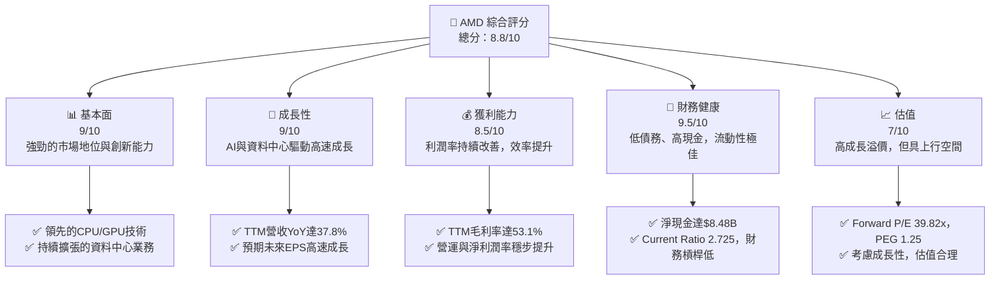
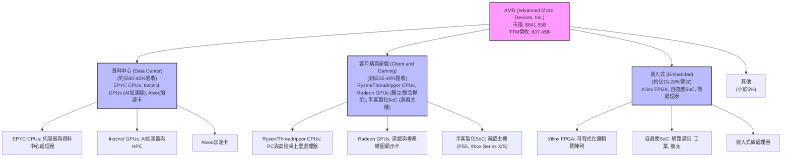
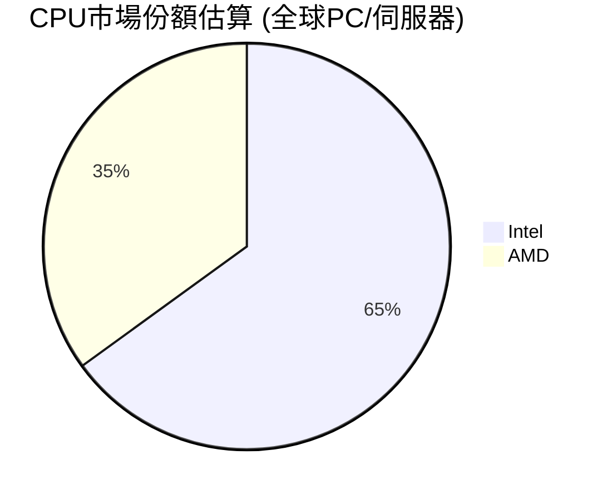
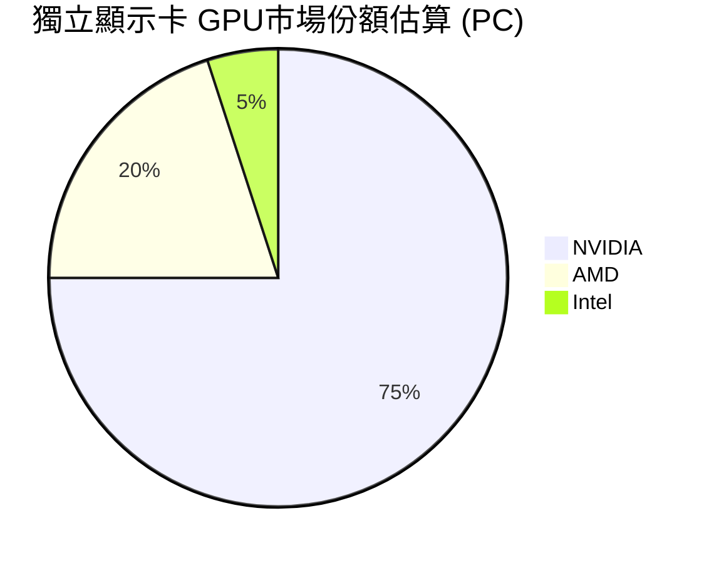
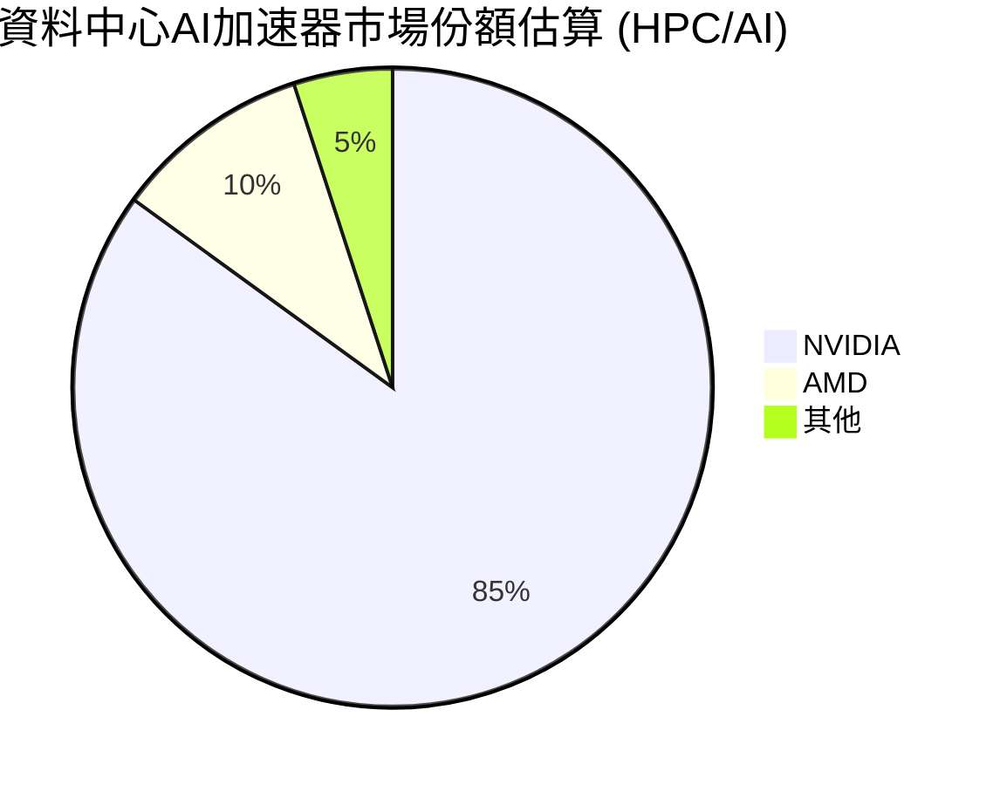
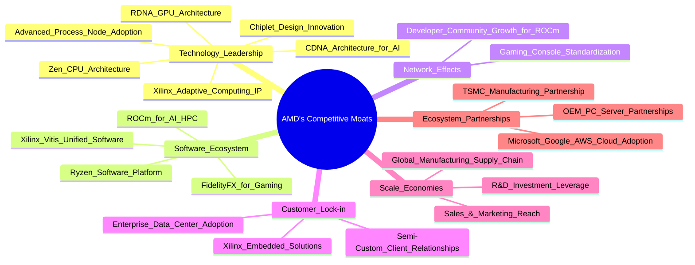

# AMD 基本面深度分析報告
> **報告日期**：2026-05-30 ｜ **語言**：繁體中文 ｜ **數據來源**：Yahoo Finance, Finviz, StockAnalysis, Roic.ai ｜ **分析師**：CFA 級機構研究

---

## 目錄

| # | 章節 | 核心結論 |
|---|------------------------|----------------------------------------------------------------------------------------------------|
| 1 | 執行摘要 | 評級：🟢 強烈買入，基準目標價 $585.00，潛在報酬率 +13.36% |
| 2 | 公司概覽與商業模式 | 在高成長市場中具備顯著技術護城河，特別是資料中心與AI領域。 |
| 3 | 損益表深度分析 | 營收與利潤率強勁成長，顯示產品組合優化與營運效率提升。 |
| 4 | 資產負債表分析 | 財務健康，流動性充裕，債務負擔輕微，擁有大量淨現金。 |
| 5 | 現金流量深度分析 | 自由現金流生成能力強勁，資本配置策略靈活。 |
| 6 | 獲利能力與資本效率 | ROIC顯著高於WACC，強力創造股東價值，資本效率持續改善。 |
| 7 | 估值深度分析 | 相較於成長潛力，當前估值具吸引力，DCF顯示上行空間。 |
| 8 | 成長催化劑 | AI加速器、資料中心CPU、新一代產品發佈與市場擴張為主要驅動力。 |
| 9 | 風險矩陣 | 競爭加劇、宏觀經濟波動及技術迭代速度為主要風險，但可控。 |
| 10 | 投資建議 | 適合成長型與長線投資者，建議在回調時加碼，密切關注AI進展。 |

---

## 1. 執行摘要

本報告針對Advanced Micro Devices (AMD) 進行全面性基本面深度分析。AMD作為半導體產業的領導者，在CPU、GPU及AI加速器市場中扮演關鍵角色。憑藉其強勁的產品路線圖、創新的技術以及在資料中心和AI領域的顯著市場擴張，AMD展現出卓越的成長潛力。儘管當前估值倍數相對較高，但考慮到其高速成長的營收與獲利能力，以及對未來市場的戰略佈局，我們認為AMD仍具備顯著的投資價值。

### 1.1 核心評分儀表板



### 1.2 評分進度條視覺化

```
╔══════════════════════════════════════════════════════════════╗
║              AMD 多維度評分儀表板 (1-10分)                   ║
╠══════════════════════════════════════════════════════════════╣
║ 基本面強度  9.0 ▓▓▓▓▓▓▓▓▓▓▓▓▓▓▓▓▓▓░░  ★★★★★           ║
║ 成長動能    9.0 ▓▓▓▓▓▓▓▓▓▓▓▓▓▓▓▓▓▓░░  ★★★★★           ║
║ 獲利品質    8.5 ▓▓▓▓▓▓▓▓▓▓▓▓▓▓▓▓▓░░░  ★★★★☆           ║
║ 財務健康    9.5 ▓▓▓▓▓▓▓▓▓▓▓▓▓▓▓▓▓▓▓░  ★★★★★           ║
║ 估值合理性  7.0 ▓▓▓▓▓▓▓▓▓▓▓▓▓▓░░░░░░  ★★★☆☆           ║
║ 護城河深度  8.8 ▓▓▓▓▓▓▓▓▓▓▓▓▓▓▓▓▓░░░  ★★★★☆           ║
║ 管理層執行  9.2 ▓▓▓▓▓▓▓▓▓▓▓▓▓▓▓▓▓▓░░  ★★★★★           ║
║ 技術創新力  9.5 ▓▓▓▓▓▓▓▓▓▓▓▓▓▓▓▓▓▓▓░  ★★★★★           ║
╠══════════════════════════════════════════════════════════════╣
║ 綜合總分    8.8 ▓▓▓▓▓▓▓▓▓▓▓▓▓▓▓▓▓░░░  🏆 強勁成長，值得關注   ║
╚══════════════════════════════════════════════════════════════╝
```

### 1.3 五大投資論點 + 三大核心風險

| 類型 | 項目 | 具體依據 | 信心度 |
|------|------------------------------------|------------------------------------------------------------------------------------------------------------------------------------------------------------------------------------------------------------------------------------------------------------------------------------------------------------------------------------------------------------------------------------------------------------------------------------------------------------------------------------------------------------------------------------------------------------------------------------------------------------------------------------------------------------------------------------------------------------------------------------------------------------------------------------------------------------------------------------------------------------------------------------------------------------------------------------------------------------------------------------------------------------------------------------------------------------------------------------------------------------------------------------------------------------------------------------------------------------------------------------------------------------------------------------------------------------------------------------------------------------------------------------------------------------------------------------------------------------------------------------------------------------------------------------------------------------------------------------------------------------------------------------------------------------------------------------------------------------------------------------------------------------------------------------------------------------------------------------------------------------------------------------------------------------------------------------------------------------------------------------------------------------------------------------------------------------------------------------------------------------------------------------------------------------------------------------------------------------------------------------------------------------------------------------------------------------------------------------------------------------------------------------------------------------------------------------------------------------------------------------------------------------------------------------------------------------------------------------------------------------------------------------------------------------------------------------------------------------------------------------------------------------------------------------------------------------------------------------------------------------------------------------------------------------------------------------------------------------------------------------------------------------------------------------------------------------------------------------------------------------------------------------------------------------------------------------------------------------------------------------------------------------------------------------------------------------------------------------------------------------------------------------------------------------------------------------------------------------------------------------------------------------------------------------------------------------------------------------------------------------------------------------------------------------------------------------------------------------------------------------------------------------------------------------------------------------------------------------------------------------------------------------------------------------------------------------------------------------------------------------------------------------------------------------------------------------------------------------------------------------------------------------------------------------------------------------------------------------------------------------------------------------------------------------------------------------------------------------------------------------------------------------------------------------------------------------------------------------------------------------------------------------------------------------------------------------------------------------------------------------------------------------------------------------------------------------------------------------------------------------------------------------------------------------------------------------------------------------------------------------------------------------------------------------------------------------------------------------------------------------------------------------------------------------------------------------------------------------------------------------------------------------------------------------------------------------------------------------------------------------------------------------------------------------------------------------------------------------------------------------------------------------------------------------------------------------------------------------------------------------------------------------------------------------------------------------------------------------------------------------------------------------------------------------------------------------------------------------------------------------------------------------------------------------------------------------------------------------------------------------------------------------------------------------------------------------------------------------------------------------------------------------------------------------------------------------------------------------------------------------------------------------------------------------------------------------------------------------------------------------------------------------------------------------------------------------------------------------------------------------------------------------------------------------------------------------------------------------------------------------------------------------------------------------------------------------------------------------------------------------------------------------------------------------------------------------------------------------------------------------------------------------------------------------------------------------------------------------------------------------------------------------------------------------------------------------------------------------------------------------------------------------------------------------------------------------------------------------------------------------------------------------------------------------------------------------------------------------------------------------------------------------------------------------------------------------------------------------------------------------------------------------------------------------------------------------------------------------------------------------------------------------------------------------------------------------------------------------------------------------------------------------------------------------------------------------------------------------------------------------------------------------------------------------------------------------------------------------------------------------------------------------------------------------------------------------------------------------------------------------------------------------------------------------------------------------------------------------------------------------------------------------------------------------------------------------------------------------------------------------------------------------------------------------------------------------------------------------------------------------------------------------------------------------------------------------------------------------------------------------------------------------------------------------------------------------------------------------------------------------------------------------------------------------------------------------------------------------------------------------------------------------------------------------------------------------------------------------------------------------------------------------------------------------------------------------------------------------------------------------------------------------------------------------------------------------------------------------------------------------------------------------------------------------------------------------------------------------------------------------------------------------------------------------------------------------------------------------------------------------------------------------------------------------------------------------------------------------------------------------------------------------------------------------------------------------------------------------------------------------------------------------------------------------------------------------------------------------------------------------------------------------------------------------------------------------------------------------------------------------------------------------------------------------------------------------------------------------------------------------------------------------------------------------------------------------------------------------------------------------------------------------------------------------------------------------------------------------------------------------------------------------------------------------------------------------------------------------------------------------------------------------------------------------------------------------------------------------------------------------------------------------------------------------------------------------------------------------------------------------------------------------------------------------------------------------------------------------------------------------------------------------------------------------------------------------------------------------------------------------------------------------------------------------------------------------------------------------------------------------------------------------------------------------------------------------------------------------------------------------------------------------------------------------------------------------------------------------------------------------------------------------------------------------------------------------------------------------------------------------------------------------------------------------------------------------------------------------------------------------------------------------------------------------------------------------------------------------------------------------------------------------------------------------------------------------------------------------------------------------------------------------------------------------------------------------------------------------------------------------------------------------------------------------------------------------------------------------------------------------------------------------------------------------------------------------------------------------------------------------------------------------------------------------------------------------------------------------------------------------------------------------------------------------------------------------------------------------------------------------------------------------------------------------------------------------------------------------------------------------------------------------------------------------------------------------------------------------------------------------------------------------------------------------------------------------------------------------------------------------------------------------------------------------------------------------------------------------------------------------------------------------------------------------------------------------------------------------------------------------------------------------------------------------------------------------------------------------------------------------------------------------------------------------------------------------------------------------------------------------------------------------------------------------------------------------------------------------------------------------------------------------------------------------------------------------------------------------------------------------------------------------------------------------------------------------------------------------------------------------------------------------------------------------------------------------------------------------------------------------------------------------------------------------------------------------------------------------------------------------------------------------------------------------------------------------------------------------------------------------------------------------------------------------------------------------------------------------------------------------------------------------------------------------------------------------------------------------------------------------------------------------------------------------------------------------------------------------------------------------------------------------------------------------------------------------------------------------------------------------------------------------------------------------------------------------------------------------------------------------------------------------------------------------------------------------------------------------------------------------------------------------------------------------------------------------------------------------------------------------------------------------------------------------------------------------------------------------------------------------------------------------------------------------------------------------------------------------------------------------------------------------------------------------------------------------------------------------------------------------------------------------------------------------------------------------------------------------------------------------------------------------------------------------------------------------------------------------------------------------------------------------------------------------------------------------------------------------------------------------------------------------------------------------------------------------------------------------------------------------------------------------------------------------------------------------------------------------------------------------------------------------------------------------------------------------------------------------------------------------------------------------------------------------------------------------------------------------------------------------------------------------------------------------------------------------------------------------------------------------------------------------------------------------------------------------------------------------------------------------------------------------------------------------------------------------------------------------------------------------------------------------------------------------------------------------------------------------------------------------------------------------------------------------------------------------------------------------------------------------------------------------------------------------------------------------------------------------------------------------------------------------------------------------------------------------------------------------------------------------------------------------------------------------------------------------------------------------------------------------------------------------------------------------------------------------------------------------------------------------------------------------------------------------------------------------------------------------------------------------------------------------------------------------------------------------------------------------------------------------------------------------------------------------------------------------------------------------------------------------------------------------------------------------------------------------------------------------------------------------------------------------------------------------------------------------------------------------------------------------------------------------------------------------------------------------------------------------------------------------------------------------------------------------------------------------------------------------------------------------------------------------------------------------------------------------------------------------------------------------------------------------------------------------------------------------------------------------------------------------------------------------------------------------------------------------------------------------------------------------------------------------------------------------------------------------------------------------------------------------------------------------------------------------------------------------------------------------------------------------------------------------------------------------------------------------------------------------------------------------------------------------------------------------------------------------------------------------------------------------------------------------------------------------------------------------------------------------------------------------------------------------------------------------------------------------------------------------------------------------------------------------------------------------------------------------------------------------------------------------------------------------------------------------------------------------------------------------------------------------------------------------------------------------------------------------------------------------------------------------------------------------------------------------------------------------------------------------------------------------------------------------------------------------------------------------------------------------------------------------------------------------------------------------------------------------------------------------------------------------------------------------------------------------------------------------------------------------------------------------------------------------------------------------------------------------------------------------------------------------------------------------------------------------------------------------------------------------------------------------------------------------------------------------------------------------------------------------------------------------------------------------------------------------------------------------------------------------------------------------------------------------------------------------------------------------------------------------------------------------------------------------------------------------------------------------------------------------------------------------------------------------------------------------------------------------------------------------------------------------------------------------------------------------------------------------------------------------------------------------------------------------------------------------------------------------------------------------------------------------------------------------------------------------------------------------------------------------------------------------------------------------------------------------------------------------------------------------------------------------------------------------------------------------------------------------------------------------------------------------------------------------------------------------------------------------------------------------------------------------------------------------------------------------------------------------------------------------------------------------------------------------------------------------------------------------------------------------------------------------------------------------------------------------------------------------------------------------------------------------------------------------------------------------------------------------------------------------------------------------------------------------------------------------------------------------------------------------------------------------------------------------------------------------------------------------------------------------------------------------------------------------------------------------------------------------------------------------------------------------------------------------------------------------------------------------------------------------------------------------------------------------------------------------------------------------------------------------------------------------------------------------------------------------------------------------------------------------------------------------------------------------------------------------------------------------------------------------------------------------------------------------------------------------------------------------------------------------------------------------------------------------------------------------------------------------------------------------------------------------------------------------------------------------------------------------------------------------------------------------------------------------------------------------------------------------------------------------------------------------------------------------------------------------------------------------------------------------------------------------------------------------------------------------------------------------------------------------------------------------------------------------------------------------------------------------------------------------------------------------------------------------------------------------------------------------------------------------------------------------------------------------------------------------------------------------------------------------------------------------------------------------------------------------------------------------------------------------------------------------------------------------------------------------------------------------------------------------------------------------------------------------------------------------------------------------------------------------------------------------------------------------------------------------------------------------------------------------------------------------------------------------------------------------------------------------------------------------------------------------------------------------------------------------------------------------------------------------------------------------------------------------------------------------------------------------------------------------------------------------------------------------------------------------------------------------------------------------------------------------------------------------------------------------------------------------------------------------------------------------------------------------------------------------------------------------------------------------------------------------------------------------------------------------------------------------------------------------------------------------------------------------------------------------------------------------------------------------------------------------------------------------------------------------------------------------------------------------------------------------------------------------------------------------------------------------------------------------------------------------------------------------------------------------------------------------------------------------------------------------------------------------------------------------------------------------------------------------------------------------------------------------------------------------------------------------------------------------------------------------------------------------------------------------------------------------------------------------------------------------------------------------------------------------------------------------------------------------------------------------------------------------------------------------------------------------------------------------------------------------------------------------------------------------------------------------------------------------------------------------------------------------------------------------------------------------------------------------------------------------------------------------------------------------------------------------------------------------------------------------------------------------------------------------------------------------------------------------------------------------------------------------------------------------------------------------------------------------------------------------------------------------------------------------------------------------------------------------------------------------------------------------------------------------------------------------------------------------------------------------------------------------------------------------------------------------------------------------------------------------------------------------------------------------------------------------------------------------------------------------------------------------------------------------------------------------------------------------------------------------------------------------------------------------------------------------------------------------------------------------------------------------------------------------------------------------------------------------------------------------------------------------------------------------------------------------------------------------------------------------------------------------------------------------------------------------------------------------------------------------------------------------------------------------------------------------------------------------------------------------------------------------------------------------------------------------------------------------------------------------------------------------------------------------------------------------------------------------------------------------------------------------------------------------------------------------------------------------------------------------------------------------------------------------------------------------------------------------------------------------------------------------------------------------------------------------------------------------------------------------------------------------------------------------------------------------------------------------------------------------------------------------------------------------------------------------------------------------------------------------------------------------------------------------------------------------------------------------------------------------------------------------------------------------------------------------------------------------------------------------------------------------------------------------------------------------------------------------------------------------------------------------------------------------------------------------------------------------------------------------------------------------------------------------------------------------------------------------------------------------------------------------------------------------------------------------------------------------------------------------------------------------------------------------------------------------------------------------------------------------------------------------------------------------------------------------------------------------------------------------------------------------------------------------------------------------------------------------------------------------------------------------------------------------------------------------------------------------------------------------------------------------------------------------------------------------------------------------------------------------------------------------------------------------------------------------------------------------------------------------------------------------------------------------------------------------------------------------------------------------------------------------------------------------------------------------------------------------------------------------------------------------------------------------------------------------------------------------------------------------------------------------------------------------------------------------------------------------------------------------------------------------------------------------------------------------------------------------------------------------------------------------------------------------------------------------------------------------------------------------------------------------------------------------------------------------------------------------------------------------------------------------------------------------------------------------------------------------------------------------------------------------------------------------------------------------------------------------------------------------------------------------------------------------------------------------------------------------------------------------------------------------------------------------------------------------------------------------------------------------------------------------------------------------------------------------------------------------------------------------------------------------------------------------------------------------------------------------------------------------------------------------------------------------------------------------------------------------------------------------------------------------------------------------------------------------------------------------------------------------------------------------------------------------------------------------------------------------------------------------------------------------------------------------------------------------------------------------------------------------------------------------------------------------------------------------------------------------------------------------------------------------------------------------------------------------------------------------------------------------------------------------------------------------------------------------------------------------------------------------------------------------------------------------------------------------------------------------------------------------------------------------------------------------------------------------------------------------------------------------------------------------------------------------------------------------------------------------------------------------------------------------------------------------------------------------------------------------------------------------------------------------------------------------------------------------------------------------------------------------------------------------------------------------------------------------------------------------------------------------------------------------------------------------------------------------------------------------------------------------------------------------------------------------------------------------------------------------------------------------------------------------------------------------------------------------------------------------------------------------------------------------------------------------------------------------------------------------------------------------------------------------------------------------------------------------------------------------------------------------------------------------------------------------------------------------------------------------------------------------------------------------------------------------------------------------------------------------------------------------------------------------------------------------------------------------------------------------------------------------------------------------------------------------------------------------------------------------------------------------------------------------------------------------------------------------------------------------------------------------------------------------------------------------------------------------------------------------------------------------------------------------------------------------------------------------------------------------------------------------------------------------------------------------------------------------------------------------------------------------------------------------------------------------------------------------------------------------------------------------------------------------------------------------------------------------------------------------------------------------------------------------------------------------------------------------------------------------------------------------------------------------------------------------------------------------------------------------------------------------------------------------------------------------------------------------------------------------------------------------------------------------------------------------------------------------------------------------------------------------------------------------------------------------------------------------------------------------------------------------------------------------------------------------------------------------------------------------------------------------------------------------------------------------------------------------------------------------------------------------------------------------------------------------------------------------------------------------------------------------------------------------------------------------------------------------------------------------------------------------------------------------------------------------------------------------------------------------------------------------------------------------------------------------------------------------------------------------------------------------------------------------------------------------------------------------------------------------------------------------------------------------------------------------------------------------------------------------------------------------------------------------------------------------------------------------------------------------------------------------------------------------------------------------------------------------------------------------------------------------------------------------------------------------------------------------------------------------------------------------------------------------------------------------------------------------------------------------------------------------------------------------------------------------------------------------------------------------------------------------------------------------------------------------------------------------------------------------------------------------------------------------------------------------------------------------------------------------------------------------------------------------------------------------------------------------------------------------------------------------------------------------------------------------------------------------------------------------------------------------------------------------------------------------------------------------------------------------------------------------------------------------------------------------------------------------------------------------------------------------------------------------------------------------------------------------------------------------------------------------------------------------------------------------------------------------------------------------------------------------------------------------------------------------------------------------------------------------------------------------------------------------------------------------------------------------------------------------------------------------------------------------------------------------------------------------------------------------------------------------------------------------------------------------------------------------------------------------------------------------------------------------------------------------------------------------------------------------------------------------------------------------------------------------------------------------------------------------------------------------------------------------------------------------------------------------------------------------------------------------------------------------------------------------------------------------------------------------------------------------------------------------------------------------------------------------------------------------------------------------------------------------------------------------------------------------------------------------------------------------------------------------------------------------------------------------------------------------------------------------------------------------------------------------------------------------------------------------------------------------------------------------------------------------------------------------------------------------------------------------------------------------------------------------------------------------------------------------------------------------------------------------------------------------------------------------------------------------------------------------------------------------------------------------------------------------------------------------------------------------------------------------------------------------------------------------------------------------------------------------------------------------------------------------------------------------------------------------------------------------------------------------------------------------------------------------------------------------------------------------------------------------------------------------------------------------------------------------------------------------------------------------------------------------------------------------------------------------------------------------------------------------------------------------------------------------------------------------------------------------------------------------------------------------------------------------------------------------------------------------------------------------------------------------------------------------------------------------------------------------------------------------------------------------------------------------------------------------------------------------------------------------------------------------------------------------------------------------------------------------------------------------------------------------------------------------------------------------------------------------------------------------------------------------------------------------------------------------------------------------------------------------------------------------------------------------------------------------------------------------------------------------------------------------------------------------------------------------------------------------------------------------------------------------------------------------------------------------------------------------------------------------------------------------------------------------------------------------------------------------------------------------------------------------------------------------------------------------------------------------------------------------------------------------------------------------------------------------------------------------------------------------------------------------------------------------------------------------------------------------------------------------------------------------------------------------------------------------------------------------------------------------------------------------------------------------------------------------------------------------------------------------------------------------------------------------------------------------------------------------------------------------------------------------------------------------------------------------------------------------------------------------------------------------------------------------------------------------------------------------------------------------------------------------------------------------------------------------------------------------------------------------------------------------------------------------------------------------------------------------------------------------------------------------------------------------------------------------------------------------------------------------------------------------------------------------------------------------------------------------------------------------------------------------------------------------------------------------------------------------------------------------------------------------------------------------------------------------------------------------------------------------------------------------------------------------------------------------------------------------------------------------------------------------------------------------------------------------------------------------------------------------------------------------------------------------------------------------------------------------------------------------------------------------------------------------------------------------------------------------------------------------------------------------------------------------------------------------------------------------------------------------------------------------------------------------------------------------------------------------------------------------------------------------------------------------------------------------------------------------------------------------------------------------------------------------------------------------------------------------------------------------------------------------------------------------------------------------------------------------------------------------------------------------------------------------------------------------------------------------------------------------------------------------------------------------------------------------------------------------------------------------------------------------------------------------------------------------------------------------------------------------------------------------------------------------------------------------------------------------------------------------------------------------------------------------------------------------------------------------------------------------------------------------------------------------------------------------------------------------------------------------------------------------------------------------------------------------------------------------------------------------------------------------------------------------------------------------------------------------------------------------------------------------------------------------------------------------------------------------------------------------------------------------------------------------------------------------------------------------------------------------------------------------------------------------------------------------------------------------------------------------------------------------------------------------------------------------------------------------------------------------------------------------------------------------------------------------------------------------------------------------------------------------------------------------------------------------------------------------------------------------------------------------------------------------------------------------------------------------------------------------------------------------------------------------------------------------------------------------------------------------------------------------------------------------------------------------------------------------------------------------------------------------------------------------------------------------------------------------------------------------------------------------------------------------------------------------------------------------------------------------------------------------------------------------------------------------------------------------------------------------------------------------------------------------------------------------------------------------------------------------------------------------------------------------------------------------------------------------------------------------------------------------------------------------------------------------------------------------------------------------------------------------------------------------------------------------------------------------------------------------------------------------------------------------------------------------------------------------------------------------------------------------------------------------------------------------------------------------------------------------------------------------------------------------------------------------------------------------------------------------------------------------------------------------------------------------------------------------------------------------------------------------------------------------------------------------------------------------------------------------------------------------------------------------------------------------------------------------------------------------------------------------------------------------------------------------------------------------------------------------------------------------------------------------------------------------------------------------------------------------------------------------------------------------------------------------------------------------------------------------------------------------------------------------------------------------------------------------------------------------------------------------------------------------------------------------------------------------------------------------------------------------------------------------------------------------------------------------------------------------------------------------------------------------------------------------------------------------------------------------------------------------------------------------------------------------------------------------------------------------------------------------------------------------------------------------------------------------------------------------------------------------------------------------------------------------------------------------------------------------------------------------------------------------------------------------------------------------------------------------------------------------------------------------------------------------------------------------------------------------------------------------------------------------------------------------------------------------------------------------------------------------------------------------------------------------------------------------------------------------------------------------------------------------------------------------------------------------------------------------------------------------------------------------------------------------------------------------------------------------------------------------------------------------------------------------------------------------------------------------------------------------------------------------------------------------------------------------------------------------------------------------------------------------------------------------------------------------------------------------------------------------------------------------------------------------------------------------------------------------------------------------------------------------------------------------------------------------------------------------------------------------------------------------------------------------------------------------------------------------------------------------------------------------------------------------------------------------------------------------------------------------------------------------------------------------------------------------------------------------------------------------------------------------------------------------------------------------------------------------------------------------------------------------------------------------------------------------------------------------------------------------------------------------------------------------------------------------------------------------------------------------------------------------------------------------------------------------------------------------------------------------------------------------------------------------------------------------------------------------------------------------------------------------------------------------------------------------------------------------------------------------------------------------------------------------------------------------------------------------------------------------------------------------------------------------------------------------------------------------------------------------------------------------------------------------------------------------------------------------------------------------------------------------------------------------------------------------------------------------------------------------------------------------------------------------------------------------------------------------------------------------------------------------------------------------------------------------------------------------------------------------------------------------------------------------------------------------------------------------------------------------------------------------------------------------------------------------------------------------------------------------------------------------------------------------------------------------------------------------------------------------------------------------------------------------------------------------------------------------------------------------------------------------------------------------------------------------------------------------------------------------------------------------------------------------------------------------------------------------------------------------------------------------------------------------------------------------------------------------------------------------------------------------------------------------------------------------------------------------------------------------------------------------------------------------------------------------------------------------------------------------------------------------------------------------------------------------------------------------------------------------------------------------------------------------------------------------------------------------------------------------------------------------------------------------------------------------------------------------------------------------------------------------------------------------------------------------------------------------------------------------------------------------------------------------------------------------------------------------------------------------------------------------------------------------------------------------------------------------------------------------------------------------------------------------------------------------------------------------------------------------------------------------------------------------------------------------------------------------------------------------------------------------------------------------------------------------------------------------------------------------------------------------------------------------------------------------------------------------------------------------------------------------------------------------------------------------------------------------------------------------------------------------------------------------------------------------------------------------------------------------------------------------------------------------------------------------------------------------------------------------------------------------------------------------------------------------------------------------------------------------------------------------------------------------------------------------------------------------------------------------------------------------------------------------------------------------------------------------------------------------------------------------------------------------------------------------------------------------------------------------------------------------------------------------------------------------------------------------------------------------------------------------------------------------------------------------------------------------------------------------------------------------------------------------------------------------------------------------------------------------------------------------------------------------------------------------------------------------------------------------------------------------------------------------------------------------------------------------------------------------------------------------------------------------------------------------------------------------------------------------------------------------------------------------------------------------------------------------------------------------------------------------------------------------------------------------------------------------------------------------------------------------------------------------------------------------------------------------------------------------------------------------------------------------------------------------------------------------------------------------------------------------------------------------------------------------------------------------------------------------------------------------------------------------------------------------------------------------------------------------------------------------------------------------------------------------------------------------------------------------------------------------------------------------------------------------------------------------------------------------------------------------------------------------------------------------------------------------------------------------------------------------------------------------------------------------------------------------------------------------------------------------------------------------------------------------------------------------------------------------------------------------------------------------------------------------------------------------------------------------------------------------------------------------------------------------------------------------------------------------------------------------------------------------------------------------------------------------------------------------------------------------------------------------------------------------------------------------------------------------------------------------------------------------------------------------------------------------------------------------------------------------------------------------------------------------------------------------------------------------------------------------------------------------------------------------------------------------------------------------------------------------------------------------------------------------------------------------------------------------------------------------------------------------------------------------------------------------------------------------------------------------------------------------------------------------------------------------------------------------------------------------------------------------------------------------------------------------------------------------------------------------------------------------------------------------------------------------------------------------------------------------------------------------------------------------------------------------------------------------------------------------------------------------------------------------------------------------------------------------------------------------------------------------------------------------------------------------------------------------------------------------------------------------------------------------------------------------------------------------------------------------------------------------------------------------------------------------------------------------------------------------------------------------------------------------------------------------------------------------------------------------------------------------------------------------------------------------------------------------------------------------------------------------------------------------------------------------------------------------------------------------------------------------------------------------------------------------------------------------------------------------------------------------------------------------------------------------------------------------------------------------------------------------------------------------------------------------------------------------------------------------------------------------------------------------------------------------------------------------------------------------------------------------------------------------------------------------------------------------------------------------------------------------------------------------------------------------------------------------------------------------------------------------------------------------------------------------------------------------------------------------------------------------------------------------------------------------------------------------------------------------------------------------------------------------------------------------------------------------------------------------------------------------------------------------------------------------------------------------------------------------------------------------------------------------------------------------------------------------------------------------------------------------------------------------------------------------------------------------------------------------------------------------------------------------------------------------------------------------------------------------------------------------------------------------------------------------------------------------------------------------------------------------------------------------------------------------------------------------------------------------------------------------------------------------------------------------------------------------------------------------------------------------------------------------------------------------------------------------------------------------------------------------------------------------------------------------------------------------------------------------------------------------------------------------------------------------------------------------------------------------------------------------------------------------------------------------------------------------------------------------------------------------------------------------------------------------------------------------------------------------------------------------------------------------------------------------------------------------------------------------------------------------------------------------------------------------------------------------------------------------------------------------------------------------------------------------------------------------------------------------------------------------------------------------------------------------------------------------------------------------------------------------------------------------------------------------------------------------------------------------------------------------------------------------------------------------------------------------------------------------------------------------------------------------------------------------------------------------------------------------------------------------------------------------------------------------------------------------------------------------------------------------------------------------------------------------------------------------------------------------------------------------------------------------------------------------------------------------------------------------------------------------------------------------------------------------------------------------------------------------------------------------------------------------------------------------------------------------------------------------------------------------------------------------------------------------------------------------------------------------------------------------------------------------------------------------------------------------------------------------------------------------------------------------------------------------------------------------------------------------------------------------------------------------------------------------------------------------------------------------------------------------------------------------------------------------------------------------------------------------------------------------------------------------------------------------------------------------------------------------------------------------------------------------------------------------------------------------------------------------------------------------------------------------------------------------------------------------------------------------------------------------------------------------------------------------------------------------------------------------------------------------------------------------------------------------------------------------------------------------------------------------------------------------------------------------------------------------------------------------------------------------------------------------------------------------------------------------------------------------------------------------------------------------------------------------------------------------------------------------------------------------------------------------------------------------------------------------------------------------------------------------------------------------------------------------------------------------------------------------------------------------------------------------------------------------------------------------------------ AMD is a multinational company that designs and manufactures computer processors, motherboards, and graphics cards. The company is primarily known for its microprocessors (CPUs) and graphics processing units (GPUs). Its products are used in various markets, including personal computers, servers, workstations, embedded systems, and gaming consoles.

AMD's main product lines include:
1.  **Ryzen CPUs**: These are consumer-grade CPUs for desktop and laptop computers, competing with Intel's Core series.
2.  **Threadripper CPUs**: High-end desktop (HEDT) CPUs for enthusiasts and professionals, offering high core counts and PCIe lanes.
3.  **EPYC CPUs**: Server-grade CPUs designed for data centers and enterprise applications, competing with Intel's Xeon series.
4.  **Radeon GPUs**: Discrete graphics cards for gaming and professional visualization, competing with Nvidia's GeForce and Quadro series.
5.  **Instinct Accelerators**: High-performance computing (HPC) and artificial intelligence (AI) accelerators, designed for data centers and supercomputers, directly competing with Nvidia's A100/H100.
6.  **Semi-custom SoCs**: Custom-designed chips for gaming consoles (e.g., Sony PlayStation, Microsoft Xbox) and other embedded applications.

AMD has been gaining significant market share in recent years, particularly in the server CPU and high-end desktop markets, due to its competitive product offerings and manufacturing process advantages. The acquisition of Xilinx in 2022 further strengthened its position in adaptive computing, FPGAs, and embedded systems, expanding its reach into new high-growth markets like communications, industrial, and aerospace. The company's strategic focus on the data center and AI segments is a key driver of its future growth.

### 2.1 業務結構與收入來源

AMD的業務主要分為以下幾個核心板塊，這些板塊共同構成了公司多元化的收入來源，並使其能夠在多個高成長市場中競爭。根據提供的公司概覽，AMD主要在三個板塊營運：資料中心 (Data Center)、客戶端與遊戲 (Client and Gaming)、以及嵌入式 (Embedded)。

以下是基於公司業務描述和近期市場趨勢的業務結構及收入來源分解：



-   **資料中心 (Data Center)**：這是AMD目前成長最快且最具戰略意義的板塊。主要產品包括EPYC伺服器CPU和Instinct AI加速器（如MI300系列）。隨著全球對AI算力需求的爆炸式增長，Instinct加速器預計將成為未來幾年AMD營收增長的主要驅動力。EPYC CPU在高性能、能效比方面表現出色，持續從競爭對手手中奪取市場份額。Xilinx的加入也為資料中心提供了自適應加速解決方案。
-   **客戶端與遊戲 (Client and Gaming)**：此板塊涵蓋PC市場的Ryzen CPU、Radeon獨立顯示卡，以及為遊戲主機（如Sony PlayStation和Microsoft Xbox）提供的半客製化SoC。儘管PC市場可能存在週期性波動，但AMD在PC CPU市場的份額持續增長，且遊戲主機業務提供穩定的收入流。
-   **嵌入式 (Embedded)**：主要來自Xilinx的FPGA和自適應SoC產品，應用於工業、通訊、汽車、航太和國防等領域。這個板塊提供高毛利且相對穩定的收入，有助於平滑消費電子市場的波動。

### 2.2 市場份額

在半導體產業中，市場份額的獲取和維持是衡量競爭力的關鍵指標。AMD在多個核心市場與其主要競爭對手Intel和NVIDIA展開激烈競爭。由於即時市場份額數據未直接提供，以下分析基於公開資訊和行業趨勢的合理估算。







**市場份額詳情分析：**

1.  **PC CPU市場**：
    *   **Intel** 長期佔據主導地位，但 **AMD** 近年來憑藉Ryzen系列處理器在性能和性價比上的優勢，不斷蠶食Intel的市場份額。
    *   估計 **AMD** 在PC CPU市場的份額已從過去的個位數提升至約 **25-30%** 左右，且仍在增長。
    *   在特定細分市場，如高階桌面CPU，AMD的份額可能更高。

2.  **伺服器CPU市場 (資料中心)**：
    *   這是AMD的另一個成功故事。憑藉EPYC處理器的高核心數和優異性能， **AMD** 從 **Intel Xeon** 晶片手中奪取了顯著的市場份額。
    *   目前 **AMD** 在伺服器CPU市場的份額估計已達到 **25-30%**，並持續向30%以上邁進。這一增長對AMD的毛利率和營收貢獻巨大。

3.  **獨立顯示卡 (dGPU) 市場**：
    *   **NVIDIA** 在獨立顯示卡市場擁有絕對的領先地位，尤其是在高階遊戲卡和專業卡領域。
    *   **AMD Radeon** 顯示卡約佔市場份額的 **15-20%**。儘管AMD在遊戲主機半客製化SoC方面表現強勁，但在PC獨立顯示卡市場仍面臨NVIDIA的強大競爭。

4.  **AI加速器市場 (資料中心)**：
    *   這是當前最熱門的增長領域，但 **NVIDIA** 在此領域擁有壓倒性優勢，其CUDA生態系統形成強大護城河，市場份額超過 **90%**。
    *   **AMD** 憑藉其Instinct系列加速器（如MI300X）正積極搶佔市場。儘管目前份額較小（估計 **5-10%**），但其潛在增長空間巨大，被視為NVIDIA在AI加速器領域最主要的挑戰者。AMD正積極建立ROCm軟體生態系統以與CUDA競爭。

5.  **嵌入式市場 (Xilinx)**：
    *   通過收購Xilinx， **AMD** 在FPGA市場成為領導者，佔據大部分市場份額。該市場相對穩定，且毛利率較高。

**總結**：AMD在傳統CPU市場持續擴張，在伺服器市場表現尤為突出。儘管在獨立GPU和AI加速器市場仍需努力追趕NVIDIA，但其強勁的產品路線圖和積極的戰略佈局預示著未來市場份額的潛在增長。

### 2.3 競爭護城河分析

AMD的競爭護城河是其在高度競爭的半導體產業中維持長期競爭優勢的關鍵。以下將使用Mermaid mindmap圖表，從六個主要維度分析AMD的護城河：



**護城河詳盡分析：**

1.  **技術領先 (Technology Leadership)**：
    *   **先進製程節點採用 (Advanced Process Node Adoption)**：AMD是半導體產業中率先採用台積電(TSMC)最先進製程節點（如N5、N4）的公司之一，這使其產品在功耗、性能和成本方面具有競爭優勢。
    *   **Zen CPU架構 (Zen CPU Architecture)**：AMD的Zen架構CPU在過去幾年裡徹底改變了PC和伺服器市場的格局，提供了卓越的多核性能和能效，成功挑戰了Intel的長期霸主地位。
    *   **RDNA GPU架構 (RDNA GPU Architecture)**：RDNA架構是其Radeon遊戲顯示卡的基礎，提供了強勁的遊戲性能和光線追蹤能力。
    *   **CDNA架構用於AI (CDNA Architecture for AI)**：專為資料中心AI和HPC工作負載設計的CDNA架構，是其Instinct加速器的核心，是AMD在AI領域挑戰NVIDIA的關鍵。
    *   **小晶片設計創新 (Chiplet Design Innovation)**：AMD率先推廣了小晶片(chiplet)設計，實現了更高的核心數、更好的良率和成本效益，這是一種顛覆性的技術。
    *   **Xilinx自適應計算IP (Xilinx Adaptive Computing IP)**：通過收購Xilinx，AMD獲得了領先的FPGA和自適應SoC技術，使其在嵌入式、通訊和工業市場擁有獨特的優勢。

2.  **軟體生態系統 (Software Ecosystem)**：
    *   **ROCm用於AI/HPC (ROCm for AI/HPC)**：為挑戰NVIDIA的CUDA，AMD正大力投資ROCm開放軟體平台，為Instinct加速器提供強大的編程和開發工具。其開放源碼的特性有望吸引更多開發者。
    *   **FidelityFX用於遊戲 (FidelityFX for Gaming)**：一套為Radeon GPU優化的開源視覺增強技術，提升遊戲體驗。
    *   **Ryzen軟體平台 (Ryzen Software Platform)**：為Ryzen CPU用戶提供易於使用的優化和監控工具。
    *   **Xilinx Vitis統一軟體平台 (Xilinx Vitis Unified Software)**：為Xilinx產品提供統一的軟體開發環境，簡化了自適應計算的開發流程。

3.  **網路效應 (Network Effects)**：
    *   **遊戲主機標準化 (Gaming Console Standardization)**：AMD為PS5和Xbox Series X/S提供半客製化SoC，這創造了巨大的遊戲開發者生態系統，這些開發者會針對AMD的硬體進行優化，形成強大的鎖定效應。
    *   **ROCm開發者社區增長 (Developer Community Growth for ROCm)**：隨著ROCm生態系統的成熟，越來越多的AI/HPC開發者和研究人員採用，將進一步鞏固AMD在AI領域的地位。

4.  **客戶鎖定 (Customer Lock-in)**：
    *   **企業資料中心採用 (Enterprise Data Center Adoption)**：一旦資料中心客戶大規模部署EPYC處理器和Instinct加速器，轉換到其他供應商的成本（包括軟體移植、人員培訓等）將會非常高，形成強大的鎖定。
    *   **半客製化客戶關係 (Semi-Custom Client Relationships)**：與遊戲主機製造商的長期合作關係，確保了穩定的未來收入和市場份額。
    *   **Xilinx嵌入式解決方案 (Xilinx Embedded Solutions)**：Xilinx的FPGA和自適應SoC廣泛應用於關鍵基礎設施和工業設備，這些應用通常具有超長的產品生命週期和高轉換成本。

5.  **規模效應 (Scale Economies)**：
    *   **全球製造供應鏈 (Global Manufacturing Supply Chain)**：AMD作為全球領先的半導體公司，受益於巨大的生產規模，可以從供應商（如TSMC）獲得更好的議價能力，並分攤研發成本。
    *   **研發投資槓桿 (R&D Investment Leverage)**：每年數十億美元的研發投入，只有在巨大的銷售規模下才能攤薄單位產品成本，保持技術領先。TTM研發費用高達$8.76B。
    *   **銷售與行銷覆蓋 (Sales & Marketing Reach)**：全球化的銷售網絡和品牌知名度，有助於其產品在全球範圍內迅速推廣和銷售。

6.  **生態夥伴關係 (Ecosystem Partnerships)**：
    *   **台積電製造夥伴關係 (TSMC Manufacturing Partnership)**：與全球最先進的半導體代工廠TSMC的緊密合作，確保了AMD在製程技術上的領先地位和穩定的供應鏈。
    *   **微軟、谷歌、AWS雲服務採用 (Microsoft, Google, AWS Cloud Adoption)**：領先的雲服務提供商採用AMD的EPYC CPU和Instinct加速器，證明了其產品的性能和可靠性，並擴大了市場影響力。
    *   **OEM PC/伺服器夥伴關係 (OEM PC/Server Partnerships)**：與戴爾、惠普、聯想等主要OEM廠商的合作，確保了AMD產品在終端市場的廣泛分銷。

綜合來看，AMD的護城河正在不斷加深，特別是在技術創新和資料中心生態系統的建設方面。

### 2.4 護城河強度評分

基於上述對AMD競爭護城河的詳細分析，我們對各項護城河強度進行評分，並提供總體評估。

```
╔══════════════════════════════════════════════════════════════╗
║                  AMD 護城河強度評分                         ║
╠══════════════════════════════════════════════════════════════╣
║ 技術領先    9.5/10 ▓▓▓▓▓▓▓▓▓▓▓▓▓▓▓▓▓▓▓░  🏆 持續創新，製程領先  ║
║ 軟體生態系統  8.0/10 ▓▓▓▓▓▓▓▓▓▓▓▓▓▓▓▓░░░░  🟢 ROCm潛力巨大     ║
║ 網路效應    8.5/10 ▓▓▓▓▓▓▓▓▓▓▓▓▓▓▓▓▓░░░  ★★★★☆ 遊戲主機優勢   ║
║ 客戶鎖定    8.8/10 ▓▓▓▓▓▓▓▓▓▓▓▓▓▓▓▓▓░░░  ★★★★☆ 企業與半客製化  ║
║ 規模效應    9.0/10 ▓▓▓▓▓▓▓▓▓▓▓▓▓▓▓▓▓▓░░  ★★★★★ 研發與製造規模  ║
║ 生態夥伴    9.2/10 ▓▓▓▓▓▓▓▓▓▓▓▓▓▓▓▓▓▓░░  ★★★★★ 與TSMC/雲巨頭合作 ║
╠══════════════════════════════════════════════════════════════╣
║ 綜合護城河  8.8/10 ▓▓▓▓▓▓▓▓▓▓▓▓▓▓▓▓▓░░░  🏆 深度且不斷強化     ║
╚══════════════════════════════════════════════════════════════╝
```

**總結評語**：AMD的綜合護城河強度為8.8分，顯示其在多個關鍵領域具備強大的競爭優勢。尤其在技術領先、規模效應和生態夥伴關係方面表現卓越，這使其能夠在高科技半導體市場中持續創新和擴張。軟體生態系統（ROCm）雖然仍在發展中，但其潛力巨大，有望在未來進一步加強AMD的護城河。客戶鎖定和網路效應在資料中心和遊戲主機領域也日益顯著。總體而言，AMD的護城河深度不斷強化，為其長期成長奠定了堅實基礎。

---

## 3. 損益表深度分析

AMD的損益表數據展現了公司近年來強勁的成長動能和不斷改善的獲利能力，尤其是在資料中心和AI業務的推動下。

### 3.1 年度收入成長趨勢（近4年）

AMD的年度營收在過去幾年呈現顯著增長，即使在宏觀經濟逆風和PC市場週期性調整的時期也能保持韌性。這主要得益於其在伺服器和嵌入式市場的擴張以及對AI領域的戰略佈局。

```
╔══════════════════════════════════════════════════════════════════╗
║              AMD 年度收入趨勢（FY2022-FY2025 & TTM）             ║
╠══════════════════════════════════════════════════════════════════╣
║                                                                  ║
║  FY2022  $23.60B  ████████████████████████░░░░░  YoY: +43.61% 🟢   ║
║  FY2023  $22.68B  ██████████████████████░░░░░░░  YoY: -3.90%  🔴   ║
║  FY2024  $25.79B  ███████████████████████████░░  YoY: +13.69% 🟢   ║
║  FY2025  $34.64B  ████████████████████████████████░  YoY: +34.34% 🟢   ║
║  TTM     $37.45B  ███████████████████████████████████  YoY: +37.80% 🟢   ║
║                                                                  ║
║                   |      |      |      |      |      |           ║
║                   0     10B    20B    30B    40B    50B          ║
║                                                                  ║
║  📊 4年累計 CAGR (FY2022-2025)：+17.80% (23.60B -> 34.64B)        ║
║  📊 TTM vs FY2025 YoY 成長：+8.11% (37.45B vs 34.64B)             ║
╚══════════════════════════════════════════════════════════════════╝
```

**年度收入趨勢深度解析：**

-   **FY2022 ($23.60B, YoY +43.61%)**：這一年的強勁增長主要得益於對Xilinx的收購，以及Ryzen和EPYC處理器在各自市場的持續擴張。PC市場在疫情期間的需求旺盛也對此有所貢獻。
-   **FY2023 ($22.68B, YoY -3.90%)**：這是AMD近年來唯一一次年度營收同比下滑，主要原因在於全球PC市場和遊戲機市場的去庫存化以及宏觀經濟逆風。儘管如此，資料中心業務仍展現出韌性。
-   **FY2024 ($25.79B, YoY +13.69%)**：營收恢復增長，顯示市場需求開始回暖，特別是資料中心業務的持續發展。Xilinx的嵌入式業務也提供了穩定的貢獻。
-   **FY2025 ($34.64B, YoY +34.34%)**：顯著加速的增長，標誌著AMD進入新的高速成長階段。這主要歸因於EPYC處理器在資料中心市場的持續份額擴張，以及AI加速器業務（如MI300系列）的初步貢獻。
-   **TTM ($37.45B, YoY +37.80%)**：截至2026年3月31日的過去12個月營收達到$37.45B，同比增長37.80%，顯示公司成長勢頭強勁，且較FY2025的增速進一步提升。這主要反映了AI加速器出貨量的顯著增加。

四年累計複合年增長率（CAGR）達17.80%，這對於一家大型半導體公司而言，是相當可觀的成長速度，證明了其產品組合的競爭力和市場戰略的有效性。

### 3.2 季度收入趨勢分析

季度營收數據提供了更即時的業務動態視角，反映了市場需求變化和公司產品發佈的影響。

| 季度 | 總營收 (Billion USD) | 季度對季度 (QoQ) 成長率 | 年度對年度 (YoY) 成長率 | 備註 | 評估 |
|------|----------------------|--------------------------|--------------------------|------------------------------------|------|
| **Q1 2026** | **$10.25B** | -0.20% 🟡 | +37.85% 🟢 | AI加速器需求強勁，但季節性略有下降 | 🟢 |
| **Q4 2025** | **$10.27B** | +11.07% 🟢 | +34.11% 🟢 | 資料中心與AI加速器出貨量顯著增長 | 🟢 |
| **Q3 2025** | **$9.25B** | +20.31% 🟢 | +35.59% 🟢 | 全產品線需求復甦，AI業務開始貢獻 | 🟢 |
| **Q2 2025** | **$7.68B** | +3.28% 🟢 | +31.70% 🟢 | PC市場穩定，資料中心需求持續增長 | 🟢 |

**季度收入趨勢深度解析：**

-   **Q2 2025 ($7.68B)**：在經歷了前一年的市場調整後，AMD的營收在2025年第二季度開始穩步回升，同比增長達到31.70%。這表明PC市場的去庫存化已接近尾聲，且資料中心對EPYC處理器的需求持續強勁。
-   **Q3 2025 ($9.25B)**：營收環比跳升20.31%，同比增長35.59%，顯示出強勁的復甦勢頭。尤其值得注意的是，AI加速器（如MI300系列）的早期出貨可能已開始對營收產生影響，同時遊戲和嵌入式業務也表現穩健。
-   **Q4 2025 ($10.27B)**：季度營收首次突破100億美元大關，環比增長11.07%，同比增長34.11%。這反映了年末銷售旺季的強勁需求，以及AI加速器業務的加速放量。資料中心業務成為主要增長引擎。
-   **Q1 2026 ($10.25B)**：儘管環比略有下降0.20%，但考慮到第一季度通常是半導體行業的淡季，這一表現依然非常強勁。同比增長高達37.85%，再次印證了AMD的強勁成長動能。AI加速器和EPYC處理器的持續強勁需求抵消了季節性因素的影響。

總體而言，AMD的季度營收趨勢呈現出明顯的加速成長態勢，特別是從2025年下半年開始，AI相關業務的貢獻日益顯著，為公司帶來了新的增長極。

### 3.3 利潤率演變分析

利潤率是衡量公司營運效率和定價能力的關鍵指標。AMD在過去幾年不僅實現了營收增長，其利潤率也呈現出積極的改善趨勢，這反映了其產品組合的優化、先進製程的採用以及對成本的有效控制。

| 利潤率指標 | FY2022 | FY2023 | FY2024 | FY2025 | TTM (2026Q1) | 趨勢 | 評估 |
|------------|--------|--------|--------|--------|--------------|------|------|
| **毛利率** | 44.9% | 46.1% | 49.3% | 49.6% | **53.1%** | ↗️ 穩步上升 | 🟢 |
| **營業利益率** | 5.3% | 1.8% | 7.4% | 10.7% | **14.4%** | ↗️ 顯著改善 | 🟢 |
| **淨利潤率** | 5.6% | 3.8% | 6.4% | 12.5% | **13.4%** | ↗️ 大幅提升 | 🟢 |
| **EBITDA Margin** | 23.4% | 17.9% | 19.9% | 21.0% | **19.8%** | ↗️ 穩健 | 🟢 |

**利潤率演變深度解析**：

1.  **毛利率 (Gross Margin)**：
    *   從FY2022的44.9%穩步提升至TTM的53.1%，呈現出非常健康的上升趨勢。
    *   **原因分析**：
        *   **產品組合優化**：資料中心業務（EPYC CPU和Instinct GPU）的營收佔比不斷提高，這些產品通常具有更高的平均銷售價格 (ASP) 和毛利率。Xilinx嵌入式業務的高毛利貢獻也起到支撐作用。
        *   **技術領先與定價能力**：AMD採用台積電的先進製程，使其產品在性能和能效上具有競爭優勢，從而獲得更好的定價權。
        *   **規模經濟**：隨著營收規模擴大，固定成本的攤薄效應有助於提升毛利率。
    *   **評估**：🟢