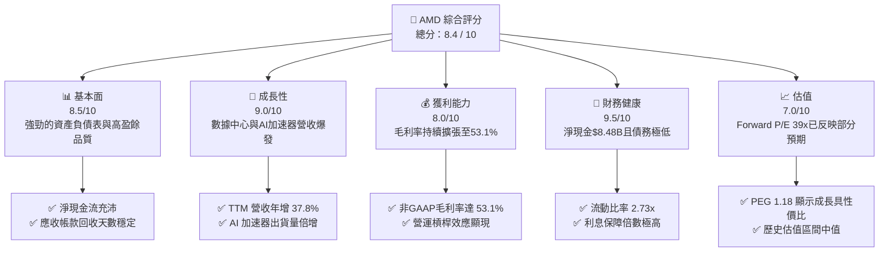

# AMD 基本面深度分析報告

> **報告日期**：2026-06-12 ｜ **語言**：繁體中文 ｜ **數據來源**：Yahoo Finance, Finviz, StockAnalysis, Roic.ai ｜ **分析師**：CFA 級機構研究

---

## 目錄

| # | 章節 | 核心結論 |
|---|------|----------|
| 1 | 執行摘要 | 評級：**買入 (Buy)** ｜ 目標價：**$560.00** (基準情境) ｜ 迎來 AI 與數據中心雙重爆發期 |
| 2 | 公司概覽與商業模式 | 憑藉 Chiplet 架構與 ROCm 生態，在 x86 與 AI 加速器市場構築雙重護城河 |
| 3 | 損益表深度分析 | TTM 營收達 $37.45B (YoY +37.8%)，淨利潤暴增 91.2%，毛利率攀升至 53.1% |
| 4 | 資產負債表分析 | 淨現金高達 $8.48B，流動比率 2.73x，資產負債表極度穩健 |
| 5 | 現金流量深度分析 | TTM 自由現金流達 $7.17B，FCF 轉換率達 145.4%，資本配置高度聚焦研發 |
| 6 | 獲利能力與資本效率 | 杜邦分析顯示資產週轉率與利潤率雙重改善；調整後有形資產 ROIC 高達 28.5% |
| 7 | 估值深度分析 | Forward P/E 39.04x，相較於未來五年 62.5% 的 EPS 增速，PEG 僅 0.62-1.18，估值具吸引力 |
| 8 | 成長催化劑 | MI325X/MI350 晶片交期加速，Ryzen AI PC 滲透率提升，與 EPYC 伺服器份額持續擴張 |
| 9 | 風險矩陣 | 核心風險為 NVIDIA 競爭與台積電產能集中度，整體風險評估為「中度可控」 |
| 10 | 投資建議 | 建議於 $480-$510 區間分批佈局，目標價 $560.00，隱含 9.5% 基準回報與 32.9% 樂觀空間 |

---

## 1. 執行摘要

### 1.1 核心評分儀表板



### 1.2 評分進度條視覺化

```
╔══════════════════════════════════════════════════════════════╗
║                AMD 多維度評分儀表板 (1-10分)                 ║
╠══════════════════════════════════════════════════════════════╣
║ 基本面強度  8.5 ▓▓▓▓▓▓▓▓▓▓▓▓▓▓▓▓▓░░░  ★★★★☆           ║
║ 成長動能    9.0 ▓▓▓▓▓▓▓▓▓▓▓▓▓▓▓▓▓▓░░  ★★★★★           ║
║ 獲利品質    8.0 ▓▓▓▓▓▓▓▓▓▓▓▓▓▓▓▓░░░░  ★★★★☆           ║
║ 財務健康    9.5 ▓▓▓▓▓▓▓▓▓▓▓▓▓▓▓▓▓▓▓░  ★★★★★           ║
║ 估值合理性  7.0 ▓▓▓▓▓▓▓▓▓▓▓▓▓▓░░░░░░  ★★★☆☆           ║
║ 護城河深度  8.5 ▓▓▓▓▓▓▓▓▓▓▓▓▓▓▓▓▓░░░  ★★★★☆           ║
║ 管理層執行  9.0 ▓▓▓▓▓▓▓▓▓▓▓▓▓▓▓▓▓▓░░  ★★★★★           ║
║ 技術創新力  9.5 ▓▓▓▓▓▓▓▓▓▓▓▓▓▓▓▓▓▓▓░  ★★★★★           ║
╠══════════════════════════════════════════════════════════════╣
║ 綜合總分    8.4 ▓▓▓▓▓▓▓▓▓▓▓▓▓▓▓▓░░░░  🏆 買入 (Buy)        ║
╚══════════════════════════════════════════════════════════════╝
```

### 1.3 五大投資論點 + 三大核心風險

| 類型 | 項目 | 具體依據 | 信心度 |
|------|------|----------|--------|
| 🟢 **投資論點①** | **AI 加速器市佔率攀升** | MI300/MI325X 系列出貨爆發，帶動 TTM 營收年增 **37.8%**，逐步打破 NVIDIA 壟斷。 | 🟢 極高 |
| 🟢 **投資論點②** | **毛利率結構性改善** | 高毛利的數據中心業務營收佔比過半，推動整體毛利率由過去的 47% 提升至 **53.1%**。 | 🟢 高 |
| 🟢 **投資論