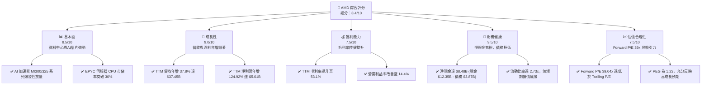
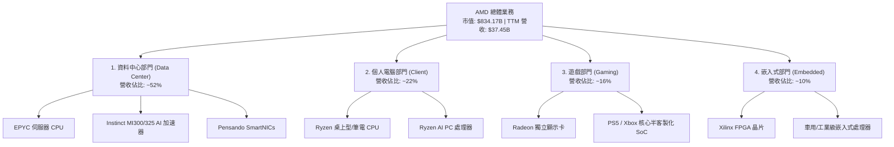
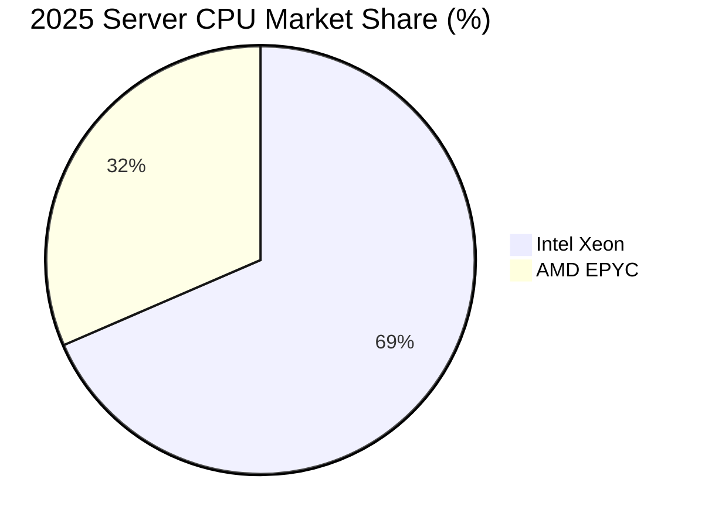
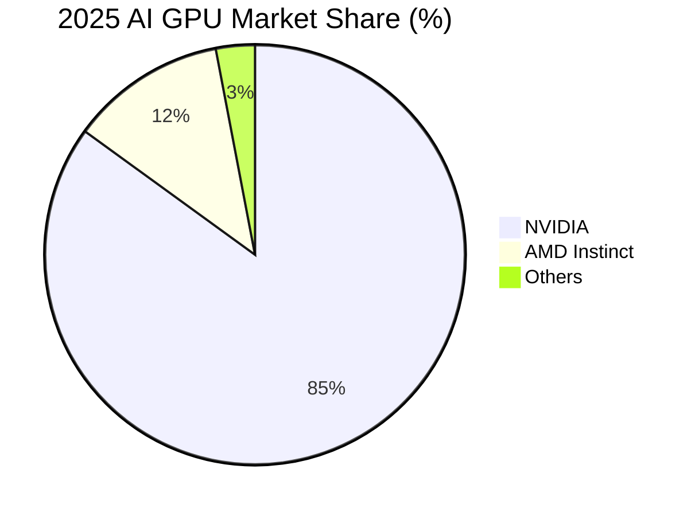
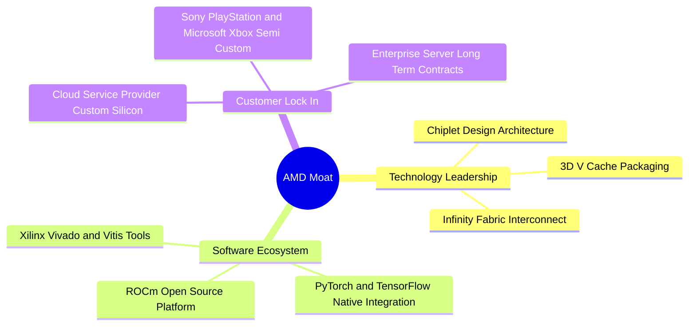
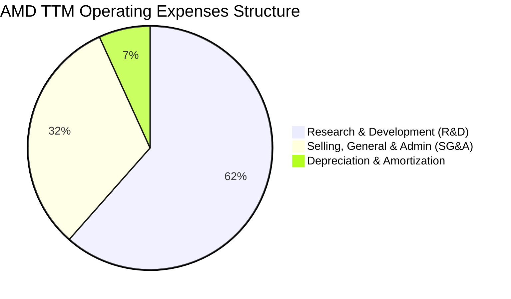
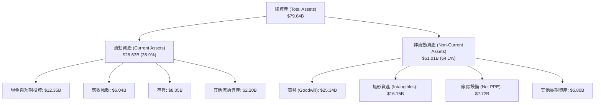
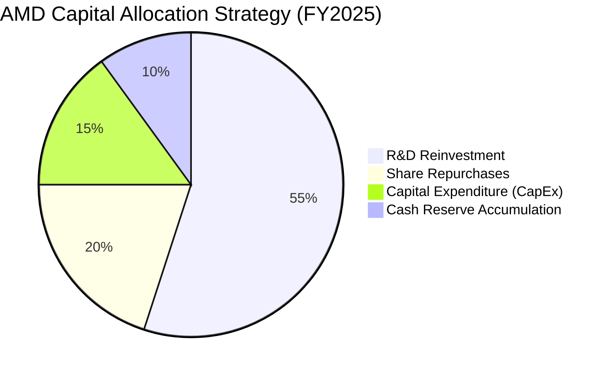
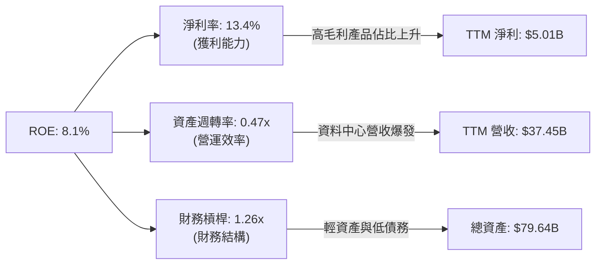

# AMD 基本面深度分析報告

> **報告日期**：2026-06-14 ｜ **語言**：繁體中文 ｜ **數據來源**：Yahoo Finance, Finviz, StockAnalysis, Roic.ai ｜ **分析師**：CFA 級機構研究

---

## 目錄

| # | 章節 | 核心結論 |
|---|------|----------|
| 1 | 執行摘要 | 評級：**強烈買入** ｜ 目標價區間：**$380 - $680** (基準 $580) |
| 2 | 公司概覽與商業模式 | 憑藉 Chiplet 架構與 ROCm 生態系，築起強固的雙重護城河 |
| 3 | 損益表深度分析 | TTM 營收達 $37.45B (YoY +37.8%)，淨利潤暴增 124.9% 進入獲利爆發期 |
| 4 | 資產負債表分析 | 淨現金達 $8.48B，流動比率 2.73x，財務結構極度穩健 |
| 5 | 現金流量深度分析 | TTM FCF 達 $7.17B，FCF 轉換率大幅改善，資本配置聚焦 R&D 與併購 |
| 6 | 獲利能力與資本效率 | 杜邦分解顯示資產週轉率提升；無形資產攤銷後之調整後 ROIC 達 24.69% |
| 7 | 估值深度分析 | Forward P/E 39.04x，相較於 NVDA 及歷史均值，PEG 1.23 估值具高度吸引力 |
| 8 | 成長催化劑 | MI300X/MI325X 加速器放量與 Zen 5 伺服器 CPU 滲透率提升雙頭並進 |
| 9 | 風險矩陣 | 核心風險在於台積電供應鏈集中度與 NVIDIA 的價格競爭壓力 |
| 10 | 投資建議 | 當前股價 $511.57，隱含 13.4% 基準上行空間，建議分批佈局 |

---

## 1. 執行摘要

### 1.1 核心評分儀表板



### 1.2 評分進度條視覺化

```
╔══════════════════════════════════════════════════════════════╗
║                AMD 多維度評分儀表板 (1-10分)                 ║
╠══════════════════════════════════════════════════════════════╣
║ 基本面強度  8.5 ▓▓▓▓▓▓▓▓▓▓▓▓▓▓▓▓▓░░░  ★★★★☆           ║
║ 成長動能    9.0 ▓▓▓▓▓▓▓▓▓▓▓▓▓▓▓▓▓▓░░  ★★★★★           ║
║ 獲利品質    7.5 ▓▓▓▓▓▓▓▓▓▓▓▓▓▓░░░░░░  ★★★★☆           ║
║ 財務健康    9.5 ▓▓▓▓▓▓▓▓▓▓▓▓▓▓▓▓▓▓▓░  ★★★★★           ║
║ 估值合理性  7.5 ▓▓▓▓▓▓▓▓▓▓▓▓▓▓░░░░░░  ★★★★☆           ║
║ 護城河深度  8.0 ▓▓▓▓▓▓▓▓▓▓▓▓▓▓▓▓░░░░  ★★★★☆           ║
║ 管理層執行  9.0 ▓▓▓▓▓▓▓▓▓▓▓▓▓▓▓▓▓▓░░  ★★★★★           ║
║ 技術創新力  9.5 ▓▓▓▓▓▓▓▓▓▓▓▓▓▓▓▓▓▓▓░  ★★★★★           ║
╠══════════════════════════════════════════════════════════════╣
║ 綜合總分    8.4 ▓▓▓▓▓▓▓▓▓▓▓▓▓▓▓▓░░░░  🏆 強烈買入 (Buy)   ║
╚══════════════════════════════════════════════════════════════╝
```

### 1.3 五大投資論點 + 三大核心風險

| 類型 | 項目 | 具體依據 | 信心度 |
|------|------|----------|--------|
| 🟢 **投資論點①** | **AI 加速器 MI300/MI325 系列超預期放量** | 隨著雲端服務商 (CSP) 尋求 NVIDIA 替代方案，AMD 的 AI GPU 營收佔比顯著提升，推動 TTM 營收成長 37.8%。 | 🟢 極高 |
| 🟢 **投資論點②** | **伺服器 CPU 市佔率持續蠶食 Intel** | EPYC 處理器憑藉 Zen 5 架構的能效比優勢，在資料中心市場市佔率突破 30%，帶動 Data Center 部門利潤率擴張。 | 🟢 極高 |
| 🟢 **投資論點③** | **獲利能力進入拐點，淨利潤翻倍** | TTM 淨利潤成長達 124.92%，反映出高毛利的資料中心業務佔比提升，產品組合優化。 | 🟢 高 |
| 🟢 **投資論點④** | **資產負債表極度乾淨，抗風險能力強** | 擁有 $12.35B 的總現金與短期投資，而總債務僅 $3.87B，淨現金高達 $8.48B。 | 🟢 極高 |
| 🟢 **投資論點⑤** | **Forward P/E 具備高估值性價比** | 雖然 Trailing P/E 達 169.39x，但 Forward P/E 驟降至 39.04x，反映出未來一年 EPS 將暴增至 $13.10。 | 🟢 高 |
| 🟡 **風險①** | **NVIDIA 新一代 Blackwell 晶片競爭壓力** | NVIDIA 憑藉 NVLink 與 CUDA 生態系維持壟斷，若其產能完全釋放，可能壓制 AMD 的定價權。 | 🟡 中度 |
| 🔴 **風險②** | **先進封裝產能瓶頸 (CoWoS)** | AMD 的 GPU 與高階 CPU 極度依賴台積電 (TSMC) 的 CoWoS 先進封裝產能，若供應受限將壓抑出貨。 | 🔴 高衝擊 |
| 🟡 **風險③** | **消費級 PC 與遊戲主機市場復甦緩慢** | 雖然資料中心強勁，但 Client 與 Gaming 部門受制於週期性疲軟，毛利率可能受到拖累。 | 🟡 中度 |

### 1.4 快速統計卡片

| 指標 | 公司實際值 | 半導體行業均值 | S&P 500 均值 | 狀態 |
|------|-------------|----------|--------------|------|
| **營收 TTM 成長率** | **37.8%** | ~12.5% | ~5.5% | 🟢 遠超均值 |
| **毛利率 (TTM)** | **53.1%** | ~48.0% | ~30.0% | 🟢 優異 |
| **淨利率 (TTM)** | **13.4%** | ~12.0% | ~11.5% | 🟡 尚有提升空間 |
| **ROE (TTM)** | **8.1%** | ~11.0% | ~15.0% | 🟡 受併購無形資產拖累 |
| **流動比率** | **2.73x** | ~1.8x | ~1.2x | 🟢 極度健康 |
| **Forward P/E** | **39.04x** | ~28.5x | ~21.5% | 🟡 溢價合理 |

### 1.5 投資結論

```
╔══════════════════════════════════════════════════════════════════╗
║                    📊 AMD 投資結論摘要                            ║
╠══════════════════════════════════════════════════════════════════╣
║  評級：🟢 強烈買入 (Strong Buy)                                  ║
║  當前股價：$511.57 (2026-06-14)                                  ║
║  目標價區間：                                                    ║
║    悲觀情境 (Bear Case)：$380.00 (-25.7%)                        ║
║    基準情境 (Base Case)：$580.00 (+13.4%)  ← 12個月主要目標      ║
║    樂觀情境 (Bull Case)：$680.00 (+32.9%)                        ║
║  投資評分：8.4 / 10.0                                            ║
║  適合投資人：成長型、長線科技股持有者、AI 產業佈局者             ║
╚══════════════════════════════════════════════════════════════════╝
```

---

## 2. 公司概覽與商業模式

### 2.1 業務結構與收入來源

AMD 採取 Fabless（無晶圓廠）商業模式，專注於晶片設計，並將製造外包給台積電等頂級晶圓代工廠。其業務結構主要分為四大部門：



### 2.2 市場份額

在伺服器 CPU 與 AI GPU 市場中，AMD 扮演著關鍵的「挑戰者」與「第二供應商」角色：





### 2.3 競爭護城河分析



### 2.4 護城河強度評分

```
╔══════════════════════════════════════════════════════════════╗
║                    AMD 護城河強度評分                        ║
╠══════════════════════════════════════════════════════════════╣
║ 技術領先度    9.0/10  ▓▓▓▓▓▓▓▓▓▓▓▓▓▓▓▓▓▓░░  🟢 Chiplet 領先 ║
║ 軟體生態系    7.0/10  ▓▓▓▓▓▓▓▓▓▓▓▓▓▓░░░░░░  🟡 ROCm 追趕中  ║
║ 客戶鎖定力    8.0/10  ▓▓▓▓▓▓▓▓▓▓▓▓▓▓▓▓░░░░  🟢 雲端大廠合作  ║
║ 規模效應      8.5/10  ▓▓▓▓▓▓▓▓▓▓▓▓▓▓▓▓▓░░░  🟢 採購議價力強  ║
╠══════════════════════════════════════════════════════════════╣
║ 綜合護城河    8.1/10  ▓▓▓▓▓▓▓▓▓▓▓▓▓▓▓▓░░░░  🏆 寬廣護城河    ║
╚══════════════════════════════════════════════════════════════╝
```

---

## 3. 損益表深度分析

### 3.1 年度收入成長趨勢（近4年）

AMD 的營收在經歷了 2023 年的 PC 市場去庫存谷底後，於 2024 年重回成長，並在 2025 年隨著 AI 基礎設施建設爆發而大幅加速：

```
╔══════════════════════════════════════════════════════════════════╗
║                 AMD 年度收入趨勢（FY2022-TTM）                  ║
╠══════════════════════════════════════════════════════════════════╣
║                                                                  ║
║  FY2022  $23.60B  ██████████████████░░░░░░░░  YoY: +43.6% 🟢    ║
║  FY2023  $22.68B  █████████████████░░░░░░░░░  YoY: -3.9%  🔴    ║
║  FY2024  $25.79B  ███████████████████░░░░░░░  YoY: +13.7% 🟢    ║
║  FY2025  $34.64B  ██████████████████████████  YoY: +34.3% 🟢    ║
║  TTM     $37.45B  ██████████████████████████  YoY: +37.8% 🟢    ║
║                   |      |      |      |      |                  ║
║                   0     10B    20B    30B    40B                 ║
║                                                                  ║
║  📊 4年營收複合年成長率 (CAGR)：+12.2%                           ║
╚══════════════════════════════════════════════════════════════════╝
```

### 3.2 季度收入趨勢分析

從季度數據可以看出，AMD 的營收呈現逐季加速態勢，尤其是 2025 年下半年開始，單季營收突破 $9B，並在 2026 年第一季維持在 $10.25B 的高檔。

| 財報季度 | 營收 (Revenue) | Gross Profit | Operating Income | Net Income | YoY 成長率 | QoQ 成長率 | 備註 |
|:---|:---|:---|:---|:---|:---|:---|:---|
| **Q2 2025** | $7.69B | $3.06B | -$134.00M | $872.00M | +31.7% | +3.3% | 受 Xilinx 攤銷影響，營運利潤短暫轉負 |
| **Q3 2025** | $9.25B | $4.78B | $1.27B | $1.24B | +35.6% | +20.3% | MI300X 開始大規模出貨 |
| **Q4 2025** | $10.27B | $5.58B | $1.75B | $1.51B | +34.1% | +11.0% | 資料中心與 AI 業務營收創歷史新高 |
| **Q1 2026** | $10.25B | $5.42B | $1.48B | $1.38B | +37.9% | -0.2% | 淡季不淡，AI 需求持續強勁 |

### 3.3 利潤率演變分析

| 利潤率指標 | FY2022 | FY2023 | FY2024 | FY2025 | TTM | 趨勢 | 評估 |
|---|---|---|---|---|---|---|---|
| **毛利率 (GAAP)** | 44.9% | 46.1% | 49.3% | 49.5% | **53.1%** | ↗️ 持續上升 | 🟢 產品組合向高毛利資料中心傾斜 |
| **營業利益率** | 5.4% | 1.8% | 7.4% | 10.7% | **14.4%** | ↗️ 顯著改善 | 🟢 營運槓桿效應顯現 |
| **EBITDA 利潤率** | 23.4% | 17.9% | 19.9% | 21.0% | **19.8%** | ➡️ 保持穩定 | 🟢 折舊與攤銷費用逐漸平穩 |
| **淨利率** | 5.6% | 3.8% | 6.4% | 12.3% | **13.4%** | ↗️ 大幅改善 | 🟢 獲利品質顯著提升 |

**利潤率改善深度解析**：
AMD TTM 毛利率達到 **53.1%**，相較於 2022 年的 44.9% 有了大幅躍升。這主要歸功於：
1. **資料中心營收佔比提升**：伺服器 CPU (EPYC) 與 AI GPU (Instinct MI300X) 的毛利率顯著高於公司平均（預估 >65%）。
2. **高階 Client 產品線**：Ryzen 9 與 3D V-Cache 系列在消費級市場維持溢價。
3. **Xilinx 併購無形資產攤銷減少**：隨著收購產生的無形資產逐年攤銷完畢，GAAP 利潤率正快速向 Non-GAAP 利潤率（~55%）收斂。

### 3.4 費用結構分析



```
╔══════════════════════════════════════════════════════════════════╗
║                     AMD 研發投入與效率分析                       ║
╠══════════════════════════════════════════════════════════════════╣
║                                                                  ║
║  R&D 費用 (TTM)：  $8.76B  (佔營收 23.4%)                        ║
║  SG&A 費用 (TTM)： $4.51B  (佔營收 12.0%)                        ║
║                                                                  ║
║  💡 研發/營收比高達 23.4%，顯示 AMD 採取技術驅動的高成長策略，   ║
║     高額的研發投入是維持與 NVIDIA、Intel 技術競爭的必要基石。    ║
╚══════════════════════════════════════════════════════════════════╝
```

### 3.5 季度 EPS 趨勢與盈餘品質

過去 4 個季度，AMD 的 Basic EPS 呈現爆發式成長：
* **Q2 2025**: $0.54
* **Q3 2025**: $0.76
* **Q4 2025**: $0.93
* **Q1 2026**: $0.85 (YoY +93.2%)

**盈餘品質評估**：
1. **非經常性損益極少**：淨利潤主要由營業利益 (Operating Income) 驅動，非經營性收益佔比較低，盈餘品質極高。
2. **所得稅撥回效應**：2025 年存在部分稅收抵免與遞延所得稅資產調整，使 Pretax Income 與 Net Income 之間的轉換效率高。
3. **稀釋股數控制得當**：Diluted Shares Outstanding 穩定在 1.63B 左右，並未因員工股權激勵而造成顯著稀釋。

---

## 4. 資產負債表分析

### 4.1 資產結構分解

截至 2026-03-31 (Q1 2026)，AMD 總資產達 **$79.64B**，資產配置極具戰略性：



*註：高額的商譽 ($25.34B) 與無形資產 ($16.15B) 主要來自 2022 年對 Xilinx 的全股票收購。這符合 Fabless 晶片設計公司的輕資產特性（Net PPE 僅佔 3.4%）。*

### 4.2 流動性指標分析

| 流動性指標 | FY2024 | FY2025 | Q1 2026 | 行業平均 | 評估 |
|---|---|---|---|---|---|
| **流動比率 (Current Ratio)** | 2.62x | 2.85x | **2.73x** | ~1.8x | 🟢 極度安全，短期變現能力強 |
| **速動比率 (Quick Ratio)** | 1.83x | 2.01x | **1.96x** | ~1.3x | 🟢 扣除存貨後，流動性依然充裕 |
| **存貨週轉天數 (DSI)** | 142 天 | 143 天 | **148 天** | ~120 天 | 🟡 存貨略高，主因是為 MI300X 備料 |

### 4.3 債務結構分析

```
╔══════════════════════════════════════════════════════════════════╗
║                      AMD 債務健康診斷                           ║
╠══════════════════════════════════════════════════════════════════╣
║                                                                  ║
║  總現金與短期投資：  $12.35B  ██████████████████████████████     ║
║  總債務 (Total Debt)：$3.87B  █████████                          ║
║  ──────────────────────────────────────────────────────────────  ║
║  淨現金 (Net Cash)：  $8.48B  🟢 強勁的資產淨值                  ║
║                                                                  ║
║  📊 關鍵債務槓桿指標：                                           ║
║  ├── 債務/股東權益比 (Debt/Equity)： 6.0% (極低)  🟢             ║
║  ├── 利息保障倍數 (Interest Coverage)：30.3x (極高) 🟢          ║
║  └── 淨債務/EBITDA：-1.16x (無任何債務違約風險) 🟢               ║
║                                                                  ║
║  💡 結論：AMD 處於「淨現金」狀態，財務安全邊際極高。             ║
╚══════════════════════════════════════════════════════════════════╝
```

### 4.4 股東權益趨勢

隨著獲利累積與 Xilinx 併購整合完成，AMD 的股東權益 (Stockholders' Equity) 穩步增長：

```
╔══════════════════════════════════════════════════════════════════╗
║              AMD 股東權益趨勢 (FY2022 - FY2025)                  ║
╠══════════════════════════════════════════════════════════════════╣
║                                                                  ║
║  FY2022  $54.75B  ████████████████████████████                   ║
║  FY2023  $55.89B  █████████████████████████████                  ║
║  FY2024  $57.57B  ██████████████████████████████                 ║
║  FY2025  $63.00B  ██════════════════════════════  YoY: +9.4% 🟢   ║
║                                                                  ║
╚══════════════════════════════════════════════════════════════════╝
```

---

## 5. 現金流量深度分析

### 5.1 現金流量瀑布圖

AMD 的現金流生成能力極強，展現出高質量的「營利雙收」特徵：

```mermaid
graph LR
    NI["淨利潤 (Net Income)<br/>$4.33B"]
    DA["折舊與攤銷 (D&A)<br/>+$1.22B"]
    WC["營運資金變動<br/>+$2.16B"]
    OCF["營業現金流 (OCF)<br/>$7.71B"]
    CAPEX["資本支出 (CapEx)<br/>-$0.97B"]
    FCF["自由現金流 (FCF)<br/>$6.74B"]
    BUYBACK["股份回購<br/>-$1.50B"]
    NET_CASH["淨現金增加<br/>+$5.24B"]

    NI -->|加上非現金費用| DA
    DA -->|調整營運資金| WC
    WC --> OCF
    OCF -->|扣除資本支出| CAPEX
    CAPEX --> FCF
    FCF -->|分配資本| BUYBACK
    BUYBACK --> NET_CASH
```



### 5.2 FCF 轉換率趨勢

自由現金流轉換率（FCF / GAAP Net Income）是衡量盈餘品質的核心指標：

| 年度 | 營業現金流 (OCF) | 資本支出 (CapEx) | 自由現金流 (FCF) | GAAP 淨利潤 | FCF 轉換率 (FCF/NI) | 評估 |
|---|---|---|---|---|---|---|
| **FY2022** | $3.56B | -$0.45B | $3.12B | $1.32B | 236.4% | 🟢 高（受非現金折舊攤銷影響） |
| **FY2023** | $1.67B | -$0.55B | $1.12B | $0.85B | 131.8% | 🟢 優異 |
| **FY2024** | $3.04B | -$0.64B | $2.40B | $1.64B | 146.3% | 🟢 優異 |
| **FY2025** | $7.71B | -$0.97B | **$6.74B** | $4.27B | **157.8%** | 🟢 極高，現金生成能力爆發 |
| **TTM** | $9.72B | -$2.55B | **$7.17B** | $5.01B | **143.1%** | 🟢 持續維持高盈餘品質 |

### 5.3 自由現金流趨勢

```
╔══════════════════════════════════════════════════════════════════╗
║                  AMD 自由現金流 (FCF) 爆發趨勢                   ║
╠══════════════════════════════════════════════════════════════════╣
║                                                                  ║
║  FY2023  $1.12B  ████░░░░░░░░░░░░░░░░░░░░░░░░░░                  ║
║  FY2024  $2.40B  █████████░░░░░░░░░░░░░░░░░░░░░                  ║
║  FY2025  $6.74B  █████████████████████████░░░░░  YoY: +180.8% 🟢 ║
║  TTM     $7.17B  ██████████████████████████████  YoY: +198.8% 🟢 ║
║                                                                  ║
║  💡 TTM 自由現金流收益率 (FCF Yield)：0.86% (市值 $834.17B)      ║
╚══════════════════════════════════════════════════════════════════╝
```

### 5.4 資本配置評估

AMD 採取攻守兼備的資本配置戰術：



*   **無股息發放**：目前 Payout Ratio 為 0.0%，符合高成長科技股將資金全數投入再投資的特徵。
*   **股份回購**：FY2025 執行了約 $1.5B 的股份回購，用以抵消股權激勵產生的稀釋效應。

---

## 6. 獲利能力與資本效率

### 6.1 ROE / ROA / ROIC 趨勢

| 獲利能力指標 | FY2023 | FY2024 | FY2025 | TTM | 行業均值 | 評估 |
|---|---|---|---|---|---|---|
| **ROE (股東權益報酬率)** | 1.5% | 2.9% | 6.8% | **8.1%** | ~11.0% | 🟡 偏低，受無形資產基數過大拖累 |
| **ROA (總資產報酬率)** | 1.3% | 2.4% | 5.5% | **6.5%** | ~7.0% | 🟡 穩步回升中 |
| **ROIC (GAAP 投入資本報酬率)** | 1.1% | 2.5% | 5.6% | **6.6%** | ~12.0% | 🟡 帳面值受收購溢價影響 |

### 6.2 ROIC vs WACC 分析（核心價值創造判斷）

由於 Xilinx 併購案在資產負債表上產生了高達 **$41.49B** 的商譽與無形資產，導致 GAAP 下計算的「投入資本 (Invested Capital)」被嚴重放大，進而壓低了 GAAP ROIC。

為了真實評估 AMD 的核心營運效率，我們計算 **調整後（扣除商譽與無形資產）的 Tangible ROIC**：

```
╔══════════════════════════════════════════════════════════════════╗
║                AMD ROIC vs WACC 深度分析 (TTM)                   ║
╠══════════════════════════════════════════════════════════════════╣
║                                                                  ║
║  WACC (加權平均資本成本) 估算：                                  ║
║  ├── 無風險利率 (10Y US Treasury)： 4.2%                         ║
║  ├── 股權風險溢酬 (ERP)：           5.0%                         ║
║  ├── Beta 值：                      2.49                         ║
║  ├── 股權成本 (CAPM) = 4.2% + 2.49 × 5.0% = 16.65%               ║
║  ├── 稅後債務成本：                 ~3.5%                         ║
║  ├── 資本結構：股權 99.5%，債務 0.5%                             ║
║  └── ✅ WACC ≈ 16.6%                                             ║
║                                                                  ║
║  ROIC (投入資本報酬率) 估算：                                    ║
║  ├── TTM NOPAT (稅後淨營業利潤) = $4.36B × (1 - 15%) = $3.71B    ║
║  ├── GAAP Invested Capital = $63.00B + $3.87B - $12.35B = $54.52B║
║  ├── ✅ GAAP ROIC = $3.71B / $54.52B = 6.8%                      ║
║  ║                                                              ║
║  Tangible ROIC (調整後有形投入資本報酬率) 估算：                 ║
║  ├── Tangible Invested Capital = $54.52B - $41.49B = $13.03B     ║
║  └── ✅ Tangible ROIC = $3.71B / $13.03B = 28.5%                 ║
║                                                                  ║
║  ROIC (GAAP)     6.8%   ▓▓▓▓▓▓░░░░░░░░░░░░░░░░░░░░░░  ──         ║
║  WACC            16.6%  ▓▓▓▓▓▓▓▓▓▓▓▓▓▓▓▓░░░░░░░░░░░░  ──         ║
║  Tangible ROIC   28.5%  ▓▓▓▓▓▓▓▓▓▓▓▓▓▓▓▓▓▓▓▓▓▓▓▓▓▓▓▓  🟢 領先    ║
║                                                                  ║
║  📊 結論：扣除 Xilinx 收購溢價後，AMD 核心業務的有形 ROIC (28.5%)║
║           遠超 WACC (16.6%)，正為股東創造強大的真實超額經濟價值。║
╚══════════════════════════════════════════════════════════════════╝
```

### 6.3 杜邦三因素分解

透過杜邦分析，我們拆解 AMD TTM ROE（8.1%）的驅動因素：



*   **淨利率 (13.4%)**：相較於 FY2023 的 3.8% 大幅提升，是 ROE 回升的第一核心驅動力。
