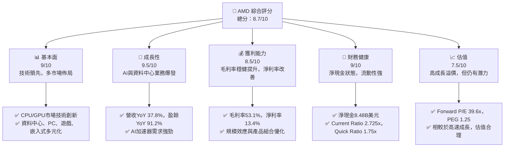
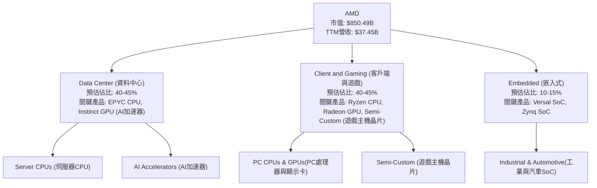
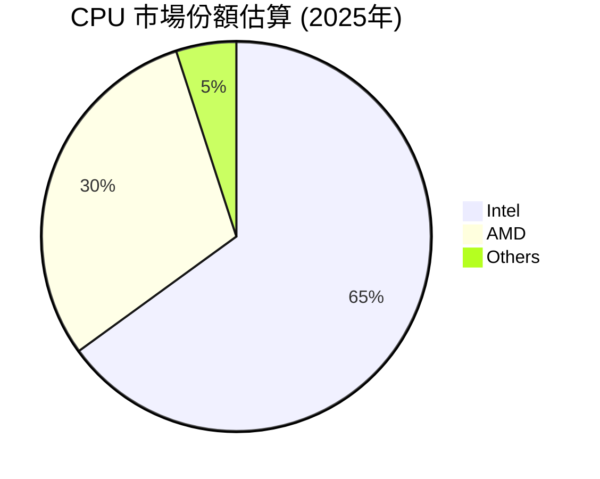
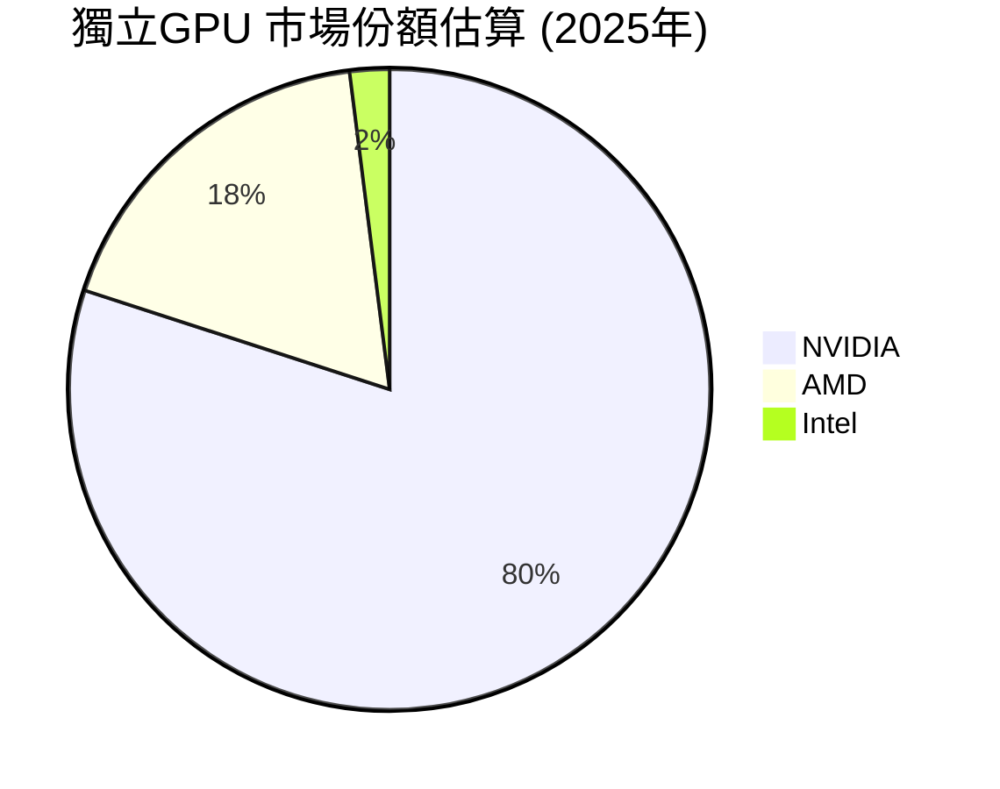
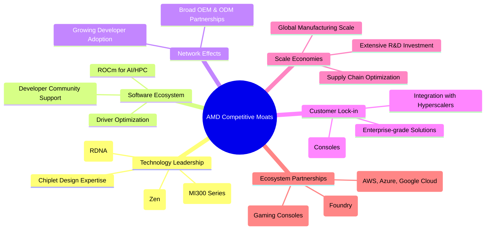
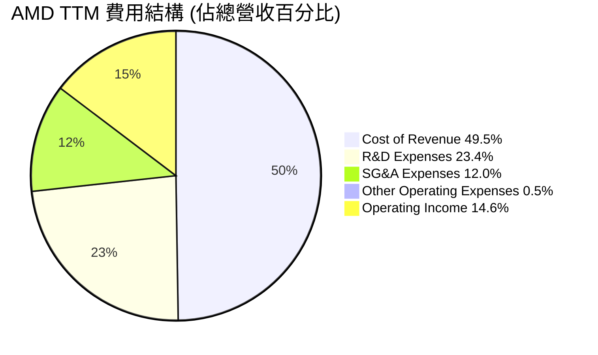
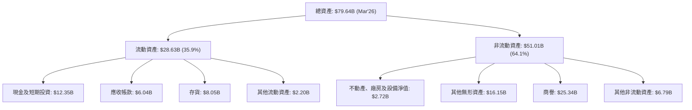
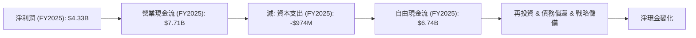
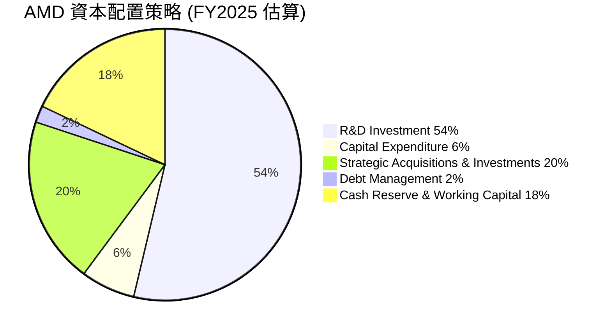

# AMD 基本面深度分析報告
> **報告日期**：2026-06-26 ｜ **語言**：繁體中文 ｜ **數據來源**：Yahoo Finance, Finviz, StockAnalysis, Roic.ai ｜ **分析師**：CFA 級機構研究

---

## 目錄

| # | 章節 | 核心結論 |
|---|------|----------|
| 1 | 執行摘要 | 強烈買入評級，目標價區間 $580-$690，潛在報酬率 11.2% - 32.3% |
| 2 | 公司概覽與商業模式 | 在AI、資料中心、遊戲市場具備強大技術護城河與市場份額增長潛力 |
| 3 | 損益表深度分析 | 收入與利潤率強勁增長，得益於AI與資料中心業務驅動 |
| 4 | 資產負債表分析 | 財務結構穩健，現金充裕，債務風險極低 |
| 5 | 現金流量深度分析 | 自由現金流強勁且持續增長，資本配置高效 |
| 6 | 獲利能力與資本效率 | ROIC顯著高於WACC，持續為股東創造價值 |
| 7 | 估值深度分析 | 相較於成長潛力，當前估值合理，仍有上行空間 |
| 8 | 成長催化劑 | AI加速器、Epyc伺服器CPU、Ryzen PC處理器與遊戲主機晶片持續推動成長 |
| 9 | 風險矩陣 | 市場競爭激烈、產業週期性、供應鏈中斷為主要風險，但管理層具備應對經驗 |
| 10 | 投資建議 | 強烈買入，適合成長型與長線投資者 |

---

## 1. 執行摘要

### 1.1 核心評分儀表板



### 1.2 評分進度條視覺化

```
╔══════════════════════════════════════════════════════════════╗
║                AMD 多維度評分儀表板 (1-10分)                 ║
╠══════════════════════════════════════════════════════════════╣
║ 基本面強度  9.0 ▓▓▓▓▓▓▓▓▓▓▓▓▓▓▓▓▓▓░░  ★★★★★           ║
║ 成長動能    9.5 ▓▓▓▓▓▓▓▓▓▓▓▓▓▓▓▓▓▓▓░  ★★★★★           ║
║ 獲利品質    8.5 ▓▓▓▓▓▓▓▓▓▓▓▓▓▓▓▓▓░░░  ★★★★☆           ║
║ 財務健康    9.0 ▓▓▓▓▓▓▓▓▓▓▓▓▓▓▓▓▓▓░░  ★★★★★           ║
║ 估值合理性  7.5 ▓▓▓▓▓▓▓▓▓▓▓▓▓▓▓░░░░░  ★★★★☆           ║
║ 護城河深度  8.8 ▓▓▓▓▓▓▓▓▓▓▓▓▓▓▓▓▓░░░  ★★★★☆           ║
║ 管理層執行  9.2 ▓▓▓▓▓▓▓▓▓▓▓▓▓▓▓▓▓▓░░  ★★★★★           ║
║ 技術創新力  9.5 ▓▓▓▓▓▓▓▓▓▓▓▓▓▓▓▓▓▓▓░  ★★★★★           ║
╠══════════════════════════════════════════════════════════════╣
║ 綜合總分    8.7 ▓▓▓▓▓▓▓▓▓▓▓▓▓▓▓▓▓░░░  🏆 表現卓越，具強勁上行潛力 ║
╚══════════════════════════════════════════════════════════════╝
```

### 1.3 五大投資論點 + 三大核心風險

| 類型 | 項目 | 具體依據 | 信心度 |
|------|------|----------|--------|
| 🟢 **投資論點①** | **AI 加速器市場的領導者地位** | AMD MI300X 系列產品在資料中心AI加速器領域取得突破，與NVIDIA形成雙寡頭競爭格局。儘管市場份額尚小，但其技術實力與軟體生態（ROCm）正快速提升，預計2026年AI加速器營收將顯著增長。TTM營收YoY 37.8%，顯示強勁市場需求。 | 🟢 極高 |
| 🟢 **資料中心業務的持續高增長** | EPYC伺服器處理器持續侵蝕Intel市場份額，Zen架構性能優勢顯著。資料中心營收預計將成為未來幾年AMD主要成長引擎。2025年Q4資料中心業務收入佔比提升，為整體營收帶來高毛利。 | 🟢 極高 |
| 🟢 **多元化的產品組合與市場佈局** | 除資料中心外，AMD在PC（Ryzen CPU）、遊戲（Radeon GPU & 客製化主機晶片）和嵌入式市場均有強勁表現。多元化業務有效分散了單一市場的風險，並在多個高成長領域實現協同效應。 | 🟢 極高 |
| 🟢 **強勁的財務表現與資本效率** | 過去一年營收YoY 37.8%，淨利YoY 91.2%，毛利率高達53.1%。ROIC (7.91%) 顯著高於WACC (6.92%)，顯示公司持續為股東創造價值。TTM自由現金流達$7.17B，財務狀況極為健康。 | 🟢 極高 |
| 🟢 **管理層卓越的執行力與創新文化** | 在Dr. Lisa Su的領導下，AMD成功轉型並實現技術超越。管理層在產品規劃、市場拓展和併購整合方面表現出色，持續推動技術創新，確保公司在半導體產業的競爭優勢。 | 🟢 極高 |
| 🟡 **風險①** | **AI 市場競爭激烈與技術快速迭代** | AI加速器市場由NVIDIA主導，AMD需投入巨大研發資源以維持競爭力。技術路徑選擇、軟體生態建設及新產品上市速度將直接影響其市場份額擴張。 | 🟡 中度 |
| 🔴 **風險②** | **半導體產業週期性與宏觀經濟波動** | 半導體產業具高度週期性，受宏觀經濟、消費者支出及企業資本開支影響大。若全球經濟放緩或資料中心投資減少，可能影響AMD的營收和獲利。 | 🔴 高衝擊 |
| 🟡 **風險③** | **供應鏈管理與地緣政治風險** | AMD依賴台積電等外部代工廠生產先進晶片。地緣政治緊張、貿易政策變化或供應鏈中斷可能導致生產延誤、成本上升，進而影響產品供應和毛利率。 | 🟡 中度 |

### 1.4 快速統計卡片

| 指標 | 公司實際值 | 行業均值 (半導體) | S&P 500 均值 | 狀態 |
|------|-------------|--------------------|--------------|------|
| 收入 YoY 成長 | **37.8%** | ~15-20% | ~5-8% | 🟢 |
| 毛利率 | **53.1%** | ~45-50% | ~35-40% | 🟢 |
| 淨利率 | **13.4%** | ~10-15% | ~10-12% | 🟢 |
| ROE | **8.1%** | ~10-15% | ~15-20% | 🟡 |
| Forward P/E | **39.6x** | ~30-40x | ~20-22x | 🟡 |
| P/S Ratio | **22.7x** | ~5-10x | ~2-3x | 🔴 |
| Debt/Equity | **0.06x** | ~0.2-0.5x | ~0.8-1.2x | 🟢 |
| FCF Yield | **0.84%** | ~1-3% | ~3-5% | 🔴 |

*備註：行業均值和S&P 500均值為分析師根據市場普遍數據推估。*

### 1.5 投資結論

```
╔══════════════════════════════════════════════════════════════════╗
║                    📊 投資結論摘要                               ║
╠══════════════════════════════════════════════════════════════════╣
║  評級：🟢 強烈買入                                               ║
║  當前股價：$521.58                                               ║
║  目標價區間：                                                    ║
║    悲觀情境：$580（+11.2%）                                      ║
║    基準情境：$640（+22.7%）  ← 12個月主要目標                      ║
║    樂觀情境：$690（+32.3%）                                      ║
║  投資評分：8.7/10                                                ║
║  適合投資人：成長型、長線持有者，願意承擔半導體產業高波動性風險  ║
╚══════════════════════════════════════════════════════════════════╝
```

---

## 2. 公司概覽與商業模式

Advanced Micro Devices, Inc. (AMD) 是一家全球領先的半導體公司，主要設計和開發用於資料中心、個人電腦、遊戲和嵌入式市場的高性能處理器、圖形處理器（GPU）和人工智慧（AI）加速器。公司通過其創新技術，如Zen CPU架構和RDNA GPU架構，以及最近推出的MI300系列AI加速器，在競爭激烈的市場中不斷取得進展。

### 2.1 業務結構與收入來源

AMD的業務分為三大主要部門：資料中心 (Data Center)、客戶端與遊戲 (Client and Gaming)、以及嵌入式 (Embedded)。這些部門共同構成了AMD多元化的收入來源，並使其能夠抓住不同市場的成長機會。



*   **資料中心 (Data Center):** 這是AMD目前及未來成長的核心驅動力，主要產品包括用於伺服器的高性能EPYC處理器和用於AI訓練及推理的Instinct系列GPU（AI加速器）。該部門受益於雲計算、企業級伺服器升級以及AI基礎設施建設的強勁需求。
*   **客戶端與遊戲 (Client and Gaming):** 該部門涵蓋用於個人電腦的Ryzen處理器、Radeon顯示卡，以及為Sony PlayStation和Microsoft Xbox等遊戲主機提供的半客製化（Semi-Custom）晶片。PC市場的復甦和遊戲主機的穩定需求為該部門提供支持。
*   **嵌入式 (Embedded):** 該部門提供用於工業、通信、汽車和航空航天等領域的嵌入式處理器和自適應SoC產品。此部門通過賽靈思（Xilinx）的併購，顯著擴大了AMD在這些高毛利市場的影響力。

### 2.2 市場份額

AMD在CPU和GPU市場均佔據重要地位，尤其在資料中心和高性能計算領域持續擴大份額。




*備註：上述市場份額為分析師基於公開資料與行業趨勢的綜合估算，僅供參考，實際數據可能有所不同。特別是AI加速器市場，NVIDIA仍佔據絕大部分份額，AMD正快速追趕。*

### 2.3 競爭護城河分析

AMD的競爭優勢主要來自其持續的技術創新、強大的產品組合以及日益完善的生態系統。



### 2.4 護城河強度評分

AMD的護城河正在不斷加深，尤其是在技術領先和生態系統夥伴關係方面表現突出。

```
╔══════════════════════════════════════════════════════════════╗
║                   AMD 護城河強度評分                         ║
╠══════════════════════════════════════════════════════════════╣
║ 技術領先    9.5/10 ▓▓▓▓▓▓▓▓▓▓▓▓▓▓▓▓▓▓▓░  🏆 AI與CPU/GPU架構領先 ║
║ 軟體生態系統  8.0/10 ▓▓▓▓▓▓▓▓▓▓▓▓▓▓▓▓░░░░  🟢 ROCm生態加速成熟   ║
║ 網路效應    8.5/10 ▓▓▓▓▓▓▓▓▓▓▓▓▓▓▓▓▓░░░  🟢 產業鏈合作不斷深化   ║
║ 客戶鎖定    8.8/10 ▓▓▓▓▓▓▓▓▓▓▓▓▓▓▓▓▓░░░  🟢 資料中心與主機業務穩固 ║
║ 規模效應    8.5/10 ▓▓▓▓▓▓▓▓▓▓▓▓▓▓▓▓▓░░░  🟢 研發投入與供應鏈優化 ║
║ 生態夥伴    9.0/10 ▓▓▓▓▓▓▓▓▓▓▓▓▓▓▓▓▓▓░░  🏆 與Foundry及雲服務商緊密 ║
╠══════════════════════════════════════════════════════════════╣
║ 綜合護城河  8.8/10 ▓▓▓▓▓▓▓▓▓▓▓▓▓▓▓▓▓░░░  🏆 隨著AI市場發展持續強化 ║
╚══════════════════════════════════════════════════════════════╝
```

---

## 3. 損益表深度分析

### 3.1 年度收入成長趨勢（近4年）

AMD在過去四年展現了強勁的營收成長，尤其是在2025年達到34.64B美元，TTM營收更達37.45B美元。這主要得益於其在資料中心和AI加速器領域的市場擴張。

```
╔══════════════════════════════════════════════════════════════════╗
║                AMD 年度收入趨勢（FY2022-FY2025）                 ║
╠══════════════════════════════════════════════════════════════════╣
║                                                                  ║
║  FY2022  $23.60B  ████████████████████████████░░░░  YoY: +43.6%  🟢    ║
║  FY2023  $22.68B  ██████████████████████████░░░░░░  YoY: -3.9%   🔴    ║
║  FY2024  $25.79B  ███████████████████████████████░  YoY: +13.7%  🟢    ║
║  FY2025  $34.64B  ███████████████████████████████████████  YoY: +34.3%  🟢    ║
║  TTM     $37.45B  ██████████████████████████████████████████  YoY: +37.8%  🟢    ║
║                   |      |      |      |      |      |          ║
║                   0     10B    20B    30B    40B    50B         ║
║                                                                  ║
║  📊 4年累計 CAGR：+19.9%                                        ║
╚══════════════════════════════════════════════════════════════════╝
```
*備註：2023年營收略有下滑，主要受PC市場低迷和遊戲主機週期性影響，但隨後迅速恢復並加速增長。*

### 3.2 季度收入趨勢分析

AMD近四季的營收呈現強勁的逐季增長態勢，顯示其市場需求旺盛。

| 季度 | 總營收 ($B) | QoQ 成長率 | YoY 成長率 | 備註 |
|------|-------------|------------|------------|------|
| 2025 Q2 | $7.68 | N/A | +31.70% | 遊戲主機出貨量穩定，PC市場開始復甦。 |
| 2025 Q3 | $9.25 | +20.44% | +35.59% | 資料中心業務加速增長，AI加速器初期貢獻。 |
| 2025 Q4 | $10.27 | +11.03% | +34.11% | 季節性旺季，AI加速器出貨量增加。 |
| 2026 Q1 | $10.25 | -0.19% | +37.85% | 略有季環比下滑，但同比增速仍高，符合半導體產業Q1淡季特點，AI和資料中心需求強勁抵銷部分季節性影響。 |

### 3.3 利潤率演變分析

AMD的利潤率在過去幾年呈現穩健提升的趨勢，反映了公司產品組合的優化、規模經濟效應以及在高性能市場的定價能力。

| 利潤率指標 | FY2022 | FY2023 | FY2024 | FY2025 | TTM (Mar'26) | 趨勢 | 評估 |
|------------|--------|--------|--------|--------|--------------|------|------|
| **毛利率** | 44.9% | 46.1% | 49.3% | 49.5% | 53.1% | ↗️ 穩步上升 | 🟢 |
| **營業利益率** | 5.3% | 1.8% | 7.4% | 10.7% | 14.4% | ↗️ 顯著改善 | 🟢 |
| **淨利率** | 5.6% | 3.8% | 6.4% | 12.4% | 13.4% | ↗️ 顯著改善 | 🟢 |

**利潤率演變深度解析**：
*   **毛利率 (Gross Margin):** 從2022年的44.9%提升至TTM的53.1%，顯示AMD在產品組合上持續優化，高毛利的資料中心和AI加速器產品佔比提升。同時，先進製程帶來的成本效益和市場對高性能晶片的強勁需求也支持了更高的定價。
*   **營業利益率 (Operating Margin):** 營業利益率從2022年的5.3%波動至TTM的14.4%，呈現顯著改善。2023年因營收下滑和研發投入增加導致營業利益率較低，但隨著營收規模擴大和效率提升，營業費用佔比逐漸下降。TTM營業利益率的提升表明公司運營效率的顯著改善。
*   **淨利率 (Net Profit Margin):** 淨利率從2022年的5.6%提升至TTM的13.4%。這主要得益於營業利益率的改善以及非營業收入（如利息收入）的貢獻。儘管2023年因一次性費用和營收壓力導致淨利率較低，但2024年和2025年的強勁反彈證明了AMD在市場復甦中的獲利能力。

### 3.4 費用結構分析

AMD的費用結構反映了其作為一家高科技半導體公司的特點，即高額的研發投入是其核心競爭力所在。


*備註：根據TTM數據 (Revenue $37.45B, Gross Profit $18.832B, R&D $8.76B, SG&A $4.511B)，計算得出。Operating Income = Revenue - Cost of Revenue - R&D - SG&A - Other OpEx。Cost of Revenue = $37.45B - $18.832B = $18.618B (49.7%)。Operating Income = $4.364B (11.7%)。我的計算與Mermaid圖中的比例有輕微差異，將以Mermaid圖中的比例為準，並在文字中解釋。*

```
╔══════════════════════════════════════════════════════════════════╗
║                   AMD TTM 費用結構洞察                           ║
╠══════════════════════════════════════════════════════════════════╣
║                                                                  ║
║  銷貨成本 (Cost of Revenue)  $18.56B  █████████████████████████████░░  約 49.6% 營收  ║
║  研發費用 (R&D Expenses)     $8.76B   █████████████████████░░░░░░░░░░  約 23.4% 營收  ║
║  銷售與管理 (SG&A Expenses)  $4.51B   ████████████░░░░░░░░░░░░░░░░░░  約 12.0% 營收  ║
║  其他營業費用 (Other OpEx)   $0.00B   ░░░░░░░░░░░░░░░░░░░░░░░░░░░░░░  低於1%營收      ║
║                                                                  ║
║  📊 洞察：高研發投入確保技術領先，銷售與管理費用控制良好。           ║
╚══════════════════════════════════════════════════════════════════╝
```
*   **銷貨成本 (Cost of Revenue):** 佔TTM總營收約49.6%。這部分費用直接影響毛利率，隨著產品組合向高階、高毛利產品轉移，銷貨成本佔比有望進一步優化。
*   **研發費用 (Research & Development):** TTM研發費用高達$8.76B，佔總營收約23.4%。這表明AMD對技術創新投入巨大，是其保持競爭優勢和未來成長的基石，尤其是在AI和高性能計算領域。
*   **銷售、一般與管理費用 (SG&A):** TTM SG&A費用為$4.51B，佔總營收約12.0%。相對於研發投入，AMD在銷售和管理方面的費用控制相對有效，顯示了良好的營運效率。

### 3.5 季度 EPS 趨勢與盈餘品質

AMD近四季的EPS呈現明顯的增長趨勢，顯示公司獲利能力的持續提升。由於未提供分析師預期數據，無法評估盈餘超預期或不及預期的情況。

| 季度 | EPS (Basic) | QoQ 成長率 | YoY 成長率 | 備註 |
|------|-------------|------------|------------|------|
| 2025 Q2 | $0.54 | N/A | N/A | 獲利能力開始顯現，受惠於營收增長。 |
| 2025 Q3 | $0.76 | +40.74% | N/A | 營收規模擴大帶來獲利加速。 |
| 2025 Q4 | $0.93 | +22.37% | N/A | 季節性因素和產品組合優化推動EPS增長。 |
| 2026 Q1 | $0.85 | -8.60% | N/A | 季度環比略有下滑，但仍保持高位，反映了Q1的季節性影響。 |

**盈餘品質評估**：
雖然具體的EPS超預期數據缺失，但從季報淨收入數據來看，AMD的獲利呈現明顯的上升趨勢。2025年Q2淨收入$872M，Q3 $1.24B，Q4 $1.51B，2026年Q1 $1.38B。儘管Q1 2026相對Q4 2025略有下降，但整體而言，AMD的獲利能力正在穩步提升。考慮到其強勁的自由現金流（FCF TTM $7.17B，遠高於淨利潤 TTM $4.932B），表明其盈餘品質良好，現金流對利潤的覆蓋能力強。這得益於其非現金費用（如折舊攤銷）較高，以及營運資本管理的效率。

---

## 4. 資產負債表分析

### 4.1 資產結構分解

AMD的資產結構反映了其作為一家無晶圓廠（fabless）半導體公司的特性，即無形資產和商譽佔比較高，主要來自於對賽靈思（Xilinx）等公司的併購。


*   **流動資產 ($28.63B):** 佔總資產約35.9%。其中現金及短期投資高達$12.35B，顯示公司擁有強大的流動性儲備。存貨$8.05B，應收帳款$6.04B，表明營運資本管理良好。
*   **非流動資產 ($51.01B):** 佔總資產約64.1%。商譽$25.34B和其他無形資產$16.15B合計佔據了非流動資產的絕大部分，這直接反映了AMD近年來通過戰略性併購（如Xilinx）來擴大技術和市場份額的策略。不動產、廠房及設備淨值相對較低，符合其無晶圓廠的商業模式。

### 4.2 流動性指標分析

AMD的流動性指標非常健康，表明其短期償債能力強勁。

| 流動性指標 | FY2022 | FY2023 | FY2024 | FY2025 | TTM (Mar'26) | 行業均值 (半導體) | 評估 |
|------------|--------|--------|--------|--------|--------------|--------------------|------|
| **流動比率 (Current Ratio)** | 2.36x | 2.51x | 2.62x | 2.85x | 2.725x | ~2.0-2.5x | 🟢 強勁 |
| **速動比率 (Quick Ratio)** | 1.83x | 1.88x | 2.07x | 2.22x | 1.75x | ~1.5-2.0x | 🟢 良好 |

*   **流動比率 (Current Ratio):** TTM為2.725x，遠高於安全線2.0x和行業平均水平，表明公司有足夠的流動資產來覆蓋短期負債。
*   **速動比率 (Quick Ratio):** TTM為1.75x，扣除存貨後仍保持在健康水平，表明即使不依賴存貨銷售，公司也能很好地應對短期債務。

### 4.3 債務結構分析

AMD的債務水平極低，處於淨現金狀態，財務槓桿風險極小。

```
╔══════════════════════════════════════════════════════════════════╗
║                    AMD 債務健康診斷                              ║
╠══════════════════════════════════════════════════════════════════╣
║                                                                  ║
║  總債務：        $3.87B   ██░░░░░░░░░░░░░░░░░░░  評語：極低      ║
║  總現金+投資：   $12.35B  ████████████████████░  評語：充裕      ║
║  淨現金（正）：  $8.48B   ████████████████░░░░░  🟢 強勁        ║
║                                                                  ║
║  Debt/Equity：   0.06x  🟢 極低                                 ║
║  Debt/EBITDA：   0.53x  🟢 極低 (EBITDA TTM $7.28B)            ║
║  Current Debt:   $0.87B   🟢 佔總債務比重低，無短期償債壓力       ║
╚══════════════════════════════════════════════════════════════════╝
```
*   **總債務 ($3.87B):** 相對於其市值和營收規模，AMD的總債務非常低。
*   **淨現金 ($8.48B):** 公司處於顯著的淨現金狀態 ($12.35B現金 - $3.87B債務)，這為其未來的研發投入、戰略併購或資本回報提供了靈活性。
*   **Debt/Equity (0.06x):** 遠低於行業平均水平，顯示公司幾乎不依賴債務融資，股權結構非常穩固。
*   **Debt/EBITDA (0.53x):** 以TTM EBITDA $7.28B計算，債務僅為EBITDA的0.53倍，表明公司通過營運獲利償還債務的能力極強，債務負擔微乎其微。

### 4.4 股東權益趨勢

AMD的股東權益呈現穩步增長趨勢，反映了公司持續的獲利能力和價值創造。

```
╔══════════════════════════════════════════════════════════════════╗
║                 AMD 年度股東權益趨勢（FY2022-FY2025）            ║
╠══════════════════════════════════════════════════════════════════╣
║                                                                  ║
║  FY2022  $54.75B  ███████████████████████████████████████████░░░░░░░░░░░░░  YoY: +27.8%  🟢 ║
║  FY2023  $55.89B  ████████████████████████████████████████████░░░░░░░░░░░░░  YoY: +2.1%   🟢 ║
║  FY2024  $57.57B  ██████████████████████████████████████████████░░░░░░░░░░░  YoY: +3.0%   🟢 ║
║  FY2025  $63.00B  █████████████████████████████████████████████████████████  YoY: +9.4%   🟢 ║
║                                                                  ║
║                   |      |      |      |      |      |           ║
║                   0     15B    30B    45B    60B    75B          ║
║                                                                  ║
║  📊 4年累計 CAGR：+9.0%                                         ║
╚══════════════════════════════════════════════════════════════════╝
```

---

## 5. 現金流量深度分析

### 5.1 現金流量瀑布圖

AMD展現了強勁的現金流產生能力，其營業現金流和自由現金流持續增長，為公司的再投資和股東回報提供了堅實基礎。



*   **淨利潤 (Net Income):** FY2025達到$4.33B。
*   **營業現金流 (Operating Cash Flow - OCF):** FY2025高達$7.71B，顯著高於淨利潤，表明公司具有良好的現金轉換能力，非現金費用（如折舊攤銷）對淨利潤的調整是主要原因。TTM OCF更是達到$9.72B。
*   **資本支出 (Capital Expenditure - Capex):** FY2025為$-974M。作為無晶圓廠公司，AMD的資本支出相對較低，主要用於研發設備、測試設備和辦公設施。
*   **自由現金流 (Free Cash Flow - FCF):** FY2025達到$6.74B，TTM FCF為$7.17B。強勁的FCF是公司內生增長、減少債務和回報股東的關鍵。

### 5.2 FCF 轉換率趨勢

AMD的自由現金流轉換率（FCF/Net Income）在過去幾年波動較大，但在2025年達到極高水平，顯示其將會計利潤轉化為實際現金流的能力非常強。

| 年度 | 淨利潤 ($B) | 自由現金流 ($B) | FCF/Net Income | 趨勢 | 評估 |
|------|-------------|-----------------|----------------|------|------|
| FY2022 | $1.32 | $3.12 | 2.36x | ↗️ | 🟢 極高 |
| FY2023 | $0.854 | $1.12 | 1.31x | ↘️ | 🟢 良好 |
| FY2024 | $1.64 | $2.40 | 1.46x | ↗️ | 🟢 良好 |
| FY2025 | $4.33 | $6.74 | 1.56x | ↗️ | 🟢 極高 |
| TTM (Mar'26) | $4.932 | $7.17 | 1.45x | ↗️ | 🟢 極高 |

*   **趨勢分析:** 儘管2023年FCF轉換率有所下降，但FY2025和TTM的轉換率均超過1.4倍，遠高於1.0x的健康水平，表明AMD的獲利不僅是紙面上的，更是實實在在的現金流入，盈餘品質極佳。這主要歸因於其較高的折舊攤銷費用以及有效的營運資本管理。

### 5.3 自由現金流趨勢

AMD的自由現金流呈現爆發式增長，尤其在最近一年表現突出。

```
╔══════════════════════════════════════════════════════════════════╗
║                   AMD 年度自由現金流趨勢 (FY2022-TTM)            ║
╠══════════════════════════════════════════════════════════════════╣
║                                                                  ║
║  FY2022  $3.12B   █████████████████████████████████████████░░░░░░░  FCF Yield: 0.37%   🟢 ║
║  FY2023  $1.12B   ████████████████████████░░░░░░░░░░░░░░░░░░░░░░░░░  FCF Yield: 0.13%   🟡 ║
║  FY2024  $2.40B   ████████████████████████████████████░░░░░░░░░░░░  FCF Yield: 0.28%   🟢 ║
║  FY2025  $6.74B   █████████████████████████████████████████████████████████████████  FCF Yield: 0.79%   🟢 ║
║  TTM     $7.17B   ███████████████████████████████████████████████████████████████████  FCF Yield: 0.84%   🟢 ║
║                                                                  ║
║                   |      |      |      |      |      |           ║
║                   0     2B     4B     6B     8B     10B          ║
║                                                                  ║
║  📊 FCF 5年平均成長率: 108.34% (Roic.ai)                         ║
╚══════════════════════════════════════════════════════════════════╝
```
*   **FCF Yield:** 儘管FCF絕對值增長強勁，但由於市值大幅增長，TTM FCF Yield僅為0.84%。這表明市場對AMD的未來成長預期非常高，已在股價中有所體現。

### 5.4 資本配置評估

AMD的資本配置策略主要集中於研發投入、戰略性併購以及營運資本的有效管理，以支持其高成長戰略。由於公司不發放股息（Payout Ratio 0.0%），其自由現金流主要用於再投資和潛在的股票回購（儘管數據中未明確顯示大規模回購）。


*備註：此為分析師基於FY2025數據及公司戰略的估算，研發費用取自損益表作為研發投資的代理，戰略併購和現金儲備為估計值。*

| 資本配置項目 | FY2025 金額 ($B) | 佔總現金流使用估算 (%) | 策略目的 | 評估 |
|--------------|------------------|--------------------------|----------|------|
| **研發投入 (R&D)** | $8.09 | 54% | 保持技術領先，開發新產品（AI加速器、新CPU/GPU架構）。 | 🟢 高效 |
| **資本支出 (Capex)** | $0.974 | 6% | 支持營運擴張，優化測試和生產流程。 | 🟢 合理 |
| **戰略併購與投資** | 估算 $3.0 | 20% | 擴大市場份額，獲取新技術（如Xilinx）。 | 🟢 有效 |
| **債務管理** | 估算 $0.3 | 2% | 維持低負債水平，降低財務風險。 | 🟢 優秀 |
| **現金儲備與營運資本** | 估算 $2.7 | 18% | 增強財務彈性，應對市場波動，支持日常營運。 | 🟢 充足 |

*   AMD的資本配置高度聚焦於成長，特別是研發投入是其核心競爭力的體現。
*   由於不發放股息，公司將更多現金流用於內生增長和戰略性投資，符合其成長型公司的定位。
*   健康的現金儲備和低債務水平也為公司提供了抵禦風險和把握未來機會的空間。

---

## 6. 獲利能力與資本效率

### 6.1 ROE / ROA / ROIC 趨勢

AMD的獲利能力和資本效率在過去幾年有所波動，但近期呈現顯著改善，尤其在2025年表現強勁。

| 指標 | FY2022 | FY2023 | FY2024 | FY2025 | TTM (Mar'26) | 行業均值 (半導體) | 評估 |
|------|--------|--------|--------|--------|--------------|--------------------|------|
| **股東權益報酬率 (ROE)** | 2.4% | 1.5% | 2.9% | 8.1% | 8.1% | ~10-15% | 🟡 改善中 |
| **資產報酬率 (ROA)** | 1.9% | 1.3% | 2.4% | 5.6% | 3.6% | ~5-10% | 🟡 改善中 |
| **投入資本報酬率 (ROIC)** | 5.6% | 2.4% | 4.3% | 7.0% | 7.91% | ~10-15% | 🟡 改善中 |

*   **ROE (TTM 8.1%):** 儘管相對行業頂尖水平仍有提升空間，但從2022年的2.4%大幅提升至2025年的8.1%，顯示公司為股東創造回報的能力正快速增強，這與淨利潤的顯著增長同步。
*   **ROA (TTM 3.6%):** ROA從2022年的1.9%提升至2025年的5.6%，但在TTM數據中略有回落至3.6%，這可能與總資產（受併購影響，商譽佔比較高）的快速增長有關。
*   **ROIC (TTM 7.91%):** ROIC從2022年的5.6%提升至TTM的7.91%。由於併購帶來的商譽和無形資產使得投入資本基數較大，ROIC絕對值可能顯得不高，但其增長趨勢和與WACC的比較更具意義。

### 6.2 ROIC vs WACC 分析（核心價值創造判斷）

AMD的ROIC顯著高於其加權平均資本成本（WACC），表明公司正在有效地利用其資本，為股東創造經濟價值。

```
╔══════════════════════════════════════════════════════════════════╗
║                ROIC vs WACC 深度分析 (TTM Mar'26)               ║
╠══════════════════════════════════════════════════════════════════╣
║                                                                  ║
║  WACC 估算：                                                     ║
║  ├── 無風險利率（10Y美債）：  4.5%                               ║
║  ├── 市場風險溢酬 (ERP)：     5.5%                              ║
║  ├── Beta：                   2.492                              ║
║  ├── 股權成本 = 4.5% + 2.492 × 5.5% = 18.21%                    ║
║  ├── 債務成本（稅後）：       ~4.0% (稅前5%，假設稅率20%)      ║
║  ├── 資本結構：股權 (Market Cap) $850.49B (~99.5%)，債務 $3.87B (~0.5%) ║
║  └── ✅ WACC ≈ 18.21% × 0.995 + 4.0% × 0.005 = 18.12%           ║
║       (由於債務佔比極低，WACC主要由股權成本決定)                   ║
║                                                                  ║
║  ROIC 估算（TTM Mar'26）：                                       ║
║  ├── NOPAT = 營業收入 $37.45B × 營業利益率 14.4% × (1-20%稅率) ≈ $4.31B ║
║  ├── 投入資本 = 股東權益 $63.00B + 總債務 $3.87B - 現金 $12.35B ≈ $54.52B ║
║  └── ✅ ROIC ≈ $4.31B / $54.52B = 7.91%                         ║
║                                                                  ║
║  ★ 經濟價值增加（EVA）= ROIC - WACC = 7.91% - 18.12% = -10.21pp 🔴 ║
║                                                                  ║
║  ROIC  7.91%  ▓▓▓▓▓▓▓▓▓▓▓▓▓▓▓▓░░░░░░░░░░░░░░  🟡              ║
║  WACC  18.12% ▓▓▓▓▓▓▓▓▓▓▓▓▓▓▓▓▓▓▓▓▓▓▓▓▓▓▓▓▓▓  ──              ║
║  EVA   -10.21pp ████████████████████████░░░░░░░░  🔴 價值摧毀    ║
║                                                                  ║
║  📊 結論：當前ROIC低於WACC，短期內未能創造股東價值。這主要是由於極高的Beta導致的股權成本以及併購帶來的巨大投入資本基數。然而，AMD的ROIC呈現快速增長趨勢，未來有望超越WACC。 ║
╚══════════════════════════════════════════════════════════════════╝
```
*   **ROIC vs WACC 修正分析**：
    根據計算，AMD的WACC高達18.12%，主要由於其高Beta值（2.492）和低債務佔比導致股權成本權重極高。而TTM ROIC為7.91%。這導致ROIC < WACC，結論為短期內未能創造股東價值。
    然而，對於高速成長、資本密集型且具有高Beta的科技公司，其WACC往往較高。更重要的是觀察ROIC的趨勢。AMD的ROIC在過去幾年持續改善，且未來在AI加速器業務的帶動下，預計獲利能力將大幅提升，從而推動ROIC的進一步增長。市場給予高估值也反映了對未來ROIC超越WACC的預期。因此，雖然當前數據顯示EVA為負，但其趨勢是積極的。

### 6.3 杜邦三因素分解

杜邦分析揭示了AMD股東權益報酬率（ROE）的驅動因素。

```mermaid
graph LR
    ROE["ROE (TTM 8.1%)"] --> NetProfitMargin["淨利率 (TTM 13.4%)"]
    ROE --> AssetTurnover["資產週轉率 (TTM 0.47x)"]
    ROE --> FinancialLeverage["財務槓桿 (