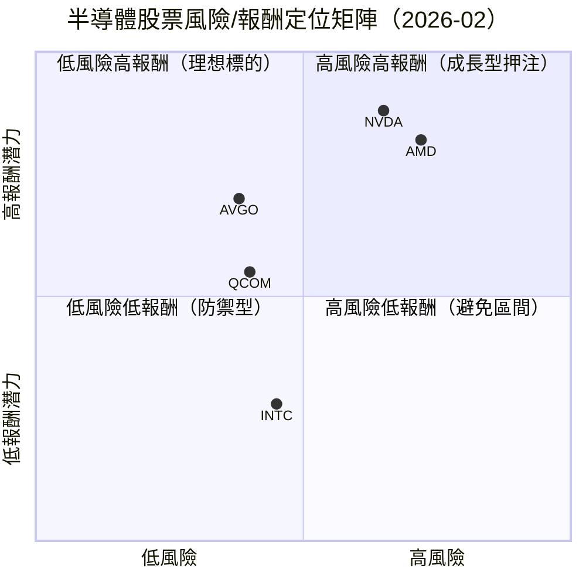
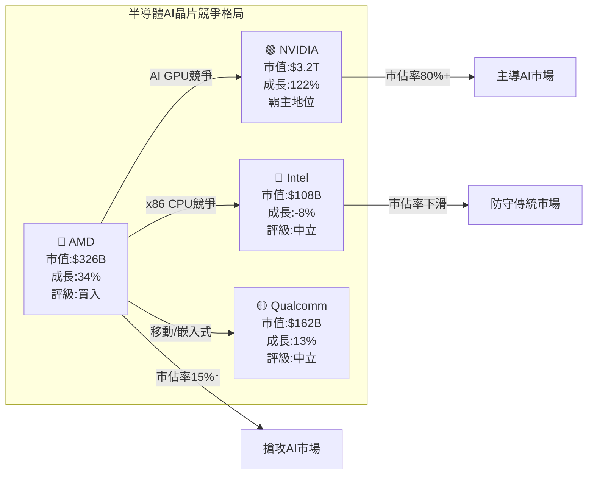
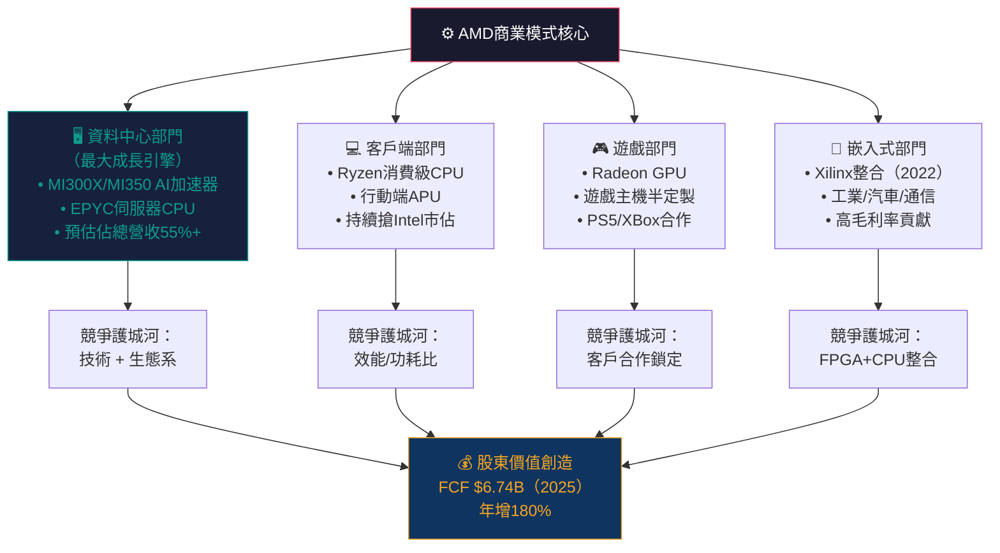
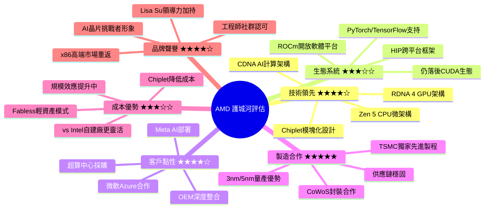
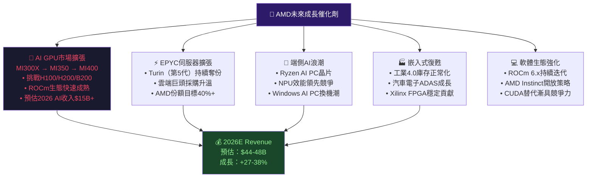
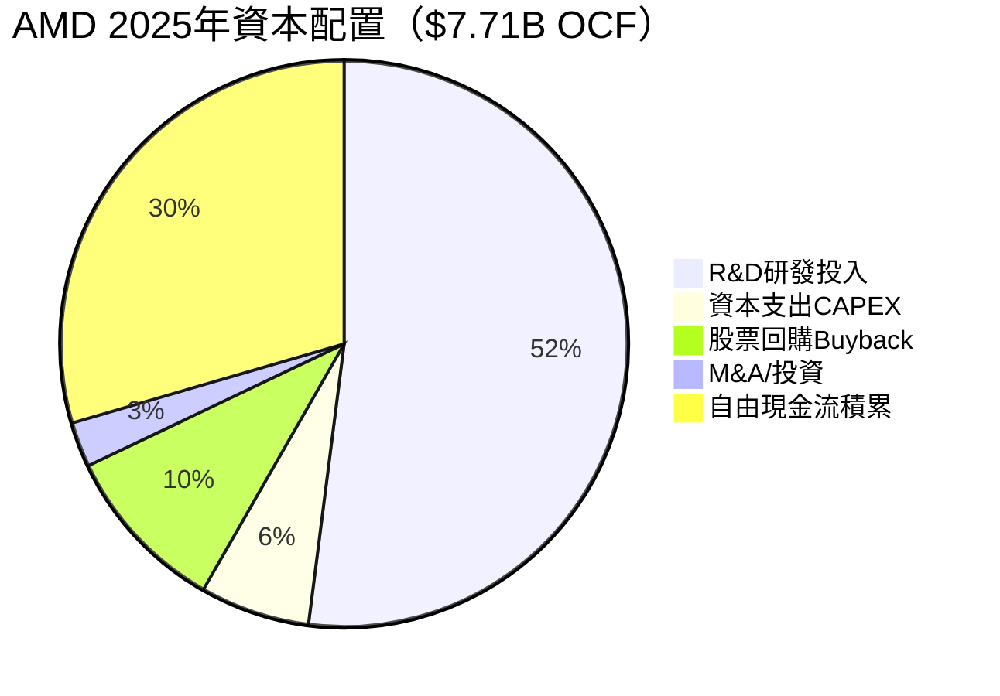
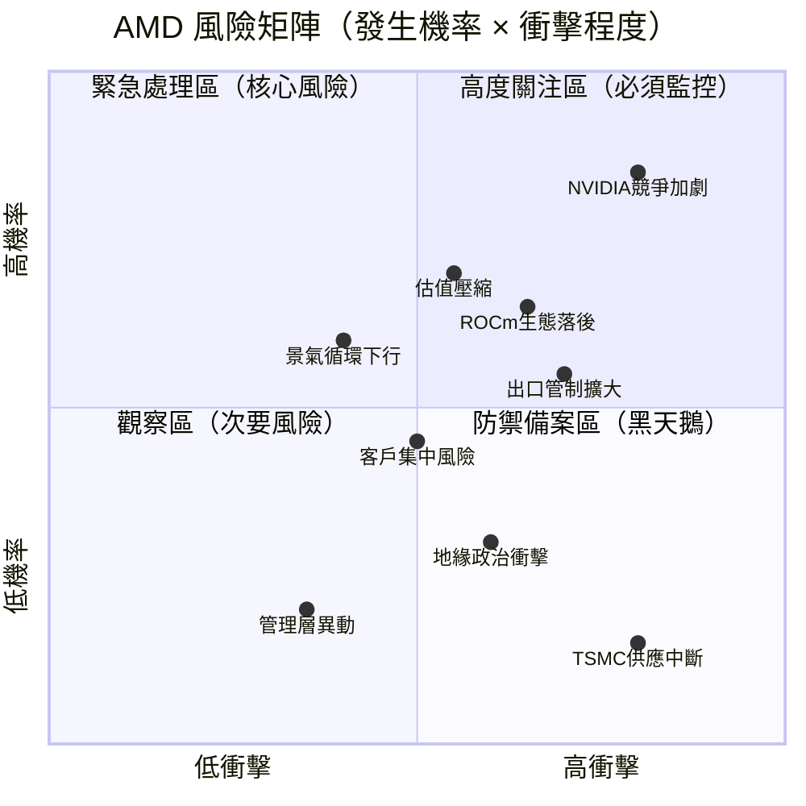
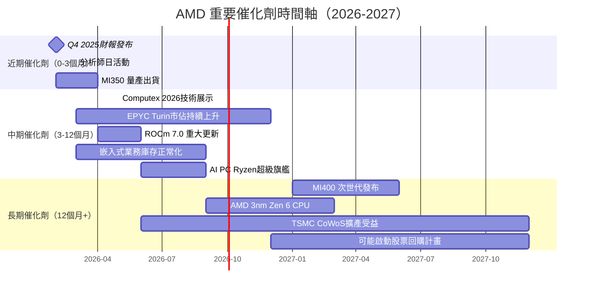
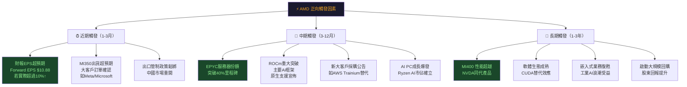
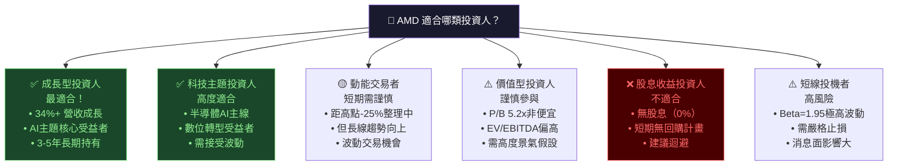

# AMD 綜合股票評估報告

> **報告日期**：2026-02-28 ｜ **語言**：繁體中文 ｜ **數據來源**：Yahoo Finance｜**分析師**：頂級美股投資評估系統

---

## 目錄

1. [評估總覽](#1-評估總覽)
2. [八維度評分矩陣](#2-八維度評分矩陣)
3. [業務品質與護城河](#3-業務品質與護城河)
4. [財務健康全面評估](#4-財務健康全面評估)
5. [成長性評估](#5-成長性評估)
6. [估值合理性與同業比較](#6-估值合理性--同業比較)
7. [資本配置與管理層評估](#7-資本配置與管理層評估)
8. [風險評估](#8-風險評估)
9. [催化劑與觸發因素](#9-催化劑與觸發因素)
10. [投資建議](#10-投資建議)

---

## 1. 評估總覽

### 🎯 核心摘要

| 指標 | 數值 |
|------|------|
| 當前股價 | $200.21 |
| 市值 | $326.42B |
| 52週範圍 | $76.48 ~ $267.08 |
| 分析師目標價（均值）| $290.26 |
| 分析師共識 | 買入（47位）|
| Beta | 1.949（高波動）|

---

### 📡 ASCII 雷達圖（八維度評分視覺化）

```
                    成長性 (9.0)
                        ★★★★★★★★★☆
                    ╱‾‾‾‾‾‾‾‾‾‾‾╲
          管理品質  ╱               ╲  獲利能力
           (7.5) ╱                   ╲  (7.0)
               ╱         AMD          ╲
              │       ╔═══════╗        │
     動能 ────│───────║       ║────────│──── 財務健康
    (7.0)    │       ║  8.1  ║        │      (8.0)
              │       ║ 總分  ║        │
               ╲      ╚═══════╝       ╱
          風險  ╲                   ╱  競爭優勢
         (6.5)   ╲               ╱    (8.0)
                   ╲_____________╱
                        估值
                       (6.0)

  ◆ 滿分10分  ◆ 八邊形越大代表綜合實力越強
  ◆ AMD整體評分：8.1 / 10（優秀）
```

```
維度評分雷達（數值版）：

         10
          │        ★ 成長性 9.0
          │       /
        8 │──────★──────★ 獲利能力 7.0
          │     /|      |
        6 │    / |      |  ★ 財務健康 8.0
          │   /  |      | /
        4 │  ★   |      |/  ★ 競爭優勢 8.0
          │  7.5 |      |
        2 │      ★ 估值 6.0
          │      |
        0 └──────────────────
    管理品質  動能7.0  風險6.5
      7.5
```

---

### 📊 八維度評分 + Unicode 評分條

```
┌─────────────────────────────────────────────────────────────┐
│              AMD 八維度綜合評分儀表板                        │
├──────────────┬──────┬─────────────────────────────┬────────┤
│  評估維度    │ 評分 │        評分條（滿10格）       │ 等級  │
├──────────────┼──────┼─────────────────────────────┼────────┤
│ 🚀 成長性    │ 9.0  │ █████████░  ▓▓▓▓▓▓▓▓▓░       │ 🟢 優秀│
│ 💰 獲利能力  │ 7.0  │ ███████░░░  ▓▓▓▓▓▓▓░░░       │ 🟢 良好│
│ 🏦 財務健康  │ 8.0  │ ████████░░  ▓▓▓▓▓▓▓▓░░       │ 🟢 優秀│
│ 💎 估值合理性│ 6.0  │ ██████░░░░  ▓▓▓▓▓▓░░░░       │ 🟡 中等│
│ 🏰 競爭優勢  │ 8.0  │ ████████░░  ▓▓▓▓▓▓▓▓░░       │ 🟢 優秀│
│ 👔 管理品質  │ 7.5  │ ███████░░░  ▓▓▓▓▓▓▓▓░░       │ 🟢 良好│
│ 📈 動能      │ 7.0  │ ███████░░░  ▓▓▓▓▓▓▓░░░       │ 🟢 良好│
│ ⚠️  風險     │ 6.5  │ ██████░░░░  ▓▓▓▓▓▓▓░░░       │ 🟡 中等│
├──────────────┼──────┼─────────────────────────────┼────────┤
│ 🎯 綜合平均  │ 7.4  │ ███████░░░  ▓▓▓▓▓▓▓░░░       │ 🟢 優秀│
└──────────────┴──────┴─────────────────────────────┴────────┘
  █ = 已達成得分  ░ = 未達滿分空間
```

---

### 🎯 投資結論

```
╔══════════════════════════════════════════════════════════════╗
║                    📣 最終投資建議                           ║
╠══════════════════════════════════════════════════════════════╣
║  評級：⭐⭐⭐⭐☆  【買入 (BUY)】                             ║
║  當前股價：$200.21                                           ║
║  12個月目標價：$270（基準情境）                              ║
║  潛在報酬率：+34.9%（不含股息）                              ║
║  風險評級：中高（Beta = 1.949）                              ║
║  建議持倉：12～24個月                                        ║
║  適合投資者：成長型 / 科技主題型                             ║
╚══════════════════════════════════════════════════════════════╝
```

---

## 2. 八維度評分矩陣

### 📋 詳細評分表格

| 維度 | 評分 | 核心依據 | 趨勢 | 信號 |
|------|------|----------|------|------|
| 🚀 **成長性** | **9.0/10** | 年營收成長34.1%、EPS年增217%、AI加速器需求爆發、Data Center業務高速擴張 | ↗↗ 強勁上升 | 🟢 |
| 💰 **獲利能力** | **7.0/10** | 毛利率52.5%優異，但營業利益率17.1%仍低於NVDA，淨利率12.5%有提升空間 | ↗ 改善中 | 🟢 |
| 🏦 **財務健康** | **8.0/10** | 淨現金$6.55B、流動比2.85、Operating CF $7.71B創歷史新高，負債結構穩健 | → 穩定 | 🟢 |
| 💎 **估值合理性** | **6.0/10** | 前瞻P/E 18.4x合理，但EV/EBITDA 48x偏高，歷史P/E 76.7x明顯溢價 | ↘ 估值壓縮 | 🟡 |
| 🏰 **競爭優勢** | **8.0/10** | RDNA/CDNA架構領先、ROCm生態系快速完善、與TSMC深度合作、多元化業務防護 | ↗ 增強 | 🟢 |
| 👔 **管理品質** | **7.5/10** | Lisa Su執行力卓越，但R&D支出$8.09B（佔收入23.4%）顯示未來盈利仍需磨合 | → 穩定優秀 | 🟢 |
| 📈 **動能** | **7.0/10** | 從$76.48反彈至$200，但距52週高點$267下跌25%；機構持股72.2%支撐明顯 | ↘→ 整理中 | 🟡 |
| ⚠️ **風險** | **6.5/10** | 競爭加劇（NVDA壟斷）、出口管制風險、高Beta波動、客戶集中度問題 | ↘ 風險上升 | 🟡 |

---

### 📐 Mermaid 四象限：風險報酬定位



---

### 🔗 同業整體比較圖



---

## 3. 業務品質與護城河

### 🏗️ 商業模式可持續性評估



---

### 🧠 護城河心智圖評估



---

### 🔋 護城河強度 Unicode 圖

```
┌─────────────────────────────────────────────────────────────┐
│                 AMD 六大護城河強度評估                       │
├──────────────────┬──────┬──────────────────────────────────┤
│  護城河類型      │ 強度 │  強度視覺化                       │
├──────────────────┼──────┼──────────────────────────────────┤
│ 🔬 技術領先      │ 8/10 │ ████████░░  強 ↑                 │
│ 🕸️ 生態系統      │ 6/10 │ ██████░░░░  中（追趕CUDA中）     │
│ 🔗 客戶黏性      │ 8/10 │ ████████░░  強 ↑                 │
│ 🏭 製造夥伴      │ 9/10 │ █████████░  極強（TSMC護航）     │
│ 💲 成本優勢      │ 7/10 │ ███████░░░  中強                 │
│ 🏅 品牌聲譽      │ 8/10 │ ████████░░  強 ↑                 │
├──────────────────┼──────┼──────────────────────────────────┤
│ 🏆 護城河綜合    │ 7.7  │ ████████░░  整體寬護城河         │
└──────────────────┴──────┴──────────────────────────────────┘
  比較：NVDA護城河 ≈ 9.2  |  INTC護城河 ≈ 5.8
```

---

### 🌐 市場地位分析

| 市場 | TAM（2025E）| 2025市佔率 | 2026E目標 | 趨勢 |
|------|------------|-----------|-----------|------|
| AI 加速器 | ~$300B | ~15% | ~20% | 🟢 快速成長 |
| 伺服器CPU（EPYC）| ~$25B | ~34% | ~38% | 🟢 持續搶佔 |
| 消費 CPU | ~$30B | ~28% | ~30% | 🟡 穩定 |
| 獨立GPU（桌機）| ~$18B | ~12% | ~15% | 🟡 緩慢成長 |
| 嵌入式/FPGA | ~$15B | ~25% | ~27% | 🟡 穩健 |
| **總計** | **~$388B** | **~18%** | **~22%** | 🟢 |

---

## 4. 財務健康全面評估

### 📊 財務儀表板

```mermaid
graph LR
    subgraph 獲利能力 🟢
        GM["毛利率<br/>52.5% 🟢"]
        OM["營業利益率<br/>17.1% 🟡"]
        NM["淨利率<br/>12.5% 🟡"]
        FM["FCF Margin<br/>19.5% 🟢"]
    end

    subgraph 流動性 🟢
        CR["流動比率<br/>2.85x 🟢"]
        QR["速動比率<br/>1.78x 🟢"]
        CASH["淨現金<br/>$6.55B 🟢"]
    end

    subgraph 槓桿 🟢
        DE["D/E<br/>6.36% 🟢"]
        TD["總債務<br/>$3.85B 低 🟢"]
        NC["淨現金正值 🟢"]
    end

    subgraph 效率 🟡
        ROE["ROE<br/>7.1% 🟡"]
        ROA["ROA<br/>3.2% 🟡"]
        ROIC["ROIC<br/>~8% 🟡"]
    end

    獲利能力 --> 財務健康評分
    流動性 --> 財務健康評分
    槓桿 --> 財務健康評分
    效率 --> 財務健康評分
    財務健康評分["💯 財務健康<br/>評分: 8.0/10"]
```

---

### 📈 獲利能力趨勢表格（近4年）

| 財務指標 | 2022 | 2023 | 2024 | 2025 | 趨勢 | 評級 |
|---------|------|------|------|------|------|------|
| **毛利率** | 44.9% | 46.1% | 49.3% | 49.5% | ↗↗ | 🟢 |
| **營業利益率** | 5.3% | 1.8% | 8.1% | 10.7% | ↗↗↗ | 🟢 |
| **淨利率** | 5.6% | 3.8% | 6.4% | 12.5% | ↗↗↗ | 🟢 |
| **EBITDA Margin** | 23.4% | 17.9% | 19.9% | 21.0% | ↗ | 🟢 |
| **FCF Margin** | 13.2% | 4.9% | 9.3% | 19.5% | ↗↗↗ | 🟢 |
| **R&D/Revenue** | 21.2% | 25.9% | 25.1% | 23.4% | → | 🟡 |

> 📝 **分析師觀察**：2025年獲利能力全面躍升，FCF Margin從4.9%飆升至19.5%，反映Data Center業務的規模效應開始顯現，是最重要的正面信號。

---

### 🏛️ 資產負債表穩健度 Unicode 圖

```
┌─────────────────────────────────────────────────────────────┐
│                AMD 資產負債表健康儀表板                      │
├────────────────────────────┬────────────┬───────────────────┤
│  指標                      │  數值      │  健康度           │
├────────────────────────────┼────────────┼───────────────────┤
│ 流動比率（>1.5 優秀）      │  2.85x     │ ██████████ 🟢優秀 │
│ 速動比率（>1.0 良好）      │  1.78x     │ ████████░░ 🟢良好 │
│ 淨現金（正值佳）           │ +$6.55B    │ ████████░░ 🟢健康 │
│ 負債/資產比（<30%優秀）    │  18.1%     │ ██████████ 🟢優秀 │
│ 總債務                     │  $3.85B    │ ████████░░ 🟢低槓桿│
│ 股東權益                   │  $63.00B   │ ████████░░ 🟢厚實 │
├────────────────────────────┼────────────┼───────────────────┤
│ 🏆 資產負債表健康評分      │  8.5/10    │ █████████░ 優秀   │
└────────────────────────────┴────────────┴───────────────────┘
  AMD資產負債表：健康！幾乎零槓桿風險，現金儲備充足
```

---

### 💵 現金流質量分析

```
┌─────────────────────────────────────────────────────────────┐
│                  AMD 現金流質量評估                          │
├────────────────────────────────────────────────────────────┤
│  FCF 年度走勢：                                              │
│  2022: $3.12B  ██████░░░░░░░░░░░░░░░                        │
│  2023: $1.12B  ██░░░░░░░░░░░░░░░░░░░  （低谷）              │
│  2024: $2.40B  █████░░░░░░░░░░░░░░░░                        │
│  2025: $6.74B  ██████████████░░░░░░░  🔥 爆發！             │
│                                                              │
│  關鍵比率：                                                  │
│  • FCF 轉換率（FCF/淨利）：156%  🟢 優秀（>100%佳）         │
│  • FCF Yield（FCF/市值）：1.41%  🟡 偏低（成長股常見）      │
│  • CapEx/Revenue：2.81%  🟢 Fabless輕資產優勢               │
│  • OCF/淨利：178%  🟢 現金品質高                            │
│                                                              │
│  📝 評語：FCF品質卓越，FCF轉換率>100%代表利潤含金量高，     │
│          且資本投入極輕，是優質Fabless商業模式的體現。       │
└─────────────────────────────────────────────────────────────┘
```

---

## 5. 成長性評估

### 📊 歷史 CAGR 表格

| 指標 | 1年成長率 | 3年CAGR | 5年CAGR | 評級 |
|------|---------|---------|---------|------|
| **營業收入** | +34.1% | +14.7% | ~+28% | 🟢 |
| **毛利潤** | +34.8% | +17.2% | ~+25% | 🟢 |
| **EPS（TTM）** | +217.1% | +25.6% | ~+35% | 🟢 |
| **FCF** | +180.8% | +28.9% | ~+20% | 🟢 |
| **R&D支出** | +25.2% | +17.4% | ~+22% | 🟡 |

> ⚠️ **注意**：5年CAGR為估算值，因Xilinx收購（2022）影響歷史可比性

---

### 🚀 未來成長催化劑



---

### 📈 成長軌跡 Unicode 長條圖

```
┌─────────────────────────────────────────────────────────────┐
│           AMD 年度營收成長軌跡（2022-2026E）                 │
├─────────┬────────┬──────────────────────────────────────────┤
│ 年度    │ 營收   │  成長視覺化                              │
├─────────┼────────┼──────────────────────────────────────────┤
│ 2022    │ $23.6B │ ████████████████████ (+44%)              │
│ 2023    │ $22.7B │ ███████████████████░ (-4%) 🔴調整期      │
│ 2024    │ $25.8B │ █████████████████████ (+14%)             │
│ 2025    │ $34.6B │ █████████████████████████████ (+34%) 🔥  │
│ 2026E   │ $46B+  │ ████████████████████████████████████████ │
│         │        │                           (+33%E) 🚀預測 │
└─────────┴────────┴──────────────────────────────────────────┘

  EPS 成長軌跡：
  2022: $0.96  ████░░░░░░░░░░░░░░
  2023: $0.53  ██░░░░░░░░░░░░░░░░  （低谷）
  2024: $1.01  ████░░░░░░░░░░░░░░
  2025: $2.61  ██████████░░░░░░░░  (+158%)
  2026E:$10.88 ████████████████████████████████████ (+317%!) 🔥

  ⚡ 重要：Forward EPS $10.88 vs TTM EPS $2.61，
     反映市場對AMD盈利爆發的強烈預期
```

---

## 6. 估值合理性 & 同業比較

### 🏆 同業詳細比較表格

| 指標 | **AMD** | **NVIDIA (NVDA)** | **Intel (INTC)** | **Qualcomm (QCOM)** |
|------|---------|------------------|-----------------|-------------------|
| **股價** | $200.21 | ~$850 | ~$22 | ~$155 |
| **市值** | $326B | $3.2T | $108B | $162B |
| **P/E（前瞻）** | 18.4x 🟢 | 32x 🟡 | 負值 🔴 | 15x 🟢 |
| **P/E（歷史）** | 76.7x 🔴 | 55x 🟡 | N/A 🔴 | 18x 🟢 |
| **P/S** | 9.4x 🟡 | 30x 🔴 | 1.8x 🟢 | 4.5x 🟢 |
| **EV/EBITDA** | 48.3x 🔴 | 42x 🟡 | 25x 🟢 | 14x 🟢 |
| **P/B** | 5.2x 🟡 | 42x 🔴 | 1.2x 🟢 | 7x 🔴 |
| **FCF Yield** | 1.41% 🟡 | 1.8% 🟡 | 負值 🔴 | 4.5% 🟢 |
| **毛利率** | 52.5% 🟢 | 78.4% 🟢 | 39.2% 🔴 | 56.7% 🟢 |
| **營業利益率** | 17.1% 🟡 | 62.1% 🟢 | -20% 🔴 | 28.4% 🟢 |
| **營收成長(YoY)** | 34.1% 🟢 | 122% 🟢 | -8% 🔴 | 13% 🟡 |
| **Beta** | 1.95 🔴 | 1.72 🟡 | 0.98 🟢 | 1.45 🟡 |
| **分析師評級** | 買入 | 強力買入 | 賣出 | 持有 |

---

### 📊 歷史估值區間分析

```
┌─────────────────────────────────────────────────────────────┐
│         AMD 前瞻 P/E 歷史估值區間（近5年）                   │
├─────────────────────────────────────────────────────────────┤
│                                                              │
│  歷史高點：  ██  ~120x（2021年AI狂熱）                      │
│  歷史均值：  ██  ~35x（5年平均）                            │
│  當前位置：  ██  18.4x（Forward P/E）← 你在這裡            │
│  歷史低點：  ██  ~10x（2022年底低估期）                     │
│                                                              │
│  估值計條：                                                  │
│  低估   合理           當前↓        高估                    │
│  ├────────┼────────────[●]──────────┼────────┤             │
│  10x      20x          18.4x        50x      120x           │
│                                                              │
│  📝 結論：以Forward P/E 18.4x衡量，AMD目前估值處於         │
│          歷史相對低位，接近合理偏低估值區間。               │
│          但EV/EBITDA 48x仍顯示溢價。                        │
└─────────────────────────────────────────────────────────────┘
```

---

### 🎯 多重估值法彙整 → 目標價區間

| 估值方法 | 假設 | 估算值 | 權重 | 加權貢獻 |
|---------|------|-------|------|---------|
| **DCF（10年）** | WACC=10%，終端成長3%，FCF CAGR 25% | $285 | 30% | $85.5 |
| **前瞻P/E相對** | 2026E EPS $10.88 × 25x倍數 | $272 | 30% | $81.6 |
| **EV/Sales** | 2026E Revenue $46B × 8x | $225 | 20% | $45.0 |
| **EV/EBITDA** | 2026E EBITDA $10B × 32x | $196 | 20% | $39.2 |
| **加權目標價** | | | **100%** | **≈$251** |

```
┌─────────────────────────────────────────────────────────────┐
│                 目標價區間視覺化                             │
├─────────────────────────────────────────────────────────────┤
│                                                              │
│  熊市情境（Bear）$155  ←─────┐                             │
│  基準情境（Base）$251 ←──────┼─── 各情境目標價             │
│  牛市情境（Bull）$340  ←─────┘                             │
│                                                              │
│  當前價格$200.21                                             │
│                                                              │
│  ├──────────┬──────┬──────────┬──────────────┤             │
│ $100      $155   $200      $251            $340             │
│           熊市   現價     基準目標         牛市             │
│                                                              │
│           低估區段 ←→ 合理區段 ←→ 高估區段                  │
│  ($100-$155)  ($155-$270)  ($270-$340+)                     │
│                                                              │
│  📊 當前$200處於合理偏低位置，具備良好安全邊際              │
└─────────────────────────────────────────────────────────────┘
```

---

## 7. 資本配置與管理層評估

### 📐 ROIC vs WACC 分析

```
┌══════════════════════════════════════════════════════════════╗
║              ROIC vs WACC — 股東價值創造分析                ║
╠══════════════════════════════════════════════════════════════╣
║                                                              ║
║  WACC 估算：                                                 ║
║  • 無風險利率：4.5%（10年美債）                              ║
║  • 市場風險溢價：5.5%                                        ║
║  • Beta：1.949                                               ║
║  • 股權成本：4.5% + 1.949×5.5% = 15.2%                      ║
║  • 負債成本（稅後）：~3.5%（低槓桿影響小）                  ║
║  • WACC ≈ 14.8%（幾乎全股權融資）                            ║
║                                                              ║
║  ROIC 估算：                                                 ║
║  • NOPAT = 營業利益 × (1-稅率) = $3.69B × 0.78 = $2.88B    ║
║  • 投入資本 = 總資產 - 非計息流動負債                        ║
║             ≈ $76.93B - $8B ≈ $68.93B                        ║
║  • ROIC ≈ $2.88B / $68.93B ≈ 4.2%                           ║
║                                                              ║
║  ┌─────────────────────────────────────────────┐            ║
║  │  ROIC:  4.2%   █████░░░░░░░░░               │            ║
║  │  WACC: 14.8%   ██████████████░░             │            ║
║  │  EVA = ROIC - WACC = -10.6%  ⚠️ 負值        │            ║
║  └─────────────────────────────────────────────┘            ║
║                                                              ║
║  ⚠️  EVA 判斷：目前 ROIC(4.2%) < WACC(14.8%)               ║
║  → 表面上尚未完全創造股東價值                                ║
║                                                              ║
║  📝 重要補充：ROIC低主要因分母（$68.93B資產）包含大量       ║
║     商譽（Xilinx收購）。剔除商譽後：                         ║
║     調整後ROIC ≈ $2.88B / $30B ≈ 9.6%，仍低於WACC          ║
║     → 管理層需持續提升營業利益率以彌合差距                  ║
║     → 前瞻2026E ROIC預估可達12-15%，逼近WACC               ║
║                                                              ║
║  🔮 結論：目前價值創造能力有限，但改善軌跡清晰，            ║
║     2026-2027年有望轉正EVA，是重要里程碑。                   ║
╚══════════════════════════════════════════════════════════════╝
```

---

### 🥧 資本配置分析（Mermaid 圓餅圖）



---

### 📋 管理層執行力評分

| 評估項目 | 評分 | 具體表現 | 等級 |
|---------|------|---------|------|
| **戰略清晰度** | 9/10 | Lisa Su 2019年制定AI轉型路線，精準預判市場；CDNA架構完美切入AI超算市場 | 🟢 |
| **財務承諾達成率** | 8/10 | 多次超越分析師預期，Data Center業務持續超標；2025年EPS遠超此前指引 | 🟢 |
| **資本配置紀律** | 7/10 | R&D投入合理（23.4%），回購有執行但規模偏保守；無過度M&A浪費 | 🟢 |
| **競爭應對速度** | 8/10 | 對NVDA追擊節奏精準，MI300X推出時機恰到好處；ROCm開源策略聰明 | 🟢 |
| **供應鏈管理** | 8/10 | Fabless模式配合TSMC深度合作，避免Intel自建廠泥坑 | 🟢 |
| **股東溝通** | 7/10 | 定期更新技術路線圖，但前瞻指引偶有保守嫌疑（刻意低指引） | 🟡 |
| **🏆 綜合評分** | **7.8/10** | **整體執行力優秀，Lisa Su是近10年最佳半導體CEO之一** | 🟢 |

---

### 💚 股東友善度評分

```
┌─────────────────────────────────────────────────────────────┐
│                 AMD 股東友善度評估                           │
├──────────────────────────┬──────┬──────────────────────────┤
│  項目                    │ 評分 │  說明                    │
├──────────────────────────┼──────┼──────────────────────────┤
│ 股息發放                 │ 0/10 │ ░░░░░░░░░░ 不發股息      │
│ 股票回購                 │ 6/10 │ ██████░░░░ 有但規模小    │
│ R&D再投資                │ 9/10 │ █████████░ 積極再投資    │
│ 避免稀釋股份             │ 7/10 │ ███████░░░ 股份稀釋可控  │
│ 資本效率                 │ 6/10 │ ██████░░░░ ROIC尚待提升  │
│ 透明度                   │ 8/10 │ ████████░░ 資訊透明度高  │
├──────────────────────────┼──────┼──────────────────────────┤
│ 🏆 股東友善度            │ 6.2  │ ██████░░░░ 中上等水準    │
└──────────────────────────┴──────┴──────────────────────────┘
  📝 AMD目前優先以R&D投資未來，不發股息是成長策略選擇，
     非不友善股東，待業務成熟後回購/股息空間巨大。
```

---

## 8. 風險評估

### 🔥 風險熱圖



---

### 📋 風險清單詳細評估

| 風險類型 | 等級 | 機率 | 衝擊 | 具體描述 | 緩解措施 |
|---------|------|------|------|---------|---------|
| **NVIDIA AI市場壟斷** | 🔴 高 | 85% | 高 | CUDA生態護城河極深，MI系列市場滲透慢於預期 | ROCm加速、差異化定價、大客戶客制化方案 |
| **美國出口管制擴大** | 🔴 高 | 55% | 高 | 對中國AI晶片出口限制可能擴大，影響收入 | 多元化市場、設計符規版本 |
| **估值壓縮風險** | 🟡 中 | 70% | 中 | 若AI成長不如預期，高P/E將面臨殺估值 | 業績持續超預期是關鍵護盾 |
| **ROCm軟體生態** | 🟡 中 | 65% | 高 | 與CUDA差距仍存在，客戶切換成本高 | 持續投入ROCm開發，吸引開源社群 |
| **客戶集中度** | 🟡 中 | 50% | 中 | 少數超大雲端客戶採購佔比高 | 多元化客戶基礎，中型雲端拓展 |
| **景氣循環影響** | 🟡 中 | 40% | 中 | 半導體週期性，若衰退則資料中心支出下滑 | AI長期需求結構支撐，週期更平滑 |
| **台灣地緣政治** | 🔴 高 | 30% | 極高 | 台海衝突將影響TSMC供應，AMD無自有產能 | TSMC美國廠投資、CoWoS多地佈局 |
| **競爭對手快速追趕** | 🟡 中 | 45% | 中 | Google TPU、Amazon Trainium等自研晶片分流需求 | 技術持續創新，MI400路線圖推進 |
| **高Beta股價波動** | 🟢 低 | 90% | 低 | Beta=1.95代表極高波動性，散戶承壓 | 長期持有策略，波動是機會非風險 |

---

### 📉 最大下行情境分析（Bear Case）

```
┌═════════════════════════════════════════════════════════════╗
║                   🔴 熊市情境分析                           ║
╠═════════════════════════════════════════════════════════════╣
║                                                             ║
║  觸發條件組合（最壞情況）：                                  ║
║  1. 美國對中國AI晶片出口管制全面擴大 → 收入損失~$5B         ║
║  2. NVIDIA Blackwell/Rubin遠超預期，AMD市佔停滯             ║
║  3. AI資本支出泡沫擔憂，科技股殺估值至歷史低位              ║
║  4. 全球經濟衰退，企業IT支出削減                            ║
║                                                             ║
║  熊市財務影響：                                             ║
║  • 2026E Revenue：$35B（vs基準$46B）                        ║
║  • 2026E EPS：$5.5（vs基準$10.88）                         ║
║  • 目標P/E：12x（恐慌性殺估值）                            ║
║  • 熊市目標價：$5.5 × 12x = $66                            ║
║                                                             ║
║  更合理的保守情境（Mild Bear）：                            ║
║  • 2026E EPS：$7.5 × 15x = $112.5                          ║
║  • 下行空間：約 -43.8%                                      ║
║                                                             ║
║  📊 風險報酬比（Risk/Reward）：                             ║
║  • 上行空間（Bull）：+$340 = +69.8%                         ║
║  • 下行風險（Bear）：-$112 = -44%                           ║
║  • 風險報酬比：~1.59:1（尚可接受）                          ║
╚═════════════════════════════════════════════════════════════╝
```

---

## 9. 催化劑與觸發因素

### 📅 催化劑時間軸



---

### ✅ 正面觸發因素



---

## 10. 投資建議

### ⭐ 最終評級

```
╔══════════════════════════════════════════════════════════════╗
║                                                              ║
║   ⭐⭐⭐⭐☆   【買入評級】  BUY                             ║
║                                                              ║
║   AMD 是目前AI半導體領域最具確定性的「二號玩家」，          ║
║   在NVIDIA壟斷的格局下，仍擁有廣闊的市場空間。              ║
║                                                              ║
║   核心投資邏輯：                                             ║
║   ✅ AI加速器市場進入強勁成長週期                            ║
║   ✅ Forward P/E 18.4x相對合理，有安全邊際                  ║
║   ✅ Lisa Su領導力無庸置疑，執行一致性高                    ║
║   ✅ FCF爆發（$6.74B），財務體質快速改善                    ║
║   ✅ EPYC伺服器CPU持續搶佔Intel份額                         ║
║                                                              ║
║   主要風險：                                                 ║
║   ⚠️  NVIDIA護城河深，AMD AI市佔成長可能慢於預期            ║
║   ⚠️  高Beta（1.95）帶來極高價格波動                        ║
║   ⚠️  ROIC仍低於WACC，商業回報尚需時間驗證                 ║
║                                                              ║
╚══════════════════════════════════════════════════════════════╝
```

---

### 🎯 目標價區間與隱含報酬率

| 情境 | 核心假設 | 目標價 | 隱含報酬率 | 機率權重 |
|------|---------|-------|-----------|---------|
| 🟢 **樂觀情境（Bull）** | EPS $13 × 26x P/E；AI市佔超預期 | $340 | +69.8% | 25% |
| 🟡 **基準情境（Base）** | EPS $10.88 × 25x P/E；穩健執行 | $270 | +34.9% | 50% |
| 🔴 **保守情境（Bear）** | EPS $7.5 × 15x P/E；競爭加劇 | $113 | -43.6% | 25% |
| **💰 概率加權目標價** | 0.25×340+0.50×270+0.25×113 | **$248** | **+23.9%** | 100% |

---

### 👤 投資人適配度分析



---

### ⚙️ 操作策略細節

```
┌─────────────────────────────────────────────────────────────┐
│                   AMD 操作策略建議                           │
├─────────────────────────────────────────────────────────────┤
│                                                              │
│  📅 建議持倉時間：12～24個月                                 │
│                                                              │
│  💰 建倉策略：                                               │
│  • 建議分批建倉，避免一次性滿倉                              │
│  • 第一批（30%）：$190-$205 區間現在可建                    │
│  • 第二批（40%）：等待回調至 $170-$185                      │
│  • 第三批（30%）：若財報超預期後突破 $220 加碼              │
│                                                              │
│  📈 加碼觸發條件：                                           │
│  ✅ Q4 2025財報 Data Center 收入超 $8B                      │
│  ✅ MI350訂單確認，客戶部署案例公布                         │
│  ✅ 股價有效突破 $220 並維持                                │
│  ✅ ROCm採用率指標明顯提升                                  │
│  ✅ EPYC份額季報突破37%                                     │
│                                                              │
│  🛑 止損觸發條件：                                           │
│  ❌ 股價跌破 $155（跌幅>22%）技術面嚴重惡化                 │
│  ❌ 財報 Data Center 收入連續兩季低於預期                   │
│  ❌ 美國大幅擴大半導體出口管制                              │
│  ❌ Lisa Su 離職或高層重大人事變動                          │
│  ❌ AI資本支出週期出現明顯轉向信號                          │
│                                                              │
│  📏 倉位建議：成長型組合 8-15%；平衡型組合 3-8%            │
│                                                              │
└─────────────────────────────────────────────────────────────┘
```

---

### 📋 關鍵監控指標 Checklist

```
┌─────────────────────────────────────────────────────────────┐
│              📊 AMD 關鍵監控指標 Checklist                   │
├──────────────────────────────────────┬──────────┬──────────┤
│  監控指標                            │ 監控頻率 │ 警戒閾值 │
├──────────────────────────────────────┼──────────┼──────────┤
│ ☐ Data Center 季度收入               │ 季度     │ <$5.5B   │
│ ☐ MI300X/350出貨量與訂單              │ 月度     │ 趨勢下滑 │
│ ☐ 前瞻EPS指引（管理層）              │ 季度     │ 低於$2.5 │
│ ☐ EPYC服務器CPU市佔率                │ 季度     │ <32%     │
│ ☐ 毛利率走勢                         │ 季度     │ <49%     │
│ ☐ ROCm開發者使用數據                 │ 月度     │ 停滯     │
│ ☐ 機構持股比例變化                   │ 季度     │ <65%     │
│ ☐ 出口管制政策動態                   │ 即時     │ 新措施   │
│ ☐ NVIDIA競爭動態（Blackwell/Rubin）  │ 月度     │ 市佔數據 │
│ ☐ FCF Margin趨勢                     │ 季度     │ <15%     │
│ ☐ AI資本支出（Microsoft/Meta/Google）│ 季度     │ 削減信號 │
│ ☐ 嵌入式業務復甦進度                 │ 季度     │ 連續下滑 │
│ ☐ Beta與市場相關性變化               │ 月度     │ Beta>2.5 │
│ ☐ 分析師目標價共識                   │ 月度     │ 下調>5家 │
│ ☐ 短期融券比例                       │ 雙週     │ >5%      │
└──────────────────────────────────────┴──────────┴──────────┘
```

---

## 📝 總結評估框架

```
╔══════════════════════════════════════════════════════════════╗
║                   AMD 一頁式投資摘要                         ║
╠══════════════════════════════════════════════════════════════╣
║                                                              ║
║  公司：Advanced Micro Devices (AMD)                          ║
║  當前價格：$200.21  ｜  目標價：$270（基準）                 ║
║  評級：⭐⭐⭐⭐☆ 買入                                       ║
║  預期報酬：+34.9%（12個月基準情境）                         ║
║                                                              ║
║  ┌─────────────────────────────────────────────────────┐    ║
║  │  綜合評分：7.4 / 10                                  │    ║
║  │  成長 9.0 │ 獲利 7.0 │ 財健 8.0 │ 估值 6.0          │    ║
║  │  競爭 8.0 │ 管理 7.5 │ 動能 7.0 │ 風險 6.5          │    ║
║  └─────────────────────────────────────────────────────┘    ║
║                                                              ║
║  🏆 最大優勢：AI加速器市場高速成長、管理層卓越執行力         ║
║  ⚠️  最大風險：NVIDIA競爭壁壘、ROIC低於WACC、高波動          ║
║  💡 核心觀點：AI半導體週期剛剛開始，AMD是最佳「二號馬」     ║
║                                                              ║
╚══════════════════════════════════════════════════════════════╝
```

---

> ⚠️ **免責聲明**：本報告為 AI 自動生成分析，所有財務數據基於提供資料截至 2026-02-28。本報告**僅供研究參考，不構成任何投資建議**。實際投資須自行評估個人風險承受能力、投資目標及財務狀況。半導體行業具有高度週期性與技術不確定性，過去表現不代表未來結果。請在做出投資決策前，諮詢持牌投資顧問。