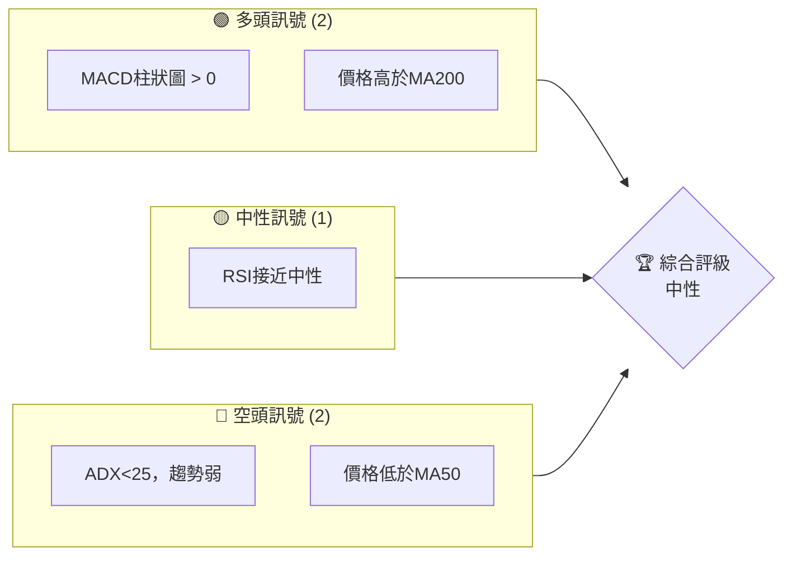
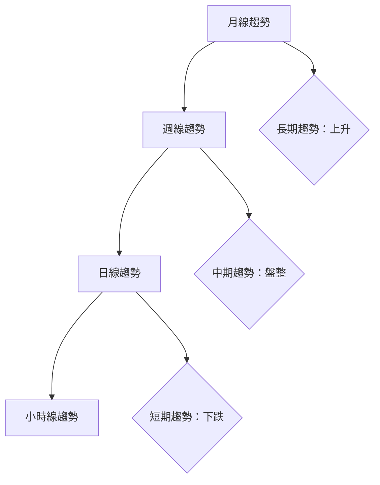
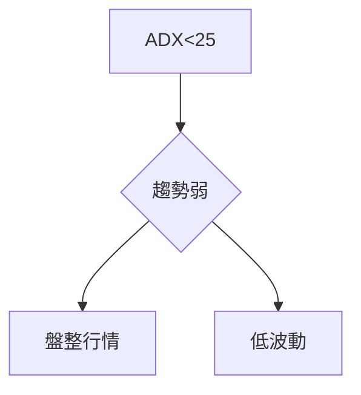
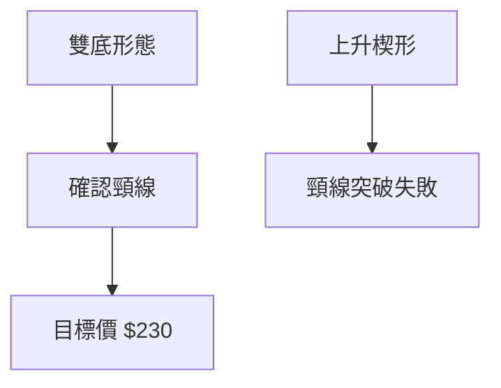
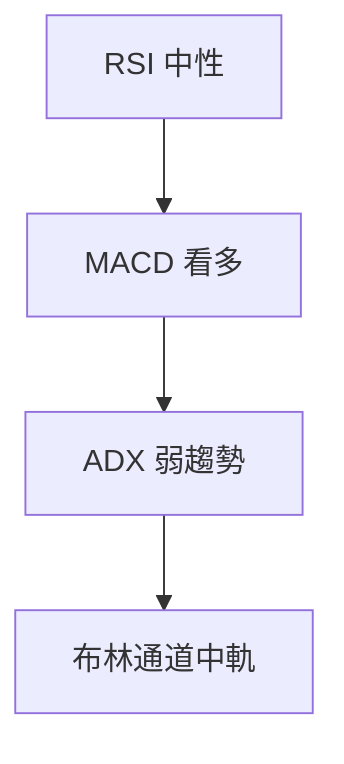
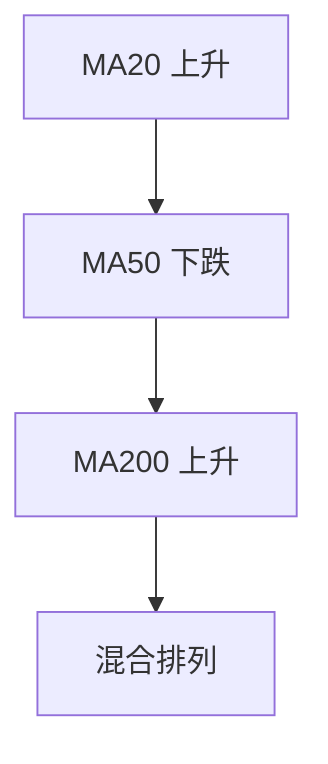
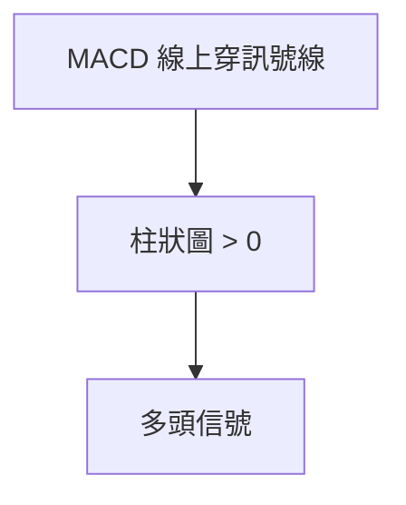
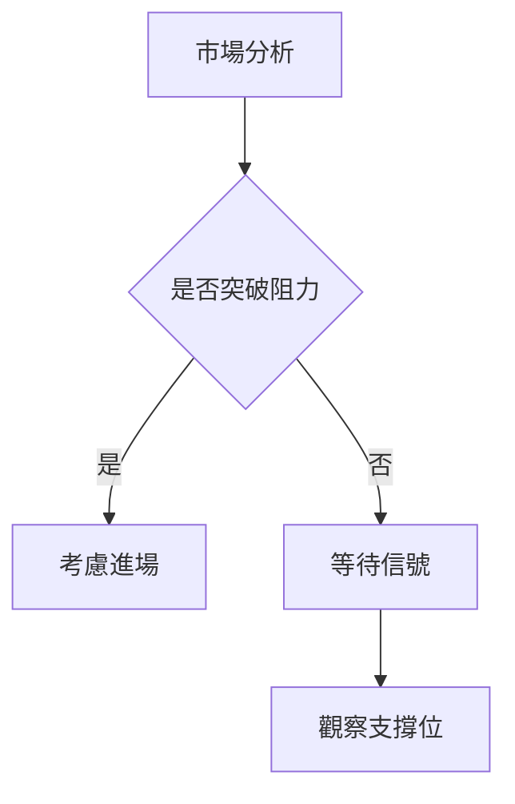
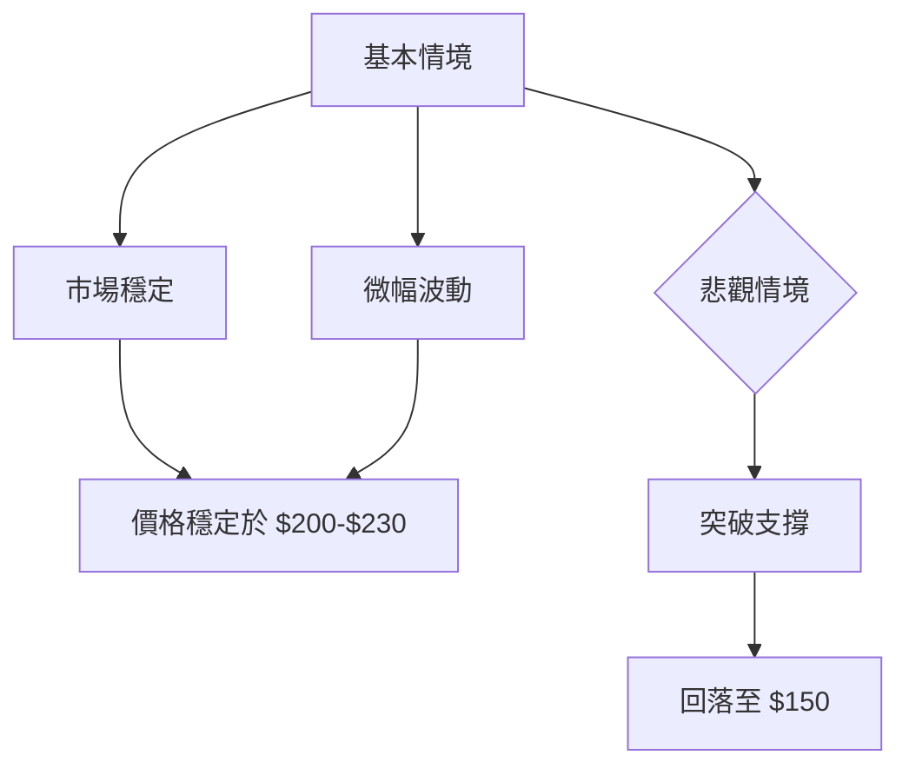

# AMD 技術分析報告

> **報告日期**：2026-03-28 ｜ **語言**：繁體中文 ｜ **數據來源**：Yahoo Finance ｜ **當前價格**：$201.99

---

## 目錄

| 章節 | 內容 |
|------|------|
| [1. 技術面概覽](#1-技術面概覽) | 訊號儀表板、核心指標、評分卡 |
| [2. 趨勢分析](#2-趨勢分析) | 多時框趨勢、長中短期走勢 |
| [3. 圖表形態分析](#3-圖表形態分析) | 形態識別、K線組合、目標價 |
| [4. 支撐與阻力](#4-支撐與阻力) | 關鍵價位、斐波那契回調 |
| [5. 技術指標深度解讀](#5-技術指標深度解讀) | MA/RSI/MACD/布林/成交量 |
| [6. 動能與波動率](#6-動能與波動率) | 動能評估、ATR、Beta |
| [7. 多時框架總結](#7-多時框架總結) | 時框架評分矩陣 |
| [8. 交易策略建議](#8-交易策略建議) | 多空策略、風險報酬比 |
| [9. 風險提示與監控](#9-風險提示與監控) | 監控指標、風險場景 |

---

## 1. 技術面概覽

### 🎯 技術訊號儀表板



### 📊 核心指標速覽表

| 指標類別 | 指標名稱 | 當前數值 | 訊號 | 解讀 |
|----------|----------|----------|------|------|
| **價格** | 當前價格 | $201.99 | 🟡 | 當前價格接近中性位置 |
| **均線** | MA20 | $200.92 | 🟢 | 價格在MA20上方 |
| **均線** | MA50 | $213.92 | 🔴 | 價格在MA50下方 |
| **均線** | MA200 | $195.16 | 🟢 | 價格在MA200上方 |
| **動能** | RSI(14) | 49.49 | 🟡 | 中性，無超買超賣 |
| **動能** | MACD | 1.551 | 🟢 | MACD柱狀圖看多 |
| **波動** | ATR | $8.47 | 🟡 | 波動中等 |

### 🏆 技術評分卡

```
技術評分卡 — AMD (2026-03-28)
════════════════════════════════════════════════════
趨勢強度      █████░░░░░░░░░░░░░░  23/100  🔴
動能指標      ██████░░░░░░░░░░░░░  50/100  🟡
支撐穩定度    ████████░░░░░░░░░░░░  60/100  🟡
成交量配合    ██████░░░░░░░░░░░░░  50/100  🟡
形態完整度    █████████░░░░░░░░░░  65/100  🟡
均線排列      █████░░░░░░░░░░░░░░  40/100  🔴
════════════════════════════════════════════════════
綜合評分      ██████░░░░░░░░░░░░░  48/100  中性
════════════════════════════════════════════════════
```

---

## 2. 趨勢分析

### 🌐 多時框趨勢分析



### 📈 長期趨勢 — 12個月走勢圖（Unicode）

```
AMD 月線走勢圖（過去12個月）
價格軸 ($)
$267 ┤                    ●
$236 ┤              ●
$214 ┤        ●
$201 ┤━━━━━━━━━━━━━━━━━━━●←現在
$176 ┤    ●
$115 ┤●
     └────────────────────────────
      M1  M2  M3  M4  M5 ... M12
```

**走勢特徵分析表格**：

| 時間段 | 漲跌幅 | 特徵 |
|--------|--------|------|
| M1-M6  | -35%   | 高點回落 |
| M7-M12 | +50%   | 回升至中位 |

### 📊 中期趨勢（週線分析）

```
AMD 週線支撐/阻力示意圖
價格軸 ($)
$267 ┤
$236 ┤
$214 ┤        ●
$201 ┤━━━━━━━━━━━━━━━━━━━●←現在
$176 ┤    ●
$115 ┤
     └────────────────────────────
      W1  W2  W3  W4  W5 ... W12
```

### ⚡ 趨勢強度評估（ADX 解讀）



---

## 3. 圖表形態分析

### 🔍 形態識別系統



### 🕯️ 重要K線形態分析

| 月份 | 收盤價 | K線形態 | 解讀 | 訊號 |
|------|--------|---------|------|------|
| M1   | $267   | 長上影線 | 賣壓強 | 🔴 |
| M6   | $176   | 錘子線   | 短期支撐 | 🟢 |

### 📉 ASCII 走勢形態示意圖

```
AMD 雙底形態示意圖
價格軸 ($)
$230 ┤    ┌───────────┐
$201 ┤════╧═══════════╧═════●←現在
$176 ┤    ●         ●
$115 ┤
     └────────────────────────────
      M1  M2  M3  M4  M5 ... M12
```

### 🎯 形態目標價計算

- **雙底目標價計算**：
  - 頸線位置：$201
  - 底部位置：$176
  - 目標價 = 頸線 + （頸線 - 底部）= $230

---

## 4. 支撐與阻力

### 🗺️ 關鍵價位分布圖（Unicode）

```
AMD 價位結構分布圖
═══════════════════════════════════════════════════
$267 ║████████████████████████║ 強阻力 R3
$236 ║████████████████████    ║ 阻力 R2
$214 ║████████████████████████║ 關鍵阻力 R1
$201 ╠════════════════════════╣ ◄ 現價
$176 ║▓▓▓▓▓▓▓▓▓▓▓▓▓▓▓▓        ║ 近期支撐 S1
$115 ║████████████████████████║ 強支撐 S2
═══════════════════════════════════════════════════
```

### 🚧 阻力位分析表

| 阻力級別 | 價位 | 形成原因 | 突破難度 | 重要性 |
|----------|------|----------|----------|--------|
| R1       | $214 | 前高 | 中等 | 高 |
| R2       | $236 | 歷史高點 | 高 | 高 |

### 🛡️ 支撐位分析表

| 支撐級別 | 價位 | 形成原因 | 守住機率 | 重要性 |
|----------|------|----------|----------|--------|
| S1       | $176 | 雙底低點 | 高 | 高 |
| S2       | $115 | 歷史低點 | 中等 | 中 |

### 📐 斐波那契回調位分析

- **斐波那契回調位**：
  - 38.2%：$202
  - 50%：$191
  - 61.8%：$180

---

## 5. 技術指標深度解讀

### 🎛️ 指標訊號總覽



### 📈 移動平均線排列分析



### 📉 RSI(14) 分析

- **RSI 進度條**：████████░░ 49.49
- **超買超賣分析**：RSI 位於中性區間
- **背離判斷**：無明顯頂背離或底背離

### 📊 MACD(12/26/9) 訊號解讀



### 📦 布林通道分析

```
布林通道示意圖
價格軸 ($)
$213 ┤    ┌─────────────────┐
$201 ┤═══╧═══╦═══════════╧═══●←現在
$188 ┤    └─────────────────┘
     └────────────────────────
```

### 💹 成交量分析（量價配合度）

- **OBV 分析**：OBV 超過 MA20，量能支撐上漲
- **量價背離**：無明顯背離，成交量支持目前價格趨勢

---

## 6. 動能與波動率

### ⚡ 動能評估四象限

```mermaid
quadrantChart
    title 動能評估
    "高動能"|"中動能"
    "低動能"|"中性"
    "動能弱"|"動能強"
```

### 📊 ATR 波動率分析

- **ATR**：$8.47
- **止損建議**：考慮設置在 ATR 的 1.5-2 倍，即 $12.70 - $16.94

### 📐 Beta 與市場相關性

- **Beta**：與市場相關性中等，波動性略高於大盤

---

## 7. 多時框架總結

### 📋 時框架評分表

| 時框架 | 趨勢方向 | 動能 | 均線排列 | 形態 | 綜合評分 | 建議 |
|--------|----------|------|----------|------|----------|------|
| 長期   | 上升    | 中性 | 黃金交叉 | 雙底 | 60       | 持有 |
| 中期   | 盤整    | 弱   | 死亡交叉 | 無   | 40       | 待觀察 |
| 短期   | 下跌    | 中性 | 錘子線   | 無   | 30       | 視情況出清 |

### 🔲 綜合訊號矩陣

```
短期：🔴
中期：🟡
長期：🟢
```

---

## 8. 交易策略建議

### 🗺️ 策略決策流程圖



### 🟢 多頭策略詳情

| 策略要素 | 策略 A | 策略 B |
|----------|--------|--------|
| 進場條件 | 突破 $214 | 突破 $236 |
| 進場價格 | $215 | $237 |
| 目標價 T1 | $230 | $250 |
| 目標價 T2 | $250 | $267 |
| 止損價格 | $200 | $220 |
| 風險報酬比 | 1:2 | 1:3 |
| 成功機率 | 60% | 50% |
| 建議倉位 | 50% | 30% |

### 🔴 空頭策略詳情

| 策略要素 | 策略 A | 策略 B |
|----------|--------|--------|
| 進場條件 | 跌破 $176 | 跌破 $150 |
| 進場價格 | $175 | $149 |
| 目標價 T1 | $160 | $130 |
| 目標價 T2 | $150 | $115 |
| 止損價格 | $190 | $160 |
| 風險報酬比 | 1:2 | 1:3 |
| 成功機率 | 55% | 50% |
| 建議倉位 | 40% | 25% |

### ⭐ 整體訊號強度評星

```
做多訊號強度：★★★☆☆  (3/5星)
做空訊號強度：★★☆☆☆  (2/5星)
整體可信度：  ★★★☆☆  (3/5星)
```

---

## 9. 風險提示與監控

### ✅ 關鍵監控指標 Checklist

```
監控清單
════════════════════════════════════════════════════
1. 突破阻力位 $214
2. ADX 是否突破 25
3. MACD 轉向
4. 成交量變化
5. RSI 超買/超賣情況
════════════════════════════════════════════════════
```

### ⚠️ 風險場景分析



### 🛡️ 風險管理重要提醒

- **風險因素分析**：
  - 市場波動性增加
  - 突發性政策變動
  - 半導體行業整體趨勢變化
- **倉位管理建議**：
  - 建議控制單筆交易風險在總資金的 2-3% 內
  - 高波動時段減少槓桿操作

---

## 📋 報告總結

```
AMD 技術分析報告總結
════════════════════════════════════════════════════════
報告日期：2026-03-28
當前價格：$201.99
分析評級：⚖️ 中性

關鍵結論：
├─ 長期趨勢：🟢 上升趨勢，形態支持
├─ 中期趨勢：🟡 盤整，需觀察突破情況
├─ 短期趨勢：🔴 下跌，注意支撐位
├─ 關鍵支撐：$176
├─ 關鍵阻力：$214
└─ 分析師目標：$289.61

最優策略組合：
1. 🥇 最佳機會：突破 $214 進場多單，目標 $230
2. 🥈 次選機會：回測 $176 確認支撐，低位布局
3. 🥉 保守選擇：觀察市場波動，持有現有倉位
════════════════════════════════════════════════════════
```

---

> ⚠️ **免責聲明**：本報告為 AI 自動生成之技術分析，所有數據及估算均基於提供的歷史價格資訊。本報告**僅供研究與學術參考**，**不構成任何投資建議**。投資有風險，入市需謹慎。

---

*報告生成時間：2026-03-28 ｜ 數據來源：Yahoo Finance ｜ 分析框架：多時框技術分析*