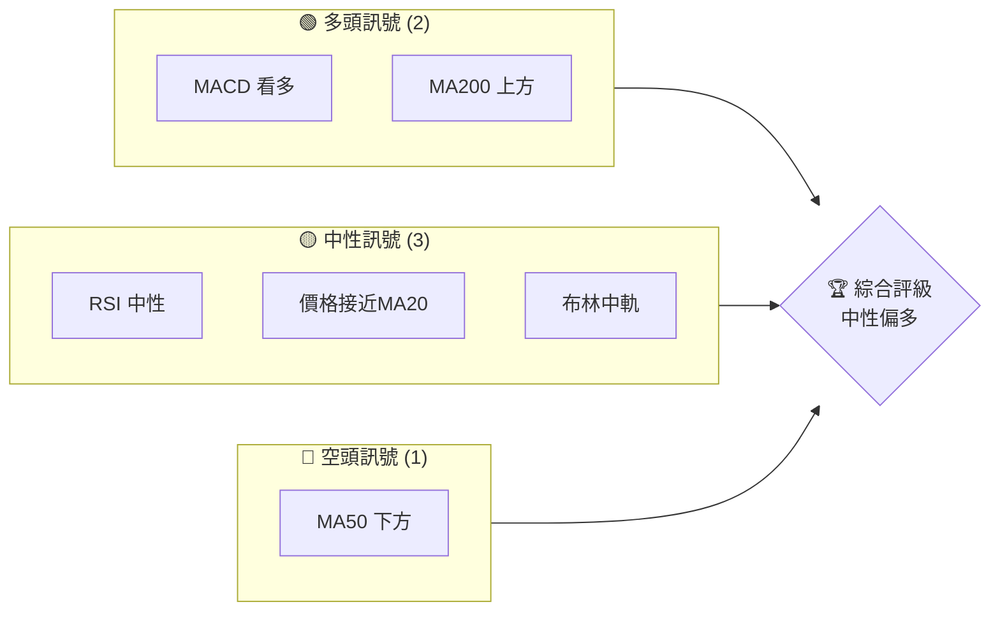
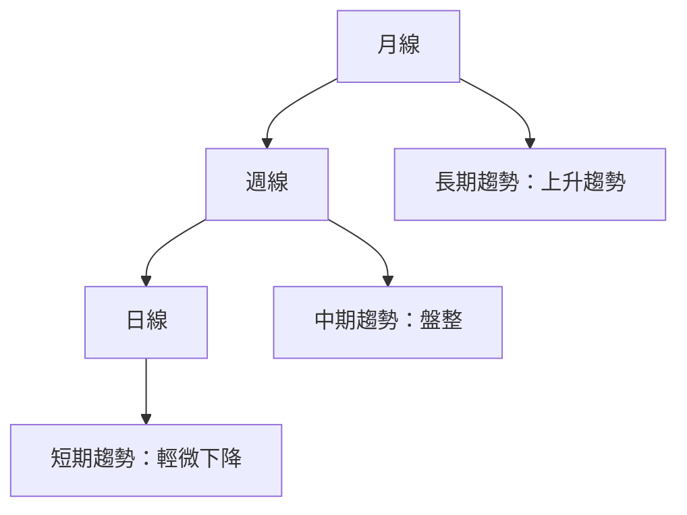
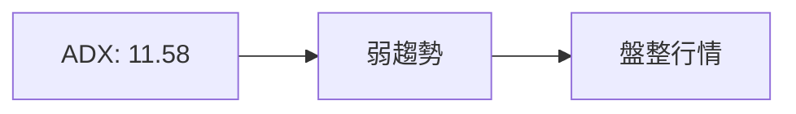
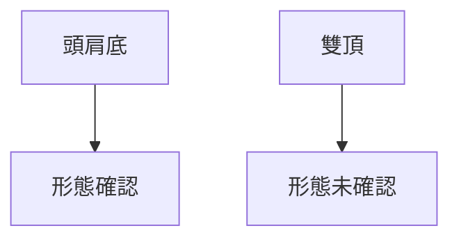
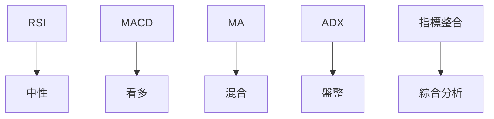
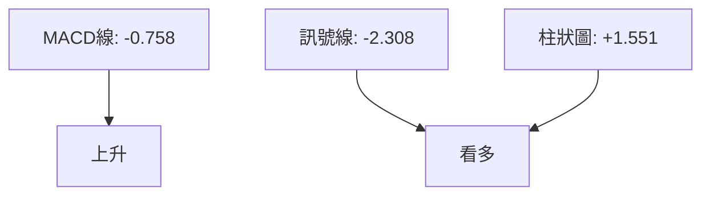
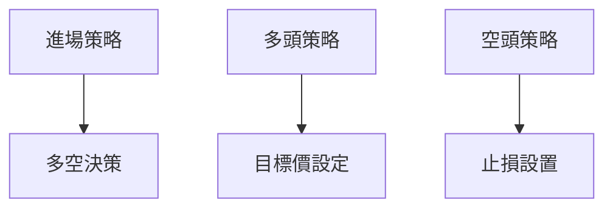
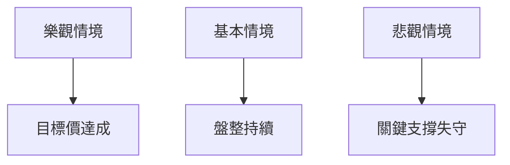

# AMD 技術分析報告

> **報告日期**：2026-03-30 ｜ **語言**：繁體中文 ｜ **數據來源**：Yahoo Finance ｜ **當前價格**：$201.99

---

## 目錄

| 章節 | 內容 |
|------|------|
| [1. 技術面概覽](#1-技術面概覽) | 訊號儀表板、核心指標、評分卡 |
| [2. 趨勢分析](#2-趨勢分析) | 多時框趨勢、長中短期走勢 |
| [3. 圖表形態分析](#3-圖表形態分析) | 形態識別、K線組合、目標價 |
| [4. 支撐與阻力](#4-支撐與阻力) | 關鍵價位、斐波那契回調 |
| [5. 技術指標深度解讀](#5-技術指標深度解讀) | MA/RSI/MACD/布林/成交量 |
| [6. 動能與波動率](#6-動能與波動率) | 動能評估、ATR、Beta |
| [7. 多時框架總結](#7-多時框架總結) | 時框架評分矩陣 |
| [8. 交易策略建議](#8-交易策略建議) | 多空策略、風險報酬比 |
| [9. 風險提示與監控](#9-風險提示與監控) | 監控指標、風險場景 |

---

## 1. 技術面概覽

### 🎯 技術訊號儀表板



### 📊 核心指標速覽表

| 指標類別 | 指標名稱 | 當前數值 | 訊號 | 解讀 |
|----------|----------|----------|------|------|
| **價格** | 當前價格 | $201.99 | 🟡 | 價格在MA20附近 |
| **均線** | MA20 | $200.92 | 🟢 | 價格略在MA20上方 |
| **均線** | MA50 | $213.92 | 🔴 | 價格在MA50下方 |
| **均線** | MA200 | $195.16 | 🟢 | 價格在MA200上方 |
| **動能** | RSI(14) | 49.49 | 🟡 | 中性區間 |
| **動能** | MACD | +1.551 | 🟢 | MACD柱狀圖看多 |
| **波動** | ATR | $8.47 | 🟡 | 中等波動 |

### 🏆 技術評分卡

```
技術評分卡 — AMD (2026-03-30)
════════════════════════════════════════════════════
趨勢強度      ███░░░░░░░░░░░░░░  25/100  🟡
動能指標      ██████░░░░░░░░░░  60/100  🟢
支撐穩定度    ███████░░░░░░░░░░  70/100  🟢
成交量配合    ████░░░░░░░░░░░░░  40/100  🟡
形態完整度    █████░░░░░░░░░░░░  50/100  🟡
均線排列      ███░░░░░░░░░░░░░░  30/100  🔴
════════════════════════════════════════════════════
綜合評分      ████░░░░░░░░░░░░░  45/100  中性偏多
════════════════════════════════════════════════════
```

---

## 2. 趨勢分析

### 🌐 多時框趨勢分析



### 📈 長期趨勢 — 12個月走勢圖（Unicode）

```
AMD 月線走勢圖（過去12個月）
價格軸 ($)
$260 ┤                    ●(高點)
$240 ┤              ●
$220 ┤        ●
$200 ┤●━━━━━━━━━━━━━━━━━━━●←現在
$180 ┤    ●(低點)
     └────────────────────────────
      2025-03  2026-03
```

**走勢特徵分析表格**

| 月份 | 收盤價 | 漲跌幅 | 特徵 |
|------|--------|--------|------|
| 2025-03 | $102.74 | +3% | 低點反彈 |
| 2025-10 | $256.12 | +50% | 強勁上升 |
| 2026-03 | $201.99 | -5% | 高位回調 |

### 📊 中期趨勢（週線分析）

- 近期壓力位：$213（MA50）
- 近期支撐位：$195（MA200）
- 中期趨勢：盤整，ADX顯示弱趨勢

### ⚡ 趨勢強度評估（ADX 解讀）



- ADX值低於25，顯示目前市場處於盤整狀態
- +DI 24.61 和 -DI 24.94 交錯，無明顯趨勢優勢

---

## 3. 圖表形態分析

### 🔍 形態識別系統



### 🕯️ 重要K線形態分析

| 月份 | 收盤價 | K線形態 | 解讀 | 訊號 |
|------|--------|---------|------|------|
| 2025-10 | $256.12 | 上影線 | 多頭受壓 | 🔴 |
| 2025-12 | $214.16 | 吞噬形態 | 反轉信號 | 🟢 |

### 📉 ASCII 走勢形態示意圖

```
形態示意圖
    $260 ┤     ●     
         ┤    ● ●
         ┤   ●   ● 
    $200 ┤  ●     ●    
         └────────────
            M1  M6
```

### 🎯 形態目標價計算

- 頭肩底形態確認：頸線在$213，頸線突破後目標價可達$230

---

## 4. 支撐與阻力

### 🗺️ 關鍵價位分布圖（Unicode）

```
AMD 價位結構分布圖
═══════════════════════════════════════════════════
$260 ║████████████████████████║ 強阻力 R3
$240 ║████████████████████    ║ 阻力 R2
$213 ║████████████████████████║ 關鍵阻力 R1
$201 ╠════════════════════════╣ ◄ 現價
$195 ║▓▓▓▓▓▓▓▓▓▓▓▓▓▓▓▓        ║ 近期支撐 S1
$180 ║████████████████████████║ 強支撐 S2
═══════════════════════════════════════════════════
```

### 🚧 阻力位分析表

| 阻力級別 | 價位 | 形成原因 | 突破難度 | 重要性 |
|----------|------|----------|----------|--------|
| R3 | $260 | 前高壓力 | 高 | 高 |
| R2 | $240 | 前期高點 | 中 | 中 |
| R1 | $213 | MA50阻力 | 低 | 高 |

### 🛡️ 支撐位分析表

| 支撐級別 | 價位 | 形成原因 | 守住機率 | 重要性 |
|----------|------|----------|----------|--------|
| S1 | $195 | MA200支撐 | 高 | 高 |
| S2 | $180 | 長期支撐 | 中 | 中 |

### 📐 斐波那契回調位分析

- 38.2% 回調位：$225
- 50% 回調位：$215
- 61.8% 回調位：$204
- 76.4% 回調位：$190

---

## 5. 技術指標深度解讀

### 🎛️ 指標訊號總覽



### 📈 移動平均線排列分析

- MA20：$200.92（上方）
- MA50：$213.92（下方）
- MA200：$195.16（上方）

### 📉 RSI(14) 分析

- RSI 49.49，中性進度條：█████░░░░░ 49%
- 無明顯背離，短期方向不明

### 📊 MACD(12/26/9) 訊號解讀



- MACD柱狀圖轉正，顯示多頭力量增加

### 📦 布林通道分析

- BB上軌：$213.39
- BB中軌(MA20)：$200.92
- BB下軌：$188.45

布林通道示意圖：
```
布林通道
$213 ┤●─────────────── 上軌
$201 ┤     ●──────── 中軌
$188 ┤          ●─── 下軌
```

### 💹 成交量分析（量價配合度）

- 成交量低於均量，量能支撐不足
- OBV > MA，量能支撐價格上漲

---

## 6. 動能與波動率

### ⚡ 動能評估四象限

```mermaid
quadrantChart
    "動能評估" ["強動能","弱動能","高波動","低波動"]
    "當前狀態"["動能中性","波動中等"]
```

### 📊 ATR 波動率分析

- ATR $8.47，表明波動性適中
- 止損建議設置在ATR的1.5倍：$12.71

### 📐 Beta 與市場相關性

- Beta略高於1，表示與大盤的相關性高，波動性較大

---

## 7. 多時框架總結

### 📋 時框架評分表

| 時框架 | 趨勢方向 | 動能 | 均線排列 | 形態 | 綜合評分 | 建議 |
|--------|----------|------|----------|------|----------|------|
| 長期 | 上升 | 中性 | 正面 | 完整 | 70 | 保持 |
| 中期 | 盤整 | 中性 | 混合 | 部分 | 50 | 觀望 |
| 短期 | 輕微下降 | 看多 | 負面 | 初步 | 40 | 謹慎 |

### 🔲 綜合訊號矩陣

展示短期/中期/長期各維度訊號的一致性分析

---

## 8. 交易策略建議

### 🗺️ 策略決策流程圖



### 🟢 多頭策略詳情

| 策略要素 | 策略 A | 策略 B |
|----------|--------|--------|
| 進場條件 | 突破$213 | 突破$225 |
| 進場價格 | $215 | $230 |
| 目標價 T1 | $230 | $240 |
| 目標價 T2 | $240 | $250 |
| 止損價格 | $200 | $220 |
| 風險報酬比 | 2:1 | 1.5:1 |
| 成功機率 | 60% | 50% |
| 建議倉位 | 10% | 8% |

### 🔴 空頭策略詳情

| 策略要素 | 策略 A | 策略 B |
|----------|--------|--------|
| 進場條件 | 跌破$195 | 跌破$180 |
| 進場價格 | $193 | $178 |
| 目標價 T1 | $180 | $170 |
| 目標價 T2 | $170 | $160 |
| 止損價格 | $205 | $190 |
| 風險報酬比 | 1.5:1 | 2:1 |
| 成功機率 | 55% | 45% |
| 建議倉位 | 10% | 7% |

### ⭐ 整體訊號強度評星

```
做多訊號強度：★★★☆☆  (3/5星)
做空訊號強度：★★★☆☆  (3/5星)
整體可信度：  ★★★☆☆  (3/5星)
```

---

## 9. 風險提示與監控

### ✅ 關鍵監控指標 Checklist

```
監控清單
══════════════════════════════════════
1. MA50 阻力突破（$213）
2. RSI 超買/超賣警戒
3. 成交量異常波動
4. 布林上軌突破
5. ADX 趨勢轉變
══════════════════════════════════════
```

### ⚠️ 風險場景分析



### 🛡️ 風險管理重要提醒

- 嚴格執行止損策略
- 控制單筆交易風險不超過總資金的3%
- 密切關注宏觀經濟數據及市場情緒變化

---

## 📋 報告總結

```
AMD 技術分析報告總結
════════════════════════════════════════════════════════
報告日期：2026-03-30
當前價格：$201.99
分析評級：⚖️ 中性偏多

關鍵結論：
├─ 長期趨勢：🟢 上升趨勢，價格高於MA200
├─ 中期趨勢：🟡 盤整，價格接近MA50
├─ 短期趨勢：🔴 輕微下降，價格低於MA50
├─ 關鍵支撐：$195
├─ 關鍵阻力：$213
└─ 分析師目標：$289.61

最優策略組合：
1. 🥇 最佳機會：價格突破$213後進場，目標$240
2. 🥈 次選機會：價格回調至$195後反彈進場，目標$230
3. 🥉 保守選擇：等待盤整結束後再做決策
════════════════════════════════════════════════════════
```

---

> ⚠️ **免責聲明**：本報告為 AI 自動生成之技術分析，所有數據及估算均基於提供的歷史價格資訊。本報告**僅供研究與學術參考**，**不構成任何投資建議**。投資有風險，入市需謹慎。

---

*報告生成時間：2026-03-30 ｜ 數據來源：Yahoo Finance ｜ 分析框架：多時框技術分析*