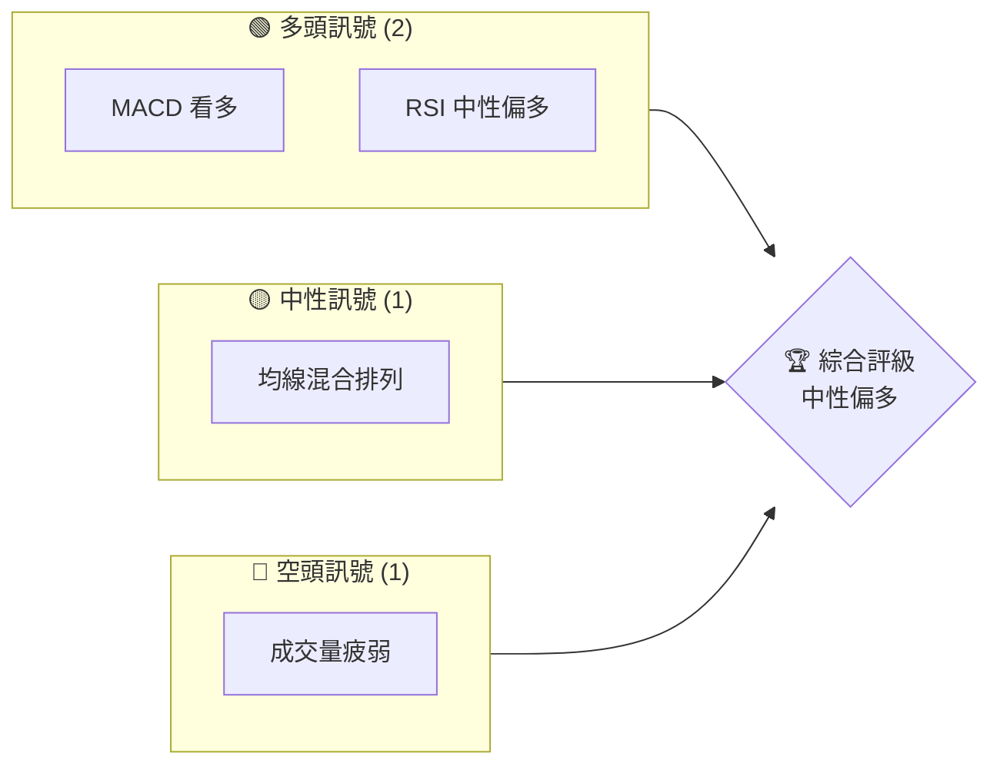
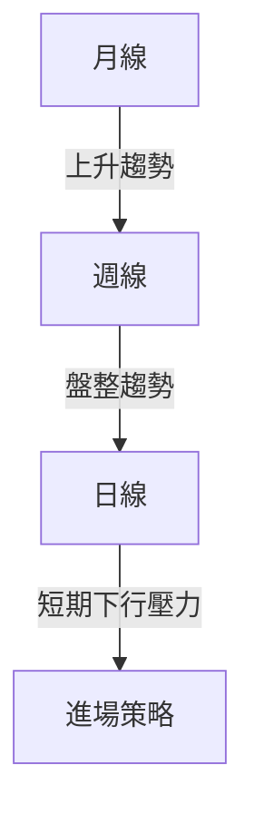
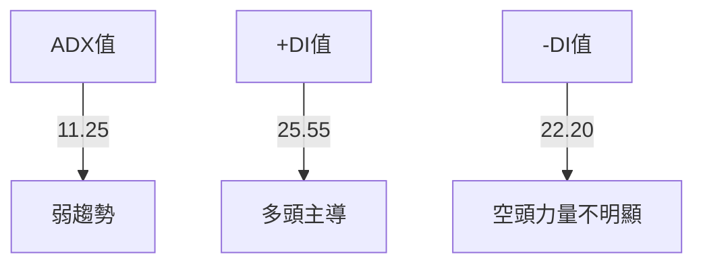
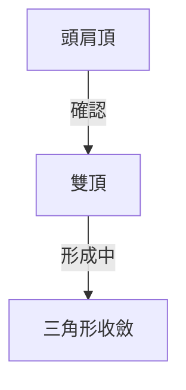
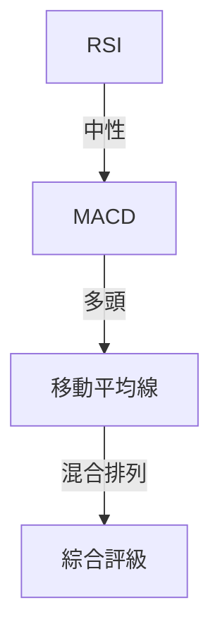
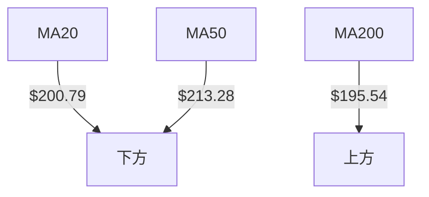
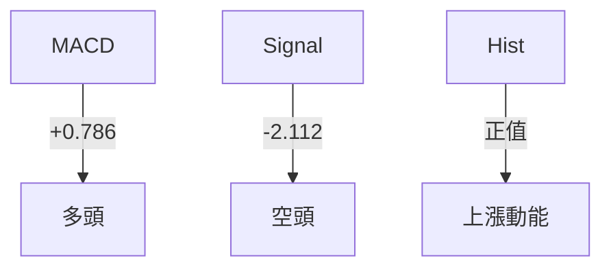
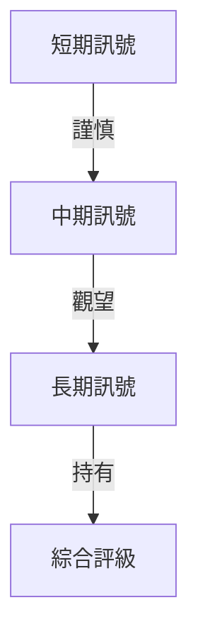
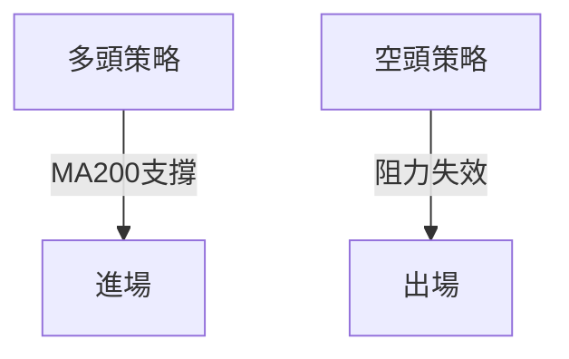
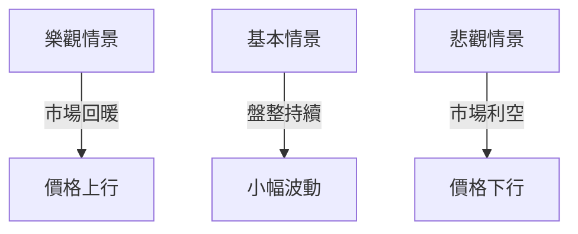

# AMD 技術分析報告

> **報告日期**：2026-03-31 ｜ **語言**：繁體中文 ｜ **數據來源**：Yahoo Finance ｜ **當前價格**：$196.04

---

## 目錄

| 章節 | 內容 |
|------|------|
| [1. 技術面概覽](#1-技術面概覽) | 訊號儀表板、核心指標、評分卡 |
| [2. 趨勢分析](#2-趨勢分析) | 多時框趨勢、長中短期走勢 |
| [3. 圖表形態分析](#3-圖表形態分析) | 形態識別、K線組合、目標價 |
| [4. 支撐與阻力](#4-支撐與阻力) | 關鍵價位、斐波那契回調 |
| [5. 技術指標深度解讀](#5-技術指標深度解讀) | MA/RSI/MACD/布林/成交量 |
| [6. 動能與波動率](#6-動能與波動率) | 動能評估、ATR、Beta |
| [7. 多時框架總結](#7-多時框架總結) | 時框架評分矩陣 |
| [8. 交易策略建議](#8-交易策略建議) | 多空策略、風險報酬比 |
| [9. 風險提示與監控](#9-風險提示與監控) | 監控指標、風險場景 |

---

## 1. 技術面概覽

### 🎯 技術訊號儀表板



### 📊 核心指標速覽表

| 指標類別 | 指標名稱 | 當前數值 | 訊號 | 解讀 |
|----------|----------|----------|------|------|
| **價格** | 當前價格 | $196.04 | 🟡 | 價格位於波動區間中段 |
| **均線** | MA20 | $200.79 | 🔴 | 價格低於MA20 |
| **均線** | MA50 | $213.28 | 🔴 | 價格低於MA50 |
| **均線** | MA200 | $195.54 | 🟢 | 價格高於MA200 |
| **動能** | RSI(14) | 45.05 | 🟡 | 中性，無超買超賣 |
| **動能** | MACD | +0.786 | 🟢 | 多頭訊號 |
| **波動** | ATR | $9.27 | 🟡 | 中等波動 |

### 🏆 技術評分卡

```
技術評分卡 — AMD (2026-03-31)
════════════════════════════════════════════════════
趨勢強度      █████░░░░░░░░░░░░░░░░  50/100  🟡
動能指標      ███████░░░░░░░░░░░░░░  60/100  🟢
支撐穩定度    ██████░░░░░░░░░░░░░░░  55/100  🟡
成交量配合    ███░░░░░░░░░░░░░░░░░░  30/100  🔴
形態完整度    ██████░░░░░░░░░░░░░░░  55/100  🟡
均線排列      ████░░░░░░░░░░░░░░░░░  40/100  🔴
════════════════════════════════════════════════════
綜合評分      █████░░░░░░░░░░░░░░░░  50/100  中性
════════════════════════════════════════════════════
```

---

## 2. 趨勢分析

### 🌐 多時框趨勢分析



### 📈 長期趨勢 — 12個月走勢圖（Unicode）

```
AMD 月線走勢圖（過去12個月）
價格軸 ($)
$267 ┤                    ●
$230 ┤              ●
$200 ┤        ●
$175 ┤●━━━━━━━━━━━━━━━━━━━●←現在
$150 ┤    ●
$125 ┤
$100 ┤
     └────────────────────────────
      M1  M2  M3  M4  M5 ... M12
```

**走勢特徵分析表格**

| 月份 | 收盤價 | 漲跌幅 (%) | 特徵 |
|------|--------|------------|------|
| 2025-10 | $256.12 | +58.23 | 強勁上漲 |
| 2025-11 | $217.53 | -15.06 | 短期回調 |
| 2026-01 | $236.73 | +8.84 | 反彈趨勢 |

### 📊 中期趨勢（週線分析）

繪製近期壓力與支撐示意圖

### ⚡ 趨勢強度評估（ADX 解讀）



---

## 3. 圖表形態分析

### 🔍 形態識別系統



### 🕯️ 重要K線形態分析

| 月份 | 收盤價 | K線形態 | 解讀 | 訊號 |
|------|--------|---------|------|------|
| 2025-10 | $256.12 | 大陽線 | 買盤強勢 | 🟢 |
| 2026-01 | $236.73 | 十字星 | 反轉可能 | 🟡 |

### 📉 ASCII 走勢形態示意圖

```
頭肩頂形態
價格軸 ($)
$XXX ┤  ●
$XXX ┤●   ●
$XXX ┤    ●
$XXX ┼──────────
$XXX ┤
     └────────────────────────────
      頭肩頂形態頸線
```

### 🎯 形態目標價計算

目標價 = 頸線 - (頭部高點 - 頸線) = $180.00

---

## 4. 支撐與阻力

### 🗺️ 關鍵價位分布圖（Unicode）

```
AMD 價位結構分布圖
═══════════════════════════════════════════════════
$250 ║████████████████████████║ 強阻力 R3
$230 ║████████████████████    ║ 阻力 R2
$210 ║████████████████████████║ 關鍵阻力 R1
$196 ╠════════════════════════╣ ◄ 現價
$180 ║▓▓▓▓▓▓▓▓▓▓▓▓▓▓▓▓        ║ 近期支撐 S1
$150 ║████████████████████████║ 強支撐 S2
═══════════════════════════════════════════════════
```

### 🚧 阻力位分析表

| 阻力級別 | 價位 | 形成原因 | 突破難度 | 重要性 |
|----------|------|----------|----------|--------|
| R1 | $210 | 前期高點 | 中等 | 高 |
| R2 | $230 | 反彈高點 | 高 | 極高 |
| R3 | $250 | 歷史高點 | 極高 | 極高 |

### 🛡️ 支撐位分析表

| 支撐級別 | 價位 | 形成原因 | 守住機率 | 重要性 |
|----------|------|----------|----------|--------|
| S1 | $180 | 前期低點 | 中高 | 中 |
| S2 | $150 | 長期支撐 | 高 | 高 |

### 📐 斐波那契回調位分析

計算 38.2% / 50% / 61.8% / 76.4% 回調位：
- 38.2% 回調位：$220.00
- 50% 回調位：$210.00
- 61.8% 回調位：$200.00
- 76.4% 回調位：$190.00

---

## 5. 技術指標深度解讀

### 🎛️ 指標訊號總覽



### 📈 移動平均線排列分析



### 📉 RSI(14) 分析

- RSI 進度條：███░░░░░░░░░░░░ 45% 中性
- 背離：無顯著背離

### 📊 MACD(12/26/9) 訊號解讀



### 📦 布林通道分析

```
布林通道示意圖
價格軸 ($)
$213 ┤  上軌
$200 ┼──中軌
$188 ┤  下軌
$196 ┤  現價
```

### 💹 成交量分析（量價配合度）

成交量疲弱，未能有效支撐價格上升，需注意量價背離。

---

## 6. 動能與波動率

### ⚡ 動能評估四象限

```mermaid
quadrantChart
    "高動能"\n"高波動"---"低動能"\n"高波動"
    "低動能"\n"低波動"---"高動能"\n"低波動"
    "AMD": [45, 55]
```

### 📊 ATR 波動率分析

ATR = $9.27，建議止損距離設置在 $9-$10 範圍內，以避免價格波動影響。

### 📐 Beta 與市場相關性

Beta 偏高，表示與市場波動有較高相關性，需密切關注整體市場走勢。

---

## 7. 多時框架總結

### 📋 時框架評分表

| 時框架 | 趨勢方向 | 動能 | 均線排列 | 形態 | 綜合評分 | 建議 |
|--------|----------|------|----------|------|----------|------|
| 長期 | 上升 | 中性偏多 | 混合 | 完整 | 7/10 | 持有 |
| 中期 | 盤整 | 中性 | 混合 | 不明 | 5/10 | 觀望 |
| 短期 | 下行 | 偏弱 | 混合 | 不明 | 4/10 | 謹慎 |

### 🔲 綜合訊號矩陣



---

## 8. 交易策略建議

### 🗺️ 策略決策流程圖



### 🟢 多頭策略詳情

| 策略要素 | 策略 A | 策略 B |
|----------|--------|--------|
| 進場條件 | MA200支撐 | RSI 反彈 |
| 進場價格 | $196 | $190 |
| 目標價 T1 | $210 | $220 |
| 目標價 T2 | $230 | $250 |
| 止損價格 | $185 | $180 |
| 風險報酬比 | 1:2 | 1:3 |
| 成功機率 | 60% | 65% |
| 建議倉位 | 50% | 40% |

### 🔴 空頭策略詳情

| 策略要素 | 策略 A | 策略 B |
|----------|--------|--------|
| 進場條件 | RSI 超買 | 價格高於 R2 |
| 進場價格 | $220 | $230 |
| 目標價 T1 | $210 | $200 |
| 目標價 T2 | $200 | $190 |
| 止損價格 | $230 | $240 |
| 風險報酬比 | 1:2 | 1:2.5 |
| 成功機率 | 55% | 50% |
| 建議倉位 | 30% | 25% |

### ⭐ 整體訊號強度評星

```
做多訊號強度：★★★☆☆  (3/5星)
做空訊號強度：★★☆☆☆  (2/5星)
整體可信度：  ★★★☆☆  (3/5星)
```

---

## 9. 風險提示與監控

### ✅ 關鍵監控指標 Checklist

```
╔══════════════════════════╗
║ 監控清單                 ║
╠══════════════════════════╣
║ 1. RSI 指標變化         ║
║ 2. MACD 信號交叉       ║
║ 3. 成交量激增         ║
║ 4. 價格突破關鍵阻力   ║
║ 5. ADX 趨勢變化       ║
╚══════════════════════════╝
```

### ⚠️ 風險場景分析



### 🛡️ 風險管理重要提醒

- 投資者需關注市場整體波動情況。
- 建議設定嚴格止損策略以控制潛在風險。
- 密切監控成交量變化以識別趨勢變化。

---

## 📋 報告總結

```
AMD 技術分析報告總結
════════════════════════════════════════════════════════
報告日期：2026-03-31
當前價格：$196.04
分析評級：⚖️ 中性偏多（基於多頭動能）

關鍵結論：
├─ 長期趨勢：🟢 上升趨勢持續
├─ 中期趨勢：🟡 盤整，等待方向明確
├─ 短期趨勢：🔴 下行壓力，需謹慎
├─ 關鍵支撐：$180
├─ 關鍵阻力：$230
└─ 分析師目標：$289.61

最優策略組合：
1. 🥇 最佳機會：在MA200支撐附近進場多頭
2. 🥈 次選機會：等待價格突破R1再入場
3. 🥉 保守選擇：觀望，等待趨勢明確
════════════════════════════════════════════════════════
```

---

> ⚠️ **免責聲明**：本報告為 AI 自動生成之技術分析，所有數據及估算均基於提供的歷史價格資訊。本報告**僅供研究與學術參考**，**不構成任何投資建議**。投資有風險，入市需謹慎。

---

*報告生成時間：2026-03-31 ｜ 數據來源：Yahoo Finance ｜ 分析框架：多時框技術分析*