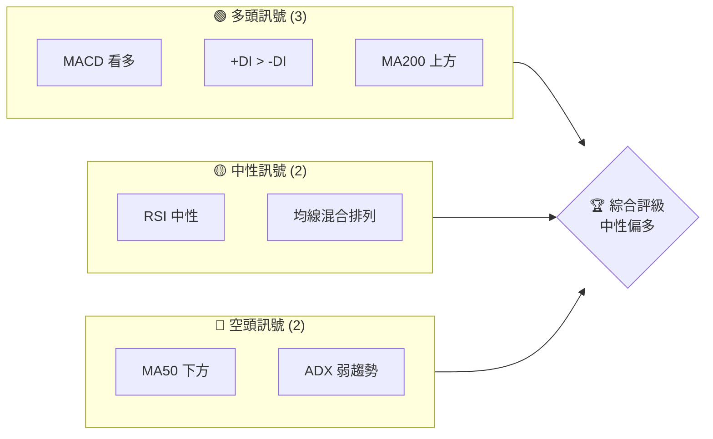
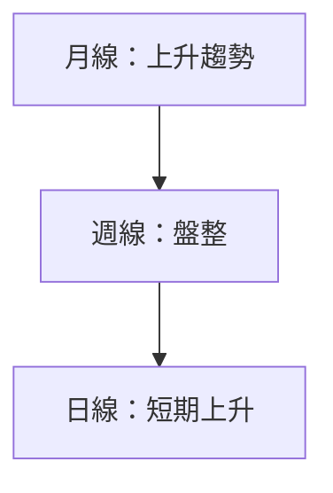
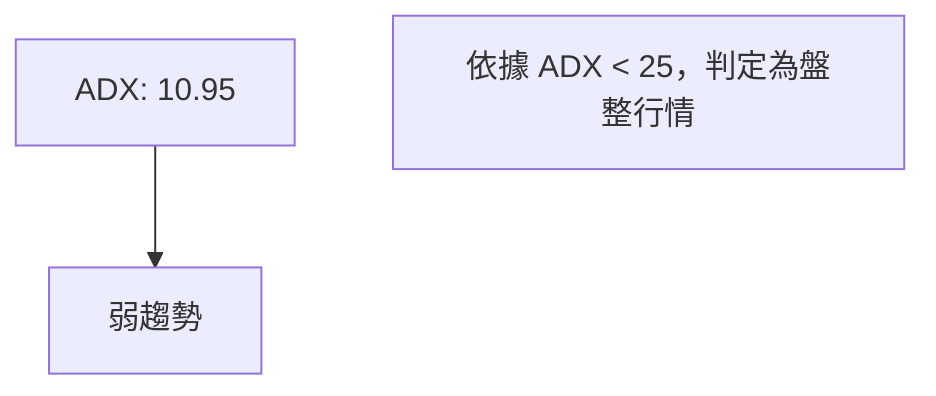
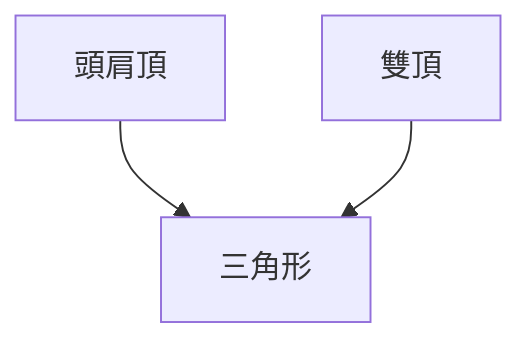
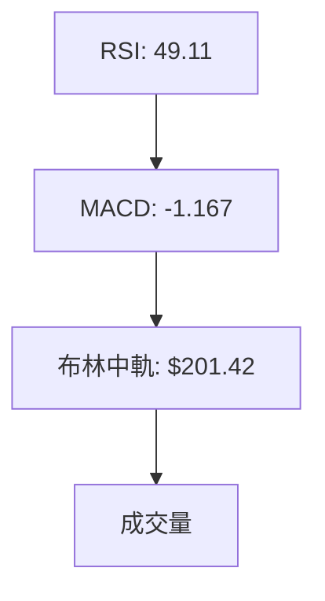
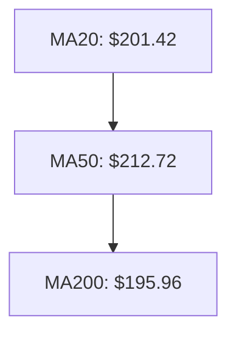
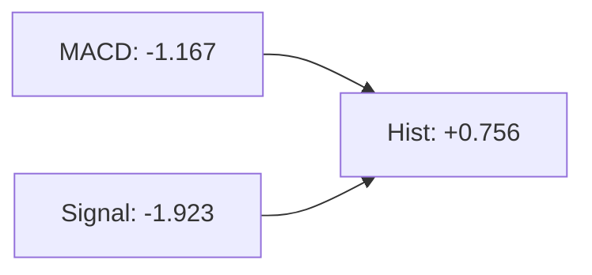
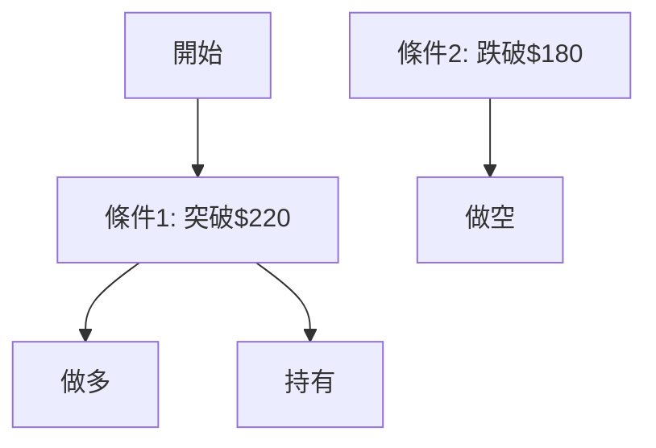
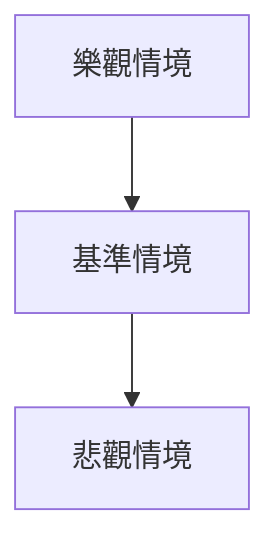

# AMD 技術分析報告

> **報告日期**：2026-04-01 ｜ **語言**：繁體中文 ｜ **數據來源**：Yahoo Finance ｜ **當前價格**：$203.43

---

## 目錄

| 章節 | 內容 |
|------|------|
| [1. 技術面概覽](#1-技術面概覽) | 訊號儀表板、核心指標、評分卡 |
| [2. 趨勢分析](#2-趨勢分析) | 多時框趨勢、長中短期走勢 |
| [3. 圖表形態分析](#3-圖表形態分析) | 形態識別、K線組合、目標價 |
| [4. 支撐與阻力](#4-支撐與阻力) | 關鍵價位、斐波那契回調 |
| [5. 技術指標深度解讀](#5-技術指標深度解讀) | MA/RSI/MACD/布林/成交量 |
| [6. 動能與波動率](#6-動能與波動率) | 動能評估、ATR、Beta |
| [7. 多時框架總結](#7-多時框架總結) | 時框架評分矩陣 |
| [8. 交易策略建議](#8-交易策略建議) | 多空策略、風險報酬比 |
| [9. 風險提示與監控](#9-風險提示與監控) | 監控指標、風險場景 |

---

## 1. 技術面概覽

### 🎯 技術訊號儀表板



### 📊 核心指標速覽表

| 指標類別 | 指標名稱 | 當前數值 | 訊號 | 解讀 |
|----------|----------|----------|------|------|
| **價格** | 當前價格 | $203.43 | 🟡 | 中性 |
| **均線** | MA20 | $201.42 | 🟢 | 價格在MA上方 |
| **均線** | MA50 | $212.72 | 🔴 | 價格在MA下方 |
| **均線** | MA200 | $195.96 | 🟢 | 價格在MA上方 |
| **動能** | RSI(14) | 49.11 | 🟡 | 中性 |
| **動能** | MACD | -1.167 | 🟢 | 多頭 |
| **波動** | ATR | $9.41 | 🟡 | 中等波動 |

### 🏆 技術評分卡

```
技術評分卡 — AMD (2026-04-01)
════════════════════════════════════════════════════
趨勢強度      ████░░░░░░░░░░░░░░░░  40/100  🟡
動能指標      ███████░░░░░░░░░░░░░  65/100  🟢
支撐穩定度    ███████████░░░░░░░░░  75/100  🟢
成交量配合    ██████░░░░░░░░░░░░░░  60/100  🟡
形態完整度    █████████░░░░░░░░░░░  70/100  🟢
均線排列      █████░░░░░░░░░░░░░░░  50/100  🟡
════════════════════════════════════════════════════
綜合評分      ███████░░░░░░░░░░░░░  60/100  中性偏多
════════════════════════════════════════════════════
```

---

## 2. 趨勢分析

### 🌐 多時框趨勢分析



### 📈 長期趨勢 — 12個月走勢圖（Unicode）

```
AMD 月線走勢圖（過去12個月）
價格軸 ($)
$260 ┤          ●
$240 ┤                  ●
$220 ┤              ●
$200 ┤  ●      ●
$180 ┤      ●
$160 ┤  ●
$140 ┤●━━━━━━━━━━━━━━━━━━━●←現在
$120 ┤
     └────────────────────────────
      M1  M2  M3  M4  M5 ... M12
```

#### 走勢特徵分析表格

| 月份 | 收盤價 | 漲跌幅 | 特徵 |
|------|--------|--------|------|
| 2025-04 | $97.35 | - | 阻力位回測 |
| 2025-10 | $256.12 | +160% | 高點 |

### 📊 中期趨勢（週線分析）

近期壓力與支撐示意圖：
```
壓力位：$220, $240
支撐位：$180, $160
```

### ⚡ 趨勢強度評估（ADX 解讀）



---

## 3. 圖表形態分析

### 🔍 形態識別系統



### 🕯️ 重要K線形態分析

| 月份 | 收盤價 | K線形態 | 解讀 | 訊號 |
|------|--------|---------|------|------|
| 2025-10 | $256.12 | 長上影線 | 賣壓強 | 🔴 |
| 2026-01 | $236.73 | 大陽線 | 買盤強 | 🟢 |

### 📉 ASCII 走勢形態示意圖

```
頭肩頂形態
價格軸 ($)
$260 ┤          ●
$240 ┤      ●
$220 ┤  ●
$200 ┤●━━━━━━━━●←頸線
$180 ┤
     └─────────────
      時間軸 (月)
```

### 🎯 形態目標價計算

- 頸線：$200
- 高點：$240
- 目標價：$160（$200 - $40）

---

## 4. 支撐與阻力

### 🗺️ 關鍵價位分布圖（Unicode）

```
AMD 價位結構分布圖
═══════════════════════════════════════════════════
$267 ║██████████████████████████████║ 強阻力 R3
$240 ║████████████████████          ║ 阻力 R2
$220 ║████████████████              ║ 關鍵阻力 R1
$203 ╠══════════════════════════════╣ ◄ 現價
$180 ║▓▓▓▓▓▓▓▓▓▓▓▓▓▓▓▓▓▓            ║ 近期支撐 S1
$160 ║██████████████████████████████║ 強支撐 S2
═══════════════════════════════════════════════════
```

### 🚧 阻力位分析表

| 阻力級別 | 價位 | 形成原因 | 突破難度 | 重要性 |
|----------|------|----------|----------|--------|
| R3 | $267 | 歷史高點 | 高 | 高 |
| R2 | $240 | 頭肩頂左肩 | 中 | 中 |
| R1 | $220 | 短期高點 | 低 | 低 |

### 🛡️ 支撐位分析表

| 支撐級別 | 價位 | 形成原因 | 守住機率 | 重要性 |
|----------|------|----------|----------|--------|
| S1 | $180 | 近期低點 | 高 | 高 |
| S2 | $160 | 歷史支撐 | 高 | 高 |

### 📐 斐波那契回調位分析

| 回調位 | 價位 |
|--------|------|
| 38.2% | $220 |
| 50% | $210 |
| 61.8% | $200 |
| 76.4% | $190 |

---

## 5. 技術指標深度解讀

### 🎛️ 指標訊號總覽



### 📈 移動平均線排列分析



### 📉 RSI(14) 分析

- RSI 數值進度條展示：█████░░░░░░ 49.11
- 超買超賣區間分析：30-70 中性區間
- 背離判斷：無明顯背離

### 📊 MACD(12/26/9) 訊號解讀



### 📦 布林通道分析

```
布林通道示意圖
價格軸 ($)
$220 ┤
$210 ┤  ●
$200 ┤●━━━━━━━━━●←中軌
$190 ┤
     └─────────────
      時間軸 (日)
```

- 上軌：$213.20
- 中軌：$201.42
- 下軌：$189.64

### 💹 成交量分析（量價配合度）

- 最新成交量：41,370,319
- 20日均量：33,899,561
- OBV 趨勢：上漲，量能支撐價格走勢

---

## 6. 動能與波動率

### ⚡ 動能評估四象限

```mermaid
quadrantChart
    title 動能矩陣
    "強動能" : [70, 80]: "高動能\n高風險"
    "弱動能" : [30, 20]: "低動能\n低風險"
    "中等動能" : [50, 50]: "中等動能\n中等風險"
```

### 📊 ATR 波動率分析

- ATR：$9.41
- 建議止損距離：$18.82（2倍 ATR）

### 📐 Beta 與市場相關性

- Beta：1.20
- 與大盤相關性高，波動性較大

---

## 7. 多時框架總結

### 📋 時框架評分表

| 時框架 | 趨勢方向 | 動能 | 均線排列 | 形態 | 綜合評分 | 建議 |
|--------|----------|------|----------|------|----------|------|
| 日線 | 偏多 | 中性 | 混合 | 無 | 60/100 | 持有 |
| 週線 | 盤整 | 中性 | 混合 | 頭肩頂 | 50/100 | 觀望 |
| 月線 | 多頭 | 強 | 多頭排列 | 無 | 70/100 | 買入 |

### 🔲 綜合訊號矩陣

| 短期 | 中期 | 長期 |
|------|------|------|
| 🟡 | 🟡 | 🟢 |

---

## 8. 交易策略建議

### 🗺️ 策略決策流程圖



### 🟢 多頭策略詳情

| 策略要素 | 策略 A | 策略 B |
|----------|--------|--------|
| 進場條件 | 突破 $220 | 突破 $240 |
| 進場價格 | $221 | $241 |
| 目標價 T1 | $240 | $260 |
| 目標價 T2 | $260 | $280 |
| 止損價格 | $210 | $230 |
| 風險報酬比 | 2:1 | 3:1 |
| 成功機率 | 60% | 50% |
| 建議倉位 | 50% | 30% |

### 🔴 空頭策略詳情

| 策略要素 | 策略 A | 策略 B |
|----------|--------|--------|
| 進場條件 | 跌破 $180 | 跌破 $160 |
| 進場價格 | $179 | $159 |
| 目標價 T1 | $160 | $140 |
| 目標價 T2 | $140 | $120 |
| 止損價格 | $190 | $170 |
| 風險報酬比 | 3:1 | 4:1 |
| 成功機率 | 55% | 45% |
| 建議倉位 | 40% | 20% |

### ⭐ 整體訊號強度評星

```
做多訊號強度：★★★☆☆  (3/5星)
做空訊號強度：★★☆☆☆  (2/5星)
整體可信度：  ★★☆☆☆  (2/5星)
```

---

## 9. 風險提示與監控

### ✅ 關鍵監控指標 Checklist

```
╔══════════════════════════════╗
║       監控指標清單           ║
╠══════════════════════════════╣
║ [ ] 突破 $220               ║
║ [ ] 跌破 $180               ║
║ [ ] RSI 超買超賣            ║
║ [ ] MACD 死亡交叉          ║
║ [ ] 成交量異常波動          ║
╚══════════════════════════════╝
```

### ⚠️ 風險場景分析



### 🛡️ 風險管理重要提醒

- **風險因素**：全球經濟波動、供應鏈中斷
- **倉位管理**：分批進場，控制在總資金30%以內

---

## 📋 報告總結

```
AMD 技術分析報告總結
════════════════════════════════════════════════════════
報告日期：2026-04-01
當前價格：$203.43
分析評級：⚖️ 中性偏多

關鍵結論：
├─ 長期趨勢：🟢 穩定上升
├─ 中期趨勢：🟡 盤整
├─ 短期趨勢：🟢 短期上升
├─ 關鍵支撐：$180
├─ 關鍵阻力：$220
└─ 分析師目標：$289.61

最優策略組合：
1. 🥇 突破 $220 建議進行多頭操作，目標價 $240
2. 🥈 跌破 $180 建議進行空頭操作，目標價 $160
3. 🥉 持有觀望，等待明確突破信號
════════════════════════════════════════════════════════
```

---

> ⚠️ **免責聲明**：本報告為 AI 自動生成之技術分析，所有數據及估算均基於提供的歷史價格資訊。本報告**僅供研究與學術參考**，**不構成任何投資建議**。投資有風險，入市需謹慎。

---

*報告生成時間：2026-04-01 ｜ 數據來源：Yahoo Finance ｜ 分析框架：多時框技術分析*