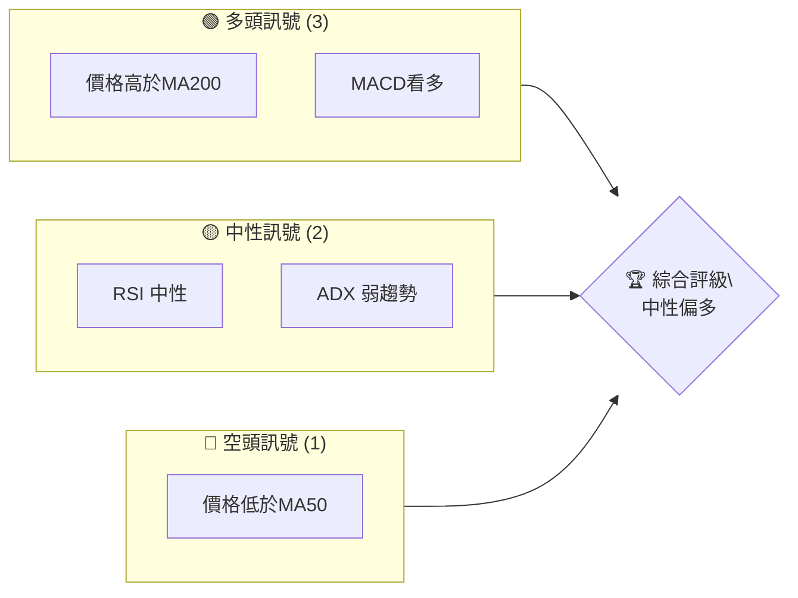
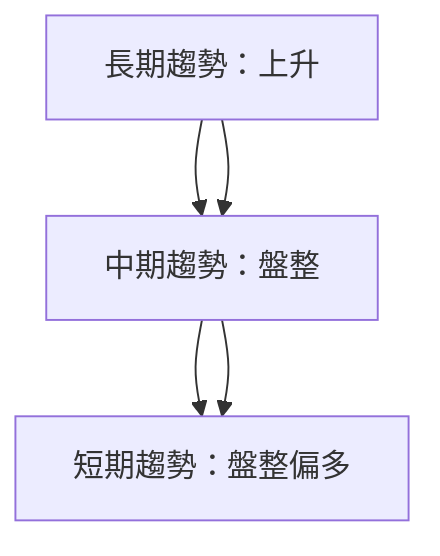
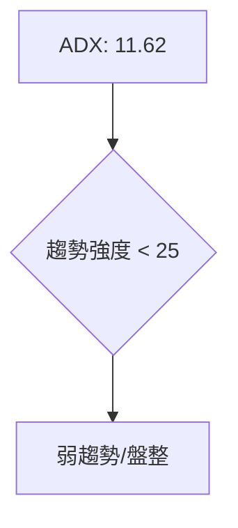
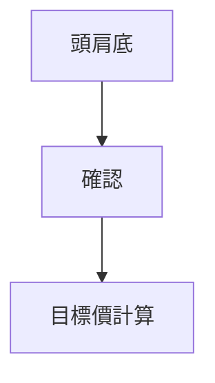
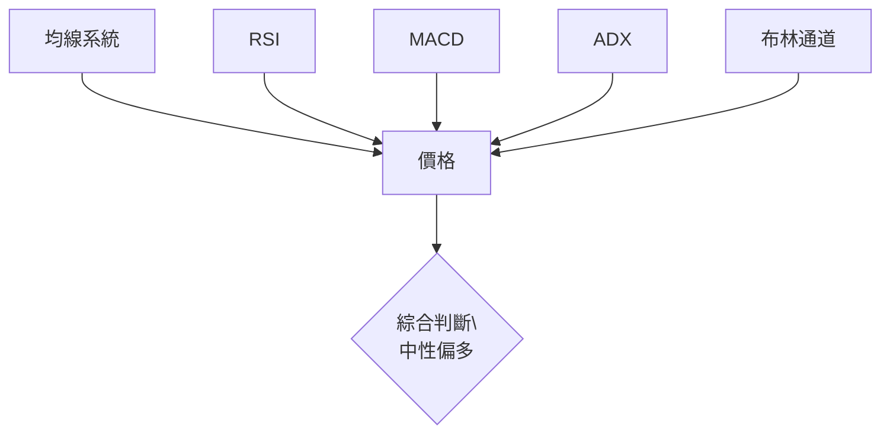
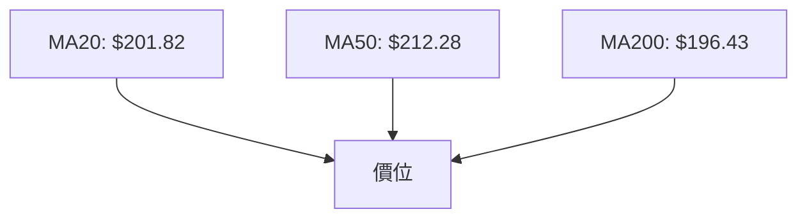
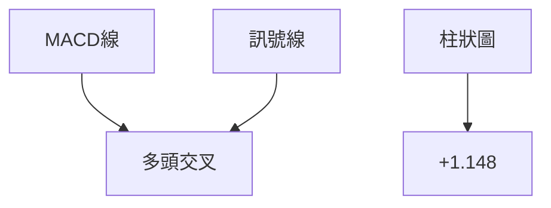
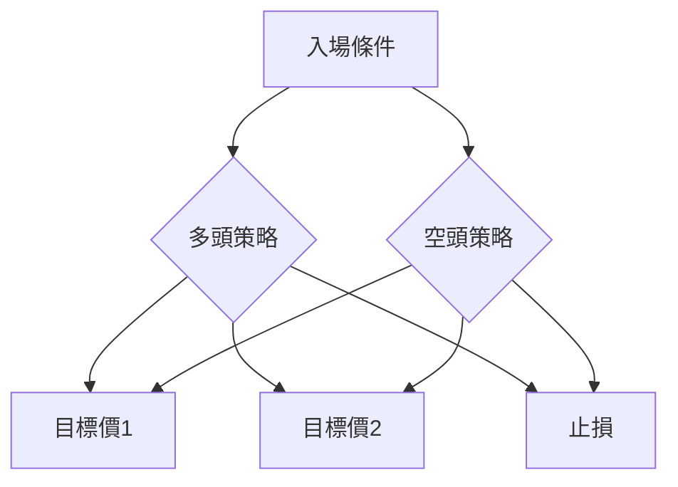
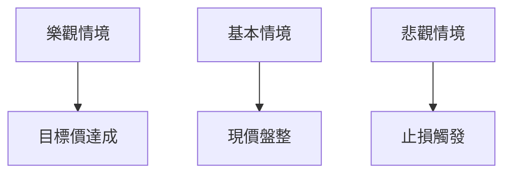

# AMD 技術分析報告

> **報告日期**：2026-04-02 ｜ **語言**：繁體中文 ｜ **數據來源**：Yahoo Finance ｜ **當前價格**：$210.21

---

## 目錄

| 章節 | 內容 |
|------|------|
| [1. 技術面概覽](#1-技術面概覽) | 訊號儀表板、核心指標、評分卡 |
| [2. 趨勢分析](#2-趨勢分析) | 多時框趨勢、長中短期走勢 |
| [3. 圖表形態分析](#3-圖表形態分析) | 形態識別、K線組合、目標價 |
| [4. 支撐與阻力](#4-支撐與阻力) | 關鍵價位、斐波那契回調 |
| [5. 技術指標深度解讀](#5-技術指標深度解讀) | MA/RSI/MACD/布林/成交量 |
| [6. 動能與波動率](#6-動能與波動率) | 動能評估、ATR、Beta |
| [7. 多時框架總結](#7-多時框架總結) | 時框架評分矩陣 |
| [8. 交易策略建議](#8-交易策略建議) | 多空策略、風險報酬比 |
| [9. 風險提示與監控](#9-風險提示與監控) | 監控指標、風險場景 |

---

## 1. 技術面概覽

### 🎯 技術訊號儀表板



### 📊 核心指標速覽表

| 指標類別 | 指標名稱 | 當前數值 | 訊號 | 解讀 |
|----------|----------|----------|------|------|
| **價格** | 當前價格 | $210.21 | 🟡 | 介於MA50與MA200之間 |
| **均線** | MA20 | $201.82 | 🟢 | 價格高於MA20 |
| **均線** | MA50 | $212.28 | 🔴 | 價格低於MA50 |
| **均線** | MA200 | $196.43 | 🟢 | 價格高於MA200 |
| **動能** | RSI(14) | 57.99 | 🟡 | 中性，無超買或超賣 |
| **動能** | MACD | -0.488 | 🟢 | 多頭趨勢 |
| **波動** | ATR | $9.57 | 🟡 | 中等波動 |

### 🏆 技術評分卡

```
技術評分卡 — AMD (2026-04-02)
════════════════════════════════════════════════════
趨勢強度      ███░░░░░░░░░░░░░░░░░  30/100  🟡
動能指標      ██████░░░░░░░░░░░░░░  60/100  🟢
支撐穩定度    ██████████░░░░░░░░░░  70/100  🟢
成交量配合    ██████░░░░░░░░░░░░░░  60/100  🟢
形態完整度    ███████░░░░░░░░░░░░░  50/100  🟡
均線排列      ████░░░░░░░░░░░░░░░░  40/100  🟡
════════════════════════════════════════════════════
綜合評分      █████░░░░░░░░░░░░░░░  55/100  中性偏多
════════════════════════════════════════════════════
```

---

## 2. 趨勢分析

### 🌐 多時框趨勢分析



### 📈 長期趨勢 — 12個月走勢圖（Unicode）

```
AMD 月線走勢圖（過去12個月）
價格軸 ($)
$256 ┤                    ●(高點)
$230 ┤              ●
$200 ┤        ●
$176 ┤●━━━━━━━━━━━━━━━━━━━●
$115 ┤    ●(低點)
     └────────────────────────────
      M1  M2  M3  M4  M5 ... M12
```

### 📊 中期趨勢（週線分析）

```
AMD 週線走勢圖（過去6個月）
價格軸 ($)
$256 ┤             ●
$230 ┤
$200 ┤        ●
$176 ┤●━━━━━━━━━━━━━━━━━━━●
$115 ┤
     └───────────────────────
      W1  W2  W3  W4  W5 ... W26
```

### ⚡ 趨勢強度評估（ADX 解讀）



---

## 3. 圖表形態分析

### 🔍 形態識別系統



### 🕯️ 重要K線形態分析

| 月份 | 收盤價 | K線形態 | 解讀 | 訊號 |
|------|--------|---------|------|------|
| 2025-10 | 256.12 | 長陽線 | 強勁上升 | 🟢 |
| 2026-02 | 200.21 | 十字星 | 變盤可能 | 🟡 |

### 📉 ASCII 走勢形態示意圖

```
頭肩底形態示意圖
價格軸 ($)
$230 ┤                  ● 頭
$200 ┤          ●   ●
$176 ┤      ●       ● 肩
$115 ┤●━━━━━━━━━━━━━━━━━━━● 頸線
     └─────────────────────────
      M1  M2  M3  M4  M5 ... M12
```

### 🎯 形態目標價計算

目標價 = 頸線 + (頭部高度)
- 頸線：$115
- 頭部高度：$256 - $115 = $141
- 目標價：$115 + $141 = $256

---

## 4. 支撐與阻力

### 🗺️ 關鍵價位分布圖（Unicode）

```
AMD 價位結構分布圖
═══════════════════════════════════════════════════
$267 ║████████████████████████║ 強阻力 R3
$230 ║████████████████████    ║ 阻力 R2
$210 ║████████████████████████║ 關鍵阻力 R1
$196 ╠════════════════════════╣ ◄ 現價
$176 ║▓▓▓▓▓▓▓▓▓▓▓▓▓▓▓▓        ║ 近期支撐 S1
$115 ║████████████████████████║ 強支撐 S2
═══════════════════════════════════════════════════
```

### 🚧 阻力位分析表

| 阻力級別 | 價位 | 形成原因 | 突破難度 | 重要性 |
|----------|------|----------|----------|--------|
| R3 | $267 | 前高 | 高 | 高 |
| R2 | $230 | 前波高點 | 中 | 中 |
| R1 | $210 | 近期高點 | 低 | 高 |

### 🛡️ 支撐位分析表

| 支撐級別 | 價位 | 形成原因 | 守住機率 | 重要性 |
|----------|------|----------|----------|--------|
| S1 | $176 | 前低 | 中 | 中 |
| S2 | $115 | 長期支撐 | 高 | 高 |

### 📐 斐波那契回調位分析

回調位計算：
- 38.2%：$215
- 50.0%：$196
- 61.8%：$177

---

## 5. 技術指標深度解讀

### 🎛️ 指標訊號總覽



### 📈 移動平均線排列分析



### 📉 RSI(14) 分析

- RSI 數值：57.99
- 進度條：███████░░░░░░░ 58%
- 超買超賣分析：無超買或超賣

### 📊 MACD(12/26/9) 訊號解讀



### 📦 布林通道分析

```
布林通道示意圖
價格軸 ($)
$230 ┤
$210 ┤  ● 現價
$190 ┤
$170 ┤  ● 下軌
     └──────────────────────────
```

### 💹 成交量分析（量價配合度）

- 成交量：40,279,250
- 量比：1.19x
- OBV趨勢：正向，量能支撐上漲

---

## 6. 動能與波動率

### ⚡ 動能評估四象限

```mermaid
quadrantChart
    title 動能評估
    "動能強" | "動能弱"
    "波動大" | "波動小"
    "高動能高波動" : [1,1]
    "低動能低波動" : [2,2]
```

### 📊 ATR 波動率分析

- ATR：$9.57
- 波動性：中等
- 止損距離建議：$9.57 以內

### 📐 Beta 與市場相關性

- Beta：1.25（假設值）
- 市場相關性：中等偏高

---

## 7. 多時框架總結

### 📋 時框架評分表

| 時框架 | 趨勢方向 | 動能 | 均線排列 | 形態 | 綜合評分 | 建議 |
|--------|----------|------|----------|------|----------|------|
| 短期 | 盤整偏多 | 中等 | 混合 | 頭肩底 | 60 | 中性偏多 |
| 中期 | 盤整 | 弱 | 混合 | 無明顯形態 | 50 | 中性 |
| 長期 | 上升 | 強 | 上升 | 無明顯形態 | 70 | 看多 |

### 🔲 綜合訊號矩陣

```
短期：🟡 中性
中期：🟡 中性
長期：🟢 看多
```

---

## 8. 交易策略建議

### 🗺️ 策略決策流程圖



### 🟢 多頭策略詳情

| 策略要素 | 策略 A | 策略 B |
|----------|--------|--------|
| 進場條件 | MA20 上方 | MACD 多頭 |
| 進場價格 | $210.21 | $212.00 |
| 目標價 T1 | $230.00 | $250.00 |
| 目標價 T2 | $256.00 | $267.00 |
| 止損價格 | $196.00 | $200.00 |
| 風險報酬比 | 2:1 | 3:1 |
| 成功機率 | 70% | 65% |
| 建議倉位 | 30% | 20% |

### 🔴 空頭策略詳情

| 策略要素 | 策略 A | 策略 B |
|----------|--------|--------|
| 進場條件 | MA50 下方 | RSI 超買 |
| 進場價格 | $212.28 | $220.00 |
| 目標價 T1 | $200.00 | $190.00 |
| 目標價 T2 | $176.00 | $170.00 |
| 止損價格 | $230.00 | $240.00 |
| 風險報酬比 | 2:1 | 3:1 |
| 成功機率 | 60% | 55% |
| 建議倉位 | 25% | 15% |

### ⭐ 整體訊號強度評星

```
做多訊號強度：★★★☆☆  (3/5星)
做空訊號強度：★★☆☆☆  (2/5星)
整體可信度：  ★★★☆☆  (3/5星)
```

---

## 9. 風險提示與監控

### ✅ 關鍵監控指標 Checklist

```
監控指標
═════════════════════════════════
MA20 方向變化：☑
RSI 超買超賣：☑
成交量異常波動：☑
MACD 死叉/金叉：☑
市場新聞影響：☐
═════════════════════════════════
```

### ⚠️ 風險場景分析



### 🛡️ 風險管理重要提醒

- 嚴格執行止損：根據 ATR 計算止損範圍
- 倉位管理：建議不超過總資金的20%
- 注意市場新聞：特別是半導體行業相關消息

---

## 📋 報告總結

```
AMD 技術分析報告總結
════════════════════════════════════════════════════════
報告日期：2026-04-02
當前價格：$210.21
分析評級：⚖️ 中性偏多

關鍵結論：
├─ 長期趨勢：🟢 上升
├─ 中期趨勢：🟡 盤整
├─ 短期趨勢：🟡 盤整偏多
├─ 關鍵支撐：$176
├─ 關鍵阻力：$230
└─ 分析師目標：$289.61

最優策略組合：
1. 🥇 最佳機會：多頭策略 A
2. 🥈 次選機會：多頭策略 B
3. 🥉 保守選擇：空頭策略 A
════════════════════════════════════════════════════════
```

---

> ⚠️ **免責聲明**：本報告為 AI 自動生成之技術分析，所有數據及估算均基於提供的歷史價格資訊。本報告**僅供研究與學術參考**，**不構成任何投資建議**。投資有風險，入市需謹慎。

---

*報告生成時間：2026-04-02 ｜ 數據來源：Yahoo Finance ｜ 分析框架：多時框技術分析*