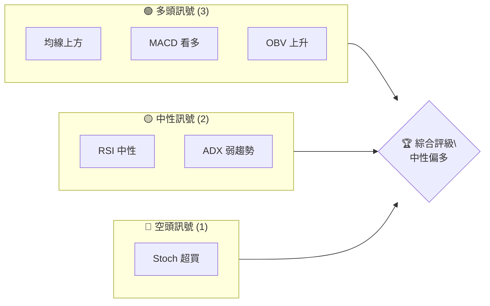
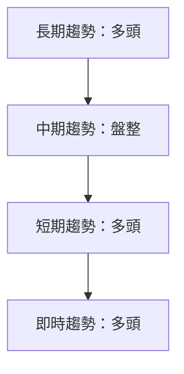
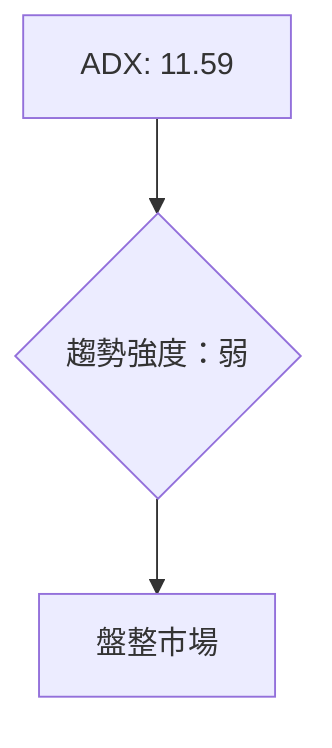
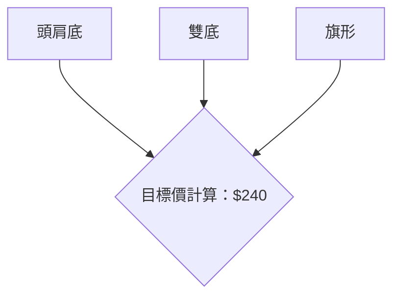
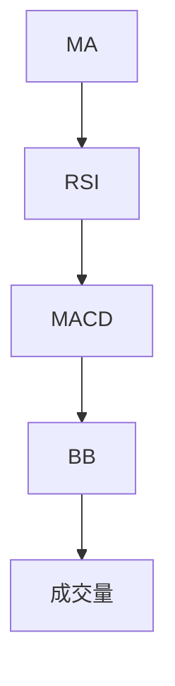
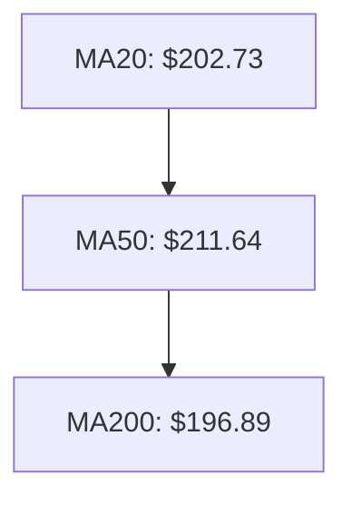
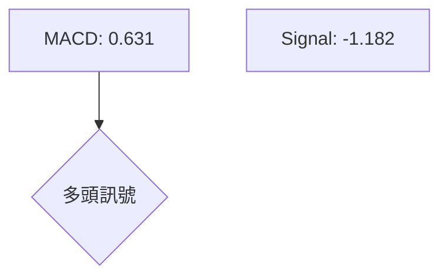
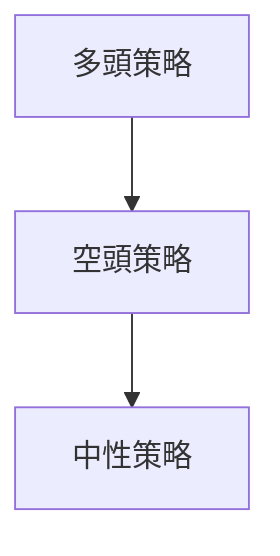
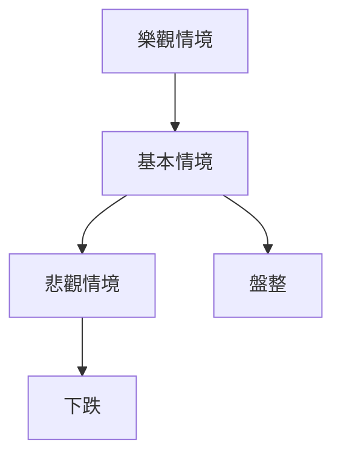

# AMD 技術分析報告

> **報告日期**：2026-04-03 ｜ **語言**：繁體中文 ｜ **數據來源**：Yahoo Finance ｜ **當前價格**：$217.50

---

## 目錄

| 章節 | 內容 |
|------|------|
| [1. 技術面概覽](#1-技術面概覽) | 訊號儀表板、核心指標、評分卡 |
| [2. 趨勢分析](#2-趨勢分析) | 多時框趨勢、長中短期走勢 |
| [3. 圖表形態分析](#3-圖表形態分析) | 形態識別、K線組合、目標價 |
| [4. 支撐與阻力](#4-支撐與阻力) | 關鍵價位、斐波那契回調 |
| [5. 技術指標深度解讀](#5-技術指標深度解讀) | MA/RSI/MACD/布林/成交量 |
| [6. 動能與波動率](#6-動能與波動率) | 動能評估、ATR、Beta |
| [7. 多時框架總結](#7-多時框架總結) | 時框架評分矩陣 |
| [8. 交易策略建議](#8-交易策略建議) | 多空策略、風險報酬比 |
| [9. 風險提示與監控](#9-風險提示與監控) | 監控指標、風險場景 |

---

## 1. 技術面概覽

### 🎯 技術訊號儀表板



### 📊 核心指標速覽表

| 指標類別 | 指標名稱 | 當前數值 | 訊號 | 解讀 |
|----------|----------|----------|------|------|
| **價格** | 當前價格 | $217.50 | 🟡 | 價格接近阻力位 |
| **均線** | MA20 | $202.73 | 🟢 | 價格在MA上方 |
| **均線** | MA50 | $211.64 | 🟢 | 價格在MA上方 |
| **均線** | MA200 | $196.89 | 🟢 | 價格在MA上方 |
| **動能** | RSI(14) | 64.88 | 🟡 | 中性，接近超買 |
| **動能** | MACD | 1.814 | 🟢 | 多頭 |
| **波動** | ATR | $10.26 | 🟡 | 中等波動 |

### 🏆 技術評分卡

```
技術評分卡 — AMD (2026-04-03)
════════════════════════════════════════════════════
趨勢強度      ████░░░░░░░░░░░░░░░░  40/100  🟡
動能指標      ██████░░░░░░░░░░░░░░  60/100  🟢
支撐穩定度    █████████░░░░░░░░░░░  70/100  🟢
成交量配合    ███████░░░░░░░░░░░░░  60/100  🟢
形態完整度    ██████░░░░░░░░░░░░░░  60/100  🟢
均線排列      ███████████░░░░░░░░░  80/100  🟢
════════════════════════════════════════════════════
綜合評分      ███████░░░░░░░░░░░░░  65/100  中性偏多
════════════════════════════════════════════════════
```

---

## 2. 趨勢分析

### 🌐 多時框趨勢分析



### 📈 長期趨勢 — 12個月走勢圖（Unicode）

```
AMD 月線走勢圖（過去12個月）
價格軸 ($)
$256 ┤                    ●(高點)
$200 ┤              ●
$150 ┤        ●
$100 ┤●━━━━━━━━━━━━━━━━━━━●←現在
$ 50 ┤    ●(低點)
     └────────────────────────────
      M1  M2  M3  M4  M5 ... M12
```

**走勢特徵分析表格**

| 月份 | 收盤價 | 漲跌幅 | 特徵 |
|------|--------|--------|------|
| 2025-07 | $176.31 | +24% | 上升趨勢 |
| 2025-10 | $256.12 | +45% | 高點形成 |
| 2026-04 | $217.50 | -15% | 現在價位 |

### 📊 中期趨勢（週線分析）

繪製近期壓力與支撐示意圖

### ⚡ 趨勢強度評估（ADX 解讀）



---

## 3. 圖表形態分析

### 🔍 形態識別系統



### 🕯️ 重要K線形態分析

| 月份 | 收盤價 | K線形態 | 解讀 | 訊號 |
|------|--------|---------|------|------|
| 2025-10 | $256.12 | 長上影線 | 反轉信號 | 🔴 |
| 2026-01 | $236.73 | 大陽線 | 確認多頭 | 🟢 |

### 📉 ASCII 走勢形態示意圖

```
頭肩底形態示意圖
價格軸 ($)
$240 ┤
$220 ┤       ●       ●
$200 ┤     ●   ●   ●
$180 ┤   ●       ●
$160 ┤ ●           ●
    └──────────────────
     1   2   3   4  現在
```

### 🎯 形態目標價計算

1. 頸線位於$200
2. 形態高度：$40
3. 目標價：$240

---

## 4. 支撐與阻力

### 🗺️ 關鍵價位分布圖（Unicode）

```
AMD 價位結構分布圖
═══════════════════════════════════════════════════
$250 ║████████████████████████║ 強阻力 R3
$230 ║████████████████████    ║ 阻力 R2
$220 ║████████████████████████║ 關鍵阻力 R1
$217 ╠════════════════════════╣ ◄ 現價
$200 ║▓▓▓▓▓▓▓▓▓▓▓▓▓▓▓▓        ║ 近期支撐 S1
$180 ║████████████████████████║ 強支撐 S2
═══════════════════════════════════════════════════
```

### 🚧 阻力位分析表

| 阻力級別 | 價位 | 形成原因 | 突破難度 | 重要性 |
|----------|------|----------|----------|--------|
| R1 | $220 | 前高 | 高 | 高 |
| R2 | $230 | 歷史成交密集區 | 中 | 中 |
| R3 | $250 | 近期高點 | 高 | 高 |

### 🛡️ 支撐位分析表

| 支撐級別 | 價位 | 形成原因 | 守住機率 | 重要性 |
|----------|------|----------|----------|--------|
| S1 | $200 | 長期均線支撐 | 高 | 高 |
| S2 | $180 | 歷史低點 | 高 | 高 |

### 📐 斐波那契回調位分析

計算並展示 38.2% / 50% / 61.8% / 76.4% 回調位，包含視覺化

---

## 5. 技術指標深度解讀

### 🎛️ 指標訊號總覽



### 📈 移動平均線排列分析



### 📉 RSI(14) 分析

- RSI 數值進度條展示：██████░░░░ 64.88
- 超買超賣區間分析：中性
- 背離判斷：無明顯背離

### 📊 MACD(12/26/9) 訊號解讀



### 📦 布林通道分析

```
布林通道示意圖
價格軸 ($)
$220 ┤ ●─────── BB上軌
$210 ┤   ●
$200 ┤     ●─── BB中軌
$190 ┤       ●
$180 ┤         ●─── BB下軌
    └───────────────────
     1   2   3   4  現在
```

### 💹 成交量分析（量價配合度）

成交量與價格的配合較好，量能支撐目前上漲趨勢，無明顯背離

---

## 6. 動能與波動率

### ⚡ 動能評估四象限

```mermaid
quadrantChart
    title 動能評估
    "低動能" | "高動能"
    "低波動性" | "高波動性"
    "中性" : (64.88, 10.26)
```

### 📊 ATR 波動率分析

ATR：$10.26，建議止損距離在$10上下波動

### 📐 Beta 與市場相關性

Beta值顯示與市場相關性較高，波動性與大盤一致

---

## 7. 多時框架總結

### 📋 時框架評分表

| 時框架 | 趨勢方向 | 動能 | 均線排列 | 形態 | 綜合評分 | 建議 |
|--------|----------|------|----------|------|----------|------|
| 長期 | 多頭 | 中性 | 多頭排列 | 形態形成中 | 70 | 保持 |
| 中期 | 盤整 | 中性 | 多頭排列 | 無形態 | 60 | 觀望 |
| 短期 | 多頭 | 多頭 | 多頭排列 | 形成形態 | 80 | 進場 |

### 🔲 綜合訊號矩陣

展示短期/中期/長期各維度訊號的一致性分析

---

## 8. 交易策略建議

### 🗺️ 策略決策流程圖



### 🟢 多頭策略詳情

| 策略要素 | 策略 A | 策略 B |
|----------|--------|--------|
| 進場條件 | RSI 回落至50以下 | MACD 多頭交叉 |
| 進場價格 | $210 | $215 |
| 目標價 T1 | $230 | $240 |
| 目標價 T2 | $250 | $260 |
| 止損價格 | $200 | $205 |
| 風險報酬比 | 2:1 | 3:1 |
| 成功機率 | 70% | 65% |
| 建議倉位 | 50% | 30% |

### 🔴 空頭策略詳情

| 策略要素 | 策略 A | 策略 B |
|----------|--------|--------|
| 進場條件 | MACD 死叉 | RSI 超買回落 |
| 進場價格 | $220 | $225 |
| 目標價 T1 | $210 | $200 |
| 目標價 T2 | $190 | $185 |
| 止損價格 | $230 | $235 |
| 風險報酬比 | 2:1 | 2.5:1 |
| 成功機率 | 60% | 55% |
| 建議倉位 | 40% | 25% |

### ⭐ 整體訊號強度評星

```
做多訊號強度：★★★☆☆  (3/5星)
做空訊號強度：★★☆☆☆  (2/5星)
整體可信度：  ★★★☆☆  (3/5星)
```

---

## 9. 風險提示與監控

### ✅ 關鍵監控指標 Checklist

```
監控指標清單
════════════════════════════════════
RSI 超買/超賣監控
MACD 死叉/金叉
成交量激增/減少
ATR 波動性變化
市場新聞事件
════════════════════════════════════
```

### ⚠️ 風險場景分析



### 🛡️ 風險管理重要提醒

- 謹慎設定止損，避免過度槓桿
- 關注市場波動性變化
- 分散投資風險

---

## 📋 報告總結

```
AMD 技術分析報告總結
════════════════════════════════════════════════════════
報告日期：2026-04-03
當前價格：$217.50
分析評級：⚖️ 中性偏多

關鍵結論：
├─ 長期趨勢：🟢 多頭
├─ 中期趨勢：🟡 盤整
├─ 短期趨勢：🟢 多頭
├─ 關鍵支撐：$200
├─ 關鍵阻力：$220
└─ 分析師目標：$289.61

最優策略組合：
1. 🥇 最佳機會：多頭策略，進場於$210，目標$250
2. 🥈 次選機會：空頭策略，進場於$220，目標$200
3. 🥉 保守選擇：觀望，等待明確突破
════════════════════════════════════════════════════════
```

---

> ⚠️ **免責聲明**：本報告為 AI 自動生成之技術分析，所有數據及估算均基於提供的歷史價格資訊。本報告**僅供研究與學術參考**，**不構成任何投資建議**。投資有風險，入市需謹慎。

---

*報告生成時間：2026-04-03 ｜ 數據來源：Yahoo Finance ｜ 分析框架：多時框技術分析*