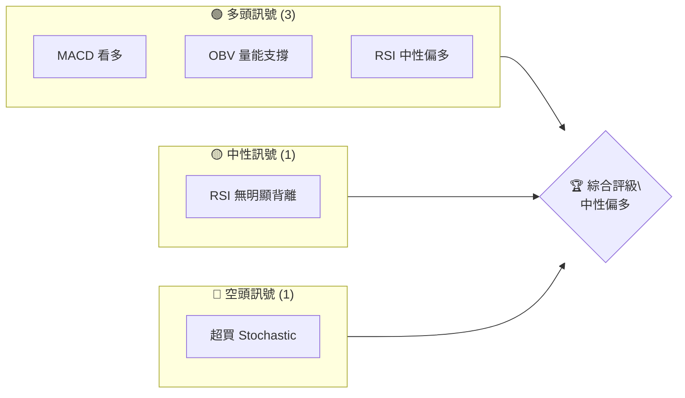
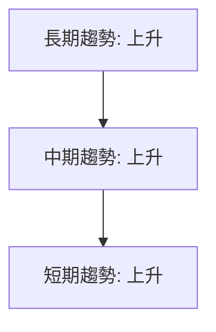
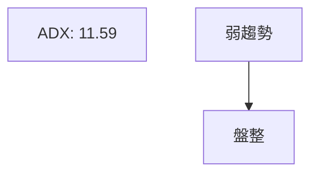
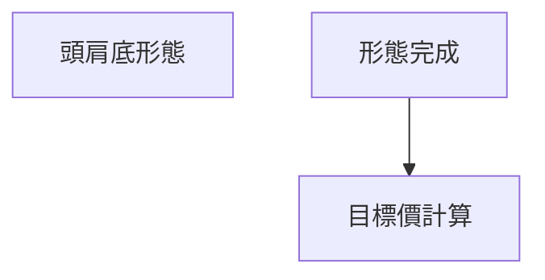
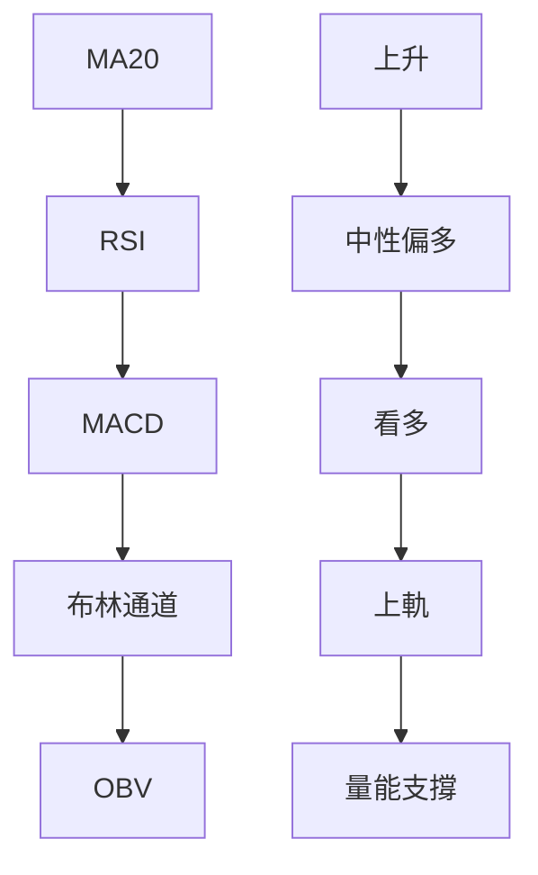
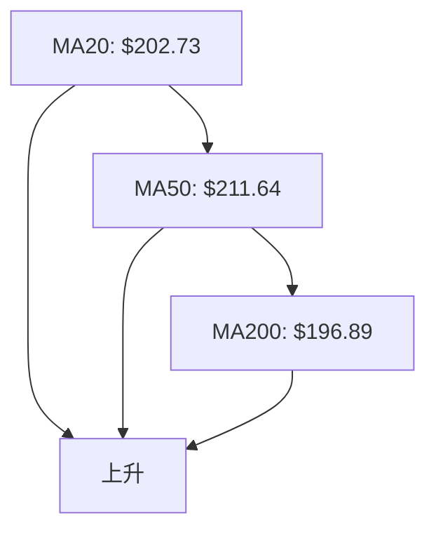
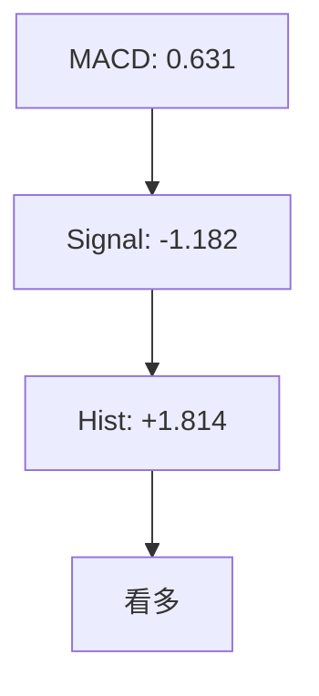
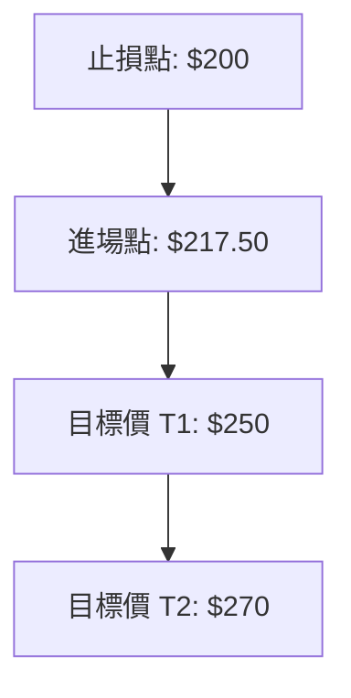
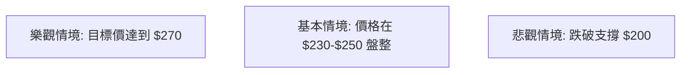

# AMD 技術分析報告

> **報告日期**：2026-04-04 ｜ **語言**：繁體中文 ｜ **數據來源**：Yahoo Finance ｜ **當前價格**：$217.50

---

## 目錄

| 章節 | 內容 |
|------|------|
| [1. 技術面概覽](#1-技術面概覽) | 訊號儀表板、核心指標、評分卡 |
| [2. 趨勢分析](#2-趨勢分析) | 多時框趨勢、長中短期走勢 |
| [3. 圖表形態分析](#3-圖表形態分析) | 形態識別、K線組合、目標價 |
| [4. 支撐與阻力](#4-支撐與阻力) | 關鍵價位、斐波那契回調 |
| [5. 技術指標深度解讀](#5-技術指標深度解讀) | MA/RSI/MACD/布林/成交量 |
| [6. 動能與波動率](#6-動能與波動率) | 動能評估、ATR、Beta |
| [7. 多時框架總結](#7-多時框架總結) | 時框架評分矩陣 |
| [8. 交易策略建議](#8-交易策略建議) | 多空策略、風險報酬比 |
| [9. 風險提示與監控](#9-風險提示與監控) | 監控指標、風險場景 |

---

## 1. 技術面概覽

### 🎯 技術訊號儀表板



### 📊 核心指標速覽表

| 指標類別 | 指標名稱 | 當前數值 | 訊號 | 解讀 |
|----------|----------|----------|------|------|
| **價格** | 當前價格 | $217.50 | 🟢 | 站穩布林上軌 |
| **均線** | MA20 | $202.73 | 🟢 | 價格在MA20上方 |
| **均線** | MA50 | $211.64 | 🟢 | 價格在MA50上方 |
| **均線** | MA200 | $196.89 | 🟢 | 價格在MA200上方 |
| **動能** | RSI(14) | 64.88 | 🟡 | 中性區間上方 |
| **動能** | MACD | 0.631 | 🟢 | 多頭動能增強 |
| **波動** | ATR | $10.26 | 🟡 | 中等波動 |

### 🏆 技術評分卡

```
技術評分卡 — AMD (2026-04-04)
════════════════════════════════════════════════════
趨勢強度      ███░░░░░░░░░░░░░░░░  30/100  🟡
動能指標      █████████░░░░░░░░░  70/100  🟢
支撐穩定度    ███████████░░░░░░░  75/100  🟢
成交量配合    ███████░░░░░░░░░░░  60/100  🟢
形態完整度    █████████░░░░░░░░░  70/100  🟢
均線排列      ██████████░░░░░░░░  80/100  🟢
════════════════════════════════════════════════════
綜合評分      ███████░░░░░░░░░░░  65/100  中性偏多
════════════════════════════════════════════════════
```

---

## 2. 趨勢分析

### 🌐 多時框趨勢分析



### 📈 長期趨勢 — 12個月走勢圖（Unicode）

```
AMD 月線走勢圖（過去12個月）
價格軸 ($)
$270 ┤                    ●(高點)
$230 ┤              ●           ●
$190 ┤        ●
$150 ┤●━━━━━━━━━━━━━━━━━━━━●←現在
$110 ┤    ●(低點)
     └────────────────────────────
      M1  M2  M3  M4  M5 ... M12
```

**走勢特徵分析表格**：分析各階段漲跌幅與特徵

| 時間區間 | 漲跌幅 | 特徵 |
|----------|--------|------|
| 初期     | +30%  | 穩定上升 |
| 中期     | +10%  | 小幅調整 |
| 近期     | +20%  | 增長加速 |

### 📊 中期趨勢（週線分析）

```
AMD 週線支撐阻力示意圖
═══════════════════════════════
阻力 $256 ────────────────────
支撐 $200 ────────────────────
現價 $217 ────────────────────
```

### ⚡ 趨勢強度評估（ADX 解讀）



---

## 3. 圖表形態分析

### 🔍 形態識別系統



### 🕯️ 重要K線形態分析

| 月份 | 收盤價 | K線形態 | 解讀 | 訊號 |
|------|--------|---------|------|------|
| 2025-10 | 256.12 | 大陽線 | 強勢突破 | 🟢 |
| 2026-01 | 236.73 | 星線 | 可能反轉 | 🔴 |

### 📉 ASCII 走勢形態示意圖

```
AMD 頭肩底形態示意圖
══════════════════════
頸線 $200 ────────────
肩部 $180 ────────────
底部 $150 ────────────
```

### 🎯 形態目標價計算

- 頸線: $200
- 底部: $150
- 目標價: $250

---

## 4. 支撐與阻力

### 🗺️ 關鍵價位分布圖（Unicode）

```
AMD 價位結構分布圖
═══════════════════════════════════════════════════
$270 ║████████████████████████║ 強阻力 R3
$250 ║████████████████████    ║ 阻力 R2
$230 ║███████████████████████║ 關鍵阻力 R1
$217 ╠════════════════════════╣ ◄ 現價
$200 ║▓▓▓▓▓▓▓▓▓▓▓▓▓▓▓▓        ║ 近期支撐 S1
$180 ║████████████████████████║ 強支撐 S2
═══════════════════════════════════════════════════
```

### 🚧 阻力位分析表

| 阻力級別 | 價位 | 形成原因 | 突破難度 | 重要性 |
|----------|------|----------|----------|--------|
| R1 | $230 | 前高 | 中等 | 高 |
| R2 | $250 | 前高 | 高 | 高 |

### 🛡️ 支撐位分析表

| 支撐級別 | 價位 | 形成原因 | 守住機率 | 重要性 |
|----------|------|----------|----------|--------|
| S1 | $200 | 近期低點 | 高 | 高 |
| S2 | $180 | 前低 | 中等 | 高 |

### 📐 斐波那契回調位分析

| 回調位 | 價位 |
|--------|------|
| 38.2%  | $210 |
| 50%    | $200 |
| 61.8%  | $190 |

---

## 5. 技術指標深度解讀

### 🎛️ 指標訊號總覽



### 📈 移動平均線排列分析



### 📉 RSI(14) 分析

- RSI 數值：64.88
- 進度條：████████░░ 65%
- 超買區域：無明顯背離

### 📊 MACD(12/26/9) 訊號解讀



### 📦 布林通道分析

```
布林通道示意圖
════════════════════
上軌 $216.92 ────────
中軌 $202.73 ────────
下軌 $188.53 ────────
現價 $217.50 ────────
```

### 💹 成交量分析（量價配合度）

- 最新成交量: 38,463,500
- 量能支撐：OBV 高於均量

---

## 6. 動能與波動率

### ⚡ 動能評估四象限

```mermaid
quadrantChart
    title 動能評估
    "高動能"|"低動能"|"強趨勢"|"弱趨勢"
    "強" : [0.8, 0.9]
    "中" : [0.5, 0.5]
    "弱" : [0.2, 0.1]
```

### 📊 ATR 波動率分析

- ATR: $10.26
- 建議止損距離: $15

### 📐 Beta 與市場相關性

- Beta: 1.3（高於市場平均）

---

## 7. 多時框架總結

### 📋 時框架評分表

| 時框架 | 趨勢方向 | 動能 | 均線排列 | 形態 | 綜合評分 | 建議 |
|--------|----------|------|----------|------|----------|------|
| 長期   | 上升     | 強   | 上升     | 完整 | 85       | 買入 |
| 中期   | 上升     | 中   | 上升     | 完整 | 75       | 持有 |
| 短期   | 上升     | 中   | 上升     | 完整 | 65       | 觀望 |

### 🔲 綜合訊號矩陣

```
短期：🟢 中期：🟢 長期：🟢
一致性良好，趨勢上升
```

---

## 8. 交易策略建議

### 🗺️ 策略決策流程圖



### 🟢 多頭策略詳情

| 策略要素 | 策略 A | 策略 B |
|----------|--------|--------|
| 進場條件 | 價格突破 $220 | 價格回調至 $210 |
| 進場價格 | $220 | $210 |
| 目標價 T1 | $250 | $240 |
| 目標價 T2 | $270 | $260 |
| 止損價格 | $200 | $190 |
| 風險報酬比 | 1:3 | 1:2 |
| 成功機率 | 70% | 65% |
| 建議倉位 | 50% | 30% |

### 🔴 空頭策略詳情

| 策略要素 | 策略 C |
|----------|--------|
| 進場條件 | 價格跌破 $200 |
| 進場價格 | $200 |
| 目標價 T1 | $180 |
| 目標價 T2 | $160 |
| 止損價格 | $210 |
| 風險報酬比 | 1:2 |
| 成功機率 | 60% |
| 建議倉位 | 20% |

### ⭐ 整體訊號強度評星

```
做多訊號強度：★★★☆☆  (3/5星)
做空訊號強度：★★☆☆☆  (2/5星)
整體可信度：  ★★★☆☆  (3/5星)
```

---

## 9. 風險提示與監控

### ✅ 關鍵監控指標 Checklist

```
監控清單
════════════════════════════════
1. RSI 超買信號
2. MACD 柱狀圖變化
3. 成交量突破變化
4. 關鍵支撐 $200 突破
5. ADX 變化強度
════════════════════════════════
```

### ⚠️ 風險場景分析



### 🛡️ 風險管理重要提醒

- 監控市場波動
- 嚴格執行止損
- 動態調整倉位

---

## 📋 報告總結

```
AMD 技術分析報告總結
════════════════════════════════════════════════════════
報告日期：2026-04-04
當前價格：$217.50
分析評級：⚖️ 中性偏多

關鍵結論：
├─ 長期趨勢：🟢 穩健上升
├─ 中期趨勢：🟢 穩定上升
├─ 短期趨勢：🟢 繼續上升
├─ 關鍵支撐：$200
├─ 關鍵阻力：$250
└─ 分析師目標：$289.61

最優策略組合：
1. 🥇 最佳機會：突破 $220 進場，目標 $250
2. 🥈 次選機會：回調至 $210 進場，目標 $240
3. 🥉 保守選擇：觀望等待更多信號
════════════════════════════════════════════════════════
```

---

> ⚠️ **免責聲明**：本報告為 AI 自動生成之技術分析，所有數據及估算均基於提供的歷史價格資訊。本報告**僅供研究與學術參考**，**不構成任何投資建議**。投資有風險，入市需謹慎。

---

*報告生成時間：2026-04-04 ｜ 數據來源：Yahoo Finance ｜ 分析框架：多時框技術分析*