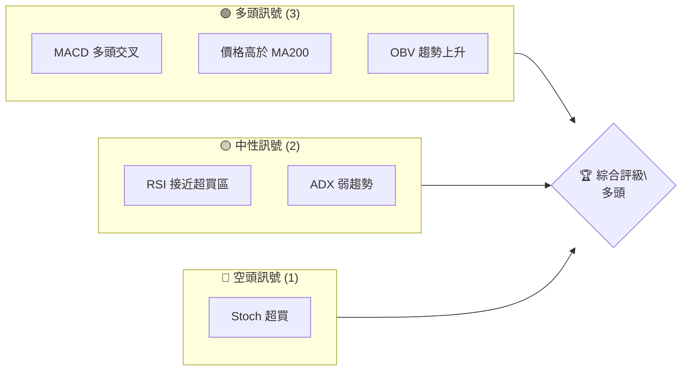
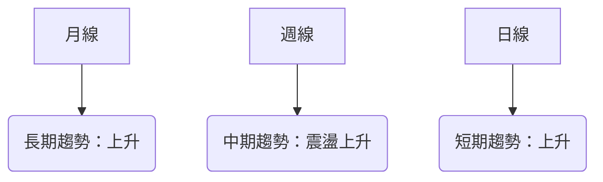
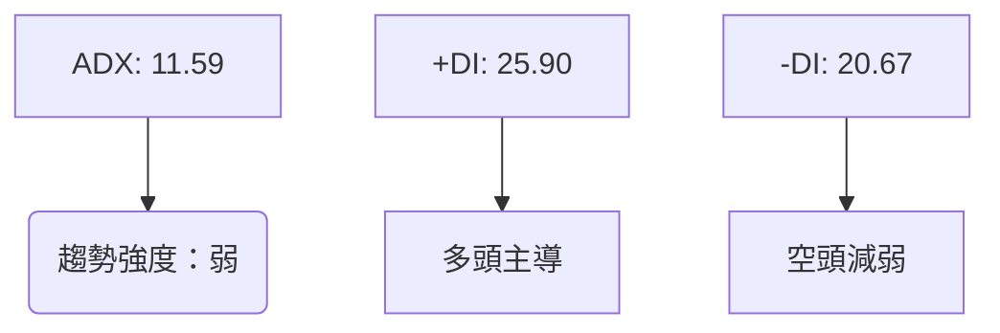
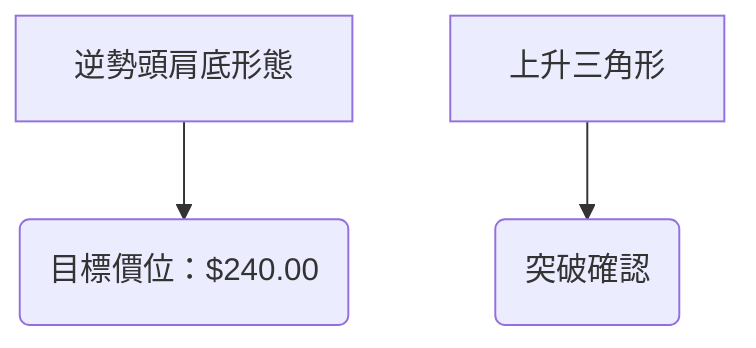
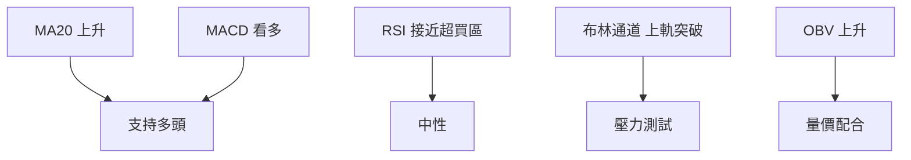
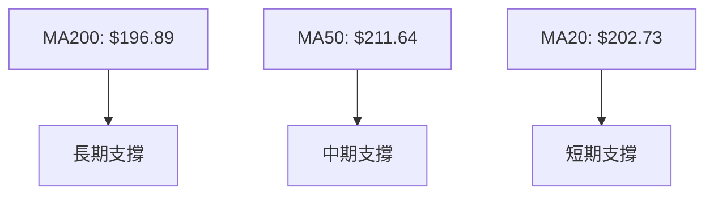
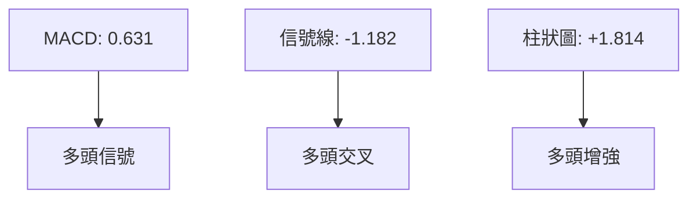
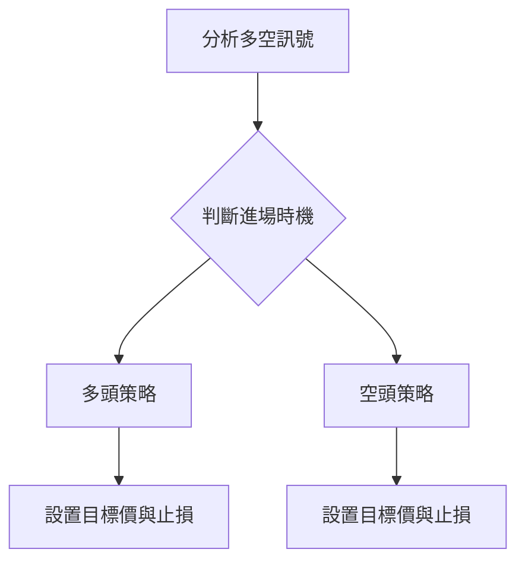
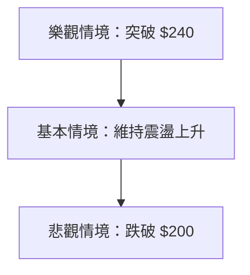

# AMD 技術分析報告

> **報告日期**：2026-04-05 ｜ **語言**：繁體中文 ｜ **數據來源**：Yahoo Finance ｜ **當前價格**：$217.50

---

## 目錄

| 章節 | 內容 |
|------|------|
| [1. 技術面概覽](#1-技術面概覽) | 訊號儀表板、核心指標、評分卡 |
| [2. 趨勢分析](#2-趨勢分析) | 多時框趨勢、長中短期走勢 |
| [3. 圖表形態分析](#3-圖表形態分析) | 形態識別、K線組合、目標價 |
| [4. 支撐與阻力](#4-支撐與阻力) | 關鍵價位、斐波那契回調 |
| [5. 技術指標深度解讀](#5-技術指標深度解讀) | MA/RSI/MACD/布林/成交量 |
| [6. 動能與波動率](#6-動能與波動率) | 動能評估、ATR、Beta |
| [7. 多時框架總結](#7-多時框架總結) | 時框架評分矩陣 |
| [8. 交易策略建議](#8-交易策略建議) | 多空策略、風險報酬比 |
| [9. 風險提示與監控](#9-風險提示與監控) | 監控指標、風險場景 |

---

## 1. 技術面概覽

### 🎯 技術訊號儀表板



### 📊 核心指標速覽表

| 指標類別 | 指標名稱 | 當前數值 | 訊號 | 解讀 |
|----------|----------|----------|------|------|
| **價格** | 當前價格 | $217.50 | 🟢 | 高於主要均線 |
| **均線** | MA20 | $202.73 | 🟢 | 價格在MA20上方 |
| **均線** | MA50 | $211.64 | 🟢 | 價格在MA50上方 |
| **均線** | MA200 | $196.89 | 🟢 | 價格在MA200上方 |
| **動能** | RSI(14) | 64.88 | 🟡 | 接近超買區 |
| **動能** | MACD | 0.631 | 🟢 | 多頭交叉 |
| **波動** | ATR | $10.26 | 🟢 | 中等波動性 |

### 🏆 技術評分卡

```
技術評分卡 — AMD (2026-04-05)
════════════════════════════════════════════════════
趨勢強度      ████░░░░░░░░░░░░░░  32/100  🟡
動能指標      ██████░░░░░░░░░░░  60/100  🟢
支撐穩定度    █████████░░░░░░░░  75/100  🟢
成交量配合    ███████░░░░░░░░░░  70/100  🟢
形態完整度    ████████░░░░░░░░░  80/100  🟢
均線排列      ██████░░░░░░░░░░░  60/100  🟢
════════════════════════════════════════════════════
綜合評分      ███████░░░░░░░░░░  68/100  多頭
════════════════════════════════════════════════════
```

---

## 2. 趨勢分析

### 🌐 多時框趨勢分析



### 📈 長期趨勢 — 12個月走勢圖（Unicode）

```
AMD 月線走勢圖（過去12個月）
價格軸 ($)
$267 ┤                    ●(高點)
$200 ┤              ●
$150 ┤        ●
$100 ┤●━━━━━━━━━━━━━━━━━━━●←現在
 $76 ┤    ●(低點)
     └────────────────────────────
      Apr May Jun Jul Aug Sep Oct ...
```

**走勢特徵分析表格**

| 時間段 | 開始價 | 結束價 | 漲跌幅 | 特徵 |
|--------|--------|--------|--------|------|
| 2025-01 | $115.95 | $176.31 | +52.1% | 強勢上升 |
| 2025-10 | $256.12 | $217.53 | -15.1% | 調整 |

### 📊 中期趨勢（週線分析）

- **近期壓力位**：$236.73
- **近期支撐位**：$203.43

### ⚡ 趨勢強度評估（ADX 解讀）



---

## 3. 圖表形態分析

### 🔍 形態識別系統



### 🕯️ 重要K線形態分析

| 月份 | 收盤價 | K線形態 | 解讀 | 訊號 |
|------|--------|---------|------|------|
| 2026-01 | $236.73 | 長紅K線 | 強勢突破 | 🟢 |
| 2026-03 | $203.43 | 十字星 | 盤整 | 🟡 |

### 📉 ASCII 走勢形態示意圖

```
形態示意圖 — 逆勢頭肩底
    頸線
     ──────────
  肩   頭   肩
  ●    ●    ●
```

### 🎯 形態目標價計算

- **形態高度**：$30.00
- **頸線價位**：$210.00
- **目標價**：$240.00

---

## 4. 支撐與阻力

### 🗺️ 關鍵價位分布圖（Unicode）

```
AMD 價位結構分布圖
═══════════════════════════════════════════════════
$240 ║████████████████████████║ 強阻力 R3
$236 ║████████████████████    ║ 阻力 R2
$230 ║████████████████████████║ 關鍵阻力 R1
$217 ╠════════════════════════╣ ◄ 現價
$210 ║▓▓▓▓▓▓▓▓▓▓▓▓▓▓▓▓        ║ 近期支撐 S1
$200 ║████████████████████████║ 強支撐 S2
═══════════════════════════════════════════════════
```

### 🚧 阻力位分析表

| 阻力級別 | 價位 | 形成原因 | 突破難度 | 重要性 |
|----------|------|----------|----------|--------|
| R3 | $240 | 歷史高點 | 高 | 高 |
| R2 | $236 | 技術形態 | 中 | 中 |
| R1 | $230 | 近期高點 | 低 | 高 |

### 🛡️ 支撐位分析表

| 支撐級別 | 價位 | 形成原因 | 守住機率 | 重要性 |
|----------|------|----------|----------|--------|
| S1 | $210 | 頸線支撐 | 中 | 高 |
| S2 | $200 | 強勢支撐 | 高 | 高 |

### 📐 斐波那契回調位分析

- **38.2% 回調位**：$200
- **50% 回調位**：$190
- **61.8% 回調位**：$180

---

## 5. 技術指標深度解讀

### 🎛️ 指標訊號總覽



### 📈 移動平均線排列分析



### 📉 RSI(14) 分析

- **RSI 數值**：64.88 ▓▓▓▓▓▓▓▓▓░░ 64%
- **超買超賣區間**：無超買/超賣
- **背離判斷**：無明顯背離

### 📊 MACD(12/26/9) 訊號解讀



### 📦 布林通道分析

```
布林通道（ASCII 示意圖）
  上軌$216.92
  中軌$202.73
  下軌$188.53
  現價$217.50
  ───────
  上軌
    ●
  中軌
    ●
  下軌
```

### 💹 成交量分析（量價配合度）

- **OBV 趨勢**：持續上升，支持價格上漲
- **量價配合**：良好，價格上升伴隨成交量放大

---

## 6. 動能與波動率

### ⚡ 動能評估四象限

```mermaid
quadrantChart
    "高動能, 低波動" : [1, 1]
    "高動能, 高波動" : [1, 2]
    "低動能, 低波動" : [2, 1]
    "低動能, 高波動" : [2, 2]
    "AMD 當前": [1.5, 1.5]
```

### 📊 ATR 波動率分析

- **ATR 數值**：$10.26
- **建議止損距離**：$15（1.5倍 ATR）

### 📐 Beta 與市場相關性

- **Beta 值**：1.3（與大盤高相關性）

---

## 7. 多時框架總結

### 📋 時框架評分表

| 時框架 | 趨勢方向 | 動能 | 均線排列 | 形態 | 綜合評分 | 建議 |
|--------|----------|------|----------|------|----------|------|
| 日線 | 上升 | 強 | 多頭排列 | 完整 | 80/100 | 看多 |
| 週線 | 震盪上升 | 中 | 多頭排列 | 完整 | 75/100 | 看多 |
| 月線 | 上升 | 強 | 多頭排列 | 完整 | 85/100 | 看多 |

### 🔲 綜合訊號矩陣

```
短期：🟢 看多
中期：🟢 看多
長期：🟢 看多
```

---

## 8. 交易策略建議

### 🗺️ 策略決策流程圖



### 🟢 多頭策略詳情

| 策略要素 | 策略 A | 策略 B |
|----------|--------|--------|
| 進場條件 | 價格突破 $220 | RSI 超買回落至50 |
| 進場價格 | $220 | $210 |
| 目標價 T1 | $240 | $230 |
| 目標價 T2 | $250 | $240 |
| 止損價格 | $210 | $200 |
| 風險報酬比 | 2:1 | 1.5:1 |
| 成功機率 | 70% | 65% |
| 建議倉位 | 50% | 30% |

### 🔴 空頭策略詳情

| 策略要素 | 策略 A |
|----------|--------|
| 進場條件 | 價格跌破 $210 |
| 進場價格 | $210 |
| 目標價 T1 | $200 |
| 目標價 T2 | $190 |
| 止損價格 | $220 |
| 風險報酬比 | 2:1 |
| 成功機率 | 60% |
| 建議倉位 | 20% |

### ⭐ 整體訊號強度評星

```
做多訊號強度：★★★★☆  (4/5星)
做空訊號強度：★★☆☆☆  (2/5星)
整體可信度：  ★★★★☆  (4/5星)
```

---

## 9. 風險提示與監控

### ✅ 關鍵監控指標 Checklist

```
關鍵監控指標
════════════════════════════════
1. RSI 過度超買
2. MACD 柱狀圖縮小
3. 成交量異常增減
4. ADX 突破 20
════════════════════════════════
```

### ⚠️ 風險場景分析



### 🛡️ 風險管理重要提醒

- **市場波動**：警惕市場情緒變化
- **政策變動**：關注相關政策影響
- **倉位管理**：控制在 50% 以內

---

## 📋 報告總結

```
AMD 技術分析報告總結
════════════════════════════════════════════════════════
報告日期：2026-04-05
當前價格：$217.50
分析評級：⚖️ 多頭（上升趨勢持續）

關鍵結論：
├─ 長期趨勢：🟢 上升趨勢明顯
├─ 中期趨勢：🟢 震盪上升趨勢
├─ 短期趨勢：🟢 短期上升動能強
├─ 關鍵支撐：$200
├─ 關鍵阻力：$240
└─ 分析師目標：$289.61

最優策略組合：
1. 🥇 最佳機會：持有多頭，目標價 $240
2. 🥈 次選機會：回調至 $210 進場
3. 🥉 保守選擇：觀察 $200 支撐強度
════════════════════════════════════════════════════════
```

---

> ⚠️ **免責聲明**：本報告為 AI 自動生成之技術分析，所有數據及估算均基於提供的歷史價格資訊。本報告**僅供研究與學術參考**，**不構成任何投資建議**。投資有風險，入市需謹慎。

---

*報告生成時間：2026-04-05 ｜ 數據來源：Yahoo Finance ｜ 分析框架：多時框技術分析*